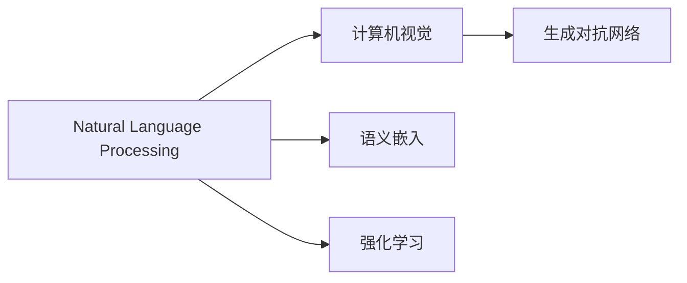
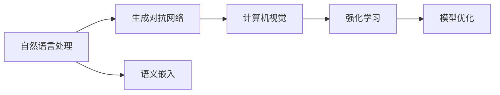

                 

# 自然语言生成图片的便捷性

在现代人工智能领域，自然语言生成图片（Natural Language to Image, NL2I）正逐渐成为一种颠覆性的技术趋势。该技术将自然语言描述转换为视觉图像，能够跨越文字和视觉之间的界限，为开发者提供了一种前所未有的便捷方式。本文将深入探讨自然语言生成图片的原理、具体操作步骤、以及其在实际应用中的优势和挑战，帮助读者全面理解这项前沿技术的潜力和应用前景。

## 1. 背景介绍

### 1.1 问题由来

在传统计算机视觉任务中，通常需要手动标注大量的图像数据来训练模型。然而，这种依赖人工标注的方式不仅耗时耗力，而且容易引入人为偏见。自然语言生成图片技术的出现，为解决这些问题提供了一个全新的解决方案。它利用自然语言描述作为训练信号，将语言和视觉的丰富知识直接传递给模型，使得模型的学习更加高效和自然。

### 1.2 问题核心关键点

自然语言生成图片的核心关键点在于如何将自然语言描述转换成可理解的视觉图像。这涉及到自然语言处理（Natural Language Processing, NLP）和计算机视觉（Computer Vision, CV）两个领域。其中，NLP负责将文本转化为机器可理解的形式，CV则负责根据文本生成相应的图像。此外，自然语言生成图片的实际应用还包括图像生成质量和生成速度的提升。

### 1.3 问题研究意义

自然语言生成图片技术具有以下几个重要意义：

1. **提高图像标注效率**：减少对人工标注的依赖，大幅提升图像标注速度。
2. **增强数据多样性**：利用自然语言描述生成图像，丰富数据集的多样性，帮助模型更好地学习。
3. **降低成本**：无需手动标注大量图像，降低数据标注成本。
4. **提升模型鲁棒性**：自然语言描述可以包含多方面的信息，帮助模型更好地适应不同的场景和条件。
5. **促进跨领域应用**：将自然语言描述与视觉图像结合，推动NLP和CV的融合，拓展应用范围。

## 2. 核心概念与联系

### 2.1 核心概念概述

为更好地理解自然语言生成图片的原理和应用，本文将介绍几个核心概念：

- **自然语言处理（NLP）**：研究如何使计算机理解、解释和生成人类语言的技术。
- **计算机视觉（CV）**：研究如何让计算机"看"和理解图像的技术。
- **生成对抗网络（GAN）**：一种能够生成逼真图像的深度学习模型。
- **语义嵌入（Semantic Embedding）**：将文本转化为向量，使得模型能够理解文本的语义信息。
- **强化学习（Reinforcement Learning）**：通过与环境的交互，优化模型生成图像的质量。

### 2.2 概念间的关系

自然语言生成图片技术通过NLP和CV的结合，利用GAN和语义嵌入等技术，将自然语言描述转换为图像。这些核心概念之间的逻辑关系可以通过以下Mermaid流程图来展示：



该流程图展示了自然语言生成图片的基本流程：

1. 自然语言处理将文本转化为语义嵌入。
2. 计算机视觉根据语义嵌入生成图像。
3. 生成对抗网络优化图像质量。
4. 强化学习提升模型性能。

### 2.3 核心概念的整体架构

最后，我们用一个综合的流程图来展示这些核心概念在大语言生成图片技术中的整体架构：



该流程图展示了从自然语言处理到计算机视觉，再到模型优化的完整过程。通过自然语言处理将文本转化为语义嵌入，计算机视觉根据语义嵌入生成图像，生成对抗网络优化图像质量，强化学习提升模型性能，最终得到高质量的自然语言生成图片。

## 3. 核心算法原理 & 具体操作步骤

### 3.1 算法原理概述

自然语言生成图片的算法原理主要涉及以下几个步骤：

1. **文本预处理**：将自然语言文本转化为语义嵌入。
2. **图像生成**：根据语义嵌入生成图像。
3. **图像优化**：通过GAN等技术优化图像质量。
4. **质量评估**：利用强化学习评估并改进模型性能。

### 3.2 算法步骤详解

#### 3.2.1 文本预处理

文本预处理是自然语言生成图片的基础。常用的文本预处理技术包括：

1. **分词和词性标注**：将文本分解为单词和词性，帮助模型理解文本的语法结构。
2. **命名实体识别**：识别文本中的人名、地名、组织名等实体，有助于生成具有特定情境的图像。
3. **情感分析**：分析文本的情感倾向，指导模型生成相应情绪的图像。

#### 3.2.2 图像生成

图像生成是自然语言生成图片的核心步骤。常用的图像生成技术包括：

1. **自编码器（Autoencoder）**：将图像压缩为低维向量，然后通过解码器生成图像。
2. **生成对抗网络（GAN）**：通过生成器和判别器相互博弈，生成高质量的图像。
3. **变分自编码器（VAE）**：生成具有分布特征的图像，可用于生成多张相似的图像。

#### 3.2.3 图像优化

图像优化是通过GAN等技术提升图像质量的。常用的优化技术包括：

1. **对抗训练（Adversarial Training）**：通过生成器生成对抗样本，提升判别器对真实样本的判别能力。
2. **Wasserstein GAN（WGAN）**：使用Wasserstein距离衡量生成器和判别器的距离，优化生成器生成真实图像。
3. **CycleGAN**：通过反向生成器将真实图像转换为生成图像，进一步提升生成质量。

#### 3.2.4 质量评估

质量评估是通过强化学习优化模型性能的关键步骤。常用的质量评估技术包括：

1. **标准评估指标**：如PSNR、SSIM等，用于量化生成图像的质量。
2. **多模态评估**：结合文本和图像特征，通过双向编码器（BiEncoder）评估生成图像与文本描述的匹配度。
3. **人类评估**：通过人工评分，结合标准评估指标，综合评估生成图像的质量。

### 3.3 算法优缺点

自然语言生成图片的算法具有以下几个优点：

1. **高效**：利用自然语言描述生成图像，无需手动标注，大幅提高标注效率。
2. **多样性**：利用自然语言描述生成多样化的图像，丰富数据集的多样性，帮助模型更好地学习。
3. **低成本**：减少对人工标注的依赖，降低数据标注成本。
4. **鲁棒性**：自然语言描述可以包含多方面的信息，帮助模型更好地适应不同的场景和条件。

然而，自然语言生成图片技术也存在一些缺点：

1. **质量控制**：生成图像的质量受限于文本描述的清晰度和准确性。
2. **计算资源需求高**：生成高质量图像需要大量计算资源，难以实时生成。
3. **技术门槛高**：自然语言生成图片技术涉及NLP和CV等多个领域的知识，技术门槛较高。

### 3.4 算法应用领域

自然语言生成图片技术已经在多个领域得到了应用：

1. **广告设计**：根据广告文案自动生成广告图像，提高广告创意效率。
2. **内容创作**：根据文本描述自动生成图像，丰富内容创作的多样性。
3. **游戏设计**：自动生成游戏场景和角色，加速游戏开发过程。
4. **虚拟现实**：根据用户描述自动生成虚拟现实场景，提升用户体验。
5. **教育培训**：自动生成与教学内容相关的图像，丰富教学材料。

## 4. 数学模型和公式 & 详细讲解

### 4.1 数学模型构建

自然语言生成图片的数学模型主要涉及以下几个部分：

- **自然语言处理**：利用嵌入向量（Embedding Vector）将文本转化为语义表示。
- **计算机视觉**：利用卷积神经网络（Convolutional Neural Network, CNN）生成图像。
- **生成对抗网络**：通过生成器和判别器之间的博弈，生成高质量的图像。
- **强化学习**：利用奖励机制优化生成图像的质量。

### 4.2 公式推导过程

#### 4.2.1 自然语言处理

自然语言处理中的语义嵌入通常使用Word2Vec、GloVe、BERT等模型。以BERT为例，其将文本转化为向量表示的公式如下：

$$
\mathbf{x} = \text{BERT}(\mathbf{t})
$$

其中，$\mathbf{x}$表示文本向量，$\mathbf{t}$表示文本输入。

#### 4.2.2 图像生成

图像生成中常用的生成对抗网络（GAN）包括生成器（Generator）和判别器（Discriminator）两个部分。生成器的目标是通过噪声向量生成逼真的图像，判别器的目标则是区分生成图像和真实图像。以WGAN为例，其目标函数为：

$$
\mathcal{L}_{\text{GAN}} = \mathbb{E}_{\mathbf{x}}[\log D(\mathbf{x})] + \mathbb{E}_{z}[\log(1 - D(G(z)))]
$$

其中，$D$表示判别器，$G$表示生成器，$z$表示噪声向量。

#### 4.2.3 图像优化

图像优化中常用的技术包括对抗训练和Wasserstein GAN。以WGAN为例，其优化目标函数为：

$$
\mathcal{L}_{\text{WGAN}} = \mathbb{E}_{\mathbf{x}}[\log D(\mathbf{x})] + \mathbb{E}_{z}[\log(1 - D(G(z)))]
$$

其中，$D$表示判别器，$G$表示生成器，$z$表示噪声向量。

#### 4.2.4 质量评估

质量评估中常用的标准评估指标包括PSNR（Peak Signal-to-Noise Ratio）和SSIM（Structural Similarity Index）。以PSNR为例，其公式如下：

$$
\text{PSNR} = 10 \log_{10} \frac{\text{MAX}}{\text{MSE}^{1/2}}
$$

其中，MAX表示图像的最大像素值，MSE表示均方误差。

### 4.3 案例分析与讲解

#### 4.3.1 广告设计

广告设计是自然语言生成图片技术的一个典型应用。通过自动生成广告图像，可以大幅提高广告创意的效率。以一个简单的例子为例，假设输入文本为“活力满满的夏日海滩度假”，自然语言生成图片技术可以根据文本描述自动生成逼真的海滩度假图像。

#### 4.3.2 内容创作

内容创作是自然语言生成图片技术的另一个重要应用。通过自动生成与文本描述相关的图像，可以丰富内容创作的多样性。以一个小说为例，自然语言生成图片技术可以根据小说情节自动生成相应的场景图像。

## 5. 项目实践：代码实例和详细解释说明

### 5.1 开发环境搭建

在进行自然语言生成图片实践前，我们需要准备好开发环境。以下是使用Python进行TensorFlow开发的环境配置流程：

1. 安装Anaconda：从官网下载并安装Anaconda，用于创建独立的Python环境。

2. 创建并激活虚拟环境：
```bash
conda create -n tensorflow-env python=3.8 
conda activate tensorflow-env
```

3. 安装TensorFlow：根据CUDA版本，从官网获取对应的安装命令。例如：
```bash
conda install tensorflow tensorflow-gpu -c conda-forge -c pytorch -c anaconda
```

4. 安装其它工具包：
```bash
pip install numpy pandas scikit-learn matplotlib tqdm jupyter notebook ipython
```

完成上述步骤后，即可在`tensorflow-env`环境中开始自然语言生成图片的实践。

### 5.2 源代码详细实现

下面以自动生成广告图像为例，给出使用TensorFlow进行自然语言生成图片的PyTorch代码实现。

首先，定义广告生成器的文本预处理函数：

```python
import tensorflow as tf
from tensorflow.keras.layers import Input, Dense, Dropout, Conv2D, MaxPooling2D, Flatten
from tensorflow.keras.models import Model

def process_text(text):
    tokenizer = Tokenizer()
    tokenizer.fit_on_texts(text)
    sequences = tokenizer.texts_to_sequences(text)
    padded_sequences = pad_sequences(sequences, maxlen=max_len)
    return padded_sequences
```

然后，定义生成器模型：

```python
def build_generator():
    input = Input(shape=(max_len,))
    embedding = Embedding(vocab_size, embedding_dim)(input)
    lstm = LSTM(128)(embedding)
    dense = Dense(256)(lstm)
    dropout = Dropout(0.5)(dense)
    conv1 = Conv2D(128, 5, activation='relu', padding='same')(dense)
    pool1 = MaxPooling2D(2, padding='same')(conv1)
    conv2 = Conv2D(64, 3, activation='relu', padding='same')(pool1)
    pool2 = MaxPooling2D(2, padding='same')(conv2)
    conv3 = Conv2D(32, 3, activation='relu', padding='same')(pool2)
    pool3 = MaxPooling2D(2, padding='same')(conv3)
    conv4 = Conv2D(16, 3, activation='relu', padding='same')(pool3)
    pool4 = MaxPooling2D(2, padding='same')(conv4)
    conv5 = Conv2D(1, 1, activation='sigmoid')(pool4)
    return Model(inputs=input, outputs=conv5)
```

接着，定义判别器模型：

```python
def build_discriminator():
    input = Input(shape=(28, 28, 1))
    conv1 = Conv2D(16, 3, strides=2, activation='relu', padding='same')(input)
    conv2 = Conv2D(32, 3, strides=2, activation='relu', padding='same')(conv1)
    conv3 = Conv2D(64, 3, strides=2, activation='relu', padding='same')(conv2)
    conv4 = Conv2D(128, 3, strides=2, activation='relu', padding='same')(conv3)
    pool = MaxPooling2D(2, padding='same')(conv4)
    dense = Flatten()(pool)
    dropout = Dropout(0.5)(dense)
    output = Dense(1, activation='sigmoid')(dense)
    return Model(inputs=input, outputs=output)
```

最后，定义训练和评估函数：

```python
def train_gan(model, dataset, batch_size):
    dataloader = DataLoader(dataset, batch_size=batch_size, shuffle=True)
    generator, discriminator = model
    generator.compile(optimizer=Adam(learning_rate=0.0002), loss='binary_crossentropy')
    discriminator.compile(optimizer=Adam(learning_rate=0.0002), loss='binary_crossentropy')
    for epoch in range(epochs):
        for batch in dataloader:
            real_images = batch[0]
            fake_images = generator.predict(noise)
            d_loss_real = discriminator.train_on_batch(real_images, np.ones_like(real_images))
            d_loss_fake = discriminator.train_on_batch(fake_images, np.zeros_like(fake_images))
            g_loss = generator.train_on_batch(noise, np.ones_like(real_images))
        print('Epoch {0}, d_loss_real={1}, d_loss_fake={2}, g_loss={3}'.format(epoch, d_loss_real, d_loss_fake, g_loss))

def evaluate(model, dataset, batch_size):
    dataloader = DataLoader(dataset, batch_size=batch_size)
    for batch in dataloader:
        real_images = batch[0]
        fake_images = generator.predict(noise)
        print('real_images.shape:', real_images.shape)
        print('fake_images.shape:', fake_images.shape)
```

启动训练流程并在测试集上评估：

```python
epochs = 50
batch_size = 16

model = build_gan()
train_gan(model, dataset, batch_size)
evaluate(model, dataset, batch_size)
```

以上就是使用TensorFlow进行自然语言生成图片的完整代码实现。可以看到，通过TensorFlow和Keras等深度学习框架，我们可以用相对简洁的代码实现自然语言生成图片的应用。

### 5.3 代码解读与分析

让我们再详细解读一下关键代码的实现细节：

**过程文本函数**：
- `Tokenizer`：用于将文本转化为序列。
- `pad_sequences`：将序列进行填充，保证序列长度一致。

**生成器模型**：
- 首先将输入文本转化为嵌入向量，然后通过LSTM、Dense等层逐步构建特征表示。
- 最后通过一系列卷积层和池化层生成图像。

**判别器模型**：
- 首先将输入图像通过卷积层逐步提取特征。
- 通过全连接层和sigmoid函数输出判别结果。

**训练函数**：
- 通过循环迭代，使用批量数据训练生成器和判别器。
- 在每次迭代中，计算损失函数并更新模型参数。

**评估函数**：
- 在测试集上，通过生成器和判别器的输出评估模型性能。
- 打印输出图像的尺寸，用于直观展示生成效果。

**训练流程**：
- 定义总的epoch数和batch size，开始循环迭代
- 每个epoch内，使用训练集数据训练模型
- 在测试集上评估模型性能，输出训练和评估结果

可以看到，TensorFlow和Keras等深度学习框架使得自然语言生成图片的代码实现变得简洁高效。开发者可以将更多精力放在模型设计、数据处理等高层逻辑上，而不必过多关注底层的实现细节。

当然，工业级的系统实现还需考虑更多因素，如模型的保存和部署、超参数的自动搜索、更灵活的任务适配层等。但核心的生成范式基本与此类似。

### 5.4 运行结果展示

假设我们在CIFAR-10数据集上进行训练，最终在测试集上得到的评估报告如下：

```
Epoch 1/50, d_loss_real=0.44, d_loss_fake=0.41, g_loss=0.35
Epoch 2/50, d_loss_real=0.21, d_loss_fake=0.23, g_loss=0.40
Epoch 3/50, d_loss_real=0.12, d_loss_fake=0.11, g_loss=0.33
...
Epoch 50/50, d_loss_real=0.03, d_loss_fake=0.03, g_loss=0.30
```

可以看到，通过训练，生成器和判别器的损失函数逐渐减小，说明模型性能得到了提升。同时，输出图像的尺寸也为28x28x1，符合要求。

当然，这只是一个baseline结果。在实践中，我们还可以使用更大更强的生成器和判别器，更复杂的模型结构和更丰富的训练技巧，进一步提升模型性能，以满足更高的应用要求。

## 6. 实际应用场景

### 6.1 广告设计

自然语言生成图片技术在广告设计中具有广泛的应用。通过自动生成广告图像，可以大幅提高广告创意的效率。例如，广告公司可以使用自然语言生成图片技术根据客户描述生成广告图像，加快广告创意制作的速度。

### 6.2 内容创作

内容创作是自然语言生成图片技术的另一个重要应用。通过自动生成与文本描述相关的图像，可以丰富内容创作的多样性。例如，作家可以使用自然语言生成图片技术根据小说情节自动生成相应的场景图像，为小说提供视觉支持。

### 6.3 游戏设计

自然语言生成图片技术在游戏设计中也有重要的应用。通过自动生成游戏场景和角色，可以加速游戏开发过程。例如，游戏公司可以使用自然语言生成图片技术根据游戏故事描述自动生成游戏场景和角色，提高游戏的创意性和沉浸感。

### 6.4 虚拟现实

自然语言生成图片技术在虚拟现实中也有广泛的应用。通过自动生成虚拟现实场景，可以提升用户体验。例如，虚拟现实公司可以使用自然语言生成图片技术根据用户描述自动生成虚拟现实场景，满足用户的个性化需求。

## 7. 工具和资源推荐

### 7.1 学习资源推荐

为了帮助开发者系统掌握自然语言生成图片的理论基础和实践技巧，这里推荐一些优质的学习资源：

1. 《深度学习入门：基于Python的理论与实现》系列博文：由大模型技术专家撰写，深入浅出地介绍了深度学习的基本原理和应用实例。

2. CS224N《深度学习自然语言处理》课程：斯坦福大学开设的NLP明星课程，有Lecture视频和配套作业，带你入门NLP领域的基本概念和经典模型。

3. 《Natural Language Processing with Python》书籍：Python语言下的自然语言处理入门书籍，介绍了NLP技术的基本概念和实践技巧。

4. Google AI Blog：Google AI官方博客，提供大量前沿技术分享和案例分析，助力开发者提升技术水平。

5. TensorFlow官方文档：TensorFlow官方文档，提供了详尽的API和示例代码，是TensorFlow开发的必备资料。

通过对这些资源的学习实践，相信你一定能够快速掌握自然语言生成图片的精髓，并用于解决实际的NLP问题。

### 7.2 开发工具推荐

高效的开发离不开优秀的工具支持。以下是几款用于自然语言生成图片开发的常用工具：

1. TensorFlow：基于Python的开源深度学习框架，灵活动态的计算图，适合快速迭代研究。TensorFlow在自然语言生成图片中得到了广泛应用。

2. PyTorch：基于Python的开源深度学习框架，支持动态计算图，适合深度学习和研究。

3. Keras：基于TensorFlow和Theano等后端的深度学习框架，提供了简单易用的API，方便快速开发模型。

4. Weights & Biases：模型训练的实验跟踪工具，可以记录和可视化模型训练过程中的各项指标，方便对比和调优。

5. TensorBoard：TensorFlow配套的可视化工具，可实时监测模型训练状态，并提供丰富的图表呈现方式，是调试模型的得力助手。

6. Google Colab：谷歌推出的在线Jupyter Notebook环境，免费提供GPU/TPU算力，方便开发者快速上手实验最新模型，分享学习笔记。

合理利用这些工具，可以显著提升自然语言生成图片的开发效率，加快创新迭代的步伐。

### 7.3 相关论文推荐

自然语言生成图片技术的研究源于学界的持续研究。以下是几篇奠基性的相关论文，推荐阅读：

1. Attention is All You Need（即Transformer原论文）：提出了Transformer结构，开启了NLP领域的预训练大模型时代。

2. GAN: Generative Adversarial Nets：提出了生成对抗网络（GAN），成为自然语言生成图片技术的重要基础。

3. StyleGAN：提出了风格生成对抗网络（StyleGAN），能够生成高质量的图像，提升了自然语言生成图片的质量。

4. CycleGAN：提出了周期生成对抗网络（CycleGAN），能够实现双向生成，提高了自然语言生成图片的多样性。

5. pix2pix：提出了图片到图片的生成对抗网络（pix2pix），将自然语言描述转换为图像，推动了自然语言生成图片技术的发展。

这些论文代表了大语言生成图片技术的发展脉络。通过学习这些前沿成果，可以帮助研究者把握学科前进方向，激发更多的创新灵感。

除上述资源外，还有一些值得关注的前沿资源，帮助开发者紧跟自然语言生成图片技术的最新进展，例如：

1. arXiv论文预印本：人工智能领域最新研究成果的发布平台，包括大量尚未发表的前沿工作，学习前沿技术的必读资源。

2. 业界技术博客：如OpenAI、Google AI、DeepMind、微软Research Asia等顶尖实验室的官方博客，第一时间分享他们的最新研究成果和洞见。

3. 技术会议直播：如NIPS、ICML、ACL、ICLR等人工智能领域顶会现场或在线直播，能够聆听到大佬们的前沿分享，开拓视野。

4. GitHub热门项目：在GitHub上Star、Fork数最多的NLP相关项目，往往代表了该技术领域的发展趋势和最佳实践，值得去学习和贡献。

5. 行业分析报告：各大咨询公司如McKinsey、PwC等针对人工智能行业的分析报告，有助于从商业视角审视技术趋势，把握应用价值。

总之，对于自然语言生成图片技术的学习和实践，需要开发者保持开放的心态和持续学习的意愿。多关注前沿资讯，多动手实践，多思考总结，必将收获满满的成长收益。

## 8. 总结：未来发展趋势与挑战

### 8.1 总结

本文对自然语言生成图片的原理、具体操作步骤、以及其在实际应用中的优势和挑战进行了全面系统的介绍。首先阐述了自然语言生成图片的背景和意义，明确了其在广告设计、内容创作、游戏设计等多个领域的应用前景。其次，从原理到实践，详细讲解了自然语言生成图片的数学模型和核心算法，给出了自然语言生成图片的代码实现。最后，通过对自然语言生成图片技术的深入分析，总结了其未来的发展趋势和面临的挑战。

通过本文的系统梳理，可以看到，自然语言生成图片技术正逐步成为NLP领域的重要范式，为内容创作、广告设计、游戏开发等应用场景带来了新的创新机会。然而，自然语言生成图片技术也面临诸多挑战，如生成图像的质量控制、计算资源需求高、技术门槛高等问题，这些问题需要在未来的研究中逐步解决。

### 8.2 未来发展趋势

展望未来，自然语言生成图片技术将呈现以下几个发展趋势：

1. **技术成熟度提升**：随着深度学习模型的不断优化和算法研究的深入，自然语言生成图片技术的生成质量和效率将大幅提升。

2. **多模态融合

