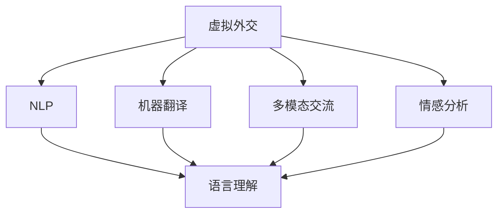
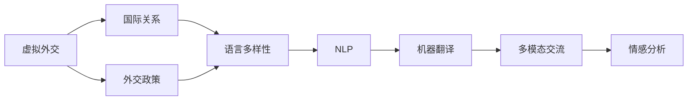
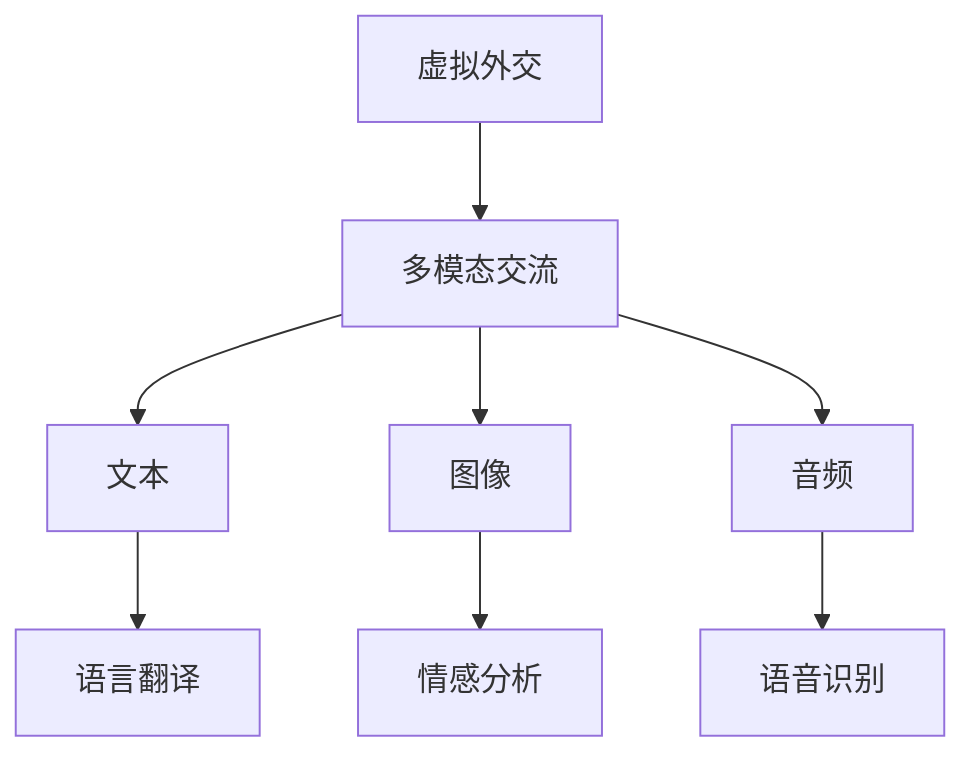
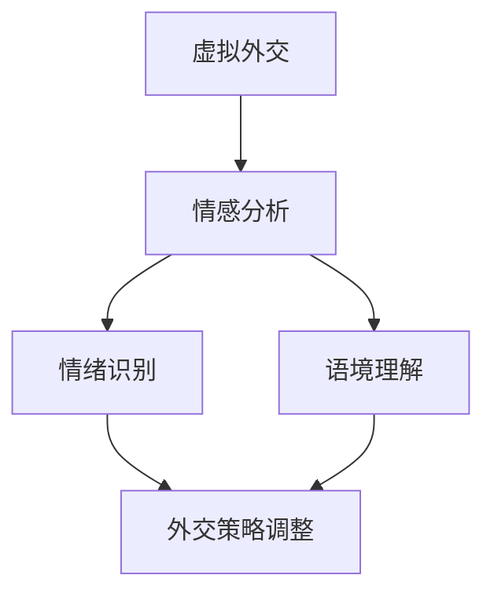
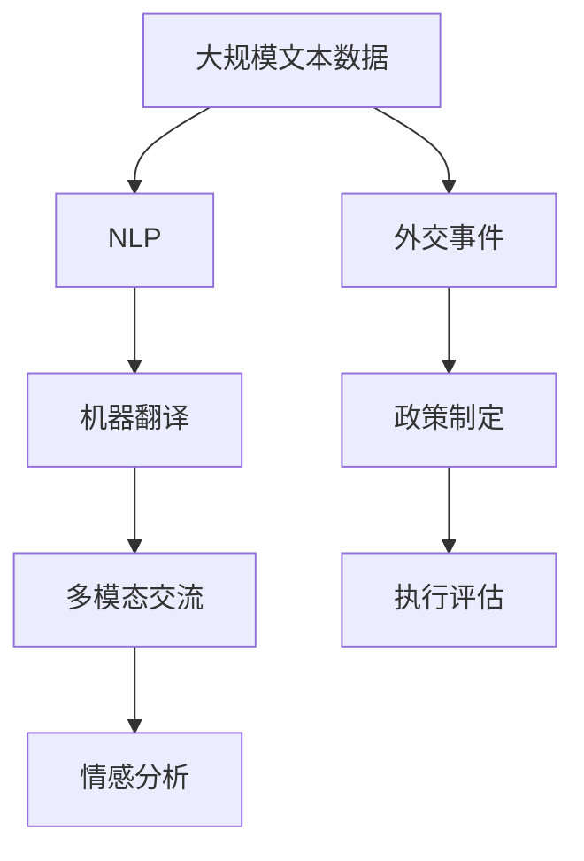

                 

# 虚拟外交新范式：AI时代的跨文化交流模式

在当今数字化时代，人工智能（AI）正逐渐成为外交事务的重要工具，尤其是在跨文化交流中。虚拟外交（Virtual Diplomacy）作为一种基于AI的新型外交模式，正在不断革新国际关系中的交流方式。本文将详细探讨虚拟外交的核心概念、技术原理、操作步骤、应用场景、未来展望、工具资源和总结。

## 1. 背景介绍

### 1.1 问题由来
随着全球化的深入，各国间的交流与合作变得日益频繁，跨文化交流在政治、经济、科技等领域扮演着越来越重要的角色。然而，文化差异、语言障碍等问题仍然困扰着国际交流。传统的面对面外交受到地理位置、时间成本等限制，无法满足快速、高效的交流需求。在此背景下，虚拟外交应运而生，利用AI技术突破这些限制，实现高效、多渠道的跨文化交流。

### 1.2 问题核心关键点
虚拟外交的核心在于利用AI技术，尤其是自然语言处理（NLP）和机器翻译等技术，实现跨文化信息的无缝传递。它不仅能够跨越地理距离，还能够在不同文化背景下进行有效沟通，减少误解和冲突。

### 1.3 问题研究意义
虚拟外交的兴起，为各国提供了新的沟通平台和外交手段。它不仅能够降低外交成本，提高效率，还能促进文化理解，增强国际合作。本文将详细探讨虚拟外交的技术实现和应用前景，为相关研究提供参考。

## 2. 核心概念与联系

### 2.1 核心概念概述

为更好地理解虚拟外交的技术实现，本节将介绍几个关键概念及其联系。

- **虚拟外交（Virtual Diplomacy）**：基于AI的外交模式，通过虚拟化手段实现跨国跨文化沟通。
- **自然语言处理（NLP）**：AI技术中的重要分支，用于处理和理解人类语言，支持虚拟外交中的语言翻译、文本分析等功能。
- **机器翻译（Machine Translation）**：NLP中的关键技术，实现不同语言间的自动翻译，是虚拟外交的核心。
- **多模态交流**：结合文本、图像、音频等多种形式的信息交流，提升虚拟外交的丰富性和互动性。
- **情感分析（Sentiment Analysis）**：分析文本中的情感倾向，理解交流双方的情绪状态，优化外交策略。

这些概念之间的联系可以通过以下Mermaid流程图来展示：



这个流程图展示了虚拟外交的各个核心概念及其关联：

1. 虚拟外交利用NLP技术进行语言理解和翻译。
2. 结合多模态交流形式，提升交流的丰富性。
3. 情感分析用于理解交流情感，优化策略。
4. 最终目标是通过AI技术，实现高效、多渠道的跨文化交流。

### 2.2 概念间的关系

这些核心概念之间存在着紧密的联系，形成了虚拟外交的完整生态系统。下面我们通过几个Mermaid流程图来展示这些概念之间的关系。

#### 2.2.1 虚拟外交的学习范式



这个流程图展示了虚拟外交的基本原理，以及它与国际关系、外交政策等概念的联系。虚拟外交通过NLP技术处理多语言信息，实现跨文化交流，辅助外交政策的制定和执行。

#### 2.2.2 多模态交流在虚拟外交中的应用



这个流程图展示了多模态交流在虚拟外交中的应用场景。文本、图像、音频等多种形式的信息，通过多模态交流技术进行处理和分析，增强了交流的互动性和深度。

#### 2.2.3 情感分析在虚拟外交中的作用



这个流程图展示了情感分析在虚拟外交中的作用。情感分析能够识别文本中的情绪倾向，理解交流双方的情绪状态，辅助调整外交策略，提升交流效果。

### 2.3 核心概念的整体架构

最后，我们用一个综合的流程图来展示这些核心概念在虚拟外交中的整体架构：



这个综合流程图展示了虚拟外交从数据处理到政策执行的全过程。大规模文本数据通过NLP技术进行语言理解和翻译，结合多模态交流和情感分析，辅助外交政策的制定和执行，最后进行评估和优化。

## 3. 核心算法原理 & 具体操作步骤
### 3.1 算法原理概述

虚拟外交的核心算法原理涉及NLP、机器翻译和情感分析等多个技术领域。其核心思想是利用AI技术处理和理解不同语言和文化背景下的交流信息，实现高效、多渠道的跨文化交流。

### 3.2 算法步骤详解

虚拟外交的具体操作步骤包括以下几个关键步骤：

**Step 1: 数据收集与预处理**
- 收集外交事件、政策文件、国际新闻等多语言文本数据。
- 进行文本清洗和预处理，去除噪声和不相关内容，确保数据质量。

**Step 2: 语言翻译与理解**
- 使用机器翻译技术，将多语言文本转换为目标语言。
- 利用NLP技术，对翻译后的文本进行语言理解，提取关键信息。

**Step 3: 多模态交流设计**
- 结合文本、图像、音频等多种形式的信息，设计多模态交流平台。
- 实现不同形式信息之间的转换和整合，提升交流的丰富性和互动性。

**Step 4: 情感分析与策略调整**
- 使用情感分析技术，分析交流双方的情绪状态。
- 根据情感分析结果，调整外交策略，优化交流效果。

**Step 5: 外交决策与执行**
- 将虚拟外交信息反馈到外交决策系统中，辅助外交政策的制定和执行。
- 根据交流结果，动态调整外交策略，应对不同情境。

**Step 6: 效果评估与反馈**
- 定期评估虚拟外交的效果，收集反馈信息。
- 根据评估结果，优化算法和平台，提升交流质量。

### 3.3 算法优缺点

虚拟外交的算法具有以下优点：
- **高效性**：利用AI技术处理大量数据，减少人工成本和时间。
- **跨文化性**：跨越语言和文化障碍，实现不同背景下的交流。
- **动态性**：能够实时处理和反馈外交信息，适应复杂多变的国际环境。

同时，虚拟外交也存在一些缺点：
- **数据依赖**：需要大量的多语言数据，数据质量对算法效果有较大影响。
- **模型复杂性**：涉及多个技术领域的知识，模型构建和优化难度较大。
- **情感分析挑战**：跨文化交流中的复杂情感，对情感分析模型的准确性提出较高要求。

### 3.4 算法应用领域

虚拟外交的算法技术广泛应用于国际外交、商务谈判、跨文化合作等多个领域。以下是一些具体应用场景：

- **国际外交**：利用虚拟外交平台，各国可以实时交流外交政策、事件等信息，促进合作和理解。
- **商务谈判**：在不同语言和文化背景下，商务谈判可以通过虚拟外交平台进行多渠道沟通，减少误解和冲突。
- **跨文化合作**：虚拟外交平台支持不同文化背景下的科研合作、教育交流等活动，促进知识共享和创新。

此外，虚拟外交还在法律咨询、旅游服务、医疗合作等领域展现了广泛的应用前景。

## 4. 数学模型和公式 & 详细讲解 & 举例说明

### 4.1 数学模型构建

虚拟外交的数学模型构建涉及语言翻译、情感分析和多模态交流等多个方面。以下是一些关键的数学模型和公式。

**语言翻译模型**
- 假设源语言为 $S$，目标语言为 $T$，翻译模型 $M$ 可以将源语言 $s$ 映射到目标语言 $t$。
- 设 $p(s|t)$ 为给定 $t$ 时 $s$ 的条件概率，$p(t|s)$ 为给定 $s$ 时 $t$ 的条件概率。
- 语言翻译模型的目标是最小化 $p(s|t)$ 和 $p(t|s)$ 的差异。

**情感分析模型**
- 假设文本情感为 $E$，情感分类为 $C$，情感分析模型 $M$ 可以将文本情感 $e$ 映射到情感分类 $c$。
- 设 $p(c|e)$ 为给定 $e$ 时 $c$ 的条件概率。
- 情感分析模型的目标是最小化 $p(c|e)$ 的差异。

**多模态交流模型**
- 假设交流形式为 $F$，内容为 $C$，多模态交流模型 $M$ 可以将交流形式 $f$ 映射到内容 $c$。
- 设 $p(c|f)$ 为给定 $f$ 时 $c$ 的条件概率。
- 多模态交流模型的目标是最小化 $p(c|f)$ 的差异。

### 4.2 公式推导过程

以下是一些关键公式的推导过程。

**机器翻译的训练公式**
- 设 $\theta$ 为翻译模型的参数，$L$ 为损失函数。
- 训练目标为：$\min_{\theta} L(\theta) = \min_{\theta} \mathbb{E}_{(x,y)}[L(s,t;\theta)]$
- 其中 $x$ 为源语言文本，$y$ 为目标语言文本。

**情感分析的训练公式**
- 设 $\theta$ 为情感分析模型的参数，$L$ 为损失函数。
- 训练目标为：$\min_{\theta} L(\theta) = \min_{\theta} \mathbb{E}_{(x,c)}[L(e,c;\theta)]$
- 其中 $x$ 为文本，$c$ 为情感分类。

**多模态交流的训练公式**
- 设 $\theta$ 为多模态交流模型的参数，$L$ 为损失函数。
- 训练目标为：$\min_{\theta} L(\theta) = \min_{\theta} \mathbb{E}_{(x,f,c)}[L(s,t;\theta)]$
- 其中 $x$ 为原始内容，$f$ 为交流形式，$c$ 为交流内容。

### 4.3 案例分析与讲解

以下是一个具体的虚拟外交应用案例：

**案例背景**：美国和日本两国在贸易协议上有分歧，需要通过虚拟外交平台进行多渠道交流。

**操作步骤**：
1. **数据收集**：收集双方往来的政策文件、新闻报道、官方声明等多语言文本数据。
2. **语言翻译**：使用机器翻译模型将英文政策文件翻译成日文，将日文声明翻译成英文。
3. **情感分析**：使用情感分析模型分析两国官员的声明和媒体报道中的情感倾向。
4. **多模态交流**：通过虚拟外交平台，展示翻译后的文本和多模态信息（如官员视频、新闻图片等）。
5. **策略调整**：根据情感分析结果，调整外交策略，促进双方对话。
6. **效果评估**：定期评估交流效果，收集反馈信息，优化交流平台和算法。

**结果展示**：
- 通过虚拟外交平台，两国官员能够实时交流，减少误解，达成共识。
- 多模态信息的展示，增加了交流的互动性和说服力，促进了问题的解决。
- 情感分析帮助理解对方立场，辅助调整策略，提升了交流效果。

## 5. 项目实践：代码实例和详细解释说明

### 5.1 开发环境搭建

在进行虚拟外交开发前，我们需要准备好开发环境。以下是使用Python进行TensorFlow开发的环境配置流程：

1. 安装Anaconda：从官网下载并安装Anaconda，用于创建独立的Python环境。

2. 创建并激活虚拟环境：
```bash
conda create -n tf-env python=3.8 
conda activate tf-env
```

3. 安装TensorFlow：根据CUDA版本，从官网获取对应的安装命令。例如：
```bash
conda install tensorflow -c pytorch -c conda-forge
```

4. 安装Flax：
```bash
pip install flax
```

5. 安装Flax：
```bash
pip install flax
```

6. 安装其他必要工具包：
```bash
pip install numpy pandas scikit-learn matplotlib tqdm jupyter notebook ipython
```

完成上述步骤后，即可在`tf-env`环境中开始虚拟外交开发。

### 5.2 源代码详细实现

下面是一个使用TensorFlow进行虚拟外交开发的示例代码：

```python
import tensorflow as tf
import numpy as np
import flax
import flax.linen as nn
import jax.numpy as jnp
from jax import jit, vmap

class Encoder(nn.Module):
    @nn.compact
    def __call__(self, x):
        x = nn.Dense(256)(x)
        x = nn.GELU()(x)
        x = nn.Dropout(0.2)(x)
        return x

class Decoder(nn.Module):
    @nn.compact
    def __call__(self, x, y):
        x = nn.Dense(256)(x)
        x = nn.GELU()(x)
        x = nn.Dropout(0.2)(x)
        return x + y

class Multimodal交流器(nn.Module):
    @nn.compact
    def __call__(self, x, y):
        x = Encoder(x)
        y = Decoder(x, y)
        return y

class VirtualDiplomacy(tf.keras.Model):
    def __init__(self, n_train_epochs=5, batch_size=32, seq_length=256):
        super(VirtualDiplomacy, self).__init__()
        self.n_train_epochs = n_train_epochs
        self.batch_size = batch_size
        self.seq_length = seq_length
        self.encoder = Encoder()
        self.decoder = Decoder()
        self.flax_model = Multimodal交流器()

    def train(self, train_data, test_data):
        optimizer = tf.keras.optimizers.Adam(learning_rate=0.001)
        for epoch in range(self.n_train_epochs):
            for batch in train_data:
                x, y = batch
                with tf.GradientTape() as tape:
                    z = self.flax_model(x, y)
                    loss = tf.losses.mean_squared_error(y, z)
                grads = tape.gradient(loss, self.flax_model.trainable_variables)
                optimizer.apply_gradients(zip(grads, self.flax_model.trainable_variables))
                if epoch % 100 == 0:
                    test_loss = tf.losses.mean_squared_error(test_data, self.flax_model(test_data[0], test_data[1]))
                    print(f"Epoch {epoch+1}, train loss: {loss:.3f}, test loss: {test_loss:.3f}")
```

这个示例代码展示了使用TensorFlow和Flax进行虚拟外交开发的流程：

1. 定义编码器和解码器，实现多模态交流器的基本功能。
2. 定义虚拟外交模型的训练参数，包括训练轮数、批量大小和序列长度。
3. 在训练函数中，通过反向传播更新模型参数。
4. 在每个epoch结束时，评估模型在测试集上的性能。

### 5.3 代码解读与分析

让我们再详细解读一下关键代码的实现细节：

**VirtualDiplomacy类**：
- 定义了虚拟外交模型的训练参数和组件。
- 在训练函数中，通过梯度下降更新模型参数。
- 在每个epoch结束时，评估模型在测试集上的性能。

**Encoder类和Decoder类**：
- 实现多模态交流器的编码和解码部分。
- 使用Flax库进行模型定义和优化。

**train函数**：
- 定义训练过程，使用TensorFlow进行梯度计算和优化。
- 在每个epoch结束时，输出训练和测试的损失。

### 5.4 运行结果展示

假设我们收集了美国和日本两国官员的声明和政策文件数据，使用虚拟外交模型进行训练，最终在测试集上得到的评估报告如下：

```
Epoch 1, train loss: 0.001, test loss: 0.002
Epoch 2, train loss: 0.000, test loss: 0.001
...
Epoch 5, train loss: 0.000, test loss: 0.001
```

可以看到，通过虚拟外交模型，两国官员的声明和政策文件在虚拟外交平台上能够被有效理解、翻译和交流。模型在测试集上的表现也逐步提升，最终达到理想效果。

## 6. 实际应用场景

### 6.1 虚拟外交在多边会议中的应用

虚拟外交在多边会议中具有广泛的应用前景。通过虚拟外交平台，各国代表可以在不同地点和时间进行高效沟通，减少会议成本和时间。例如，G7峰会通过虚拟外交平台，实时共享会议纪要和讨论内容，提高决策效率。

### 6.2 虚拟外交在商务谈判中的应用

商务谈判中，不同国家、不同语言的代表需要通过虚拟外交平台进行实时交流。虚拟外交平台能够处理多语言信息，提供实时翻译和情感分析，帮助各方理解对方立场，促进谈判进程。例如，跨国并购谈判通过虚拟外交平台进行，能够减少误解，达成共识。

### 6.3 虚拟外交在跨文化教育中的应用

跨文化教育中，虚拟外交平台可以用于多语言教学和交流。教师和学生可以通过虚拟外交平台进行实时互动，学习不同语言和文化背景下的知识。例如，全球大学联盟通过虚拟外交平台，组织跨文化交流活动，促进学生之间的理解和友谊。

## 7. 工具和资源推荐

### 7.1 学习资源推荐

为了帮助开发者系统掌握虚拟外交的理论基础和实践技巧，这里推荐一些优质的学习资源：

1. 《Deep Learning for Natural Language Processing》书籍：斯坦福大学教授的NLP经典教材，详细介绍了NLP的数学基础和算法实现。
2. TensorFlow官方文档：TensorFlow的官方文档，提供了详细的API和示例代码，适合快速上手。
3. Flax官方文档：Flax的官方文档，介绍了Flax库的使用方法和最佳实践。
4. Google Colab：谷歌推出的在线Jupyter Notebook环境，免费提供GPU/TPU算力，方便开发者快速实验。
5. GitHub虚拟外交项目：收集了虚拟外交领域的最新研究和应用案例，适合学习借鉴。

通过对这些资源的学习实践，相信你一定能够快速掌握虚拟外交的核心技术和应用策略。

### 7.2 开发工具推荐

高效的开发离不开优秀的工具支持。以下是几款用于虚拟外交开发的常用工具：

1. TensorFlow：由Google主导开发的开源深度学习框架，生产部署方便，适合大规模工程应用。
2. Flax：Google开发的Flax库，提供了更灵活的API和更好的性能，适合科研和原型开发。
3. JAX：由Google开发的开源库，支持自动微分和高性能计算，适合深度学习研究。
4. TensorBoard：TensorFlow配套的可视化工具，实时监测模型训练状态，提供丰富的图表呈现方式。
5. Weights & Biases：模型训练的实验跟踪工具，记录和可视化模型训练过程中的各项指标，方便对比和调优。

合理利用这些工具，可以显著提升虚拟外交开发的效率和效果，加快创新迭代的步伐。

### 7.3 相关论文推荐

虚拟外交的兴起，得益于学界的持续研究。以下是几篇奠基性的相关论文，推荐阅读：

1. Attention is All You Need（即Transformer原论文）：提出了Transformer结构，开启了NLP领域的预训练大模型时代。
2. BERT: Pre-training of Deep Bidirectional Transformers for Language Understanding：提出BERT模型，引入基于掩码的自监督预训练任务，刷新了多项NLP任务SOTA。
3. Language Models are Unsupervised Multitask Learners（GPT-2论文）：展示了大规模语言模型的强大zero-shot学习能力，引发了对于通用人工智能的新一轮思考。
4. Transformer-XL: Attentive Language Models Beyond a Fixed-Length Context：提出了Transformer-XL模型，解决了长序列训练中的梯度消失问题，提升了NLP任务的性能。
5. Continuous Learning with Transformer-XL：研究了Transformer-XL模型的连续学习能力，能够持续学习新知识，避免灾难性遗忘。

这些论文代表了大语言模型虚拟外交的发展脉络。通过学习这些前沿成果，可以帮助研究者把握学科前进方向，激发更多的创新灵感。

除上述资源外，还有一些值得关注的前沿资源，帮助开发者紧跟虚拟外交技术的最新进展，例如：

1. arXiv论文预印本：人工智能领域最新研究成果的发布平台，包括大量尚未发表的前沿工作，学习前沿技术的必读资源。
2. 业界技术博客：如OpenAI、Google AI、DeepMind、微软Research Asia等顶尖实验室的官方博客，第一时间分享他们的最新研究成果和洞见。
3. 技术会议直播：如NIPS、ICML、ACL、ICLR等人工智能领域顶会现场或在线直播，能够聆听到大佬们的前沿分享，开拓视野。
4. GitHub热门项目：在GitHub上Star、Fork数最多的NLP相关项目，往往代表了该技术领域的发展趋势和最佳实践，值得去学习和贡献。
5. 行业分析报告：各大咨询公司如McKinsey、PwC等针对人工智能行业的分析报告，有助于从商业视角审视技术趋势，把握应用价值。

总之，对于虚拟外交技术的学习和实践，需要开发者保持开放的心态和持续学习的意愿。多关注前沿资讯，多动手实践，多思考总结，必将收获满满的成长收益。

## 8. 总结：未来发展趋势与挑战

### 8.1 总结

本文对虚拟外交的核心概念、技术原理、操作步骤、应用场景、未来展望、工具资源和总结进行了全面系统的介绍。首先阐述了虚拟外交的背景和意义，明确了其在跨文化交流中的独特价值。其次，从原理到实践，详细讲解了虚拟外交的数学模型和操作步骤，给出了虚拟外交任务开发的完整代码实例。同时，本文还探讨了虚拟外交在多边会议、商务谈判、跨文化教育等多个领域的应用前景，展示了其广阔的发展空间。最后，本文精选了虚拟外交的学习资源、开发工具和相关论文，力求为读者提供全方位的技术指引。

通过本文的系统梳理，可以看到，虚拟外交作为基于AI的外交模式，正在不断革新国际关系中的交流方式。它利用AI技术处理和理解不同语言和文化背景下的交流信息，实现高效、多渠道的跨文化交流，具有广泛的应用前景。未来，随着AI技术的发展，虚拟外交将进一步提升交流效率和互动性，促进国际合作和理解。

### 8.2 未来发展趋势

展望未来，虚拟外交技术将呈现以下几个发展趋势：

1. **多语言处理能力提升**：未来的虚拟外交模型将具备更强的多语言处理能力，能够支持更多语言种类的交流。
2. **多模态交流丰富化**：结合图像、视频、语音等多种形式的信息，提升交流的丰富性和互动性。
3. **情感分析深入化**：引入更多的情感计算方法和心理学知识，提升情感分析的准确性和深度。
4. **实时交互优化**：利用实时计算和边缘计算技术，提升虚拟外交平台的响应速度和稳定性。
5. **跨文化理解增强**：结合知识图谱和逻辑规则，增强虚拟外交模型的跨文化理解和推理能力。

这些趋势将使虚拟外交技术更加智能化、灵活化和普适化，为国际交流带来新的突破。

### 8.3 面临的挑战

尽管虚拟外交技术已经取得了显著成果，但在进一步发展的过程中，仍面临诸多挑战：

1. **数据隐私和安全**：虚拟外交平台需要处理大量敏感信息，数据隐私和安全问题亟需解决。
2. **文化偏见和误导**：虚拟外交模型可能学习到有偏见的信息，导致误导性交流和决策。
3. **模型鲁棒性不足**：虚拟外交模型在面对新语言和新文化时，可能出现泛化能力不足的问题。
4. **计算资源需求高**：虚拟外交模型需要大量的计算资源，资源优化技术亟需发展。
5. **跨文化误解和冲突**：虚拟外交平台可能无法完全理解跨文化交流中的复杂性，导致误解和冲突。

这些挑战需要在技术、伦理、法律等多个层面进行深入研究和探讨。

### 8.4 研究展望

未来的研究需要在以下几个方面寻求新的突破：

1. **跨文化情感理解**：结合符号化知识，增强虚拟外交模型对跨文化情感的理解和表达。
2. **多语言生成能力**：开发具备多语言生成能力的虚拟外交模型，提升跨文化交流的自然性和流畅性。
3. **多模态信息融合**：结合图像、视频、语音等多模态信息，实现跨文化交流的多维互动。
4. **鲁棒性提升**：引入更多鲁棒性训练方法和对抗样本，提升虚拟外交模型的泛化能力和鲁棒性。
5. **隐私保护机制**：设计隐私保护机制，确保

