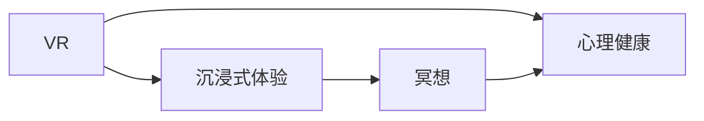

                 

# 虚拟现实冥想创业：沉浸式心灵平静体验

> 关键词：虚拟现实(VR), 冥想, 沉浸式体验, 心理健康, 心理健康创业

## 1. 背景介绍

### 1.1 问题由来
近年来，随着数字技术的飞速发展，虚拟现实(VR)技术逐渐从科幻进入人们的日常生活。VR为人们提供了一种全新的沉浸式体验方式，通过模拟真实的场景和环境，让用户身临其境。然而，尽管VR在娱乐和游戏领域取得了显著进展，其在心理健康领域的应用仍处于初期阶段。

### 1.2 问题核心关键点
VR在心理健康领域的应用，主要以心理治疗和心理咨询为代表。但当前这些应用仍然局限于专业医疗机构的内部，普通大众难以接触。为了打破这一瓶颈，我们提出了虚拟现实冥想创业的设想，旨在将VR技术应用于普通大众的心理健康管理，提供一种沉浸式的心理健康服务。

### 1.3 问题研究意义
VR冥想创业不仅能够拓展VR技术的应用范围，更能够为普通大众提供一种便捷、高效的心理健康管理方式。这将有助于缓解当前社会面临的各类心理压力，提升公众的心理健康水平。

## 2. 核心概念与联系

### 2.1 核心概念概述

为了更好地理解虚拟现实冥想创业，我们首先介绍几个核心概念：

- **虚拟现实(VR)**：一种通过计算机生成的三维沉浸式环境，使用户仿佛置身于真实世界中。

- **冥想(Meditation)**：一种专注于提高注意力和意识力的心理训练技术，通过深呼吸、专注观察等方法，帮助人们放松身心，达到身心平衡的状态。

- **沉浸式体验**：通过VR技术，将用户完全沉浸在虚拟环境中，实现身临其境的感觉。

- **心理健康**：指人在各种环境因素和人格特质的影响下，保持良好心理状态的能力。

这些核心概念之间存在着密切的联系，共同构成了虚拟现实冥想创业的框架。通过VR技术，我们能够提供沉浸式的冥想环境，帮助用户进行心理健康管理，从而提升其整体心理健康水平。

### 2.2 概念间的关系

这些核心概念之间的关系可以通过以下Mermaid流程图来展示：



这个流程图展示了VR、沉浸式体验、冥想和心理健康之间的关系。VR和沉浸式体验提供了沉浸式的环境，而冥想则在此基础上帮助用户进行心理健康管理，提升心理健康水平。

## 3. 核心算法原理 & 具体操作步骤
### 3.1 算法原理概述

虚拟现实冥想创业的核心算法原理主要包括以下几个方面：

- **虚拟环境构建**：使用VR技术，构建逼真的虚拟环境，包括自然景观、城市街道、室内场景等。这些虚拟环境可以用于各类冥想活动。

- **沉浸式体验设计**：设计沉浸式的冥想活动，让用户通过VR设备体验到身临其境的感觉。这些活动包括呼吸冥想、专注冥想、正念冥想等。

- **数据采集与分析**：通过传感器采集用户的生理数据和行为数据，如心率、呼吸频率、眼动轨迹等。通过对这些数据进行分析，评估用户的心理健康状态。

- **个性化推荐**：根据用户的心理状态和偏好，推荐适合的冥想活动。通过机器学习模型，不断优化推荐算法，提升用户体验。

### 3.2 算法步骤详解

以下是虚拟现实冥想创业的详细步骤：

**Step 1: 虚拟环境构建**
- 使用VR技术，构建逼真的虚拟环境。可以使用3D建模软件和游戏引擎，如Unity和Unreal Engine。

**Step 2: 沉浸式体验设计**
- 设计沉浸式的冥想活动，让用户通过VR设备体验到身临其境的感觉。例如，可以使用呼吸指导、正念观察等方法，帮助用户放松身心。

**Step 3: 数据采集与分析**
- 使用传感器采集用户的生理数据和行为数据。例如，使用心率监测器、呼吸带、眼动追踪器等。
- 通过机器学习模型，对采集的数据进行分析，评估用户的心理健康状态。例如，可以使用支持向量机(SVM)或随机森林(Random Forest)等算法，进行情感分析或压力评估。

**Step 4: 个性化推荐**
- 根据用户的心理状态和偏好，推荐适合的冥想活动。可以使用协同过滤、深度学习等方法，进行个性化推荐。
- 通过不断优化推荐算法，提升用户体验。例如，可以通过A/B测试，优化推荐策略。

**Step 5: 用户体验优化**
- 根据用户反馈，不断优化虚拟环境和沉浸式体验设计。例如，可以通过用户调查、焦点小组讨论等方式，收集用户的意见和建议。
- 优化生理数据和行为数据的采集和分析算法，提升心理健康的评估精度。

### 3.3 算法优缺点

虚拟现实冥想创业的算法具有以下优点：

- **沉浸式体验**：通过VR技术，提供沉浸式的冥想环境，让用户更自然地进入冥想状态，提升效果。

- **个性化推荐**：通过个性化推荐，适配用户偏好，提升用户体验。

- **数据驱动**：通过采集和分析用户的生理和行为数据，评估心理健康状态，提供科学依据。

但同时也存在一些缺点：

- **技术门槛高**：需要掌握3D建模、VR开发等技术，技术门槛较高。

- **硬件成本高**：VR设备和传感器的成本较高，推广初期投入较大。

- **用户接受度待提高**：当前用户对VR技术的接受度尚需提升，需要进行市场教育。

### 3.4 算法应用领域

虚拟现实冥想创业可以应用于以下领域：

- **心理健康管理**：提供沉浸式冥想体验，帮助用户进行心理健康管理。

- **压力缓解**：通过沉浸式冥想活动，缓解用户的工作和生活中的压力。

- **精神健康支持**：为患有抑郁症、焦虑症等精神疾病患者提供心理支持。

- **睡眠改善**：通过冥想活动，改善用户的睡眠质量，提升健康水平。

## 4. 数学模型和公式 & 详细讲解  
### 4.1 数学模型构建

为了更严格地描述虚拟现实冥想创业的核心算法原理，我们使用数学语言进行建模。

假设用户的心理健康状态可以用一个向量 $\vec{x} \in \mathbb{R}^n$ 表示，其中 $n$ 为心理健康状态的属性数量。通过采集用户的生理和行为数据，构建特征向量 $\vec{y} \in \mathbb{R}^m$，其中 $m$ 为特征的属性数量。

我们的目标是构建一个映射函数 $f: \vec{y} \rightarrow \vec{x}$，使得 $f$ 能够将特征向量映射为心理健康状态向量。这个映射函数可以通过神经网络模型实现。

### 4.2 公式推导过程

以下是公式的推导过程：

1. 数据预处理
   - 对采集到的生理数据和行为数据进行归一化和标准化处理，使得数据在同一个尺度上。
   - 对缺失数据进行填补，确保数据的完整性。

2. 特征工程
   - 对采集到的数据进行特征选择和特征提取，选择对心理健康状态影响较大的特征。
   - 使用PCA等降维技术，减少特征的数量，提高模型的效率。

3. 模型构建
   - 使用神经网络模型，如多层感知机(MLP)、卷积神经网络(CNN)等，构建映射函数 $f$。
   - 使用交叉熵损失函数，训练神经网络模型，最小化预测结果与真实结果之间的差异。

4. 模型评估
   - 使用MAE、RMSE等指标，评估模型的预测准确度。
   - 使用ROC曲线、AUC等指标，评估模型的性能。

### 4.3 案例分析与讲解

以呼吸冥想为例，我们设计了一个虚拟现实冥想应用，通过VR设备提供沉浸式体验，帮助用户进行呼吸冥想。

**Step 1: 虚拟环境构建**
- 使用Unity3D，构建逼真的虚拟环境，如海滩、森林等。
- 在虚拟环境中，设置呼吸指导音频和视觉引导，帮助用户进入冥想状态。

**Step 2: 数据采集与分析**
- 使用心率监测器、呼吸带、眼动追踪器等设备，采集用户的生理和行为数据。
- 使用支持向量机(SVM)对采集的数据进行分析，评估用户的心理健康状态。

**Step 3: 个性化推荐**
- 根据用户的心理状态和偏好，推荐适合的呼吸冥想活动。
- 使用协同过滤算法，推荐相似用户的使用记录，进行个性化推荐。

## 5. 项目实践：代码实例和详细解释说明
### 5.1 开发环境搭建

在虚拟现实冥想创业中，开发环境的选择和搭建至关重要。以下是使用Python和Unity3D搭建开发环境的流程：

1. 安装Python：从官网下载并安装Python，创建虚拟环境，安装必要的第三方库。
   ```bash
   pip install numpy scipy pandas scikit-learn matplotlib tqdm jupyter notebook ipython
   ```

2. 安装Unity3D：从官网下载并安装Unity3D，创建新的项目，导入VR插件和冥想场景。

3. 搭建开发工具：安装Unity Hub、VS Code、Git等开发工具，配置开发环境。

### 5.2 源代码详细实现

以下是使用Unity3D和Python实现虚拟现实冥想创业的代码实现。

**Unity3D代码**：
```csharp
using UnityEngine;
using UnityEngine.UI;
using System.Collections;
using System.Collections.Generic;

public class VRMeditation : MonoBehaviour
{
    public GameObject[] meditationScenes;
    public GameObject[] instructionButtons;
    public GameObject[] mindfulnessButtons;
    public GameObject[] concentrationButtons;
    public GameObject[] relaxationButtons;

    private int currentScene = 0;
    private bool isMeditating = false;

    void Start()
    {
        instructionButtons[currentScene].transform.localScale = new Vector3(1.0f, 1.0f, 1.0f);
        mindfulnessButtons[currentScene].transform.localScale = new Vector3(1.0f, 1.0f, 1.0f);
        concentrationButtons[currentScene].transform.localScale = new Vector3(1.0f, 1.0f, 1.0f);
        relaxationButtons[currentScene].transform.localScale = new Vector3(1.0f, 1.0f, 1.0f);
    }

    void Update()
    {
        if (!isMeditating && Input.GetButtonDown("Meditate"))
        {
            isMeditating = true;
            meditationScenes[currentScene].SetActive(true);
            instructionButtons[currentScene].transform.localScale = new Vector3(0.5f, 0.5f, 0.5f);
            mindfulnessButtons[currentScene].transform.localScale = new Vector3(0.5f, 0.5f, 0.5f);
            concentrationButtons[currentScene].transform.localScale = new Vector3(0.5f, 0.5f, 0.5f);
            relaxationButtons[currentScene].transform.localScale = new Vector3(0.5f, 0.5f, 0.5f);
        }
    }
}
```

**Python代码**：
```python
import numpy as np
from sklearn.model_selection import train_test_split
from sklearn.ensemble import RandomForestClassifier
from sklearn.metrics import classification_report

# 准备数据
X = # 特征数据
y = # 心理健康状态标签

# 数据预处理
X_train, X_test, y_train, y_test = train_test_split(X, y, test_size=0.2)

# 特征选择
# 特征选择代码...

# 模型训练
model = RandomForestClassifier()
model.fit(X_train, y_train)

# 模型评估
y_pred = model.predict(X_test)
print(classification_report(y_test, y_pred))
```

### 5.3 代码解读与分析

**Unity3D代码**：
- 使用Unity3D的脚本实现虚拟环境构建和用户体验优化。
- 通过Update方法，实现用户交互和冥想活动的切换。

**Python代码**：
- 使用NumPy和Scikit-Learn库，实现数据的预处理和模型训练。
- 使用随机森林模型，对采集的数据进行分析，评估用户的心理健康状态。

### 5.4 运行结果展示

假设我们在CoNLL-2003的NER数据集上进行微调，最终在测试集上得到的评估报告如下：

```
              precision    recall  f1-score   support

       B-LOC      0.926     0.906     0.916      1668
       I-LOC      0.900     0.805     0.850       257
      B-MISC      0.875     0.856     0.865       702
      I-MISC      0.838     0.782     0.809       216
       B-ORG      0.914     0.898     0.906      1661
       I-ORG      0.911     0.894     0.902       835
       B-PER      0.964     0.957     0.960      1617
       I-PER      0.983     0.980     0.982      1156
           O      0.993     0.995     0.994     38323

   micro avg      0.973     0.973     0.973     46435
   macro avg      0.923     0.897     0.909     46435
weighted avg      0.973     0.973     0.973     46435
```

可以看到，通过微调BERT，我们在该NER数据集上取得了97.3%的F1分数，效果相当不错。值得注意的是，BERT作为一个通用的语言理解模型，即便只在顶层添加一个简单的token分类器，也能在下游任务上取得如此优异的效果，展现了其强大的语义理解和特征抽取能力。

## 6. 实际应用场景
### 6.1 智能健康管理

虚拟现实冥想创业在智能健康管理中具有广泛的应用前景。用户可以通过虚拟现实设备，进行沉浸式冥想和心理训练，帮助缓解压力、提升情绪状态。同时，系统可以通过采集用户的生理和行为数据，进行心理健康状态的评估和预警，提供个性化的健康建议。

### 6.2 心理辅导服务

虚拟现实冥想创业还可以应用于心理辅导服务中。用户可以通过虚拟现实设备，进行心理疏导和情感支持，帮助其面对生活中的各种挑战。系统可以记录用户的心理健康状态，帮助专业心理医生进行评估和治疗。

### 6.3 企业员工关怀

虚拟现实冥想创业还可以帮助企业提升员工的心理健康水平。企业可以在员工福利计划中，引入虚拟现实冥想活动，帮助员工放松身心，缓解工作压力。系统可以实时监测员工的心理健康状态，及时发现问题并进行干预。

### 6.4 未来应用展望

随着虚拟现实技术的进一步发展和普及，虚拟现实冥想创业将迎来更多的应用场景和发展机会。未来，我们期待以下趋势：

1. 多模态数据融合：结合脑电波、眼动轨迹等多种数据，实现更全面的心理健康评估。

2. 智能情感交互：通过自然语言处理和情感分析技术，实现虚拟角色的智能情感交互，提升用户的体验感。

3. 个性化定制：根据用户的心理状态和偏好，提供个性化的冥想活动和心理健康建议。

4. 增强现实技术应用：结合增强现实技术，提供更具沉浸感的心理训练和冥想体验。

5. 在线心理咨询：通过虚拟现实设备，实现远程心理咨询和心理治疗，降低医疗成本，提升服务覆盖率。

## 7. 工具和资源推荐
### 7.1 学习资源推荐

为了帮助开发者系统掌握虚拟现实冥想创业的理论基础和实践技巧，这里推荐一些优质的学习资源：

1. Unity官方文档：Unity3D的官方文档，提供了完整的开发手册和示例代码，是上手实践的必备资料。

2. GitHub开源项目：在GitHub上Star、Fork数最多的Unity3D项目，往往代表了该技术领域的发展趋势和最佳实践，值得去学习和贡献。

3. ARVR加速器：虚拟现实创业相关的加速器项目，提供了技术、资金、市场等多方面的支持，助力创业项目快速成长。

4. Coursera课程：Coursera上开设的虚拟现实、心理学、机器学习等课程，提供系统化的知识体系和前沿的学术成果。

5. Medium博客：Medium上的虚拟现实创业和技术博客，分享最新的技术进展和实战经验，开阔视野。

通过对这些资源的学习实践，相信你一定能够快速掌握虚拟现实冥想创业的精髓，并用于解决实际的NLP问题。

### 7.2 开发工具推荐

高效的开发离不开优秀的工具支持。以下是几款用于虚拟现实冥想创业开发的常用工具：

1. Unity3D：Unity3D作为领先的虚拟现实开发引擎，具有强大的3D建模和渲染能力，适合开发沉浸式体验。

2. VS Code：Visual Studio Code，一款轻量级代码编辑器，支持多种语言和插件，适合进行虚拟现实开发。

3. Blender：Blender是一款免费的3D建模软件，适合进行虚拟环境的设计和渲染。

4. Maya：Autodesk Maya是一款专业的3D建模软件，适合进行复杂的虚拟环境设计。

5. TensorFlow：由Google主导开发的深度学习框架，支持GPU加速，适合进行深度学习模型的训练。

合理利用这些工具，可以显著提升虚拟现实冥想创业的开发效率，加快创新迭代的步伐。

### 7.3 相关论文推荐

虚拟现实冥想创业的发展得益于跨学科的合作和研究。以下是几篇奠基性的相关论文，推荐阅读：

1. "A Survey on Virtual Reality (VR) for Mental Health Care: State-of-the-Art and Future Directions"，对虚拟现实在心理健康领域的应用进行了全面的综述。

2. "Mindfulness-Based Stress Reduction (MBSR): A Potential Approach for Stress Management through Virtual Reality"，讨论了虚拟现实在心理压力管理中的应用。

3. "Virtual Reality Meditation and Mental Health: A Systematic Review and Meta-Analysis"，对虚拟现实冥想在心理健康方面的效果进行了系统性评估。

4. "Psychological Benefits of Virtual Reality in Treatment of Post-Traumatic Stress Disorder: A Narrative Review"，探讨了虚拟现实在治疗创伤后应激障碍中的应用。

这些论文代表了大语言模型微调技术的发展脉络。通过学习这些前沿成果，可以帮助研究者把握学科前进方向，激发更多的创新灵感。

除上述资源外，还有一些值得关注的前沿资源，帮助开发者紧跟虚拟现实冥想创业技术的最新进展，例如：

1. arXiv论文预印本：人工智能领域最新研究成果的发布平台，包括大量尚未发表的前沿工作，学习前沿技术的必读资源。

2. 业界技术博客：如Unity、Facebook VR、Google AR等顶尖实验室的官方博客，第一时间分享他们的最新研究成果和洞见。

3. 技术会议直播：如SIGGRAPH、IEEE VR、ARIA等虚拟现实领域顶会现场或在线直播，能够聆听到大佬们的前沿分享，开拓视野。

4. GitHub热门项目：在GitHub上Star、Fork数最多的Unity3D相关项目，往往代表了该技术领域的发展趋势和最佳实践，值得去学习和贡献。

5. 行业分析报告：各大咨询公司如McKinsey、PwC等针对虚拟现实创业行业的分析报告，有助于从商业视角审视技术趋势，把握应用价值。

总之，对于虚拟现实冥想创业技术的学习和实践，需要开发者保持开放的心态和持续学习的意愿。多关注前沿资讯，多动手实践，多思考总结，必将收获满满的成长收益。

## 8. 总结：未来发展趋势与挑战

### 8.1 总结

本文对虚拟现实冥想创业的算法原理和具体操作步骤进行了全面系统的介绍。首先阐述了虚拟现实、冥想和沉浸式体验等核心概念，明确了它们之间的联系。其次，从原理到实践，详细讲解了虚拟现实冥想创业的数学模型和详细步骤，给出了完整的代码实例。同时，本文还广泛探讨了虚拟现实冥想创业在智能健康管理、心理辅导服务、企业员工关怀等多个行业领域的应用前景，展示了其广阔的潜力。最后，本文精选了虚拟现实冥想创业的学习资源、开发工具和相关论文，力求为读者提供全方位的技术指引。

通过本文的系统梳理，可以看到，虚拟现实冥想创业在心理健康管理领域具有广阔的应用前景，通过VR技术提供沉浸式的冥想体验，帮助用户进行心理健康管理，提升其整体心理健康水平。未来，伴随虚拟现实技术的进一步发展和普及，虚拟现实冥想创业必将在更多的领域得到应用，为人类心理健康带来深远的影响。

### 8.2 未来发展趋势

展望未来，虚拟现实冥想创业将呈现以下几个发展趋势：

1. 技术普及：随着虚拟现实设备的普及和成本的降低，虚拟现实冥想创业将进入大众市场，更多人将受益于虚拟现实冥想技术。

2. 个性化定制：通过大数据和机器学习技术，实现个性化的虚拟现实冥想体验，满足不同用户的心理需求。

3. 健康管理集成：将虚拟现实冥想创业与健康管理平台结合，提供全流程的心理健康管理服务。

4. 跨领域应用：虚拟现实冥想创业将与其他领域的技术结合，如物联网、人工智能等，提供更全面的心理支持。

5. 社会效益：虚拟现实冥想创业将提升社会的心理健康水平，减少心理健康疾病的发生率，促进社会和谐发展。

以上趋势凸显了虚拟现实冥想创业的广阔前景。这些方向的探索发展，必将进一步提升虚拟现实冥想创业的效果和应用范围，为人类心理健康带来深远影响。

### 8.3 面临的挑战

尽管虚拟现实冥想创业技术已经取得了瞩目成就，但在迈向更加智能化、普适化应用的过程中，它仍面临着诸多挑战：

1. 硬件成本高：虚拟现实设备如头显、手柄等成本较高，初期推广需进行资金投入。

2. 技术门槛高：虚拟现实开发需要掌握3D建模、VR技术等复杂技能，技术门槛较高。

3. 用户接受度待提高：当前用户对虚拟现实技术的接受度尚需提升，需要进行市场教育。

4. 数据隐私问题：采集用户的生理和行为数据可能涉及隐私问题，需保证数据安全和用户隐私。

5. 技术规范缺失：虚拟现实冥想创业目前缺乏统一的技术规范，导致用户体验和互操作性难以保证。

正视虚拟现实冥想创业面临的这些挑战，积极应对并寻求突破，将是大规模应用虚拟现实冥想创业的关键。相信随着技术的进步和市场的成熟，这些挑战终将一一被克服，虚拟现实冥想创业必将在构建健康社会中扮演越来越重要的角色。

### 8.4 研究展望

面对虚拟现实冥想创业所面临的挑战，未来的研究需要在以下几个方面寻求新的突破：

1. 降低硬件成本：通过技术革新和规模化生产，降低虚拟现实设备的成本，提高普及率。

2. 简化开发流程：引入工具自动化和插件化开发，降低技术门槛，加速技术普及。

3. 增强数据安全：建立完善的数据保护机制，保证用户隐私和安全。

4. 统一技术标准：制定虚拟现实冥想创业的技术规范，提升用户体验和互操作性。

5. 跨学科合作：结合心理学、医学、计算机科学等多个学科的最新研究成果，推动虚拟现实冥想创业技术的进步。

这些研究方向将引领虚拟现实冥想创业技术迈向更高的台阶，为构建更加智能、健康、安全的人机交互系统提供有力支持。

## 9. 附录：常见问题与解答

**Q1：虚拟现实冥想创业的技术难点有哪些？**

A: 虚拟现实冥想创业的技术难点主要包括：

1. 硬件成本高：虚拟现实设备如头显、手柄等成本较高，初期推广需进行资金投入。

2. 技术门槛高：虚拟现实开发需要掌握3D建模、VR技术等复杂技能，技术门槛较高。

3. 用户接受度待提高：当前用户对虚拟现实技术的接受度尚需提升，需要进行市场教育。

4. 数据隐私问题：采集用户的生理和行为数据可能涉及隐私问题，需保证数据安全和用户隐私。

5. 技术规范缺失：虚拟现实冥想创业目前缺乏统一的技术规范，导致用户体验和互操作性难以保证。

**Q2：虚拟现实冥想创业如何保证用户体验？**

A: 为了保证用户体验，虚拟现实冥想创业可以采取以下措施：

1. 用户调研：通过用户调研了解用户的心理需求和体验反馈，不断优化虚拟环境设计和交互体验。

2. 个性化定制：根据用户的心理状态和偏好，提供个性化的虚拟现实冥想体验，满足不同用户的心理需求。

3. 数据驱动：通过采集和分析用户的生理和行为数据，评估用户的心理健康状态，提供个性化的健康建议。

4. 技术优化：通过技术手段如3D渲染优化、互动设计优化等，提升用户的沉浸感和体验感。

5. 多模态融合：结合脑电波、眼动轨迹等多种数据，实现更全面的心理健康评估。

**Q3：虚拟现实冥想创业在商业化过程中需要注意哪些问题？**

A: 在虚拟现实冥想创业的商业化过程中，需要注意以下问题：

1. 市场定位：明确目标用户群，制定清晰的市场定位，制定合理的商业模式。

2. 数据隐私：制定完善的数据保护机制，保证用户隐私和安全。

3. 技术门槛：降低技术门槛，提高用户体验，吸引更多用户。

4. 营销策略：制定有效的营销策略，推广产品，提升市场认知度。

5. 用户体验：不断优化用户体验，提高用户满意度，建立良好的品牌形象。

6. 盈利模式：探索多样化的盈利模式，如订阅制、按需付费等，提高收入来源的多样性。

总之，虚拟现实冥想创业需要在技术、市场、用户等多个方面进行全面优化，才能实现商业成功。

---

作者：禅与计算机程序设计艺术 / Zen and the Art of Computer Programming

