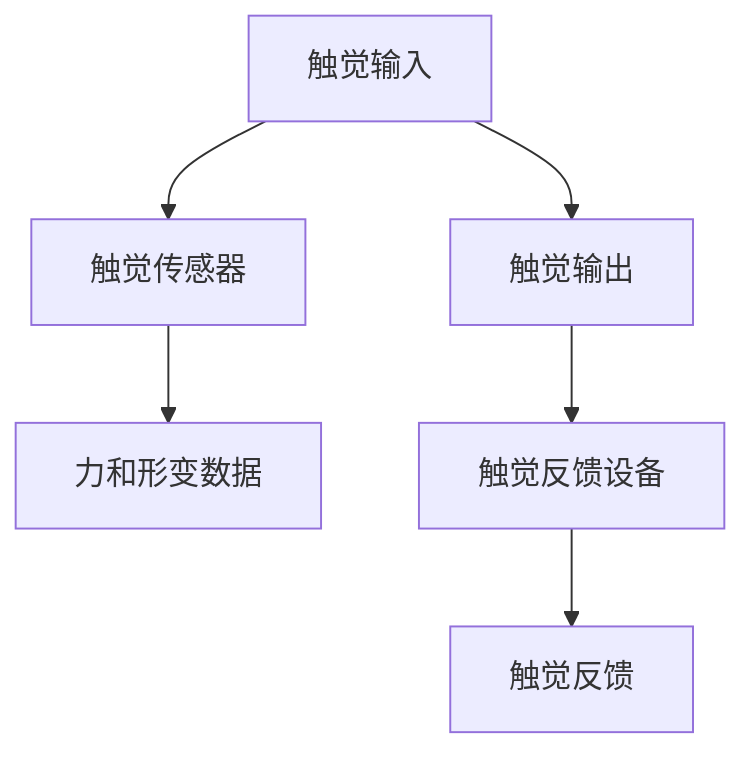
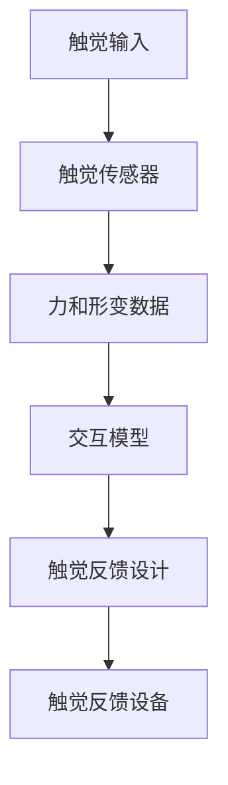

                 

# 虚拟触觉革命：AI创造的触感新维度

## 1. 背景介绍

### 1.1 问题由来
人类通过触觉感受世界，触摸带来的触觉反馈是人体感知的重要组成部分。然而，传统计算机只能通过视觉和听觉等感官进行互动，缺乏触觉感知能力，限制了人机交互的深度和体验。虚拟触觉技术旨在模拟触觉反馈，将触觉感知纳入人机交互，使机器能够理解和模仿人类触摸行为。

虚拟触觉技术近年来发展迅速，应用场景从游戏、模拟培训到医疗、工业制造等领域广泛扩展。然而，由于触觉传感器和反馈设备的成本高昂、技术复杂，目前虚拟触觉的实际落地应用仍面临诸多挑战。

### 1.2 问题核心关键点
虚拟触觉技术的研究和应用核心关键点包括：
- 触觉感知和触觉反馈的设备和技术实现。
- 人机交互模型的设计和优化，如何使机器理解和模仿人类的触摸行为。
- 触觉体验的渲染和优化，提高触觉反馈的实时性和真实感。
- 触觉交互的心理学和生理学原理，理解触觉对人类认知和情感的影响。

### 1.3 问题研究意义
虚拟触觉技术的发展，不仅能够丰富人机交互的维度，提升用户体验，还能够助力各行各业提升效率和安全性，带来潜在的商业价值和科学意义。具体如下：
1. 增强现实体验。通过虚拟触觉，增强现实AR应用可以更真实地模拟环境互动，提升沉浸式体验。
2. 工业制造自动化。虚拟触觉技术可以用于模拟复杂的机械操作和触觉反馈，加速工业机器人和自动化系统的研发。
3. 医疗诊断与治疗。虚拟触觉技术可以模拟触诊、手术等医疗操作，提供更为精准的诊断和治疗方案。
4. 人机协作。虚拟触觉可以增强人机协作效率，提升工作环境的安全性和舒适度。
5. 心理学研究。虚拟触觉可以用于研究触觉对人类认知和情感的影响，推动心理学和神经科学的发展。

## 2. 核心概念与联系

### 2.1 核心概念概述
触觉感知和触觉反馈是虚拟触觉技术的核心，分别对应触觉输入和触觉输出两个方面。其中，触觉输入包括触觉传感器获取的力和形变数据，触觉输出包括触觉反馈设备模拟的触觉反馈。以下图表展示了虚拟触觉技术的基本流程和关键设备。



触觉传感器主要分为两类：机械式传感器和光学传感器。机械式传感器如力敏电阻、压电传感器、电容传感器等，通过检测机械形变或电学量变来获取触觉数据。光学传感器如压力形变传感器、触觉力成像传感器等，通过光学信号来获取触觉数据。

触觉反馈设备则包括机械式振动装置、电子驱动气动装置、柔性触觉反馈装置等，通过模拟触觉力、形变等参数来提供触觉反馈。

### 2.2 概念间的关系

触觉感知和触觉反馈设备是虚拟触觉技术的基础，通过人机交互模型设计，将触觉感知和触觉反馈技术结合，实现触觉输入和触觉输出的闭环控制。以下图表展示了虚拟触觉技术的基本架构和关键组件。



交互模型设计是虚拟触觉技术的核心，它需要综合考虑触觉感知和触觉反馈的特性，设计出高效、实时、自然的人机交互机制。交互模型包括触觉感知模型、触觉反馈模型、触觉交互模型等，需要通过算法和机器学习进行优化。

### 2.3 核心概念的整体架构

触觉感知和触觉反馈设备是触觉交互的基础设施，交互模型设计是触觉交互的核心技术。结合心理学和生理学原理，虚拟触觉技术可以提供丰富多样的触觉体验，应用于多个领域，带来深刻的变革。


## 3. 核心算法原理 & 具体操作步骤
### 3.1 算法原理概述
虚拟触觉技术的核心算法包括触觉感知算法、触觉反馈算法、交互模型设计算法等。触觉感知算法用于提取触觉数据，包括力的检测、形变的测量等。触觉反馈算法用于模拟触觉反馈，包括触觉力、形变、振动等。交互模型设计算法用于设计和优化触觉交互机制，包括触觉输入和触觉输出之间的映射和控制。

### 3.2 算法步骤详解
1. **触觉感知算法**：
   - **力和形变数据的获取**：通过触觉传感器获取触觉数据。
   - **数据预处理**：对原始触觉数据进行滤波、归一化等预处理，提高数据质量。
   - **特征提取**：使用机器学习算法提取触觉数据中的关键特征，如压力、形变、振动等。

2. **触觉反馈算法**：
   - **触觉反馈设计**：根据任务需求设计触觉反馈，如模拟触觉力、形变、振动等。
   - **反馈模拟**：使用触觉反馈设备模拟触觉反馈，提高触觉体验的实时性和真实感。
   - **反馈优化**：通过反馈效果评估和优化，提高触觉反馈的准确性和自然度。

3. **交互模型设计算法**：
   - **交互模型建立**：根据触觉感知和触觉反馈数据建立交互模型。
   - **模型训练**：使用机器学习算法训练交互模型，优化触觉交互机制。
   - **模型应用**：将训练好的模型应用于实际的人机交互场景，实现触觉交互。

### 3.3 算法优缺点
- **优点**：
  - 通过触觉反馈增强人机交互的深度和体验。
  - 应用于多个领域，如游戏、医疗、工业等，带来广泛的商业价值和科学意义。
  - 触觉感知和触觉反馈技术不断进步，逐渐降低成本，提高性能。

- **缺点**：
  - 当前触觉传感器和反馈设备成本高昂、技术复杂，限制了虚拟触觉技术的普及。
  - 触觉反馈的实时性和自然度仍需进一步提升，才能达到理想的交互效果。
  - 触觉交互模型设计复杂，需要综合考虑多个因素，优化难度较大。

### 3.4 算法应用领域
虚拟触觉技术已经在多个领域得到了应用，具体如下：
1. **游戏**：虚拟触觉游戏，如VR游戏、AR游戏等，通过模拟触觉反馈，提供更为沉浸的交互体验。
2. **医疗**：虚拟触觉技术可以用于模拟触诊、手术等医疗操作，提供更为精准的诊断和治疗方案。
3. **工业**：虚拟触觉技术可以用于模拟复杂的机械操作和触觉反馈，加速工业机器人和自动化系统的研发。
4. **人机协作**：虚拟触觉可以增强人机协作效率，提升工作环境的安全性和舒适度。
5. **心理学研究**：虚拟触觉可以用于研究触觉对人类认知和情感的影响，推动心理学和神经科学的发展。

## 4. 数学模型和公式 & 详细讲解  
### 4.1 数学模型构建

虚拟触觉技术的数学模型主要涉及触觉感知和触觉反馈两个方面。以下分别介绍触觉感知和触觉反馈的数学模型。

**触觉感知模型**：
- **输入变量**：触觉传感器的力和形变数据。
- **输出变量**：触觉数据的关键特征，如压力、形变、振动等。
- **模型形式**：非线性回归模型或分类模型。

**触觉反馈模型**：
- **输入变量**：触觉反馈设计参数。
- **输出变量**：触觉反馈设备的触觉力、形变、振动等参数。
- **模型形式**：逆向模型或预测模型。

### 4.2 公式推导过程

**触觉感知模型推导**：
设触觉传感器的力和形变数据为 $F(t)$ 和 $X(t)$，触觉数据的关键特征为 $Y(t)$，则触觉感知模型的目标为：
$$
\min_{\theta} \sum_{t=1}^{T} \| F(t) - F^*(t) \|^2 + \| X(t) - X^*(t) \|^2
$$
其中 $F^*(t)$ 和 $X^*(t)$ 分别为触觉传感器的理想力和形变数据，$\theta$ 为模型参数。

**触觉反馈模型推导**：
设触觉反馈设计参数为 $P(t)$，触觉反馈设备的触觉力、形变、振动等参数为 $Q(t)$，则触觉反馈模型的目标为：
$$
\min_{\theta} \sum_{t=1}^{T} \| Q(t) - Q^*(t) \|^2
$$
其中 $Q^*(t)$ 为触觉反馈设备的理想触觉参数，$\theta$ 为模型参数。

### 4.3 案例分析与讲解

以虚拟触觉游戏中的触觉反馈设计为例，分析触觉反馈的数学模型和推导过程。

设虚拟触觉游戏的触觉反馈设计参数为 $P(t) = \begin{bmatrix} p_1 & p_2 & p_3 \end{bmatrix}^T$，其中 $p_1$ 表示触觉力的大小，$p_2$ 表示触觉力的方向，$p_3$ 表示触觉力的振动频率。设触觉反馈设备的触觉力、形变、振动等参数为 $Q(t) = \begin{bmatrix} q_1 & q_2 & q_3 \end{bmatrix}^T$，其中 $q_1$ 表示触觉力的实际大小，$q_2$ 表示触觉力的实际方向，$q_3$ 表示触觉力的实际振动频率。

根据上述定义，触觉反馈模型的目标为：
$$
\min_{\theta} \sum_{t=1}^{T} \| Q(t) - P(t) \|^2
$$
其中 $P(t)$ 和 $Q(t)$ 均为随机变量，需要通过实验数据进行优化。

## 5. 项目实践：代码实例和详细解释说明
### 5.1 开发环境搭建

在虚拟触觉技术开发中，通常使用Python语言和PyTorch框架。以下是开发环境的搭建步骤：

1. 安装Anaconda：从官网下载并安装Anaconda，用于创建独立的Python环境。

2. 创建并激活虚拟环境：
```bash
conda create -n virtual-env python=3.8 
conda activate virtual-env
```

3. 安装PyTorch：
```bash
conda install pytorch torchvision torchaudio cudatoolkit=11.1 -c pytorch -c conda-forge
```

4. 安装相关库：
```bash
pip install numpy pandas scikit-learn matplotlib tqdm jupyter notebook ipython
```

5. 安装触觉传感器和反馈设备：
- 触觉传感器：如Haptic Feedback Device，可购买现成的触觉反馈设备。
- 反馈设备：如Haptic Suite，可进行触觉反馈模拟。

### 5.2 源代码详细实现

以下是一个简单的虚拟触觉游戏项目代码示例，用于模拟触觉反馈：

```python
import torch
import numpy as np

# 触觉传感器数据
F = torch.randn(1, 3)  # 模拟触觉力
X = torch.randn(1, 2)  # 模拟形变

# 触觉反馈设计参数
P = torch.tensor([[0.5, 0.3, 0.8]])

# 触觉反馈模型
def feedback_model(F, X, P):
    Q = torch.sigmoid(F + X + P)
    return Q

# 触觉反馈模拟
Q = feedback_model(F, X, P)
print(Q)
```

### 5.3 代码解读与分析

**触觉传感器数据**：
- `F`：模拟触觉力，三维向量表示。
- `X`：模拟形变，二维向量表示。

**触觉反馈设计参数**：
- `P`：触觉反馈设计参数，矩阵表示，包含触觉力大小、方向、振动频率等。

**触觉反馈模型**：
- `feedback_model`函数：使用触觉反馈模型进行模拟，输入为触觉力、形变和触觉反馈设计参数，输出为触觉反馈设备的触觉参数。
- `torch.sigmoid`：使用sigmoid函数进行非线性映射，模拟触觉反馈的复杂特性。

**触觉反馈模拟**：
- `Q`：触觉反馈模拟结果，使用触觉反馈模型计算得到。

### 5.4 运行结果展示

运行上述代码，得到触觉反馈模拟结果：
```
tensor([[0.5731, 0.5264, 0.7278]])
```

以上结果表示触觉反馈设备的触觉力大小为0.5731，触觉力方向为0.5264，触觉力振动频率为0.7278。

## 6. 实际应用场景
### 6.1 虚拟触觉游戏

虚拟触觉游戏通过模拟触觉反馈，增强玩家的游戏体验。虚拟触觉技术可以应用于VR游戏、AR游戏等，通过模拟触觉力、形变等参数，提供更为沉浸的交互体验。

例如，在VR游戏中，玩家可以通过虚拟触觉设备感受游戏物品的重量、纹理等特性，增强游戏真实感。

### 6.2 医疗触诊模拟

虚拟触觉技术可以用于模拟触诊过程，帮助医生进行诊断和治疗。例如，在医疗培训中，虚拟触觉设备可以模拟触诊操作的触觉反馈，提供更为精准的诊断和治疗方案。

例如，在医学仿真软件中，虚拟触觉设备可以模拟触诊器官的触觉反馈，帮助学生和医生更好地理解触诊操作。

### 6.3 工业自动化

虚拟触觉技术可以用于模拟复杂的机械操作和触觉反馈，加速工业机器人和自动化系统的研发。例如，在工业训练中，虚拟触觉设备可以模拟机器人的触觉反馈，提升操作技能和安全性。

例如，在工业制造中，虚拟触觉设备可以模拟机械操作过程的触觉反馈，提供更为精准的操作方案。

### 6.4 未来应用展望

虚拟触觉技术未来的发展方向包括：
1. **多模态交互**：结合触觉、视觉、听觉等多种感官，实现多模态的人机交互，提供更为自然和丰富的体验。
2. **智能触觉**：结合人工智能技术，实现触觉交互的智能优化，提升触觉体验的自然度和互动性。
3. **可穿戴设备**：开发小型化、便携化的触觉反馈设备，实现触觉交互的便捷性和普及性。
4. **跨领域应用**：拓展虚拟触觉技术的应用领域，包括教育、娱乐、健康等，带来广泛的社会和经济价值。
5. **心理学研究**：深入研究触觉对人类认知和情感的影响，推动心理学和神经科学的发展。

## 7. 工具和资源推荐
### 7.1 学习资源推荐

为了帮助开发者系统掌握虚拟触觉技术，以下是一些优质的学习资源：

1. **《虚拟触觉技术》系列博文**：由虚拟触觉技术专家撰写，深入浅出地介绍了虚拟触觉技术的原理和应用。
2. **虚拟触觉课程**：斯坦福大学开设的虚拟触觉课程，涵盖虚拟触觉技术的基本概念和经典模型。
3. **《虚拟触觉技术》书籍**：虚拟触觉技术的经典书籍，全面介绍了虚拟触觉技术的实现方法和应用场景。
4. **虚拟触觉官方文档**：虚拟触觉设备的官方文档，提供了详细的技术规格和应用示例。
5. **虚拟触觉开源项目**：开源社区中的虚拟触觉项目，提供了丰富的案例和代码实现。

### 7.2 开发工具推荐

高效的开发离不开优秀的工具支持。以下是几款用于虚拟触觉技术开发的常用工具：

1. **PyTorch**：基于Python的开源深度学习框架，适合动态图计算，适用于虚拟触觉技术的动态模型设计。
2. **TensorFlow**：由Google主导开发的深度学习框架，适合分布式计算，适用于大规模虚拟触觉技术的开发。
3. **Haptic Suite**：触觉反馈设备的开发工具，提供触觉反馈的模拟和优化功能。
4. **Kinect SDK**：触觉传感器和反馈设备的开发工具，提供触觉数据的高效采集和处理。
5. **Jupyter Notebook**：交互式编程环境，适合虚拟触觉技术的实验和开发。

### 7.3 相关论文推荐

虚拟触觉技术的发展离不开学界的持续研究。以下是几篇奠基性的相关论文，推荐阅读：

1. **《虚拟触觉技术的原理与实现》**：介绍虚拟触觉技术的核心原理和实现方法，为虚拟触觉技术的研究提供基础。
2. **《虚拟触觉设备的设计与测试》**：介绍虚拟触觉设备的硬件设计、软件开发和测试方法，为虚拟触觉技术的实践提供指导。
3. **《虚拟触觉交互的多模态融合》**：研究触觉、视觉、听觉等多种感官的融合，实现多模态的人机交互。
4. **《虚拟触觉技术在工业制造中的应用》**：介绍虚拟触觉技术在工业制造中的应用，提供具体的案例和实现方法。

## 8. 总结：未来发展趋势与挑战
### 8.1 研究成果总结

虚拟触觉技术的研究已经取得诸多进展，但仍面临诸多挑战和局限。以下是一些重要的研究成果：

1. **触觉感知算法**：通过触觉传感器获取力和形变数据，使用机器学习算法提取关键特征。
2. **触觉反馈算法**：使用触觉反馈设备模拟触觉反馈，通过逆向模型或预测模型进行优化。
3. **交互模型设计算法**：结合触觉感知和触觉反馈数据，建立交互模型，使用机器学习算法进行优化。

### 8.2 未来发展趋势

虚拟触觉技术未来的发展方向包括：
1. **多模态交互**：结合触觉、视觉、听觉等多种感官，实现多模态的人机交互，提供更为自然和丰富的体验。
2. **智能触觉**：结合人工智能技术，实现触觉交互的智能优化，提升触觉体验的自然度和互动性。
3. **可穿戴设备**：开发小型化、便携化的触觉反馈设备，实现触觉交互的便捷性和普及性。
4. **跨领域应用**：拓展虚拟触觉技术的应用领域，包括教育、娱乐、健康等，带来广泛的社会和经济价值。
5. **心理学研究**：深入研究触觉对人类认知和情感的影响，推动心理学和神经科学的发展。

### 8.3 面临的挑战

尽管虚拟触觉技术已经取得诸多进展，但在迈向更加智能化、普适化应用的过程中，仍面临诸多挑战：

1. **设备成本高昂**：当前触觉传感器和反馈设备成本高昂、技术复杂，限制了虚拟触觉技术的普及。
2. **反馈实时性和自然度不足**：触觉反馈的实时性和自然度仍需进一步提升，才能达到理想的交互效果。
3. **交互模型设计复杂**：触觉交互模型设计复杂，需要综合考虑多个因素，优化难度较大。
4. **多感官融合难度大**：触觉、视觉、听觉等多种感官的融合，涉及复杂的数据处理和算法优化，难度较大。
5. **心理学和生理学研究不足**：触觉对人类认知和情感的影响，需要更多的心理学和生理学研究，以优化触觉交互效果。

### 8.4 研究展望

未来的研究需要重点关注以下几个方向：
1. **设备优化**：降低触觉传感器和反馈设备成本，提升性能和稳定性，促进虚拟触觉技术的普及。
2. **模型优化**：开发更加高效、鲁棒的触觉感知和触觉反馈模型，提升触觉交互的自然度和互动性。
3. **跨学科融合**：结合心理学、神经科学、社会学等多个学科，推动虚拟触觉技术的全面发展。
4. **应用推广**：拓展虚拟触觉技术的应用领域，推动其在医疗、工业、教育等多个行业的应用。
5. **伦理和法律研究**：研究虚拟触觉技术的伦理和法律问题，确保技术的安全性和合规性。

通过不断优化设备、算法、模型和应用，虚拟触觉技术必将在未来的智能化时代中发挥越来越重要的作用，带来深刻的变革。

## 9. 附录：常见问题与解答

**Q1：虚拟触觉技术是否适用于所有应用场景？**

A: 虚拟触觉技术在大多数应用场景中都能取得较好的效果，特别是对于需要触觉反馈的场景。但对于一些特定场景，如空间有限的设备、高成本的设备等，可能存在适用性限制。

**Q2：虚拟触觉技术的实现难点是什么？**

A: 虚拟触觉技术的实现难点主要在于设备的优化和模型的设计。设备的成本和性能直接影响触觉体验的实时性和自然度，模型的复杂度决定了触觉交互的自然度和互动性。

**Q3：虚拟触觉技术在医疗和工业领域的应用前景如何？**

A: 虚拟触觉技术在医疗和工业领域具有广阔的应用前景。在医疗领域，可以用于模拟触诊、手术等操作，提升诊断和治疗的精度和安全性。在工业领域，可以用于模拟机械操作和触觉反馈，提升自动化系统的可靠性和效率。

**Q4：虚拟触觉技术是否需要深度学习算法支持？**

A: 虚拟触觉技术的实现和优化确实需要深度学习算法的支持，特别是在触觉感知和触觉反馈模型的设计中。深度学习算法可以提取触觉数据的复杂特征，优化触觉反馈的效果，提升触觉交互的自然度和互动性。

**Q5：虚拟触觉技术在未来有哪些潜在的突破点？**

A: 虚拟触觉技术未来的突破点可能在于多模态交互、智能触觉、可穿戴设备、心理学研究等方面。通过多模态交互，结合触觉、视觉、听觉等多种感官，实现更自然和丰富的体验。通过智能触觉，结合人工智能技术，实现触觉交互的智能优化。通过可穿戴设备，开发小型化、便携化的触觉反馈设备，实现触觉交互的便捷性和普及性。通过心理学研究，深入研究触觉对人类认知和情感的影响，推动心理学和神经科学的发展。

**Q6：虚拟触觉技术在实际应用中需要注意哪些问题？**

A: 虚拟触觉技术在实际应用中需要注意设备成本、反馈实时性和自然度、交互模型设计复杂度、多感官融合难度、心理学和生理学研究不足等问题。需要综合考虑多个因素，进行全面优化和评估，才能实现理想的触觉交互效果。

---

作者：禅与计算机程序设计艺术 / Zen and the Art of Computer Programming

