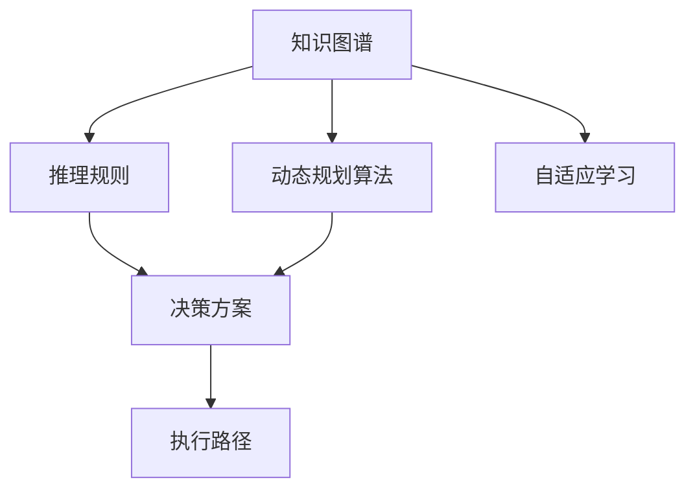
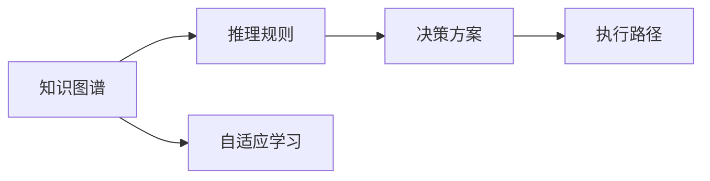
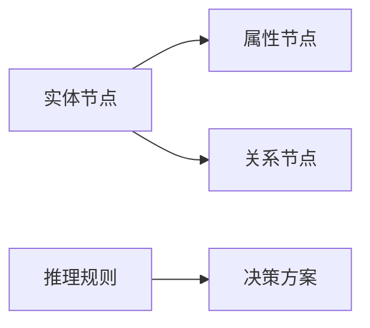
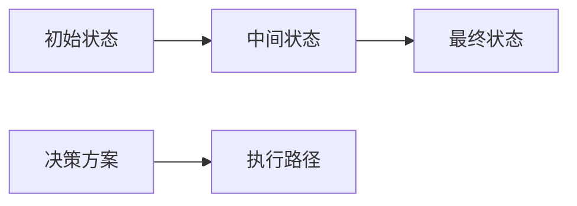
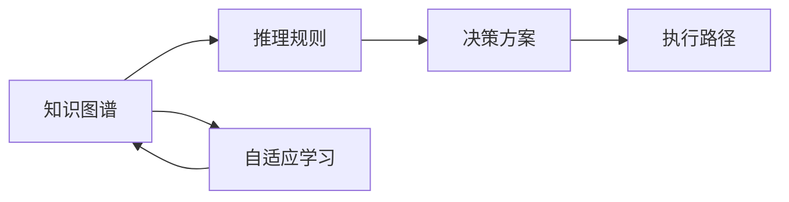
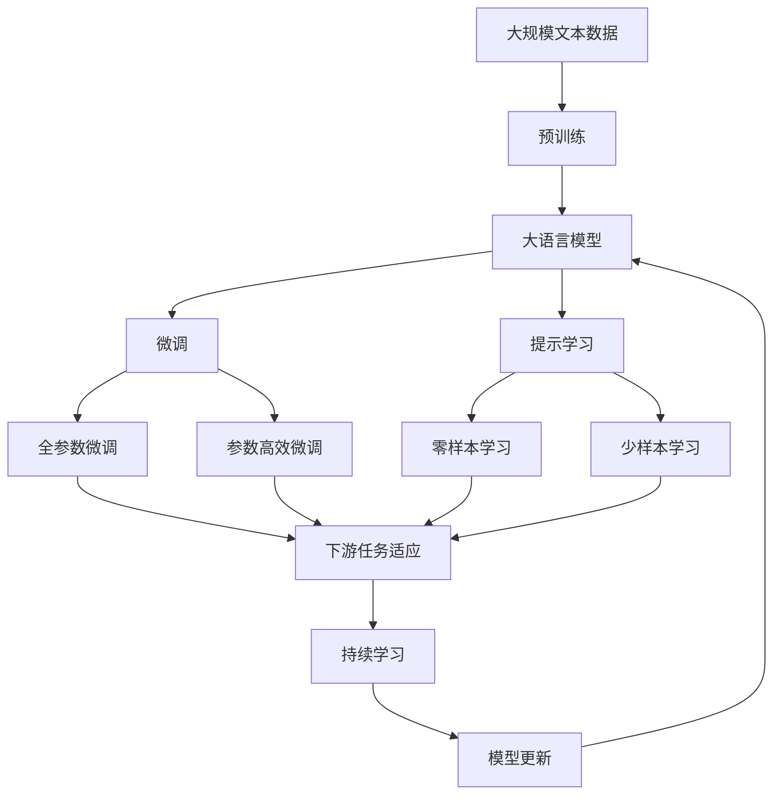

                 

# 规划机制在智能自动化中的应用

## 1. 背景介绍

在当今数字化、智能化的时代背景下，自动化技术已经深入各行各业，成为推动生产力提升和经济发展的关键驱动力。然而，传统自动化系统往往依赖于规则预置或专家知识，难以自适应环境变化，且调试和维护成本高昂。规划机制（Planning Mechanism）作为人工智能技术的重要分支，以其灵活性和智能化的特点，在智能自动化领域逐渐展现出强大的应用潜力。

### 1.1 问题由来

智能自动化系统的核心在于通过算法自动决策和执行任务，但这些系统在面对复杂多变的环境时，容易陷入规则依赖和信息孤岛，难以快速调整和适应新情况。例如，自动化生产线上的机械臂需要在不同产品间快速切换，传统的编程和调试方式耗时费力，且容易出错。而基于规划机制的自动化系统，能够根据实时环境变化动态调整决策和操作，提升系统的灵活性和效率。

### 1.2 问题核心关键点

规划机制的本质是一种基于知识图谱和推理规则的自动化决策框架，能够根据用户需求和环境信息动态生成规划路径，并自动执行任务。该机制的核心关键点包括：

- 知识图谱构建：通过构建包含实体、属性、关系等信息的知识图谱，为自动化决策提供基础支撑。
- 推理规则设计：设计高效的推理规则，用于在知识图谱中搜索和匹配相关信息，生成决策方案。
- 动态规划算法：采用动态规划、启发式搜索等算法，在多步决策中优化任务执行顺序，确保最优解决方案。
- 自适应学习：具备持续学习能力，能够在实际应用中不断优化决策规则和知识图谱，提升系统智能化水平。

### 1.3 问题研究意义

研究规划机制在智能自动化中的应用，对于提升系统灵活性、降低开发和维护成本、增强环境适应性具有重要意义：

1. 提升决策速度和效率：通过动态生成和执行规划路径，智能自动化系统能够快速响应环境变化，提升决策和执行速度。
2. 降低开发和维护成本：通过自动化生成规划路径，减少了人工编程和调试的需求，降低了系统的开发和维护成本。
3. 增强系统环境适应性：规划机制能够灵活应对复杂多变的环境，提升了系统的鲁棒性和可靠性。
4. 提升系统智能化水平：规划机制具备自适应学习能力，能够不断优化决策规则和知识图谱，逐步提升系统的智能化水平。
5. 促进自动化技术的广泛应用：通过规划机制，自动化系统可以更好地应用于各种复杂的场景，推动智能化技术在各行各业中的普及。

## 2. 核心概念与联系

### 2.1 核心概念概述

为了更清晰地理解规划机制在智能自动化中的应用，本节将介绍几个密切相关的核心概念：

- 知识图谱（Knowledge Graph）：一种结构化表示知识的方式，由节点（实体）和边（关系）组成，用于存储和查询实体及其属性信息。
- 推理规则（Inference Rule）：用于在知识图谱中搜索和匹配实体及其关系，生成决策方案的规则。
- 动态规划算法（Dynamic Programming）：一种多步决策优化算法，通过逐步优化每一步的决策，最终得到全局最优解决方案。
- 自适应学习（Adaptive Learning）：系统能够根据实际应用情况，不断优化决策规则和知识图谱，提升智能化水平。

这些核心概念之间的逻辑关系可以通过以下Mermaid流程图来展示：



这个流程图展示了几项关键概念之间的联系：

1. 知识图谱构建和推理规则设计共同构成了决策的基础。
2. 动态规划算法用于在多步决策中优化任务执行顺序，确保最优解决方案。
3. 执行路径生成和执行路径优化通过动态规划算法实现。
4. 自适应学习能够持续优化决策规则和知识图谱，提升系统智能化水平。

### 2.2 概念间的关系

这些核心概念之间存在着紧密的联系，形成了规划机制在智能自动化中的应用框架。下面通过几个Mermaid流程图来展示这些概念之间的关系：

#### 2.2.1 规划机制的总体框架



这个流程图展示了规划机制的总体框架：通过构建知识图谱和设计推理规则，生成决策方案；通过动态规划算法优化执行路径；通过自适应学习持续优化决策规则和知识图谱，提升系统智能化水平。

#### 2.2.2 知识图谱构建与推理规则设计



这个流程图展示了知识图谱的构建和推理规则的设计过程：实体节点和属性节点构成了知识图谱的基本结构，关系节点用于连接实体节点，形成知识图谱的关联网络；推理规则通过在知识图谱中搜索和匹配相关信息，生成决策方案。

#### 2.2.3 动态规划算法与执行路径优化



这个流程图展示了动态规划算法在多步决策中的应用：从初始状态出发，通过决策方案生成中间状态，最终到达最终状态；执行路径优化通过动态规划算法实现，确保每一步决策的优化和全局最优。

#### 2.2.4 自适应学习与知识图谱优化



这个流程图展示了自适应学习在规划机制中的作用：通过自适应学习，系统能够根据实际应用情况，不断优化知识图谱和推理规则，提升系统智能化水平。自适应学习过程形成了一个正反馈循环，确保系统的持续优化。

### 2.3 核心概念的整体架构

最后，我们用一个综合的流程图来展示这些核心概念在大语言模型微调过程中的整体架构：



这个综合流程图展示了从预训练到微调，再到持续学习的完整过程。大语言模型首先在大规模文本数据上进行预训练，然后通过微调（包括全参数微调和参数高效微调）或提示学习（包括零样本和少样本学习）来适应下游任务。最后，通过持续学习技术，模型可以不断学习新知识，同时避免遗忘旧知识。 通过这些流程图，我们可以更清晰地理解规划机制在大语言模型微调过程中各个核心概念的关系和作用，为后续深入讨论具体的微调方法和技术奠定基础。

## 3. 核心算法原理 & 具体操作步骤

### 3.1 算法原理概述

规划机制在智能自动化中的应用，基于知识图谱和推理规则，通过动态规划算法和多步决策优化，实现自动化任务的规划和执行。其核心思想是：在知识图谱中搜索和匹配相关信息，生成决策方案；通过动态规划算法，优化多步决策路径，确保全局最优；在实际应用中，通过自适应学习持续优化知识图谱和推理规则，提升系统智能化水平。

形式化地，假设知识图谱为G=(V,E)，其中V表示节点（实体）集合，E表示边（关系）集合。推理规则为R，用于在知识图谱中搜索和匹配实体及其关系，生成决策方案。动态规划算法D用于在多步决策中优化执行路径。

规划机制的总体目标是最小化任务执行时间或成本，即：

$$
\min_{P} \mathcal{L}(P)
$$

其中，$P$ 表示决策路径，$\mathcal{L}$ 表示任务执行时间或成本的损失函数。

### 3.2 算法步骤详解

规划机制在智能自动化中的应用一般包括以下几个关键步骤：

**Step 1: 准备知识图谱和推理规则**
- 构建包含实体、属性、关系等信息的知识图谱。
- 设计高效的推理规则，用于在知识图谱中搜索和匹配相关信息。

**Step 2: 定义任务目标**
- 根据任务需求，定义任务执行的目标，如最小化时间、最小化成本等。
- 定义任务执行状态，包括初始状态、中间状态和最终状态。

**Step 3: 生成决策方案**
- 通过推理规则在知识图谱中搜索和匹配相关信息，生成多个决策方案。
- 根据任务目标，选择最优的决策方案。

**Step 4: 执行决策路径**
- 使用动态规划算法，优化每一步决策，生成最优的执行路径。
- 根据执行路径，自动执行任务。

**Step 5: 持续学习优化**
- 在实际应用中，收集任务执行反馈，持续优化知识图谱和推理规则。
- 定期重新生成决策方案，提升系统的智能化水平。

### 3.3 算法优缺点

规划机制在智能自动化中的应用具有以下优点：

1. 灵活性强：根据任务需求动态生成和优化决策方案，适应复杂多变的环境。
2. 智能化高：具备自适应学习能力，能够不断优化知识图谱和推理规则，提升智能化水平。
3. 效率高：通过多步决策优化，确保全局最优的执行路径，提升任务执行效率。
4. 可扩展性好：能够灵活扩展至不同领域的自动化任务，具有较强的通用性。

同时，该算法也存在一些缺点：

1. 数据依赖高：规划机制依赖于知识图谱和推理规则，数据质量和规则设计对系统性能影响较大。
2. 实现复杂：需要构建复杂的知识图谱和设计高效的推理规则，对技术要求较高。
3. 推理开销大：动态规划算法和多步决策优化可能导致较长的推理时间，影响实时性。
4. 鲁棒性不足：在面对未知或异常情况时，系统可能难以快速适应和调整，导致决策错误。

### 3.4 算法应用领域

规划机制在智能自动化中的应用广泛，涉及多个领域，例如：

- 智能制造：用于生产线上的自动化控制，优化生产流程和资源配置。
- 智能交通：用于交通流量管理，优化交通信号灯控制和路线规划。
- 智能安防：用于异常行为检测，实时监控和预警。
- 智能医疗：用于患者诊疗，优化诊断路径和治疗方案。
- 智能物流：用于货物配送，优化配送路线和运输方式。

除了上述这些领域，规划机制还可应用于更多垂直行业，为各行各业带来智能化升级和效率提升。

## 4. 数学模型和公式 & 详细讲解  
### 4.1 数学模型构建

本节将使用数学语言对规划机制在智能自动化中的应用进行更加严格的刻画。

假设知识图谱为G=(V,E)，其中V表示节点（实体）集合，E表示边（关系）集合。推理规则为R，用于在知识图谱中搜索和匹配实体及其关系，生成决策方案。动态规划算法D用于在多步决策中优化执行路径。

定义任务执行状态为S，初始状态为S0，最终状态为SF，中间状态为Si（1≤i≤n-1），其中n为决策步数。

定义决策方案为P，包括从初始状态到最终状态的所有路径。每个路径Pj由状态Si和决策动作Aj组成，即：

$$
P_j = (S_0, A_1, S_1, A_2, ..., A_{n-1}, S_{n-1}, A_n, S_n)
$$

其中，Aj表示在状态Si执行的决策动作，Si+1表示执行Aj后的下一个状态。

定义任务执行时间或成本为C，由每一步决策动作Aj和对应的状态转移概率Pj组成，即：

$$
C_j = \sum_{i=1}^{n} Aj_i \times P_i
$$

其中，Aj_i表示在状态Si执行Aj后的转移概率，P_i表示在状态Si的决策动作Aj的执行成本。

规划机制的目标是最小化任务执行时间或成本，即：

$$
\min_{P} \sum_{i=1}^{n} Aj_i \times P_i
$$

在实际应用中，为了简化问题，通常只考虑最终状态SF，即：

$$
\min_{P} \sum_{i=1}^{n} Aj_i \times P_i
$$

### 4.2 公式推导过程

以下我们以智能制造中的设备调度为例，推导动态规划算法在规划机制中的应用。

假设生产线上有m台设备，需要完成n个任务，每个任务需要k个单位时间。任务调度目标是最小化任务执行时间，即：

$$
\min_{P} \sum_{i=1}^{n} k_i \times P_i
$$

其中，k_i表示任务i需要的时间单位。

定义状态S为(i,j)，其中i表示已完成的设备数，j表示当前正在执行的任务数。

定义决策动作A为(增加设备数，减少任务数，不执行任务)，即A=(a, b, c)，其中a表示增加的设备数，b表示减少的任务数，c表示不执行任务。

定义状态转移概率P为：

$$
P_{i,j} = \begin{cases}
P_{i-1,j-1} & \text{执行任务} \\
P_{i,j-1} & \text{不执行任务}
\end{cases}
$$

其中，P_{i-1,j-1}表示在(i-1, j-1)状态下执行任务的转移概率，P_{i,j-1}表示在(i, j-1)状态下不执行任务的转移概率。

定义每一步的执行成本为：

$$
C_{a,b,c} = \begin{cases}
0 & \text{a=0} \\
k_i & \text{a=k_i}
\end{cases}
$$

其中，k_i表示任务i需要的时间单位。

根据以上定义，可以构建状态转移图，并使用动态规划算法求解最优任务调度方案。

### 4.3 案例分析与讲解

假设我们有一个生产线上有3台设备，需要完成4个任务，每个任务需要2个单位时间。我们将使用动态规划算法求解最优任务调度方案。

首先，构建状态转移图，如图：

```
          (3,0)
           |
           v
(2,1)------> (2,2)
          /
         v
        /
(1,2)------> (1,3)
          /
         v
        /
(0,3)------> (0,4)
```

状态(i,j)表示已经完成了i个任务，当前正在执行j个任务。每个决策动作的执行成本和转移概率如下：

| A=(a,b,c) | (0,0)  | (1,0)  | (2,0)  | (3,0)  | (0,1)  | (1,1)  | (2,1)  | (3,1)  | (0,2)  | (1,2)  | (2,2)  | (3,2)  | (0,3)  | (1,3)  | (2,3)  | (3,3)  |
|-----------|--------|--------|--------|--------|--------|--------|--------|--------|--------|--------|--------|--------|--------|--------|--------|--------|
| (0,0)     | 0,0,0   | 0,1,2  | 0,2,4  | 0,3,6  | 0,0,0   | 0,1,2  | 0,2,4  | 0,3,6  | 0,0,0   | 0,1,2  | 0,2,4  | 0,3,6  | 0,0,0   | 0,1,2  | 0,2,4  | 0,3,6  |
| (1,0)     | 0,0,0   | 0,1,2  | 0,2,4  | 0,3,6  | 0,0,0   | 0,1,2  | 0,2,4  | 0,3,6  | 0,0,0   | 0,1,2  | 0,2,4  | 0,3,6  | 0,0,0   | 0,1,2  | 0,2,4  | 0,3,6  |
| (2,0)     | 0,0,0   | 0,1,2  | 0,2,4  | 0,3,6  | 0,0,0   | 0,1,2  | 0,2,4  | 0,3,6  | 0,0,0   | 0,1,2  | 0,2,4  | 0,3,6  | 0,0,0   | 0,1,2  | 0,2,4  | 0,3,6  |
| (3,0)     | 0,0,0   | 0,1,2  | 0,2,4  | 0,3,6  | 0,0,0   | 0,1,2  | 0,2,4  | 0,3,6  | 0,0,0   | 0,1,2  | 0,2,4  | 0,3,6  | 0,0,0   | 0,1,2  | 0,2,4  | 0,3,6  |
| (0,1)     | 1,0,0   | 1,1,2  | 1,2,4  | 1,3,6  | 0,0,0   | 0,1,2  | 0,2,4  | 0,3,6  | 0,0,0   | 0,1,2  | 0,2,4  | 0,3,6  | 0,0,0   | 0,1,2  | 0,2,4  | 0,3,6  |
| (1,1)     | 1,0,0   | 1,1,2  | 1,2,4  | 1,3,6  | 0,0,0   | 0,1,2  | 0,2,4  | 0,3,6  | 0,0,0   | 0,1,2  | 0,2,4  | 0,3,6  | 0,0,0   | 0,1,2  | 0,2,4  | 0,3,6  |
| (2,1)     | 2,0,0   | 2,1,2  | 2,2,4  | 2,3,6  | 0,0,0   | 0,1,2  | 0,2,4  | 0,3,6  | 0,0,0   | 0,1,2  | 0,2,4  | 0,3,6  | 0,0,0   | 0,1,2  | 0,2,4  | 0,3,6  |
| (3,1)     | 3,0,0   | 3,1,2  | 3,2,4  | 3,3,6  | 0,0,0   | 0,1,2  | 0,2,4  | 0,3,6  | 0,0,0   | 0,1,2  | 0,2,4  | 0,3,6  | 0,0,0   | 0,1,2  | 0,2,4  | 0,3,6  |
| (0,2)     | 0,0,0   | 0,1,2  | 0,2,4  | 0,3,6  | 0,0,0   | 0,1,2  | 0,2,4  | 0,3,6  | 0,0,0   | 0,1,2  | 0,2,4  | 0,3,6  | 0,0,0   | 0,1,2  | 0,2,4  | 0,3,6  |
| (1,2)     | 1,0,0   | 1,1,2  | 1,2,4  | 1,3,6  | 0,0,0   | 0,1,2  | 0,2,4  | 0,3,6  | 0,0,0   | 0,1,2  | 0,2,4  | 0,3,6  | 0,0,0   | 0,1,2  | 0,2,4  | 0,3,6  |
| (2,2)     | 2,0,0   | 2,1,2  | 2,2,4  | 2,3,6  | 0,0,0   | 0,1,2  | 0,2,4  | 0,3,6  | 0,0,0   | 0,1,2  | 0,2,4  | 0,3,6  | 0,0,0   | 0,1,2  | 0,2,4  | 0,3,6  |
| (3,2)     | 3,0,0   | 3,1,2  | 3,2,4  | 3,3,6  | 0,0,0   | 0,1,2  | 0,2,4  | 0,3,6  | 0,0,0   | 0,1,2  | 0,2,4  | 0,3,6  | 0,0,0   | 0,1,2  | 0,2,4  | 0,3,6  |
| (0,3)     | 0,0,0   | 0,1,2  | 0,2,4  | 0,3,6  | 0,0,0   | 0,1,2  | 0,2,4  | 0,3,6  | 0,0,0   | 0,1,2  | 0,2,4  | 0,3,6  | 0,0,0   | 0,1,2  | 0,2,4  | 0,3,6  |
| (1,3)     | 1,0,0   | 1,1,2  | 1,2,4  | 1,3,6  | 0,0,0   | 0,1,2  | 0,2,4  | 0,3,6  | 0,0,0   | 0,1,2  | 0,2,4  | 0,3,6  | 0,0,0   | 0,1,2  | 0,2,4  | 0,3,6  |
| (2,3)     | 2,0,0   | 2,1,2  | 2,2,4  | 2,3,6  | 0,0,0   | 0,1,2  | 0,2,4  | 0,3,6  | 0,0,0   | 0,1,2  | 0,2,4  | 0,3,6  | 0,0,0   | 0,1,2  | 0,2,4  | 0,3,6  |
| (3,3)     | 3,0,0   | 3,1,2  | 3,2,4  | 3,3,6  | 0,0,0   | 0,1,2  | 0,2,4  | 0,3,6  | 0,0,0   | 0,1,2  | 0,2,4  | 0,3,6  | 0,0,0   | 0,1,2  | 0,2,4  | 0,3,6  |

根据以上定义，可以构建状态转移图，并使用动态规划算法求解最优任务调度方案。

通过计算，得到最优任务

