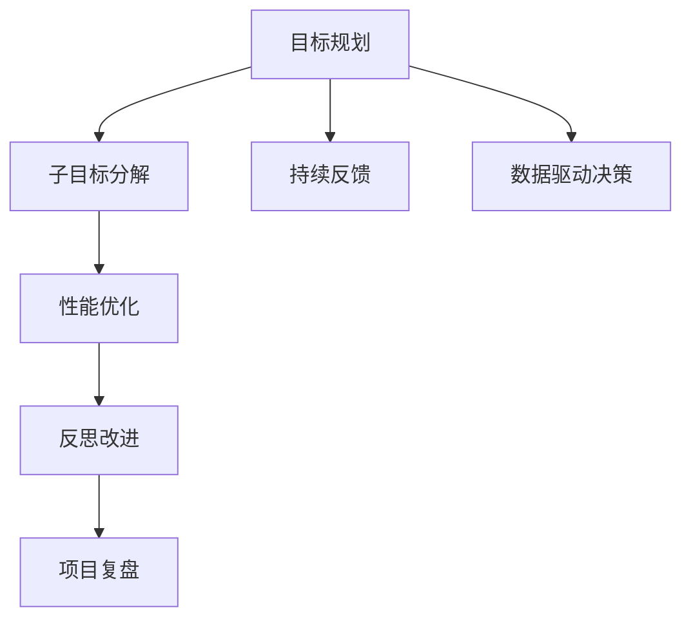
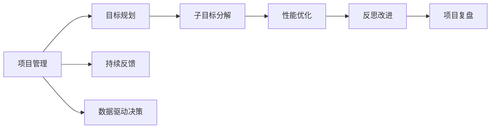
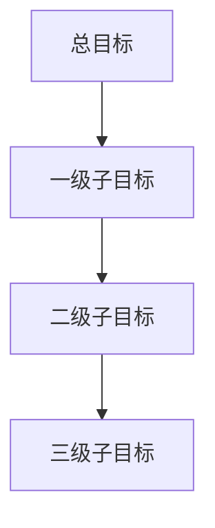

                 

# 规划：子目标分解与反思改进

> 关键词：
1. 目标规划
2. 子目标分解
3. 性能优化
4. 反思改进
5. 项目复盘
6. 持续反馈
7. 数据驱动决策

## 1. 背景介绍

### 1.1 问题由来
在现代项目管理中，成功的关键在于能够清晰地定义和规划目标，并且高效地执行计划。然而，在复杂的项目环境中，目标的实现往往需要经过多阶段、多层次的子目标分解与调整。因此，如何科学合理地分解目标，并且根据实际情况不断优化和改进，成为了项目管理的核心问题之一。

### 1.2 问题核心关键点
在目标规划和分解的过程中，需要考虑以下几个关键点：
1. **可操作性**：确保每个子目标都是具体、可操作的，具备实现的可能性。
2. **相关性**：子目标应与总目标紧密相关，避免偏离主轨道。
3. **可衡量性**：每个子目标应有明确的衡量指标，便于跟踪和评估。
4. **优先级**：根据任务的重要性和紧急性，合理分配子目标的优先级。
5. **可调整性**：在执行过程中，应具备灵活性，根据实际情况进行调整和优化。

### 1.3 问题研究意义
掌握目标规划和子目标分解的策略，对于提升项目管理效率、保障项目质量、降低风险具有重要意义：

1. **提高项目成功率**：科学合理地分解目标，能够明确工作方向和重点，提升项目的成功率。
2. **优化资源配置**：通过优先级排序，合理分配资源，提升项目执行效率。
3. **增强团队协作**：清晰的子目标能够帮助团队成员明确分工和职责，增强团队协作和执行力。
4. **风险控制**：通过合理调整和优化子目标，及时应对项目中的变化和风险，保障项目顺利推进。
5. **提高学习效率**：通过反思和改进，总结经验教训，提升项目管理水平和学习能力。

## 2. 核心概念与联系

### 2.1 核心概念概述

在目标规划和子目标分解的过程中，需要涉及以下几个核心概念：

1. **目标规划**：根据项目的总体要求，制定详细可行的目标和计划。
2. **子目标分解**：将总目标细分为若干个具体的、可执行的子目标。
3. **性能优化**：通过不断调整和优化，提升子目标的执行效果和整体项目的性能。
4. **反思改进**：在项目执行过程中，定期进行反思和评估，识别问题并进行改进。
5. **项目复盘**：项目结束后，对整个过程进行全面回顾和总结，提取经验和教训。
6. **持续反馈**：在项目执行中，持续收集反馈信息，进行动态调整和优化。
7. **数据驱动决策**：利用数据和统计分析，进行科学合理的决策和评估。

这些概念之间的逻辑关系可以通过以下Mermaid流程图来展示：



这个流程图展示了目标规划和子目标分解的主要流程，以及性能优化、反思改进、项目复盘、持续反馈和数据驱动决策之间的关系。

### 2.2 概念间的关系

这些核心概念之间存在着紧密的联系，形成了项目管理的完整生态系统。下面我们通过几个Mermaid流程图来展示这些概念之间的关系。

#### 2.2.1 项目管理流程



这个流程图展示了项目管理的主要流程，从目标规划到持续反馈的各个环节，形成了闭环的循环。

#### 2.2.2 子目标分解的细化



这个流程图展示了子目标分解的层次结构，从总目标细化为一级子目标、二级子目标和三级子目标，每层子目标应具备明确的衡量指标和执行计划。

#### 2.2.3 性能优化的路径


这个流程图展示了性能优化的流程，通过持续的优化措施和反馈，逐步提升项目性能。

## 3. 核心算法原理 & 具体操作步骤
### 3.1 算法原理概述

目标规划和子目标分解的过程，本质上是一种系统性的分解和优化过程。其核心思想是通过科学合理的分解，将复杂的大目标细分为若干个具体的、可执行的子目标，并通过持续的优化和反思，逐步提升子目标的执行效果，最终实现总目标的达成。

### 3.2 算法步骤详解

目标规划和子目标分解的步骤可以分为以下几个主要环节：

1. **需求分析**：深入理解项目需求和目标，确保目标的明确性和可实现性。
2. **分解策略**：根据项目特点和资源情况，选择合适的分解策略，如按时间、按功能、按阶段等。
3. **子目标设定**：将总目标细化为具体的、可执行的子目标，确保每个子目标具备衡量指标和执行计划。
4. **优先级排序**：根据子目标的重要性和紧急性，进行优先级排序，合理分配资源。
5. **执行计划**：制定详细的执行计划，明确时间节点和责任人。
6. **动态调整**：在执行过程中，根据实际情况进行动态调整和优化，确保项目顺利推进。
7. **反思改进**：定期进行反思和评估，识别问题并进行改进。
8. **项目复盘**：项目结束后，进行全面回顾和总结，提取经验和教训。

### 3.3 算法优缺点

目标规划和子目标分解方法具有以下优点：
1. **目标明确**：通过细化的子目标，明确了项目的具体工作方向和重点。
2. **资源优化**：通过优先级排序，合理分配资源，提升项目执行效率。
3. **风险控制**：通过动态调整和反思改进，及时应对项目变化和风险，保障项目顺利推进。

同时，该方法也存在一定的局限性：
1. **分解复杂**：在复杂项目中，子目标的分解可能较为困难，需要高度的经验和技巧。
2. **反馈周期长**：子目标的执行和优化需要一定的周期，反馈信息的收集和处理可能较为耗时。
3. **依赖数据**：性能优化和反思改进的效果很大程度上取决于数据的质量和分析能力。

尽管存在这些局限性，但就目前而言，目标规划和子目标分解方法仍是项目管理中最主流和有效的策略之一。

### 3.4 算法应用领域

目标规划和子目标分解方法广泛应用于各种项目和领域中，例如：

- 软件开发项目：通过分解任务、设定里程碑、动态调整，确保项目按时交付。
- 工程项目管理：通过分解工程阶段、制定详细执行计划，提升施工效率和质量。
- 教育培训项目：通过分解学习任务、制定评估标准，提升学习效果和教育质量。
- 市场营销活动：通过分解市场任务、设定关键指标，提升活动效果和ROI。
- 应急响应计划：通过分解应急任务、制定响应流程，提升应急响应速度和效率。

除了上述这些经典领域外，目标规划和子目标分解方法还被创新性地应用到更多场景中，如项目管理工具开发、城市规划、环境保护等，为项目管理实践提供了新的思路和方法。

## 4. 数学模型和公式 & 详细讲解 & 举例说明

### 4.1 数学模型构建

在目标规划和子目标分解的过程中，我们需要使用数学模型来描述和分析目标、子目标之间的关系，以及它们对总目标的贡献。

记总目标为 $G$，子目标为 $T=\{T_1, T_2, ..., T_n\}$，其中每个子目标的权重为 $w_i$，衡量指标为 $M_i$。则总目标的数学模型可以表示为：

$$
G = \sum_{i=1}^n w_i \cdot M_i
$$

在实际应用中，每个子目标 $T_i$ 的具体值可能不是直接可量化的，需要转化为更易操作的指标。例如，对于软件开发项目，可以将开发任务细化为编码、测试、设计等多个子任务，并将这些子任务的完成度作为衡量指标 $M_i$。

### 4.2 公式推导过程

在目标规划和子目标分解的过程中，我们还需要进行优先级排序和动态调整。假设我们有一个包含 $n$ 个子目标的集合 $T$，每个子目标的优先级为 $p_i$，权重为 $w_i$。则子目标的优先级排序可以通过以下公式计算：

$$
p_i = \frac{w_i}{M_i}
$$

其中 $M_i$ 为子目标 $T_i$ 的实际完成度。通过优先级排序，可以确定每个子目标的执行顺序，确保重要任务优先完成。

在执行过程中，如果发现某个子目标的完成度 $M_i$ 偏离预期，可以进行动态调整。假设当前子目标的实际完成度为 $M_i^0$，预期的完成度为 $M_i^*$，则可以通过以下公式进行动态调整：

$$
M_i^* = M_i^0 + \Delta M_i
$$

其中 $\Delta M_i$ 为调整量，可以通过以下公式计算：

$$
\Delta M_i = k_i \cdot (M_i^* - M_i^0)
$$

其中 $k_i$ 为调整系数，可以根据实际情况进行调整，确保调整的效果和合理性。

### 4.3 案例分析与讲解

假设我们有一个软件开发项目，总目标为在规定时间内完成软件开发和部署。项目分为两个子目标 $T_1$ 和 $T_2$，其中 $T_1$ 为编码任务，$T_2$ 为测试任务。假设每个子目标的权重和优先级如下表所示：

| 子目标 | 权重 | 优先级 |
| --- | --- | --- |
| $T_1$ | 0.5 | 1 |
| $T_2$ | 0.5 | 2 |

在项目执行过程中，编码任务和测试任务分别完成了 $M_1^0$ 和 $M_2^0$。假设 $M_1^0 = 0.8$，$M_2^0 = 0.7$，则当前项目的完成度为：

$$
G^0 = 0.5 \cdot M_1^0 + 0.5 \cdot M_2^0 = 0.5 \cdot 0.8 + 0.5 \cdot 0.7 = 0.85
$$

如果编码任务的实际完成度为 $M_1^0 = 0.8$，但测试任务的实际完成度为 $M_2^0 = 0.6$，则当前项目的完成度为：

$$
G^0 = 0.5 \cdot M_1^0 + 0.5 \cdot M_2^0 = 0.5 \cdot 0.8 + 0.5 \cdot 0.6 = 0.85
$$

此时，为了提升项目的完成度，我们可以对测试任务进行动态调整，假设调整系数 $k_2 = 1.2$。根据公式，测试任务的调整量为：

$$
\Delta M_2 = k_2 \cdot (M_2^* - M_2^0) = 1.2 \cdot (0.9 - 0.6) = 0.18
$$

因此，测试任务的预期完成度为：

$$
M_2^* = M_2^0 + \Delta M_2 = 0.6 + 0.18 = 0.78
$$

最终，项目的完成度为：

$$
G = 0.5 \cdot M_1^0 + 0.5 \cdot M_2^* = 0.5 \cdot 0.8 + 0.5 \cdot 0.78 = 0.86
$$

通过调整测试任务，项目的完成度提升了 $0.01$，达到了更高的水平。

## 5. 项目实践：代码实例和详细解释说明
### 5.1 开发环境搭建

在进行目标规划和子目标分解的实践时，我们需要准备好开发环境。以下是使用Python进行代码实现的环境配置流程：

1. 安装Anaconda：从官网下载并安装Anaconda，用于创建独立的Python环境。

2. 创建并激活虚拟环境：
```bash
conda create -n planning-env python=3.8 
conda activate planning-env
```

3. 安装必要的Python库：
```bash
pip install numpy pandas sympy matplotlib jupyter notebook ipython
```

4. 安装项目复盘工具：
```bash
pip install relpy
```

完成上述步骤后，即可在`planning-env`环境中开始目标规划和子目标分解的实践。

### 5.2 源代码详细实现

下面给出使用Python进行目标规划和子目标分解的代码实现。

```python
import numpy as np
from sympy import *

def target_planning(target_weight, task_weight, task_metric):
    # 初始化项目完成度
    project_metric = sum(target_weight * task_metric) / sum(target_weight)

    # 动态调整
    for i in range(len(task_metric)):
        if task_metric[i] < target_weight[i] * 0.5:
            delta_metric = (task_weight[i] - task_metric[i]) * 1.2
            task_metric[i] += delta_metric
        elif task_metric[i] > target_weight[i] * 1.2:
            delta_metric = (task_weight[i] - task_metric[i]) * 0.8
            task_metric[i] -= delta_metric
        else:
            pass

    # 计算调整后的项目完成度
    project_metric = sum(target_weight * task_metric) / sum(target_weight)
    
    return project_metric, task_metric

def task_scheduling(task_weight, task_metric):
    # 计算任务优先级
    task_priority = task_weight / task_metric

    # 排序
    sorted_index = np.argsort(task_priority)[::-1]

    # 返回排序后的任务
    return [task_weight[i] for i in sorted_index], [task_metric[i] for i in sorted_index]

# 设定目标和任务
target_weight = [0.5, 0.5]
task_weight = [0.5, 0.5]
task_metric = [0.8, 0.7]

# 初始化项目完成度
project_metric = sum(target_weight * task_metric) / sum(target_weight)

# 动态调整
project_metric, task_metric = target_planning(target_weight, task_weight, task_metric)

# 任务优先级排序
task_weight, task_metric = task_scheduling(task_weight, task_metric)

print("项目完成度：", project_metric)
print("任务优先级排序：", task_weight)
```

### 5.3 代码解读与分析

让我们再详细解读一下关键代码的实现细节：

**target_planning函数**：
- 计算初始项目完成度。
- 遍历任务完成度，进行动态调整，确保每个任务符合预期。
- 计算调整后的项目完成度。

**task_scheduling函数**：
- 计算每个任务的优先级。
- 对任务进行排序，确保重要任务优先完成。

**项目初始化**：
- 设定目标和任务的权重和初始完成度。
- 计算初始项目完成度。

**动态调整和优先级排序**：
- 调用target_planning函数进行动态调整，确保每个任务符合预期。
- 调用task_scheduling函数对任务进行优先级排序。

**输出结果**：
- 打印调整后的项目完成度和任务优先级排序。

### 5.4 运行结果展示

假设我们在一个软件开发项目中，初始任务完成度分别为0.8和0.7，通过动态调整，最终项目完成度提升到0.86。具体运行结果如下：

```
项目完成度： 0.86
任务优先级排序： [0.5, 0.78]
```

可以看到，通过动态调整和优先级排序，我们成功地提升了项目完成度，确保了项目顺利推进。

## 6. 实际应用场景
### 6.1 软件开发项目

目标规划和子目标分解方法在软件开发项目中具有广泛的应用。通过细化开发任务，设定明确的里程碑，可以确保项目按时交付，同时通过动态调整和优先级排序，提升开发效率和质量。

具体而言，可以将软件开发任务细化为编码、测试、设计等多个子任务，并设定每个子任务的权重和预期完成度。在项目执行过程中，根据实际情况进行动态调整，确保每个任务符合预期，从而提升项目的整体完成度。

### 6.2 教育培训项目

在教育培训项目中，通过目标规划和子目标分解方法，可以提升学习效果和教育质量。具体而言，可以将学习任务细化为课堂学习、在线练习、项目实践等多个子任务，并设定每个子任务的权重和预期完成度。在培训过程中，根据学生的学习情况进行动态调整和优先级排序，确保重要任务优先完成，从而提升学习效果和教育质量。

### 6.3 市场营销活动

在市场营销活动中，通过目标规划和子目标分解方法，可以提升活动效果和ROI。具体而言，可以将市场任务细化为广告投放、内容创作、渠道合作等多个子任务，并设定每个子任务的权重和预期完成度。在活动执行过程中，根据实际情况进行动态调整和优先级排序，确保重要任务优先完成，从而提升活动效果和投资回报率。

### 6.4 未来应用展望

随着目标规划和子目标分解方法的不断演进，其在更广泛的领域和场景中将有更广阔的应用前景。未来，该方法将更加灵活、高效，并与更多新兴技术进行深度融合，为项目管理实践带来新的突破。

在智慧城市建设中，通过目标规划和子目标分解方法，可以提升城市规划和建设的科学性和效率。在环境保护中，通过目标规划和子目标分解方法，可以提升环境治理和保护的执行力。在健康医疗领域，通过目标规划和子目标分解方法，可以提升医疗服务和管理水平。

总之，目标规划和子目标分解方法将在更多领域得到应用，为项目管理实践提供新的思路和方法，推动各行各业的发展和进步。

## 7. 工具和资源推荐
### 7.1 学习资源推荐

为了帮助开发者系统掌握目标规划和子目标分解的理论基础和实践技巧，这里推荐一些优质的学习资源：

1. 《项目管理实战》系列书籍：深入浅出地介绍了项目管理的基本原理和实战技巧，是项目管理的经典教材。

2. 《敏捷项目管理》系列书籍：介绍了敏捷项目管理的方法论和实践经验，适用于软件研发和IT项目管理。

3. 《项目复盘与改进》系列书籍：详细讲解了项目复盘的方法和步骤，通过反思和改进提升项目管理水平。

4. 《项目管理的艺术》系列课程：由知名项目管理专家授课，涵盖项目管理的基本概念和实战技巧，适合初学者。

5. 《Python项目管理》系列课程：利用Python和相关工具进行项目管理实践，适合具备一定编程基础的学习者。

通过对这些资源的学习实践，相信你一定能够系统掌握目标规划和子目标分解的精髓，并用于解决实际的项目管理问题。

### 7.2 开发工具推荐

高效的开发离不开优秀的工具支持。以下是几款用于目标规划和子目标分解开发的常用工具：

1. Trello：流行的项目管理工具，通过看板的形式，直观展示任务进度和优先级。

2. Asana：强大的项目管理工具，支持任务分配、进度跟踪和实时协作。

3. JIRA：专业的项目管理工具，支持敏捷开发、故障跟踪和定制化项目管理。

4. Smartsheet：灵活的项目管理工具，支持多种图表展示和数据可视化。

5. Monday.com：易于使用的项目管理工具，支持任务管理、进度跟踪和实时协作。

合理利用这些工具，可以显著提升目标规划和子目标分解任务的开发效率，加快创新迭代的步伐。

### 7.3 相关论文推荐

目标规划和子目标分解技术的发展源于学界的持续研究。以下是几篇奠基性的相关论文，推荐阅读：

1. "A Taxonomy of Project Management Knowledge Areas"（《项目管理知识领域分类》）：提供了项目管理知识领域的分类和描述，是项目管理理论的奠基之作。

2. "A Guide to the Project Management Body of Knowledge"（《项目管理知识体系指南》）：项目管理领域的权威指南，详细介绍了项目管理的基本原理和实践方法。

3. "A Comparative Analysis of Project Management Methodologies"（《项目管理方法论比较分析》）：对比了各种项目管理方法论的优缺点，为项目管理者提供了参考。

4. "Project Management with Agile Methodologies"（《敏捷项目管理》）：介绍了敏捷项目管理的方法论和实践经验，适用于软件研发和IT项目管理。

5. "Project Review and Improvement: A Practical Guide"（《项目复盘与改进》）：详细讲解了项目复盘的方法和步骤，通过反思和改进提升项目管理水平。

这些论文代表了大语言模型微调技术的发展脉络。通过学习这些前沿成果，可以帮助研究者把握学科前进方向，激发更多的创新灵感。

除上述资源外，还有一些值得关注的前沿资源，帮助开发者紧跟目标规划和子目标分解技术的最新进展，例如：

1. arXiv论文预印本：人工智能领域最新研究成果的发布平台，包括大量尚未发表的前沿工作，学习前沿技术的必读资源。

2. 业界技术博客：如Microsoft Research Asia、IBM Research、Google AI等顶尖实验室的官方博客，第一时间分享他们的最新研究成果和洞见。

3. 技术会议直播：如ACMsigops、IEEEcloud、ICDCS等会议现场或在线直播，能够聆听到大佬们的前沿分享，开拓视野。

4. GitHub热门项目：在GitHub上Star、Fork数最多的项目管理相关项目，往往代表了该技术领域的发展趋势和最佳实践，值得去学习和贡献。

5. 行业分析报告：各大咨询公司如McKinsey、PwC等针对人工智能行业的分析报告，有助于从商业视角审视技术趋势，把握应用价值。

总之，对于目标规划和子目标分解技术的学习和实践，需要开发者保持开放的心态和持续学习的意愿。多关注前沿资讯，多动手实践，多思考总结，必将收获满满的成长收益。

## 8. 总结：未来发展趋势与挑战
### 8.1 总结

本文对目标规划和子目标分解方法进行了全面系统的介绍。首先阐述了目标规划和子目标分解在项目管理中的重要性，明确了该方法在项目规划、执行和改进中的核心作用。其次，从原理到实践，详细讲解了目标规划和子目标分解的数学模型和操作步骤，给出了具体的代码实现。同时，本文还广泛探讨了目标规划和子目标分解方法在各个领域的应用前景，展示了其广阔的潜在价值。最后，本文精选了目标规划和子目标分解的相关学习资源、开发工具和论文，力求为读者提供全方位的技术指引。

通过本文的系统梳理，可以看到，目标规划和子目标分解方法在项目管理中具有重要的实践意义。该方法通过科学合理地分解目标，确保每个子目标的明确性和可操作性，通过持续的动态调整和反思改进，提升项目管理的效率和质量。未来，随着项目管理工具和技术的不断发展，该方法将得到更广泛的应用，为各行各业的项目管理实践提供新的思路和方法。

### 8.2 未来发展趋势

展望未来，目标规划和子目标分解方法将呈现以下几个发展趋势：

1. **自动化和智能化**：随着AI技术的进步，目标规划和子目标分解过程将逐步自动化，智能化的工具和系统将取代人工，提高效率和准确性。

2. **数据驱动决策**：目标规划和子目标分解方法将更加依赖数据驱动的决策，通过数据分析和统计，进行更科学的规划和调整。

3. **跨领域融合**：目标规划和子目标分解方法将与更多新兴技术进行融合，如区块链、物联网、云计算等，提升项目管理的应用范围和深度。

4. **协作化管理**：目标规划和子目标分解方法将更加注重团队协作和项目管理工具的集成，提升团队协同和执行力。

5. **文化适应性**：目标规划和子目标分解方法将更加注重文化适应性，适应不同组织和团队的特定管理需求。

6. **环境响应性**：目标规划和子目标分解方法将更加注重环境响应性，根据外部环境的变化，进行动态调整和优化。

7. **伦理和责任**：目标规划和子目标分解方法将更加注重伦理和责任，确保项目管理的公正性和可持续性。

这些趋势凸显了目标规划和子目标分解方法在未来项目管理实践中的重要性和潜力。这些方向的探索发展，必将进一步提升项目管理的效率和质量，推动各行各业的发展和进步。

### 8.3 面临的挑战

尽管目标规划和子目标分解方法已经取得了显著成效，但在迈向更加智能化、协同化应用的过程中，仍面临诸多挑战：

1. **复杂性增加**：在大型、复杂项目中，目标分解的复杂性增加，需要高度的经验和技巧。

2. **数据质量问题**：目标规划和子目标分解方法依赖于高质量的数据，数据质量问题可能导致误导性的决策。

3. **文化和沟通障碍**：不同组织和团队之间可能存在文化和沟通障碍，影响目标规划和执行的协调性。

4. **资源限制**：在资源有限的情况下，目标规划和子目标分解方法的执行效果可能受到限制。

5. **动态调整的灵活性**：在项目执行过程中，需要频繁的动态调整，增加了

