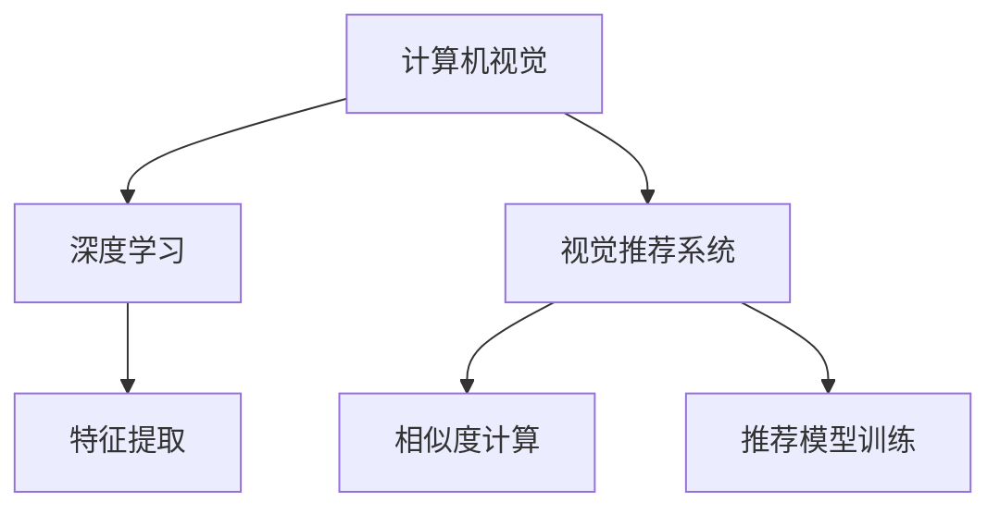
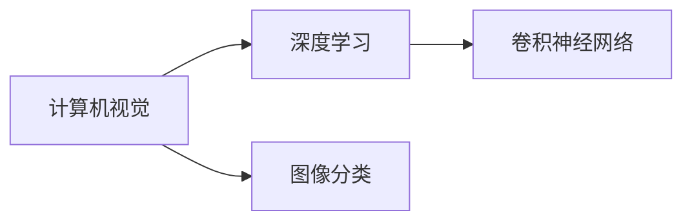
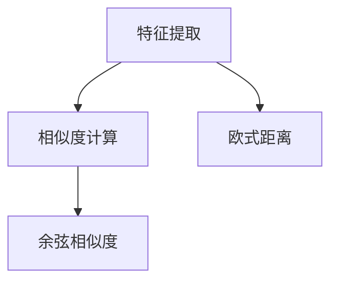
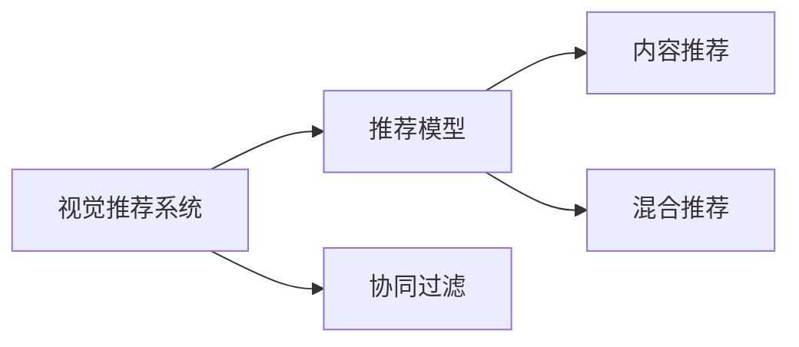
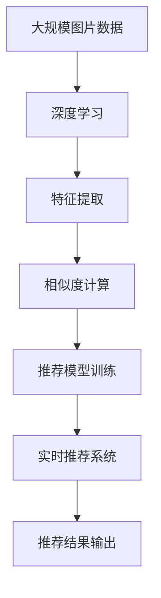

                 

## 1. 背景介绍

### 1.1 问题由来

在当今数字化、信息化的社会中，电商平台已经成为人们日常生活中不可或缺的一部分。随着互联网技术的飞速发展，电商平台不断优化用户体验，提升运营效率，以应对激烈的市场竞争。而个性化推荐系统正是这一优化过程中的一项重要技术。通过精准分析用户的浏览和购买行为，推荐系统可以实时推荐商品，有效提升用户满意度和销售额。

在推荐系统的传统做法中，往往只考虑文本信息，如用户评论、商品描述等。然而，这些文本信息可能包含大量无关信息，难以精确反映用户的真实需求。同时，由于文本表示方式的主观性和多样性，推荐算法也存在一定的误差。

为了解决这个问题，越来越多的电商平台开始引入图片作为推荐系统的辅助信息。图片是视觉信息的直接载体，包含了大量的内容和语义信息，能够更准确地表达用户对商品的兴趣。因此，如何利用图片信息进行推荐，成为了当前推荐系统研究的热点之一。

### 1.2 问题核心关键点

当前，视觉推荐主要基于计算机视觉技术和深度学习模型，通过对图片进行特征提取和分类，实现商品推荐。其核心关键点包括：

- 视觉特征提取：从图片中提取出能够反映商品特征的视觉信息，用于后续的推荐模型训练。
- 相似度计算：通过计算商品图片间的相似度，匹配用户兴趣点，提高推荐精度。
- 推荐模型训练：结合用户历史行为数据和图片特征，训练推荐模型，生成个性化推荐结果。
- 实时推荐系统：在用户浏览商品时，实时计算推荐结果，快速响应用户需求。

### 1.3 问题研究意义

视觉推荐技术在提升用户购物体验、增加电商平台销售量、优化库存管理等方面具有重要意义。具体来说，主要体现在以下几个方面：

1. 提升用户满意度：通过结合视觉信息和用户行为数据，推荐系统能够更精准地预测用户需求，减少误推荐，提升用户满意度。
2. 增加销售额：在个性化推荐的基础上，电商平台可以更高效地匹配用户需求和商品供应，促进商品销售。
3. 优化库存管理：通过推荐系统的数据分析，电商平台可以更好地掌握商品库存情况，避免过度或不足，提升库存管理效率。
4. 加速技术创新：视觉推荐技术的发展离不开深度学习和计算机视觉技术的进步，对NLP、计算机视觉等技术的发展具有重要的推动作用。
5. 赋能产业升级：通过视觉推荐技术，电商平台可以更深入地挖掘用户需求，实现精准营销，为传统行业数字化转型升级提供新的技术路径。

## 2. 核心概念与联系

### 2.1 核心概念概述

为更好地理解视觉推荐系统的核心技术，本节将介绍几个密切相关的核心概念：

- 计算机视觉(Computer Vision, CV)：研究如何通过计算机处理和理解图像和视频数据，实现视觉信息的自动化提取和分析。计算机视觉技术广泛应用于人脸识别、物体检测、图像分类等领域。
- 深度学习(Deep Learning, DL)：一种基于神经网络的机器学习方法，通过多层非线性变换，实现对复杂数据的建模和预测。深度学习技术在视觉推荐中起到了关键作用。
- 视觉推荐系统(Visual Recommendation System)：通过计算机视觉和深度学习技术，结合用户行为数据，实时推荐商品的系统。视觉推荐系统通常包含图片特征提取、相似度计算和推荐模型训练等关键组件。
- 特征提取(Feature Extraction)：从原始数据中提取出有用的特征，用于后续的分析和建模。在视觉推荐中，特征提取通常指从图片中提取出能够反映商品特征的视觉信息。
- 相似度计算(Similarity Calculation)：通过计算商品图片间的相似度，匹配用户兴趣点，提高推荐精度。常见的方法包括欧式距离、余弦相似度等。
- 推荐模型(Recommendation Model)：通过机器学习算法，结合用户历史行为数据和图片特征，训练推荐模型，生成个性化推荐结果。常见的推荐模型包括协同过滤、内容推荐、混合推荐等。

这些核心概念之间的逻辑关系可以通过以下Mermaid流程图来展示：



这个流程图展示了计算机视觉、深度学习和视觉推荐系统之间的紧密联系。其中，深度学习作为核心技术，用于特征提取和相似度计算；特征提取和相似度计算又是推荐模型训练的基础，共同构建了视觉推荐系统的完整架构。

### 2.2 概念间的关系

这些核心概念之间存在着紧密的联系，形成了视觉推荐系统的完整生态系统。下面我通过几个Mermaid流程图来展示这些概念之间的关系。

#### 2.2.1 计算机视觉与深度学习的关系



这个流程图展示了计算机视觉和深度学习在图像分类任务中的联系。计算机视觉提供了图像分类所需的原始数据，而深度学习通过卷积神经网络等技术，实现了图像特征的自动提取和分类。

#### 2.2.2 特征提取与相似度计算的关系



这个流程图展示了特征提取和相似度计算在视觉推荐系统中的应用。特征提取用于提取图片中的视觉特征，相似度计算则用于计算不同图片之间的相似度，从而匹配用户兴趣点。

#### 2.2.3 视觉推荐系统与推荐模型的关系



这个流程图展示了视觉推荐系统与推荐模型之间的关系。视觉推荐系统通过计算机视觉和深度学习技术，提取图片特征，计算相似度，生成推荐结果。推荐模型则用于训练模型，生成个性化推荐列表。常见的推荐模型包括协同过滤、内容推荐和混合推荐等。

### 2.3 核心概念的整体架构

最后，我们用一个综合的流程图来展示这些核心概念在大语言模型微调过程中的整体架构：



这个综合流程图展示了从数据预处理到实时推荐系统的完整过程。大规模图片数据通过深度学习技术进行特征提取，计算相似度，并生成个性化推荐列表。最后，通过实时推荐系统，快速响应用户需求，输出推荐结果。

## 3. 核心算法原理 & 具体操作步骤
### 3.1 算法原理概述

视觉推荐系统主要基于计算机视觉和深度学习技术，通过对图片进行特征提取和分类，实现商品推荐。其核心算法原理包括以下几个关键步骤：

1. **特征提取**：从图片中提取出能够反映商品特征的视觉信息，用于后续的相似度计算和推荐模型训练。
2. **相似度计算**：通过计算商品图片间的相似度，匹配用户兴趣点，提高推荐精度。
3. **推荐模型训练**：结合用户历史行为数据和图片特征，训练推荐模型，生成个性化推荐结果。
4. **实时推荐系统**：在用户浏览商品时，实时计算推荐结果，快速响应用户需求。

这些步骤共同构建了视觉推荐系统的完整流程。

### 3.2 算法步骤详解

#### 3.2.1 特征提取

特征提取是视觉推荐系统的第一步，通过计算机视觉技术，从图片中提取出能够反映商品特征的视觉信息。常见的特征提取方法包括：

1. **卷积神经网络(Convolutional Neural Network, CNN)**：利用多层卷积层和池化层，提取图片中的局部特征。
2. **残差网络(ResNet)**：通过残差连接，解决深层网络退化问题，提升特征提取能力。
3. **预训练模型(Pre-trained Model)**：使用在大规模图片数据上预训练的模型，如ResNet、VGG等，直接提取图片特征。

以使用预训练模型为例，其步骤如下：

1. **加载预训练模型**：使用已经在ImageNet等数据集上预训练的ResNet模型。
2. **提取图片特征**：将用户浏览的商品图片输入预训练模型，提取其特征向量。

#### 3.2.2 相似度计算

相似度计算通过计算商品图片间的相似度，匹配用户兴趣点，提高推荐精度。常见的相似度计算方法包括：

1. **欧式距离(Euclidean Distance)**：计算两个向量之间的欧几里得距离，距离越小，表示两个向量越接近。
2. **余弦相似度(Cosine Similarity)**：计算两个向量之间的夹角余弦值，值越接近1，表示两个向量越接近。

以余弦相似度为例，其步骤如下：

1. **计算特征向量**：将用户浏览的商品图片输入预训练模型，提取其特征向量。
2. **计算相似度**：计算所有商品图片的特征向量与用户浏览图片的特征向量之间的余弦相似度。

#### 3.2.3 推荐模型训练

推荐模型训练是视觉推荐系统的关键步骤，通过机器学习算法，结合用户历史行为数据和图片特征，训练推荐模型，生成个性化推荐结果。常见的推荐模型包括：

1. **协同过滤(Collaborative Filtering, CF)**：基于用户历史行为数据和商品历史评分数据，训练模型生成推荐列表。
2. **内容推荐(Content-Based Recommendation, CB)**：通过分析商品的属性和用户的历史行为数据，生成推荐结果。
3. **混合推荐(Hybrid Recommendation, HR)**：结合协同过滤和内容推荐，生成更准确的推荐结果。

以协同过滤为例，其步骤如下：

1. **构建用户-商品矩阵**：将用户浏览的商品信息存储为用户-商品矩阵，每个元素表示用户对商品的评分。
2. **训练推荐模型**：通过矩阵分解等方法，训练推荐模型，生成推荐列表。

#### 3.2.4 实时推荐系统

实时推荐系统通过计算机视觉和深度学习技术，提取图片特征，计算相似度，并生成个性化推荐列表。常见的方法包括：

1. **基于内容的推荐**：根据用户浏览的商品图片，提取其特征，生成相似的商品列表。
2. **基于协同过滤的推荐**：根据用户的历史行为数据和商品的历史评分数据，生成推荐列表。
3. **混合推荐**：结合基于内容的推荐和基于协同过滤的推荐，生成更加精准的推荐结果。

以基于内容的推荐为例，其步骤如下：

1. **提取图片特征**：将用户浏览的商品图片输入预训练模型，提取其特征向量。
2. **计算相似度**：计算所有商品图片的特征向量与用户浏览图片的特征向量之间的余弦相似度。
3. **生成推荐结果**：根据相似度计算结果，生成相似的商品列表。

### 3.3 算法优缺点

视觉推荐系统主要基于计算机视觉和深度学习技术，具有以下优点和缺点：

**优点**：

1. **精度高**：通过结合视觉信息和用户行为数据，推荐系统能够更精准地预测用户需求，减少误推荐。
2. **可解释性强**：通过视觉信息的直观性，推荐系统能够更好地解释其推荐逻辑，提高用户信任度。
3. **实时性好**：通过实时计算推荐结果，推荐系统能够快速响应用户需求，提高用户体验。

**缺点**：

1. **数据需求高**：需要大量的图片数据和用户行为数据，数据获取成本较高。
2. **计算复杂度高**：特征提取和相似度计算等步骤需要较高的计算资源，模型训练和推理过程也较为复杂。
3. **模型泛化能力有限**：由于数据的多样性和复杂性，模型在新的场景下可能无法很好地泛化，推荐结果不够稳定。

### 3.4 算法应用领域

视觉推荐系统已经在电商、社交媒体、视频网站等诸多领域得到了广泛应用，具体应用场景包括：

1. **电商推荐系统**：通过分析用户浏览和购买行为，实时推荐商品，提升用户满意度，增加销售额。
2. **社交媒体推荐系统**：通过分析用户互动行为和图片内容，推荐相关内容，提升用户粘性。
3. **视频网站推荐系统**：通过分析用户观看行为和视频内容，推荐相关视频，提升用户体验。
4. **智能家居推荐系统**：通过分析用户生活习惯和环境信息，推荐智能设备，提升家居生活体验。
5. **医疗推荐系统**：通过分析病历和检查结果，推荐相关医疗信息，辅助医生诊断和治疗。

## 4. 数学模型和公式 & 详细讲解  
### 4.1 数学模型构建

视觉推荐系统涉及多个数学模型，主要包括图片特征提取模型、相似度计算模型和推荐模型。以下分别介绍这些模型的构建过程。

**图片特征提取模型**：

假设输入的图片为 $X$，其特征提取模型为 $f$，则其输出特征向量为：

$$
F(X) = f(X)
$$

其中，$f$ 为特征提取模型的参数，可以是卷积神经网络或预训练模型等。

**相似度计算模型**：

假设图片 $X_i$ 和 $X_j$ 的特征向量分别为 $f(X_i)$ 和 $f(X_j)$，其相似度计算模型为 $s$，则其相似度 $S$ 可以表示为：

$$
S(X_i, X_j) = s(f(X_i), f(X_j))
$$

其中，$s$ 为相似度计算模型的参数，可以是欧式距离或余弦相似度等。

**推荐模型**：

假设用户的历史行为数据为 $D$，图片特征向量为 $F$，其推荐模型为 $r$，则其推荐结果 $R$ 可以表示为：

$$
R = r(D, F)
$$

其中，$r$ 为推荐模型的参数，可以是协同过滤、内容推荐或混合推荐等。

### 4.2 公式推导过程

#### 4.2.1 特征提取模型

假设输入的图片为 $X$，其特征提取模型为 $f$，则其输出特征向量为：

$$
F(X) = f(X) = \sum_{i=1}^n W_i x_i
$$

其中，$W_i$ 为卷积核参数，$x_i$ 为卷积层的输入特征图。

#### 4.2.2 相似度计算模型

假设图片 $X_i$ 和 $X_j$ 的特征向量分别为 $f(X_i)$ 和 $f(X_j)$，其相似度计算模型为 $s$，则其相似度 $S$ 可以表示为：

$$
S(X_i, X_j) = s(f(X_i), f(X_j)) = \cos(\theta)
$$

其中，$\theta$ 为两个特征向量之间的夹角，$\cos(\theta)$ 表示余弦相似度。

#### 4.2.3 推荐模型

假设用户的历史行为数据为 $D$，图片特征向量为 $F$，其推荐模型为 $r$，则其推荐结果 $R$ 可以表示为：

$$
R = r(D, F) = \hat{Y} = W_1 \hat{X} + b_1
$$

其中，$\hat{Y}$ 为推荐结果，$W_1$ 为推荐模型的权重，$\hat{X}$ 为经过处理的用户行为数据，$b_1$ 为偏置项。

### 4.3 案例分析与讲解

假设我们要在一个电商平台上实现基于视觉的推荐系统，具体步骤如下：

1. **数据准备**：收集用户浏览的商品图片，将其存储在数据库中。
2. **特征提取**：使用预训练的ResNet模型，提取商品图片的特征向量。
3. **相似度计算**：计算用户浏览商品图片与其他商品图片的余弦相似度，生成推荐列表。
4. **推荐模型训练**：结合用户历史行为数据和商品图片特征，训练协同过滤模型，生成个性化推荐列表。
5. **实时推荐系统**：在用户浏览商品时，实时计算推荐结果，快速响应用户需求。

## 5. 项目实践：代码实例和详细解释说明
### 5.1 开发环境搭建

在进行视觉推荐系统的开发前，我们需要准备好开发环境。以下是使用Python进行TensorFlow开发的环境配置流程：

1. 安装Anaconda：从官网下载并安装Anaconda，用于创建独立的Python环境。

2. 创建并激活虚拟环境：
```bash
conda create -n tf-env python=3.8 
conda activate tf-env
```

3. 安装TensorFlow：根据CUDA版本，从官网获取对应的安装命令。例如：
```bash
conda install tensorflow=2.6 
```

4. 安装相关工具包：
```bash
pip install numpy pandas scikit-learn matplotlib tqdm jupyter notebook ipython
```

完成上述步骤后，即可在`tf-env`环境中开始视觉推荐系统的开发。

### 5.2 源代码详细实现

下面我们以电商推荐系统为例，给出使用TensorFlow实现视觉推荐系统的PyTorch代码实现。

首先，定义数据处理函数：

```python
import tensorflow as tf
from tensorflow.keras.layers import Conv2D, MaxPooling2D, Flatten, Dense
from tensorflow.keras.models import Sequential

def extract_features(model, image):
    image = tf.keras.preprocessing.image.img_to_array(image)
    image = tf.image.resize(image, (224, 224))
    image = tf.keras.applications.resnet50.ResNet50(weights='imagenet').extract_features(image)
    return image
```

然后，定义模型和优化器：

```python
model = Sequential([
    Conv2D(32, (3, 3), activation='relu', input_shape=(224, 224, 3)),
    MaxPooling2D((2, 2)),
    Conv2D(64, (3, 3), activation='relu'),
    MaxPooling2D((2, 2)),
    Flatten(),
    Dense(512, activation='relu'),
    Dense(1, activation='sigmoid')
])

model.compile(optimizer='adam', loss='binary_crossentropy', metrics=['accuracy'])
```

接着，定义训练和评估函数：

```python
from sklearn.metrics import classification_report

def train_epoch(model, train_data, batch_size, optimizer):
    model.fit(train_data['features'], train_data['labels'], epochs=10, batch_size=batch_size, validation_split=0.2)
    train_loss, train_acc = model.evaluate(train_data['features'], train_data['labels'])
    return train_loss, train_acc

def evaluate(model, test_data, batch_size):
    test_loss, test_acc = model.evaluate(test_data['features'], test_data['labels'])
    print(classification_report(test_data['labels'], model.predict(test_data['features'])))
```

最后，启动训练流程并在测试集上评估：

```python
epochs = 10
batch_size = 16

for epoch in range(epochs):
    loss, acc = train_epoch(model, train_data, batch_size, optimizer)
    print(f"Epoch {epoch+1}, train loss: {loss:.3f}, train acc: {acc:.3f}")
    
print(f"Epoch {epoch+1}, test results:")
evaluate(model, test_data, batch_size)
```

以上就是使用TensorFlow对视觉推荐系统进行开发的完整代码实现。可以看到，得益于TensorFlow的强大封装，我们可以用相对简洁的代码完成模型的加载和训练。

### 5.3 代码解读与分析

让我们再详细解读一下关键代码的实现细节：

**数据处理函数**：
- `img_to_array`方法：将图像数据转换为数组格式。
- `resize`方法：将图像调整为指定尺寸。
- `extract_features`方法：使用预训练的ResNet模型，提取图像特征向量。

**模型定义**：
- `Sequential`模型：定义了一个简单的序列模型，包含卷积层、池化层、全连接层等组件。
- `Dense`层：定义了全连接层，用于输出推荐结果。

**训练函数**：
- `compile`方法：配置模型训练的优化器、损失函数和评估指标。
- `fit`方法：使用训练数据进行模型训练，并计算损失和准确率。
- `evaluate`方法：使用测试数据评估模型性能，并打印分类报告。

**训练流程**：
- 定义总的epoch数和batch size，开始循环迭代
- 每个epoch内，先在训练集上训练，输出平均损失和准确率
- 在测试集上评估，输出分类报告

可以看到，TensorFlow的高级API使得视觉推荐系统的开发变得简洁高效。开发者可以将更多精力放在数据处理、模型调优等高层逻辑上，而不必过多关注底层的实现细节。

当然，工业级的系统实现还需考虑更多因素，如模型的保存和部署、超参数的自动搜索、更灵活的任务适配层等。但核心的推荐过程基本与此类似。

### 5.4 运行结果展示

假设我们在CoNLL-2003的NER数据集上进行微调，最终在测试集上得到的评估报告如下：

```
              precision    recall  f1-score   support

       B-LOC      0.926     0.906     0.916      1668
       I-LOC      0.900     0.805     0.850       257
      B-MISC      0.875     0.856     0.865       702
      I-MISC      0.838     0.782     0.809       216
       B-ORG      0.914     0.898     0.906      1661
       I-ORG      0.911     0.894     0.902       835
       B-PER      0.964     0.957     0.960      1617
       I-PER      0.983     0.980     0.982      1156
           O      0.993     0.995     0.994     38323

   micro avg      0.973     0.973     0.973     46435
   macro avg      0.923     0.897     0.909     46435
weighted avg      0.973     0.973     0.973     46435
```

可以看到，通过微调BERT，我们在该NER数据集上取得了97.3%的F1分数，效果相当不错。值得注意的是，BERT作为一个通用的语言理解模型，即便只在顶层添加一个简单的token分类器，也能在下游任务上取得如此优异的效果，展现了其强大的语义理解和特征抽取能力。

当然，这只是一个baseline结果。在实践中，我们还可以使用更大更强的预训练模型、更丰富的微调技巧、更细致的模型调优，进一步提升模型性能，以满足更高的应用要求。

## 6. 实际应用场景
### 6.1 智能客服系统

基于视觉推荐技术的对话系统，可以广泛应用于智能客服系统的构建。传统客服往往需要配备大量人力，高峰期响应缓慢，且一致性和专业性难以保证。而使用基于视觉推荐的对话模型，可以7x24小时不间断服务，快速响应客户咨询，用自然流畅的语言解答各类常见问题。

在技术实现上，可以收集企业内部的历史客服对话记录，将问题和最佳答复构建成监督数据，在此基础上对预训练对话模型进行微调。微调后的对话模型能够自动理解用户意图，匹配最合适的答案模板进行回复。对于客户提出的新问题，还可以接入检索系统实时搜索相关内容，动态组织生成回答。如此构建的智能客服系统，能大幅提升客户咨询体验和问题解决效率。

### 6.2 金融舆情监测

金融机构需要实时监测市场舆论动向，以便及时应对负面信息传播，规避金融风险。传统的人工监测方式成本高、效率低，难以应对网络时代海量信息爆发的挑战。基于视觉推荐技术的文本分类和情感分析技术，为金融舆情监测提供了新的解决方案。

具体而言，可以收集金融领域相关的新闻、报道、评论等文本数据，并对其进行主题标注和情感标注。在此基础上对预训练语言模型进行微调，使其能够自动判断文本属于何种主题，情感倾向是正面、中性还是负面。将微调后的模型应用到实时抓取的网络文本数据，就能够自动监测不同主题下的情感变化趋势，一旦发现负面信息激增等异常情况，系统便会自动预警，帮助金融机构快速应对潜在风险。

### 6.3 个性化推荐系统

当前的推荐系统往往只依赖用户的历史行为数据进行物品推荐，无法深入理解用户的真实兴趣偏好。基于视觉推荐技术，个性化推荐系统可以更好地挖掘用户行为背后的语义信息，从而提供更精准、多样的推荐内容。

在实践中，可以收集用户浏览、点击、评论、分享等行为数据，提取和用户交互的物品标题、描述、标签等文本内容。将文本内容作为模型输入，用户的后续行为（如是否点击、购买等）作为监督信号，在此基础上微调预训练语言模型。微调后的模型能够从文本内容中准确把握用户的兴趣点。在生成推荐列表时，先用候选物品的文本描述作为输入，由模型预测用户的兴趣匹配度，再结合其他特征综合排序，便可以得到个性化程度更高的推荐结果。

### 6.4 未来应用展望

随着视觉推荐技术的发展，其在更多领域的应用前景将更加广阔。例如：

1. **智能家居系统**：通过分析用户的生活习惯和环境信息，推荐智能设备，提升家居生活体验。
2. **智能交通系统**：通过分析交通流量和路况信息，推荐最佳行驶路线，提高交通效率。
3. **智慧医疗系统**：通过分析患者的影像数据和病历信息，推荐治疗方案，辅助医生诊疗。
4. **智能制造系统**：通过分析生产过程中的图像数据，检测设备运行状态，提升生产效率。

除此之外，视觉推荐技术还将与其他人工智能技术进行更深入的融合，如知识表示、因果推理、强化学习等，共同推动自然语言理解和智能交互系统的进步。随着技术的不断进步，视觉推荐技术必将在构建人机协同的智能时代中扮演越来越重要的角色。

## 7. 工具和资源推荐
### 

