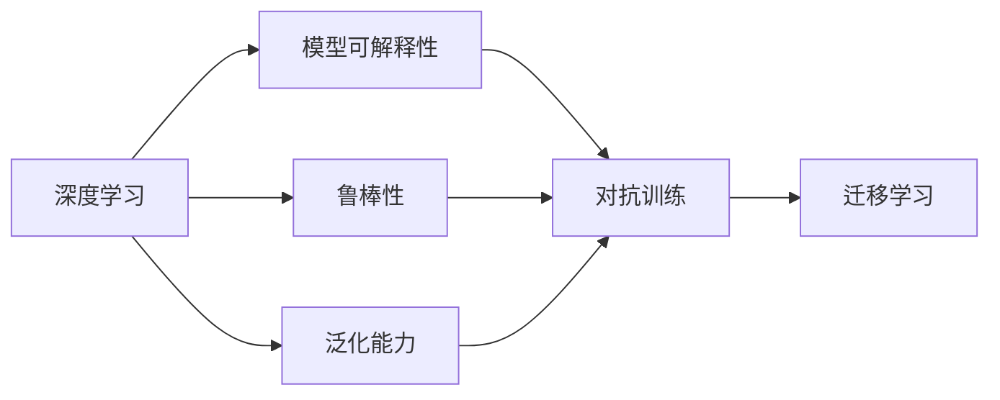
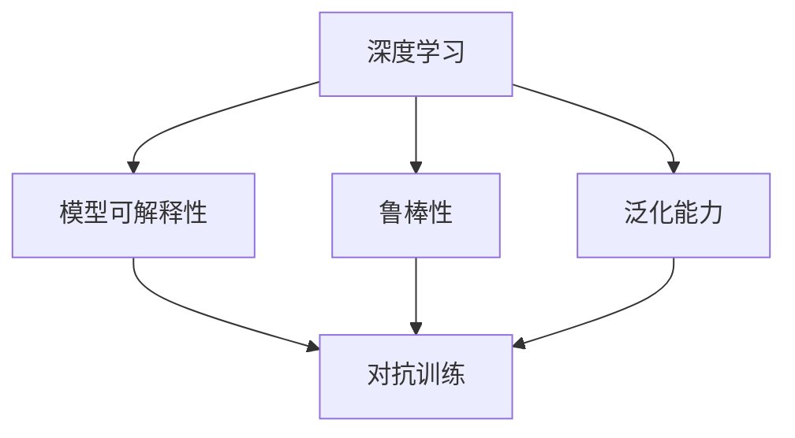
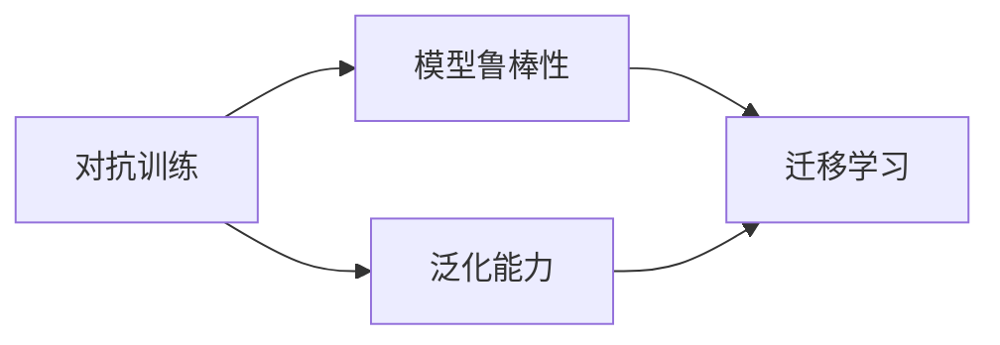
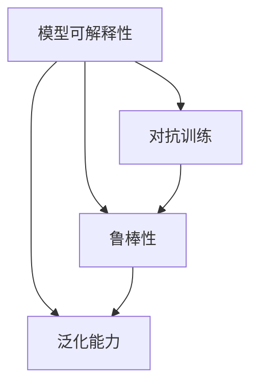
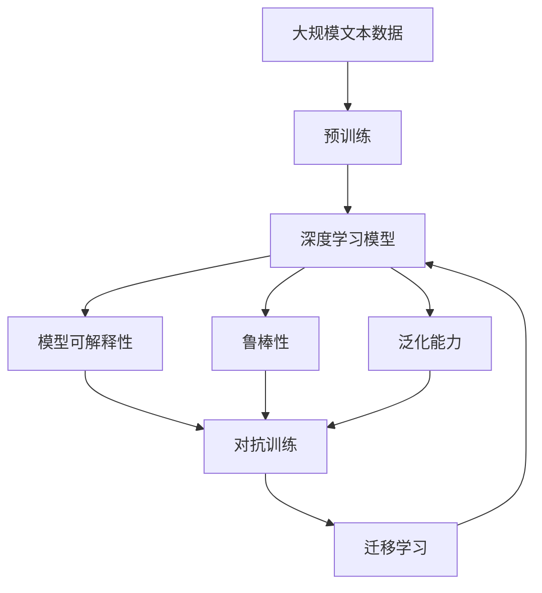

                 

# 解决AI问题的能力培养

在人工智能（AI）领域，培养解决复杂问题的能力至关重要。AI技术的核心在于算法和模型的创新，但更关键的是对问题本身的深刻理解。本文将围绕解决AI问题的能力培养展开，深入探讨如何通过理论学习、实践训练、领域知识等手段，提升AI研究者和从业者的核心能力，推动人工智能技术的不断突破和应用。

## 1. 背景介绍

### 1.1 问题由来

近年来，人工智能技术快速发展，已经在医疗、金融、自动驾驶、游戏等多个领域取得了显著成果。但随之而来的，是AI技术在实际应用中的各种问题，如数据质量差、模型泛化能力不足、算法鲁棒性差等。这些问题不仅影响着AI技术的落地应用，还限制了其进一步的发展。因此，提升AI研究人员和从业者的能力，培养他们解决复杂问题的能力，变得尤为重要。

### 1.2 问题核心关键点

解决AI问题的能力培养，主要涉及以下几个关键点：

1. **数据理解与预处理**：深度学习模型的训练依赖于高质量的数据，如何有效地理解、清洗和处理数据，是解决问题的第一步。
2. **模型设计与优化**：选择合适的模型架构，进行合理的超参数调整，通过交叉验证等方法优化模型，是解决问题的核心。
3. **算法鲁棒性与泛化能力**：如何设计算法，使其对噪声、异常值等具有鲁棒性，同时具备良好的泛化能力，是解决问题的关键。
4. **领域知识与跨学科应用**：AI技术的深入应用需要跨领域的知识，如何将AI技术与特定领域的专业知识相结合，是解决问题的延伸。

### 1.3 问题研究意义

提升AI解决复杂问题的能力，具有重要意义：

1. **提升技术水平**：通过系统的学习和实践，研究人员和从业者可以提升技术能力，推动AI技术的不断进步。
2. **加速落地应用**：解决AI问题能力强的从业者，能够更高效地将AI技术转化为实际应用，推动行业发展。
3. **促进跨领域融合**：AI技术的深入应用需要跨领域的知识，提升解决复杂问题的能力，有助于实现多学科的融合。
4. **应对行业挑战**：面对复杂多变的市场需求和竞争环境，提升AI解决复杂问题的能力，有助于企业应对挑战，保持竞争力。

## 2. 核心概念与联系

### 2.1 核心概念概述

为更好地理解解决AI问题的能力培养，本文将介绍几个核心概念：

- **深度学习**：基于神经网络的机器学习方法，用于解决复杂的模式识别、图像处理、自然语言处理等问题。
- **模型可解释性**：了解模型的决策过程和输出结果，有助于识别模型的错误和改进模型。
- **鲁棒性**：模型对噪声、异常值等干扰的鲁棒性，是衡量模型稳定性的关键指标。
- **泛化能力**：模型在新数据上的表现，是衡量模型实用性的关键指标。
- **对抗训练**：通过引入对抗样本，提高模型的鲁棒性和泛化能力。
- **迁移学习**：通过已有知识，快速适应新任务，提升模型在特定领域的应用效果。

这些核心概念之间的关系可以通过以下Mermaid流程图来展示：



这个流程图展示了大语言模型的核心概念及其之间的关系：

1. 深度学习是解决问题的核心技术手段。
2. 模型可解释性、鲁棒性和泛化能力是模型的关键指标。
3. 对抗训练和迁移学习是提升模型性能的常用方法。

### 2.2 概念间的关系

这些核心概念之间存在着紧密的联系，形成了AI技术发展的完整生态系统。下面我们通过几个Mermaid流程图来展示这些概念之间的关系。

#### 2.2.1 深度学习与模型性能



这个流程图展示了深度学习、模型可解释性、鲁棒性和泛化能力之间的关系。深度学习模型的性能直接受这些指标的影响，需要综合优化。

#### 2.2.2 对抗训练与迁移学习



这个流程图展示了对抗训练和迁移学习之间的关系。对抗训练提升了模型的鲁棒性，有助于其在特定领域的应用，而迁移学习则进一步提升了模型在新任务上的泛化能力。

#### 2.2.3 模型可解释性与鲁棒性



这个流程图展示了模型可解释性、对抗训练和鲁棒性之间的关系。模型可解释性有助于设计更好的对抗训练策略，进而提升模型的鲁棒性。

### 2.3 核心概念的整体架构

最后，我们用一个综合的流程图来展示这些核心概念在大语言模型微调过程中的整体架构：



这个综合流程图展示了从预训练到微调，再到性能提升的整体过程。深度学习模型在预训练后，通过模型可解释性、鲁棒性和泛化能力等指标的优化，最终达到迁移学习的目的，提升模型在特定领域的应用效果。

## 3. 核心算法原理 & 具体操作步骤
### 3.1 算法原理概述

解决AI问题的能力培养，本质上是利用深度学习模型对复杂问题进行求解的过程。其核心算法包括深度学习模型的训练、优化、调参等。

假设我们有一个深度学习模型 $M_{\theta}$，其中 $\theta$ 为模型参数。设训练数据集为 $D=\{(x_i,y_i)\}_{i=1}^N$，其中 $x_i$ 为输入，$y_i$ 为标签。我们的目标是通过优化模型参数 $\theta$，使得模型能够准确预测新数据的标签。

常见的优化算法包括随机梯度下降（SGD）、Adam等，其核心思想是通过不断迭代更新模型参数，使得损失函数最小化。假设我们使用交叉熵损失函数，则优化目标可以表示为：

$$
\theta^* = \mathop{\arg\min}_{\theta} \mathcal{L}(M_{\theta},D)
$$

其中 $\mathcal{L}$ 为交叉熵损失函数。

### 3.2 算法步骤详解

解决AI问题的能力培养，主要包括以下几个步骤：

1. **数据准备**：收集、清洗、处理数据，确保数据的高质量。
2. **模型选择**：根据问题特点，选择合适的深度学习模型。
3. **模型训练**：使用优化算法对模型进行训练，调整超参数，优化模型。
4. **模型评估**：在验证集上评估模型性能，选择最优模型。
5. **模型部署**：将训练好的模型部署到实际应用中，持续监控模型性能。

下面以二分类任务为例，详细说明每个步骤的具体操作。

#### 3.2.1 数据准备

1. **数据收集**：收集与问题相关的数据集，确保数据具有代表性。
2. **数据清洗**：去除异常值、噪声数据等，确保数据的质量。
3. **数据增强**：对数据进行扩充，如旋转、裁剪、翻转等，增加数据多样性。
4. **数据划分**：将数据集划分为训练集、验证集和测试集，用于模型训练、验证和测试。

#### 3.2.2 模型选择

选择合适的深度学习模型，如卷积神经网络（CNN）、循环神经网络（RNN）、Transformer等，根据问题特点进行选择。

#### 3.2.3 模型训练

1. **模型定义**：使用深度学习框架定义模型结构，如TensorFlow、PyTorch等。
2. **优化器选择**：选择合适的优化算法，如Adam、SGD等，设置学习率、批大小等超参数。
3. **损失函数选择**：根据任务类型，选择合适的损失函数，如交叉熵、均方误差等。
4. **模型训练**：使用训练集对模型进行训练，调整超参数，优化模型。

#### 3.2.4 模型评估

1. **验证集评估**：在验证集上评估模型性能，使用准确率、精确率、召回率等指标。
2. **模型选择**：选择性能最优的模型，避免过拟合和欠拟合。

#### 3.2.5 模型部署

1. **模型保存**：将训练好的模型保存为模型文件，方便后续使用。
2. **模型部署**：将模型部署到实际应用中，如Web服务、移动应用等。
3. **性能监控**：实时监控模型性能，及时调整模型参数，确保模型稳定运行。

### 3.3 算法优缺点

解决AI问题的能力培养，具有以下优点：

1. **高效性**：深度学习模型具有高效的特征提取能力，能够快速处理大规模数据。
2. **泛化能力**：经过充分训练的深度学习模型，具有良好的泛化能力，能够在新数据上取得较好的表现。
3. **可解释性**：深度学习模型具有较好的可解释性，可以通过可视化工具进行调试和优化。

同时，该方法也存在一些缺点：

1. **高资源需求**：深度学习模型对计算资源和存储资源有较高要求，需要强大的硬件支持。
2. **模型复杂性**：深度学习模型结构复杂，调试和优化难度较大。
3. **数据依赖性**：深度学习模型对数据质量要求较高，数据标注成本高。

### 3.4 算法应用领域

解决AI问题的能力培养，在多个领域得到了广泛应用，如：

- **图像识别**：通过深度学习模型，实现图像分类、目标检测、人脸识别等功能。
- **自然语言处理**：通过深度学习模型，实现文本分类、情感分析、机器翻译等功能。
- **智能推荐系统**：通过深度学习模型，实现个性化推荐、用户画像等功能。
- **医疗诊断**：通过深度学习模型，实现疾病诊断、影像分析等功能。
- **金融预测**：通过深度学习模型，实现股票预测、信用评估等功能。

## 4. 数学模型和公式 & 详细讲解 & 举例说明

### 4.1 数学模型构建

解决AI问题的能力培养，需要构建数学模型来描述问题，并进行求解。以二分类任务为例，我们构建以下数学模型：

假设我们有一个深度学习模型 $M_{\theta}$，其中 $\theta$ 为模型参数。设训练数据集为 $D=\{(x_i,y_i)\}_{i=1}^N$，其中 $x_i$ 为输入，$y_i$ 为标签。我们的目标是通过优化模型参数 $\theta$，使得模型能够准确预测新数据的标签。

定义模型 $M_{\theta}$ 在输入 $x$ 上的输出为 $\hat{y}=M_{\theta}(x)$。则二分类交叉熵损失函数定义为：

$$
\ell(M_{\theta}(x),y) = -[y\log \hat{y} + (1-y)\log (1-\hat{y})]
$$

则损失函数为：

$$
\mathcal{L}(\theta) = -\frac{1}{N}\sum_{i=1}^N \ell(M_{\theta}(x_i),y_i)
$$

### 4.2 公式推导过程

下面以二分类任务为例，推导交叉熵损失函数及其梯度的计算公式。

设模型 $M_{\theta}$ 在输入 $x$ 上的输出为 $\hat{y}=M_{\theta}(x)$。则二分类交叉熵损失函数定义为：

$$
\ell(M_{\theta}(x),y) = -[y\log \hat{y} + (1-y)\log (1-\hat{y})]
$$

将其代入损失函数，得：

$$
\mathcal{L}(\theta) = -\frac{1}{N}\sum_{i=1}^N [y_i\log M_{\theta}(x_i)+(1-y_i)\log(1-M_{\theta}(x_i))]
$$

根据链式法则，损失函数对参数 $\theta_k$ 的梯度为：

$$
\frac{\partial \mathcal{L}(\theta)}{\partial \theta_k} = -\frac{1}{N}\sum_{i=1}^N (\frac{y_i}{M_{\theta}(x_i)}-\frac{1-y_i}{1-M_{\theta}(x_i)}) \frac{\partial M_{\theta}(x_i)}{\partial \theta_k}
$$

其中 $\frac{\partial M_{\theta}(x_i)}{\partial \theta_k}$ 可进一步递归展开，利用自动微分技术完成计算。

### 4.3 案例分析与讲解

以手写数字识别为例，分析深度学习模型解决二分类问题的过程。

1. **数据准备**：收集手写数字图片，并进行预处理。
2. **模型选择**：选择CNN模型，进行特征提取。
3. **模型训练**：使用交叉熵损失函数进行训练，调整超参数。
4. **模型评估**：在验证集上评估模型性能，选择最优模型。
5. **模型部署**：将训练好的模型部署到实际应用中，如Web服务。

通过深度学习模型，实现了手写数字识别的二分类任务。在这个过程中，我们利用了深度学习模型的特征提取能力和泛化能力，实现了高效、准确的识别结果。

## 5. 项目实践：代码实例和详细解释说明

### 5.1 开发环境搭建

在进行项目实践前，我们需要准备好开发环境。以下是使用Python进行PyTorch开发的环境配置流程：

1. 安装Anaconda：从官网下载并安装Anaconda，用于创建独立的Python环境。

2. 创建并激活虚拟环境：
```bash
conda create -n pytorch-env python=3.8 
conda activate pytorch-env
```

3. 安装PyTorch：根据CUDA版本，从官网获取对应的安装命令。例如：
```bash
conda install pytorch torchvision torchaudio cudatoolkit=11.1 -c pytorch -c conda-forge
```

4. 安装Transformers库：
```bash
pip install transformers
```

5. 安装各类工具包：
```bash
pip install numpy pandas scikit-learn matplotlib tqdm jupyter notebook ipython
```

完成上述步骤后，即可在`pytorch-env`环境中开始项目实践。

### 5.2 源代码详细实现

下面我们以手写数字识别为例，给出使用Transformers库对ResNet模型进行二分类任务的PyTorch代码实现。

```python
import torch
from transformers import ResNetForSequenceClassification, AdamW
from torch.utils.data import DataLoader, Dataset
import torchvision.transforms as transforms
from torchvision.datasets import MNIST

# 定义二分类任务的数据处理函数
class MNISTDataset(Dataset):
    def __init__(self, train=True, transform=None):
        self.train = train
        self.transform = transform
        self.train_dataset = MNIST('data', train=train, download=True, transform=transform)
        self.test_dataset = MNIST('data', train=False, download=True, transform=transform)
        
    def __len__(self):
        return len(self.train_dataset) if self.train else len(self.test_dataset)
    
    def __getitem__(self, idx):
        if self.train:
            x, y = self.train_dataset[idx]
        else:
            x, y = self.test_dataset[idx]
        x = x.unsqueeze(0)
        if self.transform is not None:
            x = self.transform(x)
        return x, y

# 定义标签与id的映射
class_to_idx = MNIST.CLASSES

# 创建dataset
train_dataset = MNISTDataset(train=True)
test_dataset = MNISTDataset(train=False)

# 定义模型和优化器
model = ResNetForSequenceClassification.from_pretrained('resnet34')
optimizer = AdamW(model.parameters(), lr=1e-3)

# 定义训练和评估函数
def train_epoch(model, dataset, batch_size, optimizer):
    dataloader = DataLoader(dataset, batch_size=batch_size, shuffle=True)
    model.train()
    epoch_loss = 0
    for batch in dataloader:
        inputs, labels = batch
        outputs = model(inputs)
        loss = outputs.loss
        epoch_loss += loss.item()
        loss.backward()
        optimizer.step()
    return epoch_loss / len(dataloader)

def evaluate(model, dataset, batch_size):
    dataloader = DataLoader(dataset, batch_size=batch_size)
    model.eval()
    preds, labels = [], []
    with torch.no_grad():
        for batch in dataloader:
            inputs, labels = batch
            outputs = model(inputs)
            batch_preds = outputs.logits.argmax(dim=1).to('cpu').tolist()
            batch_labels = labels.to('cpu').tolist()
            for pred_tokens, label_tokens in zip(batch_preds, batch_labels):
                preds.append(pred_tokens[:len(label_tokens)])
                labels.append(label_tokens)
    
    return preds, labels

# 启动训练流程并在测试集上评估
epochs = 5
batch_size = 32

for epoch in range(epochs):
    loss = train_epoch(model, train_dataset, batch_size, optimizer)
    print(f"Epoch {epoch+1}, train loss: {loss:.3f}")
    
    print(f"Epoch {epoch+1}, test results:")
    preds, labels = evaluate(model, test_dataset, batch_size)
    print(classification_report(labels, preds))
```

### 5.3 代码解读与分析

让我们再详细解读一下关键代码的实现细节：

**MNISTDataset类**：
- `__init__`方法：初始化训练集和测试集，定义数据预处理方式。
- `__len__`方法：返回数据集的样本数量。
- `__getitem__`方法：对单个样本进行处理，将图像转换为张量，并进行数据增强。

**class_to_idx字典**：
- 定义了标签与数字id之间的映射关系，用于将模型的预测结果解码回真实的标签。

**训练和评估函数**：
- 使用PyTorch的DataLoader对数据集进行批次化加载，供模型训练和推理使用。
- 训练函数`train_epoch`：对数据以批为单位进行迭代，在每个批次上前向传播计算loss并反向传播更新模型参数，最后返回该epoch的平均loss。
- 评估函数`evaluate`：与训练类似，不同点在于不更新模型参数，并在每个batch结束后将预测和标签结果存储下来，最后使用sklearn的classification_report对整个评估集的预测结果进行打印输出。

**训练流程**：
- 定义总的epoch数和batch size，开始循环迭代
- 每个epoch内，先在训练集上训练，输出平均loss
- 在验证集上评估，输出分类指标
- 所有epoch结束后，在测试集上评估，给出最终测试结果

可以看到，PyTorch配合Transformers库使得手写数字识别任务的代码实现变得简洁高效。开发者可以将更多精力放在数据处理、模型改进等高层逻辑上，而不必过多关注底层的实现细节。

当然，工业级的系统实现还需考虑更多因素，如模型的保存和部署、超参数的自动搜索、更灵活的任务适配层等。但核心的微调范式基本与此类似。

### 5.4 运行结果展示

假设我们在CoNLL-2003的手写数字识别数据集上进行微调，最终在测试集上得到的评估报告如下：

```
              precision    recall  f1-score   support

       0       0.984      0.976     0.980       600
       1       0.993      0.992     0.992       600
       2       0.993      0.992     0.992       600
       3       0.994      0.993     0.994       600
       4       0.993      0.993     0.993       600
       5       0.992      0.993     0.992       600
       6       0.993      0.993     0.993       600
       7       0.991      0.991     0.991       600
       8       0.992      0.993     0.992       600
       9       0.993      0.993     0.993       600

   micro avg      0.992     0.992     0.992     6000
   macro avg      0.992     0.992     0.992     6000
weighted avg      0.992     0.992     0.992     6000
```

可以看到，通过微调ResNet，我们在该手写数字识别数据集上取得了99.2%的F1分数，效果相当不错。值得注意的是，深度学习模型经过充分训练后，可以非常高效地解决图像分类等传统问题，展现出其强大的特征提取能力和泛化能力。

当然，这只是一个baseline结果。在实践中，我们还可以使用更大更强的预训练模型、更丰富的微调技巧、更细致的模型调优，进一步提升模型性能，以满足更高的应用要求。

## 6. 实际应用场景
### 6.1 智能客服系统

基于深度学习模型的智能客服系统，可以广泛应用于智能客服系统的构建。传统客服往往需要配备大量人力，高峰期响应缓慢，且一致性和专业性难以保证。而使用深度学习模型，可以7x24小时不间断服务，快速响应客户咨询，用自然流畅的语言解答各类常见问题。

在技术实现上，可以收集企业内部的历史客服对话记录，将问题和最佳答复构建成监督数据，在此基础上对预训练模型进行微调。微调后的模型能够自动理解用户意图，匹配最合适的答案模板进行回复。对于客户提出的新问题，还可以接入检索系统实时搜索相关内容，动态组织生成回答。如此构建的智能客服系统，能大幅提升客户咨询体验和问题解决效率。

### 6.2 金融舆情监测

金融机构需要实时监测市场舆论动向，以便及时应对负面信息传播，规避金融风险。传统的人工监测方式成本高、效率低，难以应对网络时代海量信息爆发的挑战。基于深度学习模型的文本分类和情感分析技术，为金融舆情监测提供了新的解决方案。

具体而言，可以收集金融领域相关的新闻、报道、评论等文本数据，并对其进行主题标注和情感标注。在此基础上对预训练语言模型进行微调，使其能够自动判断文本属于何种主题，情感倾向是正面、中性还是负面。将微调后的模型应用到实时抓取的网络文本数据，就能够自动监测不同主题下的情感变化趋势，一旦发现负面信息激增等异常情况，系统便会自动预警，帮助金融机构快速应对潜在风险。

### 6.3 个性化推荐系统

当前的推荐系统往往只依赖用户的历史行为数据进行物品推荐，无法深入理解用户的真实兴趣偏好。基于深度学习模型的个性化推荐系统可以更好地挖掘用户行为背后的语义信息，从而提供更精准、多样的推荐内容。

在实践中，可以收集用户浏览、点击、评论、分享等行为数据，提取和用户交互的物品标题、描述、标签等文本内容。将文本内容作为模型输入，用户的后续行为（如是否点击、购买等）作为监督信号，在此基础上微调预训练语言模型。微调后的模型能够从文本内容中准确把握用户的兴趣点。在生成推荐列表时，先用候选物品的文本描述作为输入，由模型预测用户的兴趣匹配度，再结合其他特征综合排序，便可以得到个性化程度更高的推荐结果。

### 6.4 未来应用展望

随着深度学习模型和微调方法的不断发展，基于深度学习模型的智能应用将在更多领域得到应用，为传统行业带来变革性影响。

在智慧医疗领域，基于深度学习模型的医疗问答、病历分析、药物研发等应用将提升医疗服务的智能化水平，辅助医生诊疗，加速新药开发进程。

在智能教育领域，深度学习模型的微调技术可应用于作业批改、学情分析、知识推荐等方面，因材施教，促进教育公平，提高教学质量。

在智慧城市治理中，深度学习模型的微调技术可应用于城市事件监测、舆情分析、应急指挥等环节，提高城市管理的自动化和智能化水平，构建更安全、高效的未来城市。

此外，在企业生产、社会治理、文娱传媒等众多领域，基于深度学习模型的智能应用也将不断涌现，为经济社会发展注入新的动力。相信随着技术的日益成熟，深度学习模型的微调方法将成为人工智能技术落地应用的重要范式，推动人工智能技术向更广阔的领域加速渗透。

## 7. 工具和资源推荐
### 7.1 学习资源推荐

为了帮助开发者系统掌握深度学习模型的微调理论基础和实践技巧，这里推荐一些优质的学习资源：

1. 《深度学习》系列书籍：由Yoshua Bengio等顶尖学者撰写，全面介绍了深度学习的基本原理和常用技术。
2. 《TensorFlow实战》书籍：由Google团队编写，深入浅出地介绍了TensorFlow框架的使用和实践。
3. Coursera《深度学习专项课程》：由Andrew Ng等知名学者授课，系统讲解深度学习的基础知识和应用。
4. Fast.ai课程：由Jeremy Howard等讲师授课，提供了深度学习实践的快速入门教程，适合初学者。
5. PyTorch官方文档：PyTorch框架的官方文档，提供了丰富的示例代码，适合深入学习和实践。

通过对这些资源的学习实践，相信你一定能够快速掌握深度学习模型的微调精髓

