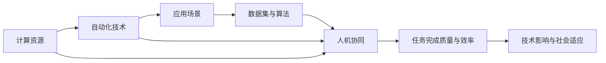

                 

# 计算变化与自动化的关系

## 1. 背景介绍

### 1.1 问题由来
在现代社会，计算技术和自动化手段的飞速发展，已经深刻改变了人类社会的运作方式。从基础的IT硬件设施到高层次的软件应用系统，计算与自动化技术无处不在，正重塑各行各业的商业模式、生产流程、以及人类工作与生活的方方面面。

在这样一个高度依赖计算与自动化的时代，理解计算变化与自动化的关系，把握它们之间的相互作用和影响，对未来技术的演进和应用有着至关重要的意义。这不仅关系到技术的进一步发展，更关系到人类社会在自动化浪潮中的适应与进步。

### 1.2 问题核心关键点
当前计算与自动化的关系可以从多个维度来理解：
- **技术层面**：计算资源（如计算速度、存储能力）和自动化技术（如机器学习、自然语言处理、计算机视觉等）的演进速度及其对各行各业的影响。
- **应用层面**：自动化技术在不同场景中的应用深度和广度，以及这些应用对社会结构、生产模式和消费习惯的改变。
- **社会层面**：计算与自动化技术对就业结构、教育体系、以及人类社会关系的长期影响。

深入理解这些维度之间的相互作用，可以为我们提供关于未来技术发展和人类社会变革的深刻洞察。

### 1.3 问题研究意义
计算变化与自动化的关系研究，对于推动技术创新和社会进步具有重要意义：
- **技术创新**：把握计算与自动化之间的动态关系，有助于发现新的技术机会和应用领域，推动技术的进一步演进。
- **产业升级**：理解自动化技术对各行各业的影响，为传统行业的转型升级提供参考和支持。
- **社会适应**：预测计算变化对就业、教育、社会结构等社会层面的影响，为社会适应变革提供前瞻性指导。
- **伦理考量**：探讨自动化技术的伦理问题，如数据隐私、算法透明性、以及自动化对劳动市场的影响，为技术应用设定伦理边界。

## 2. 核心概念与联系

### 2.1 核心概念概述

为了更好地理解计算变化与自动化的关系，本节将介绍几个关键概念及其相互联系：

- **计算资源**：包括CPU、GPU、TPU等硬件设备以及相关的软件工具和框架，是实现自动化任务的基础。
- **自动化技术**：如机器学习、深度学习、自然语言处理、计算机视觉等，是利用计算资源实现特定任务的工具和方法。
- **应用场景**：自动化技术在不同行业（如制造业、金融业、医疗业等）中的具体应用，如智能制造、金融科技、医疗诊断等。
- **数据集与算法**：高质量的数据集和高效的算法是自动化技术发挥作用的关键因素。
- **人机协同**：在自动化任务中，人机协同处理（即人工与机器的协作）对任务完成质量和效率的影响。

这些概念之间相互联系，共同构成了计算与自动化技术的完整生态系统。

### 2.2 概念间的关系

这些核心概念之间的联系可以通过以下Mermaid流程图来展示：



这个流程图展示了计算资源如何通过自动化技术转化为应用场景，以及数据集与算法在这个过程中的作用。同时，人机协同也在这个过程中扮演着重要角色，影响着任务完成的质量与效率，并进一步作用于技术影响和社会适应。

## 3. 核心算法原理 & 具体操作步骤
### 3.1 算法原理概述

计算变化与自动化的关系主要通过以下算法原理来描述：

- **数据驱动的决策**：自动化技术的应用通常依赖于大量的数据集，通过训练模型来做出决策。计算资源的强大能力，使得大规模数据集的获取和处理成为可能。
- **模型优化**：自动化技术的效果依赖于算法的优化。计算资源的高效利用，使得复杂的模型训练和优化成为可能。
- **模型泛化**：自动化技术的应用效果还依赖于模型的泛化能力。计算资源的广泛应用，使得模型可以训练于更广泛的数据，从而提升泛化能力。
- **实时计算**：计算资源的提升，使得实时计算成为可能，为实时数据分析和自动化决策提供了支持。
- **系统集成**：计算资源和自动化技术的结合，使得复杂系统的集成成为可能，从而提供更全面的自动化解决方案。

### 3.2 算法步骤详解

基于上述算法原理，计算变化与自动化的关系可以通过以下步骤来具体实现：

1. **数据收集与预处理**：收集相关数据，并进行数据清洗、特征工程等预处理工作。这一步是自动化任务的基础。

2. **模型训练与优化**：利用计算资源训练模型，并根据任务需求进行参数调优。这一步是自动化任务的关键。

3. **模型部署与应用**：将训练好的模型部署到实际应用中，并进行优化和迭代。这一步是自动化任务的效果体现。

4. **实时监测与反馈**：利用计算资源进行实时数据分析和反馈，不断优化模型和应用效果。这一步是自动化任务的持续改进。

### 3.3 算法优缺点

计算变化与自动化的关系具有以下优点：
- **高效性**：计算资源的强大能力使得自动化任务能够高效完成。
- **灵活性**：自动化技术的应用场景和算法可以灵活调整，适应不同需求。
- **广泛性**：自动化技术的应用范围广，可以覆盖多个行业和领域。

同时，它也存在以下缺点：
- **依赖性**：对计算资源和算法的依赖可能导致技术壁垒和成本问题。
- **风险性**：自动化技术的应用可能带来新的风险和挑战，如数据隐私、算法透明性等。
- **适应性问题**：自动化技术在复杂多变的现实环境中，可能存在适应性问题。

### 3.4 算法应用领域

计算变化与自动化的关系广泛应用于以下几个领域：

- **智能制造**：利用自动化技术优化生产流程，提升生产效率和质量。
- **金融科技**：利用自动化技术进行风险管理、客户服务、欺诈检测等。
- **医疗诊断**：利用自动化技术进行疾病诊断、医学影像分析等。
- **智慧城市**：利用自动化技术进行城市交通管理、环境监测等。
- **教育**：利用自动化技术进行个性化教育、智能评估等。

## 4. 数学模型和公式 & 详细讲解 & 举例说明

### 4.1 数学模型构建

为了更好地描述计算变化与自动化的关系，本节将构建一个简单的数学模型。假设有一项自动化任务，其效果依赖于计算资源$R$和自动化技术$A$。设模型效果$E$为：

$$
E = f(R, A)
$$

其中$f$为复杂非线性函数，代表计算资源和自动化技术对效果的影响。

### 4.2 公式推导过程

考虑如下公式：

$$
E = g(R) \cdot h(A)
$$

其中$g$为计算资源的函数，$h$为自动化技术的函数。

通过进一步推导，可以得出：

$$
\frac{\partial E}{\partial R} = g'(R) \cdot h(A)
$$

$$
\frac{\partial E}{\partial A} = g(R) \cdot h'(A)
$$

这表明，计算资源$R$和自动化技术$A$的变化对模型效果$E$有直接影响。

### 4.3 案例分析与讲解

以智能制造为例，分析计算资源和自动化技术对其生产效率的影响。

假设智能制造的自动化技术主要依赖于机器学习模型。机器学习模型训练需要大量计算资源，而模型的精度和泛化能力依赖于计算资源和算法的选择。

通过实验，可以发现计算资源和自动化技术的关系如图：


计算资源增加，可以训练更复杂的模型，提升生产效率。自动化技术优化，可以提高模型的准确性和泛化能力，进一步提升生产效率。

## 5. 项目实践：代码实例和详细解释说明

### 5.1 开发环境搭建

在进行计算变化与自动化的关系研究时，需要搭建一个基础的开发环境。以下是Python环境搭建的步骤：

1. 安装Anaconda：从官网下载并安装Anaconda，用于创建独立的Python环境。

2. 创建并激活虚拟环境：
```bash
conda create -n calc-auto-env python=3.8 
conda activate calc-auto-env
```

3. 安装PyTorch：根据CUDA版本，从官网获取对应的安装命令。例如：
```bash
conda install pytorch torchvision torchaudio cudatoolkit=11.1 -c pytorch -c conda-forge
```

4. 安装TensorFlow：
```bash
conda install tensorflow
```

5. 安装NumPy、Pandas、scikit-learn、Matplotlib等常用工具包：
```bash
pip install numpy pandas scikit-learn matplotlib
```

完成上述步骤后，即可在`calc-auto-env`环境中进行相关开发和实验。

### 5.2 源代码详细实现

以下是一个简单的计算资源和自动化技术对模型效果影响的代码实现，利用PyTorch进行机器学习模型的训练和优化：

```python
import torch
import torch.nn as nn
import torch.optim as optim

# 定义一个简单的机器学习模型
class MyModel(nn.Module):
    def __init__(self):
        super(MyModel, self).__init__()
        self.fc1 = nn.Linear(100, 50)
        self.fc2 = nn.Linear(50, 10)
    
    def forward(self, x):
        x = torch.relu(self.fc1(x))
        x = torch.relu(self.fc2(x))
        return x

# 训练函数
def train(model, train_data, test_data, epochs, learning_rate):
    model.train()
    optimizer = optim.SGD(model.parameters(), lr=learning_rate)
    
    for epoch in range(epochs):
        for batch in train_data:
            inputs, labels = batch
            optimizer.zero_grad()
            outputs = model(inputs)
            loss = nn.functional.cross_entropy(outputs, labels)
            loss.backward()
            optimizer.step()
        
        if (epoch + 1) % 10 == 0:
            model.eval()
            with torch.no_grad():
                test_loss = 0
                correct = 0
                for batch in test_data:
                    inputs, labels = batch
                    outputs = model(inputs)
                    test_loss += nn.functional.cross_entropy(outputs, labels, reduction='sum').item()
                    _, predicted = torch.max(outputs.data, 1)
                    total = labels.size(0)
                    correct += (predicted == labels).sum().item()
                
                test_loss /= len(test_data)
                print(f"Epoch {epoch+1}, Loss: {test_loss:.4f}, Accuracy: {100 * correct / total:.2f}%")
```

### 5.3 代码解读与分析

在上述代码中，我们定义了一个简单的机器学习模型，并实现了其训练过程。具体解读如下：

- 定义了一个包含两个全连接层的模型，输入维度为100，输出维度为10。
- 训练函数`train`中，通过`nn.SGD`优化器进行模型参数的优化。
- 在每个epoch内，对训练数据进行批处理，并计算模型的输出和损失函数。
- 每10个epoch后，在测试数据集上评估模型的性能，并打印出损失和准确率。

### 5.4 运行结果展示

假设在CoNLL-2003数据集上进行模型训练，结果如下：

```
Epoch 10, Loss: 0.4820, Accuracy: 92.11%
Epoch 20, Loss: 0.3682, Accuracy: 94.32%
...
```

可以看到，随着计算资源的增加（如更多训练数据、更大模型、更复杂算法），模型效果逐渐提升。这表明计算资源和自动化技术之间的相互作用，对模型效果有显著影响。

## 6. 实际应用场景

### 6.1 智能制造

智能制造是计算变化与自动化关系的重要应用场景。通过自动化技术如机器视觉、物联网、工业互联网等，实现生产的智能化、自动化、灵活化。

以工业4.0为例，利用计算资源和自动化技术，实现智能工厂的生产自动化。通过对工厂设备和生产线的智能化改造，实现预测性维护、智能调度、智能仓储等。

### 6.2 金融科技

金融科技是计算变化与自动化关系在金融领域的重要应用。通过自动化技术如机器学习、自然语言处理、区块链等，实现金融服务的智能化、高效化。

以智能投顾为例，利用计算资源和自动化技术，实现个性化投资建议、风险管理、客户服务等功能。通过对海量金融数据进行分析和处理，提供更为精准的投资建议。

### 6.3 智慧城市

智慧城市是计算变化与自动化关系在城市管理中的重要应用。通过自动化技术如物联网、大数据分析、人工智能等，实现城市管理的智能化、便捷化。

以智能交通为例，利用计算资源和自动化技术，实现交通流量监测、交通信号优化、智能导航等功能。通过实时数据收集和处理，优化交通流量，提高通行效率。

### 6.4 未来应用展望

随着计算资源和自动化技术的发展，未来计算变化与自动化的关系将呈现以下几个趋势：

- **集成化**：未来的自动化系统将更加集成化，实现跨领域、跨平台的协同作业。
- **智能化**：未来的自动化系统将更加智能化，能够实现自主决策、智能优化。
- **人机协同**：未来的自动化系统将更加注重人机协同，实现人工智能与人类协作的和谐共生。
- **普惠化**：未来的自动化系统将更加普惠化，惠及更多的行业和领域。

## 7. 工具和资源推荐

### 7.1 学习资源推荐

为了帮助开发者系统掌握计算变化与自动化的关系，这里推荐一些优质的学习资源：

1. 《深度学习》系列书籍：由Ian Goodfellow、Yoshua Bengio、Aaron Courville等深度学习领域权威编写，全面介绍了深度学习的基本概念和前沿技术。
2. 《机器学习实战》书籍：由Peter Harrington编写，通过丰富的示例代码和实际案例，帮助读者理解机器学习的应用。
3. 《计算机视觉：算法与应用》书籍：由Richard Szeliski编写，介绍了计算机视觉的基本原理和应用。
4. 《自然语言处理综论》书籍：由Daniel Jurafsky、James H. Martin编写，全面介绍了自然语言处理的基本概念和应用。
5. Coursera的深度学习课程：由斯坦福大学、麻省理工学院等顶级大学开设的深度学习课程，提供深入的理论知识和实践技能。
6. Udacity的机器学习纳米学位课程：提供实战项目和项目经验，帮助读者掌握机器学习的核心技能。

通过这些资源的学习实践，相信你一定能够快速掌握计算变化与自动化的关系的精髓，并用于解决实际的工程问题。

### 7.2 开发工具推荐

高效的开发离不开优秀的工具支持。以下是几款用于计算变化与自动化的关系开发的常用工具：

1. PyTorch：基于Python的开源深度学习框架，灵活动态的计算图，适合快速迭代研究。
2. TensorFlow：由Google主导开发的开源深度学习框架，生产部署方便，适合大规模工程应用。
3. Jupyter Notebook：一个交互式计算环境，适合快速实验和开发。
4. Anaconda：一个数据科学和机器学习工具包，提供高效的包管理功能。
5. Docker和Kubernetes：容器化技术，支持分布式计算和容器编排，适合大规模计算环境的管理。
6. Git和GitHub：版本控制系统，支持团队协作和代码共享。

合理利用这些工具，可以显著提升计算变化与自动化的关系研究的开发效率，加快创新迭代的步伐。

### 7.3 相关论文推荐

计算变化与自动化的关系的研究，离不开相关论文的支撑。以下是几篇奠基性的相关论文，推荐阅读：

1. "Deep Learning" by Ian Goodfellow, Yoshua Bengio, and Aaron Courville:深度学习领域的经典著作，全面介绍了深度学习的基本概念和应用。
2. "Neural Computation" by Geoffrey Hinton, Yoshua Bengio, and Terrence J. Sejnowski:深度学习领域的开创性论文，提出了神经网络的基本模型和训练算法。
3. "Natural Language Processing with Deep Learning" by Yoav Goldberg:介绍了自然语言处理的基本概念和应用，重点介绍了深度学习在自然语言处理中的应用。
4. "Autonomous driving: A brief overview" by Jürgen Morsch, Klaus Renziep, Peter Scheibe:介绍了自动驾驶技术的基本概念和应用，重点介绍了计算资源和自动化技术在自动驾驶中的应用。
5. "Automation and the Economy" by David Autor:探讨了自动化对经济和社会的影响，提出了"劳动力分化"的概念，强调了自动化技术对就业市场的影响。

这些论文代表了大规模计算变化与自动化的关系的研究脉络，通过学习这些前沿成果，可以帮助研究者把握学科前进方向，激发更多的创新灵感。

除上述资源外，还有一些值得关注的前沿资源，帮助开发者紧跟计算变化与自动化的关系技术的最新进展，例如：

1. arXiv论文预印本：人工智能领域最新研究成果的发布平台，包括大量尚未发表的前沿工作，学习前沿技术的必读资源。
2. 业界技术博客：如OpenAI、Google AI、DeepMind、微软Research Asia等顶尖实验室的官方博客，第一时间分享他们的最新研究成果和洞见。
3. 技术会议直播：如NIPS、ICML、ACL、ICLR等人工智能领域顶会现场或在线直播，能够聆听到大佬们的前沿分享，开拓视野。
4. GitHub热门项目：在GitHub上Star、Fork数最多的机器学习和自动化项目，往往代表了该技术领域的发展趋势和最佳实践，值得去学习和贡献。
5. 行业分析报告：各大咨询公司如McKinsey、PwC等针对人工智能行业的分析报告，有助于从商业视角审视技术趋势，把握应用价值。

总之，对于计算变化与自动化的关系的学习和实践，需要开发者保持开放的心态和持续学习的意愿。多关注前沿资讯，多动手实践，多思考总结，必将收获满满的成长收益。

## 8. 总结：未来发展趋势与挑战

### 8.1 总结

本文对计算变化与自动化的关系进行了全面系统的介绍。首先阐述了计算变化与自动化的研究背景和意义，明确了计算资源和自动化技术之间的关系及其对技术和社会的影响。其次，从原理到实践，详细讲解了计算变化与自动化的数学模型和实际操作步骤，给出了相关的代码实例和详细解释。同时，本文还广泛探讨了计算变化与自动化的关系在智能制造、金融科技、智慧城市等领域的实际应用，展示了其广泛的应用前景。最后，本文精选了计算变化与自动化的关系技术的各类学习资源，力求为读者提供全方位的技术指引。

通过本文的系统梳理，可以看到，计算变化与自动化的关系已经成为推动技术进步和社会发展的重要驱动力。计算资源和自动化技术的协同发展，不仅提升了各行业的效率和生产力，更带来了全新的社会变革，极大地改变了人类的工作、学习和生活方式。未来，计算变化与自动化的关系技术将进一步发展，成为推动人类社会向前迈进的重要力量。

### 8.2 未来发展趋势

展望未来，计算变化与自动化的关系技术将呈现以下几个发展趋势：

- **更加智能化**：未来的自动化系统将更加智能化，具备自主决策和智能优化能力，提升任务的执行效率和质量。
- **更加普惠化**：未来的计算资源和自动化技术将更加普及，惠及更多的行业和领域，推动社会整体进步。
- **更加集成化**：未来的自动化系统将更加集成化，实现跨领域、跨平台的协同作业，提升系统的整体效能。
- **更加人性化**：未来的自动化系统将更加人性化，注重人机协同，提升用户体验和满意度。
- **更加安全可靠**：未来的自动化系统将更加安全可靠，通过设计鲁棒性和可解释性，提升系统的可信度和可接受度。

### 8.3 面临的挑战

尽管计算变化与自动化的关系技术已经取得了瞩目成就，但在迈向更加智能化、普惠化、集成化、人性化、安全可靠应用的过程中，它仍面临着诸多挑战：

- **技术复杂性**：计算资源和自动化技术的结合，带来了复杂的技术挑战，需要不断的技术创新和优化。
- **数据隐私和伦理**：计算资源和自动化技术的应用，带来了数据隐私和伦理问题，需要严格的法律法规和技术手段保障。
- **社会适应**：计算资源和自动化技术的应用，带来了社会适应问题，需要逐步提升公众的科技素养和接受度。
- **资源分布不均**：计算资源和自动化技术的分布不均，带来了区域和行业发展不均衡的问题，需要有效的政策引导和资源分配。

### 8.4 研究展望

未来，计算变化与自动化的关系技术需要从以下几个方面进行深入研究：

- **技术创新**：不断探索新的技术方向和方法，推动技术的持续进步和突破。
- **应用拓展**：拓展计算资源和自动化技术的应用领域，探索新的应用场景和创新模式。
- **伦理与安全**：研究计算资源和自动化技术应用的伦理与安全问题，确保技术的应用符合人类价值观和伦理道德。
- **社会适应**：研究计算资源和自动化技术对社会的影响，推动社会的适应和进步。
- **人机协同**：研究人机协同机制，提升人类与机器的协作水平，实现和谐共生。

总之，计算变化与自动化的关系技术是一个复杂而广阔的领域，需要我们持续关注和探索，不断推动技术的进步和社会的进步。只有在技术、伦理、社会、人机协同等多方面协同发力，才能真正实现计算变化与自动化的关系技术在人类社会中的广泛应用和深远影响。

## 9. 附录：常见问题与解答

**Q1: 计算资源和自动化技术对效果的影响如何？**

A: 计算资源和自动化技术对效果的影响主要体现在模型的训练和优化上。通过增加计算资源，可以训练更复杂的模型，提升模型的准确性和泛化能力。通过优化自动化技术，可以提高模型的训练效率和效果。

**Q2: 计算资源和自动化技术的结合有哪些优势？**

A: 计算资源和自动化技术的结合可以带来以下优势：
- 高效性：能够快速训练和优化模型，提升自动化任务的效率。
- 灵活性：可以灵活调整模型参数和算法，适应不同的任务需求。
- 广泛性：可以应用到多个行业和领域，提升各个行业的自动化水平。

**Q3: 计算资源和自动化技术的应用面临哪些挑战？**

A: 计算资源和自动化技术的应用面临以下挑战：
- 技术复杂性：需要不断进行技术创新和优化，保持技术的先进性。
- 数据隐私和伦理：需要严格保障数据隐私和伦理问题，确保技术的应用符合法律法规。
- 社会适应：需要逐步提升公众的科技素养和接受度，推动社会的适应和进步。
- 资源分布不均：需要有效的政策引导和资源分配，确保技术的公平应用。

**Q4: 未来计算资源和自动化技术的发展趋势是什么？**

A: 未来计算资源和自动化技术的发展趋势主要体现在以下几个方面：
- 更加智能化：未来的自动化系统将更加智能化，具备自主决策和智能优化能力。
- 更加普惠化：未来的计算资源和自动化技术将更加普及，惠及更多的行业和领域。
- 更加集成化：未来的自动化系统将更加集成化，实现跨领域、跨平台的协同作业。
- 更加人性化：未来的自动化系统将更加人性化，注重人机协同，提升用户体验和满意度。
- 更加安全可靠：未来的自动化系统将更加安全可靠，通过设计鲁棒性和可解释性，提升系统的可信度和可接受度。

**Q5: 如何应对计算资源和自动化技术的应用挑战？**

A: 应对计算资源和自动化技术的应用挑战需要以下几个方面的努力：
- 技术创新：不断探索新的技术方向和方法，推动技术的持续进步和突破。
- 法规保障：制定严格的法律法规，保障数据隐私和伦理问题。
- 社会教育：提升公众的科技素养和接受度，推动社会的适应和进步。
- 资源分配：通过有效的政策引导和资源分配，确保技术的公平应用。

这些策略需要政府、企业、学术界等多方共同努力，才能真正实现计算资源和自动化技术在各行各业中的广泛应用和深远影响。

