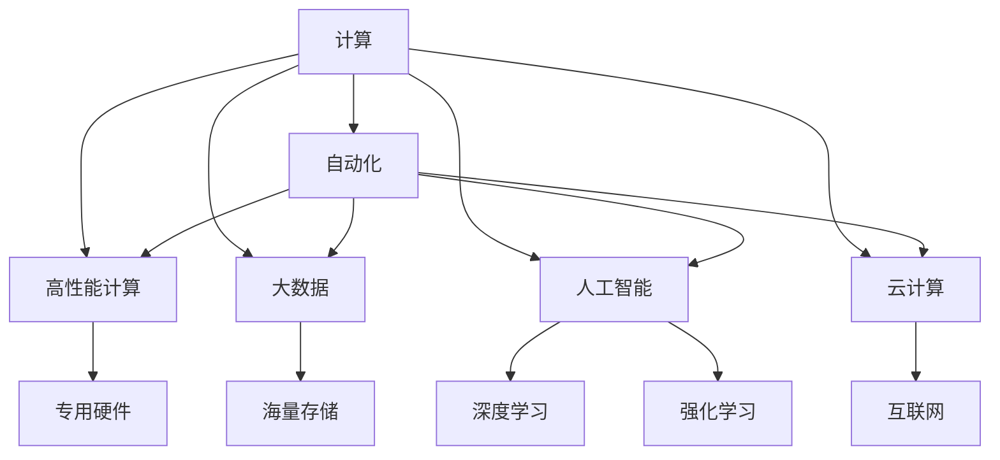

                 

# 计算变化带来的自动化新机遇

## 1. 背景介绍

随着计算技术的发展，特别是人工智能(AI)技术的进步，自动化已成为现代企业的重要战略方向。无论是制造业、服务业，还是金融、医疗等行业，自动化技术都在不断地改变着传统的生产、管理和服务模式。本文旨在探讨计算变化带来的自动化新机遇，帮助企业更好地理解和应用这些技术。

### 1.1 计算技术发展历程

计算技术的发展经历了从早期的机械计算、电子管计算到集成电路、大规模并行计算机、人工智能等几个阶段。特别是进入21世纪以来，计算技术呈现出以下几个显著趋势：

- **高性能计算**：基于GPU、TPU等专用硬件的高性能计算平台，极大地提升了数值计算和深度学习的速度和效率。
- **大数据技术**：数据量的大幅增长和多样性对计算资源和算法提出了更高要求，数据处理和分析能力不断提高。
- **云计算**：通过互联网提供按需计算资源，极大降低了计算成本，简化了计算基础设施的管理。
- **人工智能**：特别是深度学习和强化学习等技术的突破，使得计算机能够从数据中学习并自主决策。

### 1.2 自动化在企业中的应用现状

在制造业中，自动化技术如机器人、自动化生产线和智能仓储系统等，极大地提高了生产效率和质量。在服务业中，自动化聊天机器人和智能客服系统改善了客户体验和运营效率。在金融行业，自动化算法交易和风险管理工具显著提升了决策速度和准确性。在医疗领域，自动化诊断系统和智能医疗设备提高了诊断的精度和可及性。

## 2. 核心概念与联系

### 2.1 核心概念概述

- **计算**：利用电子设备对数据进行处理和分析的过程。
- **自动化**：通过编程或人工智能技术，让机器自主完成特定任务。
- **高性能计算**：使用专用硬件加速计算过程，提高计算效率。
- **大数据**：海量、高速、复杂的数据集，需要进行高效的存储和分析。
- **人工智能**：特别是深度学习和强化学习，通过数据训练模型，实现自主决策和优化。
- **云计算**：基于互联网的计算资源和平台，支持按需访问和弹性伸缩。

### 2.2 核心概念之间的关系

计算、自动化、高性能计算、大数据、人工智能和云计算等概念之间存在紧密的联系，构成了现代计算技术的基础框架。如下图所示：



这个图展示了计算与自动化技术的关系，以及各种计算技术间的相互支撑。

## 3. 核心算法原理 & 具体操作步骤

### 3.1 算法原理概述

自动化新机遇主要来源于计算技术的进步，特别是高性能计算、大数据分析和人工智能技术的应用。这些技术的核心在于利用计算资源处理和分析海量数据，从中发现规律和模式，并据此自动化地执行任务。

#### 3.1.1 高性能计算

高性能计算通过专用硬件（如GPU、TPU）和并行算法，极大地加速了数值计算和深度学习的速度。例如，在图像识别任务中，使用GPU加速的深度神经网络可以在几分钟内完成训练，而使用CPU则需要数小时甚至数天。

#### 3.1.2 大数据分析

大数据分析利用分布式计算框架（如Hadoop、Spark）和机器学习算法，从海量数据中提取有价值的信息。通过分析客户行为、市场趋势等数据，企业可以制定更精准的营销策略和运营决策。

#### 3.1.3 人工智能技术

人工智能技术通过深度学习和强化学习算法，使计算机具备自主决策和优化能力。例如，自动驾驶汽车通过深度学习算法识别道路、行人等对象，自动规划行车路线，从而提高驾驶安全性和效率。

### 3.2 算法步骤详解

自动化新机遇的实现主要包括以下几个步骤：

1. **数据收集与预处理**：收集相关领域的原始数据，并进行清洗、归一化和特征工程，准备好数据输入模型。
2. **模型训练与优化**：利用高性能计算资源，训练深度学习或强化学习模型，并进行超参数调优和模型优化。
3. **模型部署与应用**：将训练好的模型部署到生产环境中，根据实际需求进行应用。例如，在制造业中使用自动化生产线，在医疗领域中使用智能诊断系统。
4. **监控与迭代**：持续监控模型性能，根据反馈进行模型更新和优化。

### 3.3 算法优缺点

#### 3.3.1 优点

1. **提高效率**：自动化技术可以显著提高生产效率、服务质量和决策速度。
2. **降低成本**：自动化系统可以替代人力，降低运营成本，提高资源利用率。
3. **增强决策能力**：通过数据分析和人工智能，自动化系统能够提供更精准、全面的决策支持。

#### 3.3.2 缺点

1. **技术复杂性**：实施自动化项目需要较高的技术门槛和专业人才。
2. **数据隐私问题**：自动化系统依赖大量数据，可能涉及隐私和数据安全问题。
3. **初始投资高**：高性能计算和云计算基础设施的建设需要较高的初始投资。

### 3.4 算法应用领域

自动化技术已经广泛应用于多个领域，包括但不限于：

- **制造业**：自动化生产线、智能仓储系统、机器人手臂等。
- **金融业**：自动化算法交易、风险管理、客户服务机器人等。
- **医疗**：智能诊断系统、药物研发、手术辅助系统等。
- **零售业**：无人商店、智能推荐系统、客户服务机器人等。
- **物流**：自动驾驶卡车、智能配送系统、仓储机器人等。

## 4. 数学模型和公式 & 详细讲解

### 4.1 数学模型构建

自动化技术中的数学模型主要涉及优化问题、统计分析和机器学习算法。以下以线性回归为例，展示数学模型的构建过程。

假设有一组数据集 $\{(x_i,y_i)\}_{i=1}^n$，其中 $x_i$ 为输入特征，$y_i$ 为输出目标。线性回归的目标是找到一个线性函数 $y=wx+b$，使其能够最小化预测误差。

数学模型可以表示为：

$$
\min_{w,b} \sum_{i=1}^n (y_i - (wx_i + b))^2
$$

### 4.2 公式推导过程

上述优化问题可以通过梯度下降算法求解。设学习率为 $\eta$，则每次迭代更新的参数 $w$ 和 $b$ 分别为：

$$
w \leftarrow w - \eta \frac{1}{n} \sum_{i=1}^n (y_i - wx_i - b) x_i
$$

$$
b \leftarrow b - \eta \frac{1}{n} \sum_{i=1}^n (y_i - wx_i - b)
$$

通过上述公式，我们可以逐步调整模型参数，使其最小化预测误差。

### 4.3 案例分析与讲解

在制造业的自动化生产线上，可以使用线性回归模型预测生产线的生产速度。假设已知过去一段时间的生产数据，包括生产线工人的工作时长、物料消耗、机器故障率等特征，以及每小时的生产速度，可以通过线性回归模型预测未来生产线的生产速度。

## 5. 项目实践：代码实例和详细解释说明

### 5.1 开发环境搭建

为了实践自动化新机遇的代码实现，需要搭建相应的开发环境。以下是Python开发环境的搭建流程：

1. **安装Python**：下载Python安装程序，安装最新版本。
2. **安装第三方库**：使用pip安装必要的第三方库，如NumPy、Pandas、Matplotlib等。
3. **配置虚拟环境**：使用virtualenv或conda创建虚拟环境，隔离开发依赖。

### 5.2 源代码详细实现

以下是一个使用Python实现线性回归模型的示例代码：

```python
import numpy as np
from sklearn.linear_model import LinearRegression

# 准备数据
x = np.array([[1, 2, 3], [4, 5, 6], [7, 8, 9], [10, 11, 12]])
y = np.array([4, 5, 6, 7])

# 训练模型
model = LinearRegression()
model.fit(x, y)

# 预测结果
x_test = np.array([[13, 14, 15], [16, 17, 18]])
y_pred = model.predict(x_test)
print(y_pred)
```

### 5.3 代码解读与分析

上述代码展示了使用Scikit-Learn库实现线性回归模型的全过程。首先，我们准备了输入特征 $x$ 和输出目标 $y$，然后使用LinearRegression模型进行训练，最后使用训练好的模型对新数据进行预测。

## 6. 实际应用场景

### 6.1 制造业

在制造业中，自动化技术可以显著提高生产效率和质量。例如，使用机器视觉系统对产品进行质量检测，能够快速识别缺陷并自动标记，从而减少人工检测的误差和时间。

### 6.2 金融业

金融行业利用自动化技术进行算法交易和风险管理，能够实时监控市场动态，快速做出决策，降低交易成本和风险。

### 6.3 医疗领域

在医疗领域，智能诊断系统通过分析医学影像和病历数据，提供精准的诊断建议，辅助医生进行决策，提高诊断的准确性和效率。

### 6.4 未来应用展望

未来，自动化技术将进一步融合大数据、人工智能和物联网技术，实现更广泛的应用。例如，自动驾驶汽车、智能家居、智能城市等，将极大地提升人类的生活品质和工作效率。

## 7. 工具和资源推荐

### 7.1 学习资源推荐

为了帮助开发者更好地理解自动化新技术，以下是一些优质的学习资源：

1. **在线课程**：Coursera、edX、Udacity等平台提供的机器学习和人工智能课程。
2. **书籍**：《深度学习》（Ian Goodfellow等著）、《机器学习实战》（Peter Harrington著）、《Python数据科学手册》（Jake VanderPlas著）。
3. **博客和论文**：Kaggle、arXiv等平台的论文和博客文章，保持最新的技术动态和实践案例。

### 7.2 开发工具推荐

以下是一些常用的开发工具，可以帮助开发者更高效地实现自动化项目：

1. **Python**：Python语言的简洁和易用性，使其成为自动化开发的首选语言。
2. **NumPy和Pandas**：Python的数据处理库，能够快速处理和分析大量数据。
3. **Scikit-Learn**：Python的机器学习库，提供了丰富的机器学习算法和工具。
4. **TensorFlow和PyTorch**：深度学习框架，支持高效的数值计算和模型训练。
5. **AWS、Google Cloud和Microsoft Azure**：云平台，提供按需计算资源和自动化服务。

### 7.3 相关论文推荐

以下是一些关于自动化技术的重要论文，值得深入阅读：

1. "Linear Regression" by Fitzpatrick（1983）：线性回归算法的基本原理和实现。
2. "Deep Learning" by Goodfellow等（2016）：深度学习技术的发展和应用。
3. "Big Data" by Britz和Brynjolfsson（2012）：大数据技术的基本概念和应用。
4. "Reinforcement Learning" by Sutton和Barto（1998）：强化学习算法的基本原理和应用。

## 8. 总结：未来发展趋势与挑战

### 8.1 研究成果总结

自动化技术在过去几十年中取得了显著的进展，尤其是在计算技术发展的推动下。从早期的简单自动化控制到现代的深度学习和人工智能技术，自动化技术已经渗透到各个领域，极大地提升了效率和决策能力。

### 8.2 未来发展趋势

未来，自动化技术将继续在以下几个方向发展：

1. **智能化**：智能化自动化系统将具备更强的自主决策和优化能力，能够更精准地应对复杂任务。
2. **集成化**：自动化技术与物联网、大数据、人工智能等技术的融合，将实现更全面的自动化应用。
3. **人机协同**：自动化系统将与人类协作，提供更好的用户体验和服务质量。
4. **可解释性**：未来的自动化系统将具备更高的可解释性，使人类更容易理解和信任其决策。

### 8.3 面临的挑战

尽管自动化技术已经取得了显著的进展，但仍面临以下挑战：

1. **技术复杂性**：自动化项目的实施需要较高的技术门槛和专业人才。
2. **数据隐私问题**：自动化系统依赖大量数据，可能涉及隐私和数据安全问题。
3. **初始投资高**：高性能计算和云计算基础设施的建设需要较高的初始投资。

### 8.4 研究展望

为了应对上述挑战，未来的研究需要在以下几个方向取得突破：

1. **技术普及化**：通过技术培训和开源社区的建设，降低自动化技术的入门门槛。
2. **数据保护技术**：开发更加安全可靠的数据保护技术，确保数据隐私和安全。
3. **成本优化**：探索更加高效和经济的计算资源和算法，降低初始投资。

## 9. 附录：常见问题与解答

**Q1: 什么是自动化技术？**

A: 自动化技术通过编程或人工智能技术，使机器能够自主完成特定任务，提高效率和决策能力。

**Q2: 自动化技术有哪些应用？**

A: 自动化技术广泛应用于制造业、金融业、医疗、零售、物流等领域，提高生产效率、服务质量和决策速度。

**Q3: 自动化技术面临哪些挑战？**

A: 技术复杂性、数据隐私问题和初始投资高等是自动化技术面临的主要挑战。

**Q4: 如何应对这些挑战？**

A: 通过技术培训、数据保护技术和成本优化等手段，克服自动化技术面临的挑战。

**Q5: 自动化技术的发展趋势是什么？**

A: 未来自动化技术将更加智能化、集成化和可解释化，实现更全面和高效的应用。

---

作者：禅与计算机程序设计艺术 / Zen and the Art of Computer Programming

