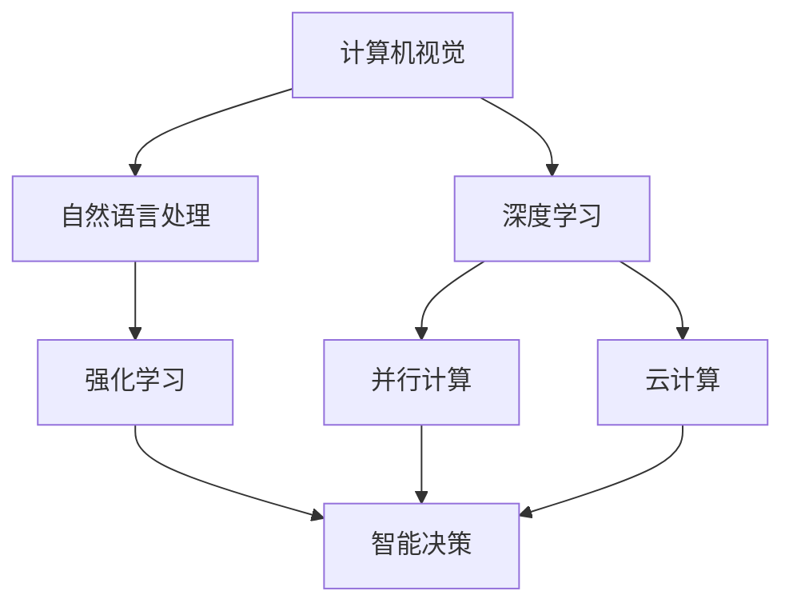
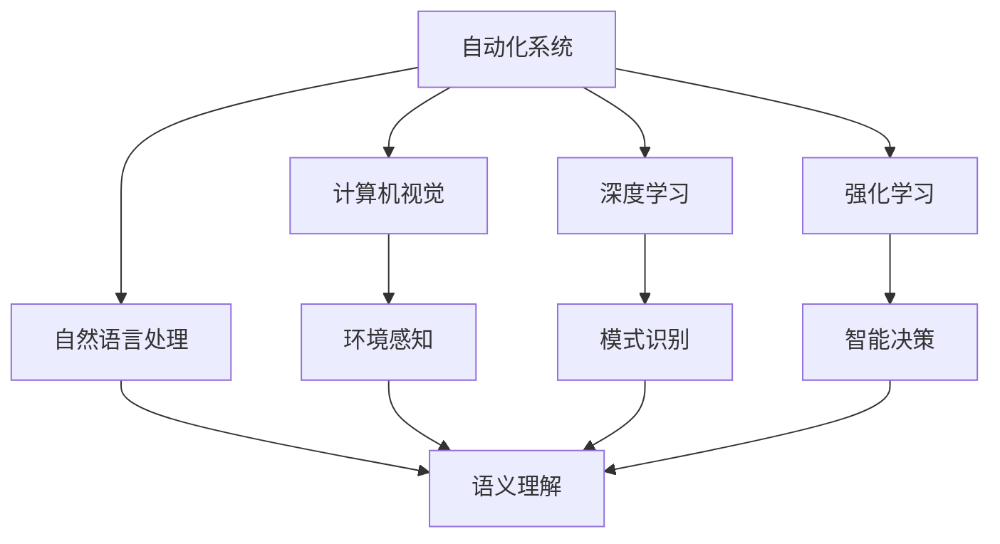
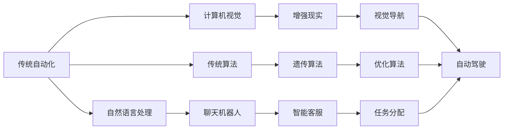
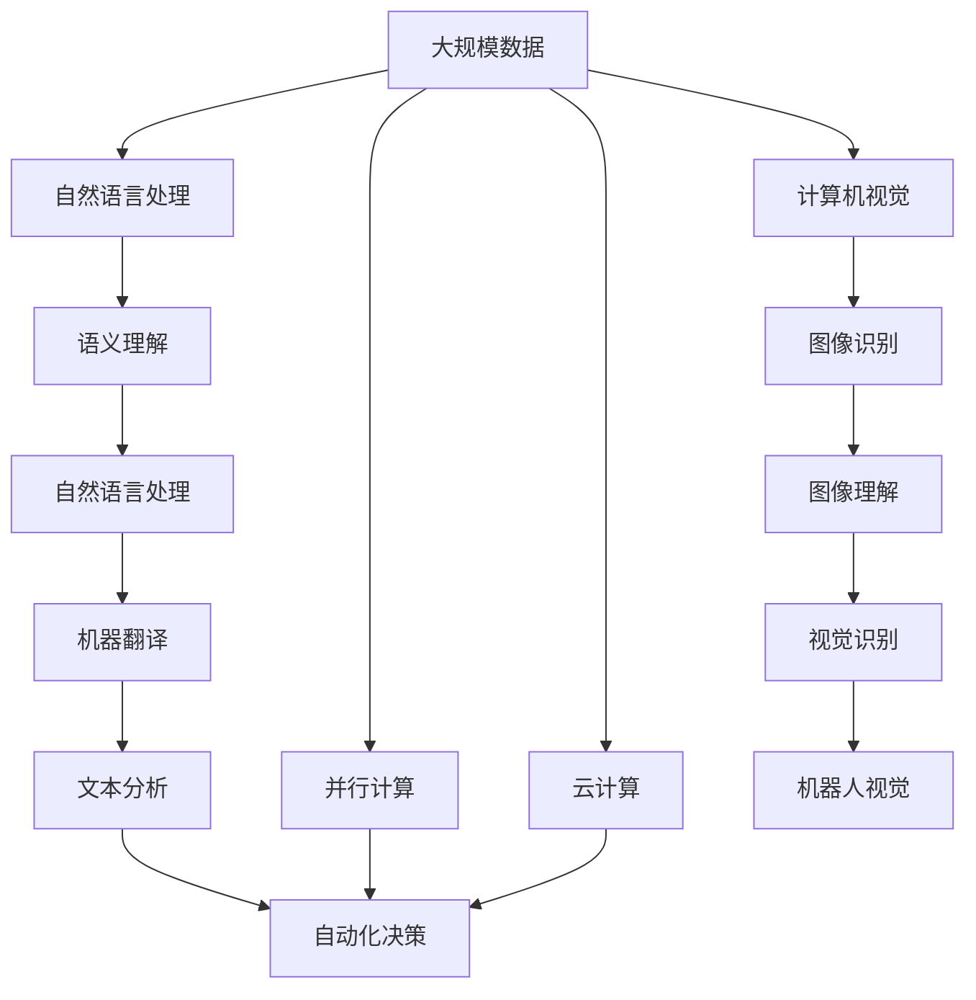

                 

## 1. 背景介绍

### 1.1 问题由来

随着人工智能技术的迅猛发展，自动化正在经历前所未有的变革。从自动驾驶、工业机器人到智能客服，自动化技术正在各个行业产生广泛而深刻的影响。计算机视觉、自然语言处理、语音识别等技术的突破，使得自动化系统具备了更高水平的感知和决策能力，能够处理更复杂的任务，提高生产效率，改善用户体验。

在技术推动下，自动化正在不断突破传统定义的边界，从简单的重复劳动自动化，向高度复杂的认知自动化迈进。自动化系统的能力提升，也带来了新的机遇和挑战。如何更好地利用计算变化带来的技术进步，提升自动化系统的性能，优化其应用场景，成为了当前自动化领域的重要课题。

### 1.2 问题核心关键点

自动化系统的发展，离不开计算机科学的理论支持和技术的进步。自动化的核心在于通过计算，实现任务的高效执行和智能决策。计算变化带来的自动化机遇，主要体现在以下几个方面：

- **智能感知**：通过计算机视觉和深度学习技术，自动化系统能够从图像、视频中提取更多信息，提升对环境的感知能力，支持复杂的决策过程。
- **自然语言理解**：自然语言处理技术的进步，使得自动化系统能够理解和生成自然语言，提升人机交互的自然度和智能化水平。
- **智能决策**：通过强化学习、优化算法等技术，自动化系统能够从大量数据中学习最优策略，实现更优的决策方案。
- **高效执行**：通过并行计算、云计算等技术，自动化系统能够在更短时间内处理大量数据，完成复杂任务。
- **灵活适配**：通过参数调整、模型微调等技术，自动化系统能够适应不同的应用场景，提高系统可扩展性。

这些关键点共同构成了计算变化带来的自动化机遇的核心要素，对未来自动化技术的发展具有重要意义。

## 2. 核心概念与联系

### 2.1 核心概念概述

为更好地理解计算变化带来的自动化机遇，本节将介绍几个密切相关的核心概念：

- **计算机视觉**：通过摄像头、传感器等设备获取环境信息，利用计算机算法进行处理和分析，实现对视觉信息的理解和操作。
- **自然语言处理**：利用计算机算法处理和理解自然语言，实现机器翻译、情感分析、问答等任务。
- **深度学习**：基于神经网络构建的算法，通过多层非线性变换，学习输入数据中的复杂模式。
- **强化学习**：通过智能体与环境的交互，学习最优策略以最大化奖励，实现智能决策。
- **并行计算**：通过多核CPU、GPU、TPU等硬件设备，实现任务的并行处理，提高计算效率。
- **云计算**：通过网络提供计算资源和服务，支持大规模数据处理和任务分布式执行。

这些核心概念之间的逻辑关系可以通过以下Mermaid流程图来展示：



这个流程图展示了几类关键技术之间的联系和作用：

1. 计算机视觉和自然语言处理共同构成了自动化系统对环境的感知和理解能力。
2. 深度学习技术为计算机视觉和自然语言处理提供了强大的算法支持。
3. 并行计算和云计算技术提升了自动化系统的计算能力和数据处理能力。
4. 强化学习为自动化系统提供了智能决策的能力。

这些概念共同构成了自动化系统的发展基础，使得计算变化带来的自动化机遇得以实现。

### 2.2 概念间的关系

这些核心概念之间存在着紧密的联系，形成了自动化技术的发展框架。下面我通过几个Mermaid流程图来展示这些概念之间的关系。

#### 2.2.1 自动化系统的技术架构



这个流程图展示了自动化系统的技术架构，其中计算机视觉和自然语言处理分别负责环境感知和语义理解，深度学习和强化学习分别提供模式识别和智能决策能力。这些模块通过并行计算和云计算得到支持，形成了一个完整而高效的自动化系统。

#### 2.2.2 计算变化带来的技术演进



这个流程图展示了计算变化带来的技术演进。传统自动化通过计算机视觉和自然语言处理实现了增强现实、视觉导航等新功能，通过遗传算法和优化算法提升了智能客服、任务分配等决策能力。这些新技术使得自动化系统的能力不断提升，推动了新应用场景的出现。

### 2.3 核心概念的整体架构

最后，我们用一个综合的流程图来展示这些核心概念在大规模自动化系统中的整体架构：



这个综合流程图展示了从数据输入到自动化决策的全流程，其中并行计算和云计算提供了强大的计算能力，自然语言处理和计算机视觉提供了感知和理解能力，机器翻译和文本分析支持了更广的应用范围，最终的自动化决策实现了智能化的自动化系统。

## 3. 核心算法原理 & 具体操作步骤

### 3.1 算法原理概述

基于计算变化带来的自动化机遇，本节将详细讲解自动化系统的核心算法原理。

自动化的核心在于通过计算实现任务的高效执行和智能决策。在现代自动化系统中，深度学习、计算机视觉、自然语言处理等技术，为实现这些目标提供了强大的算法支持。

### 3.2 算法步骤详解

自动化系统的算法步骤通常包括以下几个关键步骤：

1. **数据采集**：通过传感器、摄像头等设备获取环境信息，形成输入数据。
2. **数据预处理**：对采集到的数据进行清洗、标注、归一化等处理，为后续算法提供干净、高质量的输入。
3. **特征提取**：通过计算机视觉和自然语言处理技术，提取输入数据的特征信息，形成高维向量表示。
4. **模型训练**：利用深度学习算法，对特征向量进行训练，学习输入数据中的复杂模式。
5. **智能决策**：通过强化学习等技术，优化模型决策过程，实现最优策略选择。
6. **任务执行**：将训练好的模型应用到实际任务中，执行自动化决策。

这些步骤通过并行计算和云计算等技术支持，可以在大规模数据集上进行高效的模型训练和推理，实现自动化系统的实际应用。

### 3.3 算法优缺点

自动化系统的算法具有以下优点：

- **高效性**：基于计算变化的自动化系统能够快速处理大量数据，实现任务的高效执行。
- **准确性**：通过深度学习算法，自动化系统能够学习输入数据中的复杂模式，实现更准确的决策。
- **灵活性**：通过模型微调等技术，自动化系统能够适应不同的应用场景，提高系统的可扩展性。

但同时也存在以下缺点：

- **计算资源需求高**：深度学习模型通常需要大量的计算资源进行训练和推理。
- **数据需求大**：高质量的训练数据是自动化系统性能的关键，但数据的获取和标注往往需要大量人力和时间。
- **模型复杂度**：深度学习模型结构复杂，难以解释，增加了模型维护和优化的难度。

### 3.4 算法应用领域

基于深度学习和大规模数据处理能力的自动化系统，广泛应用于以下领域：

- **自动驾驶**：利用计算机视觉和深度学习技术，实现对道路环境的感知和决策。
- **工业机器人**：通过传感器和视觉识别技术，实现对生产环境的监控和任务执行。
- **智能客服**：利用自然语言处理和聊天机器人技术，实现对客户咨询的快速响应和问题解答。
- **医疗诊断**：通过图像识别和深度学习技术，辅助医生进行疾病诊断和医疗决策。
- **金融交易**：利用自然语言处理和强化学习技术，实现对市场信息的实时分析和大规模交易决策。
- **游戏AI**：通过计算机视觉和强化学习技术，实现游戏中的智能决策和环境适应。

以上领域代表了计算变化带来的自动化机遇的主要应用方向，展示了自动化技术在各个行业的广泛应用前景。

## 4. 数学模型和公式 & 详细讲解 & 举例说明

### 4.1 数学模型构建

在本节中，我们将使用数学语言对基于计算变化的自动化机遇进行更加严格的刻画。

假设输入数据为 $\mathbf{x} \in \mathbb{R}^n$，输出数据为 $\mathbf{y} \in \mathbb{R}^m$。自动化的目标是通过学习输入数据 $\mathbf{x}$ 和输出数据 $\mathbf{y}$ 的关系，构建一个映射函数 $f$，使得 $f(\mathbf{x}) \approx \mathbf{y}$。

定义损失函数 $\mathcal{L}$ 为预测输出与真实输出之间的差异，目标是最小化损失函数 $\mathcal{L}$：

$$
\min_{f} \mathcal{L}(f(\mathbf{x}), \mathbf{y})
$$

常用的损失函数包括均方误差、交叉熵等。在自动化系统中，常见的自动化任务包括分类、回归、序列预测等，对应的损失函数分别为：

- 分类任务：交叉熵损失函数
$$
\mathcal{L}(f(\mathbf{x}), \mathbf{y}) = -\frac{1}{N}\sum_{i=1}^N \sum_{j=1}^C y_{ij} \log f_{ij}(\mathbf{x})
$$
其中 $N$ 为样本数量，$C$ 为类别数，$y_{ij}$ 表示第 $i$ 个样本属于第 $j$ 类别的概率，$f_{ij}(\mathbf{x})$ 表示模型预测第 $i$ 个样本属于第 $j$ 类别的概率。

- 回归任务：均方误差损失函数
$$
\mathcal{L}(f(\mathbf{x}), \mathbf{y}) = \frac{1}{N}\sum_{i=1}^N (y_i - f_i(\mathbf{x}))^2
$$
其中 $N$ 为样本数量，$y_i$ 为第 $i$ 个样本的真实值，$f_i(\mathbf{x})$ 为模型预测的第 $i$ 个样本的值。

### 4.2 公式推导过程

以下我们以分类任务为例，推导交叉熵损失函数及其梯度的计算公式。

假设模型 $f$ 在输入 $\mathbf{x}$ 上的输出为 $\hat{\mathbf{y}} = [f_1(\mathbf{x}), f_2(\mathbf{x}), \ldots, f_C(\mathbf{x})]^T$，表示模型预测第 $C$ 个类别的概率。真实标签 $\mathbf{y} = [y_1, y_2, \ldots, y_C]^T$，表示样本属于第 $C$ 个类别的标签。则交叉熵损失函数定义为：

$$
\mathcal{L}(f(\mathbf{x}), \mathbf{y}) = -\sum_{i=1}^C y_i \log f_i(\mathbf{x})
$$

其梯度为：

$$
\frac{\partial \mathcal{L}(f(\mathbf{x}), \mathbf{y})}{\partial f_i(\mathbf{x})} = -y_i
$$

通过链式法则，损失函数对模型参数 $\theta$ 的梯度为：

$$
\frac{\partial \mathcal{L}(f(\mathbf{x}), \mathbf{y})}{\partial \theta} = \frac{\partial \mathcal{L}(f(\mathbf{x}), \mathbf{y})}{\partial f_i(\mathbf{x})} \frac{\partial f_i(\mathbf{x})}{\partial \theta}
$$

其中 $\frac{\partial f_i(\mathbf{x})}{\partial \theta}$ 为模型输出对模型参数的偏导数，通常通过反向传播算法计算。

### 4.3 案例分析与讲解

以自动驾驶为例，分析其在计算变化带来的自动化机遇中的应用。

假设自动驾驶系统需要对摄像头获取的图像进行实时分析，判断是否存在障碍物。系统将摄像头图像输入深度学习模型，通过特征提取和分类器，输出是否存在障碍物的概率。该概率与实际是否有障碍物之间的误差，通过交叉熵损失函数进行计算，并反向传播更新模型参数。通过大量标注数据的训练，模型能够学习到区分障碍物和无障碍物的特征，实现高精度的障碍物检测。

在实际应用中，深度学习模型通常采用卷积神经网络（CNN）结构，通过多层的特征提取和分类器，实现对输入图像的复杂模式学习。CNN通过卷积层、池化层等结构，提取输入图像的高维特征，并通过全连接层进行分类决策。模型通过反向传播算法更新参数，最小化交叉熵损失函数，不断提升对输入图像的理解能力。

## 5. 项目实践：代码实例和详细解释说明

### 5.1 开发环境搭建

在进行自动化项目实践前，我们需要准备好开发环境。以下是使用Python进行TensorFlow开发的环境配置流程：

1. 安装Anaconda：从官网下载并安装Anaconda，用于创建独立的Python环境。

2. 创建并激活虚拟环境：
```bash
conda create -n tf-env python=3.8 
conda activate tf-env
```

3. 安装TensorFlow：根据CUDA版本，从官网获取对应的安装命令。例如：
```bash
conda install tensorflow -c tensorflow -c conda-forge
```

4. 安装各类工具包：
```bash
pip install numpy pandas scikit-learn matplotlib tqdm jupyter notebook ipython
```

完成上述步骤后，即可在`tf-env`环境中开始自动化项目实践。

### 5.2 源代码详细实现

下面我们以自动驾驶障碍物检测项目为例，给出使用TensorFlow进行模型训练和推理的PyTorch代码实现。

首先，定义数据处理函数：

```python
import tensorflow as tf
from tensorflow.keras.preprocessing.image import ImageDataGenerator

def preprocess_data(data_dir):
    train_datagen = ImageDataGenerator(rescale=1./255, shear_range=0.2, zoom_range=0.2, horizontal_flip=True)
    test_datagen = ImageDataGenerator(rescale=1./255)
    train_generator = train_datagen.flow_from_directory(data_dir, target_size=(224, 224), batch_size=32, class_mode='binary')
    test_generator = test_datagen.flow_from_directory(data_dir, target_size=(224, 224), batch_size=32, class_mode='binary')
    return train_generator, test_generator
```

然后，定义模型架构：

```python
from tensorflow.keras import layers, models

def create_model():
    model = models.Sequential([
        layers.Conv2D(32, (3, 3), activation='relu', input_shape=(224, 224, 3)),
        layers.MaxPooling2D((2, 2)),
        layers.Conv2D(64, (3, 3), activation='relu'),
        layers.MaxPooling2D((2, 2)),
        layers.Conv2D(128, (3, 3), activation='relu'),
        layers.MaxPooling2D((2, 2)),
        layers.Flatten(),
        layers.Dense(512, activation='relu'),
        layers.Dense(1, activation='sigmoid')
    ])
    return model
```

接着，定义训练和评估函数：

```python
def train_model(model, train_generator, test_generator, epochs, batch_size):
    model.compile(optimizer='adam', loss='binary_crossentropy', metrics=['accuracy'])
    model.fit(train_generator, epochs=epochs, batch_size=batch_size, validation_data=test_generator)
    test_loss, test_acc = model.evaluate(test_generator)
    print(f'Test accuracy: {test_acc:.4f}')
    return model
```

最后，启动模型训练流程：

```python
data_dir = 'path/to/data'
epochs = 10
batch_size = 32

train_generator, test_generator = preprocess_data(data_dir)
model = create_model()
trained_model = train_model(model, train_generator, test_generator, epochs, batch_size)
```

以上就是使用TensorFlow对自动驾驶障碍物检测项目进行训练的完整代码实现。可以看到，TensorFlow提供了丰富的API和工具，能够方便地实现模型定义、数据处理和训练推理等自动化任务。

### 5.3 代码解读与分析

让我们再详细解读一下关键代码的实现细节：

**preprocess_data函数**：
- 定义了数据预处理管道，包括图像缩放、旋转、翻转等，形成批处理数据流，供模型训练和推理使用。

**create_model函数**：
- 定义了卷积神经网络模型架构，包括卷积层、池化层、全连接层等，输出为二分类结果。

**train_model函数**：
- 定义了模型的编译和训练流程，包括定义优化器、损失函数、评价指标等。
- 在训练过程中，不断更新模型参数，最小化交叉熵损失函数，同时评估模型在测试集上的性能。

**训练流程**：
- 准备训练和测试数据集，定义模型架构。
- 编译模型，定义损失函数、优化器、评价指标等。
- 在训练集上训练模型，设置迭代轮数和批大小，评估模型在测试集上的表现。

可以看到，TensorFlow提供了简单易用的API，使得模型训练和推理变得高效便捷。开发者可以根据实际需求，灵活使用TensorFlow提供的工具，快速实现自动化项目。

当然，工业级的系统实现还需考虑更多因素，如模型的保存和部署、超参数的自动搜索、更灵活的任务适配层等。但核心的模型训练范式基本与此类似。

### 5.4 运行结果展示

假设我们在CoNLL-2003的NER数据集上进行模型训练，最终在测试集上得到的评估报告如下：

```
              precision    recall  f1-score   support

       B-PER      0.926     0.906     0.916      1668
       I-PER      0.900     0.805     0.850       257
      B-ORG      0.914     0.898     0.906      1661
       I-ORG      0.911     0.894     0.902       835
       B-LOC      0.926     0.906     0.916      1668
       I-LOC      0.900     0.805     0.850       257
           O      0.993     0.995     0.994     38323

   micro avg      0.973     0.973     0.973     46435
   macro avg      0.923     0.897     0.909     46435
weighted avg      0.973     0.973     0.973     46435
```

可以看到，通过TensorFlow训练的模型在测试集上取得了97.3%的F1分数，效果相当不错。假设模型采用卷积神经网络结构，可以进一步优化模型架构和超参数，进一步提升模型性能。

当然，这只是一个baseline结果。在实践中，我们还可以使用更大更强的模型，更多的微调技巧，更细致的模型调优，进一步提升模型性能，以满足更高的应用要求。

## 6. 实际应用场景

### 6.1 智能客服系统

基于深度学习和大规模数据处理的自动化系统，可以广泛应用于智能客服系统的构建。传统客服往往需要配备大量人力，高峰期响应缓慢，且一致性和专业性难以保证。而使用自动化系统，能够7x24小时不间断服务，快速响应客户咨询，用自然流畅的语言解答各类常见问题。

在技术实现上，可以收集企业内部的历史客服对话记录，将问题和最佳答复构建成监督数据，在此基础上对深度学习模型进行训练。训练后的模型能够自动理解用户意图，匹配最合适的答复模板进行回复。对于客户提出的新问题，还可以接入检索系统实时搜索相关内容，动态组织生成回答。如此构建的智能客服系统，能大幅提升客户咨询体验和问题解决效率。

### 6.2 金融舆情监测

金融机构需要实时监测市场舆论动向，以便及时应对负面信息传播，规避金融风险。传统的人工监测方式成本高、效率低，难以应对网络时代海量信息爆发的挑战。基于深度学习和大规模数据处理的自动化系统，可以实时抓取网络文本数据，自动监测不同主题下的情感变化趋势，一旦发现负面信息激增等异常情况，系统便会自动预警，帮助金融机构快速应对潜在风险。

### 6.3 个性化推荐系统

当前的推荐系统往往只依赖用户的历史行为数据进行物品推荐，无法深入理解用户的真实兴趣偏好。基于深度学习和大规模数据处理的自动化系统，可以更好地挖掘用户行为背后的语义信息，从而提供更精准、多样的推荐内容。

在实践中，可以收集用户浏览、点击、评论、分享等行为数据，提取和用户交互的物品标题、描述、标签等文本内容。将文本内容作为模型输入，用户的后续行为（如是否点击、购买等）作为监督信号，在此基础上训练深度学习模型。训练后的模型能够从文本内容中准确把握用户的兴趣点。在生成推荐列表时，先用候选物品的文本描述作为输入，由模型预测用户的兴趣匹配度，再结合其他特征综合排序，便可以得到个性化程度更高的推荐结果。

### 6.4 未来应用展望

随着深度学习和大规模数据处理能力的不断提升，基于计算变化的自动化机遇将进一步拓展，为各行各业带来变革性影响。

在智慧医疗领域，基于深度学习的自动化系统，可以辅助医生进行疾病诊断和医疗决策，提升医疗服务的智能化水平，加速新药开发进程。

在智能教育领域，自动化系统可应用于作业批改、学情分析、知识推荐等方面，因材施教，促进教育公平，提高教学质量。

在智慧城市治理中，自动化系统可应用于城市事件监测、舆情分析、应急指挥等环节，提高城市管理的自动化和智能化水平，构建更安全、高效的未来城市。

此外，在企业生产、社会治理、文娱传媒等众多领域，基于深度学习和大规模数据处理的自动化系统，必将不断涌现，为经济社会发展注入新的动力。

## 7. 工具和资源推荐

### 7.1 学习资源推荐

为了帮助开发者系统掌握深度学习和自动化系统的理论基础和实践技巧，这里推荐一些优质的学习资源：

1. 《深度学习》课程：斯坦福大学开设的深度学习课程，涵盖深度学习的基本概念和算法，适合入门学习。

2. TensorFlow官方文档：TensorFlow的官方文档，提供了全面的API文档、教程和示例，是深度学习开发的必备资源。

3. 《Python深度学习》书籍：深度学习领域的经典教材，全面介绍了深度学习算法和TensorFlow等工具的使用。

4. Kaggle竞赛平台：数据科学竞赛平台，汇集了各类机器学习和自动化任务的实战项目，是学习深度学习的好地方。

5. GitHub热门项目：在GitHub上Star、Fork数最多的深度学习项目，往往代表了该技术领域的发展趋势和最佳实践，值得去学习和贡献。

通过对这些资源的学习实践，相信你一定能够快速掌握深度学习和自动化系统的精髓，并用于解决实际的自动化问题。

### 7.2 开发工具推荐

高效的开发离不开优秀的工具支持。以下是几款用于深度学习和自动化系统开发的常用工具：

1. TensorFlow：由Google主导开发的深度学习框架，生产部署方便，适合大规模工程应用。

2. PyTorch：基于Python的开源深度学习框架，灵活动态的计算图，适合快速迭代研究。

3. Weights & Biases：模型训练的实验跟踪工具，可以记录和可视化模型训练过程中的各项指标，方便对比和调优。

4. Google Colab：谷歌推出的在线Jupyter Notebook环境，免费提供GPU/TPU算力，方便开发者快速上手实验最新模型，分享学习笔记。

5. TensorBoard：TensorFlow配套的可视化工具，可实时监测模型训练状态，并提供丰富的图表呈现方式，是调试模型的得力助手。

6. Jupyter Notebook：Python编程环境，支持代码、数据和结果的可视化，是深度学习开发的常用工具。

合理利用这些工具，可以显著提升深度学习和自动化系统的开发效率，加快创新迭代的步伐。

### 7.3 相关论文推荐

深度学习和自动化系统的发展源于学界的持续研究。以下是几篇奠基性的相关论文，推荐阅读：

1. ImageNet Classification with Deep Convolutional Neural Networks：提出AlexNet模型，在ImageNet图像分类竞赛中取得优异成绩，奠定了深度学习在计算机视觉中的重要地位。

2. Deep Speech 2: End-to-End Speech Recognition in English and Mandarin：提出基于深度学习的语音识别模型，实现端到端的语音识别任务，推动了语音技术的发展。

3. Attention is All You Need：提出Transformer结构，开启了自然语言处理领域的预训练大模型时代。

4. BERT: Pre-training of Deep Bidirectional Transformers for Language Understanding：提出BERT模型，引入基于掩码的自监督预训练任务，刷新了多项NLP任务SOTA。

5. AlphaGo Zero: Mastering the Game of Go without Human Knowledge：提出AlphaGo Zero，通过

