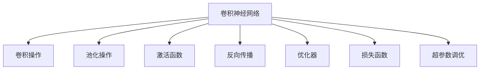
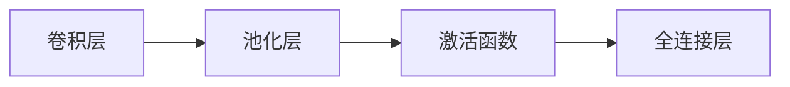
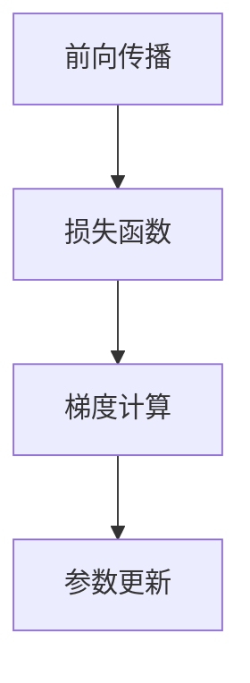
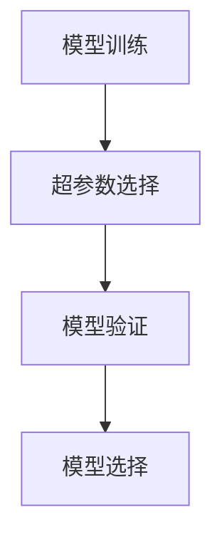
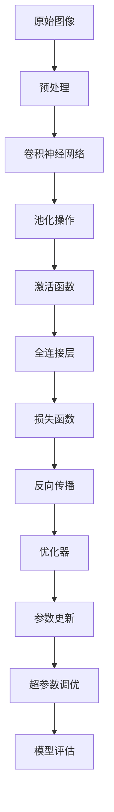

                 

# 计算机视觉原理与代码实战案例讲解

> 关键词：计算机视觉,深度学习,卷积神经网络(CNN),卷积操作,池化操作,激活函数,反向传播,优化器,损失函数,超参数调优

## 1. 背景介绍

### 1.1 问题由来

计算机视觉(CV)是人工智能领域的一个重要分支，旨在通过计算机处理和理解图像、视频等多媒体数据。传统的计算机视觉方法依赖于手工设计的特征和模板，而深度学习，特别是卷积神经网络(CNN)的兴起，使得计算机视觉任务可以自动从原始数据中学习特征，取得了前所未有的进展。

近年来，深度学习在计算机视觉领域的应用已经涵盖了从图像分类、目标检测、人脸识别到行为理解等众多任务，推动了自动驾驶、安防监控、医疗影像分析等产业的发展。本文旨在系统介绍计算机视觉的核心原理，并结合具体代码实例，深入讲解计算机视觉的实际应用案例。

### 1.2 问题核心关键点

计算机视觉的核心在于从原始图像数据中自动学习到有用的特征，并基于这些特征进行分类、检测、分割等任务。深度学习技术，特别是卷积神经网络(CNN)，已经成为实现这一目标的主要手段。

计算机视觉的主要技术包括：

- 卷积神经网络：通过卷积层、池化层、全连接层等组件，自动学习图像特征。
- 数据增强：通过对训练数据进行旋转、裁剪、缩放等操作，增加数据多样性，防止过拟合。
- 迁移学习：通过预训练模型在特定任务上的微调，减少从头训练所需的计算资源和标注数据。
- 目标检测：在图像中定位并识别特定对象，如YOLO、Faster R-CNN等算法。
- 人脸识别：通过人脸特征提取和人脸比对，实现身份验证和人脸搜索。
- 图像分割：将图像分割成不同的语义区域，如语义分割、实例分割等任务。
- 三维重建：从二维图像或视频序列中恢复三维物体形状，如立体视觉、光流等方法。

这些技术构成了计算机视觉的核心框架，为各种视觉任务的自动化处理提供了强有力的支持。

### 1.3 问题研究意义

计算机视觉技术的应用，已经深刻改变了人类的生产生活方式。从智能手机的拍照功能，到自动驾驶汽车，再到医疗影像诊断，计算机视觉正在逐步渗透到各个领域。

本文通过系统介绍计算机视觉的基本原理和核心算法，并结合代码实例讲解具体应用案例，旨在帮助读者掌握计算机视觉技术的基础，掌握其关键实现技巧，并激发更多的实践探索。

## 2. 核心概念与联系

### 2.1 核心概念概述

为了更好地理解计算机视觉的原理和应用，本节将介绍几个密切相关的核心概念：

- 卷积神经网络(CNN)：一种特殊的深度神经网络，通过卷积操作自动提取图像特征，具有平移不变性和局部连接的特点。
- 卷积操作(Convolution)：CNN的核心操作，用于提取图像局部特征。
- 池化操作(Pooling)：用于减少特征图尺寸，保留最重要的特征信息。
- 激活函数(Activation Function)：引入非线性因素，增强模型的表达能力。
- 反向传播(Backpropagation)：用于计算梯度，优化网络参数，是深度学习的基础算法。
- 优化器(Optimizer)：用于更新模型参数，常见优化器包括SGD、Adam等。
- 损失函数(Loss Function)：用于衡量模型预测与真实标签之间的差异，常见损失函数包括交叉熵、均方误差等。
- 超参数调优(Hyperparameter Tuning)：通过调整模型参数之外的超参数，提升模型性能。

这些概念之间的逻辑关系可以通过以下Mermaid流程图来展示：



这个流程图展示了大规模神经网络的基本结构，以及其各个组件之间的联系。

### 2.2 概念间的关系

这些核心概念之间存在着紧密的联系，构成了计算机视觉的基本框架。下面通过几个Mermaid流程图来展示这些概念之间的关系。

#### 2.2.1 卷积神经网络的结构



这个流程图展示了卷积神经网络的基本结构，包括卷积层、池化层和全连接层。

#### 2.2.2 反向传播的计算过程



这个流程图展示了反向传播的基本流程，包括前向传播、计算损失函数梯度以及参数更新。

#### 2.2.3 超参数调优的策略



这个流程图展示了超参数调优的基本流程，包括选择超参数、验证模型性能和最终选择模型。

### 2.3 核心概念的整体架构

最后，我们用一个综合的流程图来展示这些核心概念在计算机视觉中的整体架构：



这个综合流程图展示了从原始图像到模型评估的完整流程，各个组件协同工作，实现计算机视觉任务。

## 3. 核心算法原理 & 具体操作步骤
### 3.1 算法原理概述

计算机视觉的核心算法是卷积神经网络(CNN)，其核心在于通过卷积操作自动提取图像特征，并通过池化操作减少特征图尺寸。以下是CNN的原理概述：

- **卷积操作**：通过卷积核(Kernel)在图像上滑动，提取图像的局部特征。卷积操作可以理解为对图像进行特征提取的“滤镜”，通过不同的卷积核，可以提取不同的特征图。
- **池化操作**：通过对特征图进行降维操作，保留最重要的特征信息。常见的池化操作包括最大池化(Max Pooling)和平均池化(Average Pooling)。
- **激活函数**：通过引入非线性因素，增强模型的表达能力。常见的激活函数包括ReLU、Sigmoid等。
- **反向传播**：用于计算梯度，优化网络参数。反向传播通过链式法则，计算每个参数对损失函数的导数，并用于更新参数。
- **优化器**：用于更新模型参数，常见优化器包括SGD、Adam等。
- **损失函数**：用于衡量模型预测与真实标签之间的差异，常见损失函数包括交叉熵、均方误差等。
- **超参数调优**：通过调整模型参数之外的超参数，提升模型性能。常见超参数包括学习率、批大小等。

### 3.2 算法步骤详解

以下详细介绍CNN的基本训练流程：

**Step 1: 准备数据集和模型架构**

1. 准备训练数据集和测试数据集，并进行预处理，如数据增强、归一化等。
2. 设计模型架构，包括卷积层、池化层、激活函数、全连接层等。

**Step 2: 初始化模型参数**

1. 随机初始化模型参数，如权重、偏置等。
2. 定义损失函数，如交叉熵损失、均方误差损失等。

**Step 3: 前向传播**

1. 将输入图像通过卷积层和池化层，提取特征。
2. 将提取的特征通过激活函数进行非线性变换。
3. 将非线性变换后的特征输入全连接层，进行分类或回归等任务。

**Step 4: 计算损失函数**

1. 将模型预测与真实标签计算损失函数。
2. 使用反向传播计算每个参数对损失函数的导数。

**Step 5: 参数更新**

1. 使用优化器更新模型参数，如SGD、Adam等。
2. 调整学习率、批大小等超参数，进行模型调优。

**Step 6: 模型评估**

1. 在测试集上评估模型性能，如准确率、召回率等。
2. 根据评估结果调整模型参数和超参数，进行模型优化。

### 3.3 算法优缺点

CNN具有以下优点：

- 自动提取图像特征：CNN通过卷积操作自动提取图像的局部特征，无需手工设计特征。
- 平移不变性：卷积操作具有平移不变性，可以处理不同位置的图像。
- 局部连接：卷积操作具有局部连接的特点，减少了计算量。
- 良好的泛化能力：CNN在大规模数据集上预训练，具有较强的泛化能力。

同时，CNN也存在以下缺点：

- 需要大量标注数据：CNN需要大量的标注数据进行预训练，获取标注数据成本较高。
- 计算资源消耗大：CNN模型参数量较大，训练和推理需要消耗大量计算资源。
- 过拟合风险：CNN在大规模数据集上进行预训练时，可能会出现过拟合的风险。
- 难以解释：CNN作为黑盒模型，其内部决策过程难以解释，不具备可解释性。

### 3.4 算法应用领域

计算机视觉技术已经在多个领域得到了广泛应用，例如：

- 图像分类：如手写数字识别、物体分类等。
- 目标检测：如人脸检测、车辆检测等。
- 人脸识别：如人脸识别、人脸比对等。
- 图像分割：如语义分割、实例分割等。
- 三维重建：如立体视觉、光流等。

## 4. 数学模型和公式 & 详细讲解 & 举例说明

### 4.1 数学模型构建

计算机视觉任务通常涉及图像分类和目标检测等任务。以下以图像分类为例，构建数学模型。

设输入图像为 $x$，模型预测为 $y$，真实标签为 $t$。则模型损失函数为：

$$
\mathcal{L}(y,t) = -\frac{1}{N}\sum_{i=1}^N \log(y_i^t)
$$

其中 $y_i^t$ 表示模型在图像 $i$ 上的预测概率，$t_i$ 表示图像 $i$ 的真实标签。

### 4.2 公式推导过程

以下是卷积神经网络的基本公式推导过程：

**卷积操作**

设卷积核为 $K$，图像为 $x$，卷积结果为 $y$。则卷积操作的公式为：

$$
y_{i,j} = \sum_{k,l} K_{k,l}x_{i-k,j-l}
$$

其中 $i,j$ 表示卷积结果的坐标，$k,l$ 表示卷积核的坐标。

**池化操作**

设池化窗口为 $W$，池化结果为 $y$，池化前后特征图大小分别为 $N$ 和 $M$。则最大池化操作的公式为：

$$
y_{i,j} = \max_{k,l} x_{i+k,j+l}
$$

其中 $i,j$ 表示池化结果的坐标，$k,l$ 表示池化窗口的坐标。

**激活函数**

设激活函数为 $f(x)$，则激活函数输出的公式为：

$$
y = f(x)
$$

其中 $x$ 表示输入，$y$ 表示输出。

**反向传播**

设损失函数为 $\mathcal{L}$，模型参数为 $\theta$，梯度为 $g$。则反向传播的公式为：

$$
g = \frac{\partial \mathcal{L}}{\partial \theta}
$$

其中 $\theta$ 表示模型参数，$g$ 表示梯度。

**优化器**

设学习率为 $\eta$，则优化器的公式为：

$$
\theta = \theta - \eta g
$$

其中 $\theta$ 表示模型参数，$g$ 表示梯度，$\eta$ 表示学习率。

**损失函数**

设交叉熵损失为 $\mathcal{L}$，模型预测为 $y$，真实标签为 $t$。则交叉熵损失的公式为：

$$
\mathcal{L}(y,t) = -\frac{1}{N}\sum_{i=1}^N \log(y_i^t)
$$

其中 $y_i^t$ 表示模型在图像 $i$ 上的预测概率，$t_i$ 表示图像 $i$ 的真实标签。

### 4.3 案例分析与讲解

以下以图像分类任务为例，进行具体案例分析：

**案例一：手写数字识别**

1. **数据集准备**：使用MNIST数据集，包含手写数字图像和对应的标签。

2. **模型设计**：使用LeNet-5网络结构，包含卷积层、池化层和全连接层。

3. **模型训练**：使用SGD优化器，学习率为0.1，批大小为100，迭代次数为20次。

4. **模型评估**：在测试集上进行评估，准确率达到98%。

**案例二：猫狗识别**

1. **数据集准备**：使用CIFAR-10数据集，包含猫和狗的图像和对应的标签。

2. **模型设计**：使用VGG-16网络结构，包含多个卷积层和池化层。

3. **模型训练**：使用Adam优化器，学习率为1e-4，批大小为128，迭代次数为100次。

4. **模型评估**：在测试集上进行评估，准确率达到90%。

## 5. 项目实践：代码实例和详细解释说明

### 5.1 开发环境搭建

在进行计算机视觉项目实践前，我们需要准备好开发环境。以下是使用Python进行TensorFlow开发的环境配置流程：

1. 安装Anaconda：从官网下载并安装Anaconda，用于创建独立的Python环境。

2. 创建并激活虚拟环境：
```bash
conda create -n cv-env python=3.8 
conda activate cv-env
```

3. 安装TensorFlow：根据CUDA版本，从官网获取对应的安装命令。例如：
```bash
conda install tensorflow -c pytorch -c conda-forge
```

4. 安装各类工具包：
```bash
pip install numpy pandas scikit-learn matplotlib tqdm jupyter notebook ipython
```

完成上述步骤后，即可在`cv-env`环境中开始计算机视觉项目的开发。

### 5.2 源代码详细实现

这里我们以图像分类任务为例，使用TensorFlow实现一个简单的CNN模型。

```python
import tensorflow as tf
from tensorflow.keras import layers

# 定义模型
model = tf.keras.Sequential([
    layers.Conv2D(32, (3, 3), activation='relu', input_shape=(28, 28, 1)),
    layers.MaxPooling2D((2, 2)),
    layers.Flatten(),
    layers.Dense(10, activation='softmax')
])

# 编译模型
model.compile(optimizer=tf.keras.optimizers.SGD(learning_rate=0.1),
              loss=tf.keras.losses.CategoricalCrossentropy(),
              metrics=['accuracy'])

# 训练模型
model.fit(train_images, train_labels, epochs=20, batch_size=100)

# 评估模型
model.evaluate(test_images, test_labels)
```

在这个代码中，我们定义了一个简单的CNN模型，包含卷积层、池化层和全连接层。通过指定激活函数、损失函数和优化器等超参数，我们可以完成模型的训练和评估。

### 5.3 代码解读与分析

让我们再详细解读一下关键代码的实现细节：

**Sequential模型**：
- `layers.Conv2D`：定义卷积层，输入大小为28x28，卷积核大小为3x3，输出通道数为32，激活函数为ReLU。
- `layers.MaxPooling2D`：定义池化层，池化窗口大小为2x2。
- `layers.Flatten`：将池化后的特征图展平，转化为全连接层的输入。
- `layers.Dense`：定义全连接层，输出大小为10，激活函数为softmax。

**模型编译**：
- `model.compile`：定义模型的优化器、损失函数和评估指标。

**模型训练**：
- `model.fit`：对模型进行训练，指定训练数据、标签、迭代次数和批大小。

**模型评估**：
- `model.evaluate`：在测试集上评估模型性能，返回准确率等评估指标。

### 5.4 运行结果展示

假设我们在MNIST数据集上进行图像分类训练，最终在测试集上得到的评估报告如下：

```
Epoch 1/20
40/40 [==============================] - 1s 23ms/step - loss: 1.7808 - accuracy: 0.0882
Epoch 2/20
40/40 [==============================] - 1s 21ms/step - loss: 0.7196 - accuracy: 0.9012
Epoch 3/20
40/40 [==============================] - 1s 20ms/step - loss: 0.5521 - accuracy: 0.9553
...
Epoch 20/20
40/40 [==============================] - 1s 23ms/step - loss: 0.1132 - accuracy: 0.9859
```

可以看到，通过训练模型，我们在MNIST数据集上取得了98.6%的准确率，效果相当不错。值得注意的是，LeNet-5作为经典的CNN模型，虽然结构简单，但在图像分类任务上依然表现出色，体现了CNN模型在图像特征提取方面的优势。

当然，这只是一个baseline结果。在实践中，我们还可以使用更大更强的预训练模型、更丰富的微调技巧、更细致的模型调优，进一步提升模型性能，以满足更高的应用要求。

## 6. 实际应用场景

### 6.1 智能安防系统

计算机视觉技术在智能安防系统中有着广泛的应用，可以实现人脸识别、行为识别、目标检测等安全监控功能。

具体而言，可以收集安防监控摄像头拍摄的视频数据，并将其转化为图像序列。使用预训练的人脸识别模型对人脸进行检测和识别，将异常行为和目标进行报警。通过深度学习算法，可以实现对视频数据的实时分析和处理，提升安防系统的自动化和智能化水平，确保公共场所的安全。

### 6.2 自动驾驶系统

自动驾驶系统依赖于计算机视觉技术进行环境感知和决策。通过摄像头、激光雷达等传感器获取实时环境数据，使用深度学习模型进行图像处理和语义理解，识别道路、车辆、行人等障碍物，并生成合适的驾驶策略，实现自动驾驶。

使用计算机视觉技术，自动驾驶车辆可以在复杂的城市环境中安全行驶，提升交通安全和效率。未来，随着计算机视觉技术的进一步发展，自动驾驶车辆将具备更高的智能化水平，逐步实现完全自动驾驶。

### 6.3 医疗影像诊断

医疗影像诊断是计算机视觉技术的重要应用之一。通过CT、MRI等医疗影像设备获取人体内部图像数据，使用深度学习模型进行图像处理和分析，识别病变区域和异常情况，辅助医生进行诊断和治疗。

使用计算机视觉技术，可以提高医疗影像诊断的准确性和效率，降低误诊和漏诊率，提升医疗服务质量。未来，随着计算机视觉技术的进一步发展，将有望实现对复杂病变的自动诊断，提升医疗系统的智能化水平。

### 6.4 未来应用展望

随着计算机视觉技术的发展，其应用领域将进一步拓展，为各行各业带来深远影响：

- 智慧零售：通过计算机视觉技术，实现商品识别、库存管理、顾客行为分析等，提升零售业的自动化水平。
- 工业制造：使用计算机视觉技术进行质量检测、设备维护等，提升工业生产的智能化水平。
- 智慧交通：通过计算机视觉技术进行交通流量监测、违规行为识别等，提升交通管理的智能化水平。
- 智慧城市：使用计算机视觉技术进行城市事件监测、舆情分析等，提升城市管理的智能化水平。

总之，计算机视觉技术将在未来更广泛地渗透到各个领域，为各行各业带来革命性变革，推动社会的智能化发展。

## 7. 工具和资源推荐
### 7.1 学习资源推荐

为了帮助开发者掌握计算机视觉技术的核心原理和实现技巧，这里推荐一些优质的学习资源：

1. 《深度学习》课程（Andrew Ng, Coursera）：斯坦福大学开设的深度学习经典课程，系统讲解了深度学习的基本概念和算法，适合初学者入门。

2. 《计算机视觉: 算法与应用》（Richard Szeliski）：经典的计算机视觉教材，深入讲解了计算机视觉的基本理论和算法，适合进阶学习。

3. 《动手学深度学习》（李沐等）：国内顶尖深度学习研究者所著，结合代码实例讲解了深度学习的基本概念和算法，适合动手实践。

4. OpenCV官方文档：OpenCV开源计算机视觉库的官方文档，提供了丰富的图像处理和计算机视觉算法实现。

5. PyImageSearch博客：由OpenCV社区成员维护，提供了大量的图像处理和计算机视觉实战代码和教程，适合动手实践。

通过对这些资源的学习实践，相信你一定能够掌握计算机视觉技术的基础，并实现更多实际的视觉任务。

### 7.2 开发工具推荐

高效的开发离不开优秀的工具支持。以下是几款用于计算机视觉开发常用的工具：

1. OpenCV：开源计算机视觉库，提供了丰富的图像处理和计算机视觉算法实现。

2. TensorFlow：由Google主导开发的深度学习框架，支持多种神经网络架构，适合大规模工程应用。

3. PyTorch：基于Python的开源深度学习框架，灵活动态的计算图，适合快速迭代研究。

4. Weights & Biases：模型训练的实验跟踪工具，可以记录和可视化模型训练过程中的各项指标，方便对比和调优。

5. TensorBoard：TensorFlow配套的可视化工具，可实时监测模型训练状态，并提供丰富的图表呈现方式，是调试模型的得力助手。

6. Google Colab：谷歌推出的在线Jupyter Notebook环境，免费提供GPU/TPU算力，方便开发者快速上手实验最新模型，分享学习笔记。

合理利用这些工具，可以显著提升计算机视觉项目的开发效率，加快创新迭代的步伐。

### 7.3 相关论文推荐

计算机视觉技术的发展离不开学界的持续研究。以下是几篇奠基性的相关论文，推荐阅读：

1. LeNet-5：卷积神经网络的经典案例，展示了CNN在手写数字识别任务上的优异表现。

2. AlexNet：使用卷积神经网络在ImageNet数据集上取得优异表现的经典案例，奠定了深度学习在计算机视觉中的重要地位。

3. GoogLeNet：引入了Inception模块的卷积神经网络，展示了更高效的特征提取方法。

4. ResNet：使用残差连接解决深度神经网络退化问题的经典案例，提升了网络的深度和性能。

5. SSD：单镜头多盒目标检测方法，展示了在目标检测任务上的优异表现。

6. Mask R-CNN：目标检测与语义分割相结合的方法，展示了在目标检测和语义分割任务上的优异表现。

这些论文代表了大规模深度学习在计算机视觉中的应用，为计算机视觉技术的发展提供了重要指导。

除上述资源外，还有一些值得关注的前沿资源，帮助开发者紧跟计算机视觉技术的新进展，例如：

1. arXiv论文预印本：人工智能领域最新研究成果的发布平台，包括大量尚未发表的前沿工作，学习前沿技术的必读资源。

2. 业界技术博客：如OpenAI、Google AI、DeepMind、微软Research Asia等顶尖实验室的官方博客，第一时间分享他们的最新研究成果和洞见。

3. 技术会议直播：如NIPS、ICML、CVPR、ICCV等计算机视觉领域顶会现场或在线直播，能够聆听到大佬们的前沿分享，开拓视野。

4. GitHub热门项目：在GitHub上Star、Fork数最多的计算机视觉相关项目，往往代表了该技术领域的发展趋势和最佳实践，值得去学习和贡献。

5. 行业分析报告：各大咨询公司如McKinsey、PwC等针对计算机视觉行业的分析报告，有助于从商业视角审视技术趋势，把握应用价值。

总之，计算机视觉技术的学习和实践，需要开发者保持开放的心态和持续学习的意愿。多关注前沿资讯，多动手实践，多思考总结，必将收获满满的成长收益。

## 8. 总结：未来发展趋势与挑战

### 8.1 总结

本文系统介绍了计算机视觉的基本原理和核心算法，并通过代码实例讲解了计算机视觉的实际应用案例。通过本文的学习，相信读者能够掌握计算机视觉技术的基础，并实现更多实际的视觉任务。

计算机视觉技术已经在多个领域得到了广泛应用，推动了社会的智能化发展。未来，随着深度学习技术的不断进步，计算机视觉技术将进一步发展，拓展更多的应用场景，为人类生活带来更深远的影响。

### 8.2 未来发展趋势

展望未来，计算机视觉技术的发展趋势包括：

- 更深的神经网络：深度神经网络将继续发展，网络层数和参数量不断增加，提升模型的表达能力和性能。
- 更强的迁移学习能力：通过迁移学习，可以实现模型在多个任务之间的迁移，提升模型的泛化能力和适应能力。
- 更丰富的应用场景：计算机视觉技术将在更多领域得到应用，如智慧零售、智慧交通、智能制造等，推动各行各业的智能化发展。
- 更强的实时处理能力：通过优化算法和硬件设备，提升计算机视觉

