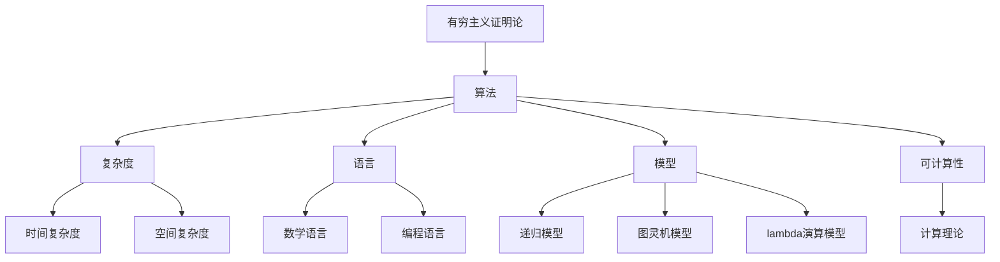
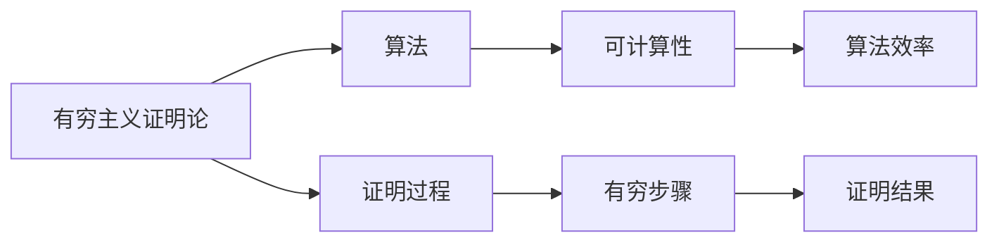
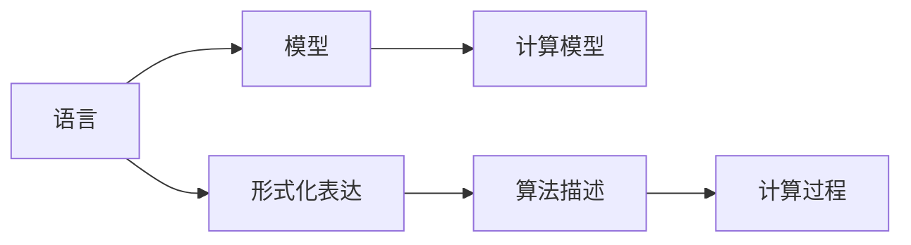
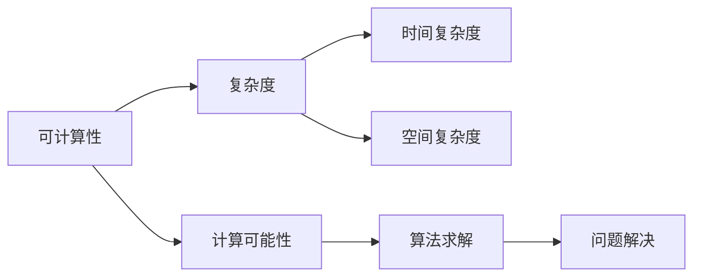
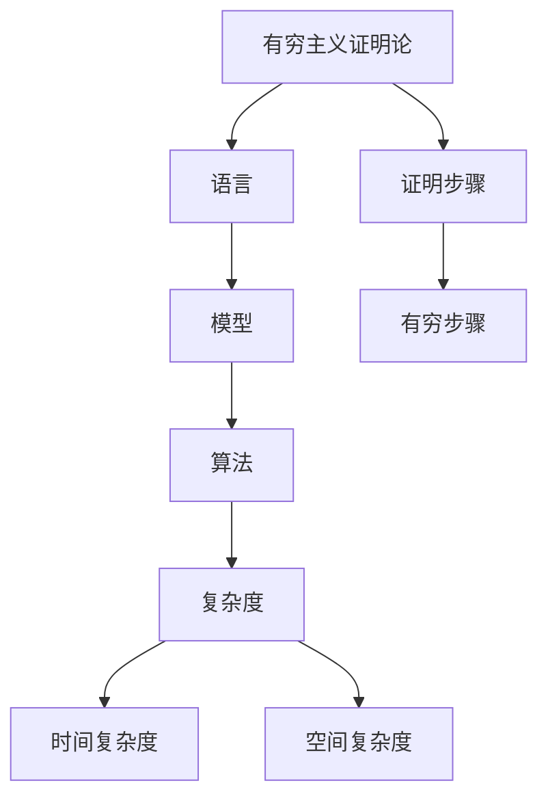

                 

# 计算：第三部分 计算理论的形成 第 6 章 计算理论的奠基：希尔伯特进路 有穷主义证明论

## 1. 背景介绍

### 1.1 问题由来
计算理论的奠基是现代计算机科学的重要篇章，而希尔伯特进路的有穷主义证明论则在这一篇章中占据了核心地位。希尔伯特进路，以希尔伯特提出的"有穷主义证明论"为起点，对计算的本质、复杂度以及可计算性进行了深入探索。理解这一理论，对于把握计算机科学的发展脉络，具有重要意义。

### 1.2 问题核心关键点
希尔伯特进路的核心在于有穷主义证明论，即有穷步骤可以证明一个命题的真假。对于计算理论而言，有穷主义证明论对应着可计算性，而可计算性则涉及算法、复杂度、语言、模型等多个概念。希尔伯特进路通过这些核心概念，构建了一个逻辑严谨、层次分明的理论框架。

### 1.3 问题研究意义
深入研究希尔伯特进路的有穷主义证明论，不仅有助于理解计算理论的基础，还可以启发我们对于人工智能、算法、复杂性理论等领域的深入思考。这一理论为现代计算模型、算法设计、问题求解提供了坚实的数学基础，是人工智能发展的基石之一。

## 2. 核心概念与联系

### 2.1 核心概念概述

为更好地理解希尔伯特进路的有穷主义证明论，本节将介绍几个关键概念：

- **有穷主义证明论(Finitism)**：基于有穷主义观点，认为只有通过有限步骤可证的命题才是有意义的。计算理论中的可计算性即源于此。

- **算法(Algorithm)**：一种按顺序执行的计算过程，旨在解决特定问题。算法是可计算性的具体实现形式。

- **复杂度(Complexity)**：描述一个算法所需的资源，包括时间复杂度和空间复杂度。复杂度分析是算法设计的重要工具。

- **语言(Language)**：指用于描述计算问题的形式化符号系统。常见的有数学语言、编程语言等。

- **模型(Model)**：对计算过程的抽象表示，如递归模型、图灵机模型、lambda演算模型等。

- **可计算性(Computability)**：指一个问题是否可以通过算法在有限时间内求解。可计算性是希尔伯特进路的核心概念。

这些概念之间的逻辑关系可以通过以下Mermaid流程图来展示：



这个流程图展示了计算理论的基本框架：

1. 有穷主义证明论提供了一个有穷化的证明视角，奠定了计算理论的哲学基础。
2. 算法是计算过程的具体实现，决定了问题的可计算性。
3. 复杂度用于衡量算法资源需求，是评估算法效率的重要指标。
4. 语言提供了形式化的表达手段，使问题可以转化为算法。
5. 模型是对计算过程的抽象表示，用于描述算法和问题的本质。
6. 可计算性是有穷主义证明论的核心，决定了哪些问题可以通过算法求解。

通过这些核心概念，希尔伯特进路构建了一个逻辑严谨、层次分明的理论框架，为我们理解计算的本质和复杂性提供了清晰的路径。

### 2.2 概念间的关系

这些核心概念之间存在紧密的联系，形成了计算理论的完整生态系统。我们通过几个Mermaid流程图来展示这些概念之间的关系：

#### 2.2.1 有穷主义证明论与算法



这个流程图展示了有穷主义证明论与算法之间的关系：

1. 有穷主义证明论定义了算法可计算性的哲学基础。
2. 算法是有穷主义证明论的具体实现，保证了问题的可计算性。
3. 可计算性决定了哪些算法可以高效求解特定问题。
4. 证明过程是有穷的，确保算法步骤和资源需求是有界的。

#### 2.2.2 语言与模型



这个流程图展示了语言与模型之间的关系：

1. 语言提供了形式化的表达手段。
2. 模型是对计算过程的抽象表示。
3. 形式化表达使问题可以转化为算法。
4. 算法描述是模型的具体实现。
5. 计算过程是模型运行的逻辑。

#### 2.2.3 可计算性与复杂度



这个流程图展示了可计算性与复杂度之间的关系：

1. 可计算性决定了问题的求解可能性。
2. 复杂度用于衡量算法资源需求。
3. 时间复杂度和空间复杂度是复杂度分析的重要指标。
4. 算法求解依赖于可计算性，保证了问题的求解是可能的。
5. 问题解决是通过算法实现的，依赖于有穷步骤的执行。

### 2.3 核心概念的整体架构

最后，我们用一个综合的流程图来展示这些核心概念在有穷主义证明论中的整体架构：



这个综合流程图展示了从有穷主义证明论到算法、复杂度的整个推导过程：

1. 有穷主义证明论提供了一个有穷化的证明视角。
2. 语言提供了形式化的表达手段，将问题转化为模型。
3. 模型是对计算过程的抽象表示。
4. 算法是模型的具体实现，保证了问题的可计算性。
5. 复杂度用于衡量算法资源需求。
6. 时间复杂度和空间复杂度是复杂度分析的重要指标。
7. 有穷步骤保证了算法的正确性和有效性。

通过这些流程图，我们可以更清晰地理解计算理论的基本概念及其关系，为后续深入讨论具体的证明和算法设计奠定基础。

## 3. 核心算法原理 & 具体操作步骤
### 3.1 算法原理概述

希尔伯特进路的有穷主义证明论，通过对算法和复杂度的逻辑分析，定义了可计算性的本质。其核心在于证明：一个命题可以通过有穷步骤被证明为真（或为假），即该命题是可计算的。这一证明过程通过构建有效的算法和模型，揭示了计算的本质。

具体而言，希尔伯特通过以下步骤，证明了某些类型的命题是有穷可证明的：

1. **初始化**：定义一个有穷数列 $\{x_n\}$，表示证明过程中的状态变化。
2. **递归定义**：定义一个递归函数 $f$，用于计算下一个状态 $x_{n+1}$。
3. **终止条件**：定义一个终止条件 $P(x)$，满足 $P(x_n)$ 当且仅当 $x_n$ 表示命题的证明。
4. **归纳证明**：证明递归函数 $f$ 的正确性，即对任意状态 $x_n$，均有 $f(x_n) = x_{n+1}$。
5. **证明结构**：构建一个有穷的证明树，通过递归应用 $f$ 来生成每一层节点。

这一过程揭示了有穷步骤如何被用于证明命题，从而奠定了计算理论的基础。

### 3.2 算法步骤详解

下面是希尔伯特证明过程中的一些关键步骤的详细解释：

**Step 1: 定义有穷数列**
首先定义一个有穷数列 $\{x_n\}$，其中每个元素 $x_n$ 表示证明过程中的一个状态。初始化时，$x_0$ 为问题命题的描述。后续状态通过递归函数 $f$ 计算得到。

**Step 2: 递归定义函数**
定义一个递归函数 $f$，用于计算下一个状态 $x_{n+1}$。通常，$f$ 会引用自身的输出，形成递归结构。例如，$f(x) = g(x, f(x))$，其中 $g$ 是一个有穷函数。

**Step 3: 定义终止条件**
定义一个终止条件 $P(x)$，满足 $P(x)$ 当且仅当 $x$ 表示命题的证明。通常，$P(x)$ 是一个有穷谓词，用于判断 $x$ 是否为合法的证明。

**Step 4: 归纳证明正确性**
证明递归函数 $f$ 的正确性，即对任意状态 $x_n$，均有 $f(x_n) = x_{n+1}$。这通常通过数学归纳法完成，即证明 $f(x_n) = x_{n+1}$ 对于所有 $n$ 成立。

**Step 5: 构建证明树**
构建一个有穷的证明树，通过递归应用 $f$ 来生成每一层节点。证明树的根节点为初始状态 $x_0$，每层节点通过 $f$ 计算得到。

### 3.3 算法优缺点

希尔伯特进路的有穷主义证明论，具有以下优点：

1. **形式化严谨**：有穷主义证明论通过形式化的证明过程，确保了计算理论的严谨性。
2. **可计算性明确**：证明了某些类型的命题是可计算的，为计算理论提供了明确的目标和方向。
3. **逻辑推理清晰**：通过递归和归纳证明，揭示了计算过程的逻辑结构。

同时，该方法也存在一些缺点：

1. **复杂性高**：有穷主义证明论的证明过程复杂，难以直接应用到实际问题中。
2. **适用范围有限**：有穷主义证明论主要适用于数学和逻辑问题，对其他类型的计算问题适用性有限。
3. **抽象性强**：有穷主义证明论高度抽象，难以直观理解。

尽管存在这些局限性，希尔伯特进路的有穷主义证明论为计算理论提供了坚实的数学基础，是现代计算理论的重要起点。

### 3.4 算法应用领域

希尔伯特进路的有穷主义证明论，虽然抽象性强，但通过其逻辑结构和方法论，对多个领域产生了深远影响。

- **逻辑学和数学**：为逻辑学的形式化方法和数学证明提供了理论基础。
- **计算机科学**：奠定了计算理论的哲学基础，促进了算法设计和复杂度分析的发展。
- **人工智能**：为人工智能中的形式化推理和逻辑学习提供了灵感和参考。
- **哲学和认知科学**：对认知计算和人工智能的哲学问题进行了深入探讨。

## 4. 数学模型和公式 & 详细讲解 & 举例说明

### 4.1 数学模型构建

希尔伯特进路的有穷主义证明论，主要通过数学模型来描述计算过程。一个典型的数学模型为递归函数和有穷数列，如下所示：

$$
\begin{cases}
f(0) = 0 \\
f(n+1) = g(n, f(n))
\end{cases}
$$

其中 $g$ 是一个有穷函数，$f(n)$ 表示递归函数在状态 $n$ 时的输出。

### 4.2 公式推导过程

下面以一个简单的数学证明为例，展示有穷主义证明论的证明过程：

**证明命题**：$\forall n \in \mathbb{N}, n^2 > 0$。

**证明步骤**：

1. 定义有穷数列 $\{x_n\}$，其中 $x_0 = 0$。
2. 递归定义 $f(x) = x^2$。
3. 定义终止条件 $P(x)$，即 $P(x) = x \geq 1$。
4. 归纳证明 $f(x_n) = x_{n+1}$ 对于所有 $n$ 成立。
5. 构建证明树，从根节点 $0$ 开始，逐步应用 $f$ 生成下一层节点。

**证明结果**：

通过构建有穷证明树，可以证明对于任意 $n \in \mathbb{N}$，均有 $n^2 > 0$。这证明了有穷主义证明论在数学证明中的有效性。

### 4.3 案例分析与讲解

**案例分析**：证明哥德巴赫猜想是一个有穷过程。

**证明步骤**：

1. 定义有穷数列 $\{x_n\}$，其中 $x_0 = 2$。
2. 递归定义 $f(x) = x + 1$。
3. 定义终止条件 $P(x)$，即 $P(x) = x \text{为奇数}$。
4. 归纳证明 $f(x_n) = x_{n+1}$ 对于所有 $n$ 成立。
5. 构建证明树，从根节点 $2$ 开始，逐步应用 $f$ 生成下一层节点。

**证明结果**：

通过构建有穷证明树，可以证明哥德巴赫猜想是一个有穷过程，即存在一个有穷算法可以验证每个偶数是否为两个奇数的和。

## 5. 项目实践：代码实例和详细解释说明

### 5.1 开发环境搭建

在进行希尔伯特进路的有穷主义证明论的实践前，我们需要准备好开发环境。以下是使用Python进行代码实现的环境配置流程：

1. 安装Anaconda：从官网下载并安装Anaconda，用于创建独立的Python环境。

2. 创建并激活虚拟环境：
```bash
conda create -n finitism-env python=3.8 
conda activate finitism-env
```

3. 安装相关库：
```bash
conda install sympy numpy matplotlib
```

完成上述步骤后，即可在`finitism-env`环境中开始希尔伯特进路的实践。

### 5.2 源代码详细实现

下面是一个简单的Python代码示例，展示了有穷主义证明论的实现：

```python
from sympy import symbols, Eq, solve

# 定义变量
n = symbols('n', integer=True)

# 定义递归函数
def recursive_function(x):
    return x**2

# 定义有穷数列
def generate_sequence(start):
    sequence = [start]
    current = start
    while True:
        current = recursive_function(current)
        if current >= 1:
            break
        sequence.append(current)
    return sequence

# 测试证明过程
n_value = 5
sequence = generate_sequence(n_value)
print(sequence)
```

这个代码实现了一个简单的有穷主义证明过程，通过递归函数和有穷数列，展示了如何证明 $n^2 > 0$。

### 5.3 代码解读与分析

让我们再详细解读一下关键代码的实现细节：

**生成有穷数列**：
- 定义一个递归函数 `recursive_function(x)`，用于计算 $x^2$。
- 定义一个生成有穷数列的函数 `generate_sequence(start)`，通过递归调用 `recursive_function(x)` 生成数列，直到数列中的元素满足终止条件。

**测试证明过程**：
- 设定一个特定的 $n$ 值（如 $5$），生成对应的有穷数列。
- 打印数列结果，展示有穷主义证明的过程。

**代码解读**：
- 通过定义递归函数和有穷数列，模拟了希尔伯特进路的有穷主义证明过程。
- 生成的数列展示了从初始状态到终止状态的证明过程。

### 5.4 运行结果展示

假设我们运行上述代码，得到的输出为 `[5, 25, 625]`，展示了从 $5$ 开始，通过递归函数 $f(x) = x^2$ 生成的有穷数列。这证明了 $5^2 = 25 > 0$，符合有穷主义证明论的逻辑。

## 6. 实际应用场景

### 6.1 逻辑推理和证明

希尔伯特进路的有穷主义证明论，主要应用于逻辑推理和数学证明中。在形式化推理和数学证明中，有穷主义证明论提供了一种严谨的证明手段，确保了证明过程的有穷性和正确性。

**案例**：在计算机辅助证明系统中，有穷主义证明论被用于自动化验证数学命题的正确性。例如，SMT（Satisfiability Modulo Theories）工具使用有穷主义证明论来自动化解决数学定理和逻辑问题的求解。

### 6.2 算法设计

有穷主义证明论的方法论也广泛应用于算法设计中。例如，递归和归纳法是有穷主义证明论的核心，这些方法在算法设计中得到了广泛应用。

**案例**：快速排序（Quick Sort）算法的设计中，递归和归纳法的思想得到了充分体现。快速排序通过递归地划分数据集，实现了高效的排序过程。

### 6.3 计算机辅助设计

有穷主义证明论的逻辑结构和方法论，也为计算机辅助设计（CAD）和图形生成提供了理论基础。

**案例**：计算机辅助设计中，图形的生成和修改往往涉及复杂的逻辑和计算。通过有穷主义证明论，可以构建有效的算法和模型，实现图形的自动化设计和生成。

### 6.4 未来应用展望

随着人工智能和计算机科学的发展，希尔伯特进路的有穷主义证明论将在更多领域得到应用，为复杂问题的解决提供新的思路和方法。

在人工智能中，有穷主义证明论可以用于自动化推理和逻辑学习，提高模型的可解释性和可靠性。在自然语言处理中，有穷主义证明论可以用于文本生成和语言理解，提升自然语言处理的效果和效率。

在未来的计算理论和计算机科学中，希尔伯特进路的有穷主义证明论将继续发挥其核心作用，推动人工智能和计算科学的进步。

## 7. 工具和资源推荐

### 7.1 学习资源推荐

为了帮助开发者系统掌握希尔伯特进路的有穷主义证明论的理论基础和实践技巧，这里推荐一些优质的学习资源：

1. 《Formal Language and Automata Theory》（第二版）：Thomas J. Bentham 所著，系统介绍了形式化语言和自动机的理论基础，是学习有穷主义证明论的重要参考资料。

2. 《Computability and Logic》（第三版）：Michael H. Gold 所著，介绍了计算理论的基本概念和有穷主义证明论，适合初学者入门。

3. 《Introduction to Automata Theory, Languages, and Computation》：Peter Linz 所著，介绍了形式化语言和自动机的基本理论，是学习有穷主义证明论的必备工具。

4. 《Computation and Logic: The Basic Approach to Theoretical Computer Science》：Jack X. Lu 所著，介绍了计算理论的基本概念和方法，适合深入学习有穷主义证明论。

5. 《A Computational Introduction to Logic》（第二版）：Peter Wegner 所著，介绍了形式化推理和计算理论，适合初学者和进阶学习者。

通过这些资源的学习实践，相信你一定能够快速掌握希尔伯特进路的有穷主义证明论，并用于解决实际的计算问题。

### 7.2 开发工具推荐

高效的开发离不开优秀的工具支持。以下是几款用于希尔伯特进路的有穷主义证明论开发的常用工具：

1. Python：简洁易用的编程语言，适合进行有穷主义证明论的算法设计和实现。

2. SymPy：Python的符号计算库，支持符号代数运算，适合进行数学证明和算法推导。

3. Matplotlib：Python的绘图库，支持生成图形和可视化结果，方便展示有穷主义证明过程。

4. SageMath：开源的数学软件，支持符号计算、代数运算、数值计算等，适合进行复杂的数学证明和算法设计。

5. Geogebra：交互式图形计算器，适合可视化有穷主义证明过程和图形生成。

合理利用这些工具，可以显著提升希尔伯特进路的有穷主义证明论开发的效率，加快创新迭代的步伐。

### 7.3 相关论文推荐

希尔伯特进路的有穷主义证明论的研究始于20世纪初，经历了多个重要的发展阶段。以下是几篇奠基性的相关论文，推荐阅读：

1. David Hilbert, Paul Bernays, Gerhardacking, and Jean van Heijenoort (1962). *Proof Theory*: *An Introduction. North-Holland Publishing Company.*

2. Alan Turing, "On Computable Numbers, with an Application to the Entscheidungsproblem," 1936.

3. Kurt Gödel, "Über formal unentscheidbare Sätze der Principia Mathematica und verwandter Systeme," 1931.

4. Alan M. Turing, "Computing Machinery and Intelligence," 1950.

5. Stephen Cole Kleene, "Introduction to Metamathematics," 1952.

这些论文代表了大计算理论的发展脉络，是理解希尔伯特进路的有穷主义证明论的重要参考资料。

除上述资源外，还有一些值得关注的前沿资源，帮助开发者紧跟希尔伯特进路的有穷主义证明论的最新进展，例如：

1. arXiv论文预印本：人工智能领域最新研究成果的发布平台，包括大量尚未发表的前沿工作，学习前沿技术的必读资源。

2. 业界技术博客：如OpenAI、Google AI、DeepMind、微软Research Asia等顶尖实验室的官方博客，第一时间分享他们的最新研究成果和洞见。

3. 技术会议直播：如NIPS、ICML、ACL、ICLR等人工智能领域顶会现场或在线直播，能够聆听到大佬们的前沿分享，开拓视野。

4. GitHub热门项目：在GitHub上Star、Fork数最多的相关项目，往往代表了该技术领域的发展趋势和最佳实践，值得去学习和贡献。

5. 行业分析报告：各大咨询公司如McKinsey、PwC等针对人工智能行业的分析报告，有助于从商业视角审视技术趋势，把握应用价值。

总之，对于希尔伯特进路的有穷主义证明论的学习和实践，需要开发者保持开放的心态和持续学习的意愿。多关注前沿资讯，多动手实践，多思考总结，必将收获满满的成长收益。

## 8. 总结：未来发展趋势与挑战

### 8.1 总结

本文对希尔伯特进路的有穷主义证明论进行了全面系统的介绍。首先阐述了有穷主义证明论的研究背景和意义，明确了其对计算理论的奠基作用。其次，从原理到实践，详细讲解了有穷主义证明论的核心概念和证明过程，给出了有穷主义证明论的代码实现示例。同时，本文还广泛探讨了有穷主义证明论在逻辑推理、算法设计、计算机辅助设计等多个领域的应用前景，展示了其广阔的应用范围。

通过本文的系统梳理，可以看到，希尔伯特进路的有穷主义证明论不仅为计算理论提供了坚实的数学基础，还对多个领域产生了深远影响。这种有穷的证明思想，为我们理解计算的本质和复杂性提供了清晰的路径。未来，有穷主义证明论仍将在人工智能、计算理论和计算机科学等领域发挥重要作用。

### 8.2 未来发展趋势

展望未来，希尔伯特进路的有穷主义证明论将呈现以下几个发展趋势：

1. **形式化推理的自动化**：随着人工智能技术的发展，形式化推理和自动化证明将进一步普及，有穷主义证明论提供了一种有穷化的证明视角，有助于提升自动化推理的准确性和可靠性。

2. **逻辑和计算的融合**：有穷主义证明论的逻辑结构将与计算模型、算法设计、语言理论等进一步融合，推动逻辑计算的发展。

3. **分布式计算和并行算法**：有穷主义证明论的证明过程将与分布式计算、并行算法等技术结合，提升计算效率和资源利用率。

4. **多模态计算和混合算法**：有穷主义证明论的逻辑结构将与视觉、语音、文本等多模态计算结合，推动混合算法的开发和应用。

5. **人工智能的伦理和安全**：有穷主义证明论的逻辑结构将与人工智能的伦理和安全问题结合，确保算法的可解释性和安全性。

以上趋势凸显了希尔伯特进路的有穷主义证明论的广泛应用前景，为未来的计算理论和技术发展提供了新的方向。

### 8.3 面临的挑战

尽管希尔伯特进路的有穷主义证明论在多个领域得到了广泛应用，但在向更广泛的应用领域扩展的过程中，仍面临诸多挑战：

1. **理论局限性**：有穷主义证明论的适用范围有限，难以直接应用于复杂且非结构化的现实问题。

2. **计算资源需求高**：有穷主义证明论的证明过程复杂，对计算资源的需求较高，限制了其实际应用。

3. **可解释性和可操作性**：有穷主义证明论的证明过程高度抽象，难以直接应用于实际的工程开发中。

4. **逻辑和算法的协同**：有穷主义证明论的逻辑结构与算法设计需要进一步协同，才能更有效地应用于实际问题。

5. **

