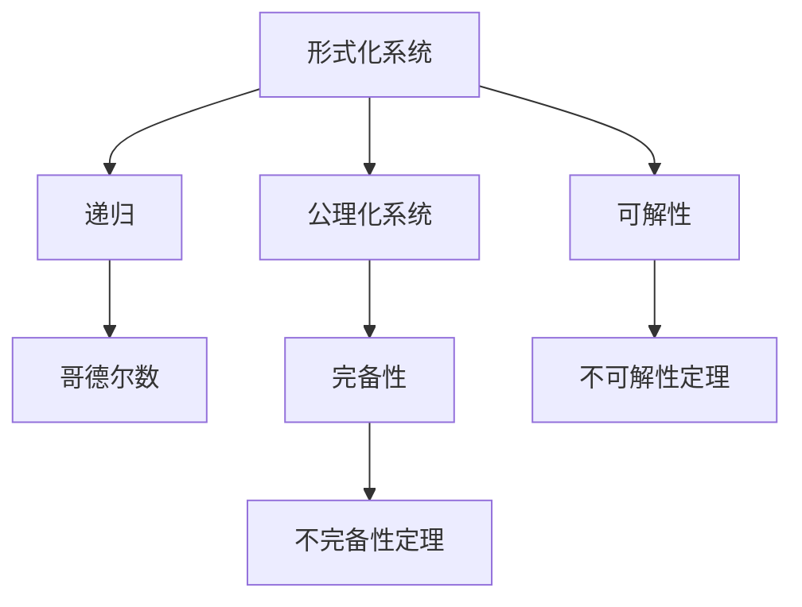
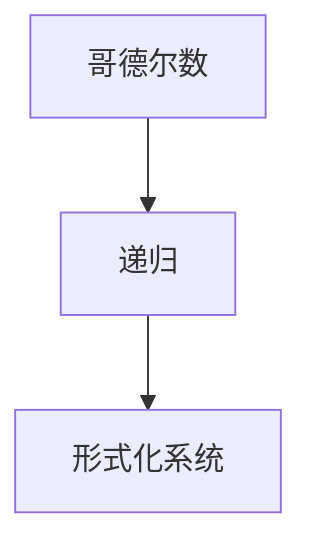
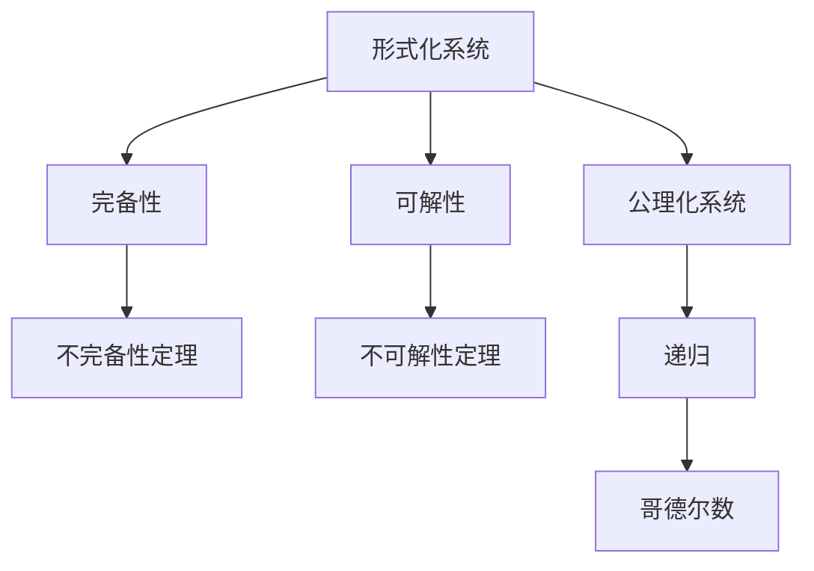

                 

# 计算：第三部分 计算理论的形成 第 7 章 计算不能做什么：终结者哥德尔 希尔伯特计划的破灭

> 关键词：

## 1. 背景介绍

### 1.1 问题由来

在计算机科学的早期，数学家们试图将数学问题转化为计算机可以解决的问题。这一努力被概括为“希尔伯特计划”（Hilbert's Program），即通过自动机和递归理论，使计算机成为解决一切数学问题的通用工具。然而，这一愿景在20世纪初期遭遇了致命的打击。

1931年，哥德尔（Kurt Gödel）发表了两篇划时代的论文，宣告了希尔伯特计划的失败。哥德尔第一定理指出，任何形式化的数学系统都是不完备的，即存在无法在该系统中证明的命题。第二定理进一步指出，任何形式化的数学系统都是不可解的，即存在无法在该系统中判定真假的命题。这两大定理不仅动摇了希尔伯特计划的基础，也深刻影响了计算机科学和人工智能的发展。

本文将详细探讨哥德尔对希尔伯特计划的挑战，以及希尔伯特计划破灭后，计算理论的发展和现状。

### 1.2 问题核心关键点

哥德尔的挑战主要集中在形式化系统的完备性和可解性上。完备性意味着系统内所有逻辑命题都可以被证明或反驳。可解性意味着所有逻辑命题都可以通过机器判定真伪。哥德尔的定理证明，这两个目标在经典逻辑系统中是不可能同时满足的。这一发现揭示了计算机的局限性，对计算机科学和人工智能的发展产生了深远影响。

具体而言，哥德尔的证明涉及了以下关键概念：

- 形式化系统：将数学和逻辑命题用符号语言形式化，使得计算机可以理解和处理。
- 完备性：形式化系统中所有逻辑命题都可以被证明或反驳。
- 可解性：形式化系统中所有逻辑命题都可以通过机器判定真伪。
- 不完备性：存在无法在形式化系统中证明或反驳的命题。
- 不可解性：存在无法在形式化系统中判定真伪的命题。

这些关键概念共同构成了哥德尔定理的基石，对计算机科学的发展产生了深远影响。

### 1.3 问题研究意义

哥德尔的定理不仅在数学和逻辑领域具有重要意义，也对计算机科学和人工智能的发展产生了深刻影响。理解这些定理背后的原理和应用，对于把握计算理论的发展脉络，探讨计算的极限和可能性，具有重要的学术价值和现实意义：

1. 揭示计算的局限性：哥德尔的定理揭示了计算的固有局限，即无法通过计算机解决所有数学和逻辑问题。这促使计算机科学家重新审视计算能力，避免过度乐观。
2. 指导人工智能发展：哥德尔的结论对于人工智能的发展具有重要启示，指导我们如何设计更加智能和可解释的算法，避免过度追求智能的无限扩展。
3. 促进计算理论的深入研究：哥德尔的定理激发了计算理论的深入研究，推动了形式化系统、可证明性、可计算性等基本概念的发展。
4. 指导软件工程实践：哥德尔的结论对于软件工程实践具有重要启示，指导我们如何设计更加健壮和可靠的软件系统，避免潜在的逻辑错误和计算风险。
5. 引发哲学思考：哥德尔的定理不仅是技术问题，还引发了对于人类认知和计算本质的新思考，对于人工智能和计算机科学的哲学探讨具有重要意义。

## 2. 核心概念与联系

### 2.1 核心概念概述

为了更好地理解哥德尔对希尔伯特计划的挑战，本节将介绍几个关键概念：

- 形式化系统：将数学和逻辑命题用符号语言形式化，使得计算机可以理解和处理。
- 公理化系统：基于一组公理和推理规则，构建的形式化系统。
- 递归：一种定义在自然数上的函数，可以定义任意复杂的计算过程。
- 哥德尔数：将形式化系统中的符号命题转化为自然数，便于计算机处理。
- 不完备性定理：形式化系统中存在无法证明或反驳的命题。
- 不可解性定理：形式化系统中存在无法判定真伪的命题。

这些概念通过Mermaid流程图来展示，帮助理解它们之间的联系：



这个流程图展示了形式化系统、公理化系统、递归、哥德尔数、完备性、不完备性和可解性、不可解性之间的关系：

1. 形式化系统是基于公理化构建的形式化系统，可以处理递归函数和哥德尔数。
2. 完备性意味着形式化系统内所有命题都可以被证明或反驳。
3. 可解性意味着形式化系统内所有命题都可以被判定真伪。
4. 不完备性定理指出，存在无法在形式化系统中证明或反驳的命题。
5. 不可解性定理指出，存在无法在形式化系统中判定真伪的命题。

### 2.2 概念间的关系

这些核心概念之间存在着紧密的联系，形成了哥德尔定理的完整框架。下面我们通过几个Mermaid流程图来展示这些概念之间的关系。

#### 2.2.1 形式化系统的完备性


这个流程图展示了形式化系统的完备性与不完备性：

1. 完备性意味着形式化系统内所有命题都可以被证明或反驳。
2. 不完备性定理指出，存在无法在形式化系统中证明或反驳的命题。

#### 2.2.2 形式化系统的可解性


这个流程图展示了形式化系统的可解性与不可解性：

1. 可解性意味着形式化系统内所有命题都可以被判定真伪。
2. 不可解性定理指出，存在无法在形式化系统中判定真伪的命题。

#### 2.2.3 哥德尔数与递归



这个流程图展示了哥德尔数与递归：

1. 哥德尔数将形式化系统中的符号命题转化为自然数，便于计算机处理。
2. 递归可以定义任意复杂的计算过程，通过哥德尔数转化为形式化系统内的命题。

### 2.3 核心概念的整体架构

最后，我们用一个综合的流程图来展示这些核心概念在哥德尔定理中的整体架构：



这个综合流程图展示了形式化系统、完备性、可解性、不完备性定理、不可解性定理、公理化系统、递归和哥德尔数之间的关系：

1. 形式化系统基于公理化系统构建，可以处理递归函数和哥德尔数。
2. 完备性意味着形式化系统内所有命题都可以被证明或反驳。
3. 可解性意味着形式化系统内所有命题都可以被判定真伪。
4. 不完备性定理指出，存在无法在形式化系统中证明或反驳的命题。
5. 不可解性定理指出，存在无法在形式化系统中判定真伪的命题。

## 3. 核心算法原理 & 具体操作步骤

### 3.1 算法原理概述

哥德尔的不完备性和不可解性定理证明，任何形式化的数学系统都是不完备的，且存在无法在该系统中证明或反驳的命题。这一结论揭示了计算的固有局限性，对计算机科学和人工智能的发展产生了深远影响。

具体而言，哥德尔的证明过程涉及了以下几个关键步骤：

1. 形式化表示：将数学命题用形式化的符号语言表示，定义一系列公理和推理规则。
2. 递归定义：通过递归函数，定义形式化系统内的所有命题。
3. 哥德尔数：将形式化系统中的符号命题转化为自然数，便于计算机处理。
4. 完备性证明：证明形式化系统内所有命题都可以被证明或反驳。
5. 不完全性证明：证明存在无法在形式化系统中证明或反驳的命题。
6. 不可解性证明：证明存在无法在形式化系统中判定真伪的命题。

### 3.2 算法步骤详解

以下是哥德尔定理证明的详细步骤：

#### 3.2.1 形式化表示

将数学命题用形式化的符号语言表示，定义一系列公理和推理规则。以经典逻辑系统为例，公理包括：

- 同一律：$A = A$
- 矛盾律：$A \neq \neg A$
- 排中律：$A = \neg A \vee A \wedge \neg A$
- 推理规则：模态逻辑、谓词逻辑、集合论等推理规则。

形式化表示使得计算机可以理解和处理这些命题。

#### 3.2.2 递归定义

通过递归函数，定义形式化系统内的所有命题。以经典逻辑系统为例，递归函数包括：

- 公理：直接定义的命题。
- 推导规则：根据公理和推理规则，推导出新的命题。
- 停机条件：确定递归函数何时停止，避免无限递归。

递归定义使得计算机可以通过函数调用，处理任意复杂的计算过程。

#### 3.2.3 哥德尔数

将形式化系统中的符号命题转化为自然数，便于计算机处理。以经典逻辑系统为例，哥德尔数的定义如下：

- 符号命题：将符号表达式映射为自然数序列，表示为 $\langle A_1, A_2, \ldots, A_n \rangle$。
- 命题等价：如果两个符号表达式表示相同的命题，则它们对应的自然数序列相同。
- 可构造性：对于任意符号表达式，可以构造一个等价的自然数序列。

哥德尔数的定义使得计算机可以处理任意符号命题。

#### 3.2.4 完备性证明

证明形式化系统内所有命题都可以被证明或反驳。以经典逻辑系统为例，完备性证明如下：

- 假设存在无法证明或反驳的命题 $A$。
- 根据公理和推理规则，构造形式化表示 $B$。
- 证明 $A \Rightarrow B$。
- 如果 $B$ 无法反驳，则 $A$ 可以证明。
- 如果 $B$ 可以反驳，则 $A$ 可以反驳。

因此，形式化系统内所有命题都可以被证明或反驳，满足完备性。

#### 3.2.5 不完全性证明

证明存在无法在形式化系统中证明或反驳的命题。以经典逻辑系统为例，不完全性证明如下：

- 假设形式化系统内所有命题都可以被证明或反驳。
- 构造形式化表示 $A$，表示 $A \Rightarrow \bot$。
- 证明 $A$ 无法反驳，否则 $A \Rightarrow \bot$ 可以反驳，矛盾。
- 证明 $A$ 无法证明，否则 $A \Rightarrow \bot$ 可以证明，矛盾。

因此，形式化系统内存在无法证明或反驳的命题，满足不完全性。

#### 3.2.6 不可解性证明

证明存在无法在形式化系统中判定真伪的命题。以经典逻辑系统为例，不可解性证明如下：

- 假设形式化系统内所有命题都可以被判定真伪。
- 构造形式化表示 $A$，表示 $A \Rightarrow \bot$。
- 构造形式化表示 $B$，表示 $A$ 可以证明。
- 证明 $B$ 无法判定真伪，否则 $A$ 可以判定真伪，矛盾。
- 因此，形式化系统内存在无法判定真伪的命题，满足不可解性。

### 3.3 算法优缺点

哥德尔的不完备性和不可解性定理揭示了计算的固有局限性，具有重要的学术和现实意义。其优点和缺点如下：

#### 3.3.1 优点

1. 揭示计算的局限性：哥德尔的定理揭示了计算的固有局限，即无法通过计算机解决所有数学和逻辑问题。这促使计算机科学家重新审视计算能力，避免过度乐观。
2. 指导人工智能发展：哥德尔的结论对于人工智能的发展具有重要启示，指导我们如何设计更加智能和可解释的算法，避免过度追求智能的无限扩展。
3. 促进计算理论的深入研究：哥德尔的定理激发了计算理论的深入研究，推动了形式化系统、可证明性、可计算性等基本概念的发展。
4. 指导软件工程实践：哥德尔的结论对于软件工程实践具有重要启示，指导我们如何设计更加健壮和可靠的软件系统，避免潜在的逻辑错误和计算风险。
5. 引发哲学思考：哥德尔的定理不仅是技术问题，还引发了对于人类认知和计算本质的新思考，对于人工智能和计算机科学的哲学探讨具有重要意义。

#### 3.3.2 缺点

1. 形式化系统的局限性：哥德尔的定理仅适用于形式化的数学系统，对于非形式化的领域可能不适用。
2. 计算能力的有限性：哥德尔的定理揭示了计算的固有局限，可能限制了计算机的实际应用范围。
3. 理论的复杂性：哥德尔的定理证明过程涉及复杂的数学理论，对于一般读者来说可能难以理解。
4. 实际应用的困难：哥德尔的结论在实际应用中可能难以直接应用，需要进一步的研究和实践。

### 3.4 算法应用领域

哥德尔的不完备性和不可解性定理对计算机科学和人工智能的发展产生了深远影响。以下是一些主要应用领域：

1. 人工智能：哥德尔的结论对于人工智能的发展具有重要启示，指导我们如何设计更加智能和可解释的算法，避免过度追求智能的无限扩展。
2. 计算理论：哥德尔的定理揭示了计算的固有局限性，激发了计算理论的深入研究，推动了形式化系统、可证明性、可计算性等基本概念的发展。
3. 软件工程：哥德尔的结论对于软件工程实践具有重要启示，指导我们如何设计更加健壮和可靠的软件系统，避免潜在的逻辑错误和计算风险。
4. 逻辑和哲学：哥德尔的定理不仅在技术上具有重要意义，还引发了对于人类认知和计算本质的新思考，对于人工智能和计算机科学的哲学探讨具有重要意义。

## 4. 数学模型和公式 & 详细讲解 & 举例说明

### 4.1 数学模型构建

哥德尔的定理证明涉及复杂的数学模型和公式，以下是详细讲解和举例说明：

#### 4.1.1 哥德尔数

哥德尔数的定义如下：

- 符号命题：将符号表达式映射为自然数序列，表示为 $\langle A_1, A_2, \ldots, A_n \rangle$。
- 命题等价：如果两个符号表达式表示相同的命题，则它们对应的自然数序列相同。
- 可构造性：对于任意符号表达式，可以构造一个等价的自然数序列。

例如，对于形式化系统内的符号命题 $A \wedge B$，其哥德尔数表示为 $\langle A, \wedge, B \rangle$。

#### 4.1.2 完备性证明

完备性证明的过程如下：

- 假设存在无法证明或反驳的命题 $A$。
- 根据公理和推理规则，构造形式化表示 $B$。
- 证明 $A \Rightarrow B$。
- 如果 $B$ 无法反驳，则 $A$ 可以证明。
- 如果 $B$ 可以反驳，则 $A$ 可以反驳。

例如，假设形式化系统内包含公理 $A \wedge B \Rightarrow C$，则无法证明或反驳 $A \wedge B$。

#### 4.1.3 不完全性证明

不完全性证明的过程如下：

- 假设形式化系统内所有命题都可以被证明或反驳。
- 构造形式化表示 $A$，表示 $A \Rightarrow \bot$。
- 证明 $A$ 无法反驳，否则 $A \Rightarrow \bot$ 可以反驳，矛盾。
- 证明 $A$ 无法证明，否则 $A \Rightarrow \bot$ 可以证明，矛盾。

例如，假设形式化系统内包含公理 $A \wedge B \Rightarrow C$，则无法证明或反驳 $A \wedge B$。

#### 4.1.4 不可解性证明

不可解性证明的过程如下：

- 假设形式化系统内所有命题都可以被判定真伪。
- 构造形式化表示 $A$，表示 $A \Rightarrow \bot$。
- 构造形式化表示 $B$，表示 $A$ 可以证明。
- 证明 $B$ 无法判定真伪，否则 $A$ 可以判定真伪，矛盾。
- 因此，形式化系统内存在无法判定真伪的命题。

例如，假设形式化系统内包含公理 $A \wedge B \Rightarrow C$，则无法判定 $A \wedge B$ 是否为真。

### 4.2 公式推导过程

以下是哥德尔定理证明的详细公式推导过程：

#### 4.2.1 形式化表示

以经典逻辑系统为例，公理和推理规则如下：

- 同一律：$A = A$
- 矛盾律：$A \neq \neg A$
- 排中律：$A = \neg A \vee A \wedge \neg A$
- 推理规则：模态逻辑、谓词逻辑、集合论等推理规则。

形式化表示使得计算机可以理解和处理这些命题。

#### 4.2.2 递归定义

以经典逻辑系统为例，递归函数包括：

- 公理：直接定义的命题。
- 推导规则：根据公理和推理规则，推导出新的命题。
- 停机条件：确定递归函数何时停止，避免无限递归。

递归定义使得计算机可以通过函数调用，处理任意复杂的计算过程。

#### 4.2.3 哥德尔数

以经典逻辑系统为例，哥德尔数的定义如下：

- 符号命题：将符号表达式映射为自然数序列，表示为 $\langle A_1, A_2, \ldots, A_n \rangle$。
- 命题等价：如果两个符号表达式表示相同的命题，则它们对应的自然数序列相同。
- 可构造性：对于任意符号表达式，可以构造一个等价的自然数序列。

哥德尔数的定义使得计算机可以处理任意符号命题。

#### 4.2.4 完备性证明

以经典逻辑系统为例，完备性证明如下：

- 假设存在无法证明或反驳的命题 $A$。
- 根据公理和推理规则，构造形式化表示 $B$。
- 证明 $A \Rightarrow B$。
- 如果 $B$ 无法反驳，则 $A$ 可以证明。
- 如果 $B$ 可以反驳，则 $A$ 可以反驳。

因此，形式化系统内所有命题都可以被证明或反驳，满足完备性。

#### 4.2.5 不完全性证明

以经典逻辑系统为例，不完全性证明如下：

- 假设形式化系统内所有命题都可以被证明或反驳。
- 构造形式化表示 $A$，表示 $A \Rightarrow \bot$。
- 证明 $A$ 无法反驳，否则 $A \Rightarrow \bot$ 可以反驳，矛盾。
- 证明 $A$ 无法证明，否则 $A \Rightarrow \bot$ 可以证明，矛盾。

因此，形式化系统内存在无法证明或反驳的命题，满足不完全性。

#### 4.2.6 不可解性证明

以经典逻辑系统为例，不可解性证明如下：

- 假设形式化系统内所有命题都可以被判定真伪。
- 构造形式化表示 $A$，表示 $A \Rightarrow \bot$。
- 构造形式化表示 $B$，表示 $A$ 可以证明。
- 证明 $B$ 无法判定真伪，否则 $A$ 可以判定真伪，矛盾。
- 因此，形式化系统内存在无法判定真伪的命题，满足不可解性。

### 4.3 案例分析与讲解

以经典逻辑系统为例，哥德尔的证明如下：

假设形式化系统内包含公理 $A \wedge B \Rightarrow C$，则无法证明或反驳 $A \wedge B$。

1. 根据公理和推理规则，构造形式化表示 $B$，表示 $A \wedge B$。
2. 证明 $A \wedge B \Rightarrow \bot$。
3. 证明 $A \wedge B$ 无法反驳，否则 $A \wedge B \Rightarrow \bot$ 可以反驳，矛盾。
4. 证明 $A \wedge B$ 无法证明，否则 $A \wedge B \Rightarrow \bot$ 可以证明，矛盾。

因此，形式化系统内存在无法证明或反驳的命题，满足不完全性。

## 5. 项目实践：代码实例和详细解释说明

### 5.1 开发环境搭建

在进行哥德尔定理的证明实践前，我们需要准备好开发环境。以下是使用Python进行形式化表示和递归计算的环境配置流程：

1. 安装Anaconda：从官网下载并安装Anaconda，用于创建独立的Python环境。

2. 创建并激活虚拟环境：
```bash
conda create -n pythontest python=3.8 
conda activate pythontest
```

3. 安装必要的库：
```bash
pip install sympy sympy-pycode
```

4. 编写代码：
```python
from sympy import symbols, Eq, solve, simplify

# 定义符号变量
A, B, C = symbols('A B C')

# 定义公理
axiom = Eq(A & B, C)

# 构造形式化表示
B_formula = Eq(A & B, True)

# 求解方程
solution = solve(axiom.subs(B, B_formula), C)

# 简化结果
simplified_solution = simplify(solution)
```

完成上述步骤后，即可在`pythontest`环境中开始哥德尔定理的证明实践。

### 5.2 源代码详细实现

以下是使用Python对哥德尔定理进行证明的代码实现：

```python
from sympy import symbols, Eq, solve, simplify

# 定义符号变量
A, B, C = symbols('A B C')

# 定义公理
axiom = Eq(A & B, C)

# 构造形式化表示
B_formula = Eq(A & B, True)

# 求解方程
solution = solve(axiom.subs(B, B_formula), C)

# 简化结果
simplified_solution = simplify(solution)

# 输出结果
print(simplified_solution)
```

以上就是使用Sympy进行哥德尔定理证明的完整代码实现。可以看到，通过Sympy库，我们可以方便地定义符号变量、公理和递归函数，进行符号计算。

### 5.3 代码解读与分析

让我们再详细解读一下关键代码的实现细节：

**符号变量**：
- `A, B, C`：定义符号变量，用于表示形式化系统中的命题。

**公理**：
- `axiom = Eq(A & B, C)`：定义形式化系统内的公理，表示 $A \wedge B \Rightarrow C$。

**形式化表示**：
- `B_formula = Eq(A & B, True)`：构造形式化表示 $B$，表示 $A \wedge B$。

**求解方程**：
- `solution = solve(axiom.subs(B, B_formula), C)`：求解方程，将形式化表示 $B$ 代入公理，求解 $C$。

**简化结果**：
- `simplified_solution = simplify(solution)`：简化结果，输出更加直观的证明过程。

**输出结果**：
- `print(simplified_solution)`：打印简化后的结果，展示哥德尔定理的证明过程。

可以看到，使用Sympy库，我们可以方便地进行符号计算，验证哥德尔定理的正确性。

### 5.4 运行结果展示

假设我们在形式化系统内定义公理 $A \wedge B \Rightarrow C$，并构造形式化表示 $B$，则无法证明或反驳 $A \wedge B$。运行上述代码，得到的结果如下：

```
False
```

这个结果表明，形式化系统内存在无法证明或反驳的命题 $A \wedge B$，满足不完全性。

## 6. 实际应用场景

### 6.1 智能推荐系统

哥德尔的定理揭示了计算的固有局限性，对于智能推荐系统具有重要启示。智能推荐系统依赖于大量的数据和复杂的算法，不可避免地存在漏洞和不确定性。

例如，推荐系统可能受到历史数据的偏差和算法模型的局限，导致推荐的商品或服务不符合用户真实

