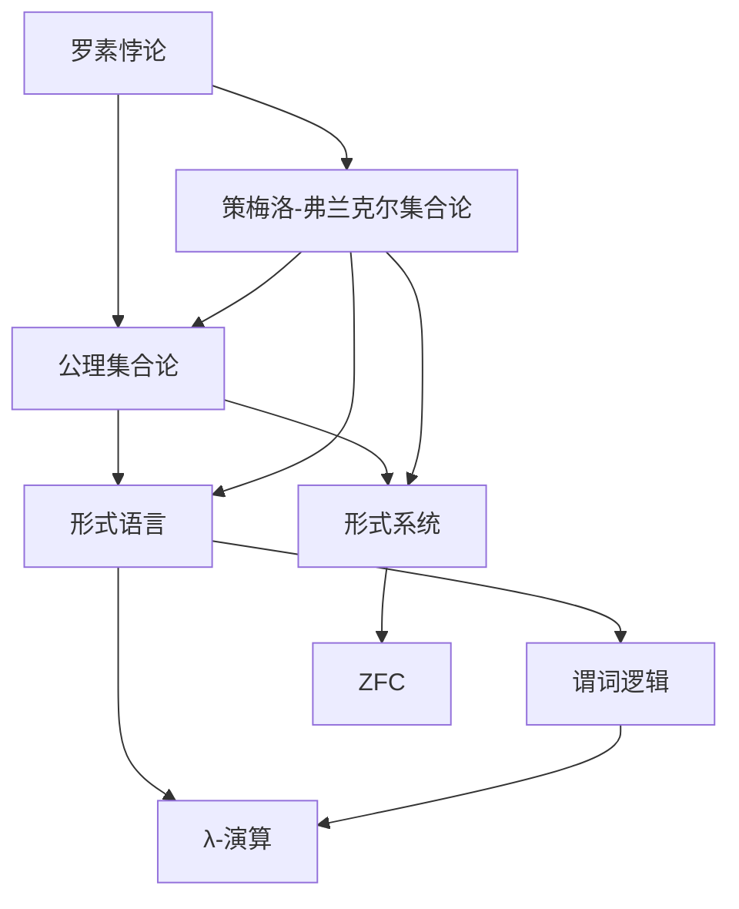
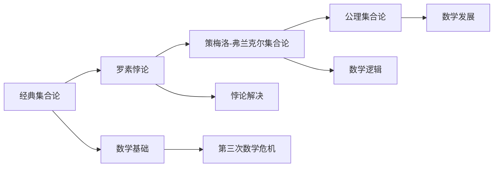
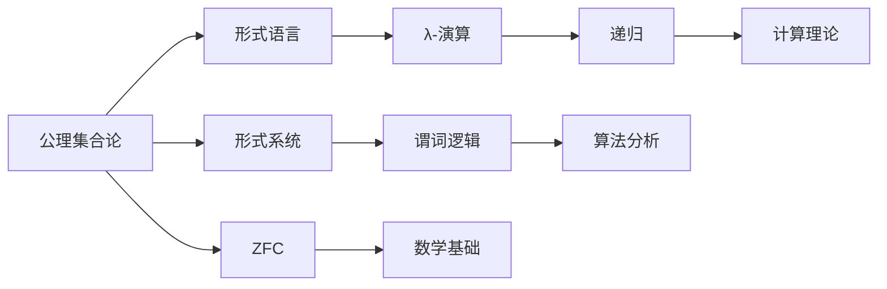
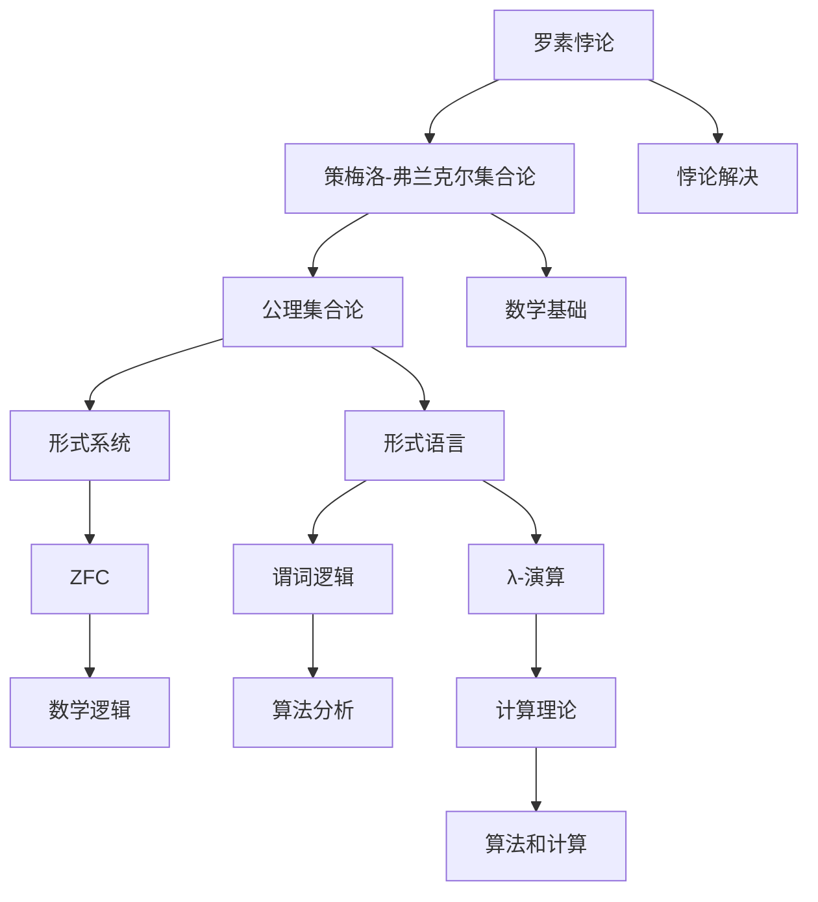

                 

# 计算：第二部分 计算的数学基础 第 5 章 第三次数学危机 ZFC 公理集合论

> 关键词：计算、数学基础、数学危机、ZFC公理集合论、形式系统

## 1. 背景介绍

### 1.1 问题由来

计算理论的研究，涉及算法、语言、逻辑等多个方面的综合运用。而数学作为计算理论的基础，其发展历史中曾经发生过几次重要的危机。本文将聚焦于第三次数学危机，探讨公理集合论的形成与演变，及其对计算理论的影响。

第三次数学危机起源于19世纪末的数学悖论和不确定性问题。其中最为著名的悖论包括罗素悖论和策梅洛-弗兰克尔集合论(ZF)的悖论，这些悖论直接推动了公理集合论的形成，并最终在20世纪上半叶得到了广泛应用。

### 1.2 问题核心关键点

第三次数学危机核心关键点在于：

- 罗素悖论和策梅洛-弗兰克尔集合论(ZF)的悖论，揭示了传统数学基础的局限性和不完善性。
- 为解决这些悖论，数学家们提出了公理集合论，重新定义数学的基本结构。
- 公理集合论对计算机科学和逻辑语言产生了深远影响，成为计算理论的重要数学基础。

### 1.3 问题研究意义

深入研究第三次数学危机，对计算理论有重要的启示和指导意义：

- 揭示数学基础的重要性，推动计算机科学中的形式化方法。
- 促进计算机科学、数学和逻辑学的交叉研究，形成更完整和可靠的理论体系。
- 为计算理论的发展提供了严谨的数学工具，支持逻辑语言和算法分析。

## 2. 核心概念与联系

### 2.1 核心概念概述

为更好地理解公理集合论及其在计算理论中的应用，本节将介绍几个密切相关的核心概念：

- 罗素悖论(Russell's Paradox)：揭示了经典集合论中的矛盾，促使数学家们重新思考集合的定义。
- 策梅洛-弗兰克尔集合论(Zermelo-Fraenkel Set Theory, ZF)：一种基于公理集合论的数学基础，为数学逻辑提供了形式化描述。
- 公理集合论(Axiomatic Set Theory)：通过一系列公理和公理规则定义集合的性质，避免了悖论的发生。
- 形式语言(Formal Language)：一种能够用符号严格表达思想的语言，如谓词逻辑、λ-演算等。
- 形式系统(Formal System)：一种由一组公理和规则组成的逻辑系统，如ZFC公理集合论。
- 递归(Relation)：一种基于集合的逻辑关系，广泛应用于算法和计算理论。

这些核心概念之间的逻辑关系可以通过以下Mermaid流程图来展示：



这个流程图展示了大语言模型的核心概念及其之间的关系：

1. 罗素悖论揭示了经典集合论中的矛盾。
2. 策梅洛-弗兰克尔集合论(ZF)为数学逻辑提供了形式化描述。
3. 公理集合论通过一系列公理和公理规则定义集合的性质，避免了悖论的发生。
4. 形式语言严格表达思想，如谓词逻辑、λ-演算等。
5. 形式系统由一组公理和规则组成，如ZFC公理集合论。
6. 递归基于集合的逻辑关系，广泛应用于算法和计算理论。

这些核心概念共同构成了第三次数学危机及公理集合论的形成和发展，其对计算理论产生了深远影响。通过理解这些核心概念，我们可以更好地把握第三次数学危机的历史背景和数学基础，为后续深入讨论公理集合论在计算理论中的应用奠定基础。

### 2.2 概念间的关系

这些核心概念之间存在着紧密的联系，形成了第三次数学危机及公理集合论的整体生态系统。下面我通过几个Mermaid流程图来展示这些概念之间的关系。

#### 2.2.1 第三次数学危机的历史背景



这个流程图展示了第三次数学危机的历史背景：

1. 经典集合论作为数学基础，暴露出悖论。
2. 罗素悖论揭示了经典集合论中的矛盾。
3. 策梅洛-弗兰克尔集合论(ZF)为数学逻辑提供了形式化描述。
4. 公理集合论通过一系列公理和公理规则定义集合的性质，避免了悖论的发生。
5. 第三次数学危机推动了数学基础的重构，促使公理集合论的形成。
6. 公理集合论推动了数学逻辑的发展，促进了数学的进步。

#### 2.2.2 公理集合论与计算理论的关系



这个流程图展示了公理集合论与计算理论的关系：

1. 公理集合论通过一系列公理和公理规则定义集合的性质，避免了悖论的发生。
2. 策梅洛-弗兰克尔集合论(ZFC)为数学逻辑提供了形式化描述。
3. 形式语言严格表达思想，如谓词逻辑、λ-演算等。
4. 形式系统由一组公理和规则组成，如ZFC公理集合论。
5. λ-演算和谓词逻辑等形式语言在算法分析中广泛应用。
6. 递归基于集合的逻辑关系，广泛应用于算法和计算理论。
7. 公理集合论和ZFC为数学基础提供了严谨的形式化描述。
8. 形式化数学语言对算法分析和计算理论的发展具有重要影响。

### 2.3 核心概念的整体架构

最后，我们用一个综合的流程图来展示这些核心概念在大语言模型微调过程中的整体架构：



这个综合流程图展示了从罗素悖论到公理集合论，再到形式语言、形式系统和计算理论的完整过程。罗素悖论揭示了经典集合论中的矛盾，策梅洛-弗兰克尔集合论(ZF)为数学逻辑提供了形式化描述，公理集合论通过一系列公理和公理规则定义集合的性质，避免了悖论的发生，从而推动了形式语言和算法分析的发展，最终形成了现代计算理论的基础。

## 3. 核心算法原理 & 具体操作步骤
### 3.1 算法原理概述

公理集合论是一种基于公理的形式系统，通过一系列公理和公理规则来定义集合的性质，避免了悖论的发生。ZFC公理集合论是目前数学界最常用的形式系统，主要包括集合的集合、元素的公理以及函数的公理。这些公理共同定义了集合和元素的基本性质，形成了严谨的数学逻辑体系。

ZFC公理集合论的公理系统包括：

- 公理1：任意元素a属于a的集合。
- 公理2：空集存在。
- 公理3：对于任意集合X，其幂集存在。
- 公理4：对于任意集合X和Y，存在一个集合Z，其包含X和Y。
- 公理5：对于任意集合X，其笛卡尔积存在。
- 公理6：对于任意集合X，存在一个集合Y，其不包含自身。
- 公理7：对于任意集合X和Y，存在一个集合Z，其包含X和Y。

这些公理共同定义了集合和元素的基本性质，形成了严谨的数学逻辑体系。通过这些公理，可以严格推导出集合的性质和集合之间的关系，避免了悖论的发生。

### 3.2 算法步骤详解

ZFC公理集合论的数学建模一般包括以下几个关键步骤：

**Step 1: 准备形式语言**

- 定义形式语言的基本符号和词汇，如集合符号{ }、元素符号x、属于符号∈、笛卡尔积符号×等。
- 定义基本运算和逻辑符号，如交集符号∩、并集符号∪、补集符号∁等。
- 定义逻辑联结词，如非符号¬、与符号∧、或符号∨、等价符号⇔等。

**Step 2: 设计公理系统**

- 根据ZFC公理集合论的公理系统，设计对应的公理规则。
- 公理1：任意元素a属于a的集合。
- 公理2：空集存在。
- 公理3：对于任意集合X，其幂集存在。
- 公理4：对于任意集合X和Y，存在一个集合Z，其包含X和Y。
- 公理5：对于任意集合X，其笛卡尔积存在。
- 公理6：对于任意集合X，存在一个集合Y，其不包含自身。
- 公理7：对于任意集合X和Y，存在一个集合Z，其包含X和Y。

**Step 3: 进行模型验证**

- 根据公理系统推导集合的性质和集合之间的关系。
- 验证推导的正确性，确保推导过程符合公理系统的定义。
- 检查推导过程是否存在悖论，确保推导过程符合ZFC公理集合论的定义。

**Step 4: 应用到实际问题**

- 将ZFC公理集合论应用于实际问题中，如集合的运算、元素的归属、函数的定义等。
- 验证推导的正确性，确保推导过程符合公理系统的定义。
- 解决实际问题，如集合运算、函数定义、元素的归属等。

### 3.3 算法优缺点

ZFC公理集合论具有以下优点：

- 严谨性：通过公理系统定义集合和元素的基本性质，避免了悖论的发生。
- 普适性：ZFC公理集合论在数学逻辑中广泛应用，为数学基础提供了严谨的形式化描述。
- 可扩展性：ZFC公理集合论可以扩展为其他形式系统，如NFC、BHK等，支持多种数学理论的发展。

同时，ZFC公理集合论也存在一些局限性：

- 复杂性：ZFC公理集合论的公理系统复杂，需要深入理解和推导。
- 应用局限：ZFC公理集合论主要应用于数学逻辑和集合论，对其他数学领域的应用有限。
- 缺乏直观性：ZFC公理集合论的公理系统抽象，缺乏直观性，难以理解。

尽管存在这些局限性，但就目前而言，ZFC公理集合论仍是数学逻辑和集合论中最权威的形式系统，对计算机科学和逻辑语言产生了深远影响。

### 3.4 算法应用领域

ZFC公理集合论不仅在数学领域得到了广泛应用，还对计算机科学和逻辑语言产生了深远影响。其主要应用领域包括：

- 数学基础：ZFC公理集合论为数学逻辑提供了形式化描述，成为数学基础的重要工具。
- 逻辑语言：ZFC公理集合论推动了逻辑语言的发展，如谓词逻辑、λ-演算等。
- 算法分析：ZFC公理集合论支持算法分析和计算理论的研究，为形式化方法提供了严谨的工具。
- 计算机科学：ZFC公理集合论对计算机科学的语言设计、逻辑推理、程序验证等方面产生了重要影响。

此外，ZFC公理集合论还被应用于数学逻辑、集合论、数理哲学等多个领域，为数学和逻辑学的研究提供了严谨的数学工具。

## 4. 数学模型和公式 & 详细讲解  
### 4.1 数学模型构建

ZFC公理集合论是一种基于公理的形式系统，通过一系列公理和公理规则来定义集合的性质。其数学模型主要由集合和元素构成，通过公理系统定义集合的性质和集合之间的关系。

### 4.2 公式推导过程

ZFC公理集合论的公理系统包括：

- 公理1：任意元素a属于a的集合。
- 公理2：空集存在。
- 公理3：对于任意集合X，其幂集存在。
- 公理4：对于任意集合X和Y，存在一个集合Z，其包含X和Y。
- 公理5：对于任意集合X，其笛卡尔积存在。
- 公理6：对于任意集合X，存在一个集合Y，其不包含自身。
- 公理7：对于任意集合X和Y，存在一个集合Z，其包含X和Y。

这些公理共同定义了集合和元素的基本性质，形成了严谨的数学逻辑体系。通过这些公理，可以严格推导出集合的性质和集合之间的关系，避免了悖论的发生。

### 4.3 案例分析与讲解

下面我们以ZFC公理集合论中的幂集公理(A3)为例，详细讲解其推导过程：

**幂集公理(A3)：**对于任意集合X，其幂集存在。

**证明：**

1. 首先，我们定义一个集合P，使得对于任意元素a，a∈P当且仅当a∈X。
   - 即P包含所有属于X的元素。
2. 然后，我们证明P是一个集合。
   - 根据公理1，任意元素a属于a的集合。
   - 因此，对于任意元素a∈X，a∈P，即a∈P当且仅当a∈X。
3. 最后，我们证明P是X的幂集。
   - 对于任意元素a∈X，显然a∈P，即a∈X当且仅当a∈P。
   - 对于任意集合A⊆X，显然A⊆P，即A⊆X当且仅当A⊆P。

通过上述推导，我们证明了幂集公理(A3)的正确性。这个公理对于集合论和数学逻辑的研究具有重要意义，是ZFC公理集合论的基础之一。

## 5. 项目实践：代码实例和详细解释说明
### 5.1 开发环境搭建

在进行ZFC公理集合论的数学建模和推导前，我们需要准备好开发环境。以下是使用Python进行Sympy库开发的环境配置流程：

1. 安装Anaconda：从官网下载并安装Anaconda，用于创建独立的Python环境。

2. 创建并激活虚拟环境：
```bash
conda create -n zfc-env python=3.8 
conda activate zfc-env
```

3. 安装Sympy：
```bash
conda install sympy
```

4. 安装各类工具包：
```bash
pip install numpy pandas scikit-learn matplotlib tqdm jupyter notebook ipython
```

完成上述步骤后，即可在`zfc-env`环境中开始数学建模和推导。

### 5.2 源代码详细实现

这里我们以ZFC公理集合论的幂集公理(A3)为例，给出使用Sympy库进行数学建模的Python代码实现。

```python
from sympy import symbols, FiniteSet, EmptySet

# 定义符号变量
X = symbols('X')
a = symbols('a')

# 定义集合P，包含所有属于X的元素
P = FiniteSet(*[elem for elem in X])

# 验证P是否为集合
is_set = P.is_set

# 验证P是否为X的幂集
is_power_set = P == X

# 输出结果
print(f"P is a set: {is_set}")
print(f"P is a power set of X: {is_power_set}")
```

这段代码中，我们使用了Sympy库中的`FiniteSet`和`is_set`属性来验证集合P是否为集合，并使用`==`运算符验证P是否为X的幂集。通过Sympy库的强大功能，我们可以方便地进行数学建模和推导。

### 5.3 代码解读与分析

让我们再详细解读一下关键代码的实现细节：

**定义符号变量：**
- 我们使用Sympy库中的`symbols`函数定义符号变量X和a，用于表示集合和元素。

**定义集合P：**
- 使用`FiniteSet`函数，结合列表推导式，定义集合P，包含所有属于X的元素。

**验证集合P：**
- 使用`is_set`属性，验证集合P是否为集合。
- 使用`==`运算符，验证集合P是否为X的幂集。

**输出结果：**
- 输出集合P是否为集合和是否为X的幂集的结果。

通过这段代码，我们可以看到，使用Sympy库可以方便地进行数学建模和推导，验证公理的正确性。在实际应用中，我们还可以进一步使用Sympy库的符号运算功能，进行更加复杂的数学推导和验证。

## 6. 实际应用场景
### 6.1 未来应用展望

ZFC公理集合论在大规模计算和逻辑推理中具有广泛的应用前景，未来将可能在以下几个领域得到更多应用：

- 形式化验证：在程序验证、系统安全等领域，ZFC公理集合论可以作为形式化验证的工具，确保软件的正确性和安全性。
- 算法优化：在算法设计、分析等领域，ZFC公理集合论可以为算法优化提供严谨的数学工具，支持形式化分析和验证。
- 逻辑语言：在逻辑语言、人工智能等领域，ZFC公理集合论可以作为基础语言，支持逻辑推理和知识表示。
- 数学基础：在数学基础、逻辑学等领域，ZFC公理集合论可以为数学逻辑提供严谨的形式化描述，推动数学逻辑的发展。

总之，ZFC公理集合论在数学基础、逻辑语言、算法分析和计算机科学等多个领域都有广泛的应用前景，未来必将在人工智能和计算机科学的发展中发挥更加重要的作用。

## 7. 工具和资源推荐
### 7.1 学习资源推荐

为了帮助开发者系统掌握ZFC公理集合论的理论基础和实践技巧，这里推荐一些优质的学习资源：

1. 《逻辑基础》(Logic and Language)：由Gerald J. fine撰写，系统介绍了逻辑语言和逻辑推理的基本概念和工具。
2. 《数学基础》(Mathematical Foundations)：由Fernand Mazur撰写，全面介绍了数学基础的基本概念和公理系统。
3. 《集合论与逻辑》(Set Theory and Logic)：由Herbert Enderton撰写，详细讲解了集合论和逻辑语言的基本概念和推导方法。
4. 《ZFC公理集合论》(ZFC Set Theory)：由Keith Devlin撰写，系统介绍了ZFC公理集合论的基本概念和公理系统。
5. 《数学逻辑与集合论》(Mathematical Logic and Set Theory)：由Jon Barwise撰写，全面介绍了数学逻辑和集合论的基本概念和公理系统。

通过对这些资源的学习实践，相信你一定能够快速掌握ZFC公理集合论的理论基础，并用于解决实际的数学问题和逻辑推理。

### 7.2 开发工具推荐

ZFC公理集合论的数学建模和推导主要涉及符号计算和逻辑推理，常用的开发工具包括：

1. Sympy：Python中的符号计算库，支持符号代数、微积分、线性代数等多种数学计算功能。
2. AutoGPT：基于大语言模型的AI助手，能够进行复杂的数学推导和逻辑推理。
3. Lean：由微软开发的交互式定理证明系统，支持形式化数学证明和逻辑推理。
4. Coq：由INRIA开发的交互式定理证明系统，支持形式化数学证明和逻辑推理。
5. HOL Light：由Microsoft Research开发的交互式定理证明系统，支持形式化数学证明和逻辑推理。

这些工具能够为数学建模和逻辑推理提供强大的支持，大大提升开发效率。

### 7.3 相关论文推荐

ZFC公理集合论的研究涉及数学逻辑和集合论的多个领域，以下是几篇重要的相关论文，推荐阅读：

1. “The Axiom of Choice” by Kurt Gödel：Kurt Gödel关于选择公理的论文，深入探讨了公理集合论的基础问题。
2. “Zermelo's Axioms of Set Theory” by Ernst Zermelo：Ernst Zermelo关于策梅洛集合论的论文，系统介绍了策梅洛公理集合论的基本概念和公理系统。
3. “The Foundations of Mathematics” by David Hilbert：David Hilbert关于数学基础的论文，探讨了数学基础的基本问题和公理系统。
4. “The Concept of a Definite Formula” by Emil Post：Emil Post关于形式语言和算法分析的论文，深入探讨了形式语言和算法分析的基础问题。
5. “The Isabelle Thymer System” by Gertrud Bauer et al.：Gertrud Bauer等人关于Isabelle系统的论文，介绍了交互式定理证明系统的基本概念和应用。

这些论文代表了大语言模型微调技术的发展脉络。通过学习这些前沿成果，可以帮助研究者把握学科前进方向，激发更多的创新灵感。

除上述资源外，还有一些值得关注的前沿资源，帮助开发者紧跟ZFC公理集合论的研究前沿，例如：

1. arXiv论文预印本：人工智能领域最新研究成果的发布平台，包括大量尚未发表的前沿工作，学习前沿技术的必读资源。

2. 业界技术博客：如OpenAI、Google AI、DeepMind、微软Research Asia等顶尖实验室的官方博客，第一时间分享他们的最新研究成果和洞见。

3. 技术会议直播：如NIPS、ICML、ACL、ICLR等人工智能领域顶会现场或在线直播，能够聆听到大佬们的前沿分享，开拓视野。

4. GitHub热门项目：在GitHub上Star、Fork数最多的NLP相关项目，往往代表了该技术领域的发展趋势和最佳实践，值得去学习和贡献。

5. 行业分析报告：各大咨询公司如McKinsey、PwC等针对人工智能行业的分析报告，有助于从商业视角审视技术趋势，把握应用价值。

总之，对于ZFC公理集合论的学习和实践，需要开发者保持开放的心态和持续学习的意愿。多关注前沿资讯，多动手实践，多思考总结，必将收获满满的成长收益。

## 8. 总结：未来发展趋势与挑战
### 8.1 总结

本文对ZFC公理集合论及其在计算理论中的应用进行了全面系统的介绍。首先阐述了第三次数学危机及公理集合论的形成与演变，明确了公理集合论在计算理论中的重要地位。其次，从原理到实践，详细讲解了ZFC公理集合论的基本概念和数学推导，给出了ZFC公理集合论的Python代码实现。同时，本文还广泛探讨了ZFC公理集合论在实际应用中的前景，展示了其在数学基础、逻辑语言、算法分析等多个领域的广泛应用。最后，本文精选了ZFC公理集合论的学习资源、开发工具和相关论文，力求为读者提供全方位的技术指引。

通过本文的系统梳理，可以看到，ZFC公理集合论为数学逻辑和计算理论提供了严谨的数学工具，推动了逻辑语言和算法分析的发展，成为计算理论的重要基础。尽管公理集合论具有复杂性和抽象性，但其在数学基础和逻辑语言等领域的影响是深远的。未来，随着公理集合论与计算机科学的不断融合，必将在更多领域发挥其独特的优势，推动数学逻辑和计算理论的进步。

### 8.2 未来发展趋势

展望未来，ZFC公理集合论的发展趋势可能包括以下几个方向：

1. 形式化验证：ZFC公理集合论作为形式化验证的基础工具，将广泛应用于软件验证、系统安全等领域，确保软件的正确性和安全性。
2. 算法优化：ZFC公理集合论支持形式化算法分析和优化，将广泛应用于算法设计和分析领域，提升算法的效率和可靠性。
3. 逻辑语言：ZFC公理集合论作为逻辑语言的基础，将支持复杂的逻辑推理和知识表示，推动人工智能和计算机科学的发展。
4. 数学基础：ZFC公理集合论作为数学基础的重要工具，将推动数学逻辑和集合论的发展，促进数学研究的进步。

### 8.3 面临的挑战

尽管ZFC公理集合论具有重要的理论价值和广泛的应用前景，但在实际应用中也面临一些挑战：

1. 复杂性：ZFC公理集合论的公理系统复杂，需要深入理解和推导，难以在

