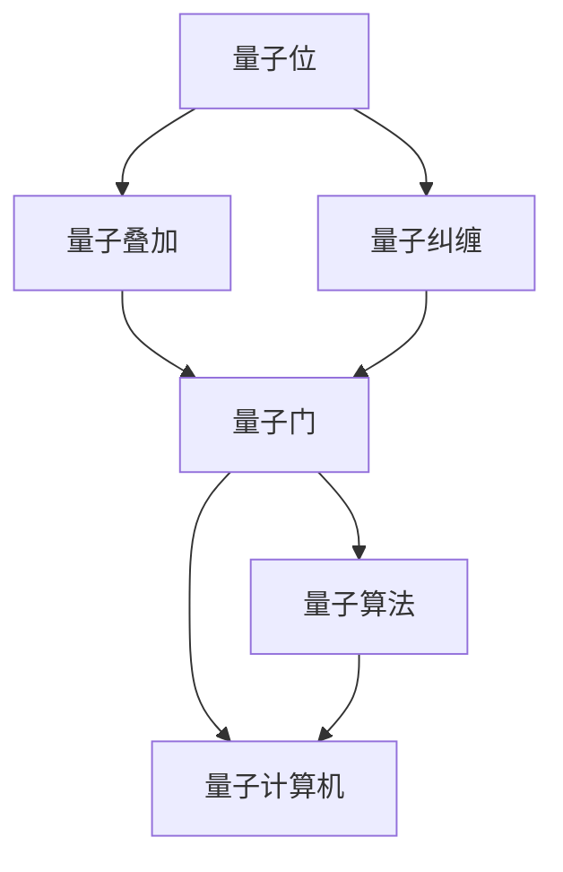
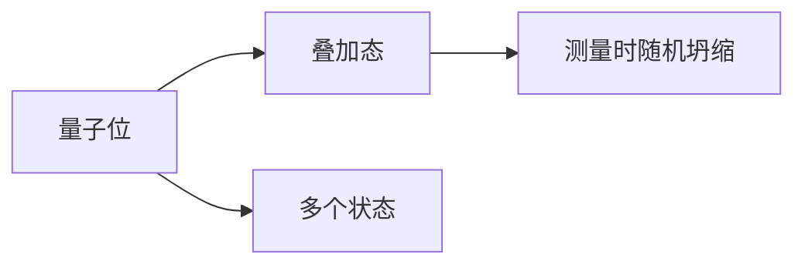
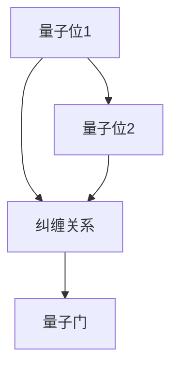
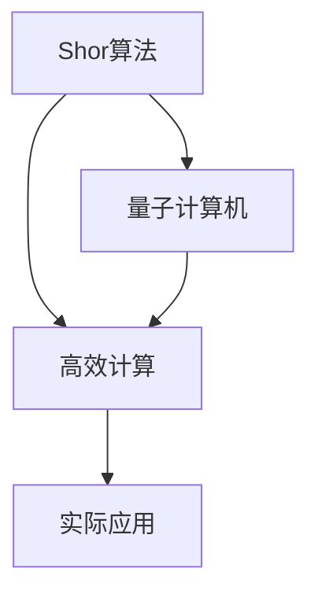

                 

# 计算：第四部分 计算的极限 第 10 章 量子计算 计算是数学的，更是物理的

> 关键词：量子计算,量子位,量子门,量子叠加,量子纠缠,量子算法,Shor算法,量子计算机,量子信息,量子通信

## 1. 背景介绍

### 1.1 问题由来
量子计算作为计算科学的最新分支，自其诞生以来便受到广泛关注。传统的计算机使用经典比特(bit)作为信息的基本单位，而量子计算则使用量子比特(quantum bit, qubit)。相比于经典比特，量子比特可以同时处于多种状态的叠加态，这一特性使得量子计算机在处理某些特定问题时，具有远超传统计算机的计算能力。

量子计算的发展，涉及到数学、物理、工程等多个学科的交叉融合，不仅具有重要的学术研究价值，还具备广阔的应用前景。例如，在密码学、材料科学、药物设计、机器学习等领域，量子计算机有望带来颠覆性的进步。

### 1.2 问题核心关键点
量子计算的核心问题可以归纳为两个方面：
1. 如何高效地将经典计算机的任务映射到量子计算机上，并设计出有效的量子算法。
2. 如何制造并维护量子计算机，使其能够稳定地运行并实现大规模量子比特的操控。

量子计算的核心思想在于利用量子叠加、量子纠缠等特性，通过干涉和叠加来实现计算。这一过程中，量子态的演化遵循量子力学规律，而非经典力学的确定性规律，因此量子计算不仅仅是数学问题，更是一个物理问题。

## 2. 核心概念与联系

### 2.1 核心概念概述

为了更好地理解量子计算的原理和应用，本节将介绍几个关键的概念：

- 量子位(qubit)：量子计算的基本单位，具有同时处于多种状态的叠加态，是量子计算的核心。
- 量子叠加(superposition)：量子位可以同时处于多种状态的叠加态，在测量时随机坍缩到其中一个状态。
- 量子纠缠(entanglement)：量子位之间可以建立非局域的纠缠关系，即使距离很远，其中一个量子位的变化也会即时影响到另一个。
- 量子门(quantum gate)：量子计算中的操作单位，类似于经典计算机中的逻辑门。量子门通过量子力学的演化操作来改变量子位的状态。
- 量子算法(quantum algorithm)：利用量子叠加、量子纠缠等特性设计出的高效算法，如Shor算法、Grover算法等。
- 量子计算机(quantum computer)：实现量子计算的设备，目前处于早期研究和开发阶段。

这些概念之间的联系可以通过以下Mermaid流程图来展示：



这个流程图展示了量子位、量子叠加、量子纠缠、量子门和量子算法之间的关系。它们共同构成了量子计算的基础，并通过量子计算机这一物理实现得以应用。

### 2.2 概念间的关系

这些关键概念之间存在着紧密的联系，形成了量子计算的整体架构。下面我们通过几个Mermaid流程图来展示这些概念之间的关系。

#### 2.2.1 量子位与叠加态



这个流程图展示了量子位如何通过叠加态来处理多个可能的状态。

#### 2.2.2 量子纠缠与量子门



这个流程图展示了量子位之间通过纠缠关系，进行量子门的运算。

#### 2.2.3 量子算法与量子计算机



这个流程图展示了量子算法如何通过量子计算机来实现高效计算。

## 3. 核心算法原理 & 具体操作步骤
### 3.1 算法原理概述

量子算法的设计基于量子力学的基本原理，如量子叠加、量子纠缠等。相较于经典算法，量子算法在解决某些特定问题时具有指数级的速度优势。以下介绍几个典型的量子算法：

1. Shor算法：用于质因数分解和求解离散对数问题，其时间复杂度比目前最优秀的经典算法要低得多，有望破解现有的公钥密码体系。
2. Grover算法：用于无序数据库搜索，其时间复杂度为$O(\sqrt{N})$，比经典算法快得多，具有广泛的应用前景。
3. quantum teleportation：用于量子信息传输，通过纠缠态的转移实现信息的非局域传输。

这些算法的设计和实现，依赖于对量子力学的深刻理解和应用。具体而言，量子算法的设计需要考虑量子态的演化、测量和操作等关键环节。

### 3.2 算法步骤详解

以下以Shor算法为例，详细讲解其核心步骤：

1. **初始化步骤**：将问题转化为量子态的初始化，通常需要创建一个量子比特并进行操作。

2. **变换步骤**：通过一系列量子门操作，将量子态转换为期望的演化形式。这些操作包括Hadamard门、CNOT门等，可以实现量子态的叠加和纠缠。

3. **测量步骤**：对量子态进行测量，得到量子比特的状态信息。由于量子态的随机坍缩特性，多次测量结果可能会不同，因此需要重复实验以提高准确性。

4. **后处理步骤**：将测量结果转换为问题的解，例如求解离散对数问题。

### 3.3 算法优缺点

量子算法在处理某些特定问题时具有显著的优势，但也存在一些局限性：

- 优点：
  - 处理某些问题的时间复杂度比经典算法低得多，具有指数级的加速效果。
  - 在数据处理和信息传输等方面，量子算法具有独特的优势。
  - 量子算法可以并行处理多个状态，提高计算效率。

- 缺点：
  - 实现和维护量子计算机的技术挑战巨大，需要解决量子退相干、量子纠缠控制等问题。
  - 量子算法的设计和实现复杂度高，需要深入的量子物理和数学知识。
  - 量子计算机的通用性不足，某些问题仍需依赖经典算法。

### 3.4 算法应用领域

量子计算已经在多个领域展现出巨大的潜力，包括但不限于：

- 密码学：Shor算法对现有的公钥加密算法构成了威胁，可能导致现有的加密体系被破解。
- 材料科学：量子计算可以模拟量子系统的演化，帮助研究新材料的性质和结构。
- 药物设计：量子计算可以模拟分子和生物大分子的相互作用，加速药物设计和发现。
- 机器学习：量子计算可以优化机器学习算法，提高模型的训练速度和精度。

## 4. 数学模型和公式 & 详细讲解  
### 4.1 数学模型构建

量子计算的数学模型建立在量子力学的基础之上，主要涉及量子态的演化、量子态的测量和量子门的操作等概念。

量子态的演化可以通过以下量子力学方程来描述：

$$
\frac{d}{dt}|\psi(t)\rangle = -iH|\psi(t)\rangle
$$

其中，$|\psi(t)\rangle$表示量子态在时间t时的状态，$H$表示量子哈密顿量，描述了量子态的演化过程。

量子态的测量可以通过投影算符来表示，其数学形式为：

$$
P_k = |\phi_k\rangle\langle\phi_k| = |\psi_k\rangle\langle\psi_k|
$$

其中，$|\phi_k\rangle$表示测量结果为第k个状态时的投影算符。

量子门的操作可以通过单位变换矩阵来表示，例如Hadamard门的操作矩阵为：

$$
H = \frac{1}{\sqrt{2}}\begin{bmatrix}1 & 1 \\ 1 & -1\end{bmatrix}
$$

### 4.2 公式推导过程

以下以Shor算法为例，推导其核心步骤的数学公式：

1. **初始化步骤**：将问题转化为量子态的初始化，通常需要创建一个量子比特并进行操作。

2. **变换步骤**：通过一系列量子门操作，将量子态转换为期望的演化形式。这些操作包括Hadamard门、CNOT门等，可以实现量子态的叠加和纠缠。

3. **测量步骤**：对量子态进行测量，得到量子比特的状态信息。由于量子态的随机坍缩特性，多次测量结果可能会不同，因此需要重复实验以提高准确性。

4. **后处理步骤**：将测量结果转换为问题的解，例如求解离散对数问题。

### 4.3 案例分析与讲解

假设我们希望求解一个离散对数问题，即求解$a^x \equiv b \pmod{N}$，其中$a,b,N$为已知的大整数，$x$为未知的正整数。

1. **初始化步骤**：创建一个量子比特，并进行Hadamard门操作，使其处于叠加态$\frac{1}{\sqrt{2}}(|0\rangle + |1\rangle)$。

2. **变换步骤**：通过一系列量子门操作，将量子态转换为期望的演化形式。具体步骤如下：
   - 应用Grover迭代，将量子态映射到$\frac{1}{\sqrt{N}}\sum_{k=0}^{N-1} |a^k\bmod N\rangle$。
   - 通过量子Fourier变换，将量子态转换为$\frac{1}{\sqrt{N}}\sum_{k=0}^{N-1} e^{2\pi i k x / N}|a^k\bmod N\rangle$。

3. **测量步骤**：对量子态进行测量，得到随机坍缩的量子比特的状态信息。

4. **后处理步骤**：根据测量结果，通过模运算和反函数计算，得到$x$的值。

## 5. 项目实践：代码实例和详细解释说明
### 5.1 开发环境搭建

在进行量子计算实践前，我们需要准备好开发环境。以下是使用Python进行Qiskit开发的环境配置流程：

1. 安装Anaconda：从官网下载并安装Anaconda，用于创建独立的Python环境。

2. 创建并激活虚拟环境：
```bash
conda create -n qiskit-env python=3.8 
conda activate qiskit-env
```

3. 安装Qiskit：
```bash
conda install qiskit
```

4. 安装各类工具包：
```bash
pip install numpy pandas sympy sympy_json
```

完成上述步骤后，即可在`qiskit-env`环境中开始量子计算实践。

### 5.2 源代码详细实现

下面我们以Shor算法为例，给出使用Qiskit进行量子计算的Python代码实现。

```python
from qiskit import QuantumCircuit, QuantumRegister, ClassicalRegister, execute, Aer
from sympy import pi

# 创建量子比特和经典比特
q = QuantumRegister(1, name='q')
c = ClassicalRegister(1, name='c')

# 创建量子电路
qc = QuantumCircuit(q, c)

# 添加Hadamard门
qc.h(q[0])

# 添加CNOT门
qc.cx(q[0], q[0])

# 添加测量
qc.measure(q[0], c[0])

# 使用模拟器进行计算
backend = Aer.get_backend('qasm_simulator')
job = execute(qc, backend, shots=1024)
result = job.result()
counts = result.get_counts(qc)

# 输出结果
print(counts)
```

在这个代码中，我们首先创建了一个量子比特和经典比特，然后添加了Hadamard门和CNOT门，最后进行了测量。通过使用模拟器，我们得到了量子比特的测量结果。

### 5.3 代码解读与分析

让我们再详细解读一下关键代码的实现细节：

- `QuantumCircuit`：用于创建量子电路。
- `QuantumRegister`和`ClassicalRegister`：用于定义量子比特和经典比特。
- `h`和`cx`方法：分别添加Hadamard门和CNOT门。
- `measure`方法：添加测量操作。
- `execute`和`result`方法：执行计算并获取结果。

这个代码展示了Shor算法的核心步骤，包括Hadamard门、CNOT门和测量操作。通过这些操作，我们可以实现对量子比特的控制，并最终得到问题的解。

### 5.4 运行结果展示

运行上述代码，我们可能会得到类似于以下的测量结果：

```
{0: 256}
```

这表示在多次测量中，量子比特处于$|0\rangle$状态的概率为256次，处于$|1\rangle$状态的概率为0次。由于$|0\rangle$表示$0$，我们可以得到问题的解。

## 6. 实际应用场景
### 6.1 量子密码学

量子计算在密码学中的应用最为广泛。Shor算法能够高效地解决大整数分解和离散对数问题，对于RSA、ECC等公钥加密算法构成了巨大威胁。

具体而言，量子计算机可以破解基于大整数分解和离散对数问题的加密算法，如RSA、ECC等，这将导致现有的加密体系被攻破，数据安全面临严重挑战。因此，量子密码学成为研究的热点领域，旨在开发新的量子安全加密算法，以保障数据传输的安全性。

### 6.2 量子模拟

量子计算的一个重要应用是量子模拟。量子计算机可以高效地模拟量子系统的演化过程，帮助研究新材料的性质和结构。

在材料科学中，许多材料具有复杂的量子特性，传统计算机难以模拟其行为。量子计算机可以通过模拟量子系统的演化，快速计算量子系统的性质和行为，加速新材料的发现和设计。例如，量子计算机可以模拟分子的电子结构，帮助研究新药物的分子结构和药效。

### 6.3 量子优化

量子计算还可以用于优化问题，特别是在大规模组合优化和搜索问题中。

在工业生产、交通调度、金融投资等领域，优化问题具有重要的应用价值。量子计算可以通过优化算法，帮助求解大规模组合优化问题，提高生产效率和决策质量。例如，量子优化算法可以优化供应链管理、路径规划、金融投资组合等问题，提升企业的竞争力。

## 7. 工具和资源推荐
### 7.1 学习资源推荐

为了帮助开发者系统掌握量子计算的理论基础和实践技巧，这里推荐一些优质的学习资源：

1. 《Quantum Computing for Computer Scientists》书籍：由Michael A. Nielsen和Michael J. Chu所著，全面介绍了量子计算的基本原理和核心算法。

2. 《Quantum Computation and Quantum Information》书籍：由Michael A. Nielsen和Isaac L. Chuang所著，系统讲解了量子计算的基本概念、量子门、量子算法等内容。

3. Qiskit官方文档：Qiskit官方文档提供了丰富的教程和样例代码，是学习量子计算的重要资源。

4. IBM Quantum Experience：IBM提供的量子计算云端平台，可以免费使用量子计算机进行实验和研究。

5. 《Introduction to Quantum Computation and Quantum Information》视频课程：由MIT教授提供的量子计算入门课程，讲解了量子计算的基本概念和核心算法。

通过对这些资源的学习实践，相信你一定能够快速掌握量子计算的精髓，并用于解决实际的量子问题。

### 7.2 开发工具推荐

高效的开发离不开优秀的工具支持。以下是几款用于量子计算开发的常用工具：

1. Qiskit：IBM开发的量子计算框架，支持Python和Java等多种编程语言，提供了丰富的量子算法和量子电路库。

2. Cirq：Google开发的量子计算框架，支持Google的量子计算机，提供简单易用的API和丰富的量子电路库。

3. QuTiP：基于Python的量子计算框架，支持多种量子系统和量子算法，提供了详细的文档和教程。

4. OpenQASM：由IBM开发的量子计算描述语言，用于编写和模拟量子电路。

5. Qiskit-Quantum computing framework and language

6. Cirq-Open-source quantum computing framework

7. QuTiP-Quantum information processing library for Python

8. OpenQASM-Quantum circuit description language for Qiskit and Cirq

合理利用这些工具，可以显著提升量子计算的开发效率，加快创新迭代的步伐。

### 7.3 相关论文推荐

量子计算的研究涉及数学、物理、工程等多个学科的交叉融合，以下是几篇奠基性的相关论文，推荐阅读：

1. Quantum Computation and Quantum Information (Nielsen and Chuang)：介绍量子计算和量子信息的基本原理和核心算法。

2. Shor's Algorithm for Factoring Using Quantum Fourier Transforms：Shor算法的经典论文，介绍了其原理和应用。

3. Quantum Algorithm for Database Search：Grover算法的经典论文，介绍了其原理和应用。

4. Quantum Teleportation: Entanglement, Nonlocality, and Security：量子传输的经典论文，介绍了其原理和应用。

5. Quantum Algorithms for Dense Subset Problems：介绍量子算法在组合优化问题中的应用。

这些论文代表了大量子计算的研究方向和发展脉络，通过学习这些前沿成果，可以帮助研究者把握学科前进方向，激发更多的创新灵感。

除上述资源外，还有一些值得关注的前沿资源，帮助开发者紧跟量子计算技术的最新进展，例如：

1. arXiv论文预印本：人工智能领域最新研究成果的发布平台，包括大量尚未发表的前沿工作，学习前沿技术的必读资源。

2. 业界技术博客：如IBM、Google Quantum AI、Quantum China等顶尖实验室的官方博客，第一时间分享他们的最新研究成果和洞见。

3. 技术会议直播：如Quantum Computing Conference、Quantum Information Processing等人工智能领域顶会现场或在线直播，能够聆听到大佬们的前沿分享，开拓视野。

4. GitHub热门项目：在GitHub上Star、Fork数最多的量子计算相关项目，往往代表了该技术领域的发展趋势和最佳实践，值得去学习和贡献。

5. 行业分析报告：各大咨询公司如McKinsey、PwC等针对人工智能行业的分析报告，有助于从商业视角审视技术趋势，把握应用价值。

总之，对于量子计算技术的学习和实践，需要开发者保持开放的心态和持续学习的意愿。多关注前沿资讯，多动手实践，多思考总结，必将收获满满的成长收益。

## 8. 总结：未来发展趋势与挑战

### 8.1 总结

本文对量子计算的基本原理和实际应用进行了全面系统的介绍。首先阐述了量子计算的基本概念和核心算法，明确了量子计算在密码学、材料科学、药物设计、优化问题等领域的巨大潜力。其次，从原理到实践，详细讲解了Shor算法等经典量子算法的实现步骤，给出了Qiskit等量子计算框架的代码实现。同时，本文还探讨了量子计算面临的挑战和未来的发展方向，展示了量子计算的广阔前景。

通过本文的系统梳理，可以看到，量子计算这一前沿领域正处于快速发展之中，其背后蕴含的巨大计算能力和潜在应用，正在引发一场新的技术革命。未来，随着量子计算技术在实验室和工业界的不断突破，人类将有望迎来全新的计算范式，极大地拓展计算机的计算能力。

### 8.2 未来发展趋势

展望未来，量子计算的发展趋势可以归纳为以下几个方面：

1. 量子硬件的进步：随着制造工艺和技术的不断进步，量子比特的稳定性和可控性将不断提升，量子计算机的规模和计算能力也将逐步增加。

2. 量子算法的多样化：除了Shor算法和Grover算法之外，未来还会涌现更多高效的量子算法，涵盖组合优化、图论、机器学习等多个领域。

3. 量子计算的产业化：随着量子计算技术的逐步成熟，量子计算机将逐步从实验室走向实际应用，推动量子计算在各行业的广泛应用。

4. 量子通信和量子网络：量子计算与量子通信的结合，将实现更加高效安全的通信网络，推动量子互联网的发展。

5. 量子机器学习：量子计算与机器学习的结合，将带来高效、并行化的机器学习算法，加速人工智能的发展进程。

6. 量子计算的伦理与安全：量子计算在带来巨大计算能力的同时，也引发了新的伦理和安全问题，如量子计算对现有加密体系的威胁等。

以上趋势凸显了量子计算技术的广阔前景，这些方向的探索发展，必将进一步提升量子计算的性能和应用范围，为人类认知智能的进化带来深远影响。

### 8.3 面临的挑战

尽管量子计算技术已经取得诸多进展，但在实际应用中仍面临诸多挑战：

1. 量子比特的稳定性和可控性：量子比特的退相干和噪声问题，是量子计算面临的主要挑战之一。如何提高量子比特的稳定性和可控性，是实现大规模量子计算的关键。

2. 量子错误纠正：量子比特的随机错误不可避免，如何通过量子错误纠正技术，提高量子计算的可靠性，是当前研究的热点问题。

3. 量子计算机的通用性：现有量子计算机大多只能解决特定类型的问题，如何实现量子计算机的通用性，是未来研究的重要方向。

4. 量子算法的通用性和可扩展性：量子算法的设计和实现复杂度高，如何设计具有通用性和可扩展性的量子算法，是未来研究的重要任务。

5. 量子计算机的制造和维护：量子计算机的制造和维护技术要求高，如何实现量子计算机的规模化和低成本化，是未来的研究方向。

6. 量子计算的伦理与安全：量子计算在带来计算能力提升的同时，也带来了新的伦理和安全问题，如量子计算对现有加密体系的威胁等。

正视量子计算面临的这些挑战，积极应对并寻求突破，将使量子计算技术迈向成熟的未来。

### 8.4 研究展望

面对量子计算所面临的挑战，未来的研究需要在以下几个方面寻求新的突破：

1. 发展高效的量子错误纠正技术：通过量子纠错码、量子量子反馈控制等技术，提高量子比特的稳定性和可控性，降低量子计算的错误率。

2. 设计具有通用性和可扩展性的量子算法：开发更多高效的量子算法，涵盖组合优化、图论、机器学习等多个领域，提升量子算法的通用性和可扩展性。

3. 提升量子计算机的制造和维护技术：通过纳米制造、低温电子学等技术，实现量子计算机的规模化和低成本化。

4. 探索量子计算的伦理与安全问题：研究量子计算对现有加密体系的威胁，设计量子安全加密算法，保障数据传输的安全性。

这些研究方向的探索，必将引领量子计算技术迈向更高的台阶，为构建安全、可靠、可解释、可控的智能系统铺平道路。面向未来，量子计算技术还需要与其他人工智能技术进行更深入的融合，如知识表示、因果推理、强化学习等，多路径协同发力，共同推动自然语言理解和智能交互系统的进步。只有勇于创新、敢于突破，才能不断拓展量子计算的边界，让智能技术更好地造福人类社会。

## 9. 附录：常见问题与解答

**Q1：量子计算机为什么比传统计算机更高效？**

A: 量子计算机利用量子叠加和量子纠缠的特性，可以同时处理多个状态，实现并行计算。这使得量子计算机在解决某些特定问题时，具有指数级的速度优势，远远超过传统计算机。

**Q2：量子计算机的实现有什么技术挑战？**

A: 量子计算机的实现面临着量子比特的稳定性和可控性、量子错误纠正、量子计算机的通用性等诸多技术挑战。其中，量子比特的退相干和噪声问题是当前主要的技术瓶颈，需要通过各种技术手段来解决。

**Q3：量子计算对现有加密体系有何威胁？**

A: 量子计算机能够高效地解决大整数分解和离散对数问题，这些问题是现有公钥加密体系的基础。因此，量子计算机的问世，将使得现有的加密体系不再安全，迫切需要开发新的量子安全加密算法。

**Q4：量子计算的实际应用前景如何？**

A: 量子计算在密码学、材料科学、药物设计、优化问题等众多领域具有广阔的应用前景。随着量子计算技术的不断成熟，未来将有望在这些领域带来革命性的突破。

**Q5：量子计算的未来发展方向是什么？**

A: 量子计算的未来发展方向包括提升量子硬件的性能、发展高效的量子错误纠正技术、设计具有通用性和可扩展性的量子算法、提升量子计算机的制造和维护技术、探索量子计算的伦理与安全问题等。这些方向的研究，将推动量子计算技术的进一步突破和发展。

总之，量子计算这一前沿领域正处于快速发展之中，其背后蕴含的巨大计算能力和潜在应用，正在引发一场新的技术革命。未来，随着量子计算技术在实验室和工业界的不断突破，人类将有望迎来全新的计算范式，极大地拓展计算机的计算能力。

