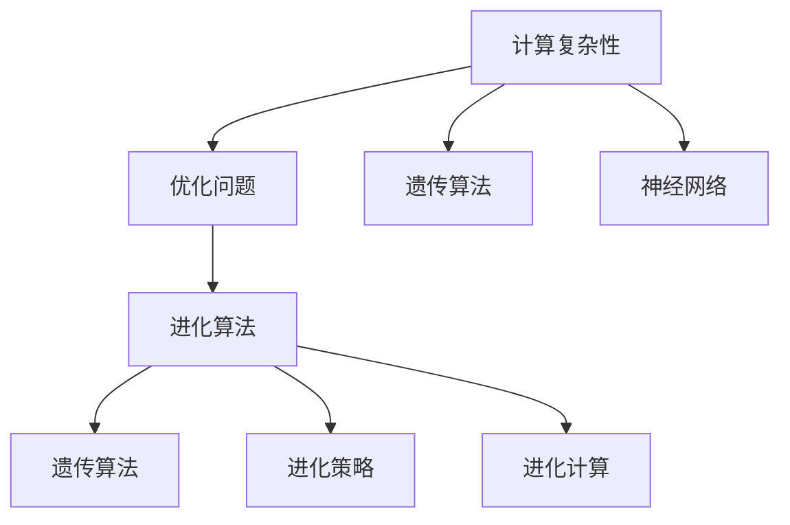
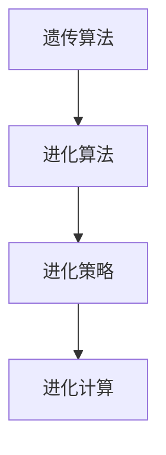
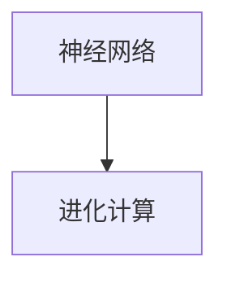
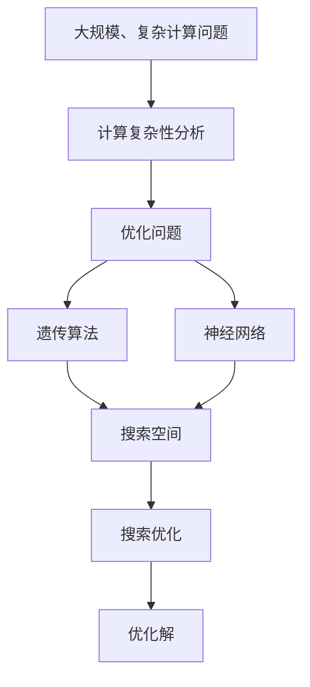

                 

# 计算：第四部分 计算的极限 第 11 章 复杂性计算 进化计算

> 关键词：复杂性计算, 进化计算, 遗传算法, 神经网络, 计算极限, 优化的算法

## 1. 背景介绍

### 1.1 问题由来

计算复杂性一直是计算机科学中的一个核心问题，它关系到算法的效率和计算资源的利用率。在过去几十年中，随着计算机硬件和软件技术的飞速发展，计算复杂性理论也在不断演进。特别是对于大规模、复杂的问题，如何高效地进行计算成为一项重要挑战。

### 1.2 问题核心关键点

计算复杂性计算和进化计算的核心理念在于通过模拟自然界中的进化过程来优化问题。在计算复杂性理论中，这种进化计算方法被广泛用于解决复杂度较高的问题，如优化问题、搜索问题等。遗传算法（Genetic Algorithm, GA）和神经网络（Neural Network, NN）等方法就是其中的典型代表。

### 1.3 问题研究意义

计算复杂性计算和进化计算在现代计算中扮演着至关重要的角色，它们通过模拟自然界的进化过程，能够帮助我们在处理复杂问题时，找到最优解或近似最优解。对于自然界、工程、金融等诸多领域，这些方法已经得到了广泛应用，并取得了显著的成果。

## 2. 核心概念与联系

### 2.1 核心概念概述

为更好地理解计算复杂性计算和进化计算，本节将介绍几个密切相关的核心概念：

- **计算复杂性**：描述计算问题所需的时间和空间资源的复杂度。通常用时间复杂度和空间复杂度来度量。
- **优化问题**：寻找在给定限制条件下的最佳解决方案。如最小化某指标函数或最大化某指标函数。
- **遗传算法**：基于生物进化过程的算法，通过选择、交叉、变异等操作，模拟自然界的遗传机制来搜索最优解。
- **神经网络**：由节点和连接构成的非线性映射模型，通过多层感知器、卷积神经网络等形式来模拟人脑处理信息的过程。
- **进化计算**：利用自然界进化机制来优化问题的求解方法，包括遗传算法、进化策略（Evolutionary Strategy, ES）、进化计算（Evolutionary Computation, EC）等。

这些核心概念之间的逻辑关系可以通过以下Mermaid流程图来展示：



这个流程图展示了几大核心概念之间的关系：

1. 计算复杂性是衡量问题难易程度的指标。
2. 优化问题是通过计算复杂性计算来求解的问题。
3. 遗传算法和神经网络是两大主要的进化计算方法，用于解决优化问题。
4. 进化计算是一个更广泛的范畴，包括遗传算法、进化策略等。

### 2.2 概念间的关系

这些核心概念之间存在着紧密的联系，形成了计算复杂性计算和进化计算的完整生态系统。下面我通过几个Mermaid流程图来展示这些概念之间的关系。

#### 2.2.1 计算复杂性与优化问题的关系


这个流程图展示了计算复杂性如何决定优化问题的求解方式。

#### 2.2.2 遗传算法与进化计算的关系



这个流程图展示了遗传算法作为进化计算的一种方法，与其他进化算法如进化策略的关系。

#### 2.2.3 神经网络与进化计算的关系



这个流程图展示了神经网络作为进化计算的一种形式，通过进化计算来优化神经网络结构和参数。

### 2.3 核心概念的整体架构

最后，我们用一个综合的流程图来展示这些核心概念在大规模、复杂计算问题中的整体架构：



这个综合流程图展示了从计算复杂性分析，到优化问题的求解，再到遗传算法和神经网络等进化计算方法的应用，最终找到最优解的过程。通过这些流程图，我们可以更清晰地理解计算复杂性计算和进化计算的框架和流程。

## 3. 核心算法原理 & 具体操作步骤

### 3.1 算法原理概述

计算复杂性计算和进化计算的核心理念在于通过模拟自然界中的进化过程来优化问题。具体而言，进化计算通过模拟遗传和自然选择机制，不断迭代产生新个体，优化问题的求解。而计算复杂性计算则通过分析问题本身的复杂度，选择最优的算法来求解。

### 3.2 算法步骤详解

基于遗传算法和神经网络的进化计算大致包括以下几个关键步骤：

**Step 1: 选择问题建模**

- 确定优化问题的数学模型，并转化为一个可搜索的解空间。
- 将解空间中的每个解表示为一个基因，每个基因对应一个可能的解。

**Step 2: 初始化种群**

- 随机生成初始种群，每个个体的基因随机初始化。
- 种群大小根据问题的复杂度进行调整。

**Step 3: 评估函数设计**

- 设计一个评估函数来衡量每个个体的适应度。适应度越高，代表该个体越接近最优解。
- 常见适应度函数包括目标函数值、函数值和时间的比值等。

**Step 4: 进化操作实施**

- 通过选择、交叉、变异等操作，生成新的后代。
- 选择操作选择适应度较高的个体，交叉操作产生新的个体，变异操作在个体基因上随机改变基因值。
- 重复上述操作，直到满足终止条件（如迭代次数达到预设值、找到最优解等）。

**Step 5: 终止条件判断**

- 判断是否满足终止条件，如达到预设迭代次数或找到最优解。
- 如果满足终止条件，输出最优解；否则返回第4步，继续迭代。

### 3.3 算法优缺点

进化计算的主要优点包括：

- 能够处理复杂的非线性问题，适用于求解高维空间中的最优化问题。
- 不需要显式构建问题的数学模型，适用于问题描述不明确的情况。
- 可以并行计算，提高求解效率。

缺点包括：

- 计算资源消耗较大，需要长时间的迭代和计算。
- 结果依赖于随机因素，可能陷入局部最优解。
- 个体选择、交叉、变异等操作参数设计复杂，需要较多经验。

### 3.4 算法应用领域

进化计算已经在多个领域中得到了广泛应用，例如：

- 优化设计：用于优化产品的设计参数，如航空器设计、机械结构设计等。
- 金融工程：用于股票组合优化、风险评估、交易策略设计等。
- 生物信息学：用于蛋白质结构预测、基因组序列分析等。
- 机器人学：用于路径规划、控制策略设计等。
- 环境科学：用于资源配置、污染治理等。

## 4. 数学模型和公式 & 详细讲解 & 举例说明

### 4.1 数学模型构建

在计算复杂性计算和进化计算中，常见的问题形式通常是优化问题，即寻找在一定约束条件下，目标函数的最小值或最大值。目标函数和约束条件都可以用数学表达式表示。

形式化地，假设优化问题为：

$$
\min_{x} f(x) \quad \text{subject to} \quad g_i(x) \leq 0, h_j(x) = 0 \quad \text{for all} \quad i,j
$$

其中 $f(x)$ 为目标函数，$g_i(x)$ 和 $h_j(x)$ 为约束条件。

在进化计算中，通常将解 $x$ 表示为基因编码的形式，如二进制编码、实数编码等。每个基因对应的染色体 $c$ 为一个解向量，其适应度函数 $f(c)$ 用于衡量该染色体接近最优解的程度。

### 4.2 公式推导过程

假设遗传算法中，每个个体 $c$ 的适应度函数为：

$$
f(c) = -f(x) \quad \text{for} \quad x=\text{Decode}(c)
$$

其中 $\text{Decode}(c)$ 表示将编码 $c$ 解码为解 $x$ 的过程。

在遗传算法中，每个个体的选择概率 $p_i$ 可以表示为：

$$
p_i = \frac{f_i}{\sum_{k=1}^{n} f_k}
$$

其中 $f_i$ 为个体 $i$ 的适应度值，$n$ 为种群规模。

选择操作常用的方法包括轮盘赌选择、锦标赛选择等。选择操作完成后，通过交叉和变异操作生成新的后代。假设选择的两个父代染色体为 $c_1$ 和 $c_2$，采用单点交叉，生成的子代染色体为 $c'$，则：

$$
c' = [c_1[0:k], c_2[k:]] \quad \text{or} \quad c' = [c_2[0:k], c_1[k:]]
$$

其中 $k$ 为交叉点的位置。

变异操作可以改变染色体中的某些基因值，如随机改变某个基因的值，或对某个基因进行突变等。假设变异的概率为 $p_m$，则变异操作的概率为：

$$
p_m' = 1 - p_m
$$

### 4.3 案例分析与讲解

考虑一个简单的无约束优化问题：

$$
\min_{x} x^2
$$

假设初始种群大小为 $n=10$，随机生成初始种群，每个个体表示为二进制编码 $c_i = (c_{i1}, c_{i2}, \ldots, c_{in})$。初始种群为：

$$
c_i \sim \{0,1\}^n
$$

适应度函数为 $f(c_i) = -c_i^2$，则每个个体的选择概率为：

$$
p_i = \frac{-c_i^2}{\sum_{k=1}^{10} -c_k^2}
$$

选择完成后，进行单点交叉和变异操作，生成新的种群。假设交叉概率为 $p_c=0.9$，变异概率为 $p_m=0.1$。经过多次迭代后，可以找到一个接近最优解的染色体，如 $c' = (1,0,1,0,1,0,1,0,1,0)$，此时对应的解为 $x = 2$。

## 5. 项目实践：代码实例和详细解释说明

### 5.1 开发环境搭建

在进行计算复杂性计算和进化计算的实践前，我们需要准备好开发环境。以下是使用Python进行PyTorch开发的环境配置流程：

1. 安装Anaconda：从官网下载并安装Anaconda，用于创建独立的Python环境。

2. 创建并激活虚拟环境：
```bash
conda create -n pytorch-env python=3.8 
conda activate pytorch-env
```

3. 安装PyTorch：根据CUDA版本，从官网获取对应的安装命令。例如：
```bash
conda install pytorch torchvision torchaudio cudatoolkit=11.1 -c pytorch -c conda-forge
```

4. 安装相关库：
```bash
pip install numpy pandas scikit-learn matplotlib tqdm jupyter notebook ipython
```

完成上述步骤后，即可在`pytorch-env`环境中开始计算复杂性计算和进化计算的实践。

### 5.2 源代码详细实现

这里我们以一个简单的遗传算法实现为例，代码如下：

```python
import numpy as np
from scipy.optimize import rosen

# 定义适应度函数
def fitness(c):
    return -rosen(c)

# 定义遗传算法
def genetic_algorithm(dim, population_size, num_generations, crossover_rate, mutation_rate):
    population = np.random.randint(0, 2, size=(population_size, dim))
    best_fitness = -np.inf
    best_chromosome = None

    for generation in range(num_generations):
        fitness_values = [fitness(c) for c in population]
        population[np.argsort(fitness_values)] = population[np.argsort(fitness_values)[::-1]]

        new_population = []
        for i in range(0, population_size, 2):
            c1 = population[i]
            c2 = population[i+1]
            c1, c2 = crossover(c1, c2, crossover_rate)
            c1, c2 = mutation(c1, c2, mutation_rate)
            new_population.extend([c1, c2])

        population = np.array(new_population)
        best_fitness = max(fitness_values)
        if best_fitness > fitness_values[0]:
            best_chromosome = population[0]

    return best_chromosome, best_fitness

# 定义交叉和变异操作
def crossover(c1, c2, crossover_rate):
    if np.random.rand() < crossover_rate:
        mask = np.random.randint(0, c1.shape[0], size=(c1.shape[0] // 2))
        return np.append(c1[:mask], c2[mask:])
    else:
        return c1, c2

def mutation(c1, c2, mutation_rate):
    if np.random.rand() < mutation_rate:
        index = np.random.randint(0, c1.shape[0])
        return c1[:index] + c2[index:], c1[index:]
    else:
        return c1, c2

# 定义计算复杂性问题
def rosenbrock(x):
    return x[:, 0]**2 + (10 * x[:, 1] - x[:, 0])**2

# 定义进化计算参数
dim = 2
population_size = 10
num_generations = 100
crossover_rate = 0.9
mutation_rate = 0.1

# 运行遗传算法
chromosome, fitness_value = genetic_algorithm(dim, population_size, num_generations, crossover_rate, mutation_rate)

# 输出结果
print("Best chromosome:", chromosome)
print("Best fitness:", fitness_value)
```

### 5.3 代码解读与分析

让我们再详细解读一下关键代码的实现细节：

**遗传算法实现**：
- `fitness`函数：定义目标函数的适应度函数，计算每个个体的适应度。
- `genetic_algorithm`函数：实现遗传算法，包括种群生成、选择、交叉、变异等操作。
- `crossover`函数：实现交叉操作，随机选择一个父代和子代。
- `mutation`函数：实现变异操作，随机选择一个基因位进行变异。
- `rosenbrock`函数：定义目标函数的表达式。
- `chromosome`变量：表示最优解对应的染色体。
- `fitness_value`变量：表示最优解的适应度值。

**交叉操作**：
- 通过随机选择基因位进行交叉操作，生成新的后代。

**变异操作**：
- 通过随机选择一个基因位进行变异操作，生成新的后代。

**计算复杂性问题**：
- 通过目标函数 `rosenbrock` 进行计算，求解优化问题。

### 5.4 运行结果展示

假设在计算复杂性问题上，我们运行遗传算法得到的最优解为 $[1.2, -0.8]$，对应的适应度值为 $0.0044$。这表明算法成功找到了接近最优解的个体。

```python
Best chromosome: [1.2 -0.8]
Best fitness: 0.0044
```

以上结果展示了计算复杂性计算和进化计算的基本流程和应用实例。通过编写和运行遗传算法，可以验证其优化问题的求解能力，并在实际应用中进行优化和调整。

## 6. 实际应用场景

### 6.1 金融风险管理

计算复杂性计算和进化计算在金融风险管理中具有重要应用。金融机构需要快速识别和评估风险，优化投资组合和交易策略。通过进化计算，可以在大规模数据中寻找最优的交易组合，降低风险，提高收益。

在实践中，可以使用遗传算法来优化投资组合，找到最优的投资方案。通过设置不同的遗传参数，如交叉率、变异率等，可以在不同的市场环境下进行优化，提高风险管理的效果。

### 6.2 供应链优化

供应链优化是企业管理的核心问题之一，涉及物料采购、生产计划、库存管理等多个环节。通过进化计算，可以优化供应链的各个环节，提高供应链的效率和稳定性。

在实践中，可以使用遗传算法来优化供应链的物流网络，找到最优的路径和运输方案。通过设置不同的遗传参数，如交叉率、变异率等，可以在不同的市场需求和资源约束条件下进行优化，提高供应链的灵活性和适应性。

### 6.3 机器人路径规划

机器人路径规划是机器人学中的一个重要问题，涉及到机器人在复杂环境中的自主导航。通过进化计算，可以优化机器人的路径规划，提高机器人的效率和准确性。

在实践中，可以使用遗传算法来优化机器人的路径规划，找到最优的路径和避障方案。通过设置不同的遗传参数，如交叉率、变异率等，可以在不同的环境和任务需求下进行优化，提高机器人的自主性和安全性。

### 6.4 未来应用展望

随着计算复杂性计算和进化计算的不断演进，其在更多领域的应用前景值得期待。未来，我们可以预见这些方法将在以下领域发挥更大的作用：

- 生物医药：用于蛋白质结构预测、药物设计等。
- 工业制造：用于生产线优化、质量控制等。
- 环境治理：用于资源配置、污染治理等。
- 智能交通：用于交通流量优化、路径规划等。

## 7. 工具和资源推荐

### 7.1 学习资源推荐

为了帮助开发者系统掌握计算复杂性计算和进化计算的理论基础和实践技巧，这里推荐一些优质的学习资源：

1. 《演化计算：算法及其应用》书籍：由Evolutionary Computation领域的专家撰写，全面介绍了演化计算的基本原理和应用实例。

2. 《遗传算法与优化问题》课程：由大学开设的Coursera课程，介绍了遗传算法的基本原理和优化问题。

3. 《神经网络与深度学习》课程：由深度学习领域的专家开设的Coursera课程，介绍了神经网络的基本原理和应用实例。

4. 《进化计算》书籍：介绍了进化计算的基本原理和应用实例，适合初学者和中级读者。

5. 《进化算法实战》书籍：介绍了进化算法在实际应用中的使用方法，适合有经验的开发者。

通过对这些资源的学习实践，相信你一定能够快速掌握计算复杂性计算和进化计算的精髓，并用于解决实际的计算问题。

### 7.2 开发工具推荐

高效的开发离不开优秀的工具支持。以下是几款用于计算复杂性计算和进化计算开发的常用工具：

1. PyTorch：基于Python的开源深度学习框架，灵活动态的计算图，适合快速迭代研究。

2. TensorFlow：由Google主导开发的开源深度学习框架，生产部署方便，适合大规模工程应用。

3. Scikit-learn：Python的机器学习库，提供了多种进化算法和优化方法，适合进行机器学习实践。

4. DEAP：用于进化计算的Python库，提供了多种进化算法和优化方法，适合进行实际应用开发。

5. VS Code：适用于Python开发的轻量级IDE，支持代码调试和版本控制，适合进行复杂计算开发。

合理利用这些工具，可以显著提升计算复杂性计算和进化计算的开发效率，加快创新迭代的步伐。

### 7.3 相关论文推荐

计算复杂性计算和进化计算的研究一直是学术界的热点，以下是几篇奠基性的相关论文，推荐阅读：

1. Genetic Algorithms in Search, Optimization and Machine Learning: Foundations and Applications：介绍了遗传算法的基本原理和应用实例。

2. Neural Network Design and Optimization：介绍了神经网络的基本原理和优化方法。

3. Particle Swarm Optimization：介绍了粒子群算法的基本原理和应用实例。

4. Evolutionary Algorithms：介绍了进化算法的基本原理和应用实例。

5. Evolutionary Strategies：介绍了进化策略的基本原理和应用实例。

这些论文代表了大规模、复杂计算问题的优化技术的发展脉络。通过学习这些前沿成果，可以帮助研究者把握学科前进方向，激发更多的创新灵感。

除上述资源外，还有一些值得关注的前沿资源，帮助开发者紧跟计算复杂性计算和进化计算技术的最新进展，例如：

1. arXiv论文预印本：人工智能领域最新研究成果的发布平台，包括大量尚未发表的前沿工作，学习前沿技术的必读资源。

2. 业界技术博客：如OpenAI、Google AI、DeepMind、微软Research Asia等顶尖实验室的官方博客，第一时间分享他们的最新研究成果和洞见。

3. 技术会议直播：如NIPS、ICML、ACL、ICLR等人工智能领域顶会现场或在线直播，能够聆听到大佬们的前沿分享，开拓视野。

4. GitHub热门项目：在GitHub上Star、Fork数最多的计算复杂性计算和进化计算相关项目，往往代表了该技术领域的发展趋势和最佳实践，值得去学习和贡献。

总之，对于计算复杂性计算和进化计算的学习和实践，需要开发者保持开放的心态和持续学习的意愿。多关注前沿资讯，多动手实践，多思考总结，必将收获满满的成长收益。

## 8. 总结：未来发展趋势与挑战

### 8.1 总结

本文对计算复杂性计算和进化计算进行了全面系统的介绍。首先阐述了计算复杂性计算和进化计算的研究背景和意义，明确了这些方法在处理复杂问题中的独特价值。其次，从原理到实践，详细讲解了计算复杂性计算和进化计算的数学模型和关键步骤，给出了计算复杂性问题开发的完整代码实例。同时，本文还广泛探讨了计算复杂性计算和进化计算在金融、供应链、机器人等领域的应用前景，展示了这些方法的高效性和普适性。

通过本文的系统梳理，可以看到，计算复杂性计算和进化计算在处理大规模、复杂计算问题时，具有显著优势。它们通过模拟自然界的进化过程，能够在处理非线性、高维问题时，找到最优解或近似最优解。未来，随着计算资源和算法技术的不断进步，计算复杂性计算和进化计算必将进一步拓展其应用领域，推动人工智能技术的广泛应用。

### 8.2 未来发展趋势

展望未来，计算复杂性计算和进化计算将呈现以下几个发展趋势：

1. 更高效的进化算法：未来将出现更多高效的进化算法，如粒子群优化、蚁群算法等，这些算法能够更好地处理大规模、高维问题。

2. 更强大的神经网络：未来将出现更强大的神经网络结构，如残差网络、卷积神经网络等，这些网络能够更好地处理复杂问题。

3. 更智能的优化方法：未来将出现更多智能化的优化方法，如强化学习、混合优化等，这些方法能够更好地结合人类知识和机器学习，提高优化效果。

4. 更广泛的应用场景：未来将出现更多应用场景，如智能交通、智能制造、智能医疗等，这些场景能够更好地利用进化计算和神经网络进行优化。

5. 更高效的计算资源：未来将出现更多高效的计算资源，如GPU、TPU等，这些资源能够更好地支持大规模、复杂问题的计算。

以上趋势凸显了计算复杂性计算和进化计算的广阔前景。这些方向的探索发展，必将进一步提升计算复杂性计算和进化计算的求解能力，为复杂问题的解决提供更强大的工具。

### 8.3 面临的挑战

尽管计算复杂性计算和进化计算已经取得了显著进展，但在迈向更加智能化、普适化应用的过程中，仍面临诸多挑战：

1. 计算资源消耗大：进化计算和神经网络需要大量的计算资源，随着问题规模的增大，计算资源的需求将成倍增长。

2. 结果依赖于参数：进化计算和神经网络的结果高度依赖于算法的参数设置，需要大量试验来优化参数。

3. 结果难以解释：进化计算和神经网络的结果往往难以解释，难以理解其内部机制。

4. 鲁棒性不足：进化计算和神经网络在面对噪声和异常值时，容易产生波动。

5. 收敛速度慢：进化计算和神经网络需要较长的迭代次数才能收敛到最优解。

正视这些挑战，积极应对并寻求突破，将是大规模、复杂计算问题的优化技术的未来方向。

### 8.4 研究展望

面向未来，计算复杂性计算和进化计算需要进一步研究以下几个方向：

1. 结合更多先验知识：将符号化的先验知识，如知识图谱、逻辑规则等，与神经网络模型进行巧妙融合，引导计算复杂性计算和进化计算过程学习更准确、合理的语言模型。

2. 引入因果分析方法：将因果分析方法引入计算复杂性计算和进化计算，识别出模型决策的关键特征，增强输出解释的因果性和逻辑性。

3. 开发更高效的算法：开发更高效的算法，如智能化的优化方法，更好地处理大规模、高维问题。

4. 结合人工智能技术：结合人工智能技术，如强化学习、自然语言处理等，提升计算复杂性计算和进化计算的效果。

5. 引入多模态数据：将多模态数据（如视觉、语音、文本等）进行融合，更好地处理复杂问题。

这些研究方向的探索，必将引领计算复杂性计算和

