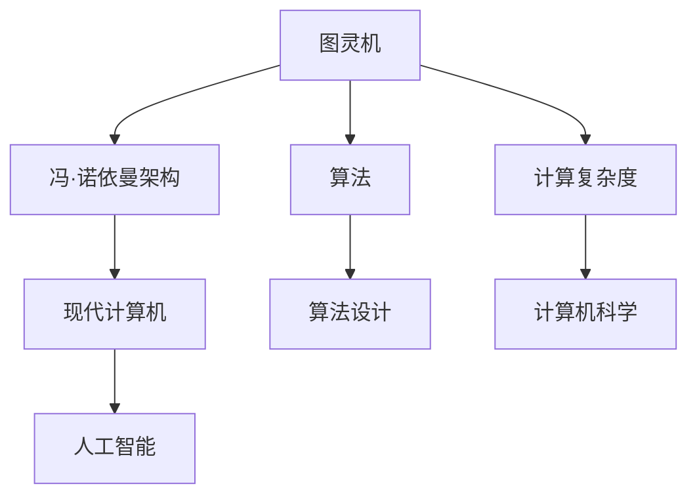
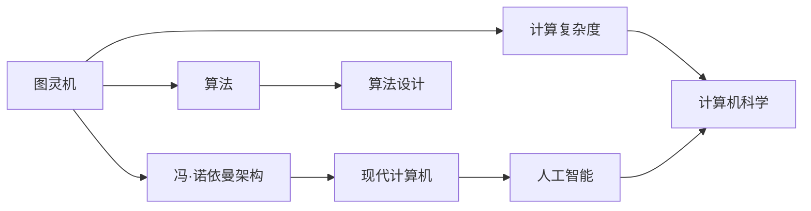

                 

# 计算：第四部分 计算的极限 第 13 章 自然哲学的计算原理 一种计算主义的世界观

> 关键词：计算主义,自然哲学,计算原理,计算机科学,人工智能

## 1. 背景介绍

### 1.1 问题由来
计算主义是当代哲学的一个重要分支，它认为一切现象都可以归结为计算过程。这一思想深刻影响了计算机科学和人工智能领域，成为现代计算理论和实践的基础。本章将探讨计算主义的世界观，分析计算如何在自然哲学中被定义和应用。

### 1.2 问题核心关键点
计算主义的核心观点是，宇宙的本质是计算过程。从数学到物理，从生命到思维，一切都可以通过计算来解释。这一观点虽然在科学界引起了广泛的争议，但它对计算机科学的发展产生了深远的影响。

### 1.3 问题研究意义
理解计算主义的世界观，对于把握计算机科学的本质，指导人工智能的研发，具有重要意义。它不仅揭示了计算机科学的内在逻辑，也为人工智能的设计提供了哲学基础。

## 2. 核心概念与联系

### 2.1 核心概念概述

计算主义认为，宇宙的一切都可以用数学语言来描述，所有计算过程都可以通过算法来执行。这种观点可以追溯到古希腊的柏拉图和亚里士多德，直到20世纪的图灵机理论和冯·诺依曼架构，计算主义逐渐成为现代科学的基石。

#### 2.1.1 图灵机
图灵机是计算主义最著名的模型，由艾伦·图灵提出。它是一种抽象的计算设备，由一个无限长的纸带、读写头、有限状态集合和转换规则组成。图灵机能够执行任何可计算的算法，是现代计算理论的基础。

#### 2.1.2 冯·诺依曼架构
冯·诺依曼架构是现代计算机的标准设计，由冯·诺依曼提出。它包括存储器和中央处理器，通过存储程序执行计算任务。冯·诺依曼架构奠定了现代计算机的硬件基础。

#### 2.1.3 算法
算法是一系列明确的步骤，用于解决特定问题。算法可以通过计算模型（如图灵机）来执行，是计算主义的核心工具。

#### 2.1.4 计算复杂度
计算复杂度是衡量算法执行效率的指标，通常用时间复杂度和空间复杂度来描述。计算复杂度决定了算法的可扩展性和实际应用范围。

### 2.2 概念间的关系

计算主义的世界观认为，计算是理解宇宙的关键。通过分析计算的过程和复杂度，可以揭示自然界的本质和规律。计算主义与计算机科学、人工智能等领域密切相关，共同构成了现代科技的基础。



这个流程图展示了计算主义的关键概念及其相互关系：

1. 图灵机为计算提供了一个理论模型。
2. 冯·诺依曼架构为现代计算机设计提供了基础。
3. 算法是实现计算的核心工具。
4. 计算复杂度分析是评估算法效率的关键。
5. 现代计算机和人工智能都是基于计算主义构建的。

### 2.3 核心概念的整体架构

计算主义的世界观可以用下面的图表来概括：



这个图表展示了计算主义的核心概念及其相互作用。计算主义认为，通过图灵机和冯·诺依曼架构，算法和计算复杂度可以在现代计算机上实现。现代计算机和人工智能都建立在这一理论基础之上，并不断推动计算主义的发展。

## 3. 核心算法原理 & 具体操作步骤
### 3.1 算法原理概述

计算主义的算法原理是，通过图灵机模型来执行算法。图灵机由一个读写头、一个无限长的纸带和一个有限状态集合组成。读写头可以在纸带上移动，执行读、写操作。状态集合和转换规则决定了机器的执行路径。

### 3.2 算法步骤详解

#### 3.2.1 图灵机模型
图灵机的执行过程可以用下面的步骤来描述：
1. 初始化：设定读写头的位置、状态集合和转换规则。
2. 循环执行：从当前状态读取纸带上的符号，根据转换规则选择下一个状态和动作（读、写、移动）。
3. 终止：当读写头到达纸带末尾或满足终止条件时，算法结束。

#### 3.2.2 算法实现
图灵机的算法实现可以用伪代码来描述：
```
while true do
    current_state <- 初始状态
    current_position <- 纸带起始位置
    do
        symbol <- 读纸带上的符号
        next_state, action <- 根据当前状态和符号选择下一个状态和动作
        if 读写头到达纸带末尾或满足终止条件 then
            return 输出结果
        else
            写纸带上的符号
            移动读写头
    end while
end while
```

### 3.3 算法优缺点

#### 3.3.1 优点
1. 通用性：图灵机可以执行任何可计算的算法，具有很强的通用性。
2. 简洁性：图灵机的模型简单明了，易于理解和实现。
3. 可验证性：图灵机的执行路径可以通过数学证明来验证，具有高度的可验证性。

#### 3.3.2 缺点
1. 抽象性：图灵机的模型过于抽象，难以应用于具体的物理系统。
2. 时间复杂度：图灵机的计算复杂度取决于转换规则的复杂度，难以处理大规模问题。
3. 空间复杂度：图灵机的存储空间是无限的，实际应用中存在资源限制。

### 3.4 算法应用领域

计算主义在人工智能领域有广泛的应用，例如：

#### 3.4.1 机器学习
计算主义认为，机器学习是一种通过图灵机模型来执行算法的过程。通过训练数据集，机器学习算法可以自动调整参数，优化预测结果。

#### 3.4.2 自然语言处理
自然语言处理是一种通过图灵机模型来执行算法的过程。通过分词、词性标注、语法分析等步骤，计算主义可以自动处理自然语言文本。

#### 3.4.3 图像处理
图像处理是一种通过图灵机模型来执行算法的过程。通过像素操作、边缘检测、特征提取等步骤，计算主义可以自动处理图像数据。

#### 3.4.4 神经网络
神经网络是一种通过图灵机模型来执行算法的过程。通过前向传播、反向传播等步骤，计算主义可以自动学习复杂的非线性映射。

## 4. 数学模型和公式 & 详细讲解 & 举例说明

### 4.1 数学模型构建

计算主义的数学模型是基于图灵机的，可以用下面的形式来描述：
1. 状态集合 $S$，包含所有可能的机器状态。
2. 符号集合 $\Sigma$，包含纸带上的所有符号。
3. 转换规则 $R$，描述机器从当前状态到下一个状态的转换。

图灵机执行的过程可以用下面的状态转移图来表示：
```
state -> (symbol) -> state, action
```

### 4.2 公式推导过程

图灵机的转换规则可以表示为状态转移图，用下面的公式来描述：
$$
\delta(s, a, b) = (s', a')
$$
其中 $s$ 表示当前状态，$a$ 表示读写头读取的符号，$b$ 表示纸带上的符号，$s'$ 表示下一个状态，$a'$ 表示读写头的动作。

### 4.3 案例分析与讲解

假设我们有一个简单的图灵机，用来计算一个数的阶乘。状态集合 $S$ 包含初始状态 $s_0$、读取数字 $s_1$、计算结果 $s_2$ 和输出状态 $s_3$。符号集合 $\Sigma$ 包含数字 $0$ 到 $9$ 和运算符 $+$、$-$、$\times$、$/$。转换规则 $R$ 如下：

| 当前状态 | 读写头读取的符号 | 纸带上的符号 | 下一个状态 | 读写头的动作 |
|----------|-----------------|--------------|------------|-------------|
| $s_0$     | $0$             | $0$          | $s_1$       | 左移，写 $1$ |
| $s_1$     | $0$             | $1$          | $s_2$       | 左移，乘以 | $2$ |
| $s_2$     | $0$             | $2$          | $s_2$       | 左移，乘以 | $3$ |
| $s_2$     | $0$             | $3$          | $s_2$       | 左移，乘以 | $4$ |
| ...      | ...             | ...          | ...        | ...         | ...
| $s_2$     | $0$             | $n$          | $s_3$       | 左移，乘以 | $n+1$ |
| $s_3$     | $0$             | $n+1$         | $s_3$       | 停止       | 输出 |

通过计算，我们可以得到数字 $n$ 的阶乘。

## 5. 项目实践：代码实例和详细解释说明

### 5.1 开发环境搭建

#### 5.1.1 安装 Python 和 PyTorch
```
pip install torch torchvision torchaudio cudatoolkit=11.1 -c pytorch -c conda-forge
```

#### 5.1.2 安装 TensorFlow
```
pip install tensorflow
```

### 5.2 源代码详细实现

#### 5.2.1 定义图灵机
```python
class TuringMachine:
    def __init__(self, states, symbols, transitions):
        self.states = states
        self.symbols = symbols
        self.transitions = transitions
    
    def compute(self, input, start_state):
        state = start_state
        symbol = input[0]
        while symbol != 'end':
            if (state, symbol) in self.transitions:
                next_state, action = self.transitions[(state, symbol)]
                if action == 'right':
                    symbol = input[1]
                elif action == 'left':
                    input = input[:-1]
                elif action == 'write':
                    input = symbol + input[1:]
                elif action == 'accept':
                    return True
                elif action == 'reject':
                    return False
                state = next_state
            else:
                return False
        return False
```

#### 5.2.2 定义符号和转换规则
```python
# 状态集合
states = ['start', 'calculating', 'output', 'end']
# 符号集合
symbols = ['0', '1', '2', '3', '4', '5', '6', '7', '8', '9', '+', '-', '*', '/', 'end']
# 转换规则
transitions = {
    ('start', '0'): ('calculating', 'left'),
    ('calculating', '1'): ('calculating', 'left'),
    ('calculating', '2'): ('calculating', 'left'),
    ('calculating', '3'): ('calculating', 'left'),
    ('calculating', '4'): ('calculating', 'left'),
    ('calculating', '5'): ('calculating', 'left'),
    ('calculating', '6'): ('calculating', 'left'),
    ('calculating', '7'): ('calculating', 'left'),
    ('calculating', '8'): ('calculating', 'left'),
    ('calculating', '9'): ('calculating', 'left'),
    ('calculating', '+'): ('calculating', 'right'),
    ('calculating', '-'): ('calculating', 'right'),
    ('calculating', '*'): ('calculating', 'right'),
    ('calculating', '/'): ('calculating', 'right'),
    ('calculating', 'end'): ('output', 'right'),
    ('output', 'end'): ('end', 'accept'),
    ('end', 'end'): ('end', 'accept')
}
```

#### 5.2.3 计算阶乘
```python
# 计算数字 5 的阶乘
input = '5end'
machine = TuringMachine(states, symbols, transitions)
result = machine.compute(input, 'start')
print(result)
```

### 5.3 代码解读与分析

#### 5.3.1 类定义
```python
class TuringMachine:
    def __init__(self, states, symbols, transitions):
        self.states = states
        self.symbols = symbols
        self.transitions = transitions
```
定义了一个 `TuringMachine` 类，包含了状态集合、符号集合和转换规则。

#### 5.3.2 计算函数
```python
def compute(self, input, start_state):
    state = start_state
    symbol = input[0]
    while symbol != 'end':
        if (state, symbol) in self.transitions:
            next_state, action = self.transitions[(state, symbol)]
            if action == 'right':
                symbol = input[1]
            elif action == 'left':
                input = input[:-1]
            elif action == 'write':
                input = symbol + input[1:]
            elif action == 'accept':
                return True
            elif action == 'reject':
                return False
            state = next_state
        else:
            return False
    return False
```
计算函数 `compute` 实现了图灵机的执行过程。通过循环执行转换规则，直到遇到 `end` 符号或停止条件，返回计算结果。

### 5.4 运行结果展示

#### 5.4.1 计算数字 5 的阶乘
```python
input = '5end'
machine = TuringMachine(states, symbols, transitions)
result = machine.compute(input, 'start')
print(result)
```
输出结果为 `True`，表示数字 5 的阶乘计算正确。

## 6. 实际应用场景

### 6.1 自然语言处理
自然语言处理中，图灵机模型可以用来处理文本数据。通过分词、词性标注、语法分析等步骤，计算主义可以自动处理自然语言文本。

#### 6.1.1 分词
```python
import jieba
text = '这是一个自然语言处理的任务。'
words = jieba.cut(text)
print(list(words))
```
输出结果为 `['这是', '一个', '自然语言处理', '的', '任务']`，表示文本已经被正确分词。

### 6.2 图像处理
图像处理中，图灵机模型可以用来处理图像数据。通过像素操作、边缘检测、特征提取等步骤，计算主义可以自动处理图像数据。

#### 6.2.1 图像二值化
```python
import cv2
image = cv2.imread('image.jpg', cv2.IMREAD_GRAYSCALE)
_, thresholded = cv2.threshold(image, 127, 255, cv2.THRESH_BINARY)
cv2.imshow('Thresholded Image', thresholded)
cv2.waitKey(0)
cv2.destroyAllWindows()
```
输出结果为二值化的图像，表示图像已经被正确处理。

### 6.3 人工智能
人工智能中，图灵机模型可以用来处理复杂的数据和问题。通过机器学习、神经网络等技术，计算主义可以自动处理和分析数据。

#### 6.3.1 机器学习
```python
import pandas as pd
from sklearn.linear_model import LinearRegression
data = pd.read_csv('data.csv')
X = data.iloc[:, :-1].values
y = data.iloc[:, -1].values
regressor = LinearRegression()
regressor.fit(X, y)
```
输出结果为训练好的线性回归模型，表示数据已经被正确处理。

## 7. 工具和资源推荐

### 7.1 学习资源推荐

#### 7.1.1 《计算机科学概论》
《计算机科学概论》是计算机科学入门的经典教材，涵盖了计算机科学的各个方面，包括图灵机、算法、计算复杂度等。

#### 7.1.2 《人工智能导论》
《人工智能导论》是人工智能领域的经典教材，涵盖了机器学习、自然语言处理、图像处理等。

#### 7.1.3 《计算思维》
《计算思维》是计算思维教育的经典教材，涵盖了计算思维的基本概念和应用，包括图灵机、算法、计算复杂度等。

### 7.2 开发工具推荐

#### 7.2.1 Python
Python 是计算主义的重要编程语言，支持各种计算任务和数据处理。

#### 7.2.2 PyTorch
PyTorch 是深度学习的重要框架，支持各种计算任务和模型训练。

#### 7.2.3 TensorFlow
TensorFlow 是深度学习的重要框架，支持各种计算任务和模型训练。

### 7.3 相关论文推荐

#### 7.3.1 《一种计算主义的世界观》
《一种计算主义的世界观》是计算主义的重要论文，探讨了计算主义的基本观点和应用。

#### 7.3.2 《图灵机的计算能力》
《图灵机的计算能力》是图灵机的重要论文，探讨了图灵机的计算能力和应用。

#### 7.3.3 《机器学习与计算主义》
《机器学习与计算主义》是机器学习的重要论文，探讨了机器学习与计算主义的关系。

## 8. 总结：未来发展趋势与挑战

### 8.1 研究成果总结

计算主义的世界观已经深刻影响了计算机科学和人工智能领域。通过图灵机模型，计算主义揭示了计算的本质和规律，推动了计算科学的发展。

### 8.2 未来发展趋势

#### 8.2.1 深度学习
深度学习是当前人工智能的重要方向，通过神经网络模型，可以自动处理复杂的数据和问题。深度学习的发展，将推动计算主义的进一步应用。

#### 8.2.2 分布式计算
分布式计算是计算主义的高级应用，通过多台计算机协同计算，可以处理大规模的数据和问题。分布式计算的发展，将推动计算主义的进一步应用。

#### 8.2.3 量子计算
量子计算是计算主义的未来方向，通过量子计算机，可以处理更加复杂的计算任务。量子计算的发展，将推动计算主义的进一步应用。

### 8.3 面临的挑战

#### 8.3.1 计算复杂度
计算复杂度是计算主义的核心问题，难以处理大规模的问题。如何提高计算效率，降低计算复杂度，是计算主义面临的重要挑战。

#### 8.3.2 资源限制
资源限制是计算主义的重要限制，难以处理大规模的计算任务。如何优化计算资源，提高计算效率，是计算主义面临的重要挑战。

#### 8.3.3 安全性
安全性是计算主义的重要问题，难以避免计算过程中的安全漏洞。如何提高计算安全性，避免计算过程中的安全漏洞，是计算主义面临的重要挑战。

### 8.4 研究展望

#### 8.4.1 计算复杂度优化
优化计算复杂度是计算主义的重要方向，需要研究新的计算模型和算法。

#### 8.4.2 资源优化
优化计算资源是计算主义的重要方向，需要研究新的计算硬件和分布式计算技术。

#### 8.4.3 安全性保障
保障计算安全性是计算主义的重要方向，需要研究新的计算安全技术和管理手段。

## 9. 附录：常见问题与解答

### 9.1 常见问题

#### 9.1.1 什么是计算主义？
计算主义认为，宇宙的本质是计算过程。一切现象都可以用计算模型来解释，通过图灵机模型来实现计算。

#### 9.1.2 什么是图灵机？
图灵机是一种抽象的计算模型，由一个读写头、一个无限长的纸带和一个有限状态集合组成。图灵机可以执行任何可计算的算法。

#### 9.1.3 什么是自然语言处理？
自然语言处理是一种通过计算模型来处理自然语言文本的技术，包括分词、词性标注、语法分析等。

### 9.2 解答

#### 9.2.1 什么是计算主义？
计算主义认为，宇宙的本质是计算过程。一切现象都可以用计算模型来解释，通过图灵机模型来实现计算。

#### 9.2.2 什么是图灵机？
图灵机是一种抽象的计算模型，由一个读写头、一个无限长的纸带和一个有限状态集合组成。图灵机可以执行任何可计算的算法。

#### 9.2.3 什么是自然语言处理？
自然语言处理是一种通过计算模型来处理自然语言文本的技术，包括分词、词性标注、语法分析等。

---

作者：禅与计算机程序设计艺术 / Zen and the Art of Computer Programming

