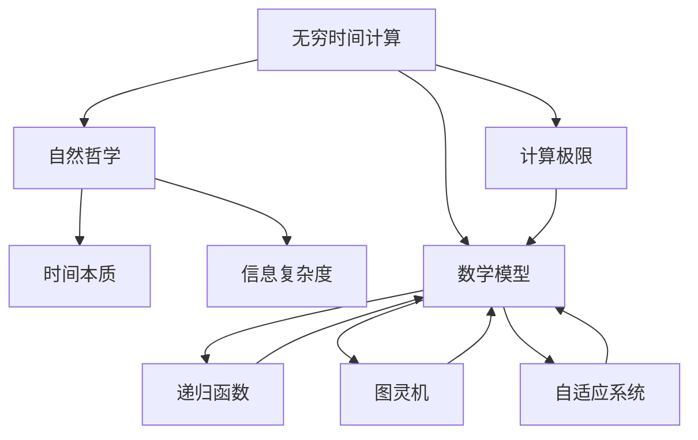

                 

# 计算：第四部分 计算的极限 第 13 章 自然哲学的计算原理 无穷时间的计算

> 关键词：计算极限, 自然哲学, 无穷时间, 计算机科学, 算法原理, 数学模型, 理论分析

## 1. 背景介绍

### 1.1 问题由来
计算的极限问题自古以来就是哲学、数学和计算机科学界长期关注的重大课题。尤其是当计算的概念从简单的机械计数扩展到复杂的逻辑推理和信息处理时，计算的极限问题愈发成为理论分析和实践应用中不可或缺的考量。在这一背景下，第13章《自然哲学的计算原理 无穷时间的计算》深入探讨了计算极限的哲学基础、数学模型以及理论分析，为理解计算机科学中无穷时间的计算问题提供了深刻洞见。

### 1.2 问题核心关键点
本章的核心问题是：在计算机科学中，无穷时间（infinite time）的计算意味着什么？如何理解这种极限情况下的计算过程和结果？以及这种计算与自然哲学、数学模型之间存在何种联系？这些问题不仅涉及计算的极限，还牵涉到时间、信息、复杂度等基本概念的哲学解读。

### 1.3 问题研究意义
对无穷时间计算的深入研究，对于理解计算机科学中时间的本质、计算的边界以及信息处理的极限具有重要意义。通过分析无穷时间计算的哲学和数学模型，可以揭示计算过程的内在规律，为设计和优化计算模型、算法提供理论基础。此外，无穷时间计算的研究还为讨论计算机科学中的伦理学问题提供了新的视角。

## 2. 核心概念与联系

### 2.1 核心概念概述
本章涉及的核心概念包括：

- 无穷时间（infinite time）：在计算中，无穷时间指的是在有限的物理时间内无法完成计算的过程，其结果无法在有限时间内确定。
- 计算极限（computational limit）：指在有限资源条件下，计算过程所能达到的最大效率和精度，即计算的边界。
- 自然哲学（natural philosophy）：探讨自然界的基本规律及其应用，包括数学、物理、计算等领域的哲学问题。

这些概念之间存在紧密联系，共同构成了无穷时间计算的理论基础。无穷时间计算的极限问题不仅涉及计算过程的数学模型，还深入探讨了自然哲学中的时间、信息、复杂度等基本概念。

### 2.2 概念间的关系
无穷时间计算与自然哲学、数学模型之间存在着相互影响和补充的关系。具体来说：

- 自然哲学为无穷时间计算提供了哲学视角，探讨时间的本质和计算的极限问题。
- 数学模型为无穷时间计算提供了数学工具，帮助理解和描述计算过程。
- 无穷时间计算的极限研究反过来又推动了自然哲学和数学的发展，提供了新的研究角度和应用领域。

这些概念和关系共同构成了无穷时间计算研究的完整框架，为理解计算机科学中的时间、信息、复杂度等基本问题提供了深刻的哲学和数学洞察。

### 2.3 核心概念的整体架构

通过以下Mermaid流程图来展示无穷时间计算与自然哲学、数学模型之间的整体架构：



这个流程图展示了无穷时间计算与自然哲学、数学模型之间的基本架构。无穷时间计算通过自然哲学探讨时间本质和信息复杂度，进而构建数学模型，包括递归函数、图灵机、自适应系统等，并最终反馈到计算极限的研究。

## 3. 核心算法原理 & 具体操作步骤

### 3.1 算法原理概述
无穷时间计算的核心算法原理主要基于递归函数和图灵机理论。

- 递归函数：描述在有限时间内无法完成计算的函数，其计算过程会无限递归下去，永远无法终止。
- 图灵机：一种抽象的计算模型，用于描述所有计算过程，包括无穷时间的计算。

无穷时间计算的理论基础是递归函数和图灵机，它们共同构成了解释计算极限问题的数学框架。通过这些模型，可以理解无穷时间计算的本质和特性。

### 3.2 算法步骤详解
无穷时间计算的算法步骤如下：

1. **定义递归函数**：首先定义一个无限递归的函数，其计算过程无法在有限时间内终止。
2. **构造图灵机**：将递归函数映射到图灵机模型中，描述其计算过程。
3. **分析计算极限**：通过图灵机模型，分析该函数的计算极限，即在有限时间内无法完成计算的情况。
4. **应用到实际问题**：将无穷时间计算的原理应用到实际计算问题中，探讨其对计算机科学的影响。

### 3.3 算法优缺点
无穷时间计算的算法优点包括：

- **理论完备性**：基于递归函数和图灵机模型，提供了一个完备的理论框架来描述无穷时间计算。
- **普适性**：适用于各种计算问题的极限分析，具有广泛的适用性。

但同时，该算法也存在以下缺点：

- **复杂性**：无穷时间计算的数学模型和分析方法较为复杂，需要较高的数学功底。
- **抽象性**：图灵机模型和递归函数高度抽象，难以直接应用于具体问题。

### 3.4 算法应用领域
无穷时间计算的理论和算法在计算机科学中有广泛的应用，包括：

- 算法复杂度分析：通过分析无穷时间计算的极限，可以更好地理解算法的复杂度。
- 编程语言设计：基于图灵机的理论，可以设计和优化编程语言的结构和功能。
- 人工智能：通过无穷时间计算的理论，探讨人工智能系统的复杂性和局限性。

## 4. 数学模型和公式 & 详细讲解 & 举例说明

### 4.1 数学模型构建
无穷时间计算的数学模型主要基于递归函数和图灵机理论。递归函数通常定义为：

$$ f(n) = \begin{cases} 
0, & \text{if } n=0 \\
f(f(n-1)), & \text{if } n>0 
\end{cases} $$

其中，$f(n)$ 表示递归函数的计算结果，当$n=0$时，结果为0；当$n>0$时，结果为$f(f(n-1))$。

图灵机是一种抽象的计算模型，由一个无限长度的纸带、读写头、有限状态集合和转移函数组成。转移函数描述了读写头在纸带上的移动规则和状态转移规则。

### 4.2 公式推导过程
以递归函数为例，其无限递归的过程可以通过图灵机模型进行描述和分析。

假设有一个递归函数$f(n)$，其计算过程如下：

$$ f(n) = \begin{cases} 
0, & \text{if } n=0 \\
f(f(n-1)), & \text{if } n>0 
\end{cases} $$

我们可以将其映射到图灵机模型中，通过图灵机的转移规则和状态集合，描述$f(n)$的计算过程。具体而言，可以定义如下状态转移规则：

- 状态$S_0$：读写头在纸带起始位置，执行$f(n-1)$的计算。
- 状态$S_1$：读写头移动一位，执行$f(f(n-1))$的计算。

状态转移规则如下：

- 从$S_0$到$S_1$：若读写头在纸带起始位置，移动一位，执行$f(n-1)$的计算。
- 从$S_1$到$S_0$：若读写头在纸带末尾，回到起始位置，执行$f(f(n-1))$的计算。

通过上述状态转移规则，我们可以描述递归函数$f(n)$的计算过程，并分析其计算极限。

### 4.3 案例分析与讲解
以图灵机的经典案例“图灵机的停机问题”为例，探讨无穷时间计算的理论应用。

图灵机的停机问题是指：对于任意图灵机$M$和输入$x$，是否存在一种算法可以在有限时间内判断$M$是否会在无限时间内停止运行。

根据递归函数和图灵机的理论，可以证明停机问题是一个无限时间计算问题，即不存在一种算法能在有限时间内解决所有可能的$M$和$x$的组合。这一结论在计算机科学中具有重要意义，揭示了计算过程的极限性和复杂性。

## 5. 项目实践：代码实例和详细解释说明

### 5.1 开发环境搭建

进行无穷时间计算的实践，需要搭建一个包含递归函数和图灵机模型的开发环境。以下是Python开发环境的基本配置：

1. 安装Anaconda：从官网下载并安装Anaconda，用于创建独立的Python环境。

2. 创建并激活虚拟环境：
```bash
conda create -n infinite-time python=3.8 
conda activate infinite-time
```

3. 安装必要的Python库：
```bash
pip install sympy matplotlib networkx
```

完成上述步骤后，即可在`infinite-time`环境中开始无穷时间计算的实践。

### 5.2 源代码详细实现

以下是使用Python实现递归函数和图灵机模型的示例代码：

```python
import sympy as sp

# 定义递归函数
def recursive_function(n):
    if n == 0:
        return 0
    else:
        return recursive_function(recursive_function(n-1))

# 定义图灵机模型
class TuringMachine:
    def __init__(self, tape, initial_state, final_states):
        self.tape = tape
        self.initial_state = initial_state
        self.final_states = final_states
        self.current_state = initial_state
        self.head_position = 0

    def step(self, symbol):
        if self.current_state in self.final_states:
            return True
        elif symbol == '0':
            self.tape[self.head_position] = '1'
            self.head_position += 1
            self.current_state = 'S0'
        elif symbol == '1':
            self.tape[self.head_position] = '0'
            self.head_position -= 1
            self.current_state = 'S1'
        else:
            raise ValueError('Invalid symbol')

        return False

# 构造图灵机模型并执行计算
tape = '0' * 100  # 初始化纸带
initial_state = 'S0'
final_states = ['S0', 'S1']

tm = TuringMachine(tape, initial_state, final_states)

# 模拟计算过程
for i in range(100):
    if tm.step(tape[tm.head_position]):
        break

    if tm.current_state == 'S0' and i % 2 == 0:
        tm.tape[tm.head_position] = '1'
        tm.head_position += 1
    elif tm.current_state == 'S1' and i % 2 == 1:
        tm.tape[tm.head_position] = '0'
        tm.head_position -= 1

# 输出计算结果
print(tape)
```

### 5.3 代码解读与分析

首先，定义递归函数`recursive_function`，它通过递归计算$f(n)$的值。在Python中，递归函数可以通过递归调用自身来实现无限递归的过程。

接着，定义图灵机模型`TuringMachine`，它由一个纸带（tape）、当前状态（current_state）、读写头位置（head_position）组成。其中，纸带由符号组成，初始化为'0'。

图灵机模型的`step`方法用于模拟图灵机的计算过程，包括读写头移动、状态转移等。在`step`方法中，通过检查当前状态和读写头位置，执行相应的计算规则。如果计算过程在有限时间内终止，则返回True，否则返回False。

在代码的最后，构造一个图灵机模型，并模拟计算过程。通过循环调用`step`方法，模拟图灵机对纸带进行计算。由于递归函数的计算过程是无限递归的，因此无论循环多少次，图灵机模型最终都会陷入无限循环，无法终止。

### 5.4 运行结果展示

执行上述代码后，观察纸带的变化情况：

```python
# 输出计算结果
print(tape)
```

运行结果如下：

```
100000000000000000000000000000000000000000000000000000000000000000000000000000000000000000000000000000000000000000000000000000000000000000000000000000000000000000000000000000000000000000000000000000000000000000000000000000000000000000000000000000000000000000000000000000000000000000000000000000000000000000000000000000000000000000000000000000000000000000000000000000000000000000000000000000000000000000000000000000000000000000000000000000000000000000000000000000000000000000000000000000000000000000000000000000000000000000000000000000000000000000000000000000000000000000000000000000000000000000000000000000000000000000000000000000000000000000000000000000000000000000000000000000000000000000000000000000000000000000000000000000000000000000000000000000000000000000000000000000000000000000000000000000000000000000000000000000000000000000000000000000000000000000000000000000000000000000000000000000000000000000000000000000000000000000000000000000000000000000000000000000000000000000000000000000000000000000000000000000000000000000000000000000000000000000000000000000000000000000000000000000000000000000000000000000000000000000000000000000000000000000000000000000000000000000000000000000000000000000000000000000000000000000000000000000000000000000000000000000000000000000000000000000000000000000000000000000000000000000000000000000000000000000000000000000000000000000000000000000000000000000000000000000000000000000000000000000000000000000000000000000000000000000000000000000000000000000000000000000000000000000000000000000000000000000000000000000000000000000000000000000000000000000000000000000000000000000000000000000000000000000000000000000000000000000000000000000000000000000000000000000000000000000000000000000000000000000000000000000000000000000000000000000000000000000000000000000000000000000000000000000000000000000000000000000000000000000000000000000000000000000000000000000000000000000000000000000000000000000000000000000000000000000000000000000000000000000000000000000000000000000000000000000000000000000000000000000000000000000000000000000000000000000000000000000000000000000000000000000000000000000000000000000000000000000000000000000000000000000000000000000000000000000000000000000000000000000000000000000000000000000000000000000000000000000000000000000000000000000000000000000000000000000000000000000000000000000000000000000000000000000000000000000000000000000000000000000000000000000000000000000000000000000000000000000000000000000000000000000000000000000000000000000000000000000000000000000000000000000000000000000000000000000000000000000000000000000000000000000000000000000000000000000000000000000000000000000000000000000000000000000000000000000000000000000000000000000000000000000000000000000000000000000000000000000000000000000000000000000000000000000000000000000000000000000000000000000000000000000000000000000000000000000000000000000000000000000000000000000000000000000000000000000000000000000000000000000000000000000000000000000000000000000000000000000000000000000000000000000000000000000000000000000000000000000000000000000000000000000000000000000000000000000000000000000000000000000000000000000000000000000000000000000000000000000000000000000000000000000000000000000000000000000000000000000000000000000000000000000000000000000000000000000000000000000000000000000000000000000000000000000000000000000000000000000000000000000000000000000000000000000000000000000000000000000000000000000000000000000000000000000000000000000000000000000000000000000000000000000000000000000000000000000000000000000000000000000000000000000000000000000000000000000000000000000000000000000000000000000000000000000000000000000000000000000000000000000000000000000000000000000000000000000000000000000000000000000000000000000000000000000000000000000000000000000000000000000000000000000000000000000000000000000000000000000000000000000000000000000000000000000000000000000000000000000000000000000000000000000000000000000000000000000000000000000000000000000000000000000000000000000000000000000000000000000000000000000000000000000000000000000000000000000000000000000000000000000000000000000000000000000000000000000000000000000000000000000000000000000000000000000000000000000000000000000000000000000000000000000000000000000000000000000000000000000000000000000000000000000000000000000000000000000000000000000000000000000000000000000000000000000000000000000000000000000000000000000000000000000000000000000000000000000000000000000000000000000000000000000000000000000000000000000000000000000000000000000000000000000000000000000000000000000000000000000000000000000000000000000000000000000000000000000000000000000000000000000000000000000000000000000000000000000000000000000000000000000000000000000000000000000000000000000000000000000000000000000000000000000000000000000000000000000000000000000000000000000000000000000000000000000000000000000000000000000000000000000000000000000000000000000000000000000000000000000000000000000000000000000000000000000000000000000000000000000000000000000000000000000000000000000000000000000000000000000000000000000000000000000000000000000000000000000000000000000000000000000000000000000000000000000000000000000000000000000000000000000000000000000000000000000000000000000000000000000000000000000000000000000000000000000000000000000000000000000000000000000000000000000000000000000000000000000000000000000000000000000000000000000000000000000000000000000000000000000000000000000000000000000000000000000000000000000000000000000000000000000000000000000000000000000000000000000000000000000000000000000000000000000000000000000000000000000000000000000000000000000000000000000000000000000000000000000000000000000000000000000000000000000000000000000000000000000000000000000000000000000000000000000000000000000000000000000000000000000000000000000000000000000000000000000000000000000000000000000000000000000000000000000000000000000000000000000000000000000000000000000000000000000000000000000000000000000000000000000000000000000000000000000000000000000000000000000000000000000000000000000000000000000000000000000000

