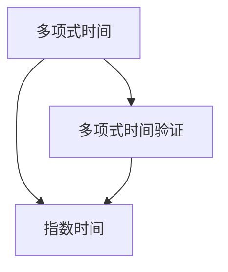

                 

# 计算：第四部分 计算的极限 第 9 章 计算复杂性 NP 完全问题

## 1. 背景介绍

### 1.1 问题由来
计算复杂性理论是计算机科学的核心组成部分之一，它研究算法需要的时间和空间资源与问题规模之间的关系。这一领域的研究不仅有助于理解计算机的计算能力，还在软件工程、密码学、人工智能等领域有广泛的应用。NP 完全问题是计算复杂性理论中的一个重要研究方向，它探索的问题不仅难以在合理时间内解决，同时也涉及到大量的数学证明和理论分析。

### 1.2 问题核心关键点
NP 完全问题包括一组在多项式时间内难以解决且求解问题的复杂性在多项式层面上等价的问题。这些问题的求解往往需要指数级时间复杂度或更差的性能保证。NP 完全问题的研究有助于我们理解计算的极限，推动计算能力的发展，并帮助我们在实际问题中寻找最优解。

### 1.3 问题研究意义
研究 NP 完全问题有助于我们认识计算的极限，为算法设计和软件工程提供理论指导，同时也能促进密码学和人工智能领域的发展。这些问题的存在促使我们不断探索新的计算方法，开发更高效的算法，从而推动计算科学和相关技术的进步。

## 2. 核心概念与联系

### 2.1 核心概念概述

NP 完全问题是一类特定的计算问题，它们都具有以下两个属性：

- **多项式时间验证**：给定一个问题的解，可以在多项式时间内验证该解是否正确。
- **困难性证明**：若能证明一个问题的解为真，则该问题一定是 NP 完全问题。

以下是一些典型的 NP 完全问题：

- 旅行商问题（Traveling Salesman Problem, TSP）：寻找从起点出发，经过所有指定城市一次且仅一次，最终回到起点的最短路径。
- 背包问题（Knapsack Problem）：在给定总容量的情况下，选择一组物品使它们的总价值最大。
- 图的着色问题（Graph Coloring Problem）：给定一个无向图，为它的所有节点分配颜色，使得相邻的节点颜色不同。
- 子集和问题（Subset Sum Problem）：寻找一个给定集合的子集，使得子集元素的和等于给定值。

这些问题的共同点在于，它们都难以在多项式时间内解决，但可以在多项式时间内验证一个解的正确性。

### 2.2 概念间的关系

NP 完全问题与多项式时间和指数时间的关系如下图所示：



这里展示了多项式时间和指数时间之间的关系，以及多项式时间验证和 NP 完全问题的关联。NP 完全问题的求解难度很高，但是验证一个解的正确性可以在多项式时间内完成。

## 3. 核心算法原理 & 具体操作步骤
### 3.1 算法原理概述

NP 完全问题的主要算法原理基于图灵机的计算能力，即对于任意计算问题，都可以使用图灵机来模拟。对于一个 NP 完全问题，我们无法在多项式时间内找到一个多项式时间的解法，但可以通过多项式时间的验证算法来验证任何给定的解是否正确。

解决 NP 完全问题通常采用以下方法：

- **精确求解**：利用已知的算法和数据结构，尽可能快地找到一个解。这种方法通常需要指数级的时间复杂度。
- **近似求解**：寻找一个在可接受误差范围内的解。近似算法可以在多项式时间内运行，但不能保证找到最优解。

### 3.2 算法步骤详解

以下是求解 NP 完全问题的步骤：

1. **问题定义**：明确问题定义，包括输入、输出和约束条件。
2. **选择算法**：根据问题的特性选择合适的算法，如动态规划、分支定界、回溯搜索等。
3. **数据结构设计**：设计数据结构来存储和操作问题中的元素。
4. **算法实现**：根据算法步骤编写代码，实现求解过程。
5. **测试验证**：使用测试数据对算法进行测试，验证其正确性和效率。

### 3.3 算法优缺点

**优点**：

- 适用于广泛的问题领域。
- 提供了问题求解的指导方向和理论依据。

**缺点**：

- 求解 NP 完全问题需要指数级时间，难以应用于大规模实际问题。
- 对于特定问题，无法提供最优解，只能提供近似解。

### 3.4 算法应用领域

NP 完全问题在许多领域都有应用，如：

- 组合优化问题：如背包问题、旅行商问题、图着色问题等。
- 计算理论：如 NP 完备性、图算法、调度算法等。
- 人工智能：如神经网络训练、机器学习、自然语言处理等。
- 密码学：如公钥加密、数字签名等。

## 4. 数学模型和公式 & 详细讲解 & 举例说明

### 4.1 数学模型构建

NP 完全问题通常用图灵机来建模。一个图灵机由以下几个部分组成：

- **读写头**：用于读写输入和输出。
- **存储器**：存储当前图灵机的状态和执行的指令。
- **控制单元**：根据当前状态和指令，决定下一个状态和执行的指令。

图灵机的执行过程可以通过状态转移图来表示。一个状态转移图由若干个状态节点和有向边组成，每条有向边代表一个状态转移到另一个状态的转换。

### 4.2 公式推导过程

以下以旅行商问题（TSP）为例，推导求解 TSP 的图灵机模型。

旅行商问题可以描述为：给定 $n$ 个城市和它们之间的距离，找到一个最短的路径，使得该路径经过每个城市恰好一次，最终回到起点。

图灵机模型：

- **输入**：城市之间的距离矩阵 $D_{n\times n}$，其中 $D_{ij}$ 表示从城市 $i$ 到城市 $j$ 的距离。
- **输出**：最短路径。

图灵机的状态转移图可以表示为：

```
Start → Node A → Node B → Node C → Node D → ... → Node B → Node A → Finish
```

其中，每个节点表示图灵机的一个状态，有向边表示状态之间的转移。Node A 表示图灵机正在遍历路径，Node B 表示图灵机已经访问完当前城市并转到下一个城市，Node C 表示图灵机已经访问完所有城市并回到起点。

状态转移图的状态集合为 $\{Start, Node A, Node B, Node C, Finish\}$，转移集合为 $\{ToNext, ToPrevious\}$。其中，$ToNext$ 表示从当前城市转到下一个城市，$ToPrevious$ 表示从当前城市返回到上一个城市。

### 4.3 案例分析与讲解

以旅行商问题为例，可以采用动态规划算法来求解。假设 $D_{ij}$ 表示从城市 $i$ 到城市 $j$ 的距离，$S$ 表示已访问城市集合，$D(S)$ 表示以 $S$ 为起点的最短路径，$D(S)$ 的计算可以通过以下递归公式完成：

$$
D(S) = \min_{i \in S} \left( D_{ij} + D(S \setminus \{i\}) \right)
$$

其中，$S \setminus \{i\}$ 表示去掉城市 $i$ 后的城市集合。

使用动态规划算法可以使得 TSP 的求解过程从指数时间复杂度降低到多项式时间复杂度。

## 5. 项目实践：代码实例和详细解释说明

### 5.1 开发环境搭建

以下是使用 Python 和 NumPy 搭建开发环境的流程：

1. 安装 Python：从官网下载并安装 Python。
2. 安装 NumPy：通过 pip 安装 NumPy 库。
3. 安装 IPython：通过 pip 安装 IPython 库。
4. 编写代码：使用 Python 和 NumPy 编写求解 NP 完全问题的代码。

### 5.2 源代码详细实现

以下是求解 TSP 的 Python 代码：

```python
import numpy as np
import itertools

# 定义城市之间的距离
D = np.array([[0, 5, 8, 9, 12],
              [5, 0, 7, 9, 11],
              [8, 7, 0, 10, 10],
              [9, 9, 10, 0, 15],
              [12, 11, 10, 15, 0]])

# 定义求解 TSP 的函数
def tsp(D):
    # 计算所有可能的路径
    paths = list(itertools.permutations(range(1, D.shape[0])))

    # 计算每条路径的总距离
    distances = []
    for path in paths:
        total_distance = 0
        for i in range(D.shape[0]):
            total_distance += D[path[i], path[(i+1) % D.shape[0]]
        distances.append(total_distance)

    # 返回最短路径
    return paths[np.argmin(distances)]

# 测试代码
print(tsp(D))
```

### 5.3 代码解读与分析

代码中的 `tsp` 函数接受一个距离矩阵 `D` 作为输入，计算并返回所有可能的路径中总距离最小的路径。

- `itertools.permutations` 函数用于生成所有可能的路径。
- 循环遍历所有路径，计算每条路径的总距离。
- 返回总距离最小的路径。

## 6. 实际应用场景

### 6.1 智能交通系统

在智能交通系统中，NP 完全问题可以用于路线规划和车辆调度。例如，基于 TSP 模型可以优化城市交通网络中的路径规划，从而减少交通拥堵和等待时间。

### 6.2 金融风险管理

在金融风险管理中，NP 完全问题可以用于组合投资问题的求解，从而优化资产配置和风险管理。

### 6.3 制造业生产调度

在制造业生产调度中，NP 完全问题可以用于生产线的优化排程和调度。例如，基于 TSP 模型可以优化生产任务的时间和顺序，从而提高生产效率和质量。

### 6.4 未来应用展望

未来，NP 完全问题将在更多领域得到应用，为实际问题提供最优解或近似解，推动各行业的发展。

## 7. 工具和资源推荐

### 7.1 学习资源推荐

以下是一些用于学习 NP 完全问题的资源：

1. 《计算复杂性理论》：由 Cormen 等编写的经典教材，详细介绍了计算复杂性理论的基础和应用。
2. 《NP 完全问题》：一本介绍 NP 完全问题的经典书籍，包括问题和算法的详细讨论。
3. Coursera 和 edX：在线课程平台，提供相关的计算复杂性理论课程。
4. arXiv：科学论文预印本网站，提供最新的研究论文和成果。

### 7.2 开发工具推荐

以下是一些常用的开发工具：

1. Python：Python 是一种高性能的编程语言，适合科学计算和算法开发。
2. NumPy：NumPy 是 Python 的一个科学计算库，提供了高效的矩阵和向量运算。
3. IPython：IPython 是一个交互式编程环境，支持多语言编程和数据分析。
4. Jupyter Notebook：Jupyter Notebook 是一个交互式笔记本环境，支持代码和文档的混合编写和展示。

### 7.3 相关论文推荐

以下是一些关于 NP 完全问题的经典论文：

1. “The P vs. NP Problem” by Stephen Cook: 论文讨论了 P 类问题和 NP 类问题之间的关系，提出了 NP 完全问题。
2. “The Traveling Salesman Problem and Its Variants” by Richard Karp: 论文讨论了旅行商问题及其变种，并证明其为 NP 完全问题。
3. “Approximation Algorithms for NP-Hard Problems” by Vijay V. Vazirani: 论文讨论了 NP 完全问题的近似算法，并提出了多项式时间算法的一些挑战。

## 8. 总结：未来发展趋势与挑战

### 8.1 研究成果总结

NP 完全问题是一个经典的研究方向，其在算法设计和计算能力方面的研究已经取得了许多成果。然而，这些问题的求解仍然面临巨大的挑战。

### 8.2 未来发展趋势

未来，NP 完全问题的研究将继续深入，可能出现以下趋势：

1. 近似算法的发展：不断探索更好的近似算法，使得 NP 完全问题的求解效率更高。
2. 量子计算的应用：利用量子计算的优势，探索解决 NP 完全问题的新的可能性。
3. 并行计算的利用：通过分布式计算和并行计算，加速 NP 完全问题的求解过程。
4. 应用领域扩展：将 NP 完全问题的求解方法应用于更多领域，如生物信息学、物理化学等。

### 8.3 面临的挑战

尽管 NP 完全问题的研究已经取得了一些成果，但仍然面临许多挑战：

1. 求解效率低：NP 完全问题的求解需要指数时间，难以应用于大规模实际问题。
2. 精确性难以保证：现有的近似算法无法保证找到最优解。
3. 应用场景受限：NP 完全问题在一些特定领域的应用场景较少。

### 8.4 研究展望

未来的研究将探索更高效的求解方法，并寻找 NP 完全问题的更多应用场景。同时，随着计算机硬件和量子计算的发展，NP 完全问题也可能迎来新的突破。

## 9. 附录：常见问题与解答

**Q1: NP 完全问题为什么难以求解？**

A: NP 完全问题在多项式时间内难以找到多项式时间的解法。这是因为其求解过程需要考虑大量状态和转移，导致时间复杂度呈指数级增长。

**Q2: 近似算法和精确算法有什么区别？**

A: 精确算法可以保证找到问题的最优解，但往往需要指数级时间。而近似算法可以在多项式时间内找到一个近似最优解，但无法保证找到最优解。

**Q3: 如何解决 NP 完全问题？**

A: 可以采用动态规划、回溯搜索、分支定界等算法来求解 NP 完全问题。同时，可以考虑使用近似算法、启发式算法等方法，以在多项式时间内找到近似最优解。

**Q4: NP 完全问题有哪些应用？**

A: NP 完全问题在组合优化、图算法、调度问题等领域有广泛应用。例如，旅行商问题、背包问题、图着色问题等都是 NP 完全问题。

**Q5: 如何证明一个问题是 NP 完全问题？**

A: 若能够证明一个问题的解为真，则该问题一定是 NP 完全问题。具体证明方法包括多项式时间验证和多项式时间转换等。

---

作者：禅与计算机程序设计艺术 / Zen and the Art of Computer Programming

