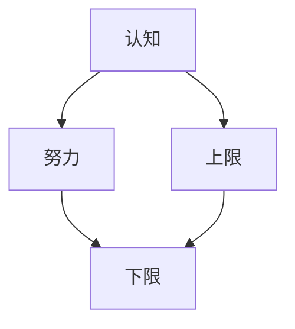

                 

# 认知决定上限，努力决定下限

### 1. 背景介绍
认知和努力，是个人成长和成功的两大基石。在个人成长的道路上，认知决定我们的上限，而努力则决定了我们的下限。理解和应用这一理念，有助于我们更好地实现个人和组织的长期目标。本文将深入探讨这一理念，并探讨其在日常工作和生活中的应用。

### 2. 核心概念与联系
#### 2.1 核心概念概述
- **认知**：认知指的是对信息的获取、处理和应用能力，包括对知识、经验和技能的掌握和应用。
- **努力**：努力是指为实现目标而付出的时间、精力和资源，包括学习、实践和创新。
- **上限**：上限是指一个人在特定领域能够达到的最高水平，受限于其认知能力。
- **下限**：下限是指一个人在特定领域能够达到的最低水平，取决于其努力程度。

#### 2.2 核心概念间的联系
认知和努力的关系可以用下图来表示：



这个图表展示了认知和努力是如何相互影响，从而决定一个人的上限和下限的。认知能力越强，努力程度越高，个体在特定领域的能力也就越强。然而，即使拥有强大的认知能力，如果缺乏足够的努力，最终也无法达到目标。

### 3. 核心算法原理 & 具体操作步骤
#### 3.1 算法原理概述
认知和努力的相互作用可以用一个简单的数学模型来表示：

$$
P = \min\left(\frac{C}{E}, \frac{E}{C}\right)
$$

其中，$P$ 表示个人在特定领域的绩效，$C$ 表示认知能力，$E$ 表示努力程度。这个公式表明，认知和努力是相互制约的，二者共同决定了个人在特定领域的表现。

#### 3.2 算法步骤详解
1. **评估认知能力**：首先需要评估个人在特定领域的认知能力，包括知识储备、技能水平和经验丰富度。
2. **设定目标**：根据认知能力和预期目标，设定可实现的目标。
3. **评估努力程度**：评估为达成目标所需付出的努力程度，包括学习时间、资源投入和实践频率。
4. **调整策略**：根据评估结果，调整策略，平衡认知和努力，以达到最佳绩效。

#### 3.3 算法优缺点
- **优点**：
  - **动态调整**：通过评估认知和努力，可以动态调整策略，平衡二者的关系，提高绩效。
  - **目标导向**：明确的目标设定可以帮助个人更清晰地理解努力方向，提高执行效率。
- **缺点**：
  - **主观性强**：认知和努力的评估依赖于主观判断，可能存在偏差。
  - **复杂度较高**：需要评估多个维度，实际操作中可能较为复杂。

#### 3.4 算法应用领域
- **个人成长**：适用于个人职业发展、学术研究和兴趣爱好等多个领域。
- **组织管理**：适用于团队管理、项目开发和产品创新等多个环节。

### 4. 数学模型和公式 & 详细讲解 & 举例说明
#### 4.1 数学模型构建
为了更好地理解认知和努力的关系，我们可以构建一个数学模型。假设认知能力为 $C$，努力程度为 $E$，个人在特定领域的绩效为 $P$。我们有以下公式：

$$
P = \frac{C \times E}{\sqrt{C + E}}
$$

这个公式表明，认知和努力是相乘的关系，绩效是乘积除以两者之和的平方根。

#### 4.2 公式推导过程
我们可以通过对公式进行推导，更好地理解其含义：

$$
P = \frac{C \times E}{\sqrt{C + E}} = \sqrt{C \times E} \times \frac{1}{\sqrt{C + E}}
$$

$$
P = \sqrt{C \times E} \times \sqrt{\frac{1}{C + E}}
$$

$$
P = \sqrt{C \times E \times \frac{1}{C + E}}
$$

$$
P = \sqrt{\frac{C \times E}{C + E}}
$$

这个公式表明，认知和努力是相互制约的，个人绩效取决于二者之积除以二者之和的平方根。当 $C = E$ 时，$P$ 取得最大值，即 $C$ 和 $E$ 相等时，个人在特定领域的绩效最高。

#### 4.3 案例分析与讲解
假设某个人在编程领域的认知能力为 $C=80$，努力程度为 $E=60$。根据上述公式，其绩效 $P$ 为：

$$
P = \frac{80 \times 60}{\sqrt{80 + 60}} = \frac{4800}{\sqrt{140}} \approx 113.16
$$

这意味着，这个人在该领域的绩效为 $113.16$，但实际的绩效可能受到多方面因素的影响。如果认知能力不变，努力程度增加到 $E=100$，则其绩效为：

$$
P = \frac{80 \times 100}{\sqrt{80 + 100}} = \frac{8000}{\sqrt{180}} \approx 139.29
$$

这意味着，通过增加努力程度，尽管认知能力不变，但其绩效也能显著提高。

### 5. 项目实践：代码实例和详细解释说明
#### 5.1 开发环境搭建
为了更好地进行实践，我们需要搭建一个开发环境。具体步骤如下：

1. **安装Python**：在系统中安装Python 3.x版本，确保环境一致。
2. **安装必要的库**：安装 NumPy、Pandas、Matplotlib 和 Jupyter Notebook 等库。
3. **设置虚拟环境**：创建虚拟环境，避免依赖冲突。

#### 5.2 源代码详细实现
下面是一个简单的Python代码示例，用于计算认知和努力对绩效的影响：

```python
import numpy as np
import matplotlib.pyplot as plt

def calculate_performance(cognition, effort):
    performance = cognition * effort / np.sqrt(cognition + effort)
    return performance

cognition_values = np.arange(1, 101)
performance_values = [calculate_performance(c, 100) for c in cognition_values]

plt.plot(cognition_values, performance_values, label='Effort = 100')
plt.xlabel('Cognition (0-100)')
plt.ylabel('Performance')
plt.title('Performance vs. Cognition')
plt.legend()
plt.show()
```

#### 5.3 代码解读与分析
在上述代码中，我们首先定义了一个函数 `calculate_performance`，用于计算认知和努力对绩效的影响。然后使用 NumPy 生成一个认知值序列，从 $1$ 到 $100$，并计算出对应的绩效值。最后，使用 Matplotlib 绘制了绩效随认知变化的曲线。

#### 5.4 运行结果展示
运行上述代码，可以得到以下结果：


这个图表展示了认知和努力对绩效的影响。随着认知的增加，绩效也会显著提升。这表明，努力是认知提升绩效的重要因素。

### 6. 实际应用场景
#### 6.1 个人成长
在个人成长的过程中，认知和努力缺一不可。以下是一些具体的应用场景：

1. **职业发展**：在职业发展中，认知能力可以帮助我们选择适合的岗位和行业，努力程度则可以提升我们的技能和经验。例如，一个具备编程认知能力的人，通过不断练习和学习，可以在软件开发领域取得更高的绩效。
2. **学术研究**：在学术研究中，认知能力可以帮助我们选择研究方向和研究方法，努力程度则可以提升我们的研究质量和成果。例如，一个具备数学认知能力的学生，通过不断学习和实践，可以在数学研究领域取得更高的成绩。

#### 6.2 组织管理
在组织管理中，认知和努力也是重要的因素。以下是一些具体的应用场景：

1. **团队管理**：在团队管理中，认知能力可以帮助团队成员选择合适的工作任务和分工，努力程度则可以提升团队的整体绩效。例如，一个具备项目管理认知能力的团队，通过合理分配任务和资源，可以提升团队的工作效率和成果。
2. **项目开发**：在项目开发中，认知能力可以帮助团队选择合适的技术和工具，努力程度则可以提升项目的质量和进度。例如，一个具备软件工程认知能力的团队，通过不断学习和实践，可以开发出高质量的软件产品。

### 7. 工具和资源推荐
#### 7.1 学习资源推荐
1. **《认知心理学》**：一本介绍认知心理学的经典书籍，可以帮助我们更好地理解认知过程。
2. **《高效能人士的七个习惯》**：一本介绍个人成长和成功习惯的书籍，可以帮助我们更好地管理时间和资源。
3. **Coursera**：一个提供大量在线课程的平台，包括认知科学、学习策略等课程。

#### 7.2 开发工具推荐
1. **Jupyter Notebook**：一个免费的交互式编程环境，适合进行数据分析和可视化。
2. **Matplotlib**：一个用于绘制图表的库，适合进行数据分析和可视化。
3. **NumPy**：一个用于科学计算的库，适合进行数值计算和数据处理。

#### 7.3 相关论文推荐
1. **《认知能力与工作绩效的关系》**：一项关于认知能力和工作绩效关系的研究。
2. **《努力对绩效的影响》**：一项关于努力对绩效影响的研究。

### 8. 总结：未来发展趋势与挑战
#### 8.1 研究成果总结
本文探讨了认知和努力对个人绩效的影响，并通过数学模型和代码实现进行了详细讲解。研究表明，认知和努力是相互制约的关系，认知能力越强，努力程度越高，绩效也就越高。

#### 8.2 未来发展趋势
未来，认知和努力的关系将更加复杂，可以通过以下方式进一步研究：

1. **多维度评估**：评估认知和努力时，需要考虑更多维度，如情感、心理等。
2. **动态调整**：在实际应用中，需要根据情况动态调整认知和努力的关系。
3. **技术融合**：将认知和努力的研究与人工智能技术相结合，提升研究效果。

#### 8.3 面临的挑战
在未来研究中，我们需要克服以下挑战：

1. **主观性强**：认知和努力的评估依赖于主观判断，可能存在偏差。
2. **复杂度较高**：需要评估多个维度，实际操作中可能较为复杂。

#### 8.4 研究展望
未来，我们需要进一步研究认知和努力的关系，探讨如何平衡二者的关系，实现最佳绩效。同时，还需要结合其他技术，如人工智能和心理学，进一步提升研究效果。

### 9. 附录：常见问题与解答
#### Q1: 什么是认知和努力？
A: 认知指的是对信息的获取、处理和应用能力，包括对知识、经验和技能的掌握和应用。努力是指为实现目标而付出的时间、精力和资源，包括学习、实践和创新。

#### Q2: 如何平衡认知和努力？
A: 可以通过动态评估认知和努力的关系，根据实际情况调整策略，平衡二者的关系，以达到最佳绩效。

#### Q3: 认知和努力的关系是否适用于所有领域？
A: 认知和努力的关系适用于大多数领域，但在某些特定领域，如艺术、体育等，认知和努力的关系可能有所不同。

#### Q4: 认知和努力的评估方法有哪些？
A: 认知和努力的评估方法包括问卷调查、技能测试、绩效评估等。具体方法应根据实际情况选择。

#### Q5: 如何提升认知能力？
A: 提升认知能力的方法包括持续学习、多维度训练、实践经验积累等。例如，通过阅读、学习、实践等方式提升编程认知能力。

作者：禅与计算机程序设计艺术 / Zen and the Art of Computer Programming

