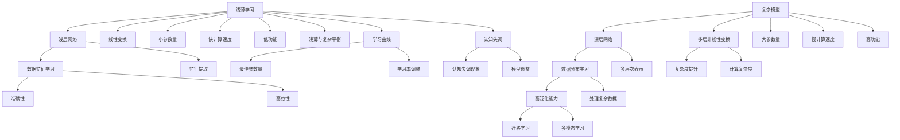
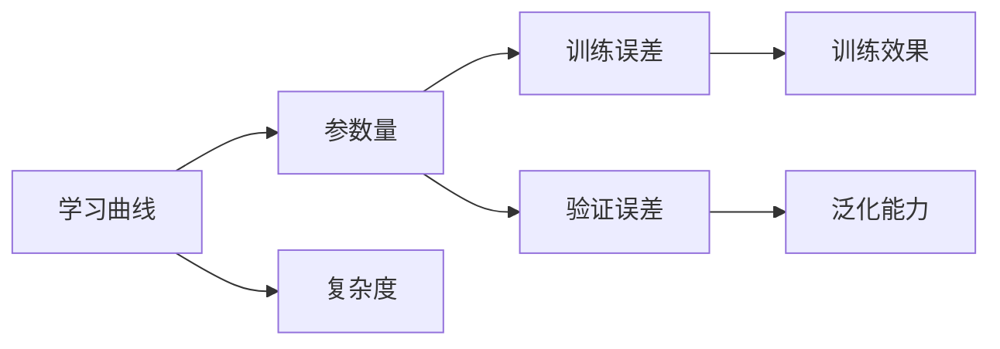
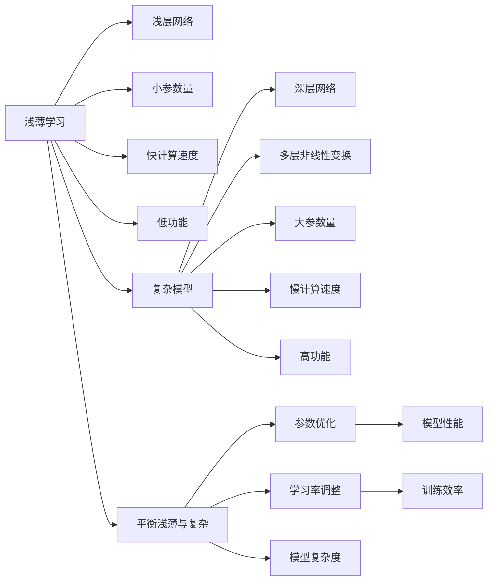
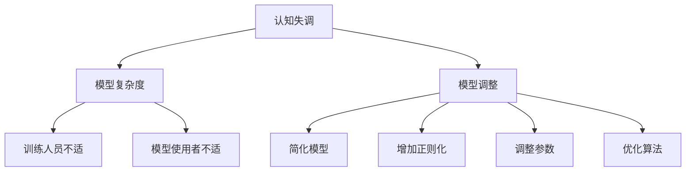
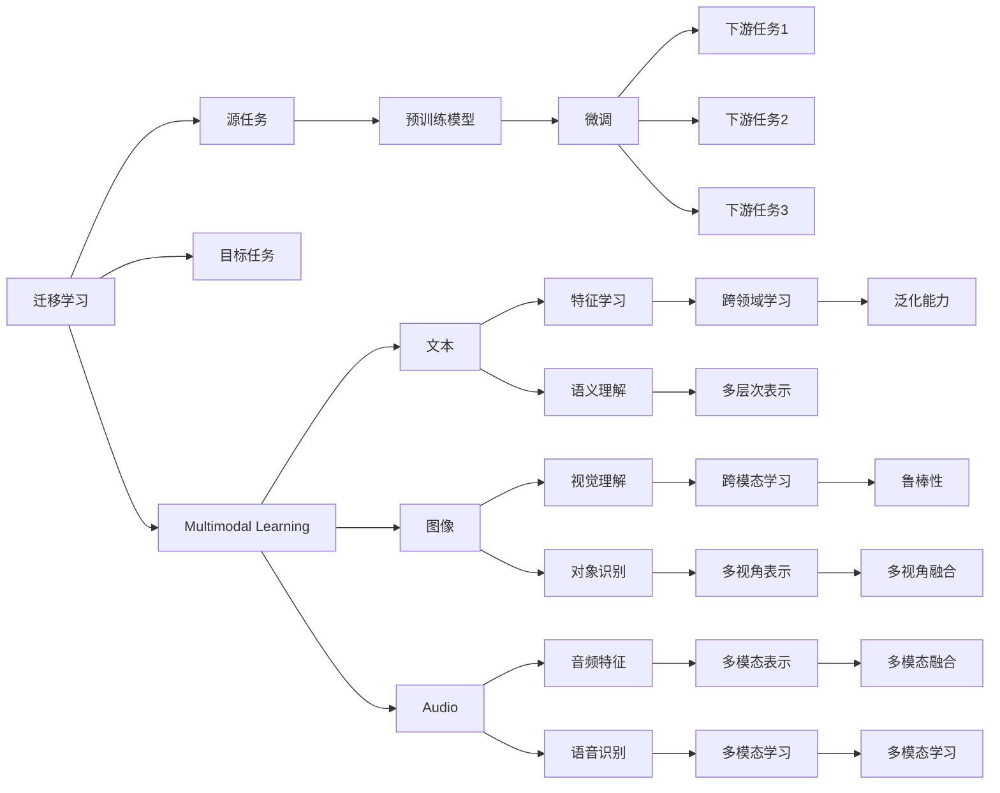
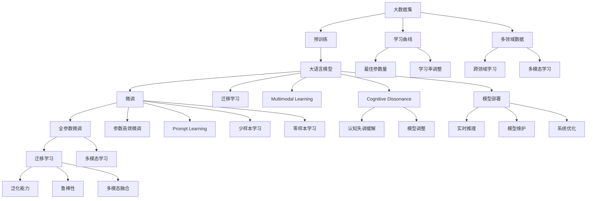

                 

# 认知发展中的浅薄与复杂

> 关键词：认知发展, 深度学习, 浅薄学习, 复杂模型, 学习曲线, 认知失调, 迁移学习, 多模态学习

## 1. 背景介绍

### 1.1 问题由来

在人工智能飞速发展的当下，深度学习模型在诸多领域取得了令人瞩目的成就。然而，随着模型参数量的激增，模型的深度和复杂度不断上升，学习任务也逐渐从浅层浅薄学习转向深度复杂学习。

本研究旨在探讨这种深度认知发展对模型性能、训练和推理过程、甚至模型部署和使用造成的影响，并探索如何在深度认知发展的背景下，高效构建与训练模型，实现认知发展中的浅薄与复杂之间的平衡。

### 1.2 问题核心关键点

- **浅薄与复杂之间的平衡**：如何平衡模型的浅薄度和复杂度，以提升模型性能和效率，同时避免认知失调。
- **学习曲线**：深度学习模型的学习曲线变化规律，以及如何通过参数优化和学习率调整，达到最佳学习效果。
- **迁移学习与多模态学习**：如何在跨领域和多模态数据上进行有效的迁移学习，从而降低训练成本，提升模型泛化能力。
- **认知失调**：模型复杂度高时，可能引发的认知失调现象，如何避免。

### 1.3 问题研究意义

探讨深度认知发展背景下的浅薄与复杂平衡问题，对于构建高效、稳健的深度学习模型具有重要意义：

- 帮助理解深度学习模型在实际应用中的性能瓶颈和挑战。
- 提供关于模型设计、参数优化和训练策略的指导，提升模型训练效率和效果。
- 助力在认知发展中，正确理解模型复杂度与浅薄度之间的关系，构建更合理的模型。
- 促进模型应用领域的扩展，将深度学习应用于更广泛的任务，如自然语言处理、计算机视觉、机器人等领域。

## 2. 核心概念与联系

### 2.1 核心概念概述

- **浅薄学习(Shallow Learning)**：指基于浅层网络结构，通过简单的线性变换完成学习任务的模型。通常参数量少，计算速度快，但功能有限。

- **复杂模型(Deep Learning)**：指基于深层网络结构，通过多层非线性变换完成学习任务的模型。通常参数量大，计算速度慢，但功能强大。

- **学习曲线(Learning Curve)**：描述模型在不同参数量下，训练误差和验证误差的变化趋势。反映了模型性能随复杂度变化的规律。

- **认知失调(Cognitive Dissonance)**：在模型训练和推理过程中，当模型的深度和复杂度超过某个临界点时，训练人员和模型使用者可能感到困惑和不适，难以理解和处理。

- **迁移学习(Transfer Learning)**：指通过已训练好的模型参数在新任务上进行微调，以降低新任务训练成本，提升模型泛化能力。

- **多模态学习(Multimodal Learning)**：指同时利用多种数据类型（如文本、图像、音频等）进行学习，从而构建更全面、鲁棒的模型。

这些核心概念之间的逻辑关系可以通过以下Mermaid流程图来展示：



这个流程图展示了大语言模型的核心概念及其之间的关系：

1. 浅薄学习和复杂模型是深度学习模型的两种极端形式，浅薄学习适用于数据量和功能需求较小的场景，复杂模型则适用于数据量大且功能需求高的场景。
2. 学习曲线反映了模型复杂度与性能之间的变化趋势，帮助优化模型参数。
3. 认知失调在模型复杂度超过某个临界点时可能出现，需要通过模型调整缓解。
4. 迁移学习和多模态学习提升了模型在跨领域和多样数据上的泛化能力。

### 2.2 概念间的关系

这些核心概念之间存在着紧密的联系，形成了深度学习模型的完整生态系统。下面我们通过几个Mermaid流程图来展示这些概念之间的关系。

#### 2.2.1 深度认知发展的学习曲线



这个流程图展示了学习曲线与模型参数之间的关系，反映了模型性能随复杂度变化的规律。

#### 2.2.2 浅薄与复杂之间的平衡



这个流程图展示了如何在浅薄与复杂之间进行平衡，以及通过参数优化和学习率调整达到最佳性能。

#### 2.2.3 认知失调与模型调整



这个流程图展示了认知失调现象及其缓解方法，帮助在模型复杂度较高时，优化模型的训练和推理过程。

#### 2.2.4 迁移学习与多模态学习



这个流程图展示了迁移学习和多模态学习的基本原理，以及其在不同领域和多模态数据上的应用。

### 2.3 核心概念的整体架构

最后，我们用一个综合的流程图来展示这些核心概念在大语言模型微调过程中的整体架构：



这个综合流程图展示了从预训练到微调，再到迁移学习和多模态学习，最后到模型部署的完整过程。大语言模型首先在大规模数据上进行预训练，然后通过微调（包括全参数微调和参数高效微调）或迁移学习适应不同任务，使用多模态学习进一步提升模型泛化能力，最后部署到实际应用中。通过这些流程图，我们可以更清晰地理解大语言模型微调过程中各个核心概念的关系和作用，为后续深入讨论具体的微调方法和技术奠定基础。

## 3. 核心算法原理 & 具体操作步骤
### 3.1 算法原理概述

深度学习模型的浅薄与复杂平衡问题，本质上是一个模型设计和参数优化的过程。其核心思想是：通过选择合适的模型结构（浅薄或复杂）和优化方法，使得模型在保持一定浅薄度的情况下，尽可能发挥其复杂性带来的优势，同时避免认知失调。

形式化地，假设深度学习模型为 $M_{\theta}$，其中 $\theta$ 为模型参数。在训练过程中，通过选择不同的网络层数和节点数，平衡模型的浅薄度和复杂度，设定合适的学习率和正则化强度，最小化损失函数 $\mathcal{L}$，使得模型输出逼近真实标签。

对于浅薄模型，可以通过简单的线性变换完成学习任务，如线性回归、逻辑回归等；而对于复杂模型，则通过多层非线性变换完成学习任务，如卷积神经网络(CNN)、递归神经网络(RNN)、Transformer等。

### 3.2 算法步骤详解

基于浅薄与复杂平衡的深度学习模型微调，一般包括以下几个关键步骤：

**Step 1: 准备数据集**
- 选择合适的数据集进行预训练，如ImageNet、Wikipedia等。
- 进行数据增强和预处理，如数据扩充、归一化、标准化等。

**Step 2: 选择模型架构**
- 根据任务类型，选择合适的模型架构，如浅层神经网络、深层神经网络、卷积神经网络、递归神经网络等。
- 确定网络层数、节点数、激活函数等关键参数。

**Step 3: 设定优化器和损失函数**
- 选择合适的优化器（如SGD、Adam、RMSprop等）及其参数，如学习率、动量等。
- 设定合适的损失函数（如交叉熵、均方误差等），反映模型输出与真实标签之间的差异。

**Step 4: 训练模型**
- 将训练集数据分批次输入模型，前向传播计算损失函数。
- 反向传播计算参数梯度，根据设定的优化算法更新模型参数。
- 周期性在验证集上评估模型性能，根据性能指标决定是否触发Early Stopping。
- 重复上述步骤直到满足预设的迭代轮数或Early Stopping条件。

**Step 5: 测试和部署**
- 在测试集上评估微调后模型 $M_{\hat{\theta}}$ 的性能，对比微调前后的精度提升。
- 使用微调后的模型对新样本进行推理预测，集成到实际的应用系统中。
- 持续收集新的数据，定期重新微调模型，以适应数据分布的变化。

以上是基于浅薄与复杂平衡的深度学习模型微调的一般流程。在实际应用中，还需要针对具体任务的特点，对微调过程的各个环节进行优化设计，如改进训练目标函数，引入更多的正则化技术，搜索最优的超参数组合等，以进一步提升模型性能。

### 3.3 算法优缺点

基于浅薄与复杂平衡的深度学习模型微调方法具有以下优点：

1. 灵活多样：根据具体任务和数据特点，可以灵活选择浅薄或复杂模型，适应不同的应用场景。
2. 性能优越：复杂模型能够学习更丰富的特征表示，提高模型泛化能力和准确性。
3. 训练高效：浅薄模型通常参数量少，计算速度快，训练时间短，适合大规模数据集。
4. 应用广泛：浅薄与复杂平衡的模型能够在各种NLP、计算机视觉、机器人等任务中取得优异效果。

同时，该方法也存在一定的局限性：

1. 需要更多标注数据：复杂模型通常参数量大，训练需要更多标注数据。
2. 过拟合风险高：复杂模型容易出现过拟合现象，需要更多正则化技术防止过拟合。
3. 计算资源需求高：复杂模型计算复杂度大，需要高性能计算资源。
4. 可解释性差：复杂模型通常难以解释其内部工作机制，影响模型的可解释性和可信度。

尽管存在这些局限性，但就目前而言，基于浅薄与复杂平衡的微调方法仍然是大语言模型应用的主流范式。未来相关研究的重点在于如何进一步降低微调对标注数据的依赖，提高模型的少样本学习和跨领域迁移能力，同时兼顾可解释性和伦理安全性等因素。

### 3.4 算法应用领域

基于浅薄与复杂平衡的深度学习模型微调方法，在NLP领域已经得到了广泛的应用，覆盖了几乎所有常见任务，例如：

- 文本分类：如情感分析、主题分类、意图识别等。通过微调使模型学习文本-标签映射。
- 命名实体识别：识别文本中的人名、地名、机构名等特定实体。通过微调使模型掌握实体边界和类型。
- 关系抽取：从文本中抽取实体之间的语义关系。通过微调使模型学习实体-关系三元组。
- 问答系统：对自然语言问题给出答案。将问题-答案对作为微调数据，训练模型学习匹配答案。
- 机器翻译：将源语言文本翻译成目标语言。通过微调使模型学习语言-语言映射。
- 文本摘要：将长文本压缩成简短摘要。将文章-摘要对作为微调数据，使模型学习抓取要点。
- 对话系统：使机器能够与人自然对话。将多轮对话历史作为上下文，微调模型进行回复生成。

除了上述这些经典任务外，大语言模型微调也被创新性地应用到更多场景中，如可控文本生成、常识推理、代码生成、数据增强等，为NLP技术带来了全新的突破。随着预训练模型和微调方法的不断进步，相信NLP技术将在更广阔的应用领域大放异彩。

## 4. 数学模型和公式 & 详细讲解  
### 4.1 数学模型构建

本节将使用数学语言对基于浅薄与复杂平衡的深度学习模型微调过程进行更加严格的刻画。

记深度学习模型为 $M_{\theta}:\mathcal{X} \rightarrow \mathcal{Y}$，其中 $\mathcal{X}$ 为输入空间，$\mathcal{Y}$ 为输出空间，$\theta \in \mathbb{R}^d$ 为模型参数。假设微调任务的训练集为 $D=\{(x_i,y_i)\}_{i=1}^N, x_i \in \mathcal{X}, y_i \in \mathcal{Y}$。

定义模型 $M_{\theta}$ 在数据样本 $(x,y)$ 上的损失函数为 $\ell(M_{\theta}(x),y)$，则在数据集 $D$ 上的经验风险为：

$$
\mathcal{L}(\theta) = \frac{1}{N} \sum_{i=1}^N \ell(M_{\theta}(x_i),y_i)
$$

微调的优化目标是最小化经验风险，即找到最优参数：

$$
\theta^* = \mathop{\arg\min}_{\theta} \mathcal{L}(\theta)
$$

在实践中，我们通常使用基于梯度的优化算法（如SGD、Adam等）来近似求解上述最优化问题。设 $\eta$ 为学习率，$\lambda$ 为正则化系数，则参数的更新公式为：

$$
\theta \leftarrow \theta - \eta \nabla_{\theta}\mathcal{L}(\theta) - \eta\lambda\theta
$$

其中 $\nabla_{\theta}\mathcal{L}(\theta)$ 为损失函数对参数 $\theta$ 的梯度，可通过反向传播算法高效计算。

### 4.2 公式推导过程

以下我们以二分类任务为例，推导交叉熵损失函数及其梯度的计算公式。

假设模型 $M_{\theta}$ 在输入 $x$ 上的输出为 $\hat{y}=M_{\theta}(x) \in [0,1]$，表示样本属于正类的概率。真实标签 $y \in \{0,1\}$。则二分类交叉熵损失函数定义为：

$$
\ell(M_{\theta}(x),y) = -[y\log \hat{y} + (1-y)\log (1-\hat{y})]
$$

将其代入经验风险公式，得：

$$
\mathcal{L}(\theta) = -\frac{1}{N}\sum_{i=1}^N [y_i\log M_{\theta}(x_i)+(1-y_i)\log(1-M_{\theta}(x_i))]
$$

根据链式法则，损失函数对参数 $\theta_k$ 的梯度为：

$$
\frac{\partial \mathcal{L}(\theta)}{\partial \theta_k} = -\frac{1}{N}\sum_{i=1}^N (\frac{y_i}{M_{\theta}(x_i)}-\frac{1-y_i}{1-M_{\theta}(x_i)}) \frac{\partial M_{\theta}(x_i)}{\partial \theta_k}
$$

其中 $\frac{\partial M_{\theta}(x_i)}{\partial \theta_k}$ 可进一步递归展开，利用自动微分技术完成计算。

在得到损失函数的梯度后，即可带入参数更新公式，完成模型的迭代优化。重复上述过程直至收敛，最终得到适应下游任务的最优模型参数 $\theta^*$。

## 5. 项目实践：代码实例和详细解释说明
### 5.1 开发环境搭建

在进行微调实践前，我们需要准备好开发环境。以下是使用Python进行PyTorch开发的环境配置流程：

1. 安装Anaconda：从官网下载并安装Anaconda，用于创建独立的Python环境。

2. 创建并激活虚拟环境：
```bash
conda create -n pytorch-env python=3.8 
conda activate pytorch-env
```

3. 安装PyTorch：根据CUDA版本，从官网获取对应的安装命令。例如：
```bash
conda install pytorch torchvision torchaudio cudatoolkit=11.1 -c pytorch -c conda-forge
```

4. 安装Transformers库：
```bash
pip install transformers
```

5. 安装各类工具包：
```bash
pip install numpy pandas scikit-learn matplotlib tqdm jupyter notebook ipython
```

完成上述步骤后，即可在`pytorch-env`环境中开始微调实践。

### 5.2 源代码详细实现

这里我们以命名实体识别(NER)任务为例，给出使用Transformers库对BERT模型进行微调的PyTorch代码实现。

首先，定义NER任务的数据处理函数：

```python
from transformers import BertTokenizer
from torch.utils.data import Dataset
import torch

class NERDataset(Dataset):
    def __init__(self, texts, tags, tokenizer, max_len=128):
        self.texts = texts
        self.tags = tags
        self.tokenizer = tokenizer
        self.max_len = max_len
        
    def __len__(self):
        return len(self.texts)
    
    def __getitem__(self, item):
        text = self.texts[item]
        tags = self.tags[item]
        
        encoding = self.tokenizer(text, return_tensors='pt', max_length=self.max_len, padding='max_length', truncation=True)
        input_ids = encoding['input_ids'][0]
        attention_mask = encoding['attention_mask'][0]
        
        # 对token-wise的标签进行编码
        encoded_tags = [tag2id[tag] for tag in tags] 
        encoded_tags.extend([tag2id['O']] * (self.max_len - len(encoded_tags)))
        labels = torch.tensor(encoded_tags, dtype=torch.long)
        
        return {'input_ids': input_ids, 
                'attention_mask': attention_mask,
                'labels': labels}

# 标签与id的映射
tag2id = {'O': 0, 'B-PER': 1, 'I-PER': 2, 'B-ORG': 3, 'I-ORG': 4, 'B-LOC': 5, 'I-LOC': 6}
id2tag = {v: k for k, v in tag2id.items()}

# 创建dataset
tokenizer = BertTokenizer.from_pretrained('bert-base-cased')

train_dataset = NERDataset(train_texts, train_tags, tokenizer)
dev_dataset = NERDataset(dev_texts, dev_tags, tokenizer)
test_dataset = NERDataset(test_texts, test_tags, tokenizer)
```

然后，定义模型和优化器：

```python
from transformers import BertForTokenClassification, AdamW

model = BertForTokenClassification.from_pretrained('bert-base-cased', num_labels=len(tag2id))

optimizer = AdamW(model.parameters(), lr=2e-5)
```

接着，定义训练和评估函数：

```python
from torch.utils.data import DataLoader
from tqdm import tqdm
from sklearn.metrics import classification_report

device = torch.device('cuda') if torch.cuda.is_available() else torch.device('cpu')
model.to(device)

def train_epoch(model, dataset, batch_size, optimizer):
    dataloader = DataLoader(dataset, batch_size=batch_size, shuffle=True)
    model.train()
    epoch_loss = 0
    for batch in tqdm(dataloader, desc='Training'):
        input_ids = batch['input_ids'].to(device)
        attention_mask = batch['attention_mask'].to(device)
        labels = batch['labels'].to(device)
        model.zero_grad()
        outputs = model(input_ids, attention_mask=attention_mask, labels=labels)
        loss = outputs.loss
        epoch_loss += loss.item()
        loss.backward()
        optimizer.step()
    return epoch_loss / len(dataloader)

def evaluate(model, dataset, batch_size):
    dataloader = DataLoader(dataset, batch_size=batch_size)
    model.eval()
    preds, labels = [], []
    with torch.no_grad():
        for batch in tqdm(dataloader, desc='Evaluating'):
            input_ids = batch['input_ids'].to(device)
            attention_mask = batch['attention_mask'].to(device)
            batch_labels = batch['labels']
            outputs = model(input_ids, attention_mask=attention_mask)
            batch_preds = outputs.logits.argmax(dim=2).to('cpu').tolist()
            batch_labels = batch_labels.to('cpu').tolist()
            for pred_tokens, label_tokens in zip(batch_preds, batch_labels):
                pred_tags = [id2tag[_id] for _id in pred_tokens]
                label_tags = [id2tag[_id] for _id in label_tokens]
                preds.append(pred_tags[:len(label_tags)])
                labels.append(label_tags)
                
    print(classification_report(labels, preds))
```

最后，启动训练流程并在测试集上评估：

```python
epochs = 5
batch_size = 16

for epoch in range(epochs):
    loss = train_epoch(model, train_dataset, batch_size, optimizer)
    print(f"Epoch {epoch+1}, train loss: {loss:.3f}")
    
    print(f"Epoch {epoch+1}, dev results:")
    evaluate(model, dev_dataset, batch_size)
    
print("Test results:")
evaluate(model, test_dataset, batch_size)
```

以上就是使用PyTorch对BERT进行命名实体识别任务微调的完整代码实现。可以看到，得益于Transformers库的强大封装，我们可以用相对简洁的代码完成BERT模型的加载和微调。

### 5.3 代码解读与分析

让我们再详细解读一下关键代码的实现细节：

**NERDataset类**：
- `__init__`方法：初始化文本、标签、分词器等关键组件。
- `__len__`方法：返回数据集的样本数量。
- `__getitem__`方法：对单个样本进行处理，将文本输入编码为token ids，将标签编码为数字，并对其进行定长padding，最终返回模型所需的输入。

**tag2id和id2tag字典**：
- 定义了标签与数字id之间的映射关系，用于将token-wise的预测结果解码回真实的标签。

**训练和评估函数**：
- 使用PyTorch

