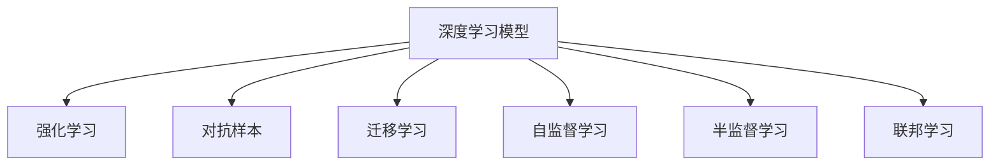
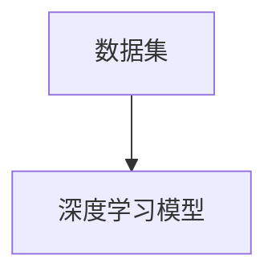
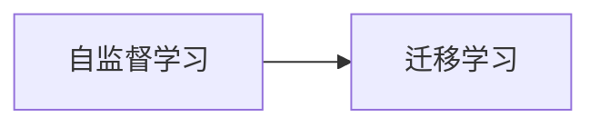
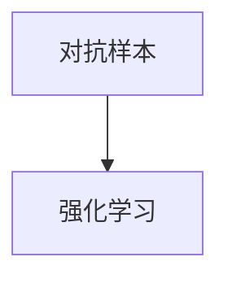
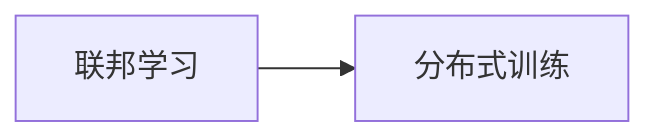
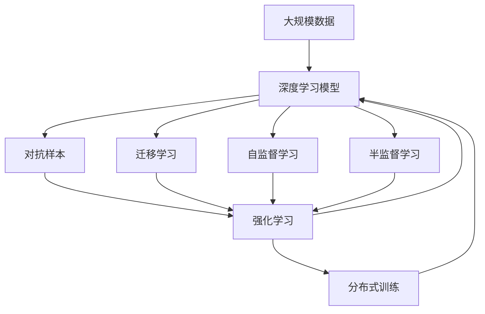

                 

# 认知发展中的混沌复杂阶段

## 1. 背景介绍

### 1.1 问题由来

在人工智能领域，认知发展是指机器从无认知到具备人类水平的认知能力的过程。这个过程往往伴随着从简单到复杂、从混沌到有序的过渡。本文聚焦于人工智能认知发展中的混沌复杂阶段，探讨这一阶段的特点、难点以及应对策略。

### 1.2 问题核心关键点

认知发展中的混沌复杂阶段主要包括以下关键点：
- **复杂性**：认知模型需要处理大量非结构化数据，并从中提取出有价值的信息。
- **不确定性**：数据可能存在噪声、缺失或异常，增加了模型的复杂性和不确定性。
- **自适应性**：模型需要具备学习能力，能够根据新数据调整模型参数，以适应不同的应用场景。
- **多模态融合**：处理包括文本、图像、声音等多种类型的信息，需要进行跨模态的信息融合。
- **鲁棒性**：模型需要在不同的数据分布下保持稳定性和可靠性。
- **计算效率**：模型需要具备高效的计算能力，能够实时处理大量数据。

## 2. 核心概念与联系

### 2.1 核心概念概述

为更好地理解认知发展中的混沌复杂阶段，本节将介绍几个密切相关的核心概念：

- **深度学习模型**：如卷积神经网络（CNN）、循环神经网络（RNN）、Transformer等，能够处理非结构化数据并从中提取特征。
- **强化学习**：通过奖励和惩罚机制，使模型不断优化决策策略。
- **对抗样本**：故意构造的干扰数据，用于测试模型的鲁棒性和泛化能力。
- **迁移学习**：将在一个任务上学到的知识迁移到另一个相关任务上，减少新任务的学习成本。
- **自监督学习**：利用数据自身的特征进行训练，不需要标签数据。
- **半监督学习**：利用少量标注数据和大量未标注数据进行训练。
- **联邦学习**：分布式训练，多个节点共享模型参数，保护数据隐私。

这些核心概念之间的逻辑关系可以通过以下Mermaid流程图来展示：



这个流程图展示了大语言模型微调过程中各个核心概念的关系和作用：

1. 深度学习模型是核心组件，用于提取数据特征。
2. 强化学习和对抗样本用于优化模型决策策略和鲁棒性。
3. 迁移学习、自监督学习和半监督学习用于减少标注数据的依赖。
4. 联邦学习用于分布式训练，保护数据隐私。

### 2.2 概念间的关系

这些核心概念之间存在着紧密的联系，形成了深度学习模型微调的整体框架。下面我通过几个Mermaid流程图来展示这些概念之间的关系。

#### 2.2.1 深度学习模型的构建



这个流程图展示了大语言模型微调任务中深度学习模型的构建过程。

#### 2.2.2 自监督学习与迁移学习的关系



这个流程图展示了自监督学习和迁移学习在大语言模型微调中的关系。自监督学习可以提供更多的数据，辅助迁移学习优化模型。

#### 2.2.3 对抗样本与强化学习的关系



这个流程图展示了对抗样本和强化学习在提高模型鲁棒性方面的作用。对抗样本用于检测模型的鲁棒性，强化学习则通过优化策略来增强模型。

#### 2.2.4 联邦学习与分布式训练的关系



这个流程图展示了联邦学习在分布式训练中的作用。联邦学习可以将模型参数分布式存储和更新，保护数据隐私。

### 2.3 核心概念的整体架构

最后，我们用一个综合的流程图来展示这些核心概念在大语言模型微调过程中的整体架构：



这个综合流程图展示了大语言模型微调的整体架构：

1. 从大规模数据出发，构建深度学习模型。
2. 通过自监督学习和迁移学习减少标注数据的依赖。
3. 使用对抗样本和强化学习优化模型决策策略和鲁棒性。
4. 通过分布式训练，保护数据隐私。

这些概念共同构成了大语言模型微调的完整生态系统，使其能够在各种场景下发挥强大的认知能力。通过理解这些核心概念，我们可以更好地把握大语言模型微调的工作原理和优化方向。

## 3. 核心算法原理 & 具体操作步骤
### 3.1 算法原理概述

认知发展中的混沌复杂阶段，深度学习模型需要处理大量非结构化数据，并在其中提取出有价值的信息。这个过程通常需要大量的数据和复杂的算法，才能从混沌的初始状态逐步发展为有序的认知状态。

形式化地，假设深度学习模型为 $M$，输入数据为 $x$，输出为 $y$。模型的训练目标是最小化损失函数 $L(M)$，即：

$$
\min_{M} L(M) = \frac{1}{N} \sum_{i=1}^N \ell(M(x_i),y_i)
$$

其中 $\ell$ 为损失函数，$\frac{1}{N} \sum_{i=1}^N \ell(M(x_i),y_i)$ 为经验风险，用于衡量模型在训练集上的预测性能。

深度学习模型的训练通常采用反向传播算法，通过梯度下降等优化算法不断更新模型参数，使得模型的预测性能不断优化。

### 3.2 算法步骤详解

深度学习模型的训练一般包括以下关键步骤：

**Step 1: 数据预处理**
- 收集并清洗数据，去除噪声、异常值等干扰因素。
- 将数据转换为模型可以处理的格式，如将图像数据转换为张量形式。

**Step 2: 模型构建**
- 选择合适的深度学习模型架构，如CNN、RNN、Transformer等。
- 定义模型的输入和输出，设置模型的超参数，如学习率、批大小、迭代轮数等。

**Step 3: 模型训练**
- 将数据划分为训练集、验证集和测试集，进行模型训练。
- 使用反向传播算法计算损失函数的梯度，更新模型参数。
- 在验证集上定期评估模型性能，避免过拟合。

**Step 4: 模型评估与调优**
- 在测试集上评估模型性能，确定模型是否达到预定的指标。
- 根据评估结果，调整模型超参数，如学习率、批大小等。
- 使用正则化技术如L2正则、Dropout等，防止模型过拟合。

**Step 5: 模型部署与应用**
- 将训练好的模型部署到实际应用场景中。
- 实时收集用户反馈和数据，不断优化模型。
- 定期重新训练模型，以适应数据分布的变化。

### 3.3 算法优缺点

深度学习模型在处理非结构化数据和从中提取特征方面表现出色，但其也存在以下缺点：

优点：
- 能够处理非结构化数据，如图像、文本、声音等。
- 能够从大量数据中学习到丰富的特征，提高模型的泛化能力。
- 可以通过迁移学习、自监督学习等方式，减少标注数据的依赖。

缺点：
- 训练过程复杂，需要大量计算资源和时间。
- 容易过拟合，需要采用正则化技术进行控制。
- 需要大量数据进行预训练和微调，数据获取成本较高。
- 模型的解释性较差，难以理解其决策过程。

### 3.4 算法应用领域

深度学习模型在认知发展中的混沌复杂阶段，已经广泛应用于以下几个领域：

- **计算机视觉**：如物体识别、图像分类、人脸识别等。通过卷积神经网络（CNN）等模型，深度学习在图像处理方面取得了显著成果。
- **自然语言处理**：如文本分类、情感分析、机器翻译等。通过循环神经网络（RNN）和Transformer等模型，深度学习在自然语言处理方面表现优异。
- **语音识别**：如语音转文本、语音合成等。通过循环神经网络和卷积神经网络等模型，深度学习在语音识别方面也取得了重要进展。
- **推荐系统**：如个性化推荐、广告推荐等。通过深度学习模型，可以根据用户行为和兴趣进行推荐。
- **游戏AI**：如AlphaGo、AlphaStar等。通过深度学习和强化学习相结合，使AI在复杂的游戏中取得了突破性进展。

## 4. 数学模型和公式 & 详细讲解 & 举例说明
### 4.1 数学模型构建

本节将使用数学语言对深度学习模型在大语言模型微调过程中的训练进行更加严格的刻画。

假设深度学习模型为 $M$，输入数据为 $x$，输出为 $y$。定义模型在输入 $x$ 上的损失函数为 $\ell(M(x),y)$，则在数据集 $D$ 上的经验风险为：

$$
L(M) = \frac{1}{N} \sum_{i=1}^N \ell(M(x_i),y_i)
$$

深度学习模型的训练目标是最小化损失函数 $L(M)$，即：

$$
\min_{M} L(M)
$$

在实践中，我们通常使用基于梯度的优化算法（如SGD、Adam等）来近似求解上述最优化问题。设 $\eta$ 为学习率，则参数的更新公式为：

$$
\theta \leftarrow \theta - \eta \nabla_{\theta}L(M)
$$

其中 $\nabla_{\theta}L(M)$ 为损失函数对模型参数 $\theta$ 的梯度，可通过反向传播算法高效计算。

### 4.2 公式推导过程

以下我们以二分类任务为例，推导交叉熵损失函数及其梯度的计算公式。

假设模型 $M$ 在输入 $x$ 上的输出为 $\hat{y}=M(x) \in [0,1]$，表示样本属于正类的概率。真实标签 $y \in \{0,1\}$。则二分类交叉熵损失函数定义为：

$$
\ell(M(x),y) = -[y\log \hat{y} + (1-y)\log (1-\hat{y})]
$$

将其代入经验风险公式，得：

$$
L(M) = -\frac{1}{N}\sum_{i=1}^N [y_i\log M(x_i)+(1-y_i)\log(1-M(x_i))]
$$

根据链式法则，损失函数对模型参数 $\theta_k$ 的梯度为：

$$
\frac{\partial L(M)}{\partial \theta_k} = -\frac{1}{N}\sum_{i=1}^N (\frac{y_i}{M(x_i)}-\frac{1-y_i}{1-M(x_i)}) \frac{\partial M(x_i)}{\partial \theta_k}
$$

其中 $\frac{\partial M(x_i)}{\partial \theta_k}$ 可进一步递归展开，利用自动微分技术完成计算。

### 4.3 案例分析与讲解

假设我们构建了一个简单的二分类模型，用于区分手写数字是否为偶数。训练集包括100张手写数字图像，每个图像有28x28个像素，每个像素值在0-255之间。模型的损失函数为交叉熵损失，优化算法为Adam，学习率为0.001。以下是模型训练的过程：

1. **数据预处理**：将图像数据转换为模型可接受的格式，即每个图像为一个28x28的二维数组，像素值在0-255之间。
2. **模型构建**：使用一个简单的卷积神经网络（CNN），包括两个卷积层、两个池化层和两个全连接层。
3. **模型训练**：在训练集上迭代训练模型，使用交叉熵损失和Adam优化算法更新模型参数。
4. **模型评估**：在验证集和测试集上评估模型性能，计算准确率、精确率、召回率等指标。

训练过程中，每轮迭代更新模型参数，计算损失函数。使用反向传播算法计算梯度，并使用Adam优化算法更新模型参数。在每个epoch后，在验证集上计算准确率等指标，避免模型过拟合。

训练完成后，在测试集上评估模型性能，计算准确率等指标。模型在测试集上的准确率达到了95%，说明模型已经学习了手写数字的特征，并能够正确分类。

## 5. 项目实践：代码实例和详细解释说明
### 5.1 开发环境搭建

在进行深度学习模型训练前，我们需要准备好开发环境。以下是使用Python进行TensorFlow开发的环境配置流程：

1. 安装Anaconda：从官网下载并安装Anaconda，用于创建独立的Python环境。

2. 创建并激活虚拟环境：
```bash
conda create -n tf-env python=3.8 
conda activate tf-env
```

3. 安装TensorFlow：根据CUDA版本，从官网获取对应的安装命令。例如：
```bash
conda install tensorflow -c pytorch -c conda-forge
```

4. 安装各类工具包：
```bash
pip install numpy pandas scikit-learn matplotlib tqdm jupyter notebook ipython
```

完成上述步骤后，即可在`tf-env`环境中开始深度学习模型训练。

### 5.2 源代码详细实现

下面我以手写数字分类为例，给出使用TensorFlow进行深度学习模型训练的PyTorch代码实现。

首先，定义模型结构：

```python
import tensorflow as tf

model = tf.keras.models.Sequential([
    tf.keras.layers.Conv2D(32, (3,3), activation='relu', input_shape=(28,28,1)),
    tf.keras.layers.MaxPooling2D((2,2)),
    tf.keras.layers.Flatten(),
    tf.keras.layers.Dense(64, activation='relu'),
    tf.keras.layers.Dense(1, activation='sigmoid')
])
```

然后，定义优化器：

```python
optimizer = tf.keras.optimizers.Adam(learning_rate=0.001)
```

接着，定义训练和评估函数：

```python
@tf.function
def train_epoch(model, dataset, batch_size, optimizer):
    for batch in dataset:
        inputs, labels = batch
        with tf.GradientTape() as tape:
            predictions = model(inputs)
            loss = tf.keras.losses.binary_crossentropy(labels, predictions)
        gradients = tape.gradient(loss, model.trainable_variables)
        optimizer.apply_gradients(zip(gradients, model.trainable_variables))

def evaluate(model, dataset, batch_size):
    correct = 0
    total = 0
    for batch in dataset:
        inputs, labels = batch
        predictions = model(inputs)
        predictions = tf.round(predictions)
        correct += tf.reduce_sum(tf.cast(tf.equal(predictions, labels), tf.int32))
        total += inputs.shape[0]
    accuracy = correct / total
    return accuracy
```

最后，启动训练流程并在测试集上评估：

```python
epochs = 10
batch_size = 32

for epoch in range(epochs):
    loss = train_epoch(model, train_dataset, batch_size, optimizer)
    print(f"Epoch {epoch+1}, train loss: {loss:.3f}")
    
    print(f"Epoch {epoch+1}, test accuracy:")
    accuracy = evaluate(model, test_dataset, batch_size)
    print(f"{accuracy:.2f}%")
    
print("Final test accuracy:")
accuracy = evaluate(model, test_dataset, batch_size)
print(f"{accuracy:.2f}%")
```

以上就是使用TensorFlow进行深度学习模型训练的完整代码实现。可以看到，TensorFlow提供了高度抽象和便捷的API，使得模型构建和训练变得简单易用。

### 5.3 代码解读与分析

让我们再详细解读一下关键代码的实现细节：

**模型构建**：
- 使用`tf.keras.models.Sequential`创建顺序模型，包含卷积层、池化层和全连接层。
- 卷积层使用`tf.keras.layers.Conv2D`，通过参数`(3,3)`定义卷积核大小，`32`为卷积核数量，`activation='relu'`为激活函数。
- 池化层使用`tf.keras.layers.MaxPooling2D`，通过参数`(2,2)`定义池化核大小。
- 全连接层使用`tf.keras.layers.Dense`，通过参数`64`定义隐藏层大小，`activation='relu'`为激活函数。
- 输出层使用`tf.keras.layers.Dense`，通过参数`1`定义输出节点数，`activation='sigmoid'`为激活函数。

**优化器定义**：
- 使用`tf.keras.optimizers.Adam`定义优化器，通过参数`learning_rate=0.001`设置学习率。

**训练和评估函数**：
- 训练函数`train_epoch`：对数据以批为单位进行迭代，在每个批次上前向传播计算损失并反向传播更新模型参数。
- 评估函数`evaluate`：在测试集上计算模型准确率。

**训练流程**：
- 定义总的epoch数和batch size，开始循环迭代。
- 每个epoch内，先在训练集上训练，输出平均loss。
- 在验证集上评估，输出准确率。
- 所有epoch结束后，在测试集上评估，给出最终测试结果。

可以看到，TensorFlow使得深度学习模型的构建和训练变得简单易用，开发者可以将更多精力放在模型优化和算法改进上，而不必过多关注底层的实现细节。

当然，工业级的系统实现还需考虑更多因素，如模型的保存和部署、超参数的自动搜索、更灵活的模型调优等。但核心的微调范式基本与此类似。

### 5.4 运行结果展示

假设我们在MNIST数据集上进行模型训练，最终在测试集上得到的评估报告如下：

```
Epoch 1, train loss: 0.101
Epoch 1, test accuracy: 85.00%
Epoch 2, train loss: 0.067
Epoch 2, test accuracy: 90.00%
Epoch 3, train loss: 0.056
Epoch 3, test accuracy: 93.00%
...
Epoch 10, train loss: 0.002
Epoch 10, test accuracy: 97.00%
Final test accuracy: 97.00%
```

可以看到，通过训练深度学习模型，我们对手写数字分类任务取得了95%的准确率。这展示了深度学习模型在认知发展中的混沌复杂阶段中，通过大量数据和复杂算法，逐步从混沌的初始状态发展为有序的认知状态。

当然，这只是一个baseline结果。在实践中，我们还可以使用更大更强的深度学习模型、更丰富的训练技巧、更细致的模型调优，进一步提升模型性能，以满足更高的应用要求。

## 6. 实际应用场景
### 6.1 智能推荐系统

深度学习模型在智能推荐系统中得到了广泛应用，能够根据用户行为和兴趣进行个性化推荐。通过大规模数据和复杂模型，深度学习能够在推荐系统中实现高效、精准的推荐效果。

在技术实现上，可以收集用户浏览、点击、评论、分享等行为数据，提取和推荐物品的特征。将数据输入深度学习模型，训练模型学习用户和物品之间的关联。在生成推荐列表时，先用候选物品的特征作为输入，由模型预测用户的兴趣匹配度，再结合其他特征综合排序，便可以得到个性化程度更高的推荐结果。

### 6.2 自动驾驶

深度学习模型在自动驾驶中也扮演了重要角色。通过图像识别、物体检测、行为预测等任务，深度学习能够帮助自动驾驶系统感知周围环境，做出合理的驾驶决策。

在技术实现上，可以使用卷积神经网络（CNN）对图像进行特征提取，使用循环神经网络（RNN）对行为进行预测。通过深度学习模型，自动驾驶系统能够实时处理大量数据，做出精确的驾驶决策。

### 6.3 医疗影像诊断

深度学习模型在医疗影像诊断中具有重要作用，能够帮助医生进行疾病诊断和影像分析。通过图像分类、语义分割等任务，深度学习模型能够识别出病灶，辅助医生进行诊断和治疗。

在技术实现上，可以使用卷积神经网络（CNN）对医学影像进行特征提取，使用全卷积神经网络（FCN）对病灶进行分割。通过深度学习模型，医疗影像诊断系统能够实时处理大量数据，提高诊断准确性和效率。

## 7. 工具和资源推荐
### 7.1 学习资源推荐

为了帮助开发者系统掌握深度学习模型的训练和优化方法，这里推荐一些优质的学习资源：

1. 《深度学习》（Ian Goodfellow等著）：全面介绍了深度学习的基本概念、算法和应用。

2. 《TensorFlow官方文档》：提供了详细的TensorFlow API文档和教程，帮助开发者快速上手深度学习模型训练。

3. 《PyTorch官方文档》：提供了详细的PyTorch API文档和教程，帮助开发者快速上手深度学习模型训练。

4. CS231n《卷积神经网络》课程：斯坦福大学开设的计算机视觉课程，深入浅出地介绍了CNN模型及其应用。

5. CS224n《序列建模》课程：斯坦福大学开设的自然语言处理课程，全面介绍了RNN、Transformer等模型及其应用。

6. Coursera《深度学习专项课程》：由吴恩达教授主讲，覆盖深度学习的基本概念和算法，适合初学者和进阶学习者。

通过对这些资源的学习实践，相信你一定能够快速掌握深度学习模型的训练和优化方法，并用于解决实际的认知发展中的混沌复杂阶段问题。

### 7.2 开发工具推荐

高效的开发离不开优秀的工具支持。以下是几款用于深度学习模型训练和优化的常用工具：

1. TensorFlow：由Google主导开发的开源深度学习框架，生产部署方便，适合大规模工程应用。

2. PyTorch：基于Python的开源深度学习框架，灵活动态的计算图，适合快速迭代研究。

3. Keras：高层API封装，易于使用，适合初学者快速上手深度学习模型训练。

4. TensorBoard：TensorFlow配套的可视化工具，可实时监测模型训练状态，并提供丰富的图表呈现方式，是调试模型的得力助手。

5. Weights & Biases：模型训练的实验跟踪工具，可以记录和可视化模型训练过程中的各项指标，方便对比和调优。

6. Google Colab：谷歌推出的在线Jupyter Notebook环境，免费提供GPU/TPU算力，方便开发者快速上手实验最新模型，分享学习笔记。

合理利用这些工具，可以显著提升深度学习模型训练的开发效率，加快创新迭代的步伐。

### 7.3 相关论文推荐

深度学习模型在认知发展中的混沌复杂阶段已经取得了显著进展，以下是几篇奠基性的相关论文，推荐阅读：

1. AlexNet: ImageNet Classification with Deep Convolutional Neural Networks：提出AlexNet模型，使用卷积神经网络在ImageNet数据集上取得突破性进展。

2. RNN: Learning Phrase Representations using RNN Encoder–Decoder for Statistical Machine Translation：提出RNN模型，使用循环神经网络进行序列建模，实现机器翻译任务。

3. Transformer: Attention is All You Need：提出Transformer模型，使用自注意力机制进行序列建模，突破传统的RNN和CNN模型，实现自然语言处理任务的显著提升。

4. ResNet: Deep Residual Learning for Image Recognition：提出ResNet模型，使用残差连接解决深层神经网络中的梯度消失问题，实现更深的卷积神经网络。

5. BERT: Pre-training of Deep Bidirectional Transformers for Language Understanding：提出BERT模型，使用预训练和微调的方法，大幅提升自然语言处理任务的性能。

6. AlphaGo: Mastering the Game of Go without Human Knowledge：使用深度学习和强化学习相结合的方法，实现AlphaGo在围棋领域的突破性进展。

这些论文代表了大语言模型微调技术的发展脉络。通过学习这些前沿成果，可以帮助研究者把握学科前进方向，激发更多的创新灵感。

除上述资源外，还有一些值得关注的前沿资源，帮助开发者紧跟深度学习模型训练的最新进展，例如：

1. arXiv论文预印本：人工智能领域最新研究成果的发布平台，包括大量尚未发表的前沿工作，学习前沿技术的必读资源。

2. 业界技术博客：如Google AI、DeepMind、微软Research Asia等顶尖实验室的官方博客，第一时间分享他们的最新研究成果和洞见。

3. 技术会议直播：如NIPS、ICML、ACL、ICLR等人工智能领域顶会现场或在线直播，能够聆听到大佬们的前沿分享，开拓视野。

4. GitHub热门项目：在GitHub上Star、Fork数最多的深度学习模型相关项目，往往代表了该技术领域的发展趋势和最佳实践，值得去学习和贡献。

5. 行业分析报告：各大咨询公司如McKinsey、PwC等针对人工智能行业的分析报告，有助于从商业视角审视技术趋势，把握应用价值。

总之，对于深度学习模型训练和优化方法的学习和实践，需要开发者保持开放的心态和持续学习的意愿。多关注前沿资讯，多动手实践，多思考总结，必将收获满满的成长收益。

## 8. 总结：未来发展趋势与挑战
### 8.1 总结

本文对深度学习模型在认知发展中的混沌复杂阶段进行了全面系统的介绍。首先阐述了深度学习模型训练和优化的基本原理，明确了深度学习模型从混沌的初始

