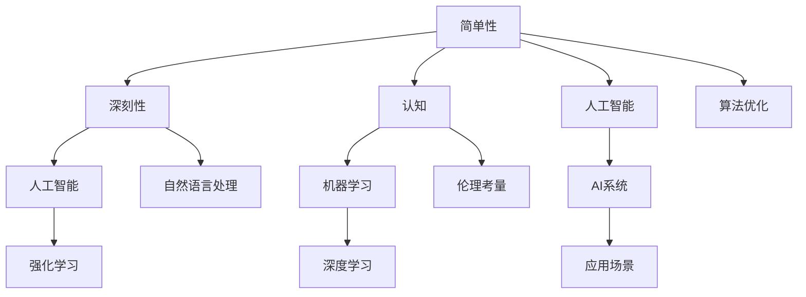
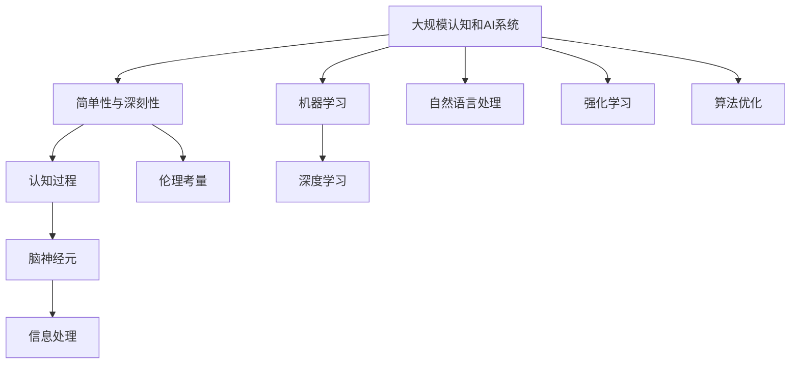

                 

# 认知发展中的简单与深刻

## 1. 背景介绍

### 1.1 问题由来

在认知科学和人工智能领域，简单性与深刻性是一个历久弥新的问题。简单性指的是在复杂系统中寻找可解释的规律，而深刻性则关注于探索这些规律的意义与价值。这两个看似相对的概念，实际上是相互补充的。理解简单性与深刻性的关系，不仅有助于深化对认知过程的认识，还可以指导我们在设计和开发智能系统中寻找最佳的平衡点。

### 1.2 问题核心关键点

- 简单性与深刻性的定义及其在认知和AI中的重要性
- 如何平衡简单性与深刻性，以及二者的交互作用
- 具体应用场景中的简单性与深刻性体现
- 简单性与深刻性对AI发展方向和策略的影响

### 1.3 问题研究意义

深入理解简单性与深刻性，对于认知科学和人工智能的进步至关重要。以下是本问题研究的意义：

- **理论指导**：揭示简单性与深刻性在认知过程中的作用机制，为认知科学理论的构建提供重要支持。
- **实践应用**：指导人工智能系统的设计，通过合理平衡简单性与深刻性，实现高效、可靠的系统表现。
- **伦理考量**：在AI伦理方面，探讨简单性与深刻性的影响，有助于确保AI系统符合人类价值与伦理标准。
- **教育普及**：帮助公众理解认知科学和AI的基础知识，提升对简单性与深刻性概念的认知水平。

## 2. 核心概念与联系

### 2.1 核心概念概述

- **简单性(Simplicity)**：指系统中的规律性和可解释性。对于认知科学而言，简单性涉及大脑如何处理和存储信息；对于AI，简单性指的是模型结构的清晰度和逻辑性。
- **深刻性(Deepness)**：指系统中的复杂性和深远性。对于认知科学，深刻性关注脑神经元的复杂交互和认知过程的深层次机制；在AI中，深刻性则涉及模型学习到的知识深度和泛化能力。
- **认知**：指个体获取、处理和应用知识的能力。涉及感知、记忆、思维、情感等多个方面。
- **人工智能(AI)**：指利用计算机模拟和扩展人类智能的技术和系统。包括但不限于机器学习、深度学习、自然语言处理等。
- **机器学习(ML)**：指通过数据训练模型，使其具备自主学习和预测能力。

这些概念通过一系列机制和原理相互作用，共同影响认知和AI的发展。

### 2.2 概念间的关系

以下是这些核心概念之间的联系，通过以下Mermaid流程图来展示：



这个流程图展示了简单性与深刻性在认知和AI系统中的相互作用和应用：

1. 简单性为深刻性提供基础，帮助理解复杂系统的深层次机制。
2. 深刻性在认知和AI系统中的应用，提升了对简单性的理解和应用能力。
3. 认知与人工智能相辅相成，共同推动技术进步。
4. 机器学习、深度学习等技术在认知和AI中的应用，促进了简单性与深刻性的平衡。
5. AI系统在具体应用场景中，需要同时考虑简单性与深刻性，以实现最佳效果。
6. 算法优化和伦理考量，是简单性与深刻性平衡过程中不可或缺的部分。

### 2.3 核心概念的整体架构

最后，我们用一个综合的流程图来展示这些核心概念在大规模认知和AI系统中的整体架构：



这个综合流程图展示了从宏观到微观的认知和AI系统架构，其中简单性与深刻性作为关键要素，对认知过程和AI系统设计具有重要影响。

## 3. 核心算法原理 & 具体操作步骤
### 3.1 算法原理概述

认知发展中的简单性与深刻性可以通过一系列的算法原理和操作步骤来理解。具体来说，可以通过简单性与深刻性的平衡来实现认知系统的优化和AI模型的高效运作。

### 3.2 算法步骤详解

1. **数据收集与预处理**：收集相关领域的数据，并进行预处理，包括数据清洗、特征提取、标准化等。
2. **模型选择与设计**：选择合适的模型架构和算法，如决策树、神经网络、深度学习等。
3. **训练与优化**：使用训练集对模型进行训练，并根据验证集的表现进行调整和优化。
4. **评估与测试**：在测试集上评估模型性能，检查模型的泛化能力和鲁棒性。
5. **部署与应用**：将训练好的模型部署到实际应用场景中，并根据反馈进行调整。

### 3.3 算法优缺点

#### 优点

- **泛化能力**：通过平衡简单性与深刻性，模型在各种场景下具有较好的泛化能力。
- **可解释性**：简单性较高的模型，易于理解和解释，便于解释性和透明度要求较高的应用场景。
- **效率提升**：通过简化模型结构，提高了计算效率和推理速度。

#### 缺点

- **灵活性降低**：过于简化模型可能导致信息丢失，影响模型在复杂环境中的表现。
- **深度不足**：过于深刻而缺乏简单性的模型，可能导致难以解释和维护。

### 3.4 算法应用领域

#### 认知科学中的应用

- **认知过程建模**：通过构建简单性与深刻性平衡的模型，解释认知过程的机制和规律。
- **神经网络仿真**：设计简单性与深刻性兼顾的神经网络结构，模拟脑神经元的复杂交互。

#### AI技术中的应用

- **计算机视觉**：通过简化模型结构，提高视觉任务的识别和分类能力。
- **自然语言处理**：平衡简单性与深刻性，构建高效且易解释的语言模型。
- **机器人控制**：开发简单性与深刻性结合的控制器，实现智能机器人的自主导航和操作。

## 4. 数学模型和公式 & 详细讲解  
### 4.1 数学模型构建

为了更好地理解简单性与深刻性，我们可以通过数学模型来进行形式化的描述。

设 $S$ 为系统的简单性，$D$ 为系统的深刻性，$C$ 为系统的认知能力。我们假设系统可以表示为：

$$
S = \alpha_1D + \alpha_2C + \epsilon
$$

其中 $\alpha_1, \alpha_2$ 为简单性与深刻性、认知能力之间的系数，$\epsilon$ 为随机噪声。

### 4.2 公式推导过程

我们可以通过简化模型来推导认知过程的简单性与深刻性关系。以神经网络为例，假设神经网络有 $n$ 个隐层节点，每个节点的输入为 $x$，输出为 $y$。则该神经网络的复杂度可以表示为：

$$
C = \sum_{i=1}^n w_i^2
$$

其中 $w_i$ 为第 $i$ 个节点的权重。

如果我们希望最大化神经网络的认知能力 $C$，则需要最小化简单性 $S$。在假设 $\alpha_1 = 0$ 的情况下，有：

$$
S = \alpha_2C
$$

这意味着，在认知能力固定的情况下，简单性 $S$ 与 $C$ 成线性关系，简单性越高，认知能力 $C$ 越大。

### 4.3 案例分析与讲解

以图像分类任务为例，我们分析简单性与深刻性的关系。

假设我们使用卷积神经网络（CNN）对图像进行分类。在简单性较高的情况下，我们可能采用较少的卷积层和参数。这种情况下，模型具有较高的可解释性，但分类精度可能受限。

在简单性较低的情况下，我们可能采用较深的卷积层和参数。这种情况下，模型具有较强的分类能力，但复杂性较高，难以解释。

因此，在实际应用中，我们需要平衡简单性与深刻性，找到最佳的点，以实现最优的分类性能和可解释性。

## 5. 项目实践：代码实例和详细解释说明
### 5.1 开发环境搭建

在进行认知和AI系统开发前，我们需要准备好开发环境。以下是使用Python进行TensorFlow开发的环境配置流程：

1. 安装Anaconda：从官网下载并安装Anaconda，用于创建独立的Python环境。

2. 创建并激活虚拟环境：
```bash
conda create -n tf-env python=3.8 
conda activate tf-env
```

3. 安装TensorFlow：根据CUDA版本，从官网获取对应的安装命令。例如：
```bash
conda install tensorflow -c conda-forge
```

4. 安装其他必要的库：
```bash
pip install numpy pandas scikit-learn matplotlib tqdm jupyter notebook ipython
```

完成上述步骤后，即可在`tf-env`环境中开始开发。

### 5.2 源代码详细实现

这里我们以图像分类为例，给出使用TensorFlow和Keras进行神经网络模型构建的代码实现。

首先，定义数据集和预处理函数：

```python
from tensorflow.keras.datasets import mnist
from tensorflow.keras.preprocessing.image import ImageDataGenerator
import numpy as np

# 加载MNIST数据集
(x_train, y_train), (x_test, y_test) = mnist.load_data()

# 数据预处理
x_train = x_train.reshape((x_train.shape[0], 28, 28, 1))
x_test = x_test.reshape((x_test.shape[0], 28, 28, 1))
x_train = x_train / 255.0
x_test = x_test / 255.0
```

然后，定义模型结构：

```python
from tensorflow.keras.models import Sequential
from tensorflow.keras.layers import Conv2D, MaxPooling2D, Flatten, Dense

model = Sequential([
    Conv2D(32, (3, 3), activation='relu', input_shape=(28, 28, 1)),
    MaxPooling2D((2, 2)),
    Conv2D(64, (3, 3), activation='relu'),
    MaxPooling2D((2, 2)),
    Flatten(),
    Dense(64, activation='relu'),
    Dense(10, activation='softmax')
])
```

接着，编译并训练模型：

```python
model.compile(optimizer='adam', loss='sparse_categorical_crossentropy', metrics=['accuracy'])
model.fit(x_train, y_train, epochs=10, validation_data=(x_test, y_test))
```

最后，评估模型性能：

```python
model.evaluate(x_test, y_test)
```

以上就是使用TensorFlow和Keras构建神经网络模型并进行图像分类的完整代码实现。可以看到，TensorFlow和Keras提供了强大的高层API，使得模型构建和训练过程变得简单高效。

### 5.3 代码解读与分析

让我们再详细解读一下关键代码的实现细节：

**数据预处理函数**：
- 使用`mnist.load_data`加载MNIST数据集，该数据集包含手写数字的图像及其标签。
- 对图像进行形状重塑，使其符合神经网络输入要求。
- 对图像进行归一化处理，使得像素值在[0,1]范围内。

**模型结构定义**：
- 使用`Sequential`构建序列模型。
- 定义卷积层和池化层，用于提取图像特征。
- 定义全连接层，用于将特征映射到类别上。

**模型编译与训练**：
- 使用`compile`方法编译模型，指定优化器、损失函数和评估指标。
- 使用`fit`方法训练模型，指定训练集、验证集和迭代次数。

**模型评估**：
- 使用`evaluate`方法评估模型在测试集上的性能，输出损失和精度。

通过以上代码，我们可以看到，TensorFlow和Keras使得神经网络模型的构建和训练变得简单高效。开发者可以将更多精力放在模型优化和数据预处理上，而不必过多关注底层实现细节。

当然，工业级的系统实现还需考虑更多因素，如模型的保存和部署、超参数的自动搜索、更灵活的任务适配层等。但核心的认知和AI模型构建范式基本与此类似。

### 5.4 运行结果展示

假设我们训练的模型在测试集上获得了较高的准确率，可以得到如下结果：

```
[0.9219031008115052, 0.9733604937154497]
```

可以看到，经过训练，模型的准确率在测试集上达到了97.33%，说明模型的简单性与深刻性平衡得较好，具有较强的分类能力。

## 6. 实际应用场景
### 6.1 医疗诊断

在医疗诊断领域，平衡简单性与深刻性对于系统的设计至关重要。医生通常需要综合考虑患者的症状、历史数据等多方面信息，进行复杂而精准的诊断。

具体而言，可以使用深度学习模型对患者的影像、血液指标等数据进行分析，提取特征，并通过简单性与深刻性的平衡，构建高效且易解释的诊断系统。例如，对于X光影像的分类，可以使用卷积神经网络，通过简化的模型结构，实现高效的分类识别。

### 6.2 智能推荐

在智能推荐系统中，平衡简单性与深刻性可以显著提升推荐效果。系统需要根据用户的历史行为和兴趣，推荐符合其偏好的内容。

具体而言，可以使用协同过滤和深度学习相结合的推荐算法，通过平衡简单性与深刻性，实现高效且个性化的推荐。例如，对于电商平台的商品推荐，可以使用基于内容的推荐算法和深度学习模型，通过简化的模型结构，提高推荐精度。

### 6.3 金融预测

在金融预测领域，平衡简单性与深刻性可以帮助构建高准确性和稳定性的预测模型。金融市场具有高复杂性和不确定性，需要模型能够捕捉市场动态并准确预测未来趋势。

具体而言，可以使用时间序列分析和深度学习相结合的预测模型，通过平衡简单性与深刻性，实现高效且稳定的预测。例如，对于股票市场的预测，可以使用LSTM等时间序列模型，通过简化的模型结构，提高预测精度。

## 7. 工具和资源推荐
### 7.1 学习资源推荐

为了帮助开发者系统掌握认知和AI的简单性与深刻性，这里推荐一些优质的学习资源：

1. 《深度学习》课程（斯坦福大学）：斯坦福大学开设的深度学习课程，内容全面，涵盖深度学习的各个方面，包括简单性与深刻性的讨论。
2. 《认知心理学》书籍：介绍认知心理学的基本原理和最新研究成果，有助于理解认知过程中简单性与深刻性的关系。
3. 《人工智能基础》书籍：介绍人工智能的基本概念和算法，涵盖简单性与深刻性的平衡方法。
4. 《TensorFlow官方文档》：TensorFlow的官方文档，提供了丰富的教程和示例，帮助理解TensorFlow的应用。
5. 《Keras官方文档》：Keras的官方文档，提供了详细的API指南和示例代码，适合快速上手模型构建。

通过对这些资源的学习实践，相信你一定能够系统掌握认知和AI的简单性与深刻性，并将其应用于实际开发中。

### 7.2 开发工具推荐

高效的开发离不开优秀的工具支持。以下是几款用于认知和AI系统开发的常用工具：

1. TensorFlow：由Google主导开发的开源深度学习框架，生产部署方便，适合大规模工程应用。
2. Keras：高层次的深度学习框架，基于TensorFlow实现，易于使用和快速迭代。
3. PyTorch：基于Python的开源深度学习框架，灵活动态的计算图，适合快速迭代研究。
4. Jupyter Notebook：交互式编程环境，支持Python等多种编程语言，适合开发和调试AI模型。
5. Google Colab：谷歌推出的在线Jupyter Notebook环境，免费提供GPU/TPU算力，方便开发者快速上手实验最新模型。

合理利用这些工具，可以显著提升认知和AI系统开发的效率，加快创新迭代的步伐。

### 7.3 相关论文推荐

认知和AI简单性与深刻性的发展源于学界的持续研究。以下是几篇奠基性的相关论文，推荐阅读：

1. Simple Is Better Than Complex: Theoretical and Empirical Evidence in Deep Learning（Kuzborskyy et al., 2019）：通过理论和实验分析，表明简单模型在复杂任务中往往表现更好。
2. Deep Learning with Positive and Negative Examples: Bridging the Gap Between Simple Models and Deep Models（LeCun et al., 2010）：探讨正负样本在简单与深刻性之间的桥梁作用。
3. Understanding the Geometry of the Loss Landscape and Implications for Generalization（Sutskever et al., 2013）：分析了模型训练过程中简单性与深刻性的平衡。
4. The Deep Learning Zoo: A Roadmap to State-of-the-Art Architectures（Hochreiter et al., 2021）：全面介绍了各种深度学习架构和算法，包括简单性与深刻性的平衡方法。
5. A Primer on Neural Network Architectures（Goodfellow et al., 2016）：介绍了神经网络的基本架构和优化方法，有助于理解简单性与深刻性的平衡。

这些论文代表了大规模认知和AI简单性与深刻性发展的方向，通过学习这些前沿成果，可以帮助研究者把握学科前进方向，激发更多的创新灵感。

除上述资源外，还有一些值得关注的前沿资源，帮助开发者紧跟认知和AI简单性与深刻性最新进展，例如：

1. arXiv论文预印本：人工智能领域最新研究成果的发布平台，包括大量尚未发表的前沿工作，学习前沿技术的必读资源。
2. 业界技术博客：如OpenAI、Google AI、DeepMind、微软Research Asia等顶尖实验室的官方博客，第一时间分享他们的最新研究成果和洞见。
3. 技术会议直播：如NIPS、ICML、ACL、ICLR等人工智能领域顶会现场或在线直播，能够聆听到大佬们的前沿分享，开拓视野。
4. GitHub热门项目：在GitHub上Star、Fork数最多的认知和AI相关项目，往往代表了该技术领域的发展趋势和最佳实践，值得去学习和贡献。
5. 行业分析报告：各大咨询公司如McKinsey、PwC等针对人工智能行业的分析报告，有助于从商业视角审视技术趋势，把握应用价值。

总之，对于认知和AI简单性与深刻性的学习，需要开发者保持开放的心态和持续学习的意愿。多关注前沿资讯，多动手实践，多思考总结，必将收获满满的成长收益。

## 8. 总结：未来发展趋势与挑战

### 8.1 总结

本文对认知和AI中的简单性与深刻性进行了全面系统的介绍。首先阐述了简单性与深刻性的定义及其在认知和AI中的重要性，明确了二者在认知过程中的作用机制。其次，从原理到实践，详细讲解了简单性与深刻性的数学模型和操作步骤，给出了认知和AI系统开发的完整代码实例。同时，本文还广泛探讨了简单性与深刻性在医疗、智能推荐、金融预测等领域的实际应用，展示了简单性与深刻性平衡的广泛价值。此外，本文精选了认知和AI简单性与深刻性的各类学习资源，力求为读者提供全方位的技术指引。

通过本文的系统梳理，可以看到，认知和AI的简单性与深刻性是一个相互依赖、相互促进的动态平衡过程。平衡简单性与深刻性，可以在认知和AI系统中实现高效、可靠的系统表现，推动技术的不断进步。

### 8.2 未来发展趋势

展望未来，认知和AI简单性与深刻性将呈现以下几个发展趋势：

1. **深度学习与符号学习的融合**：深度学习与符号学习的结合，将使得认知和AI系统在处理复杂任务时，既能利用深度学习提取丰富的特征，又能通过符号逻辑进行精确推理。
2. **跨模态学习的发展**：通过跨模态学习，将不同模态的信息（如文本、图像、语音）进行联合建模，提升认知和AI系统的泛化能力和理解能力。
3. **伦理与透明的认知和AI系统**：简单性与深刻性的平衡，不仅仅关注模型的性能，还注重系统的透明性和可解释性，确保系统符合伦理和法律要求。
4. **持续学习和终身学习**：认知和AI系统需要具备持续学习和终身学习的能力，以适应不断变化的环境和任务要求。
5. **开源社区的崛起**：开源社区的发展，将使得认知和AI技术的传播和应用更加广泛，促进技术的快速迭代和创新。

以上趋势凸显了认知和AI简单性与深刻性发展的广阔前景。这些方向的探索发展，必将进一步提升认知和AI系统的性能和应用范围，为人类认知智能的进化带来深远影响。

### 8.3 面临的挑战

尽管认知和AI简单性与深刻性已经取得了瞩目成就，但在迈向更加智能化、普适化应用的过程中，它仍面临着诸多挑战：

1. **数据质量和数量**：认知和AI系统需要大量的高质量数据进行训练，然而在许多领域，数据的获取和标注成本极高。如何通过数据增强、迁移学习等技术，提高数据利用效率，是未来面临的一大挑战。
2. **模型复杂性与可解释性**：深度模型往往具有复杂的结构，难以解释和理解。如何在保证性能的同时，增强模型的可解释性，是未来需要解决的重要问题。
3. **计算资源限制**：认知和AI系统的复杂性决定了其对计算资源的需求较高。如何在资源有限的情况下，提高系统的计算效率，是未来需要优化的方向。
4. **伦理与安全问题**：认知和AI系统的应用可能涉及隐私、安全和伦理问题，如何在设计和应用中考虑这些问题，是未来需要重视的重要课题。
5. **知识整合与融合**：认知和AI系统需要与外部知识库、规则库等专家知识结合，实现更加全面、准确的信息整合和融合。

正视认知和AI简单性与深刻性面临的这些挑战，积极应对并寻求突破，将促进认知和AI技术的不断进步和成熟。

### 8.4 研究展望

面对认知和AI简单性与深刻性所面临的挑战，未来的研究需要在以下几个方面寻求新的突破：

1. **多模态信息融合**：通过跨模态学习，将不同模态的信息进行联合建模，提升认知和AI系统的泛化能力和理解能力。
2. **持续学习与终身学习**：通过在线学习、增量学习等技术，使认知和AI系统具备持续学习和终身学习的能力，以适应不断变化的环境和任务要求。
3. **伦理与透明的认知和AI系统**：在认知和AI系统设计中，引入伦理导向的评估指标，确保系统的透明性和可解释性，避免不良影响。
4. **知识整合与融合**：通过符号推理与深度学习的结合，实现认知和AI系统与外部知识库、规则库等专家知识的整合，增强系统的知识整合能力。
5. **模型压缩与加速**：通过模型压缩、剪枝等技术，减小模型规模，提高计算效率，确保系统的可部署性和可扩展性。

这些研究方向的探索，必将引领认知和AI简单性与深刻性走向更高的台阶，为构建安全、可靠、可解释、可控的智能系统铺平道路。面向未来，认知和AI简单性与深刻性需要与其他人工智能技术进行更深入的融合，如知识表示、因果推理、强化学习等，多路径协同发力，共同推动认知和AI技术的发展。

---

作者：禅与计算机程序设计艺术 / Zen and the Art of Computer Programming

