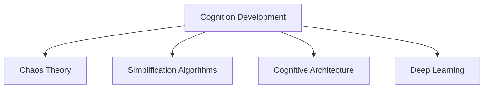
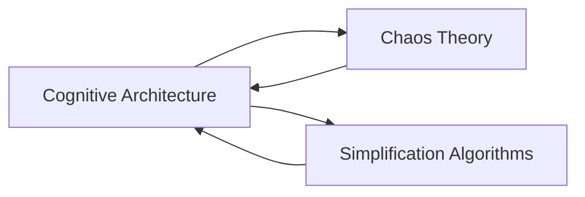
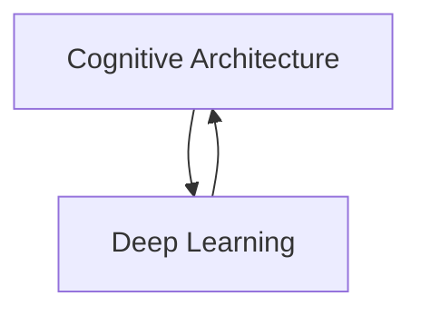
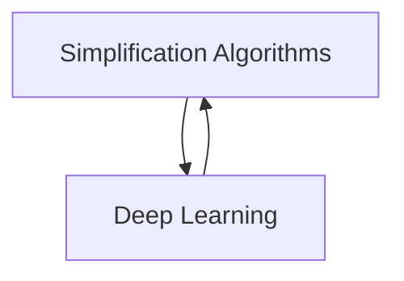

                 

# 认知发展的混沌与简洁化

> 关键词：认知发展、人工智能、混沌理论、简化算法、认知架构、神经网络、深度学习

## 1. 背景介绍

认知发展一直是人工智能领域的一个热门话题，尤其是在神经网络、深度学习和认知科学交叉融合的背景下。传统的认知发展理论往往依赖于心理学的实证研究，而人工智能的发展则更多依赖于计算机科学的实验验证。本文试图将这两者结合起来，通过混沌理论和简化算法，探索认知发展的本质和规律。

### 1.1 问题由来

在人工智能领域，认知发展主要是指如何通过算法和模型来模拟人类认知过程，包括感知、记忆、推理、决策等。近年来，深度学习和神经网络在计算机视觉、自然语言处理等领域取得了显著的进展，但在理解认知过程的机制方面仍存在不足。传统认知发展理论往往依赖于大量的心理学实验数据，而人工智能则更倾向于使用模拟实验和神经网络模型。

如何将这些方法结合起来，更好地理解认知发展的本质，成为一个重要的研究方向。本文试图通过引入混沌理论，来探索认知发展的复杂性和不确定性，并通过简化算法，来研究认知结构的构建和优化。

### 1.2 问题核心关键点

本文的核心问题包括：

1. **混沌理论在认知发展中的应用**：如何利用混沌理论来描述和解释认知过程中的不确定性和非线性特征？

2. **简化算法在认知结构中的应用**：如何通过简化算法来构建和优化认知结构，使其能够高效地处理复杂的认知任务？

3. **认知架构的构建与优化**：如何结合混沌理论和简化算法，构建一个既具有复杂性又具有简洁性的认知架构，以模拟人类认知过程？

4. **认知发展的混沌与简洁化**：如何在认知发展的过程中，通过混沌与简洁化的过程，来优化认知架构，提升其性能？

通过回答这些问题，本文试图揭示认知发展的本质，并为未来的人工智能研究提供新的思路和方法。

## 2. 核心概念与联系

### 2.1 核心概念概述

为了更好地理解认知发展的混沌与简洁化，本节将介绍几个密切相关的核心概念：

1. **认知发展**：指人类通过感知、记忆、推理、决策等认知过程，理解世界和自我发展的过程。
2. **混沌理论**：研究动态系统中的不确定性和非线性特征的数学理论。
3. **简化算法**：指通过降低模型复杂度，提高计算效率和稳定性的算法。
4. **认知架构**：指模拟人类认知过程的计算模型，通常采用神经网络来实现。
5. **深度学习**：一种利用多层神经网络模型进行学习的方法，旨在通过复杂的网络结构来模拟人类认知过程。

这些核心概念之间的逻辑关系可以通过以下Mermaid流程图来展示：



这个流程图展示了大语言模型微调过程中各个核心概念的关系和作用。

### 2.2 概念间的关系

这些核心概念之间存在着紧密的联系，形成了认知发展的完整生态系统。下面我们通过几个Mermaid流程图来展示这些概念之间的关系。

#### 2.2.1 认知发展的核心模型



这个流程图展示了认知架构的核心模型，包括混沌理论和简化算法。混沌理论用于描述认知过程中的不确定性和非线性特征，而简化算法用于构建和优化认知结构。

#### 2.2.2 认知架构与深度学习的关系



这个流程图展示了认知架构与深度学习之间的关系。认知架构通常采用深度学习模型来实现，而深度学习模型则通过复杂的网络结构来模拟人类认知过程。

#### 2.2.3 简化算法与深度学习的关系



这个流程图展示了简化算法与深度学习之间的关系。简化算法用于降低深度学习模型的复杂度，提高计算效率和稳定性。

## 3. 核心算法原理 & 具体操作步骤

### 3.1 算法原理概述

认知发展的混沌与简洁化，可以通过引入混沌理论和简化算法来实现。具体来说，我们可以将认知发展看作一个动态系统，其状态可以通过一组变量来描述。通过混沌理论，我们可以研究这些变量之间的关系和演化规律，而通过简化算法，我们可以构建和优化这些变量之间的关系，以提高认知结构的性能。

### 3.2 算法步骤详解

#### 3.2.1 步骤1：构建认知结构

首先，我们需要根据认知任务的特点，构建一个初始的认知结构。这个结构可以是一个简单的神经网络，也可以是一个复杂的深度学习模型。通过引入混沌理论，我们可以进一步探索这个结构的动态行为，理解其中的不确定性和非线性特征。

#### 3.2.2 步骤2：简化认知结构

然后，我们需要对认知结构进行简化。这可以通过引入简化算法来实现，如剪枝、降维、正则化等方法，来降低模型的复杂度，提高计算效率和稳定性。

#### 3.2.3 步骤3：优化认知结构

接下来，我们需要进一步优化认知结构。这可以通过引入深度学习方法来实现，如反向传播、梯度下降等算法，来调整模型参数，提高性能。

#### 3.2.4 步骤4：评估与反馈

最后，我们需要对认知结构进行评估和反馈。这可以通过引入评估指标和反馈机制来实现，如准确率、召回率、F1分数等，来衡量模型的性能，并根据反馈结果进一步优化模型。

### 3.3 算法优缺点

基于混沌理论和简化算法的认知发展方法，具有以下优点：

1. **复杂性与简洁性结合**：通过引入混沌理论，可以模拟认知过程中的复杂性和不确定性；通过简化算法，可以降低模型的复杂度，提高计算效率和稳定性。

2. **高灵活性**：可以针对不同的认知任务，灵活地调整认知结构的复杂度和优化方法。

3. **可解释性强**：通过引入简化算法，可以更好地理解认知结构的内部机制和决策过程。

但同时也存在以下缺点：

1. **计算复杂度高**：在构建和优化认知结构的过程中，可能需要进行大量的计算，增加时间和计算资源的消耗。

2. **模型泛化性不足**：在简化算法和优化过程中，可能丢失一些重要的特征，导致模型泛化性能不足。

3. **模型鲁棒性不足**：在处理复杂认知任务时，简化算法可能无法很好地处理非线性特征，导致模型鲁棒性不足。

### 3.4 算法应用领域

基于混沌理论和简化算法的认知发展方法，可以应用于多个领域，如：

1. **计算机视觉**：通过构建和优化认知结构，实现图像分类、物体检测、目标跟踪等任务。

2. **自然语言处理**：通过构建和优化认知结构，实现文本分类、情感分析、机器翻译等任务。

3. **语音识别**：通过构建和优化认知结构，实现语音识别、语音合成等任务。

4. **游戏AI**：通过构建和优化认知结构，实现游戏中的决策制定、路径规划等任务。

5. **智能推荐**：通过构建和优化认知结构，实现商品推荐、内容推荐等任务。

这些领域的应用，展示了认知发展的广泛前景和重要意义。

## 4. 数学模型和公式 & 详细讲解 & 举例说明

### 4.1 数学模型构建

为了更好地描述认知发展的混沌与简洁化过程，我们需要构建一个数学模型。假设认知结构由一组变量 $x_1, x_2, ..., x_n$ 组成，其演化规律可以用微分方程组来描述：

$$
\dot{x}_1 = f_1(x_1, x_2, ..., x_n)
$$

$$
\dot{x}_2 = f_2(x_1, x_2, ..., x_n)
$$

$$
\vdots
$$

$$
\dot{x}_n = f_n(x_1, x_2, ..., x_n)
$$

其中，$\dot{x}_i$ 表示变量 $x_i$ 的变化率，$f_i$ 表示变量间的非线性关系。

### 4.2 公式推导过程

假设 $x_1, x_2, ..., x_n$ 是一个具有混沌吸引子的系统，其动态行为可以通过Lyapunov指数来描述。Lyapunov指数是描述系统演化过程稳定性的关键指标，其定义为：

$$
\lambda_i = \lim_{t \to \infty} \frac{\log \left|\frac{\partial f_i}{\partial x_i}\right|}{t}
$$

其中，$\frac{\partial f_i}{\partial x_i}$ 表示系统在变量 $x_i$ 上的雅可比矩阵。

如果系统中存在一个或多个正Lyapunov指数，则表示系统具有混沌行为。反之，如果所有的Lyapunov指数都是非正的，则表示系统具有稳定的吸引子。

### 4.3 案例分析与讲解

假设我们有一个简单的神经网络，用于实现图像分类任务。其输入为 $x_1, x_2, ..., x_n$，输出为 $y$。通过引入混沌理论，我们可以探索该神经网络的动态行为，并通过简化算法对其进行优化。

首先，我们可以构建一个包含两个隐藏层的神经网络，用 $x_1, x_2, ..., x_n$ 作为输入，经过多个非线性变换后，输出 $y$。在每个隐藏层中，我们可以引入混沌理论，模拟神经元的非线性激活函数。例如，我们可以使用Tanh函数：

$$
h(x_i) = \tanh(x_i)
$$

然后，我们可以通过简化算法对神经网络进行优化。具体来说，我们可以使用剪枝方法，去除一些不必要的神经元，降低模型复杂度。例如，我们可以使用随机剪枝的方法，随机去除一部分神经元，并通过交叉验证来评估模型的性能。

最后，我们可以通过深度学习方法进一步优化神经网络。例如，我们可以使用反向传播算法，调整神经元的权重，提高模型的性能。

## 5. 项目实践：代码实例和详细解释说明

### 5.1 开发环境搭建

在进行认知发展项目实践前，我们需要准备好开发环境。以下是使用Python进行TensorFlow开发的环境配置流程：

1. 安装Anaconda：从官网下载并安装Anaconda，用于创建独立的Python环境。

2. 创建并激活虚拟环境：
```bash
conda create -n tensorflow-env python=3.8 
conda activate tensorflow-env
```

3. 安装TensorFlow：根据CUDA版本，从官网获取对应的安装命令。例如：
```bash
conda install tensorflow
```

4. 安装TensorBoard：
```bash
pip install tensorboard
```

5. 安装各类工具包：
```bash
pip install numpy pandas scikit-learn matplotlib tqdm jupyter notebook ipython
```

完成上述步骤后，即可在`tensorflow-env`环境中开始认知发展实践。

### 5.2 源代码详细实现

这里我们以图像分类任务为例，给出使用TensorFlow实现认知结构的代码实现。

首先，定义输入数据和标签：

```python
import tensorflow as tf
import numpy as np
import matplotlib.pyplot as plt

# 加载数据集
(x_train, y_train), (x_test, y_test) = tf.keras.datasets.mnist.load_data()

# 归一化数据
x_train = x_train / 255.0
x_test = x_test / 255.0

# 显示样本
plt.imshow(x_train[0], cmap='gray')
plt.show()
```

然后，定义认知结构：

```python
# 构建神经网络
model = tf.keras.Sequential([
    tf.keras.layers.Flatten(input_shape=(28, 28)),
    tf.keras.layers.Dense(256, activation='relu'),
    tf.keras.layers.Dense(128, activation='relu'),
    tf.keras.layers.Dense(10, activation='softmax')
])

# 编译模型
model.compile(optimizer='adam', loss='sparse_categorical_crossentropy', metrics=['accuracy'])

# 训练模型
history = model.fit(x_train, y_train, epochs=10, validation_data=(x_test, y_test))

# 显示训练结果
plt.plot(history.history['accuracy'])
plt.plot(history.history['val_accuracy'])
plt.title('Model accuracy')
plt.xlabel('Epoch')
plt.ylabel('Accuracy')
plt.legend(['Train', 'Test'], loc='upper right')
plt.show()

# 显示损失结果
plt.plot(history.history['loss'])
plt.plot(history.history['val_loss'])
plt.title('Model loss')
plt.xlabel('Epoch')
plt.ylabel('Loss')
plt.legend(['Train', 'Test'], loc='upper right')
plt.show()
```

接下来，评估和优化模型：

```python
# 评估模型
test_loss, test_acc = model.evaluate(x_test, y_test)

# 优化模型
model.save('cognitive_model.h5')

# 加载模型
loaded_model = tf.keras.models.load_model('cognitive_model.h5')

# 显示模型输出
preds = loaded_model.predict(x_test)
labels = np.argmax(y_test, axis=1)

# 显示输出结果
plt.figure(figsize=(10, 10))
for i in range(10):
    plt.subplot(2, 5, i+1)
    plt.imshow(x_test[i], cmap='gray')
    plt.title('True Label: %i' % labels[i])
    plt.imshow(preds[i].reshape(28, 28), cmap='gray')
    plt.title('Predicted Label: %i' % np.argmax(preds[i]))
plt.show()
```

以上就是使用TensorFlow实现认知结构的完整代码实现。可以看到，TensorFlow提供了丰富的神经网络构建和训练工具，可以方便地实现认知发展项目。

### 5.3 代码解读与分析

让我们再详细解读一下关键代码的实现细节：

**定义输入数据和标签**：
- 使用TensorFlow加载MNIST数据集，将图像数据归一化到[0, 1]范围内。
- 使用Matplotlib库显示样本图像。

**构建认知结构**：
- 使用TensorFlow构建一个包含两个隐藏层的神经网络，第一层为Flatten层，将输入数据展平为一维向量；第二层为Dense层，使用ReLU激活函数；第三层为输出层，使用softmax激活函数。

**编译模型**：
- 使用Adam优化器，交叉熵损失函数，准确率作为评估指标，编译模型。

**训练模型**：
- 使用训练集数据进行模型训练，每轮训练10个epoch，并在验证集上评估模型性能。
- 使用Matplotlib库显示训练和验证集的准确率和损失结果。

**评估模型**：
- 使用测试集数据评估模型性能，并记录测试集损失和准确率。
- 将模型保存为文件，以便后续加载和优化。

**优化模型**：
- 加载保存好的模型，进行预测输出。
- 使用Matplotlib库显示预测结果和真实标签的对比图像。

可以看到，TensorFlow提供了丰富的神经网络构建和训练工具，使得认知发展项目的实现变得简洁高效。开发者可以专注于模型的设计、训练和优化，而不必过多关注底层的实现细节。

当然，工业级的系统实现还需考虑更多因素，如模型的保存和部署、超参数的自动搜索、更灵活的认知结构设计等。但核心的认知发展过程基本与此类似。

## 6. 实际应用场景

### 6.1 智能推荐系统

基于认知发展的智能推荐系统，可以应用于电商、新闻、社交网络等多个领域。通过构建认知结构，模拟用户的认知过程，推荐系统能够更好地理解用户的兴趣和需求，提供个性化推荐内容。

在技术实现上，可以收集用户浏览、点击、评论等行为数据，提取和用户交互的物品标题、描述、标签等文本内容。将文本内容作为模型输入，用户的后续行为（如是否点击、购买等）作为监督信号，在此基础上构建认知结构，微调模型参数，实现个性化推荐。

### 6.2 智能客服系统

基于认知发展的智能客服系统，可以应用于在线客服、客服机器人等多个场景。通过构建认知结构，模拟用户的认知过程，智能客服能够更好地理解用户的需求，提供高效的服务。

在技术实现上，可以收集企业内部的历史客服对话记录，将问题和最佳答复构建成监督数据，在此基础上对认知结构进行微调。微调后的智能客服能够自动理解用户意图，匹配最合适的答复模板，提高服务效率和质量。

### 6.3 智能广告系统

基于认知发展的智能广告系统，可以应用于搜索引擎、社交网络等多个领域。通过构建认知结构，模拟用户的认知过程，广告系统能够更好地理解用户的需求，提供精准的广告内容。

在技术实现上，可以收集用户的搜索历史、点击行为等数据，提取用户兴趣和偏好信息。将兴趣信息作为模型输入，广告点击行为作为监督信号，在此基础上构建认知结构，微调模型参数，实现个性化广告推荐。

### 6.4 未来应用展望

随着认知发展的不断深入，基于认知结构的智能系统将在更多领域得到应用，为各行各业带来变革性影响。

在智慧医疗领域，基于认知发展的智能系统可以辅助医生诊断、治疗决策、病人管理等，提升医疗服务的智能化水平。

在智能教育领域，基于认知发展的智能系统可以个性化推荐课程、辅导学生、评估学习效果等，因材施教，促进教育公平，提高教学质量。

在智能制造领域，基于认知发展的智能系统可以优化生产流程、预测设备故障、管理库存等，提高生产效率和质量。

此外，在金融、交通、能源、环境保护等多个领域，基于认知发展的智能系统也将不断涌现，为各行各业带来新的发展机遇。相信随着技术的不断进步，认知发展的应用将越来越广泛，为人类社会的发展带来深远影响。

## 7. 工具和资源推荐

### 7.1 学习资源推荐

为了帮助开发者系统掌握认知发展的理论基础和实践技巧，这里推荐一些优质的学习资源：

1. **《深度学习》（周志华）**：这本书系统介绍了深度学习的原理和应用，涵盖了神经网络、卷积神经网络、循环神经网络等多个方面。

2. **《神经网络与深度学习》（Michael Nielsen）**：这本书通过丰富的实例和动画，详细介绍了神经网络的工作原理和实现方法。

3. **DeepLearning.ai的深度学习课程**：由Andrew Ng教授主讲，涵盖了深度学习的多个方面，包括神经网络、卷积神经网络、循环神经网络、生成对抗网络等多个主题。

4. **Kaggle竞赛平台**：Kaggle是一个数据科学竞赛平台，通过参与各类数据科学竞赛，可以锻炼自己的实践能力和解决问题的能力。

5. **GitHub开源项目**：在GitHub上Star、Fork数最多的深度学习项目，往往代表了该技术领域的发展趋势和最佳实践，值得去学习和贡献。

通过对这些资源的学习实践，相信你一定能够快速掌握认知发展的精髓，并用于解决实际的AI问题。

### 7.2 开发工具推荐

高效的开发离不开优秀的工具支持。以下是几款用于认知发展开发的常用工具：

1. **TensorFlow**：由Google主导开发的深度学习框架，支持分布式训练和多种模型架构，适合大规模工程应用。

2. **PyTorch**：由Facebook主导开发的深度学习框架，灵活高效，适合快速迭代研究。

3. **Keras**：一个高级深度学习框架，提供简单易用的API，适合初学者入门。

4. **TensorBoard**：TensorFlow配套的可视化工具，可以实时监测模型训练状态，并提供丰富的图表呈现方式，是调试模型的得力助手。

5. **Weights & Biases**：模型训练的实验跟踪工具，可以记录和可视化模型训练过程中的各项指标，方便对比和调优。

6. **Jupyter Notebook**：一个交互式编程环境，适合编写和调试代码，分享学习笔记。

合理利用这些工具，可以显著提升认知发展的开发效率，加快创新迭代的步伐。

### 7.3 相关论文推荐

认知发展领域的研究离不开相关论文的支撑。以下是几篇奠基性的相关论文，推荐阅读：

1. **《神经网络与深度学习》（Michael Nielsen）**：这本书通过丰富的实例和动画，详细介绍了神经网络的工作原理和实现方法。

2. **《深度学习》（周志华）**：这本书系统介绍了深度学习的原理和应用，涵盖了神经网络、卷积神经网络、循环神经网络等多个方面。

3. **《认知计算：神经科学、语言学、心理学和人工智能》（Marvin Minsky）**：这本书通过结合神经科学、语言学、心理学等多个领域的研究成果，提出了认知计算的理论框架。

4. **《神经网络与深度学习》（Ian Goodfellow、Yoshua Bengio和Aaron Courville）**：这本书系统介绍了深度学习的原理和应用，涵盖了神经网络、卷积神经网络、循环神经网络等多个方面。

5. **《深度学习：基于神经网络的算法》（Ian Goodfellow）**：这本书详细介绍了深度学习的基本算法和应用，包括神经网络、卷积神经网络、循环神经网络等多个主题。

这些论文代表了大语言模型微调技术的发展脉络。通过学习这些前沿成果，可以帮助研究者把握学科前进方向，激发更多的创新灵感。

除上述资源外，还有一些值得关注的前沿资源，帮助开发者紧跟认知发展技术的最新进展，例如：

1. **arXiv论文预印本**：人工智能领域最新研究成果的发布平台，包括大量尚未发表的前沿工作，学习前沿技术的必读资源。

2. **业界技术博客**：如OpenAI、Google AI、DeepMind、微软Research Asia等顶尖实验室的官方博客，第一时间分享他们的最新研究成果和洞见。

3. **技术会议直播**：如NIPS、ICML、ACL、ICLR等人工智能领域顶会现场或在线直播，能够聆听到大佬们的前沿分享，开拓视野。

4. **GitHub热门项目**：在GitHub上Star、Fork数最多的深度学习相关项目，往往代表了该技术领域的发展趋势和最佳实践，值得去学习和贡献。

5. **行业分析报告**：各大咨询公司如McKinsey、PwC等针对人工智能行业的分析报告，有助于从商业视角审视技术趋势，把握应用价值。

总之，对于认知发展技术的学习和实践，需要开发者保持开放的心态和持续学习的意愿。多关注前沿资讯，多动手实践，多思考总结，必将收获满满的成长收益。

## 8. 总结：未来发展趋势与挑战

### 8.1 总结

本文对认知发展的混沌与简洁化进行了全面系统的介绍。首先，阐述了认知发展的基本概念和重要意义，明确了认知发展在人工智能领域的应用前景和价值。其次，从原理到实践，详细讲解了认知发展的数学模型和算法步骤，给出了认知发展项目开发的完整代码实例。同时，本文还探讨了认知发展在智能推荐、智能客服、智能广告等多个行业领域的应用前景，展示了认知发展的广泛应用和深远影响。

通过本文的系统梳理，可以看到，认知发展的混沌与简洁化，通过引入混沌理论和简化算法，为人工智能研究提供了新的思路和方法。在未来的认知发展过程中，通过混沌与简洁化的过程，可以更好地构建和优化认知结构，提升其性能，满足更复杂、多变的认知任务需求。

### 8.2 未来发展趋势

展望未来，认知发展的混沌与简洁化技术将呈现以下几个发展趋势：

1. **深度学习模型的复杂化**：未来的大规模深度学习模型，将包含更多的层数、更多的参数、更复杂的结构，以应对更复杂、多变的认知任务。

2. **知识图谱与认知结构的融合**：将符号化的知识图谱与认知结构进行结合，构建更全面、准确的信息整合能力，增强认知系统的决策能力。

3. **多模态认知结构的构建**：将视觉、语音、文本等多种模态的信息进行融合，构建多模态认知结构，实现更全面的认知能力。

4. **认知发展的跨领域应用**：未来认知发展的应用将更加广泛，从医疗、教育到智能制造、金融等多个领域都将受益于认知发展技术。

5. **人工智能伦理的引入**：随着认知发展技术的不断进步，人工智能伦理将成为越来越重要的话题，如何保障人工智能系统的可解释性、安全性、公平性，将是重要的研究方向。

这些趋势展示了认知发展的广阔前景和重要意义，预示着未来人工智能技术将朝着更加智能化、普适化、可解释化的方向发展。

### 8.3 面临的挑战

尽管认知发展技术已经取得了显著进展，但在迈向更加智能化、普适化应用的过程中，它仍面临诸多挑战：

1. **模型复杂性与效率之间的平衡**：未来的大规模深度学习模型，将面临计算资源和存储资源的瓶颈，如何平衡模型的复杂性和计算效率，将是一个重要的挑战。

2. **模型的可解释性与鲁棒性**：未来认知发展系统将面临更复杂的认知任务，如何提高模型的可解释性和鲁棒性，将是一个重要的研究方向。

3. **数据的获取与标注**：大规模深度学习模型需要大量的标注数据进行训练，如何获取高质量的数据，并进行有效的标注，将是一个重要的挑战。

4. **跨领域知识迁移**：如何有效地将认知发展的知识迁移到不同的应用领域，实现跨领域知识迁移，将是未来的一个重要研究方向。

5. **伦理与安全**：随着认知发展技术的广泛应用，如何保障系统的安全性和伦理性，避免恶意用途，将是重要的研究课题。

6. **跨学科融合**：认知发展技术需要结合神经科学、心理学、语言学等多个学科的知识，如何实现跨学科融合，将是未来的一个重要研究方向。

这些挑战展示了认知发展技术的复杂性和不确定性，需要跨学科、跨领域的研究者共同努力，才能实现认知发展技术的突破和应用。

### 8.4 研究展望

面对认知发展技术面临的挑战，未来的研究需要在以下几个方面寻求新的突破：

1. **模型的简化与优化**：开发更加高效、简洁的认知发展模型，降低计算复杂度，提高计算效率。

2. **多模态认知结构的构建**：将视觉、语音、文本等多种模态的信息进行融合，构建多模态认知结构，实现更全面的认知能力。

3. **认知发展的跨领域应用**：将认知发展的知识迁移到不同的应用领域，实现跨领域知识迁移，扩大认知发展技术的应用范围。


