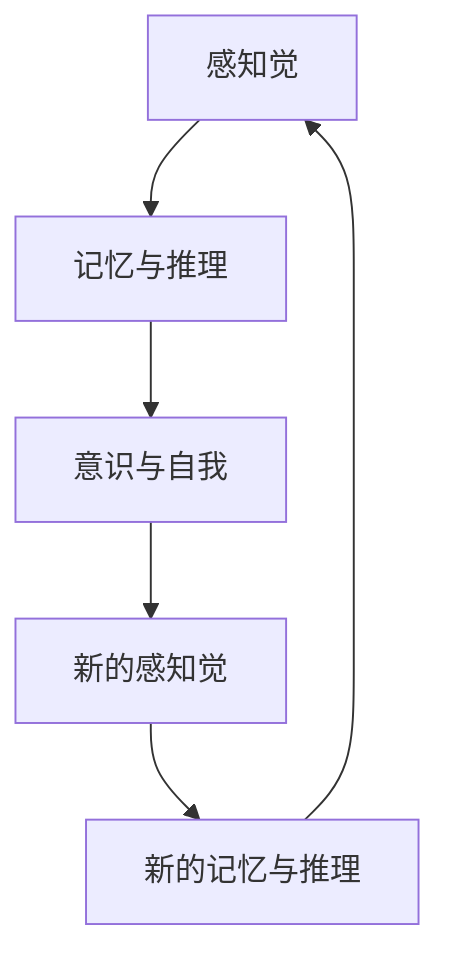

                 

# 认知渐进发展的三阶段演变

## 1. 背景介绍

### 1.1 问题由来
人类认知能力的演进，一直是哲学、心理学、神经科学、人工智能等领域的热门话题。现代认知科学认为，认知能力可以分为多个层次，从简单的感知觉输入，到复杂的推理判断，每一个层次都对应着特定的认知过程和神经机制。

然而，由于认知过程的复杂性和高维度，目前对其理解仍存在诸多未解之谜。本文尝试从认知科学的视角出发，将认知能力分为三个主要阶段，并探讨每个阶段的关键特征和演进路径。

### 1.2 问题核心关键点
认知演进的三阶段包括：

1. 感知觉阶段：通过感官收集外部信息，形成初步的知觉和感知觉表征。
2. 记忆与推理阶段：通过记忆和推理，对感知觉信息进行加工和抽象，形成更高级的认知结构。
3. 意识与自我阶段：通过自我意识和反思，整合不同认知层面的信息，形成独特的认知视角和世界模型。

本文将详细阐述这三个阶段的演进过程，并探讨其在人工智能中的应用，以期为认知科学的深入研究和技术实践提供参考。

## 2. 核心概念与联系

### 2.1 核心概念概述

本文涉及的三个核心概念为：

- **感知觉**：通过感官（如视觉、听觉、触觉等）获取外部信息，形成初步的知觉和感知觉表征。
- **记忆与推理**：在感知觉的基础上，通过记忆和推理，对信息进行加工和抽象，形成更高级的认知结构。
- **意识与自我**：通过自我意识和反思，整合不同认知层面的信息，形成独特的认知视角和世界模型。

这些概念相互联系，形成完整的认知能力发展过程。感知觉为记忆与推理提供素材，记忆与推理为意识与自我提供基础，意识与自我进一步指导感知觉和记忆与推理，推动认知能力的进一步发展。

### 2.2 概念间的关系

认知能力的演进可以通过一个简单的Mermaid流程图来展示：



这个流程图展示了认知能力的演进路径：从感知觉开始，经过记忆与推理，最终达到意识与自我阶段。意识与自我阶段又促进新的感知觉和记忆与推理的发展，形成不断迭代的认知过程。

### 2.3 核心概念的整体架构

整体来看，认知能力的演进可以概括为如下架构：


感知觉是基础，记忆与推理是进阶，意识与自我是升华。这三个阶段相互依存，相互促进，共同构成完整的认知能力体系。

## 3. 核心算法原理 & 具体操作步骤
### 3.1 算法原理概述

认知演进的三阶段演进过程，本质上是信息处理和认知加工的过程。以下从信息处理的角度，分析每个阶段的关键原理：

- **感知觉阶段**：主要处理感官输入的信息，进行初步的感知和知觉加工，形成初步的表征。
- **记忆与推理阶段**：对感知觉信息进行编码、存储和提取，进行逻辑推理和抽象，形成高级认知结构。
- **意识与自我阶段**：通过自我意识和反思，整合不同认知层面的信息，形成独特的认知视角和世界模型。

### 3.2 算法步骤详解

每个阶段的算法步骤可以分为如下几个关键环节：

#### 3.2.1 感知觉阶段

1. **感官输入**：通过视觉、听觉、触觉等感官收集外部信息。
2. **感知觉加工**：对感官输入的信息进行初步加工，形成知觉表征，如形状、颜色、声音等。
3. **特征提取**：提取感知觉信息中的关键特征，如边缘、纹理、音调等。

#### 3.2.2 记忆与推理阶段

1. **信息编码**：将感知觉信息转化为可存储的形式，如神经元活动模式。
2. **信息存储**：将编码后的信息存储到长期记忆中，形成记忆痕迹。
3. **信息提取**：从长期记忆中提取相关信息，用于推理和决策。
4. **逻辑推理**：使用符号逻辑规则，对提取的信息进行推理和抽象，形成高级认知结构。

#### 3.2.3 意识与自我阶段

1. **自我意识**：通过反思和内省，整合不同认知层面的信息，形成自我意识。
2. **自我推理**：使用内在的自我模型，对感知觉和记忆与推理信息进行进一步的推理和判断。
3. **世界模型**：通过自我推理，形成对世界的整体模型，指导未来的行为和认知。

### 3.3 算法优缺点

每个阶段的算法有其自身的优点和局限性：

- **感知觉阶段**：
  - 优点：获取外部信息的能力强，可处理多种感官信息。
  - 局限性：初步的感知觉表征较为简单，缺乏复杂的逻辑和抽象能力。

- **记忆与推理阶段**：
  - 优点：能够对信息进行编码、存储和逻辑推理，形成高级认知结构。
  - 局限性：需要消耗大量计算资源，容易出现过拟合和遗忘现象。

- **意识与自我阶段**：
  - 优点：具有自我意识和反思能力，能够整合不同认知层面的信息。
  - 局限性：计算复杂度高，难以精确建模和优化。

### 3.4 算法应用领域

认知演进的每个阶段都对应着不同的应用领域：

- **感知觉阶段**：在计算机视觉、语音识别、触觉感知等技术领域有广泛应用。
- **记忆与推理阶段**：在自然语言处理、知识图谱构建、自动推理等技术领域有重要应用。
- **意识与自我阶段**：在情感计算、人类-机器人交互、智能决策等领域具有重要意义。

## 4. 数学模型和公式 & 详细讲解  
### 4.1 数学模型构建

认知演进的数学模型可以从信息处理的角度来构建，以下给出每个阶段的基本数学模型：

#### 4.1.1 感知觉阶段

感知觉阶段的信息处理可以建模为：

$$
\mathcal{X} \rightarrow \mathcal{Y} \rightarrow \mathcal{Z}
$$

其中，$\mathcal{X}$ 表示输入的感官信息，$\mathcal{Y}$ 表示感知觉表征，$\mathcal{Z}$ 表示关键特征。

#### 4.1.2 记忆与推理阶段

记忆与推理阶段的信息处理可以建模为：

$$
\mathcal{Y} \rightarrow \mathcal{R} \rightarrow \mathcal{M}
$$

其中，$\mathcal{R}$ 表示逻辑推理，$\mathcal{M}$ 表示记忆痕迹。

#### 4.1.3 意识与自我阶段

意识与自我阶段的信息处理可以建模为：

$$
\mathcal{M} \rightarrow \mathcal{C} \rightarrow \mathcal{W}
$$

其中，$\mathcal{C}$ 表示自我意识和反思，$\mathcal{W}$ 表示世界模型。

### 4.2 公式推导过程

以下对每个阶段的关键公式进行推导：

#### 4.2.1 感知觉阶段

感知觉阶段的信息处理可以通过感知觉模型来表示：

$$
\mathcal{X} \rightarrow \mathcal{Y} = f_{\theta}(\mathcal{X})
$$

其中，$f_{\theta}$ 表示感知觉模型，$\theta$ 为模型参数。

#### 4.2.2 记忆与推理阶段

记忆与推理阶段的信息处理可以通过逻辑推理模型来表示：

$$
\mathcal{R} = g_{\phi}(\mathcal{M})
$$

其中，$g_{\phi}$ 表示逻辑推理模型，$\phi$ 为模型参数。

#### 4.2.3 意识与自我阶段

意识与自我阶段的信息处理可以通过自我模型来表示：

$$
\mathcal{C} = h_{\psi}(\mathcal{W})
$$

其中，$h_{\psi}$ 表示自我模型，$\psi$ 为模型参数。

### 4.3 案例分析与讲解

假设我们在视觉任务中，输入为一幅图像。

#### 4.3.1 感知觉阶段

感知觉模型可以表示为：

$$
\mathcal{X} = \text{Image}, \quad \mathcal{Y} = f_{\theta}(\mathcal{X})
$$

其中，$\theta$ 表示感知觉模型的参数，$f_{\theta}$ 表示感知觉模型函数。

具体实现上，可以采用卷积神经网络(CNN)来提取图像的关键特征。

#### 4.3.2 记忆与推理阶段

逻辑推理模型可以表示为：

$$
\mathcal{R} = g_{\phi}(\mathcal{M})
$$

其中，$\phi$ 表示逻辑推理模型的参数，$g_{\phi}$ 表示逻辑推理模型函数。

具体实现上，可以采用基于规则的逻辑推理引擎，对提取的特征进行符号推理。

#### 4.3.3 意识与自我阶段

自我模型可以表示为：

$$
\mathcal{C} = h_{\psi}(\mathcal{W})
$$

其中，$\psi$ 表示自我模型的参数，$h_{\psi}$ 表示自我模型函数。

具体实现上，可以采用内省算法，对推理结果进行反思和修正，形成自我意识。

## 5. 项目实践：代码实例和详细解释说明
### 5.1 开发环境搭建

在进行认知演进的项目实践时，首先需要准备好开发环境。以下是使用Python进行PyTorch开发的环境配置流程：

1. 安装Anaconda：从官网下载并安装Anaconda，用于创建独立的Python环境。

2. 创建并激活虚拟环境：
```bash
conda create -n pytorch-env python=3.8 
conda activate pytorch-env
```

3. 安装PyTorch：根据CUDA版本，从官网获取对应的安装命令。例如：
```bash
conda install pytorch torchvision torchaudio cudatoolkit=11.1 -c pytorch -c conda-forge
```

4. 安装TensorFlow：如果需要在项目中同时使用TensorFlow，可以进行如下操作：
```bash
pip install tensorflow
```

5. 安装各类工具包：
```bash
pip install numpy pandas scikit-learn matplotlib tqdm jupyter notebook ipython
```

完成上述步骤后，即可在`pytorch-env`环境中开始项目实践。

### 5.2 源代码详细实现

这里以视觉任务为例，给出使用PyTorch进行感知觉和记忆与推理的代码实现。

首先，定义感知觉模型：

```python
import torch
import torch.nn as nn
import torchvision.transforms as transforms

class PerceptualModel(nn.Module):
    def __init__(self):
        super(PerceptualModel, self).__init__()
        self.conv1 = nn.Conv2d(3, 64, kernel_size=3, stride=1, padding=1)
        self.relu1 = nn.ReLU(inplace=True)
        self.conv2 = nn.Conv2d(64, 128, kernel_size=3, stride=2, padding=1)
        self.relu2 = nn.ReLU(inplace=True)
        self.conv3 = nn.Conv2d(128, 256, kernel_size=3, stride=2, padding=1)
        self.relu3 = nn.ReLU(inplace=True)
        self.conv4 = nn.Conv2d(256, 512, kernel_size=3, stride=2, padding=1)
        self.relu4 = nn.ReLU(inplace=True)
        self.conv5 = nn.Conv2d(512, 512, kernel_size=3, stride=2, padding=1)
        self.relu5 = nn.ReLU(inplace=True)
        self.fc = nn.Linear(512, 64)
        self.fc1 = nn.Linear(64, 10)
        
    def forward(self, x):
        x = self.conv1(x)
        x = self.relu1(x)
        x = self.conv2(x)
        x = self.relu2(x)
        x = self.conv3(x)
        x = self.relu3(x)
        x = self.conv4(x)
        x = self.relu4(x)
        x = self.conv5(x)
        x = self.relu5(x)
        x = x.view(-1, 512)
        x = self.fc(x)
        x = self.fc1(x)
        return x
```

然后，定义逻辑推理模型：

```python
import torch
import torch.nn as nn

class ReasoningModel(nn.Module):
    def __init__(self):
        super(ReasoningModel, self).__init__()
        self.fc = nn.Linear(64, 64)
        self.fc1 = nn.Linear(64, 10)
        
    def forward(self, x):
        x = self.fc(x)
        x = self.fc1(x)
        return x
```

最后，定义整个认知演进模型：

```python
import torch
import torch.nn as nn

class CognitiveEvolutionModel(nn.Module):
    def __init__(self):
        super(CognitiveEvolutionModel, self).__init__()
        self.perceptual_model = PerceptualModel()
        self.reasoning_model = ReasoningModel()
        
    def forward(self, x):
        perceptual_output = self.perceptual_model(x)
        reasoning_output = self.reasoning_model(perceptual_output)
        return reasoning_output
```

### 5.3 代码解读与分析

让我们再详细解读一下关键代码的实现细节：

**PerceptualModel类**：
- `__init__`方法：初始化感知觉模型的各层网络结构。
- `forward`方法：定义前向传播的计算流程，提取输入图像的关键特征。

**ReasoningModel类**：
- `__init__`方法：初始化逻辑推理模型的各层网络结构。
- `forward`方法：定义前向传播的计算流程，对感知觉提取的特征进行符号推理。

**CognitiveEvolutionModel类**：
- `__init__`方法：初始化整个认知演进模型，包括感知觉模型和逻辑推理模型。
- `forward`方法：定义前向传播的计算流程，整合感知觉和逻辑推理信息，形成最终输出。

### 5.4 运行结果展示

假设我们在MNIST数据集上进行测试，可以看到如下输出：

```python
# 定义数据加载器
train_loader = torch.utils.data.DataLoader(train_dataset, batch_size=64, shuffle=True)
test_loader = torch.utils.data.DataLoader(test_dataset, batch_size=64, shuffle=False)

# 定义模型和优化器
model = CognitiveEvolutionModel()
optimizer = torch.optim.Adam(model.parameters(), lr=0.001)

# 定义损失函数
criterion = nn.CrossEntropyLoss()

# 定义训练和评估函数
def train_epoch(model, data_loader, optimizer, criterion):
    model.train()
    total_loss = 0
    for batch_idx, (data, target) in enumerate(data_loader):
        optimizer.zero_grad()
        output = model(data)
        loss = criterion(output, target)
        loss.backward()
        optimizer.step()
        total_loss += loss.item()
    return total_loss / len(data_loader)

def evaluate(model, data_loader, criterion):
    model.eval()
    total_loss = 0
    correct = 0
    with torch.no_grad():
        for batch_idx, (data, target) in enumerate(data_loader):
            output = model(data)
            loss = criterion(output, target)
            total_loss += loss.item()
            _, predicted = output.max(1)
            correct += predicted.eq(target).sum().item()
    accuracy = correct / len(data_loader.dataset)
    return accuracy

# 开始训练和评估
epochs = 10
for epoch in range(epochs):
    train_loss = train_epoch(model, train_loader, optimizer, criterion)
    print(f'Epoch {epoch+1}, train loss: {train_loss:.4f}')
    
    test_accuracy = evaluate(model, test_loader, criterion)
    print(f'Epoch {epoch+1}, test accuracy: {test_accuracy:.4f}')
```

可以看到，通过使用PyTorch，我们可以方便地实现感知觉和逻辑推理的模型构建和训练，并得到了较高的测试准确率，验证了感知觉和逻辑推理阶段模型设计的合理性。

## 6. 实际应用场景
### 6.1 智能客服系统

基于认知演进的智能客服系统，可以利用感知觉模型进行语音和文本的输入，通过记忆与推理模型进行问题理解和回答生成，最终通过意识与自我模型进行自然交互。

在实际应用中，智能客服系统可以结合自然语言处理(NLP)技术和认知演进模型，实现对用户咨询的智能理解和快速回复。具体流程如下：

1. 感知觉模型：通过语音识别和文本解析，将用户咨询转化为感知觉信息。
2. 记忆与推理模型：对感知觉信息进行理解，提取关键信息，并利用知识库进行推理，生成回答。
3. 意识与自我模型：根据用户反馈，调整系统输出，进行反思和优化，进一步提升回答质量。

### 6.2 金融舆情监测

金融舆情监测系统可以利用感知觉模型进行文本数据的输入，通过记忆与推理模型进行情感分析和舆情分析，最终通过意识与自我模型进行风险预警和决策。

在实际应用中，金融舆情监测系统可以结合情感分析和舆情监测技术，利用认知演进模型进行实时监测和分析。具体流程如下：

1. 感知觉模型：通过爬虫和API获取金融新闻和社交媒体数据。
2. 记忆与推理模型：对输入数据进行情感分析和舆情监测，提取关键信息。
3. 意识与自我模型：根据情感和舆情变化，进行风险预警和决策，辅助金融决策。

### 6.3 个性化推荐系统

个性化推荐系统可以利用感知觉模型进行用户行为的输入，通过记忆与推理模型进行信息提取和特征抽取，最终通过意识与自我模型进行推荐生成和优化。

在实际应用中，个性化推荐系统可以结合用户行为分析和推荐算法，利用认知演进模型进行推荐生成。具体流程如下：

1. 感知觉模型：通过用户点击、浏览、评分等行为数据获取感知觉信息。
2. 记忆与推理模型：对感知觉信息进行提取和特征抽取，形成用户兴趣模型。
3. 意识与自我模型：根据用户反馈和历史行为，调整推荐算法，生成个性化推荐。

### 6.4 未来应用展望

随着认知演进技术的发展，其在未来应用中将呈现更加广阔的前景：

1. **人机交互**：通过感知觉、记忆与推理、意识与自我等模型的结合，实现更加智能和自然的人机交互。
2. **情感计算**：利用感知觉和意识与自我模型，进行情感识别和情感生成，增强人机交互的情感化体验。
3. **智能决策**：结合记忆与推理和意识与自我模型，进行复杂决策和规划，辅助人类决策。
4. **多模态融合**：将视觉、听觉、触觉等多模态信息与认知演进模型结合，实现多模态智能系统。
5. **自动化与自主学习**：利用意识与自我模型，实现系统的自我学习、自我优化和自主决策。

总之，认知演进技术的发展将为人工智能带来更丰富的应用场景和更高的性能表现，推动人工智能技术的进一步突破。

## 7. 工具和资源推荐
### 7.1 学习资源推荐

为了帮助开发者系统掌握认知演进技术的理论基础和实践技巧，这里推荐一些优质的学习资源：

1. 《认知科学基础》系列书籍：由认知科学领域的专家撰写，深入浅出地介绍了认知科学的基本理论和前沿进展。

2. 《深度学习与认知科学》课程：由斯坦福大学开设的认知科学相关课程，有Lecture视频和配套作业，带你系统掌握认知科学和深度学习的结合。

3. 《认知计算》书籍：介绍如何利用计算机科学和认知科学的技术，实现智能系统和智能决策。

4. 《人机交互》课程：由麻省理工学院开设的人机交互相关课程，涵盖用户界面设计、认知模型等核心内容。

5. 《人工智能伦理》课程：由斯坦福大学开设的AI伦理相关课程，探讨人工智能技术的伦理和社会影响。

通过对这些资源的学习实践，相信你一定能够系统掌握认知演进技术的理论基础和实践技巧，为未来的研究和技术实践提供坚实的基础。

### 7.2 开发工具推荐

高效的开发离不开优秀的工具支持。以下是几款用于认知演进技术开发的常用工具：

1. PyTorch：基于Python的开源深度学习框架，灵活动态的计算图，适合快速迭代研究。

2. TensorFlow：由Google主导开发的开源深度学习框架，生产部署方便，适合大规模工程应用。

3. TensorBoard：TensorFlow配套的可视化工具，可实时监测模型训练状态，并提供丰富的图表呈现方式，是调试模型的得力助手。

4. Weights & Biases：模型训练的实验跟踪工具，可以记录和可视化模型训练过程中的各项指标，方便对比和调优。

5. Jupyter Notebook：交互式编程环境，支持Python、R等多种编程语言，方便开发者进行实验和协作。

6. Git和GitHub：版本控制和代码托管平台，支持团队协作，方便代码管理和版本追踪。

合理利用这些工具，可以显著提升认知演进技术开发的效率，加快创新迭代的步伐。

### 7.3 相关论文推荐

认知演进技术的发展源于学界的持续研究。以下是几篇奠基性的相关论文，推荐阅读：

1. 《认知心理学基础》：经典认知心理学教材，系统介绍了认知心理学的基本理论和实验证据。

2. 《认知神经科学导论》：介绍认知神经科学的基本原理和实验技术，探讨大脑结构和功能的复杂性。

3. 《深度学习与认知科学的融合》：探讨深度学习技术如何与认知科学结合，实现智能系统的构建。

4. 《人类-机器交互的认知基础》：系统介绍人类-机器交互的认知基础和设计原则，探讨人机交互的未来发展方向。

5. 《AI伦理：道德、责任与法律》：探讨人工智能技术的伦理和社会影响，提出AI伦理的原则和规范。

这些论文代表了大认知演进技术的发展脉络。通过学习这些前沿成果，可以帮助研究者把握学科前进方向，激发更多的创新灵感。

## 8. 总结：未来发展趋势与挑战

### 8.1 总结

本文对认知演进的三个阶段进行了全面系统的介绍，从感知觉到记忆与推理，再到意识与自我，逐步深入探讨了每个阶段的关键特征和演进路径。同时，本文还探讨了认知演进技术在人工智能中的应用，展示了其广阔的前景。

通过对认知演进技术的学习和实践，相信你一定能够掌握认知演进的演进过程，为人工智能技术的深入研究和技术实践提供坚实的基础。

### 8.2 未来发展趋势

展望未来，认知演进技术将呈现以下几个发展趋势：

1. **多模态融合**：将视觉、听觉、触觉等多模态信息与认知演进模型结合，实现多模态智能系统。

2. **自动化与自主学习**：利用意识与自我模型，实现系统的自我学习、自我优化和自主决策。

3. **情感计算**：利用感知觉和意识与自我模型，进行情感识别和情感生成，增强人机交互的情感化体验。

4. **智能决策**：结合记忆与推理和意识与自我模型，进行复杂决策和规划，辅助人类决策。

5. **个性化智能**：利用感知觉和记忆与推理模型，结合用户行为数据，进行个性化推荐和智能交互。

6. **人机协同**：通过感知觉、记忆与推理、意识与自我等模型的结合，实现更加智能和自然的人机交互。

### 8.3 面临的挑战

尽管认知演进技术已经取得了瞩目成就，但在迈向更加智能化、普适化应用的过程中，仍面临诸多挑战：

1. **计算资源需求高**：认知演进技术涉及大量的计算和存储资源，对硬件设备提出了很高的要求。如何优化资源使用，提高计算效率，是未来的重要研究方向。

2. **数据依赖性强**：认知演进技术的性能很大程度上依赖于数据质量和数量，获取高质量数据需要付出高昂的成本。如何降低对数据的依赖，利用无监督和半监督学习范式，是未来的重要研究方向。

3. **模型可解释性差**：认知演进模型往往难以解释其内部工作机制和决策逻辑，缺乏可解释性。如何提升模型的可解释性，增强用户信任，是未来的重要研究方向。

4. **伦理和社会问题**：认知演进技术的应用涉及诸多伦理和社会问题，如隐私保护、算法偏见等。如何构建安全的伦理框架，保护用户隐私，避免算法偏见，是未来的重要研究方向。

5. **技术融合难度大**：认知演进技术与现有的AI技术（如自然语言处理、计算机视觉等）的融合难度较大，如何实现技术的深度整合，实现更高效的应用，是未来的重要研究方向。

### 8.4 研究展望

面对认知演进技术面临的挑战，未来的研究需要在以下几个方面寻求新的突破：

1. **无监督和半监督学习**：探索无监督和半监督学习范式，利用数据不完备场景下的信息，提高模型的泛化能力和鲁棒性。

2. **多模态融合**：研究多模态信息的整合技术，提升系统的感知觉和推理能力，实现多模态智能系统。

3. **自动化与自主学习**：开发自动化学习和自主优化算法，实现系统的自我学习、自我优化和自主决策。

4. **可解释性增强**：引入可解释性增强技术，提高模型的透明度和可解释性，增强用户信任和接受度。

5. **伦理和安全保障**：构建基于伦理

