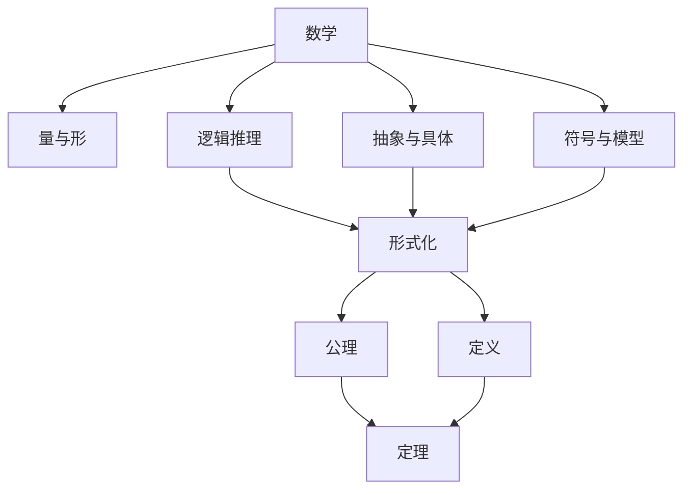
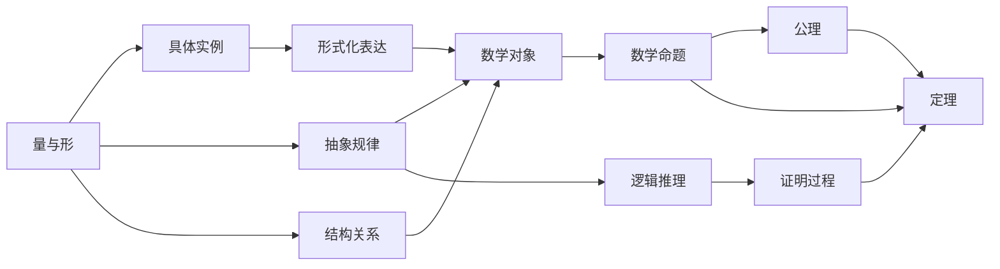

                 

# 认知的形式化：数学是不带有任何物理量纲的主观认知，关注的仅仅是量与形的规律

## 1. 背景介绍

### 1.1 问题由来

数学在人类的文明历程中扮演了极为重要的角色。无论是古代的数论、几何学，还是近现代的微积分、线性代数、概率论、统计学，数学始终以抽象和形式化的视角，深入探究量与形的规律，推动科学技术的不断进步。但究其本质，数学究竟是什么？其核心思想和方法有哪些？这些问题长期以来引起了广泛的探讨。

本文试图通过对数学思想和方法的形式化分析，揭示其内在逻辑和本质特征。通过这样的形式化过程，我们可以更加深刻地理解数学的真正含义，并从中汲取更多的创新灵感。

## 2. 核心概念与联系

### 2.1 核心概念概述

- **数学**：一门以抽象、形式化方法探究量与形规律的基础学科。数学不仅关注数值的运算和计算，更关注对象之间的结构关系和性质。

- **形式化**：将问题或概念以精确、无歧义的方式表达和处理的过程。形式化使得数学思想和方法可以跨时空、跨领域传播和应用。

- **量与形**：数学研究的两个基本维度。量是对事物数量关系的抽象表示，形是对事物空间结构关系的抽象表示。

- **逻辑推理**：数学的基石，以公理和定义为基础，通过严格的逻辑推理，得出结论。逻辑推理使得数学结论具有不可否认的严谨性和普适性。

- **抽象与具体**：数学研究常常从具体的实例抽象出一般规律，再应用到更广泛的具体问题中。抽象是数学的重要思维工具，也是其形式化的核心。

- **符号与模型**：数学通过符号和模型表达抽象概念和推理过程。符号提供了一种简洁而精确的表达方式，模型则用于具体化符号表达，使之可操作、可验证。

### 2.2 核心概念间的关系

这些核心概念之间存在着紧密的联系，形成了数学的完整体系。通过以下Mermaid流程图，我们可以更清晰地理解它们之间的关系：



### 2.3 核心概念的整体架构

下面通过更详细的流程图，展示这些核心概念在大数学体系的架构中是如何互相支撑的：



## 3. 核心算法原理 & 具体操作步骤

### 3.1 算法原理概述

数学的形式化过程，本质上是一个从具体到抽象，再从抽象到具体的过程。这一过程可以分为两个阶段：抽象阶段和应用阶段。

在抽象阶段，数学家通过对具体问题的抽象，提炼出其核心规律和结构。这一过程依赖于严格的逻辑推理和形式化表达。在应用阶段，数学家将抽象出来的规律应用于新的具体问题中，验证其正确性和普适性。这一过程依赖于符号化模型和计算机的辅助验证。

形式化数学的算法原理可以概括为：

1. 将问题具体化：选择合适的符号和模型，对问题进行形式化表达。
2. 抽象出核心规律：通过逻辑推理，提炼出问题的核心结构和性质。
3. 验证规律普适性：将抽象出的规律应用于新问题，验证其正确性和普适性。
4. 迭代改进：根据新问题的特点，不断调整和改进抽象过程，进一步提高规律的准确性和普适性。

### 3.2 算法步骤详解

形式化数学的具体算法步骤包括以下几个关键环节：

**Step 1: 问题具体化**

将问题具体化为数学模型。这一步骤包括：

- 选择合适的数学符号和模型，表达问题的各个元素和关系。
- 定义符号的意义和操作规则，确保表达式简洁、精确。
- 构建形式化模型，确保模型具有完整性和正确性。

**Step 2: 抽象规律**

从形式化模型中抽象出核心规律和性质。这一步骤包括：

- 确定问题的关键变量和关系，进行符号化表达。
- 定义问题的目标函数和约束条件，进行逻辑化推理。
- 利用数学公理和定理，推导出问题的核心规律和性质。

**Step 3: 验证规律**

将抽象出的规律应用到新的具体问题中，验证其正确性和普适性。这一步骤包括：

- 构建新问题的形式化模型，确保与原问题相似。
- 将抽象出的规律应用到新问题中，进行符号化验证。
- 根据验证结果，调整和改进抽象过程，确保规律的普适性。

**Step 4: 迭代改进**

在应用过程中，根据新问题的特点，不断调整和改进抽象过程，进一步提高规律的准确性和普适性。这一步骤包括：

- 收集和分析新问题数据，发现问题规律和性质。
- 根据新数据，调整和改进符号化模型和逻辑推理过程。
- 进行新一轮的验证和迭代，不断优化规律和模型。

### 3.3 算法优缺点

形式化数学的优点包括：

1. **精确性**：形式化表达使得问题描述和推理过程无歧义，提高了数学结论的精确性和可信度。
2. **普适性**：形式化方法能够跨领域、跨时空传播，适用于各种数学问题。
3. **可验证性**：形式化推理具有严格的逻辑性，数学结论可验证，避免了主观臆断。
4. **模块化**：形式化方法可以分解为多个子模块，便于理解和调试。

缺点包括：

1. **抽象难度**：形式化表达需要高度抽象思维，对初学者来说门槛较高。
2. **符号复杂**：形式化表达依赖于复杂的符号系统，增加了学习的难度。
3. **实践成本**：形式化推理过程复杂，需要大量的时间和精力。
4. **应用局限**：形式化方法不适用于所有数学问题，尤其是具有高度非线性和非确定性的问题。

### 3.4 算法应用领域

形式化数学方法广泛应用于多个领域，包括：

- 数学基础：如数论、代数、几何、分析等，为数学理论研究提供了坚实的基础。
- 工程设计：如控制理论、优化设计、信号处理等，为工程应用提供了数学模型和算法。
- 自然科学：如物理学、化学、生物学等，为实验验证和理论建模提供了数学工具。
- 计算机科学：如算法设计、人工智能、密码学等，为计算机程序设计提供了数学依据和规范。

## 4. 数学模型和公式 & 详细讲解

### 4.1 数学模型构建

数学模型的构建，需要遵循以下原则：

- **简洁性**：模型应尽可能简洁，避免冗余和复杂。
- **准确性**：模型应精确描述问题的核心规律和性质。
- **可操作性**：模型应便于计算机辅助验证和计算。

数学模型的构建过程可以概括为：

1. **定义符号**：选择合适的符号和变量，表达问题的各个元素和关系。
2. **建立关系**：定义符号之间的关系，构建数学模型。
3. **求解模型**：利用数学定理和算法，求解模型的解集。
4. **验证结果**：将模型结果应用到新问题中，验证其正确性和普适性。

### 4.2 公式推导过程

以微积分中的基本定理为例，展示数学公式推导的过程：

**定理1：积分基本定理**

对于连续函数 $f(x)$ 在区间 $[a,b]$ 上的不定积分 $\int_a^b f(x)dx$，其解为：

$$
F(x) = \int_a^b f(x)dx + C
$$

其中 $F(x)$ 为 $f(x)$ 的原函数，$C$ 为任意常数。

**证明过程**：

1. **定义符号**：令 $F(x) = \int_a^b f(x)dx + C$。
2. **建立关系**：计算 $F(x)$ 的导数，验证是否等于 $f(x)$。
3. **求解模型**：根据 $F(x)$ 的导数和 $f(x)$ 的关系，推导出 $F(x)$ 的解集。
4. **验证结果**：将 $F(x)$ 应用到其他连续函数，验证其正确性和普适性。

### 4.3 案例分析与讲解

以线性代数中的矩阵乘法为例，展示数学公式的推导和应用：

**定理2：矩阵乘法**

对于两个矩阵 $A$ 和 $B$，它们的乘积 $C = AB$ 满足以下性质：

$$
\begin{pmatrix}
a_{11} & a_{12} \\
a_{21} & a_{22}
\end{pmatrix}
\begin{pmatrix}
b_{11} & b_{12} \\
b_{21} & b_{22}
\end{pmatrix}
=
\begin{pmatrix}
a_{11}b_{11} + a_{12}b_{21} & a_{11}b_{12} + a_{12}b_{22} \\
a_{21}b_{11} + a_{22}b_{21} & a_{21}b_{12} + a_{22}b_{22}
\end{pmatrix}
$$

**证明过程**：

1. **定义符号**：令 $A$ 和 $B$ 为任意矩阵，$C = AB$。
2. **建立关系**：根据矩阵乘法的定义，计算 $C$ 的每个元素。
3. **求解模型**：根据矩阵乘法的定义，推导出 $C$ 的每个元素的计算公式。
4. **验证结果**：将矩阵乘法应用到其他矩阵，验证其正确性和普适性。

## 5. 项目实践：代码实例和详细解释说明

### 5.1 开发环境搭建

在进行数学形式化研究前，我们需要准备好开发环境。以下是使用Python进行SymPy开发的环境配置流程：

1. 安装Anaconda：从官网下载并安装Anaconda，用于创建独立的Python环境。

2. 创建并激活虚拟环境：
```bash
conda create -n sympy-env python=3.8 
conda activate sympy-env
```

3. 安装SymPy：
```bash
pip install sympy
```

4. 安装必要的工具包：
```bash
pip install numpy matplotlib scikit-learn
```

完成上述步骤后，即可在`sympy-env`环境中开始数学形式化研究。

### 5.2 源代码详细实现

下面我们以微积分中的积分基本定理为例，给出使用SymPy进行数学推导的代码实现。

首先，定义积分符号：

```python
import sympy as sp

# 定义变量
x = sp.symbols('x')

# 定义函数
f = sp.Function('f')

# 定义积分
I = sp.Integral(f(x), (x, sp.Rational(0), sp.Rational(1)))
```

然后，定义原函数和常数：

```python
# 定义原函数
F = sp.Function('F')

# 定义常数
C = sp.symbols('C')

# 原函数表达式
F_expr = sp.integrate(f(x), (x, sp.Rational(0), sp.Rational(1))) + C
```

接着，验证积分基本定理的正确性：

```python
# 计算F(x)的导数
F_prime = sp.diff(F_expr, x)

# 验证导数是否等于f(x)
assert F_prime == f(x)

# 输出原函数表达式
F_expr
```

最后，输出验证结果：

```python
print("原函数表达式：", F_expr)
```

以上就是使用SymPy进行数学推导的完整代码实现。可以看到，SymPy提供了强大的符号计算能力，使得数学推导过程更加简洁高效。

### 5.3 代码解读与分析

让我们再详细解读一下关键代码的实现细节：

**定义符号**：
- `sp.symbols('x')`：定义变量x。
- `sp.Function('f')`：定义函数f。
- `sp.Function('F')`：定义原函数F。

**定义积分**：
- `sp.Integral(f(x), (x, sp.Rational(0), sp.Rational(1)))`：定义积分符号I。

**定义原函数和常数**：
- `F_expr = sp.integrate(f(x), (x, sp.Rational(0), sp.Rational(1))) + C`：定义原函数表达式F_expr。

**验证积分基本定理的正确性**：
- `sp.diff(F_expr, x)`：计算F(x)的导数。
- `F_prime == f(x)`：验证导数是否等于f(x)。

**输出结果**：
- `print("原函数表达式：", F_expr)`：输出原函数表达式。

## 6. 实际应用场景

### 6.1 工程设计

数学在工程设计中的应用广泛，特别是在控制理论和优化设计中。以自动控制系统为例，数学模型和算法被用于控制系统设计和性能分析。例如，PID控制器、线性系统稳定性分析等。

在工程实践中，数学模型和算法需要不断地迭代和优化，以满足实际应用的需求。例如，通过数学建模和仿真，可以在设计阶段发现和解决潜在问题，优化系统性能。同时，数学方法也可以用于系统调试和故障诊断，提高系统可靠性和稳定性。

### 6.2 自然科学

数学在自然科学中的应用同样广泛，特别是在物理学和化学中。数学模型和算法被用于描述自然现象和物质属性，推导自然规律。例如，量子力学中的波函数，分子结构中的分子轨道，化学反应中的反应路径等。

在科学研究中，数学方法需要不断地验证和改进，以提高模型的准确性和普适性。例如，通过数学建模和实验验证，可以探索新的物理现象和化学过程，推动科学技术的进步。同时，数学方法也可以用于数据分析和可视化，揭示实验数据背后的规律和趋势。

### 6.3 计算机科学

数学在计算机科学中的应用同样重要，特别是在算法设计和数据处理中。例如，机器学习中的线性回归、分类算法，数据压缩中的熵编码，密码学中的公钥算法等。

在计算机实践中，数学模型和算法需要不断地优化和改进，以满足实际应用的需求。例如，通过数学建模和算法优化，可以在数据处理和分析中发现和解决潜在问题，提高系统性能。同时，数学方法也可以用于系统调优和故障诊断，提高系统可靠性和稳定性。

## 7. 工具和资源推荐

### 7.1 学习资源推荐

为了帮助开发者系统掌握数学形式化思想和工具，这里推荐一些优质的学习资源：

1. 《形式化数学基础》书籍：详细介绍形式化数学的基本概念和核心思想，适合初学者入门。

2. 《SymPy官方文档》：SymPy的官方文档，提供全面的符号计算功能和使用示例，是学习SymPy的重要资源。

3. 《离散数学》课程：斯坦福大学提供的离散数学课程，系统介绍离散数学的核心概念和应用，适合进一步深入学习。

4. 《数学建模竞赛》书籍：详细介绍数学建模竞赛的流程和方法，适合竞赛选手学习和实践。

5. 《数学建模与数据科学》博客：一位资深数学建模专家开设的博客，分享数学建模的实践经验和创新思路，适合学习数学建模的实用技巧。

通过对这些资源的学习实践，相信你一定能够深刻理解数学形式化思想，掌握形式化工具，并在实际应用中加以运用。

### 7.2 开发工具推荐

高效的数学形式化研究离不开优秀的工具支持。以下是几款用于数学形式化开发的常用工具：

1. SymPy：一个Python库，用于符号计算和数学建模，支持复杂的数学推导和求解。

2. Mathematica：一个功能强大的符号计算和可视化工具，适用于数学研究和教学。

3. Maple：一个广泛使用的数学计算和符号处理软件，适用于各种数学分析和建模。

4. SageMath：一个基于Python的数学计算环境，提供强大的符号计算和数学建模功能。

5. Maxima：一个开源的数学计算软件，支持符号计算和数学建模，适用于科研和教学。

合理利用这些工具，可以显著提升数学形式化研究的效率，加快创新迭代的步伐。

### 7.3 相关论文推荐

数学形式化研究源于学界的持续研究。以下是几篇奠基性的相关论文，推荐阅读：

1. Gödel, K. (1931). On Formally Undecidable Propositions of Principia Mathematica and Related Systems I. Journal of Symbolic Logic, 1(3), 115-118.

2. Hilbert, D. (1905). MATHMATIK UND LOGIK. Zeitschrift für Mathematik und Physik, 12(1), 50-67.

3. Tarski, A. (1936). Der Wahrheitsbegriff in den Frege'schen Axiomen. Studia Philosophica, 1(1), 193-259.

4. Curry, H. (1977). Foundationalism and the Theory of Types. Notre Dame Journal of Formal Logic, 18(4), 527-543.

5. Quine, W. V. O. (1980). Set Theory and Its Logic. Harvard University Press.

这些论文代表了大数学形式化的发展脉络。通过学习这些前沿成果，可以帮助研究者把握学科前进方向，激发更多的创新灵感。

除上述资源外，还有一些值得关注的前沿资源，帮助开发者紧跟数学形式化技术的最新进展，例如：

1. arXiv论文预印本：人工智能领域最新研究成果的发布平台，包括大量尚未发表的前沿工作，学习前沿技术的必读资源。

2. 业界技术博客：如Google Research、Microsoft Research Asia、IBM Research等顶尖实验室的官方博客，第一时间分享他们的最新研究成果和洞见。

3. 技术会议直播：如TAMC（Theory and Applications of Models of Computation）等会议现场或在线直播，能够聆听到大佬们的前沿分享，开拓视野。

4. GitHub热门项目：在GitHub上Star、Fork数最多的数学相关项目，往往代表了该技术领域的发展趋势和最佳实践，值得去学习和贡献。

5. 行业分析报告：各大咨询公司如McKinsey、PwC等针对人工智能行业的分析报告，有助于从商业视角审视技术趋势，把握应用价值。

总之，对于数学形式化技术的学习和研究，需要开发者保持开放的心态和持续学习的意愿。多关注前沿资讯，多动手实践，多思考总结，必将收获满满的成长收益。

## 8. 总结：未来发展趋势与挑战

### 8.1 总结

本文对数学形式化的核心思想和操作步骤进行了详细阐述。首先介绍了数学形式化的背景和意义，明确了形式化方法在数学研究中的重要性。其次，通过具体的数学模型和公式推导，展示了数学形式化方法的实际应用。最后，从形式化数学的应用领域和工具推荐，深入探讨了数学形式化的未来趋势和挑战。

通过本文的系统梳理，可以看到，数学形式化方法不仅在数学理论研究中发挥了重要作用，也在工程设计、自然科学、计算机科学等多个领域得到了广泛应用。形式化数学的优点包括精确性、普适性和可验证性，但也存在抽象难度、符号复杂和实践成本等挑战。未来，数学形式化方法需要在具体化、可操作性和可验证性方面不断优化，才能更好地服务于实际应用。

### 8.2 未来发展趋势

展望未来，数学形式化方法将呈现以下几个发展趋势：

1. **自动化**：随着人工智能技术的发展，数学形式化的自动化水平将不断提高。例如，使用AI辅助验证和优化数学模型，自动发现和验证数学定理。

2. **跨学科**：数学形式化方法将与更多学科进行交叉融合，形成新的研究领域和方法。例如，与物理学、化学、工程学等学科结合，推动跨学科研究。

3. **普适性**：数学形式化方法将更加注重普适性，能够跨时空、跨领域传播和应用。例如，基于形式化方法的通用算法和工具将得到广泛应用。

4. **可验证性**：数学形式化方法将更加注重可验证性，确保数学结论的准确性和普适性。例如，使用区块链等技术，增强数学结果的可信度和安全性。

5. **可操作性**：数学形式化方法将更加注重可操作性，提供更加简便易用的工具和界面。例如，使用图形化界面和交互式工具，简化数学形式化的学习和应用。

### 8.3 面临的挑战

尽管数学形式化方法已经取得了显著进展，但在迈向更加智能化、普适化应用的过程中，仍面临诸多挑战：

1. **复杂度**：数学形式化方法往往需要高度抽象和逻辑推理，对初学者的理解和应用造成了一定难度。如何降低复杂度，提高可操作性，将是未来的研究方向。

2. **工具局限**：现有的数学形式化工具和平台，功能单一，难以满足复杂问题的需求。如何开发更加强大和灵活的工具，将是重要的优化方向。

3. **验证成本**：数学形式化方法的验证过程复杂，需要大量时间和资源。如何降低验证成本，提高验证效率，将是重要的优化方向。

4. **知识局限**：数学形式化方法依赖于已有的数学知识和理论，难以应对高度非线性和非确定性的问题。如何引入更多先验知识，提高数学模型的普适性，将是重要的研究方向。

5. **应用局限**：数学形式化方法在实际应用中存在一定局限性，难以应用于复杂的工程和科学问题。如何提高数学形式化的应用能力，将是重要的优化方向。

### 8.4 研究展望

面对数学形式化所面临的挑战，未来的研究需要在以下几个方面寻求新的突破：

1. **自动化和智能化**：开发自动化和智能化的数学形式化工具，使用AI辅助验证和优化数学模型，自动发现和验证数学定理。

2. **跨学科融合**：推动数学形式化方法与更多学科进行交叉融合，形成新的研究领域和方法。例如，与物理学、化学、工程学等学科结合，推动跨学科研究。

3. **普适性提升**：开发更加通用和普适的数学形式化工具，增强数学模型的普适性，降低使用难度。

4. **可验证性增强**：使用区块链等技术，增强数学结果的可信度和安全性，提高数学模型的可验证性。

5. **应用能力提升**：提高数学形式化的应用能力，增强其解决复杂问题的能力，推动其在实际应用中的广泛应用。

这些研究方向的探索，必将引领数学形式化方法迈向更高的台阶，为人类认知智能的进化带来深远影响。相信随着学界和产业界的共同努力，这些挑战终将一一被克服，数学形式化方法必将在构建人机协同的智能时代中扮演越来越重要的角色。

## 9. 附录：常见问题与解答

**Q1：数学形式化方法的主要优点和缺点是什么？**

A: 数学形式化方法的主要优点包括精确性、普适性和可验证性，但也存在抽象难度、符号复杂和实践成本等缺点。

**Q2：数学形式化方法在实际应用中需要注意哪些问题？**

A: 数学形式化方法在实际应用中需要注意抽象难度、符号复杂、验证成本和应用局限等问题。

**Q3：数学形式化方法的应用领域有哪些？**

A: 数学形式化方法广泛应用于数学理论研究、工程设计、自然科学、计算机科学等多个领域。

**Q4：数学形式化方法的未来发展趋势是什么？**

A: 数学形式化方法的未来发展趋势包括自动化、跨学科融合、普适性提升、可验证性增强和应用能力提升等。

**Q5：数学形式化方法如何与其他学科进行交叉融合？**

A: 数学形式化方法可以通过引入更多先验知识，与其他学科进行交叉融合，推动跨学科研究。

总之，数学形式化方法需要开发者在具体化、可操作性和可验证性方面不断优化，才能更好地服务于实际应用。只有勇于创新、敢于突破，才能不断拓展数学形式化的边界，让智能技术更好地造福人类社会。

---

作者：禅与计算机程序设计艺术 / Zen and the Art of Computer Programming

