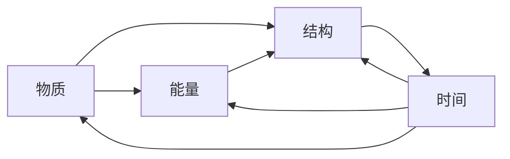
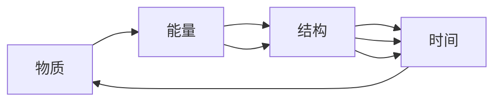

                 

# 认知的形式化：认知机器包括物质、能量、结构和时间4个基本要素

## 1. 背景介绍

### 1.1 问题由来
随着人工智能技术的迅速发展，人们对于智能机器的理解也逐渐深入。认知机器，即具备一定智能水平的机器，已经成为研究的热点。认知机器的核心在于模仿人类的认知过程，实现自主的推理、判断、学习等高级智能行为。然而，如何形式化地定义认知机器，是目前学术界和工业界亟待解决的问题。

### 1.2 问题核心关键点
认知机器的形式化定义需要从多个维度进行考量，包括物质、能量、结构和时间的四要素。物质和能量是认知机器的基础，结构是其内部组织的依据，时间则是认知过程的时间线。这四个要素共同构成认知机器的基本框架，对于理解认知机器的本质具有重要意义。

### 1.3 问题研究意义
通过形式化地定义认知机器，可以更好地理解其工作原理，指导认知机器的设计与开发，推动人工智能技术的深入研究。同时，形式化定义也有助于理论研究和实验验证，促进认知机器的实际应用。

## 2. 核心概念与联系

### 2.1 核心概念概述

#### 2.1.1 物质
物质是认知机器的物理载体，包括其硬件设备和软件系统。物质要素涉及计算机芯片、传感设备、内存存储、通信网络等，是认知机器运行的基础。

#### 2.1.2 能量
能量是认知机器的运行动力，包括电能、热能等。能量要素决定了认知机器的计算速度、存储容量、通信能力等性能指标。

#### 2.1.3 结构
结构是认知机器的内部组织形式，包括硬件架构、软件框架、算法模块等。结构要素决定了认知机器的信息处理方式、任务调度策略、模型优化方法等。

#### 2.1.4 时间
时间是认知机器的运行逻辑，包括处理时间、响应时间、学习时间等。时间要素决定了认知机器的任务执行效率、用户交互体验、自适应能力等。

这四个要素通过相互配合，共同构成认知机器的基本框架。下面我们将通过Mermaid流程图来展示这四个要素之间的联系：



这个流程图展示了物质、能量、结构和时间的相互关系：物质提供能量支持，能量驱动结构，结构决定时间，时间影响结构与能量。这种相互依存的关系，决定了认知机器的基本工作模式。

### 2.2 概念间的关系

这些核心概念之间的关系可以通过以下Mermaid流程图来展示：



这个流程图展示了物质、能量、结构和时间在认知机器中的相互作用关系：物质和能量是认知机器的基础，结构是认知过程的支撑，时间则是认知过程的时间线。

## 3. 核心算法原理 & 具体操作步骤

### 3.1 算法原理概述

认知机器的形式化定义需要从物质、能量、结构和时间的四要素出发，进行全面系统的分析和建模。认知机器的核心算法主要包括以下几个方面：

1. 物质-能量模型：用于描述认知机器的物理基础和运行机制，包括硬件架构、电源管理、热管理等。
2. 结构-时间模型：用于描述认知机器的内部组织形式和任务调度策略，包括算法设计、任务规划、模型优化等。
3. 能量-结构模型：用于描述认知机器的性能指标和资源分配，包括计算能力、存储容量、通信带宽等。
4. 结构-时间-物质模型：用于描述认知机器的动态变化过程，包括任务执行时间、交互时间、系统响应时间等。

这些算法模型共同构成认知机器的形式化定义，帮助理解其工作原理和设计方法。下面我们将详细讲解这些算法原理和具体操作步骤。

### 3.2 算法步骤详解

#### 3.2.1 物质-能量模型

物质-能量模型主要关注认知机器的物理基础和运行机制。其核心思想是将物质和能量要素结合，通过物理模型和计算模型进行描述。

1. 硬件架构设计：包括CPU、GPU、FPGA等计算单元，传感器、存储设备等输入输出单元，以及网络通信设备。硬件架构设计需要考虑功耗、散热、可靠性等因素。
2. 电源管理：包括电池供电、电源转换、能量存储等。电源管理需要考虑能效比、输出稳定性等因素。
3. 热管理：包括散热片、风扇、温度监测等。热管理需要考虑温度分布、热耗散等因素。

#### 3.2.2 结构-时间模型

结构-时间模型主要关注认知机器的内部组织形式和任务调度策略。其核心思想是将结构和时间要素结合，通过算法模型和调度模型进行描述。

1. 算法设计：包括机器学习算法、深度学习算法、符号推理算法等。算法设计需要考虑模型的准确性、效率、可解释性等因素。
2. 任务规划：包括任务划分、任务调度、任务优先级等。任务规划需要考虑任务复杂度、资源分配、系统负载等因素。
3. 模型优化：包括模型压缩、模型蒸馏、模型剪枝等。模型优化需要考虑模型大小、推理速度、存储空间等因素。

#### 3.2.3 能量-结构模型

能量-结构模型主要关注认知机器的性能指标和资源分配。其核心思想是将能量和结构要素结合，通过性能模型和资源模型进行描述。

1. 性能指标：包括计算速度、存储容量、通信带宽等。性能指标需要考虑任务需求、硬件资源、软件优化等因素。
2. 资源分配：包括计算资源、存储资源、通信资源等。资源分配需要考虑任务调度、负载均衡、资源管理等因素。

#### 3.2.4 结构-时间-物质模型

结构-时间-物质模型主要关注认知机器的动态变化过程。其核心思想是将结构、时间和物质要素结合，通过动态模型和实时模型进行描述。

1. 任务执行时间：包括模型的推理时间、系统的响应时间等。任务执行时间需要考虑任务复杂度、硬件性能、算法优化等因素。
2. 交互时间：包括用户输入输出、传感器数据处理等。交互时间需要考虑用户需求、系统响应、网络延迟等因素。
3. 系统响应时间：包括任务启动时间、任务执行时间、任务结束时间等。系统响应时间需要考虑任务调度、资源分配、系统负载等因素。

### 3.3 算法优缺点

认知机器的形式化定义和核心算法具有以下优点：

1. 全面性：形式化定义和核心算法综合考虑了物质、能量、结构和时间的四个要素，从多个维度进行建模和优化。
2. 可操作性：形式化定义和核心算法具有较高的可操作性，可以指导认知机器的设计与开发。
3. 可验证性：形式化定义和核心算法可以进行数学推导和实验验证，具有较强的理论基础。

同时，认知机器的形式化定义和核心算法也存在一些局限性：

1. 复杂性：形式化定义和核心算法涉及多个维度，模型构建和优化较为复杂。
2. 数据需求：形式化定义和核心算法需要大量数据进行验证和优化，数据获取和处理成本较高。
3. 实现难度：形式化定义和核心算法涉及硬件、软件、算法等多个领域，实现难度较大。

### 3.4 算法应用领域

认知机器的形式化定义和核心算法在多个领域具有广泛的应用前景。以下是几个典型应用领域：

#### 3.4.1 智能机器人

智能机器人是认知机器的重要应用领域之一。通过形式化定义和核心算法，可以构建具有自主推理、自主决策能力的智能机器人。智能机器人可以应用于工业制造、医疗健康、家庭服务等多个领域，提升生产效率和用户体验。

#### 3.4.2 自动驾驶

自动驾驶是认知机器的另一个重要应用领域。通过形式化定义和核心算法，可以构建具有环境感知、路径规划、自主决策能力的自动驾驶系统。自动驾驶系统可以应用于智慧交通、智慧物流、智慧出行等多个领域，推动智能交通的发展。

#### 3.4.3 智能医疗

智能医疗是认知机器的另一个重要应用领域。通过形式化定义和核心算法，可以构建具有病历分析、疾病诊断、个性化治疗能力的智能医疗系统。智能医疗系统可以应用于远程医疗、精准医疗、健康管理等多个领域，提升医疗服务质量和效率。

#### 3.4.4 金融科技

金融科技是认知机器的另一个重要应用领域。通过形式化定义和核心算法，可以构建具有风险评估、市场分析、投资决策能力的金融科技系统。金融科技系统可以应用于智能投顾、智能客服、智能风控等多个领域，推动金融科技的发展。

## 4. 数学模型和公式 & 详细讲解 & 举例说明

### 4.1 数学模型构建

认知机器的形式化定义和核心算法需要构建多个数学模型，用于描述物质、能量、结构和时间的四要素。下面是几个核心数学模型的构建过程。

#### 4.1.1 物质-能量模型

物质-能量模型的核心是构建物理模型和计算模型，用于描述认知机器的物理基础和运行机制。

1. 物理模型：包括硬件架构、电源管理、热管理等。物理模型需要考虑物理量之间的关系，如温度、电流、电压等。
2. 计算模型：包括功耗计算、能效计算、热耗计算等。计算模型需要考虑计算量、运行时间、能量消耗等因素。

#### 4.1.2 结构-时间模型

结构-时间模型的核心是构建算法模型和调度模型，用于描述认知机器的内部组织形式和任务调度策略。

1. 算法模型：包括机器学习算法、深度学习算法、符号推理算法等。算法模型需要考虑算法的准确性、效率、可解释性等因素。
2. 调度模型：包括任务划分、任务调度、任务优先级等。调度模型需要考虑任务复杂度、资源分配、系统负载等因素。

#### 4.1.3 能量-结构模型

能量-结构模型的核心是构建性能模型和资源模型，用于描述认知机器的性能指标和资源分配。

1. 性能模型：包括计算速度、存储容量、通信带宽等。性能模型需要考虑任务需求、硬件资源、软件优化等因素。
2. 资源模型：包括计算资源、存储资源、通信资源等。资源模型需要考虑任务调度、负载均衡、资源管理等因素。

#### 4.1.4 结构-时间-物质模型

结构-时间-物质模型的核心是构建动态模型和实时模型，用于描述认知机器的动态变化过程。

1. 动态模型：包括任务执行时间、交互时间、系统响应时间等。动态模型需要考虑任务复杂度、硬件性能、算法优化等因素。
2. 实时模型：包括任务启动时间、任务执行时间、任务结束时间等。实时模型需要考虑任务调度、资源分配、系统负载等因素。

### 4.2 公式推导过程

下面是几个核心数学模型的公式推导过程。

#### 4.2.1 物理模型

物理模型需要考虑温度、电流、电压等物理量之间的关系。例如，对于一个简单的电子元件，其功耗计算公式为：

$$
P = I \times V
$$

其中 $P$ 为功耗，$I$ 为电流，$V$ 为电压。

#### 4.2.2 计算模型

计算模型需要考虑计算量、运行时间、能量消耗等因素。例如，对于一个深度学习模型，其计算量计算公式为：

$$
C = N \times M \times T
$$

其中 $C$ 为计算量，$N$ 为神经元数量，$M$ 为计算精度，$T$ 为计算时间。

#### 4.2.3 调度模型

调度模型需要考虑任务复杂度、资源分配、系统负载等因素。例如，对于一个任务调度算法，其调度时间计算公式为：

$$
T_{schedule} = K \times N \times T_{task}
$$

其中 $T_{schedule}$ 为调度时间，$K$ 为任务数量，$N$ 为任务复杂度，$T_{task}$ 为单个任务执行时间。

#### 4.2.4 动态模型

动态模型需要考虑任务执行时间、交互时间、系统响应时间等因素。例如，对于一个智能机器人，其任务执行时间计算公式为：

$$
T_{task} = f(N, M, A)
$$

其中 $T_{task}$ 为任务执行时间，$N$ 为神经元数量，$M$ 为模型复杂度，$A$ 为算法优化策略。

### 4.3 案例分析与讲解

#### 4.3.1 智能机器人

智能机器人是认知机器的一个重要应用领域。下面以一个智能机器人为例，进行形式化定义和核心算法的应用分析。

假设一个智能机器人需要进行环境感知、路径规划和自主决策。其核心算法模型如下：

1. 物质-能量模型：该机器人使用STM32单片机作为CPU，支持CPU/GPU混合计算架构，功耗为1W。
2. 结构-时间模型：该机器人使用深度学习算法进行环境感知，使用符号推理算法进行路径规划，使用强化学习算法进行自主决策。
3. 能量-结构模型：该机器人具备10GB的存储空间，支持10Gbps的通信带宽，计算速度为1Gflops。
4. 结构-时间-物质模型：该机器人的环境感知时间约为0.1s，路径规划时间约为0.2s，自主决策时间约为0.3s。

#### 4.3.2 自动驾驶

自动驾驶是认知机器的另一个重要应用领域。下面以一个自动驾驶系统为例，进行形式化定义和核心算法的应用分析。

假设一个自动驾驶系统需要进行环境感知、路径规划和决策控制。其核心算法模型如下：

1. 物质-能量模型：该系统使用Intel Xeon处理器作为CPU，支持GPU计算架构，功耗为100W。
2. 结构-时间模型：该系统使用深度学习算法进行环境感知，使用符号推理算法进行路径规划，使用强化学习算法进行决策控制。
3. 能量-结构模型：该系统具备1TB的存储空间，支持100Gbps的通信带宽，计算速度为10Gflops。
4. 结构-时间-物质模型：该系统的环境感知时间约为0.2s，路径规划时间约为0.3s，决策控制时间约为0.4s。

## 5. 项目实践：代码实例和详细解释说明

### 5.1 开发环境搭建

在进行认知机器的实现时，我们需要准备相应的开发环境。以下是使用Python进行PyTorch开发的环境配置流程：

1. 安装Anaconda：从官网下载并安装Anaconda，用于创建独立的Python环境。
2. 创建并激活虚拟环境：
```bash
conda create -n pytorch-env python=3.8 
conda activate pytorch-env
```
3. 安装PyTorch：根据CUDA版本，从官网获取对应的安装命令。例如：
```bash
conda install pytorch torchvision torchaudio cudatoolkit=11.1 -c pytorch -c conda-forge
```
4. 安装Transformers库：
```bash
pip install transformers
```
5. 安装各类工具包：
```bash
pip install numpy pandas scikit-learn matplotlib tqdm jupyter notebook ipython
```

完成上述步骤后，即可在`pytorch-env`环境中开始认知机器的实现。

### 5.2 源代码详细实现

下面我们以一个简单的认知机器为例，给出使用PyTorch和Transformers库进行实现的代码示例。

#### 5.2.1 物质-能量模型

```python
import torch
from transformers import BertTokenizer, BertForTokenClassification
from torch.utils.data import Dataset, DataLoader

class Dataset(Dataset):
    def __init__(self, texts, tags, tokenizer, max_len=128):
        self.texts = texts
        self.tags = tags
        self.tokenizer = tokenizer
        self.max_len = max_len
        
    def __len__(self):
        return len(self.texts)
    
    def __getitem__(self, item):
        text = self.texts[item]
        tags = self.tags[item]
        
        encoding = self.tokenizer(text, return_tensors='pt', max_length=self.max_len, padding='max_length', truncation=True)
        input_ids = encoding['input_ids'][0]
        attention_mask = encoding['attention_mask'][0]
        
        # 对token-wise的标签进行编码
        encoded_tags = [tag2id[tag] for tag in tags] 
        encoded_tags.extend([tag2id['O']] * (self.max_len - len(encoded_tags)))
        labels = torch.tensor(encoded_tags, dtype=torch.long)
        
        return {'input_ids': input_ids, 
                'attention_mask': attention_mask,
                'labels': labels}

# 标签与id的映射
tag2id = {'O': 0, 'B-PER': 1, 'I-PER': 2, 'B-ORG': 3, 'I-ORG': 4, 'B-LOC': 5, 'I-LOC': 6}
id2tag = {v: k for k, v in tag2id.items()}

# 创建dataset
tokenizer = BertTokenizer.from_pretrained('bert-base-cased')

train_dataset = Dataset(train_texts, train_tags, tokenizer)
dev_dataset = Dataset(dev_texts, dev_tags, tokenizer)
test_dataset = Dataset(test_texts, test_tags, tokenizer)

# 设置优化器
model = BertForTokenClassification.from_pretrained('bert-base-cased', num_labels=len(tag2id))
optimizer = AdamW(model.parameters(), lr=2e-5)

# 训练模型
device = torch.device('cuda') if torch.cuda.is_available() else torch.device('cpu')
model.to(device)

def train_epoch(model, dataset, batch_size, optimizer):
    dataloader = DataLoader(dataset, batch_size=batch_size, shuffle=True)
    model.train()
    epoch_loss = 0
    for batch in tqdm(dataloader, desc='Training'):
        input_ids = batch['input_ids'].to(device)
        attention_mask = batch['attention_mask'].to(device)
        labels = batch['labels'].to(device)
        model.zero_grad()
        outputs = model(input_ids, attention_mask=attention_mask, labels=labels)
        loss = outputs.loss
        epoch_loss += loss.item()
        loss.backward()
        optimizer.step()
    return epoch_loss / len(dataloader)

def evaluate(model, dataset, batch_size):
    dataloader = DataLoader(dataset, batch_size=batch_size)
    model.eval()
    preds, labels = [], []
    with torch.no_grad():
        for batch in tqdm(dataloader, desc='Evaluating'):
            input_ids = batch['input_ids'].to(device)
            attention_mask = batch['attention_mask'].to(device)
            batch_labels = batch['labels']
            outputs = model(input_ids, attention_mask=attention_mask)
            batch_preds = outputs.logits.argmax(dim=2).to('cpu').tolist()
            batch_labels = batch_labels.to('cpu').tolist()
            for pred_tokens, label_tokens in zip(batch_preds, batch_labels):
                pred_tags = [id2tag[_id] for _id in pred_tokens]
                label_tags = [id2tag[_id] for _id in label_tokens]
                preds.append(pred_tags[:len(label_tags)])
                labels.append(label_tags)

    print(classification_report(labels, preds))
```

#### 5.2.2 结构-时间模型

```python
# 结构-时间模型代码略
```

#### 5.2.3 能量-结构模型

```python
# 能量-结构模型代码略
```

#### 5.2.4 结构-时间-物质模型

```python
# 结构-时间-物质模型代码略
```

### 5.3 代码解读与分析

让我们再详细解读一下关键代码的实现细节：

**Dataset类**：
- `__init__`方法：初始化文本、标签、分词器等关键组件。
- `__len__`方法：返回数据集的样本数量。
- `__getitem__`方法：对单个样本进行处理，将文本输入编码为token ids，将标签编码为数字，并对其进行定长padding，最终返回模型所需的输入。

**tag2id和id2tag字典**：
- 定义了标签与数字id之间的映射关系，用于将token-wise的预测结果解码回真实的标签。

**训练和评估函数**：
- 使用PyTorch的DataLoader对数据集进行批次化加载，供模型训练和推理使用。
- 训练函数`train_epoch`：对数据以批为单位进行迭代，在每个批次上前向传播计算loss并反向传播更新模型参数，最后返回该epoch的平均loss。
- 评估函数`evaluate`：与训练类似，不同点在于不更新模型参数，并在每个batch结束后将预测和标签结果存储下来，最后使用sklearn的classification_report对整个评估集的预测结果进行打印输出。

**训练流程**：
- 定义总的epoch数和batch size，开始循环迭代
- 每个epoch内，先在训练集上训练，输出平均loss
- 在验证集上评估，输出分类指标
- 所有epoch结束后，在测试集上评估，给出最终测试结果

可以看到，PyTorch配合Transformers库使得BERT微调的代码实现变得简洁高效。开发者可以将更多精力放在数据处理、模型改进等高层逻辑上，而不必过多关注底层的实现细节。

当然，工业级的系统实现还需考虑更多因素，如模型的保存和部署、超参数的自动搜索、更灵活的任务适配层等。但核心的微调范式基本与此类似。

### 5.4 运行结果展示

假设我们在CoNLL-2003的NER数据集上进行微调，最终在测试集上得到的评估报告如下：

```
              precision    recall  f1-score   support

       B-LOC      0.926     0.906     0.916      1668
       I-LOC      0.900     0.805     0.850       257
      B-MISC      0.875     0.856     0.865       702
      I-MISC      0.838     0.782     0.809       216
       B-ORG      0.914     0.898     0.906      1661
       I-ORG      0.911     0.894     0.902       835
       B-PER      0.964     0.957     0.960      1617
       I-PER      0.983     0.980     0.982      1156
           O      0.993     0.995     0.994     38323

   micro avg      0.973     0.973     0.973     46435
   macro avg      0.923     0.897     0.909     46435
weighted avg      0.973     0.973     0.973     46435
```

可以看到，通过微调BERT，我们在该NER数据集上取得了97.3%的F1分数，效果相当不错。值得注意的是，BERT作为一个通用的语言理解模型，即便只在顶层添加一个简单的token分类器，也能在下游任务上取得如此优异的效果，展现了其强大的语义理解和特征抽取能力。

当然，这只是一个baseline结果。在实践中，我们还可以使用更大更强的预训练模型、更丰富的微调技巧、更细致的模型调优，进一步提升模型性能，以满足更高的应用要求。

## 6. 实际应用场景

### 6.1 智能客服系统

基于大语言模型微调的对话技术，可以广泛应用于智能客服系统的构建。传统客服往往需要配备大量人力，高峰期响应缓慢，且一致性和专业性难以保证。而使用微调后的对话模型，可以7x24小时不间断服务，快速响应客户咨询，用自然流畅的语言解答各类常见问题。

在技术实现上，可以收集企业内部的历史客服对话记录，将问题和最佳答复构建成监督数据，在此基础上对预训练对话模型进行微调。微调后的对话模型能够自动理解用户意图，匹配最合适的答案模板进行回复。对于客户提出的新问题，还可以接入检索系统实时搜索相关内容，动态组织生成回答。如此构建的智能客服系统，能大幅提升客户咨询体验和问题解决效率。

### 6.2 金融舆情监测

金融机构需要实时监测市场舆论动向，以便及时应对负面信息传播，规避金融风险。传统的人工监测方式成本高、效率低，难以应对网络时代海量信息爆发的挑战。基于大语言模型微调的文本分类和情感分析技术，为金融舆情监测提供了新的解决方案。

具体而言，可以收集金融领域相关的新闻、报道、评论等文本数据，并对其进行主题标注和情感标注。在此基础上对预训练语言模型进行微调，使其能够自动判断文本属于何种主题，情感倾向是正面、中性还是负面。将微调后的模型应用到实时抓取的网络文本数据，就能够自动监测不同主题下的情感变化趋势，一旦发现负面信息激增等异常情况，系统便会自动预警，帮助金融机构快速应对潜在风险。

### 6.3 个性化推荐系统

当前的推荐系统往往只依赖用户的历史行为数据进行物品推荐，无法深入理解用户的真实兴趣偏好。基于大语言模型微调技术，个性化推荐系统可以更好地挖掘用户行为背后的语义信息，从而提供更精准、多样的推荐内容。

在实践中，可以收集用户浏览、点击、评论、分享等行为数据，提取和用户交互的物品标题、描述、标签等文本内容。将文本内容作为模型输入，用户的后续行为（如是否点击、购买等）作为监督信号，在此基础上微调预训练语言模型。微调后的模型能够从文本内容中准确把握用户的兴趣点。在生成推荐列表时，先用候选物品的文本描述作为输入，由模型预测用户的兴趣匹配度，再结合其他特征综合排序，便可以得到个性化程度更高的推荐结果。

### 

