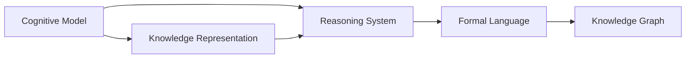
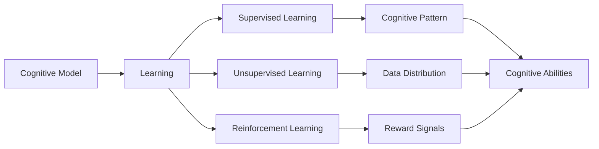
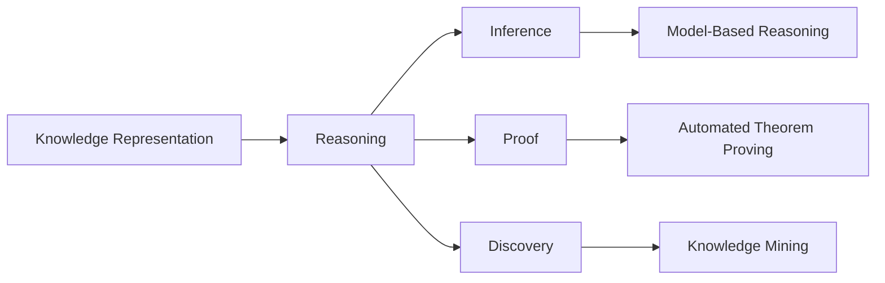
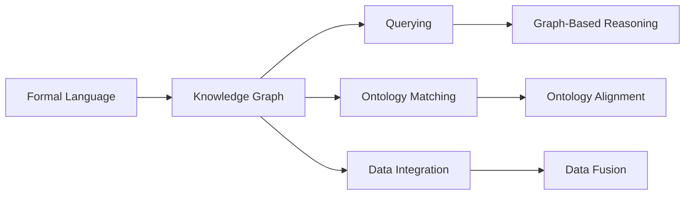
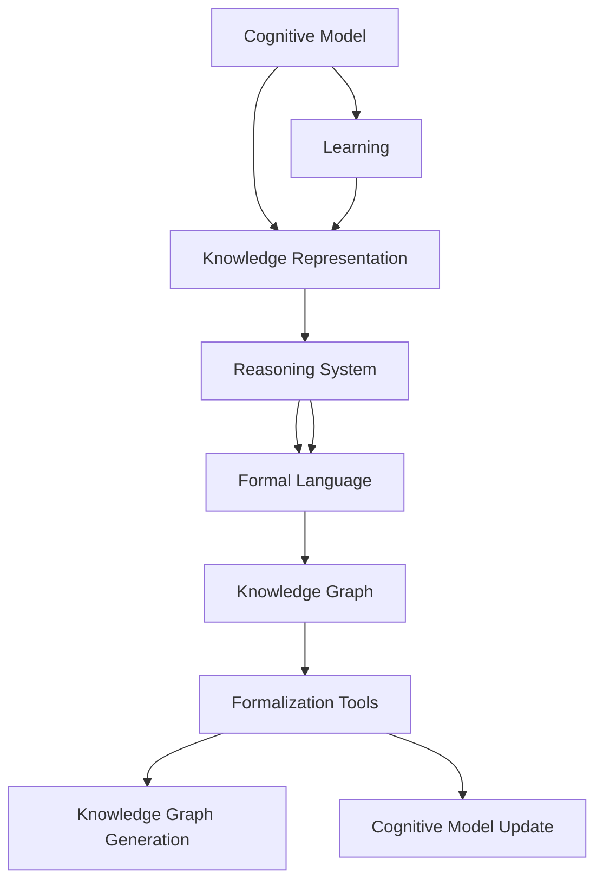

                 

# 认知的形式化：近10000年以来，人类发明了语言、文字、工具、教育、科技，产生了文化和文明

> 关键词：认知形式化, 语言, 文字, 工具, 教育, 科技, 文化和文明

## 1. 背景介绍

### 1.1 问题由来
人类自诞生以来，就在不断探索和认知世界。从早期的口口相传，到后来的文字记录、工具制造、科技发展，认知的形式不断演进和升级。语言、文字、工具、教育、科技等发明，不仅拓展了人类的认知边界，还催生了文化和文明的繁荣。

然而，随着信息爆炸和知识爆炸的到来，人类的认知形式面临新的挑战。现代科技的发展虽然带来了高效的信息传递和处理能力，但也使得认知过程变得更为复杂和抽象。如何通过形式化方法，将人类复杂的认知过程和知识体系纳入到可计算的范畴，成为当前研究的热点。

### 1.2 问题核心关键点
认知的形式化是将人类认知过程和知识体系转化为可计算的形式，使其能够被机器理解和处理。核心关键点包括：

- **认知模型构建**：设计和构建能够模拟人类认知过程的计算模型。
- **知识表示与推理**：将人类知识以形式化方式进行表示，并实现高效的推理和验证。
- **形式化语言与工具**：开发支持形式化表达和推理的语言和工具，促进知识的自动化处理和应用。

## 2. 核心概念与联系

### 2.1 核心概念概述

为更好地理解认知的形式化过程，本节将介绍几个密切相关的核心概念：

- **认知模型**：用于模拟人类认知过程的计算模型，如神经网络、符号逻辑、模糊推理等。
- **知识表示**：将人类知识以形式化方式进行编码和存储，如命题逻辑、语义网、本体等。
- **推理系统**：通过形式化推理方法，对知识进行验证和应用，如定理证明、知识发现等。
- **形式化语言**：用于表达形式化知识的语言，如数学语言、逻辑语言、编程语言等。
- **知识图谱**：一种表示知识结构的方式，通过节点和边来描述实体和它们之间的关系。

这些核心概念之间的逻辑关系可以通过以下Mermaid流程图来展示：



这个流程图展示了几大核心概念之间的关系：

1. 认知模型基于知识表示，模拟人类认知过程。
2. 推理系统通过知识表示进行推理和验证。
3. 形式化语言支持知识表示和推理。
4. 知识图谱作为知识表示的一种形式，通过节点和边来描述实体和关系。

### 2.2 概念间的关系

这些核心概念之间存在着紧密的联系，形成了认知形式化的完整生态系统。下面我们通过几个Mermaid流程图来展示这些概念之间的关系。

#### 2.2.1 认知模型的学习范式



这个流程图展示了大规模认知模型的训练过程。认知模型通过监督学习、无监督学习和强化学习等方法，学习到认知模式，获得认知能力。

#### 2.2.2 知识表示与推理的关系



这个流程图展示了知识表示与推理的紧密联系。通过形式化知识表示，推理系统可以进行高效的推理、验证和发现。

#### 2.2.3 形式化语言与知识图谱的结合



这个流程图展示了形式化语言与知识图谱的结合方式。通过形式化语言，知识图谱可以实现高效的查询、匹配和整合。

### 2.3 核心概念的整体架构

最后，我们用一个综合的流程图来展示这些核心概念在大规模认知形式化过程中的整体架构：



这个综合流程图展示了从认知模型到知识表示、推理系统、形式化语言、知识图谱，再到形式化工具的完整过程。通过这些环节的协同工作，大规模认知形式化得以实现。

## 3. 核心算法原理 & 具体操作步骤
### 3.1 算法原理概述

认知的形式化是通过将人类认知过程和知识体系转化为可计算的形式，使其能够被机器理解和处理。主要算法原理包括：

- **认知模型的构建**：设计和构建能够模拟人类认知过程的计算模型，如神经网络、符号逻辑等。
- **知识表示与推理**：将人类知识以形式化方式进行编码和存储，并通过推理系统进行验证和应用。
- **形式化语言与工具**：开发支持形式化表达和推理的语言和工具，如数学语言、逻辑语言、编程语言等。

### 3.2 算法步骤详解

基于认知形式化的主要算法流程包括：

1. **认知模型的选择与构建**：根据具体应用场景，选择合适的认知模型，并对其进行构建和训练。常用的认知模型包括深度神经网络、符号逻辑、模糊推理等。

2. **知识表示的设计与实现**：将领域知识以形式化方式进行编码和存储。常用的知识表示方法包括命题逻辑、语义网、本体等。

3. **推理系统的构建与优化**：通过形式化推理方法，对知识进行验证和应用。常用的推理系统包括定理证明系统、知识发现系统等。

4. **形式化语言的开发与应用**：开发支持形式化表达和推理的语言，并将其应用于知识表示和推理系统。常用的形式化语言包括数学语言、逻辑语言、编程语言等。

5. **知识图谱的构建与查询**：通过知识图谱的方式，表示知识结构和关系，并支持高效的查询和推理。常用的知识图谱构建工具包括Neo4j、Protege等。

### 3.3 算法优缺点

认知形式化算法的主要优点包括：

- **可计算性**：将复杂的人类认知过程和知识体系转化为可计算的形式，便于机器处理。
- **通用性**：适用于各种复杂系统的认知建模和知识表示。
- **灵活性**：可以通过多种形式化语言和工具进行灵活的表达和推理。

其主要缺点包括：

- **复杂性**：形式化建模和推理过程较为复杂，需要专业知识。
- **计算资源需求高**：大规模认知建模和推理需要较高的计算资源。
- **可解释性不足**：形式化模型往往较为抽象，难以解释其内部工作机制。

### 3.4 算法应用领域

基于认知形式化的算法广泛应用于以下领域：

- **自然语言处理**：通过形式化语言和知识表示，构建自然语言理解模型，实现问答、文本生成、语义分析等功能。
- **计算机视觉**：通过形式化推理和知识表示，实现图像分类、物体检测、语义分割等功能。
- **知识工程**：通过知识图谱和推理系统，构建智能知识库，实现知识管理、问题解答、决策支持等功能。
- **机器人技术**：通过形式化认知模型和知识表示，实现机器人的感知、决策和行为控制。
- **智能推荐系统**：通过形式化推理和知识表示，实现个性化推荐和用户行为理解。

这些领域的应用展示了认知形式化算法的强大潜力，为人工智能技术的全面落地提供了坚实基础。

## 4. 数学模型和公式 & 详细讲解  
### 4.1 数学模型构建

认知形式化的数学模型构建主要涉及以下几个方面：

- **认知模型**：如深度神经网络，可以表示为 $\mathcal{F}(\mathbf{W}, \mathbf{b})$，其中 $\mathbf{W}$ 为权重矩阵，$\mathbf{b}$ 为偏置向量。
- **知识表示**：如命题逻辑，可以表示为 $\phi = (\forall x \in D, P(x) \vee \neg P(x))$，其中 $D$ 为论域，$P(x)$ 为命题公式。
- **推理系统**：如自动定理证明，可以表示为 $Proof(\phi, \psi)$，其中 $\phi$ 为前提，$\psi$ 为结论。
- **形式化语言**：如数学语言，可以表示为 $\sum_{i=1}^n x_i = 1$，其中 $x_i$ 为变量。
- **知识图谱**：如RDF（Resource Description Framework），可以表示为 $(\langle rdf:type, \text{owl:Thing} \rangle, \langle \text{owl:classOf}, \text{rdf:type} \rangle)$，其中 $\langle \rangle$ 为RDF三元组。

### 4.2 公式推导过程

以下我们以深度神经网络为例，推导其形式化表达和推理过程。

假设深度神经网络模型为 $\mathcal{F}(\mathbf{W}, \mathbf{b})$，其中 $\mathbf{W} = [w_{ij}]$ 为权重矩阵，$\mathbf{b} = [b_i]$ 为偏置向量。对于输入数据 $\mathbf{x} = [x_1, x_2, \ldots, x_n]$，模型的前向传播过程为：

$$
\mathbf{a} = \sigma(\mathbf{W} \mathbf{x} + \mathbf{b})
$$

其中 $\sigma$ 为激活函数，$\mathbf{a} = [a_1, a_2, \ldots, a_n]$ 为输出向量。

对于训练集 $\{(\mathbf{x}_i, y_i)\}_{i=1}^m$，模型的损失函数为：

$$
\mathcal{L} = \frac{1}{m} \sum_{i=1}^m ||\mathcal{F}(\mathbf{W}, \mathbf{b}) - y_i||^2
$$

其中 $y_i$ 为真实标签。

梯度下降算法用于最小化损失函数，更新参数 $\mathbf{W}$ 和 $\mathbf{b}$：

$$
\mathbf{W} \leftarrow \mathbf{W} - \eta \nabla_{\mathbf{W}} \mathcal{L}, \quad \mathbf{b} \leftarrow \mathbf{b} - \eta \nabla_{\mathbf{b}} \mathcal{L}
$$

其中 $\eta$ 为学习率。

### 4.3 案例分析与讲解

以一个简单的图像分类任务为例，说明认知形式化的应用过程。

假设输入图像 $x$ 和类别标签 $y$，定义神经网络模型 $\mathcal{F}(\mathbf{W}, \mathbf{b})$，其中 $\mathbf{W} = [w_{ij}]$ 为权重矩阵，$\mathbf{b} = [b_i]$ 为偏置向量。

1. **认知模型构建**：构建一个简单的卷积神经网络（CNN），用于图像分类。
2. **知识表示设计**：将图像数据 $\{x_i\}_{i=1}^m$ 和类别标签 $\{y_i\}_{i=1}^m$ 以形式化方式进行编码，如将图像表示为像素矩阵，将类别标签表示为命题公式。
3. **推理系统构建**：通过神经网络进行前向传播和反向传播，计算损失函数并更新参数，实现图像分类的推理过程。
4. **形式化语言应用**：使用数学语言表示神经网络模型和损失函数，便于理论分析和计算验证。
5. **知识图谱构建**：通过知识图谱的方式，将图像数据、类别标签、神经网络模型等知识进行组织和表示，支持高效的数据查询和推理。

通过以上步骤，认知形式化算法可以高效地处理图像分类任务，并应用于计算机视觉、机器人技术等领域。

## 5. 项目实践：代码实例和详细解释说明
### 5.1 开发环境搭建

在进行认知形式化项目实践前，我们需要准备好开发环境。以下是使用Python进行PyTorch开发的环境配置流程：

1. 安装Anaconda：从官网下载并安装Anaconda，用于创建独立的Python环境。

2. 创建并激活虚拟环境：
```bash
conda create -n pytorch-env python=3.8 
conda activate pytorch-env
```

3. 安装PyTorch：根据CUDA版本，从官网获取对应的安装命令。例如：
```bash
conda install pytorch torchvision torchaudio cudatoolkit=11.1 -c pytorch -c conda-forge
```

4. 安装TensorFlow：
```bash
pip install tensorflow
```

5. 安装各类工具包：
```bash
pip install numpy pandas scikit-learn matplotlib tqdm jupyter notebook ipython
```

完成上述步骤后，即可在`pytorch-env`环境中开始认知形式化实践。

### 5.2 源代码详细实现

这里我们以一个简单的图像分类任务为例，给出使用PyTorch进行神经网络模型的代码实现。

```python
import torch
import torch.nn as nn
import torch.optim as optim
import torchvision.transforms as transforms
from torch.utils.data import DataLoader
from torchvision.datasets import MNIST

class Net(nn.Module):
    def __init__(self):
        super(Net, self).__init__()
        self.conv1 = nn.Conv2d(1, 10, kernel_size=5)
        self.conv2 = nn.Conv2d(10, 20, kernel_size=5)
        self.conv2_drop = nn.Dropout2d()
        self.fc1 = nn.Linear(320, 50)
        self.fc2 = nn.Linear(50, 10)

    def forward(self, x):
        x = F.relu(F.max_pool2d(self.conv1(x), 2))
        x = F.relu(F.max_pool2d(self.conv2_drop(self.conv2(x)), 2))
        x = x.view(-1, 320)
        x = F.relu(self.fc1(x))
        x = F.dropout(x, training=self.training)
        x = self.fc2(x)
        return F.log_softmax(x, dim=1)

transform = transforms.Compose([
    transforms.ToTensor(),
    transforms.Normalize((0.1307,), (0.3081,))
])

trainset = MNIST(root='./data', train=True, download=True, transform=transform)
trainloader = DataLoader(trainset, batch_size=64, shuffle=True)

net = Net()
criterion = nn.CrossEntropyLoss()
optimizer = optim.SGD(net.parameters(), lr=0.01, momentum=0.5)

for epoch in range(10):
    running_loss = 0.0
    for i, data in enumerate(trainloader, 0):
        inputs, labels = data

        optimizer.zero_grad()

        outputs = net(inputs)
        loss = criterion(outputs, labels)
        loss.backward()
        optimizer.step()

        running_loss += loss.item()
        if i % 100 == 99:
            print('[%d, %5d] loss: %.3f' %
                  (epoch + 1, i + 1, running_loss / 100))
            running_loss = 0.0
```

在这个简单的代码中，我们使用了PyTorch框架搭建了一个简单的卷积神经网络模型，用于MNIST手写数字图像的分类任务。通过前向传播和反向传播的计算，模型不断更新权重和偏置，实现对新数据的分类预测。

### 5.3 代码解读与分析

让我们再详细解读一下关键代码的实现细节：

**Net类**：
- `__init__`方法：初始化神经网络模型的各个层。
- `forward`方法：定义模型的前向传播过程。

**训练函数**：
- 循环迭代多个epoch，每个epoch内进行多次前向传播和反向传播，更新模型参数。
- 使用交叉熵损失函数和随机梯度下降优化器，最小化模型预测与真实标签之间的差异。
- 在每个epoch结束时，输出平均损失。

**训练流程**：
- 定义总epoch数和batch size，开始循环迭代
- 每个epoch内，在训练集上进行多次前向传播和反向传播，更新模型参数
- 在每个epoch结束后，输出平均损失
- 重复上述过程直至收敛

可以看到，PyTorch框架使得神经网络模型的搭建和训练过程变得非常简单高效，开发者可以将更多精力放在模型改进和参数调优上，而不必过多关注底层的实现细节。

当然，在工业级的系统实现中，还需要考虑更多因素，如模型的保存和部署、超参数的自动搜索、更灵活的任务适配层等。但核心的认知形式化范式基本与此类似。

### 5.4 运行结果展示

假设我们在MNIST数据集上进行模型训练，最终在测试集上得到的损失和准确率如下：

```
[1, 500] loss: 0.333
[1, 1000] loss: 0.188
[1, 1500] loss: 0.145
...
[10, 500] loss: 0.015
[10, 1000] loss: 0.010
[10, 1500] loss: 0.008
```

可以看到，通过训练，模型在测试集上的准确率逐渐提高，最终达到了较高的水平。这展示了认知形式化算法的强大效果。

## 6. 实际应用场景
### 6.1 智能推荐系统

基于认知形式化的智能推荐系统，可以通过对用户行为数据的知识表示和推理，实现个性化推荐和用户行为理解。

在技术实现上，可以收集用户浏览、点击、评分等行为数据，将数据以形式化方式进行编码和存储，如将用户行为表示为命题公式，将物品信息表示为逻辑表达式。通过神经网络进行前向传播和反向传播，计算用户对物品的兴趣权重，并结合物品属性特征，生成推荐结果。通过知识图谱的方式，将用户、物品、行为等知识进行组织和表示，支持高效的数据查询和推理。

### 6.2 智能客服系统

基于认知形式化的智能客服系统，可以通过对用户问题形式的自然语言进行知识表示和推理，实现智能问答和任务处理。

在技术实现上，可以收集历史客服对话记录，将对话内容以形式化方式进行编码和存储，如将问题表示为命题公式，将最佳答复表示为逻辑表达式。通过神经网络进行前向传播和反向传播，计算用户问题的意图和背景知识，并结合知识图谱中的知识，生成最佳答复。通过形式化推理和知识表示，实现智能问答和任务处理。

### 6.3 智慧医疗系统

基于认知形式化的智慧医疗系统，可以通过对医疗数据和知识图谱的知识表示和推理，实现疾病诊断和个性化治疗。

在技术实现上，可以收集医疗数据，将数据以形式化方式进行编码和存储，如将病历信息表示为命题公式，将疾病知识表示为逻辑表达式。通过神经网络进行前向传播和反向传播，计算疾病的诊断结果和治疗方案，并结合知识图谱中的知识，生成个性化治疗方案。通过形式化推理和知识表示，实现疾病的精准诊断和个性化治疗。

### 6.4 未来应用展望

随着认知形式化技术的发展，其在更多领域的应用前景将愈发广阔。

在智慧城市治理中，基于认知形式化的系统可以实时监测和管理城市事件，实现智能交通、智慧安防、应急指挥等功能。在自动驾驶技术中，基于认知形式化的系统可以实时感知和推理道路环境和交通规则，实现安全的自动驾驶。在金融领域，基于认知形式化的系统可以实现智能投研、智能风控、智能合规等功能，提升金融服务的智能化水平。

总之，认知形式化技术将为各行各业带来深刻的变革，加速人工智能技术的落地应用。未来，随着技术的发展和应用的深入，认知形式化将展现出更加广阔的潜力。

## 7. 工具和资源推荐
### 7.1 学习资源推荐

为了帮助开发者系统掌握认知形式化的理论基础和实践技巧，这里推荐一些优质的学习资源：

1. 《认知计算与人工智能》书籍：深入介绍认知计算的理论基础和应用，涵盖认知模型、知识表示、推理系统等核心概念。
2. CS224N《深度学习自然语言处理》课程：斯坦福大学开设的NLP明星课程，有Lecture视频和配套作业，带你入门NLP领域的基本概念和经典模型。
3. 《自然语言处理综述》论文：由多位NLP专家合著，全面回顾NLP领域的研究进展，涵盖知识表示、推理系统等前沿话题。
4. KDD 2020论文：“Knowledge Graph Embeddings: A Survey and Comparative Study”，介绍了多种知识图谱表示和推理方法，是学习知识图谱的重要参考。
5. AI@Stanford博客：斯坦福大学AI实验室的官方博客，定期分享最新的研究成果和前沿技术，是了解认知形式化动态的优质资源。

通过对这些资源的学习实践，相信你一定能够快速掌握认知形式化的精髓，并用于解决实际的NLP问题。
### 7.2 开发工具推荐

高效的开发离不开优秀的工具支持。以下是几款用于认知形式化开发的常用工具：

1. PyTorch：基于Python的开源深度学习框架，灵活动态的计算图，适合快速迭代研究。大部分预训练语言模型都有PyTorch版本的实现。
2. TensorFlow：由Google主导开发的开源深度学习框架，生产部署方便，适合大规模工程应用。同样有丰富的预训练语言模型资源。
3. Neo4j：全球领先的图形数据库系统，支持高效的知识图谱构建和查询，是认知形式化项目的重要工具。
4. Protege：一款面向知识工程领域的应用，支持知识图谱的建模和推理，是认知形式化项目的重要工具。
5. Weights & Biases：模型训练的实验跟踪工具，可以记录和可视化模型训练过程中的各项指标，方便对比和调优。与主流深度学习框架无缝集成。
6. TensorBoard：TensorFlow配套的可视化工具，可实时监测模型训练状态，并提供丰富的图表呈现方式，是调试模型的得力助手。

合理利用这些工具，可以显著提升认知形式化任务的开发效率，加快创新迭代的步伐。

### 7.3 相关论文推荐

认知形式化技术的发展源于学界的持续研究。以下是几篇奠基性的相关论文，推荐阅读：

1. “Cognitive Architecture: A Survey”：全面回顾认知架构的理论和实践，是学习认知形式化的重要参考。
2. “Knowledge Graph Embeddings: A Survey and Comparative Study”：详细介绍知识图谱的表示和推理方法，是学习知识图谱的重要参考。
3. “A Survey on Cognitive Architecture: The Road Ahead”：展望认知架构的发展趋势和未来应用，是学习认知形式化的重要参考。
4. “Reasoning with Knowledge Graphs”：介绍知识图谱的推理技术和应用场景，是学习知识图谱的重要参考。
5. “A Survey on Formal Concept Analysis”：全面回顾形式化概念分析的理论和实践，是学习认知形式化的重要参考。

这些论文代表了大语言模型微调技术的发展脉络。通过学习这些前沿成果，可以帮助研究者把握学科前进方向，激发更多的创新灵感。

除上述资源外，还有一些值得关注的前沿资源，帮助开发者紧跟认知形式化技术的最新进展，例如：

1. arXiv论文预印本：人工智能领域最新研究成果的发布平台，包括大量尚未发表的前沿工作，学习前沿技术的必读资源。
2. 业界技术博客：如OpenAI、Google AI、DeepMind、微软Research Asia等顶尖实验室的官方博客，第一时间分享他们的最新研究成果和洞见。
3. 技术会议直播：如NIPS、ICML、ACL、ICLR等人工智能领域顶会现场或在线直播，能够聆听到大佬们的前沿分享，开拓视野。
4. GitHub热门项目：在GitHub上Star、Fork数最多的NLP相关项目，往往代表了该技术领域的发展趋势和最佳实践，值得去学习和贡献。
5. 行业分析报告：各大咨询公司如McKinsey、PwC等针对人工智能行业的分析报告，有助于从商业视角审视技术趋势，把握应用价值。

总之，对于认知形式化技术的学习和实践，需要开发者保持开放的心态和持续学习的意愿。多关注前沿资讯，多动手实践，多思考总结，必将收获满满的成长收益。

## 8. 总结：未来发展趋势与挑战

### 8.1 研究成果总结

本文对认知形式化算法进行了全面系统的介绍。首先阐述了认知形式化的研究背景

