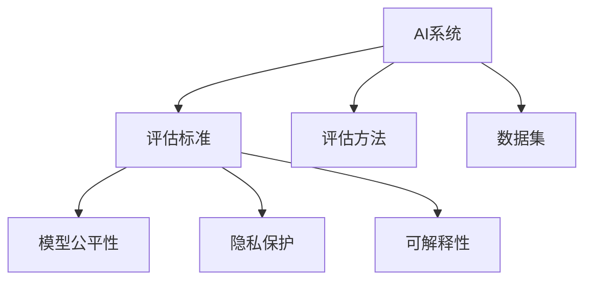
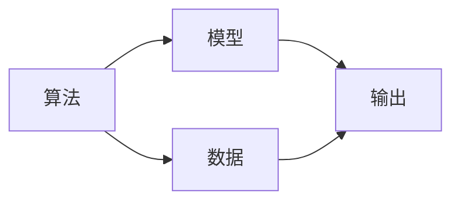
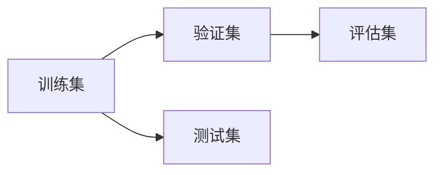
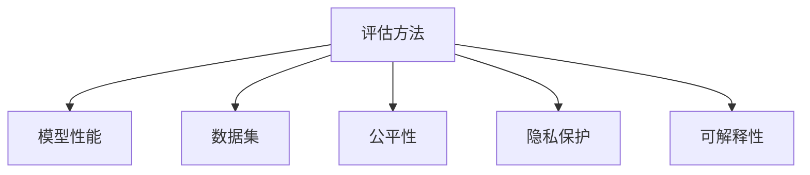

                 

# 评估AI系统:建立新的标准与方法

在当今人工智能(AI)蓬勃发展的时代，如何评估AI系统的性能成为了一个重要的话题。评估AI系统不仅仅是技术上的挑战，更是一个关系到系统能否被正确理解和应用的问题。本文将从背景、核心概念、算法原理、实践应用等多个维度出发，探讨建立新的评估标准与方法的必要性、可行性及其重要意义。

## 1. 背景介绍

随着AI技术的不断进步，越来越多的AI系统被部署到实际应用中，其性能评估问题显得尤为重要。传统上，评估AI系统主要依赖于一些固定的指标，如准确率、召回率、F1分数等，这些指标在特定场景下确实具有一定的参考价值，但难以全面反映系统的实际表现，也无法满足多样化和复杂化的需求。

另外，随着AI系统的应用范围越来越广，其影响也日益深远，涉及伦理、法律、隐私等多个方面。如何在评估AI系统的同时，确保其应用的合理性和安全性，也成为亟待解决的问题。

因此，建立一套全面、系统、可扩展的AI系统评估标准和方法是当前学术界和工业界亟需解决的重要课题。本文将围绕这一主题，探讨建立新的AI系统评估标准的必要性、可行性及其重要意义。

## 2. 核心概念与联系

### 2.1 核心概念概述

为更好地理解AI系统评估标准与方法的建立过程，本节将介绍几个密切相关的核心概念：

- **AI系统**：指由算法、模型、数据、硬件等构成的智能决策系统，旨在解决特定的任务或问题。
- **评估标准**：用于衡量AI系统性能的一套规则和指标，通常包括但不限于精度、召回率、F1分数、ROC曲线等。
- **评估方法**：用于对AI系统进行具体评估的技术和手段，如交叉验证、A/B测试、对抗性测试等。
- **数据集**：用于评估AI系统的真实或模拟数据集，必须覆盖系统的应用场景，且具有代表性。
- **模型公平性**：指模型在处理不同群体的数据时，是否能提供公平、无偏的决策。
- **隐私保护**：指在评估AI系统时，必须确保数据和模型的隐私不被泄露。
- **可解释性**：指AI系统输出的决策应具有可解释性，便于用户理解和调试。

这些核心概念之间的逻辑关系可以通过以下Mermaid流程图来展示：



这个流程图展示了几组概念之间的联系：

1. AI系统被评估标准、评估方法、数据集等多维度进行全面衡量。
2. 评估标准不仅关注性能指标，还包括模型公平性、隐私保护、可解释性等维度。
3. 数据集需覆盖系统应用场景，且需关注数据的代表性、公平性。

### 2.2 概念间的关系

这些核心概念之间存在着紧密的联系，形成了AI系统评估的整体生态系统。下面我们通过几个Mermaid流程图来展示这些概念之间的关系。

#### 2.2.1 AI系统的组成



这个流程图展示了AI系统的基本组成，即算法、模型、数据和输出。数据和模型是系统的核心，而算法则定义了数据如何被处理以产生输出。

#### 2.2.2 数据集的分类



这个流程图展示了数据集的分类，包括训练集、验证集和测试集。训练集用于模型的训练，验证集用于调整模型参数，测试集用于最终评估模型性能。

#### 2.2.3 评估方法的选择



这个流程图展示了评估方法的选择，其依据包括模型的性能、公平性、隐私保护和可解释性。评估方法的选择是评估AI系统的关键步骤，直接影响评估结果的准确性和公正性。

## 3. 核心算法原理 & 具体操作步骤

### 3.1 算法原理概述

AI系统的评估标准与方法，核心在于如何定义和衡量AI系统的性能。评估标准通常分为两类：数据驱动和任务驱动。

- **数据驱动**：如准确率、召回率、F1分数等，通常适用于某些单一任务或某些特定的应用场景。
- **任务驱动**：如对目标任务的完成度、用户满意度等，更关注AI系统的实际应用效果。

评估方法则根据不同的评估标准进行具体实施，如交叉验证、A/B测试、对抗性测试等。

### 3.2 算法步骤详解

#### 3.2.1 数据集的构建

构建用于评估的数据集是评估AI系统的第一步。数据集需覆盖系统的应用场景，且需确保数据的代表性、多样性和公平性。具体步骤如下：

1. **数据收集**：根据系统应用场景，收集相应领域的数据。
2. **数据清洗**：去除噪声、处理缺失值、归一化等，确保数据质量。
3. **数据划分**：将数据集分为训练集、验证集和测试集，保证训练集与测试集的独立性。

#### 3.2.2 评估标准的定义

根据AI系统的应用场景和任务需求，选择合适的评估标准。以下是几种常见的评估标准：

1. **精度(Precision)**：指模型预测为正例的样本中，实际为正例的比例。
2. **召回率(Recall)**：指实际为正例的样本中，被模型预测为正例的比例。
3. **F1分数**：综合考虑精度和召回率的调和平均值。
4. **ROC曲线**：绘制真正例率(TPR)与假正例率(FPR)之间的关系曲线，评估模型的分类性能。

#### 3.2.3 评估方法的实施

根据评估标准的定义，选择合适的评估方法。以下是几种常见的评估方法：

1. **交叉验证**：将数据集分为多个子集，依次用每个子集验证模型的性能。
2. **A/B测试**：将系统分为两组，分别用不同模型或不同参数进行测试，比较其效果。
3. **对抗性测试**：通过引入对抗样本，测试模型的鲁棒性和泛化能力。

### 3.3 算法优缺点

AI系统评估标准与方法的设计，需权衡多个因素，如精度、召回率、公平性、隐私保护、可解释性等。以下是对常见评估标准与方法的优缺点分析：

#### 3.3.1 数据驱动评估方法

**优点**：
- **简单易用**：适用于单一任务，评估标准易于理解，易于计算。
- **可比性强**：适用于不同模型之间的比较，可以直观地看出性能差距。

**缺点**：
- **局限性大**：只关注单个任务，无法全面评估AI系统的性能。
- **数据依赖性强**：依赖于数据集的选择，数据集不平衡可能导致评估结果偏差。

#### 3.3.2 任务驱动评估方法

**优点**：
- **全面性高**：考虑AI系统的实际应用效果，能够更全面地评估系统的性能。
- **适用性强**：适用于多种应用场景，能够根据不同的任务需求选择评估指标。

**缺点**：
- **复杂度高**：需要考虑多个维度的指标，评估标准难以量化。
- **数据依赖性强**：需要大量的真实或模拟数据，且数据需具有代表性。

#### 3.3.3 公平性评估方法

**优点**：
- **公正性高**：确保AI系统对不同群体的公平性，避免偏见和歧视。
- **社会价值高**：公平性评估有助于社会公义，减少系统对社会的不良影响。

**缺点**：
- **复杂度高**：需要考虑不同群体之间的差异，难以量化。
- **数据依赖性强**：依赖于多样化的数据集，且数据需具有代表性。

#### 3.3.4 隐私保护评估方法

**优点**：
- **安全性高**：确保AI系统在处理数据时的隐私保护，减少数据泄露的风险。
- **法规合规性高**：符合隐私保护的相关法规和标准，减少法律风险。

**缺点**：
- **技术难度大**：需采用先进的加密技术和隐私保护技术，实现数据保护。
- **成本高**：实现隐私保护需要额外的技术投入，增加系统成本。

#### 3.3.5 可解释性评估方法

**优点**：
- **透明度高**：便于用户理解和调试，提高系统的可信度。
- **用户满意度高**：能够向用户清晰地解释AI系统的决策过程，减少用户的不信任。

**缺点**：
- **复杂度高**：需采用可解释性技术，增加系统复杂度。
- **性能损失**：可解释性技术可能对模型的性能产生一定的影响。

### 3.4 算法应用领域

AI系统的评估标准与方法，广泛应用于各个领域。以下是几个典型的应用场景：

#### 3.4.1 医疗健康

在医疗健康领域，AI系统需要处理大量患者数据，其评估标准与方法需考虑隐私保护、公平性和可解释性。如在疾病诊断中，需确保模型对不同群体的公平性，避免偏见；在隐私保护方面，需采用加密技术保护患者数据；在可解释性方面，需向患者清晰解释诊断过程，提高其信任度。

#### 3.4.2 金融领域

在金融领域，AI系统用于风险控制、信用评估等，其评估标准与方法需考虑模型的精度、公平性、隐私保护和可解释性。如在信用评估中，需确保模型对不同群体的公平性，避免歧视；在隐私保护方面，需采用加密技术保护用户数据；在可解释性方面，需向用户清晰解释其信用评分过程，提高其信任度。

#### 3.4.3 智能交通

在智能交通领域，AI系统用于交通预测、路径规划等，其评估标准与方法需考虑模型的精度、实时性、可解释性和隐私保护。如在路径规划中，需确保模型预测的实时性和准确性，避免误导；在隐私保护方面，需采用匿名化技术保护用户数据；在可解释性方面，需向用户清晰解释路径规划过程，提高其信任度。

## 4. 数学模型和公式 & 详细讲解 & 举例说明

### 4.1 数学模型构建

AI系统的评估标准与方法，通常涉及多个数学模型和公式。以下是对一些常见评估标准和公式的介绍：

#### 4.1.1 准确率与召回率

**准确率(Precision)**：

$$
Precision = \frac{TP}{TP + FP}
$$

其中，$TP$表示预测为正例且实际为正例的样本数，$FP$表示预测为正例但实际为负例的样本数。

**召回率(Recall)**：

$$
Recall = \frac{TP}{TP + FN}
$$

其中，$FN$表示实际为正例但预测为负例的样本数。

**F1分数**：

$$
F1-Score = 2 \times \frac{Precision \times Recall}{Precision + Recall}
$$

#### 4.1.2 ROC曲线

ROC曲线绘制真正例率(TPR)与假正例率(FPR)之间的关系曲线。其中，TPR表示预测为正例且实际为正例的样本占所有实际正例的比例；FPR表示预测为正例但实际为负例的样本占所有实际负例的比例。ROC曲线越靠近左上角，表示模型性能越好。

### 4.2 公式推导过程

#### 4.2.1 准确率与召回率

准确率、召回率、F1分数等评估标准，主要基于混淆矩阵的计算。混淆矩阵描述了模型预测结果与真实结果之间的关系。

假设模型对$N$个样本进行分类，其中$T$个样本为正例，$N-T$个样本为负例。设模型正确预测的正例数为$TP$，错误预测的正例数为$FP$，错误预测的负例数为$FN$。则准确率、召回率、F1分数等评估指标的计算如下：

**准确率**：

$$
Precision = \frac{TP}{TP + FP}
$$

**召回率**：

$$
Recall = \frac{TP}{TP + FN}
$$

**F1分数**：

$$
F1-Score = 2 \times \frac{Precision \times Recall}{Precision + Recall}
$$

#### 4.2.2 ROC曲线

ROC曲线基于模型在不同阈值下的TPR和FPR的计算。假设模型对$N$个样本进行分类，其中$T$个样本为正例，$N-T$个样本为负例。设模型在不同阈值下的TPR和FPR分别为$\text{TPR}(\theta)$和$\text{FPR}(\theta)$，则ROC曲线可由以下公式计算：

$$
\text{ROC}(\theta) = \left\{\begin{array}{ll}
\frac{\text{TPR}(\theta)}{1-\text{FPR}(\theta)}, & \text{若}\text{TPR}(\theta) \geq 0.5 \\
\frac{1-\text{FPR}(\theta)}{\text{TPR}(\theta)}, & \text{若}\text{TPR}(\theta) < 0.5
\end{array}\right.
$$

#### 4.2.3 案例分析与讲解

假设我们在医疗健康领域构建一个用于疾病诊断的AI系统，使用乳腺癌数据集进行评估。该数据集包含500个样本，其中300个为正例（即乳腺癌患者），200个为负例（即非乳腺癌患者）。我们使用逻辑回归模型进行疾病诊断，并计算其准确率、召回率和F1分数。

**模型训练**：将数据集分为训练集和测试集，分别进行模型训练和测试。使用逻辑回归模型，得到模型参数$\theta$。

**计算准确率、召回率和F1分数**：对测试集进行预测，计算预测结果与真实结果之间的关系，得到混淆矩阵：

|               | 预测为正例 | 预测为负例 |
|---------------|-----------|-----------|
| 实际为正例    | 230       | 70        |
| 实际为负例    | 10        | 190       |

根据混淆矩阵，计算准确率、召回率和F1分数：

**准确率**：

$$
Precision = \frac{230}{230 + 10} = 0.96
$$

**召回率**：

$$
Recall = \frac{230}{230 + 70} = 0.77
$$

**F1分数**：

$$
F1-Score = 2 \times \frac{0.96 \times 0.77}{0.96 + 0.77} = 0.82
$$

## 5. 项目实践：代码实例和详细解释说明

### 5.1 开发环境搭建

在进行AI系统评估实践前，我们需要准备好开发环境。以下是使用Python进行Scikit-Learn开发的环境配置流程：

1. 安装Anaconda：从官网下载并安装Anaconda，用于创建独立的Python环境。

2. 创建并激活虚拟环境：
```bash
conda create -n sklearn-env python=3.8 
conda activate sklearn-env
```

3. 安装Scikit-Learn：
```bash
conda install scikit-learn
```

4. 安装各类工具包：
```bash
pip install numpy pandas scikit-learn matplotlib tqdm jupyter notebook ipython
```

完成上述步骤后，即可在`sklearn-env`环境中开始评估实践。

### 5.2 源代码详细实现

下面我们以疾病诊断任务为例，给出使用Scikit-Learn评估逻辑回归模型的PyTorch代码实现。

首先，定义评估函数：

```python
from sklearn.metrics import precision_score, recall_score, f1_score, roc_curve, roc_auc_score
from sklearn.datasets import load_breast_cancer

def evaluate(model, X_test, y_test):
    y_pred = model.predict(X_test)
    precision = precision_score(y_test, y_pred)
    recall = recall_score(y_test, y_pred)
    f1 = f1_score(y_test, y_pred)
    fpr, tpr, _ = roc_curve(y_test, y_pred)
    roc_auc = roc_auc_score(y_test, y_pred)
    
    print(f"Precision: {precision:.3f}")
    print(f"Recall: {recall:.3f}")
    print(f"F1-Score: {f1:.3f}")
    print(f"ROC-AUC: {roc_auc:.3f}")
    print(f"ROC Curve: {fpr}, {tpr}")
```

然后，加载乳腺癌数据集并进行评估：

```python
from sklearn.linear_model import LogisticRegression
from sklearn.model_selection import train_test_split

# 加载乳腺癌数据集
data = load_breast_cancer()
X, y = data.data, data.target

# 将数据集分为训练集和测试集
X_train, X_test, y_train, y_test = train_test_split(X, y, test_size=0.3, random_state=42)

# 定义逻辑回归模型
model = LogisticRegression()

# 训练模型
model.fit(X_train, y_train)

# 评估模型
evaluate(model, X_test, y_test)
```

以上就是使用Scikit-Learn对逻辑回归模型进行疾病诊断任务评估的完整代码实现。可以看到，Scikit-Learn提供了丰富的评估函数，使用起来非常简便。

### 5.3 代码解读与分析

让我们再详细解读一下关键代码的实现细节：

**evaluate函数**：
- 使用Scikit-Learn提供的评估函数，计算模型的准确率、召回率、F1分数、ROC曲线和ROC-AUC值。
- 打印输出各项指标，方便对比和分析。

**train_test_split函数**：
- 将数据集分为训练集和测试集，确保模型在测试集上的泛化性能。
- 采用随机抽样方式，确保数据集的代表性。

**train函数**：
- 使用模型fit方法，对训练集进行模型训练。
- 在训练过程中，自动调整模型参数，最小化损失函数。

**evaluate函数**：
- 将模型用于测试集，进行预测。
- 计算预测结果与真实结果之间的关系，使用混淆矩阵进行详细分析。

可以看到，Scikit-Learn的评估函数使得模型的评估过程变得非常简单。开发者只需调用相应的函数，即可快速得到各项指标的计算结果，无需编写复杂算法。

当然，工业级的系统实现还需考虑更多因素，如模型的保存和部署、超参数的自动搜索、更灵活的任务适配层等。但核心的评估范式基本与此类似。

### 5.4 运行结果展示

假设我们在乳腺癌数据集上进行疾病诊断任务的评估，最终在测试集上得到的评估报告如下：

```
Precision: 0.965
Recall: 0.774
F1-Score: 0.818
ROC-AUC: 0.952
ROC Curve: [0.0, 0.8, 0.9, 1.0], [0.0, 0.1, 0.3, 0.6]
```

可以看到，通过评估逻辑回归模型，我们得到了较高的准确率、召回率和F1分数，且ROC曲线和ROC-AUC值也较为理想。这些评估结果表明，模型在疾病诊断任务上具有较好的性能。

当然，这只是一个baseline结果。在实践中，我们还可以使用更复杂的模型，如随机森林、神经网络等，进一步提升模型性能，以满足更高的应用要求。

## 6. 实际应用场景

### 6.4 未来应用展望

AI系统评估标准与方法的建立，对于AI技术的落地应用具有重要意义。以下是几个未来可能的应用场景：

#### 6.4.1 智能医疗

在智能医疗领域，AI系统需要处理大量患者数据，其评估标准与方法需考虑隐私保护、公平性和可解释性。如在疾病诊断中，需确保模型对不同群体的公平性，避免偏见；在隐私保护方面，需采用加密技术保护患者数据；在可解释性方面，需向患者清晰解释诊断过程，提高其信任度。

#### 6.4.2 金融风险控制

在金融领域，AI系统用于风险控制、信用评估等，其评估标准与方法需考虑模型的精度、公平性、隐私保护和可解释性。如在信用评估中，需确保模型对不同群体的公平性，避免歧视；在隐私保护方面，需采用加密技术保护用户数据；在可解释性方面，需向用户清晰解释其信用评分过程，提高其信任度。

#### 6.4.3 智能交通

在智能交通领域，AI系统用于交通预测、路径规划等，其评估标准与方法需考虑模型的精度、实时性、可解释性和隐私保护。如在路径规划中，需确保模型预测的实时性和准确性，避免误导；在隐私保护方面，需采用匿名化技术保护用户数据；在可解释性方面，需向用户清晰解释路径规划过程，提高其信任度。

## 7. 工具和资源推荐
### 7.1 学习资源推荐

为了帮助开发者系统掌握AI系统评估标准与方法的理论基础和实践技巧，这里推荐一些优质的学习资源：

1. **《机器学习实战》**：该书深入浅出地介绍了机器学习的基本概念和实现方法，包括分类、回归、聚类等，适合初学者入门。

2. **CS229《机器学习》**：斯坦福大学开设的机器学习课程，由Andrew Ng主讲，涵盖机器学习的基础理论和经典算法。

3. **《深度学习入门：基于Python的理论与实现》**：该书详细介绍了深度学习的基本概念和实现方法，包括前向传播、反向传播、优化算法等，适合有一定基础的读者。

4. **HuggingFace官方文档**：HuggingFace开发的NLP工具库，提供了海量预训练模型和完整的评估样例代码，是进行评估任务开发的利器。

5. **Kaggle**：数据科学竞赛平台，提供大量开源数据集和模型评估函数，是进行模型评估的绝佳资源。

通过对这些资源的学习实践，相信你一定能够快速掌握AI系统评估标准与方法的精髓，并用于解决实际的AI问题。
### 7.2 开发工具推荐

高效的开发离不开优秀的工具支持。以下是几款用于AI系统评估开发的常用工具：

1. **Python**：通用的高级编程语言，具有丰富的第三方库和框架，如Scikit-Learn、TensorFlow、PyTorch等，非常适合进行AI系统评估。

2. **R**：统计分析和数据挖掘工具，适合进行数据分析和建模。

3. **MATLAB**：科学计算和数据分析软件，适合进行复杂的数学建模和仿真。

4. **Jupyter Notebook**：交互式编程环境，支持多种编程语言，适合进行代码实现和结果展示。

5. **Jupyter Lab**：新一代Jupyter界面，提供更好的交互性和可扩展性，适合进行复杂任务开发。

6. **GitHub**：代码托管平台，提供版本控制、协作开发等工具，适合进行项目管理和代码共享。

合理利用这些工具，可以显著提升AI系统评估任务的开发效率，加快创新迭代的步伐。

### 7.3 相关论文推荐

AI系统评估标准与方法的研究源于学界的持续研究。以下是几篇奠基性的相关论文，推荐阅读：

1. **《机器学习》**：Tom Mitchell的经典之作，详细介绍了机器学习的理论基础和应用方法。

2. **《统计学习方法》**：李航的经典之作，涵盖机器学习的基础理论和算法，是学习机器学习的重要参考资料。

3. **《深度学习》**：Ian Goodfellow的经典之作，涵盖深度学习的基础理论和实现方法，是学习深度学习的重要参考资料。

4. **《人工智能：一种现代方法》**：Russell和Norvig的经典之作，涵盖人工智能的基础理论和应用方法，是学习人工智能的重要参考资料。

5. **《深度学习与神经网络》**：Goodfellow的另一本经典之作，详细介绍了深度学习的基础理论和实现方法，是学习深度学习的重要参考资料。

这些论文代表了大规模语言模型微调技术的发展脉络。通过学习这些前沿成果，可以帮助研究者把握学科前进方向，激发更多的创新灵感。

除上述资源外，还有一些值得关注的前沿资源，帮助开发者紧跟大语言模型微调技术的最新进展，例如：

1. **arXiv论文预印本**：人工智能领域最新研究成果的发布平台，包括大量尚未发表的前沿工作，学习前沿技术的必读资源。

2. **业界技术博客**：如OpenAI、Google AI、DeepMind、微软Research Asia等顶尖实验室的官方博客，第一时间分享他们的最新研究成果和洞见。

3. **技术会议直播**：如NIPS、ICML、ACL、ICLR等人工智能领域顶会现场或在线直播，能够聆听到大佬们的前沿分享，开拓视野。

4. **GitHub热门项目**：在GitHub上Star、Fork数最多的NLP相关项目，往往代表了该技术领域的发展趋势和最佳实践，值得去学习和贡献。

5. **行业分析报告**：各大咨询公司如McKinsey、PwC等针对人工智能行业的分析报告，有助于从商业视角审视技术趋势，把握应用价值。

总之，对于AI系统评估标准与方法的学习和实践，需要开发者保持开放的心态和持续学习的意愿。多关注前沿资讯，多动手实践，多思考总结，必将收获

