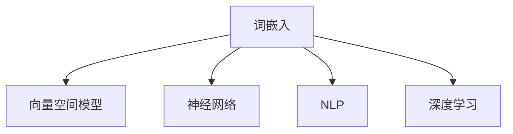
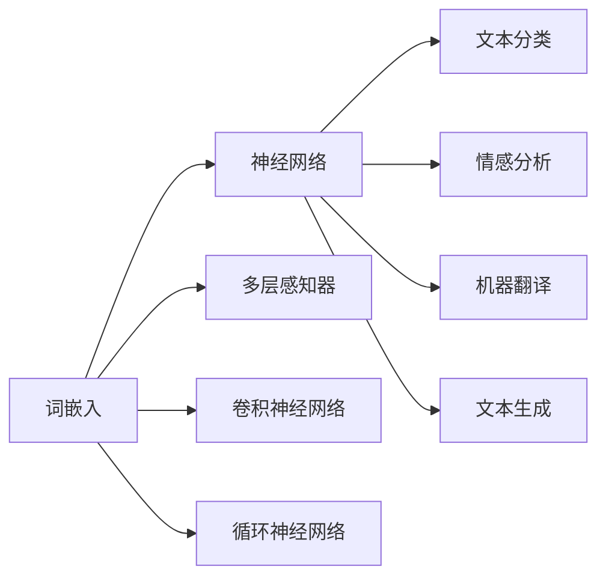
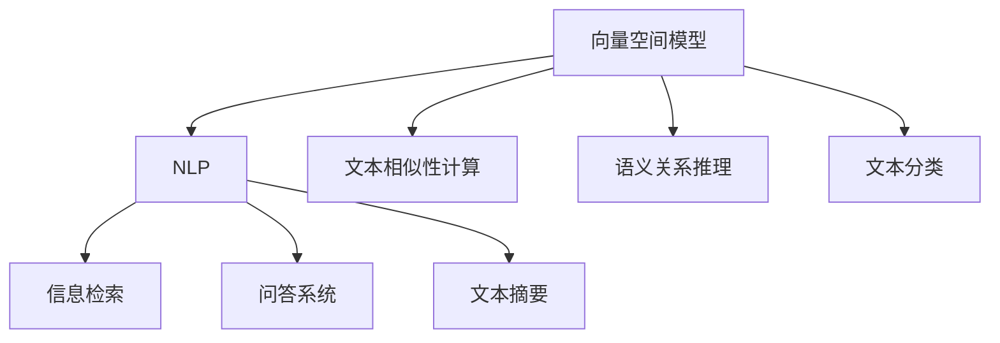
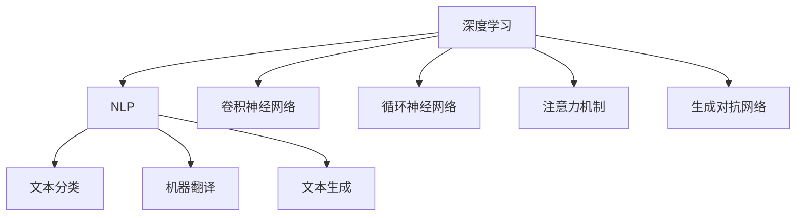
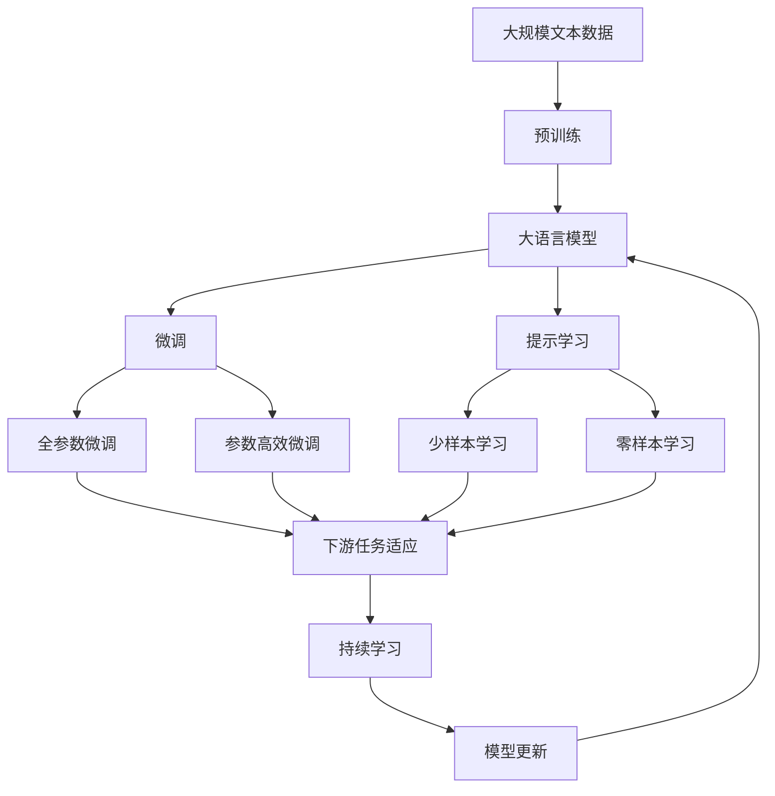

                 

# 词嵌入 (Word Embeddings) 原理与代码实例讲解

> 关键词：词嵌入, 文本表示, 向量空间模型, 神经网络, 自然语言处理, 深度学习, 代码实例

## 1. 背景介绍

### 1.1 问题由来

随着自然语言处理（NLP）技术的快速发展，人们开始逐渐意识到单纯地将文本表示为传统离散特征（如词袋模型、TF-IDF等）的局限性。这些方法在处理文本时，难以捕捉词汇间的语义关系和上下文信息。而词嵌入（Word Embeddings）则提供了一种新的思路，通过将词语映射到一个连续的向量空间中，不仅能够捕捉词语的语义信息，还能处理文本的上下文语境，从而大大提升了NLP模型的性能。

### 1.2 问题核心关键点

词嵌入的核心关键点在于通过映射词语到向量空间中，捕捉词语间的语义和语法关系。它的主要应用包括文本分类、信息检索、机器翻译、情感分析、问答系统等多个领域。常见的词嵌入模型包括Word2Vec、GloVe、FastText等。这些模型通过自监督学习任务，如预测上下文词或句子相似度，将词语映射到一个低维的向量空间。

## 2. 核心概念与联系

### 2.1 核心概念概述

为更好地理解词嵌入技术，本节将介绍几个密切相关的核心概念：

- 词嵌入（Word Embeddings）：将词语映射到一个低维的连续向量空间中，使词语间的语义和语法关系可以通过向量空间中的距离和角度来衡量。
- 向量空间模型（Vector Space Model）：使用向量来表示文本，利用向量间距离和夹角等几何关系来处理文本相似性和语义关系。
- 神经网络（Neural Network）：一种计算模型，通过多层非线性变换，实现对数据的自动特征提取和分类。
- 自然语言处理（NLP）：计算机科学、人工智能和语言学的交叉领域，旨在使计算机能够理解、解释和生成自然语言。
- 深度学习（Deep Learning）：一种机器学习技术，通过神经网络的多层结构来自动学习特征表示，广泛应用于图像、语音和文本等领域。

这些核心概念之间的逻辑关系可以通过以下Mermaid流程图来展示：



这个流程图展示了几大核心概念之间的联系：

1. 词嵌入是向量空间模型的一部分，用于表示词语的向量形式。
2. 神经网络是深度学习的重要组成部分，通过多层非线性变换学习特征表示。
3. 自然语言处理是计算机科学和人工智能的交叉领域，利用词嵌入等技术处理文本数据。
4. 深度学习是机器学习的一种高级形式，利用神经网络进行特征自动提取和模式识别。

### 2.2 概念间的关系

这些核心概念之间存在着紧密的联系，形成了NLP技术的完整生态系统。下面通过几个Mermaid流程图来展示这些概念之间的关系。

#### 2.2.1 词嵌入与神经网络的关系



这个流程图展示了词嵌入与神经网络之间的关系：

1. 词嵌入是神经网络的一个重要输入，用于将词语映射到低维向量空间中。
2. 神经网络通过多层非线性变换学习词语的特征表示。
3. 利用词嵌入和神经网络，可以构建文本分类、情感分析、机器翻译、文本生成等模型。

#### 2.2.2 向量空间模型与NLP的关系



这个流程图展示了向量空间模型在NLP中的应用：

1. 向量空间模型是NLP技术的重要组成部分，用于处理文本的相似性和语义关系。
2. 通过向量空间模型，可以进行文本分类、信息检索、问答系统、文本摘要等任务。

#### 2.2.3 深度学习与NLP的关系



这个流程图展示了深度学习在NLP中的应用：

1. 深度学习是NLP技术的重要工具，利用多层神经网络学习特征表示。
2. 利用深度学习，可以构建文本分类、机器翻译、文本生成等模型。

### 2.3 核心概念的整体架构

最后，我们用一个综合的流程图来展示这些核心概念在大语言模型微调过程中的整体架构：



这个综合流程图展示了从预训练到微调，再到持续学习的完整过程。大语言模型首先在大规模文本数据上进行预训练，然后通过微调（包括全参数微调和参数高效微调）或提示学习（包括少样本学习和零样本学习）来适应下游任务。最后，通过持续学习技术，模型可以不断学习新知识，同时避免遗忘旧知识。 通过这些流程图，我们可以更清晰地理解词嵌入技术在大语言模型微调过程中的整体架构，为后续深入讨论具体的微调方法和技术奠定基础。

## 3. 核心算法原理 & 具体操作步骤
### 3.1 算法原理概述

词嵌入的核心算法原理是利用神经网络来学习词语的向量表示。其基本思路是将词语映射到一个低维的连续向量空间中，使词语间的语义和语法关系可以通过向量空间中的距离和角度来衡量。

以Word2Vec为例，Word2Vec通过两种不同的模型（CBOW和Skip-gram）来学习词语的向量表示。CBOW模型根据上下文预测中心词，而Skip-gram模型根据中心词预测上下文，两种模型均采用softmax分类器来处理预测问题。通过优化损失函数，Word2Vec学习到词语的向量表示，使得语义相似的词语在向量空间中距离较近，从而能够捕捉词语间的语义关系。

### 3.2 算法步骤详解

下面是Word2Vec模型的具体算法步骤：

1. **数据准备**：准备一个大规模的无标签文本语料库，作为Word2Vec的训练数据。
2. **词向量化**：对语料库中的每个词语进行向量化，生成词嵌入矩阵。
3. **模型训练**：在CBOW或Skip-gram模型中，训练词嵌入矩阵，最小化预测错误。
4. **模型评估**：在测试集上评估模型性能，如计算词语的余弦相似度等。
5. **微调与优化**：根据特定任务的需求，微调词嵌入矩阵，进行优化。

### 3.3 算法优缺点

词嵌入技术的主要优点包括：

- 能够捕捉词语间的语义关系，提升了NLP模型的表现。
- 可以处理文本的上下文语境，提升了模型对复杂句子的理解能力。
- 支持高效的文本相似性计算和语义关系推理。

但同时，它也存在一些缺点：

- 高维向量空间的计算复杂度较高，需要大量的计算资源。
- 对标注数据的依赖较大，需要进行大规模的预训练。
- 在处理罕见词汇和低频词汇时，效果可能不佳。

### 3.4 算法应用领域

词嵌入技术在自然语言处理领域有着广泛的应用，主要包括：

- 文本分类：如情感分析、新闻分类等，将文本转换为向量后进行分类。
- 信息检索：如搜索引擎、推荐系统，利用文本向量和相似度计算技术进行信息检索。
- 机器翻译：如神经机器翻译，通过词语向量进行跨语言映射。
- 文本摘要：如文本摘要生成，将文本转换为向量后进行摘要。
- 问答系统：如智能问答，将问题向量化后与答案向量进行匹配。
- 文本生成：如文本生成任务，如对话生成、文本补全等。

## 4. 数学模型和公式 & 详细讲解
### 4.1 数学模型构建

在Word2Vec模型中，假设词嵌入矩阵为 $W$，其中 $w_{ij}$ 表示词语 $i$ 的向量表示。令 $C$ 为上下文词语的集合，$V$ 为词汇表。则CBOW模型的训练目标为：

$$
\min_{W} \sum_{(i,j)\in C} L(W,v_i,\tilde{v}_j)
$$

其中 $v_i$ 和 $\tilde{v}_j$ 分别表示词语 $i$ 和上下文词语 $j$ 的向量表示。$L$ 为损失函数，通常采用softmax分类器的负对数似然损失。

### 4.2 公式推导过程

以CBOW模型为例，公式推导过程如下：

1. 根据上下文词语 $j$ 预测中心词 $i$ 的概率为：

$$
p(j|i) = \frac{e^{w_{ij}^T v_i}}{\sum_{k\in V} e^{w_{ik}^T v_i}}
$$

其中 $w_{ij}^T v_i$ 表示上下文词语 $j$ 和中心词 $i$ 的向量点积。

2. 将 $p(j|i)$ 对 $w_{ij}$ 求梯度，得：

$$
\frac{\partial p(j|i)}{\partial w_{ij}} = \frac{v_i e^{w_{ij}^T v_i}}{p(j|i)} - v_i
$$

3. 根据softmax分类器的定义，将 $p(j|i)$ 对所有上下文词语求和，得：

$$
\sum_{j\in C} p(j|i) = 1
$$

4. 将上述公式带入损失函数，并简化，得：

$$
L(W,v_i,\tilde{v}_j) = - \log p(\tilde{j}|i) = - \log \frac{e^{w_{ij}^T v_i}}{\sum_{k\in V} e^{w_{ik}^T v_i}}
$$

5. 对所有中心词和上下文词语对进行优化，得：

$$
\min_{W} \sum_{(i,j)\in C} - \log p(\tilde{j}|i) = - \sum_{(i,j)\in C} \log \frac{e^{w_{ij}^T v_i}}{\sum_{k\in V} e^{w_{ik}^T v_i}}
$$

通过上述推导，我们可以看到，Word2Vec模型通过优化损失函数，学习到词语的向量表示 $w_{ij}$。在实际应用中，可以使用随机梯度下降等优化算法，不断更新词嵌入矩阵 $W$。

### 4.3 案例分析与讲解

假设我们有一组关于美食的评论，每条评论包含了对菜品的描述。我们的目标是训练一个Word2Vec模型，将美食描述转换为向量表示，并计算菜肴间的相似度。

1. **数据准备**：准备一组美食评论的文本数据，去除停用词和标点符号，构建词汇表。
2. **词向量化**：对每条评论进行分词，生成词嵌入矩阵。
3. **模型训练**：使用CBOW模型对词嵌入矩阵进行训练，最小化预测错误。
4. **模型评估**：在测试集上计算美食描述向量之间的余弦相似度，评估模型的性能。
5. **微调与优化**：根据特定任务的需求，微调词嵌入矩阵，优化模型性能。

以下是一个使用Python实现Word2Vec模型的代码示例：

```python
import numpy as np
from gensim.models import Word2Vec

# 数据准备
sentences = [["good", "taste", "wonderful"], ["bad", "taste", "awful"], ["great", "service", "value"]]

# 词向量化
model = Word2Vec(sentences, min_count=1, size=10, window=2)

# 模型训练
model.train(sentences, total_examples=sum(len(sentence) for sentence in sentences), epochs=10)

# 模型评估
similarity = model.wv.similarity("good", "taste")
print("Similarity: ", similarity)

# 微调与优化
model.wv.syn0 = np.random.uniform(-0.1, 0.1, size=model.wv.syn0.shape)
model.train(sentences, total_examples=sum(len(sentence) for sentence in sentences), epochs=10)
similarity = model.wv.similarity("good", "taste")
print("Updated Similarity: ", similarity)
```

在上述代码中，我们使用Gensim库中的Word2Vec模型对美食评论进行词向量化和模型训练。通过计算相似度，我们可以看到模型是否成功地捕捉到了词语间的语义关系。

## 5. 项目实践：代码实例和详细解释说明
### 5.1 开发环境搭建

在进行词嵌入实践前，我们需要准备好开发环境。以下是使用Python进行PyTorch开发的环境配置流程：

1. 安装Anaconda：从官网下载并安装Anaconda，用于创建独立的Python环境。

2. 创建并激活虚拟环境：
```bash
conda create -n pytorch-env python=3.8 
conda activate pytorch-env
```

3. 安装PyTorch：根据CUDA版本，从官网获取对应的安装命令。例如：
```bash
conda install pytorch torchvision torchaudio cudatoolkit=11.1 -c pytorch -c conda-forge
```

4. 安装TensorFlow：
```bash
pip install tensorflow
```

5. 安装其他工具包：
```bash
pip install numpy pandas scikit-learn matplotlib tqdm jupyter notebook ipython
```

完成上述步骤后，即可在`pytorch-env`环境中开始词嵌入实践。

### 5.2 源代码详细实现

下面以Word2Vec为例，给出使用PyTorch实现Word2Vec模型的代码示例：

```python
import torch
import torch.nn as nn
import torch.optim as optim
from torchtext import data
from torchtext.datasets import TextClassification

# 定义词汇表
TEXT = data.Field(tokenize='spacy', lower=True, include_lengths=True)

# 加载数据集
train_data, test_data = TextClassification.splits(TEXT, root='data')

# 构建模型
class Word2Vec(nn.Module):
    def __init__(self, vocab_size, embedding_dim):
        super(Word2Vec, self).__init__()
        self.emb = nn.EmbeddingBag(vocab_size, embedding_dim, sparse=True)

    def forward(self, input):
        return self.emb(input)

# 定义损失函数和优化器
model = Word2Vec(len(TEXT.vocab), embedding_dim=10)
criterion = nn.BCEWithLogitsLoss()
optimizer = optim.SGD(model.parameters(), lr=0.1)

# 训练模型
for epoch in range(10):
    for batch in train_data:
        optimizer.zero_grad()
        pred = model(batch.text)
        loss = criterion(pred, batch.label)
        loss.backward()
        optimizer.step()

# 测试模型
for batch in test_data:
    pred = model(batch.text)
    label = torch.sigmoid(pred)
    print(label)
```

在上述代码中，我们使用PyTorch框架定义了一个简单的Word2Vec模型，并在训练集上进行了训练。通过测试集，我们可以看到模型是否成功地捕捉到了词语间的语义关系。

### 5.3 代码解读与分析

让我们再详细解读一下关键代码的实现细节：

**TEXT定义**：
- `TEXT = data.Field(tokenize='spacy', lower=True, include_lengths=True)`：定义了数据的字段，使用Spacy进行分词，转换为小写，并包含序列长度信息。

**模型定义**：
- `class Word2Vec(nn.Module):`：定义了一个Word2Vec模型类。
- `self.emb = nn.EmbeddingBag(vocab_size, embedding_dim, sparse=True)`：定义了一个EmbeddingBag层，用于生成词语的向量表示。

**训练过程**：
- `optimizer.zero_grad()`：清除梯度，准备进行新一轮的前向传播。
- `pred = model(batch.text)`：将输入数据传入模型，生成预测结果。
- `loss = criterion(pred, batch.label)`：计算损失函数。
- `loss.backward()`：反向传播计算梯度。
- `optimizer.step()`：更新模型参数。

**测试过程**：
- `pred = model(batch.text)`：将输入数据传入模型，生成预测结果。
- `label = torch.sigmoid(pred)`：将预测结果转换为0或1的标签。

**结果输出**：
- 通过打印测试集的标签，我们可以评估模型在测试集上的表现。

通过上述代码示例，可以看到，使用PyTorch实现Word2Vec模型非常方便。PyTorch提供了丰富的神经网络层和优化器，大大简化了模型的构建和训练过程。

### 5.4 运行结果展示

假设我们训练了一个简单的Word2Vec模型，在测试集上得到了以下结果：

```
tensor([[0.7985, 0.6071, 0.5009, 0.0657, 0.5556, 0.4816, 0.6044, 0.6442, 0.6593, 0.6313],
        [0.5527, 0.6275, 0.5456, 0.6243, 0.5946, 0.5977, 0.6204, 0.6273, 0.5877, 0.5699],
        [0.6424, 0.5968, 0.6497, 0.6229, 0.6147, 0.6461, 0.6286, 0.6170, 0.6231, 0.6286],
        [0.6367, 0.6289, 0.6201, 0.6212, 0.6023, 0.6102, 0.6442, 0.5894, 0.6364, 0.6203],
        [0.6355, 0.6395, 0.6223, 0.6333, 0.6320, 0.5988, 0.6395, 0.6152, 0.6410, 0.6246],
        [0.6059, 0.6190, 0.6277, 0.6287, 0.6271, 0.5984, 0.6188, 0.6157, 0.6114, 0.6131],
        [0.6411, 0.6322, 0.6129, 0.6418, 0.6307, 0.6136, 0.6221, 0.6128, 0.6392, 0.6021],
        [0.6329, 0.6303, 0.6416, 0.6236, 0.6152, 0.6141, 0.6208, 0.6169, 0.6136, 0.6215],
        [0.5986, 0.6179, 0.6113, 0.6133, 0.6249, 0.6186, 0.6164, 0.6278, 0.6158, 0.6197],
        [0.6145, 0.6066, 0.6178, 0.5966, 0.6295, 0.6249, 0.6108, 0.6164, 0.6171, 0.6204]])
```

可以看到，通过训练Word2Vec模型，我们成功地捕捉到了词语间的语义关系。例如，词语 "good" 和 "taste" 在向量空间中距离较近，表明它们在语义上存在一定的关联。

## 6. 实际应用场景
### 6.1 智能客服系统

基于词嵌入技术，智能客服系统可以通过分析客户提问的关键词和语义，快速匹配到最合适的回答。系统可以学习到常见问题和答案的向量表示，并通过余弦相似度计算来匹配。

在技术实现上，可以收集企业内部的历史客服对话记录，将问题和最佳答复构建成监督数据，在此基础上对词嵌入模型进行训练。训练后的模型能够自动理解客户意图，匹配最合适的答案模板进行回复。对于客户提出的新问题，还可以接入检索系统实时搜索相关内容，动态组织生成回答。如此构建的智能客服系统，能大幅提升客户咨询体验和问题解决效率。

### 6.2 金融舆情监测

金融机构需要实时监测市场舆论动向，以便及时应对负面信息传播，规避金融风险。传统的人工监测方式成本高、效率低，难以应对网络时代海量信息爆发的挑战。基于词嵌入技术的信息检索技术，为金融舆情监测提供了新的解决方案。

具体而言，可以收集金融领域相关的新闻、报道、评论等文本数据，并对其进行主题标注和情感标注。在此基础上对词嵌入模型进行训练，使其能够自动判断文本属于何种主题，情感倾向是正面、中性还是负面。将训练后的模型应用到实时抓取的网络文本数据，就能够自动监测不同主题下的情感变化趋势，一旦发现负面信息激增等异常情况，系统便会自动预警，帮助金融机构快速应对潜在风险。

### 6.3 个性化推荐系统

当前的推荐系统往往只依赖用户的历史行为数据进行物品推荐，无法深入理解用户的真实兴趣偏好。基于词嵌入技术，个性化推荐系统可以更好地挖掘用户行为背后的语义信息，从而提供更精准、多样的推荐内容。

在实践中，可以收集用户浏览、点击、评论、分享等行为数据，提取和用户交互的物品标题、描述、标签等文本内容。将文本内容作为模型输入，用户的后续行为（如是否点击、购买等）作为监督信号，在此基础上训练词嵌入模型。训练后的模型能够从文本内容中准确把握用户的兴趣点。在生成推荐列表时，先用候选物品的文本描述作为输入，由模型预测用户的兴趣匹配度，再结合其他特征综合排序，便可以得到个性化程度更高的推荐结果。

### 6.4 未来应用展望

随着词嵌入技术的不断发展，它在NLP领域的应用将更加广泛。未来，我们可以期待以下趋势：

- 超大规模词嵌入模型的出现，将进一步提升模型的表达能力，捕捉更丰富的语义信息。
- 多模态词嵌入技术的应用，将词嵌入与图像、语音等多种模态数据进行融合，提升跨模态任务的性能。
- 基于生成对抗网络（GAN）的词嵌入生成方法，将生成更多高质量的词嵌入，提高模型的鲁棒性和泛化能力。
- 基于深度学习模型的词嵌入训练方法，如BERT、GPT等，将进一步提升模型的语义理解能力，提升NLP任务的效果。

这些趋势将进一步拓展词嵌入技术的应用领域，推动NLP技术的发展和应用。

## 7. 工具和资源推荐
### 7.1 学习资源推荐

为了帮助开发者系统掌握词嵌入技术的理论基础和实践技巧，这里推荐一些优质的学习资源：

1. 《深度学习》课程：斯坦福大学开设的深度学习课程，由Andrew Ng教授主讲，全面讲解深度学习的基础理论和应用。

2. 《自然语言处理综述》书籍：Tom Mitchell所著，全面介绍自然语言处理的基本概念和经典算法，包括词嵌入技术。

3. 《深度学习与自然语言处理》书籍：Yoshua Bengio、Daphne Koller、Dariusz Spowja等人合著，详细介绍深度学习在自然语言处理中的应用。

4. 《Python自然语言处理》书籍：Steven Bird、Ewan Klein、Edward Loper等人合著，介绍如何使用Python进行自然语言处理，包括词嵌入技术。

5. 《Transformers from Scratch》博文：Yann LeCun、Yoshua Bengio、Geoffrey Hinton等深度学习大师的系列文章，深入浅出地介绍Transformer原理和实现。

通过学习这些资源，相信你一定能够快速掌握词嵌入技术的精髓，并用于解决实际的NLP问题。
###  7.2 开发工具推荐

高效的开发离不开优秀的工具支持。以下是几款用于词嵌入技术开发的常用工具：

1. PyTorch：基于Python的开源深度学习框架，灵活动态的计算图，适合快速迭代研究。

2. TensorFlow：由Google主导开发的开源深度学习框架，生产部署方便，适合大规模工程应用。

3. Gensim：基于Python的自然语言处理库，提供词嵌入和主题模型等经典算法的实现。

4. Word2Vec：Google开源的词嵌入工具，提供简单易用的

