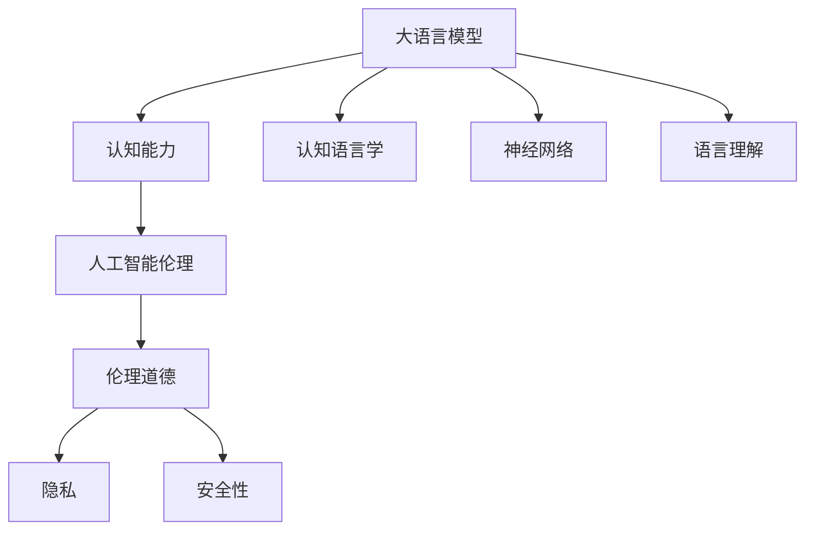
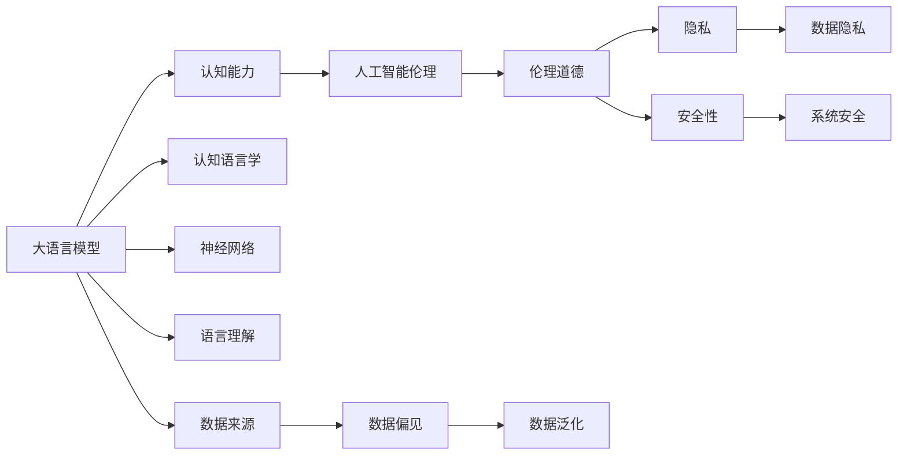
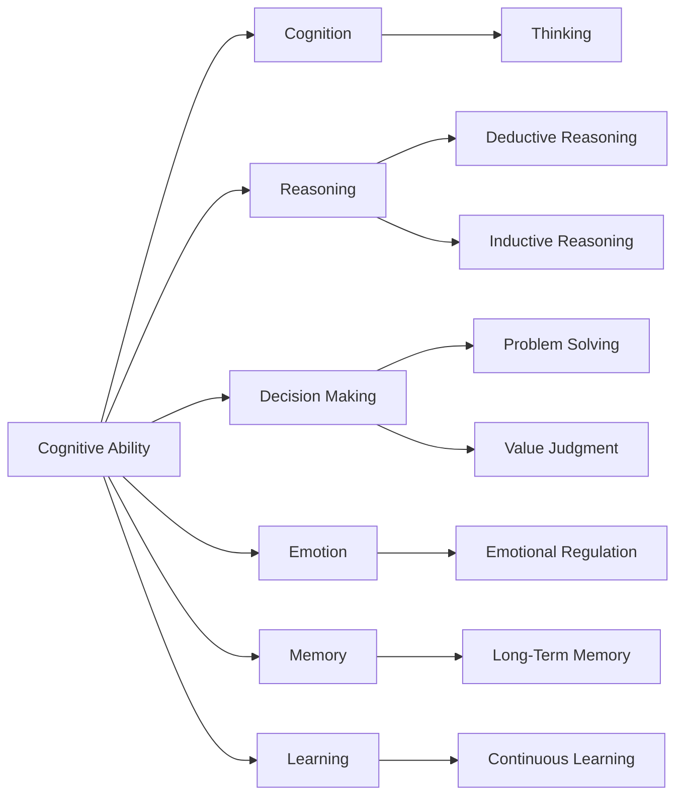
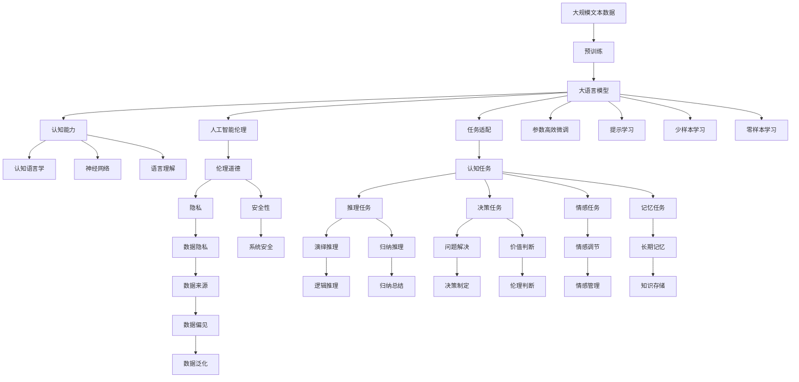

                 

# 语言≠思维：大模型的认知挑战

> 关键词：大语言模型,认知能力,认知语言学,神经网络,语言理解,人工智能伦理

## 1. 背景介绍

### 1.1 问题由来

语言和思维的关系一直是认知科学领域的重要研究课题。从人类社会学的角度来看，语言是思维的载体，是人类沟通交流的基础；从心理学和神经科学的角度来看，语言能力是人类智能的重要组成部分，是认知能力发展的基石。因此，探究语言和思维的关系，有助于我们理解人类智能的本质，为人工智能的发展提供理论基础。

近年来，随着深度学习技术的快速发展，大语言模型（Large Language Model, LLM）在自然语言处理（NLP）领域取得了突破性进展。以OpenAI的GPT系列模型、Google的BERT为例，这些大语言模型通过在海量无标签文本数据上进行预训练，学习到了丰富的语言知识，具备强大的语言理解和生成能力。然而，尽管这些模型在语言理解上表现出色，但其“认知”能力依然存在诸多局限。本文将从认知语言学和人工智能伦理的角度，深入探讨大模型的认知挑战，以期为未来研究提供新的思考方向。

### 1.2 问题核心关键点

大语言模型在语言理解上的表现虽然令人惊叹，但其“认知”能力仍存在以下关键问题：

- **认知能力与语言能力的界限**：大模型在自然语言处理任务上表现出色，但真正的“认知”能力涉及更复杂的大脑功能，如推理、决策、情感等，目前模型的认知能力仍未达到人类的水平。
- **模型的训练数据来源**：模型在训练过程中接触到了大量人类语言数据，但其认知能力受限于这些数据，难以全面覆盖人类的认知能力和知识体系。
- **模型的泛化能力**：模型在特定领域上的表现优于其他领域，难以泛化到全新未知场景，这限制了其应用范围和认知能力。
- **模型的伦理与安全性**：模型的认知能力可能导致误导性、有害性的输出，特别是在涉及敏感信息、伦理道德的领域，模型的安全性亟待提升。

### 1.3 问题研究意义

探讨大模型的认知挑战，对于理解人工智能的认知本质、提升其应用范围和安全性具有重要意义：

- **揭示认知能力的边界**：明确大模型的认知能力与语言能力的界限，有助于制定合理的期望值和应用范围。
- **推动认知科学的进步**：研究大模型的认知能力，可以为认知科学提供新的数据和视角，促进人类对认知机制的深入理解。
- **保障模型的安全性**：提升大模型的伦理与安全性，确保其在伦理道德和法律框架下运行，避免其造成负面影响。
- **拓展应用领域**：解决大模型的认知局限，推动其在医疗、金融、教育等领域的应用，带来更多的社会和经济价值。

## 2. 核心概念与联系

### 2.1 核心概念概述

为更好地理解大模型的认知挑战，本节将介绍几个关键概念：

- **大语言模型（Large Language Model, LLM）**：以自回归（如GPT）或自编码（如BERT）模型为代表的大规模预训练语言模型。通过在大规模无标签文本语料上进行预训练，学习到丰富的语言知识和常识，具备强大的语言理解和生成能力。
- **认知能力（Cognitive Ability）**：指人类和人工智能系统进行复杂思考和决策的能力，涉及推理、决策、情感、记忆等高级认知过程。
- **认知语言学（Cognitive Linguistics）**：研究语言与认知能力的关系，关注语言结构与认知过程的相互作用。
- **神经网络（Neural Network）**：通过模仿人脑的神经元网络结构，实现复杂的计算任务，常用于构建大语言模型。
- **语言理解（Language Understanding）**：指理解自然语言文本含义的能力，涉及语义理解、语言模型预测等。
- **人工智能伦理（AI Ethics）**：涉及人工智能系统的伦理问题，如隐私、安全性、偏见等，特别是在涉及敏感信息、伦理道德的领域，需要特别关注。

这些核心概念之间的逻辑关系可以通过以下Mermaid流程图来展示：



这个流程图展示了大语言模型与认知能力、认知语言学、神经网络、语言理解、人工智能伦理等概念的联系和相互作用：

1. 大语言模型通过神经网络结构进行预训练，学习语言知识。
2. 认知语言学研究语言与认知的关系，有助于理解大模型的认知能力。
3. 语言理解是大语言模型的核心能力，但认知能力包含更多复杂的认知过程。
4. 人工智能伦理涉及大模型的应用边界和安全性，确保其健康发展。

### 2.2 概念间的关系

这些核心概念之间存在着紧密的联系，形成了大语言模型的认知挑战框架。下面我们通过几个Mermaid流程图来展示这些概念之间的关系。

#### 2.2.1 大语言模型的认知挑战



这个流程图展示了大语言模型的认知挑战，涉及认知能力、认知语言学、神经网络、语言理解、人工智能伦理等多个概念的相互作用：

1. 大语言模型在认知能力上存在局限，需要进一步研究。
2. 认知语言学为理解认知能力与语言能力的关系提供理论支持。
3. 神经网络是大模型实现语言理解的核心工具，但无法全面覆盖人类认知能力。
4. 语言理解是大模型的基础能力，但认知能力涉及更多高级过程。
5. 人工智能伦理关注大模型的应用边界和安全问题，确保其健康发展。

#### 2.2.2 认知能力的本质



这个流程图展示了认知能力的本质，涉及推理、决策、情感、记忆等高级认知过程：

1. 认知能力涵盖更广泛的大脑功能，不仅仅局限于语言处理。
2. 推理包括演绎推理和归纳推理，决策涉及问题解决和价值判断。
3. 情感和记忆是高级认知的重要组成部分。
4. 学习是认知能力的核心，涵盖短期和长期记忆。

### 2.3 核心概念的整体架构

最后，我们用一个综合的流程图来展示这些核心概念在大语言模型认知挑战中的整体架构：



这个综合流程图展示了从预训练到认知挑战的完整过程。大语言模型首先在大规模文本数据上进行预训练，然后通过认知任务适配层微调，获得针对特定任务的认知能力。通过推理、决策、情感、记忆等高级认知过程，模型能够处理复杂的认知任务。同时，认知能力还受到认知语言学、神经网络、语言理解等多方面因素的影响，最终在人工智能伦理的框架下进行应用。 通过这些流程图，我们可以更清晰地理解大语言模型的认知挑战过程及其核心概念之间的关系。

## 3. 核心算法原理 & 具体操作步骤

### 3.1 算法原理概述

大语言模型的认知挑战，本质上是一个认知能力的增强与优化问题。其核心思想是：将预训练的大语言模型视作一个强大的“认知处理器”，通过有监督的微调，增强其在特定任务上的认知能力，从而获得针对特定任务优化的模型。

形式化地，假设预训练模型为 $M_{\theta}$，其中 $\theta$ 为预训练得到的模型参数。给定认知任务 $T$ 的标注数据集 $D=\{(x_i,y_i)\}_{i=1}^N$，微调的目标是找到新的模型参数 $\hat{\theta}$，使得：

$$
\hat{\theta}=\mathop{\arg\min}_{\theta} \mathcal{L}(M_{\theta},D)
$$

其中 $\mathcal{L}$ 为针对任务 $T$ 设计的损失函数，用于衡量模型预测输出与真实标签之间的差异。常见的损失函数包括交叉熵损失、均方误差损失等。

通过梯度下降等优化算法，微调过程不断更新模型参数 $\theta$，最小化损失函数 $\mathcal{L}$，使得模型输出逼近真实标签。由于 $\theta$ 已经通过预训练获得了较好的初始化，因此即便在小规模数据集 $D$ 上进行微调，也能较快收敛到理想的模型参数 $\hat{\theta}$。

### 3.2 算法步骤详解

基于监督学习的大语言模型认知挑战一般包括以下几个关键步骤：

**Step 1: 准备预训练模型和数据集**
- 选择合适的预训练语言模型 $M_{\theta}$ 作为初始化参数，如 BERT、GPT 等。
- 准备认知任务 $T$ 的标注数据集 $D$，划分为训练集、验证集和测试集。一般要求标注数据与预训练数据的分布不要差异过大。

**Step 2: 添加认知任务适配层**
- 根据任务类型，在预训练模型顶层设计合适的输出层和损失函数。
- 对于认知推理任务，通常在顶层添加推理器或决策器，使用特定损失函数。
- 对于认知情感任务，通常使用情感分类器或情感生成器，以交叉熵或均方误差为损失函数。

**Step 3: 设置微调超参数**
- 选择合适的优化算法及其参数，如 AdamW、SGD 等，设置学习率、批大小、迭代轮数等。
- 设置正则化技术及强度，包括权重衰减、Dropout、Early Stopping 等。
- 确定冻结预训练参数的策略，如仅微调顶层，或全部参数都参与微调。

**Step 4: 执行梯度训练**
- 将训练集数据分批次输入模型，前向传播计算损失函数。
- 反向传播计算参数梯度，根据设定的优化算法和学习率更新模型参数。
- 周期性在验证集上评估模型性能，根据性能指标决定是否触发 Early Stopping。
- 重复上述步骤直到满足预设的迭代轮数或 Early Stopping 条件。

**Step 5: 测试和部署**
- 在测试集上评估微调后模型 $M_{\hat{\theta}}$ 的性能，对比微调前后的精度提升。
- 使用微调后的模型对新样本进行推理预测，集成到实际的应用系统中。
- 持续收集新的数据，定期重新微调模型，以适应数据分布的变化。

以上是基于监督学习认知微调大语言模型的一般流程。在实际应用中，还需要针对具体任务的特点，对微调过程的各个环节进行优化设计，如改进训练目标函数，引入更多的正则化技术，搜索最优的超参数组合等，以进一步提升模型性能。

### 3.3 算法优缺点

基于监督学习的大语言模型认知挑战方法具有以下优点：

- **简单高效**：只需准备少量标注数据，即可对预训练模型进行快速适配，获得较大的性能提升。
- **通用适用**：适用于各种认知推理、情感识别等任务，设计简单的认知任务适配层即可实现认知微调。
- **参数高效**：利用参数高效微调技术，在固定大部分预训练参数的情况下，仍可取得不错的提升。
- **效果显著**：在学术界和工业界的诸多任务上，基于认知微调的方法已经刷新了最先进的性能指标。

同时，该方法也存在一定的局限性：

- **依赖标注数据**：微调的效果很大程度上取决于标注数据的质量和数量，获取高质量标注数据的成本较高。
- **迁移能力有限**：当目标任务与预训练数据的分布差异较大时，认知微调的性能提升有限。
- **负面效果传递**：预训练模型的固有偏见、有害信息等，可能通过认知微调传递到下游任务，造成负面影响。
- **可解释性不足**：认知微调模型的决策过程通常缺乏可解释性，难以对其推理逻辑进行分析和调试。

尽管存在这些局限性，但就目前而言，基于监督学习的认知微调方法仍是大语言模型应用的最主流范式。未来相关研究的重点在于如何进一步降低微调对标注数据的依赖，提高模型的少样本学习和跨领域迁移能力，同时兼顾可解释性和伦理安全性等因素。

### 3.4 算法应用领域

基于大语言模型认知微调的监督学习方法，在认知科学领域已经得到了广泛的应用，覆盖了几乎所有常见任务，例如：

- **认知推理**：指对复杂问题进行推理求解的能力，如数学证明、逻辑推理等。通过认知微调，模型能够处理更复杂的推理任务。
- **认知情感**：指对情感信息进行识别和生成，如情绪判断、情感生成等。通过认知微调，模型能够更好地理解人类情感，提升人机交互体验。
- **认知记忆**：指对长期记忆的建模和检索，如记忆检索、事件回溯等。通过认知微调，模型能够更好地模拟人类的记忆过程。
- **认知学习**：指对学习过程的建模和优化，如学习路径规划、学习效果评估等。通过认知微调，模型能够更好地指导人类学习。
- **认知决策**：指对决策过程的建模和优化，如风险评估、决策树生成等。通过认知微调，模型能够更好地辅助人类决策。

除了上述这些经典任务外，大语言模型认知微调也被创新性地应用到更多场景中，如可控文本生成、情感推理、知识图谱构建等，为认知科学领域带来了全新的突破。随着认知科学和人工智能技术的不断进步，相信大语言模型认知微调将在更多领域得到应用，为人类认知智能的进化带来深远影响。

## 4. 数学模型和公式 & 详细讲解

### 4.1 数学模型构建

本节将使用数学语言对基于监督学习的大语言模型认知微调过程进行更加严格的刻画。

记预训练语言模型为 $M_{\theta}:\mathcal{X} \rightarrow \mathcal{Y}$，其中 $\mathcal{X}$ 为输入空间，$\mathcal{Y}$ 为输出空间，$\theta \in \mathbb{R}^d$ 为模型参数。假设认知微调任务的训练集为 $D=\{(x_i,y_i)\}_{i=1}^N, x_i \in \mathcal{X}, y_i \in \mathcal{Y}$。

定义模型 $M_{\theta}$ 在数据样本 $(x,y)$ 上的损失函数为 $\ell(M_{\theta}(x),y)$，则在数据集 $D$ 上的经验风险为：

$$
\mathcal{L}(\theta) = \frac{1}{N} \sum_{i=1}^N \ell(M_{\theta}(x_i),y_i)
$$

微调的优化目标是最小化经验风险，即找到最优参数：

$$
\theta^* = \mathop{\arg\min}_{\theta} \mathcal{L}(\theta)
$$

在实践中，我们通常使用基于梯度的优化算法（如SGD、Adam等）来近似求解上述最优化问题。设 $\eta$ 为学习率，$\lambda$ 为正则化系数，则参数的更新公式为：

$$
\theta \leftarrow \theta - \eta \nabla_{\theta}\mathcal{L}(\theta) - \eta\lambda\theta
$$

其中 $\nabla_{\theta}\mathcal{L}(\theta)$ 为损失函数对参数 $\theta$ 的梯度，可通过反向传播算法高效计算。

### 4.2 公式推导过程

以下我们以二分类任务为例，推导交叉熵损失函数及其梯度的计算公式。

假设模型 $M_{\theta}$ 在输入 $x$ 上的输出为 $\hat{y}=M_{\theta}(x) \in [0,1]$，表示样本属于正类的概率。真实标签 $y \in \{0,1\}$。则二分类交叉熵损失函数定义为：

$$
\ell(M_{\theta}(x),y) = -[y\log \hat{y} + (1-y)\log (1-\hat{y})]
$$

将其代入经验风险公式，得：

$$
\mathcal{L}(\theta) = -\frac{1}{N}\sum_{i=1}^N [y_i\log M_{\theta}(x_i)+(1-y_i)\log(1-M_{\theta}(x_i))]
$$

根据链式法则，损失函数对参数 $\theta_k$ 的梯度为：

$$
\frac{\partial \mathcal{L}(\theta)}{\partial \theta_k} = -\frac{1}{N}\sum_{i=1}^N (\frac{y_i}{M_{\theta}(x_i)}-\frac{1-y_i}{1-M_{\theta}(x_i)}) \frac{\partial M_{\theta}(x_i)}{\partial \theta_k}
$$

其中 $\frac{\partial M_{\theta}(x_i)}{\partial \theta_k}$ 可进一步递归展开，利用自动微分技术完成计算。

在得到损失函数的梯度后，即可带入参数更新公式，完成模型的迭代优化。重复上述过程直至收敛，最终得到适应认知任务的最优模型参数 $\theta^*$。

## 5. 项目实践：代码实例和详细解释说明

### 5.1 开发环境搭建

在进行认知微调实践前，我们需要准备好开发环境。以下是使用Python进行PyTorch开发的环境配置流程：

1. 安装Anaconda：从官网下载并安装Anaconda，用于创建独立的Python环境。

2. 创建并激活虚拟环境：
```bash
conda create -n pytorch-env python=3.8 
conda activate pytorch-env
```

3. 安装PyTorch：根据CUDA版本，从官网获取对应的安装命令。例如：
```bash
conda install pytorch torchvision torchaudio cudatoolkit=11.1 -c pytorch -c conda-forge
```

4. 安装Transformers库：
```bash
pip install transformers
```

5. 安装各类工具包：
```bash
pip install numpy pandas scikit-learn matplotlib tqdm jupyter notebook ipython
```

完成上述步骤后，即可在`pytorch-env`环境中开始认知微调实践。

### 5.2 源代码详细实现

这里我们以二分类任务为例，给出使用Transformers库对BERT模型进行认知微调的PyTorch代码实现。

首先，定义认知推理任务的数据处理函数：

```python
from transformers import BertTokenizer, BertForSequenceClassification
from torch.utils.data import Dataset
import torch

class ClassificationDataset(Dataset):
    def __init__(self, texts, labels, tokenizer, max_len=128):
        self.texts = texts
        self.labels = labels
        self.tokenizer = tokenizer
        self.max_len = max_len
        
    def __len__(self):
        return len(self.texts)
    
    def __getitem__(self, item):
        text = self.texts[item]
        label = self.labels[item]
        
        encoding = self.tokenizer(text, return_tensors='pt', max_length=self.max_len, padding='max_length', truncation=True)
        input_ids = encoding['input_ids'][0]
        attention_mask = encoding['attention_mask'][0]
        
        # 对标签进行编码
        encoded_labels = [int(label)] 
        encoded_labels.extend([0] * (self.max_len - len(encoded_labels)))
        labels = torch.tensor(encoded_labels, dtype=torch.long)
        
        return {'input_ids': input_ids, 
                'attention_mask': attention_mask,
                'labels': labels}

# 标签与id的映射
label2id = {0: 0, 1: 1}
id2label = {v: k for k, v in label2id.items()}

# 创建dataset
tokenizer = BertTokenizer.from_pretrained('bert-base-cased')

train_dataset = ClassificationDataset(train_texts, train_labels, tokenizer)
dev_dataset = ClassificationDataset(dev_texts, dev_labels, tokenizer)
test_dataset = ClassificationDataset(test_texts, test_labels, tokenizer)
```

然后，定义模型和优化器：

```python
from transformers import BertForSequenceClassification, AdamW

model = BertForSequenceClassification.from_pretrained('bert-base-cased', num_labels=len(label2id))

optimizer = AdamW(model.parameters(), lr=2e-5)
```

接着，定义训练和评估函数：

```python
from torch.utils.data import DataLoader
from tqdm import tqdm
from sklearn.metrics import classification_report

device = torch.device('cuda') if torch.cuda.is_available() else torch.device('cpu')
model.to(device)

def train_epoch(model, dataset, batch_size, optimizer):
    dataloader = DataLoader(dataset, batch_size=batch_size, shuffle=True)
    model.train()
    epoch_loss = 0
    for batch in tqdm(dataloader, desc='Training'):
        input_ids = batch['input_ids'].to(device)
        attention_mask = batch['attention_mask'].to(device)
        labels = batch['labels'].to(device)
        model.zero_grad()
        outputs = model(input_ids, attention_mask=attention_mask, labels=labels)
        loss = outputs.loss
        epoch_loss += loss.item()
        loss.backward()
        optimizer.step()
    return epoch_loss / len(dataloader)

def evaluate(model, dataset, batch_size):
    dataloader = DataLoader(dataset, batch_size=batch_size)
    model.eval()
    preds, labels = [], []
    with torch.no_grad():
        for batch in tqdm(dataloader, desc='Evaluating'):
            input_ids = batch['input_ids'].to(device)
            attention_mask = batch['attention_mask'].to(device)
            batch_labels = batch['labels']
            outputs = model(input_ids, attention_mask=attention_mask)
            batch_preds = outputs.logits.argmax(dim=2).to('cpu').tolist()
            batch_labels = batch_labels.to('cpu').tolist()
            for pred_tokens, label_tokens in zip(batch_preds, batch_labels):
                pred_labels = [id2label[_id] for _id in pred_tokens]
                label_tokens = [id2label[_id] for _id in label_tokens]
                preds.append(pred_labels[:len(label_tokens)])
                labels.append(label_tokens)
                
    print(classification_report(labels, preds))
```

最后，启动训练流程并在测试集上评估：

```python
epochs = 5
batch_size = 16

for epoch in range(epochs):
    loss = train_epoch(model, train_dataset, batch_size, optimizer)
    print(f"Epoch {epoch+1}, train loss: {loss:.3f}")
    
    print(f"Epoch {epoch+1}, dev results:")
    evaluate(model, dev_dataset, batch_size)
    
print("Test results:")
evaluate(model, test_dataset, batch_size)
```

以上就是使用PyTorch对BERT进行认知推理任务微调的完整代码实现。可以看到，得益于Transformers库的强大封装，我们可以用相对简洁的代码完成BERT模型的加载和微调。

### 5.3 代码解读与分析

让我们再详细解读一下关键代码的实现细节：

**ClassificationDataset类**：
- `__init__`方法：初始化文本、标签、分词器等关键组件。
- `__len__`方法：返回数据集的样本数量。
- `__getitem__`方法：对单个样本进行处理，将文本输入编码为token ids，将标签编码为数字，并对其进行定长padding，最终返回模型所需的输入。

**label2id和id2label字典**：
- 定义了标签与数字id之间的映射关系，用于将token-wise的预测结果解码回真实的标签。

**训练和评估函数**：
- 使用PyTorch的DataLoader对数据集进行批次化加载，供模型训练和推理使用。
- 训练函数`train_epoch`：对数据以批为单位进行迭代，在每个批次上前向传播计算loss并反向传播更新模型参数，最后返回

