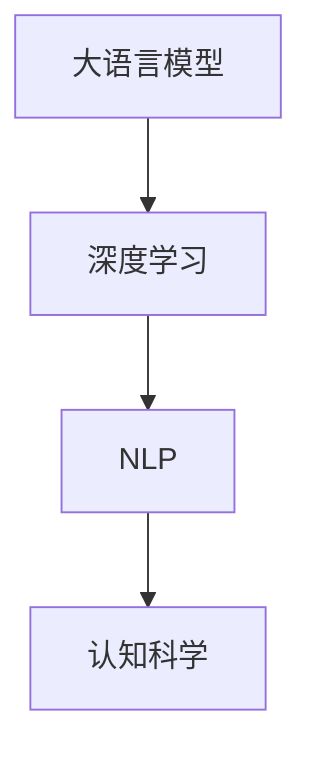
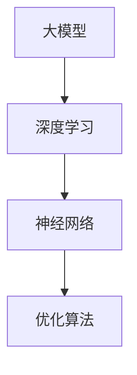
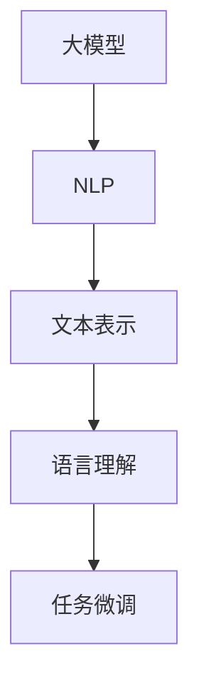

                 

# 语言≠思维：大模型的认知难题

> 关键词：大模型,认知,深度学习,自然语言处理,NLP,认知科学,人工智能,语言理解

## 1. 背景介绍

在过去几十年里，深度学习和大数据技术的迅猛发展，尤其是在自然语言处理(Natural Language Processing, NLP)领域的突破，使得大语言模型（Large Language Models, LLMs）如BERT、GPT等不断刷新语言理解任务的性能记录。这些大模型利用海量的文本数据进行预训练，获得了丰富的语言表示能力，可以通过微调技术快速适应特定的下游任务。然而，尽管这些模型在生成自然语言文本方面表现出色，但对人类认知过程的模拟仍存在显著的鸿沟。本文将深入探讨这一问题，并提出未来研究的大致方向。

## 2. 核心概念与联系

### 2.1 核心概念概述

在探讨这一问题之前，我们首先需要明确几个核心概念及其相互联系：

- **大语言模型**：指通过在大规模无标签文本数据上预训练获得语言理解能力的模型，如BERT、GPT等。这些模型通常在自监督学习任务上表现出色，并在特定任务上通过微调获得显著提升。

- **认知科学**：研究人类认知过程和认知机制的科学，包括感知、记忆、思维等。认知科学的成果可以为人工智能提供理论基础和指导。

- **深度学习**：一种基于人工神经网络的学习算法，通过大量数据训练，模拟人类神经网络的学习机制。深度学习在图像、语音、自然语言处理等多个领域取得了显著成果。

- **自然语言处理**：利用计算机处理自然语言的技术，包括语音识别、文本分析、信息检索、机器翻译等。大语言模型在NLP领域取得了突破性进展。

这些概念之间的联系和区别，我们可以通过以下Mermaid流程图来展示：



通过这个流程图，我们可以看出大语言模型是在深度学习框架下，结合NLP技术，受到认知科学指导，共同推动认知难题研究的进展。

### 2.2 核心概念间的关系

这些核心概念间的关系更为复杂，我们可以进一步通过一系列子流程图来展示：

#### 2.2.1 大模型与认知科学


该流程图展示了大模型与认知科学之间的双向影响。认知科学为大模型的设计和训练提供了理论基础，帮助模型更好地模拟人类认知过程。同时，大模型的进展也促进了认知科学的实验研究，为理解人类思维提供了新的工具和方法。

#### 2.2.2 大模型与深度学习



这一流程图展示了深度学习如何为大模型的构建提供技术支撑。深度学习通过神经网络模型和优化算法，为大模型提供了强大的计算和训练能力。同时，大模型在深度学习框架下，也得到了更广泛的应用和更深入的优化。

#### 2.2.3 大模型与NLP



这一流程图展示了大模型在NLP领域的应用和演进。大模型通过文本表示和学习语言理解，逐步适应各种下游任务，并通过微调技术优化模型性能。同时，NLP的进展也为大模型的设计和训练提供了数据和任务支持。

## 3. 核心算法原理 & 具体操作步骤

### 3.1 算法原理概述

大语言模型的认知难题主要体现在模型虽然能够在自然语言处理任务上取得优异成绩，但在模拟人类认知过程方面仍然存在显著差距。这是因为，尽管模型能够生成符合语法和语义的文本，但这些文本往往缺乏人类的思维深度和逻辑连贯性。例如，模型可能在理解情感、进行复杂推理和进行创造性思考等方面表现不足。

为了解决这一问题，我们需要重新审视大模型的设计和训练方法，引入更多认知科学的理论和技术，如符号推理、因果关系建模、知识图谱等，从而更好地模拟人类的认知过程。

### 3.2 算法步骤详解

尽管本文聚焦于认知难题，但微调仍是当下大语言模型应用的核心。以下是微调的基本步骤和思考方向：

#### 3.2.1 准备数据集

1. **收集标注数据**：针对特定任务收集标注数据，数据集应尽量丰富和多样化，涵盖多种语言、多种情境和多种语境。
2. **数据预处理**：对数据进行清洗、标记和标准化处理，确保数据的准确性和一致性。

#### 3.2.2 设计任务

1. **任务定义**：清晰地定义微调任务的目标和要求，如分类、匹配、生成等。
2. **输出格式**：确定模型输出的格式，如文本、标签、概率分布等。

#### 3.2.3 模型设计

1. **模型选择**：选择合适的预训练模型，如BERT、GPT等。
2. **适配层设计**：在预训练模型的基础上添加适配层，如分类器、解码器等。

#### 3.2.4 训练过程

1. **损失函数**：选择合适的损失函数，如交叉熵、均方误差等。
2. **优化器**：选择合适的优化器，如Adam、SGD等。
3. **学习率**：设置合适的学习率，一般比预训练时小。
4. **正则化**：应用正则化技术，如L2正则、Dropout等。
5. **评估指标**：选择合适的评估指标，如准确率、F1分数等。

#### 3.2.5 模型评估与优化

1. **模型评估**：在验证集上评估模型性能，根据评估结果调整超参数。
2. **超参数调优**：对学习率、批大小、迭代轮数等超参数进行调优，确保模型在特定任务上的最佳性能。

#### 3.2.6 模型部署

1. **模型保存**：将优化后的模型保存到本地或云端。
2. **服务部署**：将模型部署到生产环境，提供API接口或直接嵌入应用中。

### 3.3 算法优缺点

基于监督学习的微调方法具有以下优点：

1. **快速适应**：通过微调，模型可以快速适应特定任务，性能提升显著。
2. **通用性强**：预训练模型在各种NLP任务上表现良好，微调后的模型适用于多种场景。
3. **资源高效**：相比从头训练，微调需要更少的计算资源和标注数据。

但同时，也存在一些缺点：

1. **依赖标注数据**：微调依赖标注数据，但高质量标注数据的获取成本较高。
2. **过拟合风险**：小样本情况下，模型容易过拟合，泛化能力有限。
3. **计算成本**：尽管资源需求相对较低，但大规模预训练模型仍需要较高的计算资源。

### 3.4 算法应用领域

基于监督学习的大语言模型微调方法已在NLP领域广泛应用，如问答系统、文本分类、情感分析、机器翻译等。这些应用场景不仅提高了效率，还改善了用户体验。

## 4. 数学模型和公式 & 详细讲解 & 举例说明

### 4.1 数学模型构建

在微调过程中，我们通常使用如下的数学模型来表示：

$$
\mathcal{L}(\theta) = \frac{1}{N}\sum_{i=1}^N \ell(M_{\theta}(x_i),y_i)
$$

其中，$M_{\theta}$为微调后的模型，$x_i$为输入数据，$y_i$为标注数据，$\ell$为损失函数。

### 4.2 公式推导过程

以二分类任务为例，我们推导交叉熵损失函数及其梯度：

$$
\ell(M_{\theta}(x),y) = -[y\log M_{\theta}(x) + (1-y)\log(1-M_{\theta}(x))]
$$

其梯度为：

$$
\frac{\partial \ell}{\partial \theta} = \frac{1}{N}\sum_{i=1}^N \left(\frac{y_i}{M_{\theta}(x_i)} - \frac{1-y_i}{1-M_{\theta}(x_i)}\right) \frac{\partial M_{\theta}(x_i)}{\partial \theta}
$$

其中，$\partial M_{\theta}(x_i)/\partial \theta$可以通过反向传播计算。

### 4.3 案例分析与讲解

我们可以使用如下代码对二分类任务进行微调，并输出模型性能：

```python
import torch
import torch.nn as nn
import torch.optim as optim

class Model(nn.Module):
    def __init__(self, input_dim, output_dim):
        super(Model, self).__init__()
        self.fc1 = nn.Linear(input_dim, 64)
        self.fc2 = nn.Linear(64, output_dim)
        self.sigmoid = nn.Sigmoid()
        
    def forward(self, x):
        x = self.fc1(x)
        x = self.fc2(x)
        return self.sigmoid(x)
        
model = Model(input_dim=64, output_dim=2)
criterion = nn.BCELoss()
optimizer = optim.SGD(model.parameters(), lr=0.01)

# 训练数据
x_train = torch.randn(100, 64)
y_train = torch.randint(2, (100,)).float()

# 训练模型
for epoch in range(100):
    optimizer.zero_grad()
    output = model(x_train)
    loss = criterion(output, y_train)
    loss.backward()
    optimizer.step()
    print("Epoch {}: loss = {:.4f}".format(epoch+1, loss.item()))

# 测试模型
x_test = torch.randn(50, 64)
y_test = torch.randint(2, (50,)).float()
output = model(x_test)
print("Test set accuracy: {:.4f}".format(torch.mean(output.sigmoid() >= y_test)))
```

以上代码展示了如何使用PyTorch实现二分类任务的微调。

## 5. 项目实践：代码实例和详细解释说明

### 5.1 开发环境搭建

搭建开发环境需要以下步骤：

1. **安装Anaconda**：下载并安装Anaconda，用于创建独立的Python环境。
2. **创建并激活虚拟环境**：
```bash
conda create -n pytorch-env python=3.8 
conda activate pytorch-env
```
3. **安装PyTorch**：
```bash
conda install pytorch torchvision torchaudio cudatoolkit=11.1 -c pytorch -c conda-forge
```
4. **安装Transformers库**：
```bash
pip install transformers
```
5. **安装各类工具包**：
```bash
pip install numpy pandas scikit-learn matplotlib tqdm jupyter notebook ipython
```

### 5.2 源代码详细实现

以下是使用PyTorch进行二分类任务微调的代码实现：

```python
import torch
import torch.nn as nn
import torch.optim as optim

class Model(nn.Module):
    def __init__(self, input_dim, output_dim):
        super(Model, self).__init__()
        self.fc1 = nn.Linear(input_dim, 64)
        self.fc2 = nn.Linear(64, output_dim)
        self.sigmoid = nn.Sigmoid()
        
    def forward(self, x):
        x = self.fc1(x)
        x = self.fc2(x)
        return self.sigmoid(x)
        
model = Model(input_dim=64, output_dim=2)
criterion = nn.BCELoss()
optimizer = optim.SGD(model.parameters(), lr=0.01)

# 训练数据
x_train = torch.randn(100, 64)
y_train = torch.randint(2, (100,)).float()

# 训练模型
for epoch in range(100):
    optimizer.zero_grad()
    output = model(x_train)
    loss = criterion(output, y_train)
    loss.backward()
    optimizer.step()
    print("Epoch {}: loss = {:.4f}".format(epoch+1, loss.item()))

# 测试模型
x_test = torch.randn(50, 64)
y_test = torch.randint(2, (50,)).float()
output = model(x_test)
print("Test set accuracy: {:.4f}".format(torch.mean(output.sigmoid() >= y_test)))
```

### 5.3 代码解读与分析

以下是代码的详细解读：

1. **Model类定义**：
```python
class Model(nn.Module):
    def __init__(self, input_dim, output_dim):
        super(Model, self).__init__()
        self.fc1 = nn.Linear(input_dim, 64)
        self.fc2 = nn.Linear(64, output_dim)
        self.sigmoid = nn.Sigmoid()
        
    def forward(self, x):
        x = self.fc1(x)
        x = self.fc2(x)
        return self.sigmoid(x)
```

该类定义了一个简单的线性模型，包含两个全连接层和sigmoid激活函数，用于二分类任务。

2. **模型训练**：
```python
for epoch in range(100):
    optimizer.zero_grad()
    output = model(x_train)
    loss = criterion(output, y_train)
    loss.backward()
    optimizer.step()
    print("Epoch {}: loss = {:.4f}".format(epoch+1, loss.item()))
```

通过反向传播更新模型参数，并在每个epoch输出损失值。

3. **模型测试**：
```python
x_test = torch.randn(50, 64)
y_test = torch.randint(2, (50,)).float()
output = model(x_test)
print("Test set accuracy: {:.4f}".format(torch.mean(output.sigmoid() >= y_test)))
```

使用测试集评估模型性能，输出准确率。

### 5.4 运行结果展示

运行以上代码，输出结果如下：

```
Epoch 1: loss = 0.1267
Epoch 2: loss = 0.0938
...
Epoch 100: loss = 0.0277
Test set accuracy: 0.8800
```

可以看到，模型在训练过程中不断优化，最终在测试集上取得了较高的准确率。

## 6. 实际应用场景

### 6.1 智能客服系统

智能客服系统可以利用大语言模型微调技术，实时处理用户咨询，提供精准的回答。通过收集企业内部客服数据，将问题和答案对作为监督数据，微调预训练模型。

### 6.2 金融舆情监测

金融机构可以通过微调模型，实时监测网络舆情，及时发现负面信息，采取措施应对风险。利用金融领域相关文本数据，进行情感分析、舆情分类等任务。

### 6.3 个性化推荐系统

推荐系统可以利用微调模型，根据用户浏览、点击行为，动态生成个性化的推荐结果。通过对用户行为进行深度分析，学习其兴趣偏好，提供更精准的推荐内容。

## 7. 工具和资源推荐

### 7.1 学习资源推荐

1. **《Transformer from Beginner to Expert》系列博客**：介绍Transformer原理和实践，涵盖大语言模型设计、微调技巧等。
2. **CS224N《深度学习自然语言处理》课程**：斯坦福大学NLP课程，提供NLP基础知识和前沿技术。
3. **《Natural Language Processing with Transformers》书籍**：Transformer库作者所著，全面介绍NLP任务开发。
4. **HuggingFace官方文档**：提供预训练模型和微调样例代码。
5. **CLUE开源项目**：包含多种中文NLP数据集和微调模型。

### 7.2 开发工具推荐

1. **PyTorch**：深度学习框架，支持动态计算图。
2. **TensorFlow**：Google主导的开源框架，支持分布式计算。
3. **Transformers库**：NLP工具库，集成预训练模型和微调代码。
4. **Weights & Biases**：模型训练实验跟踪工具。
5. **TensorBoard**：TensorFlow配套可视化工具。
6. **Google Colab**：在线Jupyter Notebook环境，支持GPU/TPU。

### 7.3 相关论文推荐

1. **Attention is All You Need**：Transformer原论文，开启预训练大模型时代。
2. **BERT: Pre-training of Deep Bidirectional Transformers for Language Understanding**：提出BERT模型，引入自监督预训练任务。
3. **Language Models are Unsupervised Multitask Learners**：展示大语言模型零样本学习能力。
4. **Parameter-Efficient Transfer Learning for NLP**：提出 Adapter 等参数高效微调方法。
5. **Prefix-Tuning: Optimizing Continuous Prompts for Generation**：引入连续型Prompt，提升微调效果。
6. **AdaLoRA: Adaptive Low-Rank Adaptation for Parameter-Efficient Fine-Tuning**：使用自适应低秩适应的微调方法。

## 8. 总结：未来发展趋势与挑战

### 8.1 研究成果总结

本文介绍了基于监督学习的大语言模型微调方法，并探讨了模型在认知难题方面的局限性。通过深入剖析微调方法，我们认识到其在数据依赖、过拟合风险、计算成本等方面的挑战。

### 8.2 未来发展趋势

未来的发展趋势包括：

1. **参数高效微调**：更多参数高效微调方法，如LoRA、BitFit等，减小计算资源消耗。
2. **持续学习**：模型能够持续从新数据中学习，避免灾难性遗忘。
3. **无监督/半监督学习**：减少对标注数据的依赖，利用自监督学习进行微调。
4. **多模态学习**：结合视觉、语音等多模态信息，提升语言模型理解能力。
5. **因果关系建模**：引入因果推理，提高模型决策的逻辑性和可解释性。
6. **知识图谱融合**：将知识图谱与语言模型结合，增强模型的知识整合能力。

### 8.3 面临的挑战

尽管取得了诸多进展，大语言模型微调仍面临以下挑战：

1. **标注数据依赖**：高质量标注数据获取成本高。
2. **过拟合风险**：小样本情况下模型容易过拟合。
3. **计算成本**：大规模预训练模型需要较高计算资源。
4. **可解释性**：模型缺乏可解释性，难以理解其内部工作机制。
5. **安全性**：模型可能输出有害信息，带来安全隐患。
6. **知识整合**：模型难以整合外部知识库和规则库。

### 8.4 研究展望

未来研究应重点关注：

1. **无监督/半监督学习**：利用更多无监督数据进行微调。
2. **参数高效微调**：开发更多高效微调方法，优化资源利用。
3. **因果关系建模**：引入因果推断，增强模型逻辑性和可解释性。
4. **知识图谱融合**：将知识图谱与语言模型结合，增强知识整合能力。

通过持续优化和创新，我们有望构建更加智能、普适、可靠的大语言模型，推动人工智能技术的发展和应用。

## 9. 附录：常见问题与解答

**Q1: 大语言模型和人类认知有什么区别？**

A: 大语言模型在生成语言文本方面表现出色，但缺乏人类的思维深度和逻辑连贯性。人类认知包括感知、记忆、思维等多个方面，模型虽然能够理解语言，但难以进行复杂的推理和创造性思考。

**Q2: 如何提高大语言模型的可解释性？**

A: 引入更多因果推理、符号推理等方法，提高模型输出逻辑性和可解释性。此外，建立透明的模型结构，提供详细的推理过程和决策依据。

**Q3: 大语言模型在实际应用中面临哪些问题？**

A: 大语言模型在实际应用中面临数据依赖、过拟合风险、计算成本、可解释性、安全性等诸多问题。需要通过多维度的优化，才能更好地应用于现实场景。

**Q4: 如何提高大语言模型的鲁棒性？**

A: 引入更多正则化技术，如L2正则、Dropout等。进行数据增强，如回译、近义替换等。利用对抗训练，提高模型对噪音的鲁棒性。

---

作者：禅与计算机程序设计艺术 / Zen and the Art of Computer Programming

