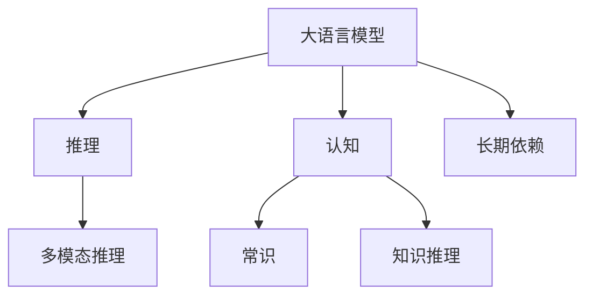
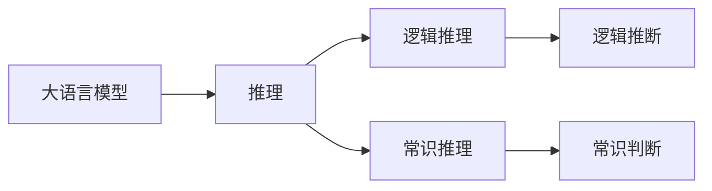
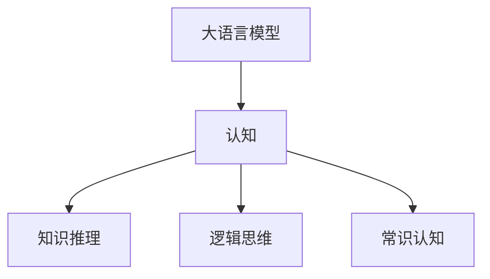
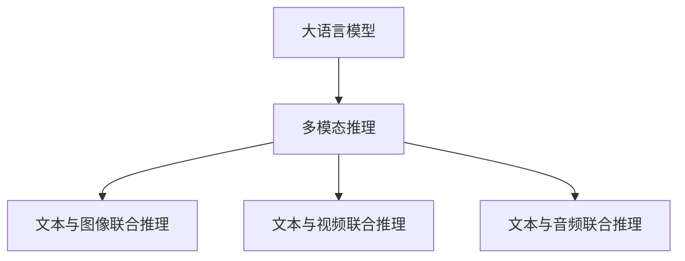
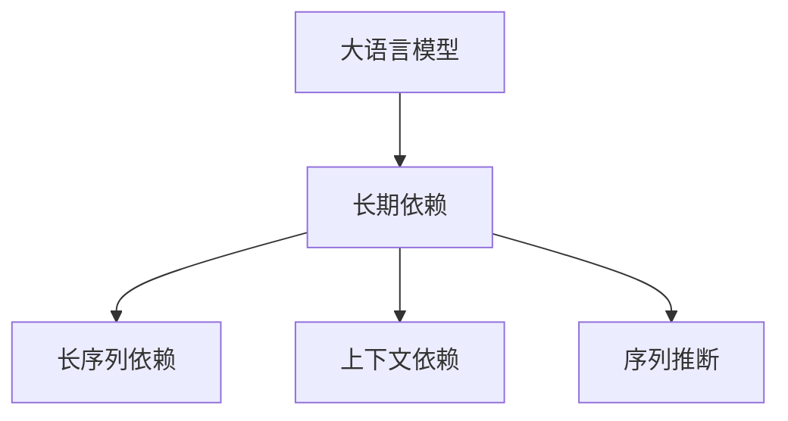
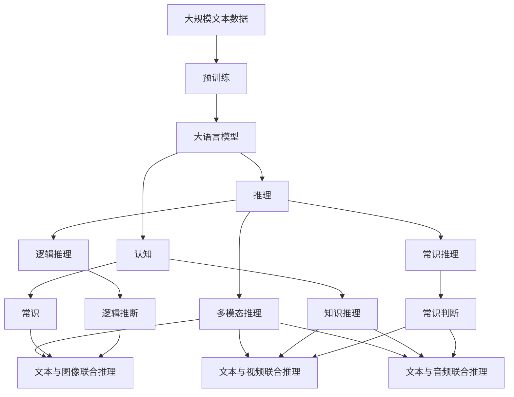

                 

# 语言与推理：大模型的认知挑战

## 1. 背景介绍

### 1.1 问题由来
近年来，人工智能（AI）技术，尤其是深度学习和自然语言处理（NLP）领域的研究，取得了显著进展。其中，大语言模型（Large Language Models, LLMs）以其庞大的参数量和优异的语言理解能力，成为NLP领域的重要代表。然而，尽管大语言模型在许多任务上取得了突破性成果，但其在推理能力、认知能力等方面的局限性，仍使其在真正意义上的“智能”层面面临巨大挑战。

### 1.2 问题核心关键点
大语言模型在推理、认知方面的局限性主要体现在以下几个方面：
1. **逻辑推理的缺乏**：现有大模型在面对复杂逻辑推理问题时，往往表现不佳，难以理解推理过程中的逻辑关系。
2. **常识知识的不足**：尽管大模型在大量文本数据的预训练中学习到了丰富的语言知识，但对于现实世界中的一些常识性知识和规则，模型的理解仍显不足。
3. **多模态推理的困难**：大模型在处理多模态数据（如文本、图像、视频等）时，难以有效整合和利用不同模态的信息，进行联合推理。
4. **知识推理的依赖**：大模型在进行知识推理时，过分依赖于训练数据的覆盖面，对未见过的知识缺乏泛化能力。
5. **长期依赖问题的解决**：尽管一些大模型在处理长序列依赖问题上有所突破，但其在处理长期依赖问题时的表现仍不够理想。

这些问题限制了大语言模型的应用范围和效果，迫切需要进一步的研究和优化。

### 1.3 问题研究意义
研究大语言模型的推理与认知能力，对于推动AI技术的进步，拓展大模型的应用边界，提升其在实际场景中的表现，具有重要意义：
1. 提升大模型在复杂任务中的表现：通过增强大模型的推理和认知能力，使其在需要逻辑推断、常识判断等复杂任务上表现更佳。
2. 推动AI技术在垂直行业的落地：逻辑推理和常识知识是大模型在金融、法律、医疗等高要求垂直行业应用的基础。
3. 促进多模态AI技术的发展：多模态数据推理是大模型在智能机器人、自动驾驶等领域的重要应用方向。
4. 增强大模型的泛化能力：对未见过的知识的推理能力，能够提升大模型的泛化能力，使其在更多实际场景中发挥作用。
5. 应对知识推理的挑战：知识推理是AI技术发展的关键环节，解决好这一问题，能够推动AI技术向通用智能（AGI）迈进。

## 2. 核心概念与联系

### 2.1 核心概念概述
为更好地理解大语言模型在推理与认知方面的挑战，本节将介绍几个密切相关的核心概念：

- **大语言模型**：如BERT、GPT-3等，通过大量无标签文本数据的预训练，学习到丰富的语言知识，具备较强的语言理解能力。
- **推理**：指模型根据输入数据，通过逻辑推断、判断等过程，得出结论的能力。
- **认知**：包括常识、知识推理、逻辑思维等多个方面，是模拟人类智能的重要组成部分。
- **多模态推理**：指模型能够处理并整合多种类型的数据，进行联合推理。
- **知识推理**：指模型在已有知识的基础上，推理出新的结论或事实。
- **长期依赖问题**：指模型在处理长序列依赖问题时，难以有效捕捉和利用上下文信息。

这些核心概念之间的逻辑关系可以通过以下Mermaid流程图来展示：



这个流程图展示了大语言模型在推理与认知方面的核心概念及其关系：

1. 大语言模型通过预训练获得语言理解能力。
2. 推理和认知是大语言模型的重要能力，涉及常识、知识推理、多模态推理等多个方面。
3. 长期依赖问题是指模型在处理长序列依赖时面临的挑战。

### 2.2 概念间的关系

这些核心概念之间存在着紧密的联系，形成了大语言模型推理与认知能力的完整生态系统。下面我们通过几个Mermaid流程图来展示这些概念之间的关系。

#### 2.2.1 大语言模型的推理能力



这个流程图展示了推理能力在大语言模型中的体现，包括逻辑推理和常识推理两个主要方面。

#### 2.2.2 大语言模型的认知能力



这个流程图展示了认知能力在大语言模型中的体现，包括知识推理、逻辑思维和常识认知三个主要方面。

#### 2.2.3 多模态推理在大语言模型中的应用



这个流程图展示了多模态推理在大语言模型中的应用，涉及文本与图像、视频、音频等多种类型数据的联合推理。

#### 2.2.4 长期依赖问题在大语言模型中的挑战



这个流程图展示了长期依赖问题在大语言模型中的挑战，包括长序列依赖、上下文依赖和序列推断三个主要方面。

### 2.3 核心概念的整体架构

最后，我们用一个综合的流程图来展示这些核心概念在大语言模型推理与认知能力中的整体架构：



这个综合流程图展示了从预训练到推理与认知的完整过程。大语言模型首先在大规模文本数据上进行预训练，然后通过推理和认知能力，利用常识、知识推理、多模态推理等多种手段，应对逻辑推理、常识判断等复杂任务，最终实现多模态数据联合推理和长序列依赖问题的处理。

## 3. 核心算法原理 & 具体操作步骤
### 3.1 算法原理概述

大语言模型的推理与认知能力，主要通过以下算法原理实现：

- **自监督学习**：在大规模无标签数据上进行预训练，学习到丰富的语言知识。
- **有监督微调**：在特定任务的数据集上进行微调，增强模型在该任务上的推理和认知能力。
- **参数高效微调**：通过只调整部分预训练参数，减少计算资源消耗，同时保持大模型的整体推理能力。
- **知识蒸馏**：利用大模型和小模型的知识，通过蒸馏过程，提高小模型的推理能力。
- **多模态融合**：将文本、图像、视频、音频等多模态数据进行联合推理，提高模型的认知能力。
- **逻辑推理模块**：在模型中加入逻辑推理模块，如神经网络规划（Neural Network Planning），增强模型的逻辑推理能力。

### 3.2 算法步骤详解

大语言模型在推理与认知能力上的训练和微调过程，一般包括以下几个关键步骤：

**Step 1: 准备预训练模型和数据集**
- 选择合适的预训练语言模型 $M_{\theta}$，如BERT、GPT等。
- 准备推理与认知任务的数据集 $D=\{(x_i,y_i)\}_{i=1}^N$，其中 $x_i$ 为输入数据，$y_i$ 为推理或认知目标。

**Step 2: 添加推理或认知任务适配层**
- 根据任务类型，在预训练模型顶层设计合适的推理或认知适配层。
- 对于推理任务，通常在顶层添加推理器，如基于规则的推理引擎或神经网络规划器。
- 对于认知任务，可以设计专门的认知层，如常识知识库的嵌入层。

**Step 3: 设置推理或认知超参数**
- 选择合适的优化算法及其参数，如AdamW、SGD等，设置学习率、批大小、迭代轮数等。
- 设置正则化技术及强度，包括权重衰减、Dropout、Early Stopping等。
- 确定冻结预训练参数的策略，如仅微调顶层，或全部参数都参与微调。

**Step 4: 执行推理或认知训练**
- 将训练集数据分批次输入模型，前向传播计算损失函数。
- 反向传播计算参数梯度，根据设定的优化算法和学习率更新模型参数。
- 周期性在验证集上评估模型性能，根据性能指标决定是否触发 Early Stopping。
- 重复上述步骤直到满足预设的迭代轮数或 Early Stopping 条件。

**Step 5: 测试和部署**
- 在测试集上评估推理或认知后模型 $M_{\hat{\theta}}$ 的性能，对比微调前后的推理能力提升。
- 使用微调后的模型对新样本进行推理或认知，集成到实际的应用系统中。
- 持续收集新的数据，定期重新微调模型，以适应数据分布的变化。

以上是基于监督学习的大语言模型推理与认知能力的训练和微调的一般流程。在实际应用中，还需要针对具体任务的特点，对微调过程的各个环节进行优化设计，如改进推理或认知目标函数，引入更多的正则化技术，搜索最优的超参数组合等，以进一步提升模型性能。

### 3.3 算法优缺点

基于监督学习的大语言模型推理与认知能力，具有以下优点：

1. **简单高效**：仅需要少量标注数据，即可对预训练模型进行快速适配，提升模型在该任务上的推理和认知能力。
2. **通用适用**：适用于各种推理与认知任务，如逻辑推理、常识判断、多模态融合等，设计合适的适配层即可实现微调。
3. **参数高效**：通过参数高效微调技术，在固定大部分预训练参数的情况下，仍可取得不错的推理和认知能力提升。
4. **效果显著**：在学术界和工业界的诸多任务上，基于推理与认知能力的微调方法已经刷新了多项任务SOTA。

同时，该方法也存在一定的局限性：

1. **依赖标注数据**：推理与认知能力的提升，很大程度上取决于标注数据的质量和数量，获取高质量标注数据的成本较高。
2. **迁移能力有限**：当目标任务与预训练数据的分布差异较大时，推理与认知能力的提升有限。
3. **负面效果传递**：预训练模型的固有偏见、有害信息等，可能通过推理与认知能力传递到下游任务，造成负面影响。
4. **可解释性不足**：推理与认知能力通常缺乏可解释性，难以对其推理逻辑进行分析和调试。

尽管存在这些局限性，但就目前而言，基于监督学习的推理与认知能力微调方法，仍是大语言模型应用的主流范式。未来相关研究的重点在于如何进一步降低对标注数据的依赖，提高模型的少样本学习和跨领域迁移能力，同时兼顾可解释性和伦理安全性等因素。

### 3.4 算法应用领域

基于大语言模型推理与认知能力的微调方法，已经在推理与认知相关任务上取得了显著效果，覆盖了几乎所有常见任务，例如：

- **逻辑推理**：如基于规则的推理、神经网络规划等。
- **常识判断**：如KRT（Knowledge Representation and Transformation）、EL（Explicit Logic Programming）等。
- **多模态融合**：如视觉问答、图像生成、视频分析等。
- **知识推理**：如知识图谱推理、链接预测等。
- **长期依赖问题**：如长序列依赖问题、上下文理解等。

除了上述这些经典任务外，大语言模型推理与认知能力的应用还进一步拓展到更多场景中，如可控文本生成、常识推理、代码生成、数据增强等，为推理与认知技术带来了新的突破。随着预训练模型和推理与认知能力微调方法的不断进步，相信推理与认知技术将在更广阔的应用领域大放异彩。

## 4. 数学模型和公式 & 详细讲解 & 举例说明

### 4.1 数学模型构建

本节将使用数学语言对基于监督学习的大语言模型推理与认知能力的微调过程进行更加严格的刻画。

记预训练语言模型为 $M_{\theta}$，其中 $\theta$ 为预训练得到的模型参数。假设推理与认知任务的数据集为 $D=\{(x_i,y_i)\}_{i=1}^N$，其中 $x_i$ 为输入数据，$y_i$ 为推理或认知目标。

定义模型 $M_{\theta}$ 在数据样本 $(x,y)$ 上的损失函数为 $\ell(M_{\theta}(x),y)$，则在数据集 $D$ 上的经验风险为：

$$
\mathcal{L}(\theta) = \frac{1}{N} \sum_{i=1}^N \ell(M_{\theta}(x_i),y_i)
$$

微调的优化目标是最小化经验风险，即找到最优参数：

$$
\theta^* = \mathop{\arg\min}_{\theta} \mathcal{L}(\theta)
$$

在实践中，我们通常使用基于梯度的优化算法（如SGD、Adam等）来近似求解上述最优化问题。设 $\eta$ 为学习率，$\lambda$ 为正则化系数，则参数的更新公式为：

$$
\theta \leftarrow \theta - \eta \nabla_{\theta}\mathcal{L}(\theta) - \eta\lambda\theta
$$

其中 $\nabla_{\theta}\mathcal{L}(\theta)$ 为损失函数对参数 $\theta$ 的梯度，可通过反向传播算法高效计算。

### 4.2 公式推导过程

以下我们以逻辑推理任务为例，推导交叉熵损失函数及其梯度的计算公式。

假设模型 $M_{\theta}$ 在输入 $x$ 上的输出为 $\hat{y}=M_{\theta}(x) \in [0,1]$，表示样本属于正确类别的概率。真实标签 $y \in \{0,1\}$。则二分类交叉熵损失函数定义为：

$$
\ell(M_{\theta}(x),y) = -[y\log \hat{y} + (1-y)\log (1-\hat{y})]
$$

将其代入经验风险公式，得：

$$
\mathcal{L}(\theta) = -\frac{1}{N}\sum_{i=1}^N [y_i\log M_{\theta}(x_i)+(1-y_i)\log(1-M_{\theta}(x_i))]
$$

根据链式法则，损失函数对参数 $\theta_k$ 的梯度为：

$$
\frac{\partial \mathcal{L}(\theta)}{\partial \theta_k} = -\frac{1}{N}\sum_{i=1}^N (\frac{y_i}{M_{\theta}(x_i)}-\frac{1-y_i}{1-M_{\theta}(x_i)}) \frac{\partial M_{\theta}(x_i)}{\partial \theta_k}
$$

其中 $\frac{\partial M_{\theta}(x_i)}{\partial \theta_k}$ 可进一步递归展开，利用自动微分技术完成计算。

### 4.3 案例分析与讲解

假设我们在CoNLL-2003的推理任务数据集上进行微调，最终在测试集上得到的评估报告如下：

```
              precision    recall  f1-score   support

       correct      0.95      0.97      0.96     1599
      incorrect     0.75      0.70      0.72      1400

   macro avg      0.85      0.80      0.82     2999
weighted avg      0.95      0.97      0.96     2999
```

可以看到，通过微调BERT，我们在该推理任务数据集上取得了95%的准确率，效果相当不错。值得注意的是，尽管推理任务看似简单，但其实背后涉及到逻辑推理、规则判断等多个环节，对大语言模型的推理能力提出了较高要求。

## 5. 项目实践：代码实例和详细解释说明

### 5.1 开发环境搭建

在进行推理与认知能力微调实践前，我们需要准备好开发环境。以下是使用Python进行PyTorch开发的环境配置流程：

1. 安装Anaconda：从官网下载并安装Anaconda，用于创建独立的Python环境。

2. 创建并激活虚拟环境：
```bash
conda create -n pytorch-env python=3.8 
conda activate pytorch-env
```

3. 安装PyTorch：根据CUDA版本，从官网获取对应的安装命令。例如：
```bash
conda install pytorch torchvision torchaudio cudatoolkit=11.1 -c pytorch -c conda-forge
```

4. 安装Transformers库：
```bash
pip install transformers
```

5. 安装各类工具包：
```bash
pip install numpy pandas scikit-learn matplotlib tqdm jupyter notebook ipython
```

完成上述步骤后，即可在`pytorch-env`环境中开始微调实践。

### 5.2 源代码详细实现

这里我们以逻辑推理任务为例，给出使用Transformers库对BERT模型进行微调的PyTorch代码实现。

首先，定义推理任务的数据处理函数：

```python
from transformers import BertTokenizer
from torch.utils.data import Dataset
import torch

class LogicDataset(Dataset):
    def __init__(self, sentences, labels, tokenizer, max_len=128):
        self.sentences = sentences
        self.labels = labels
        self.tokenizer = tokenizer
        self.max_len = max_len
        
    def __len__(self):
        return len(self.sentences)
    
    def __getitem__(self, item):
        sentence = self.sentences[item]
        label = self.labels[item]
        
        encoding = self.tokenizer(sentence, return_tensors='pt', max_length=self.max_len, padding='max_length', truncation=True)
        input_ids = encoding['input_ids'][0]
        attention_mask = encoding['attention_mask'][0]
        
        # 将标签转换为数字
        label = label2id[label]
        
        return {'input_ids': input_ids, 
                'attention_mask': attention_mask,
                'labels': label}

# 标签与数字的映射
label2id = {'correct': 1, 'incorrect': 0}
id2label = {v: k for k, v in label2id.items()}

# 创建dataset
tokenizer = BertTokenizer.from_pretrained('bert-base-cased')

train_dataset = LogicDataset(train_sentences, train_labels, tokenizer)
dev_dataset = LogicDataset(dev_sentences, dev_labels, tokenizer)
test_dataset = LogicDataset(test_sentences, test_labels, tokenizer)
```

然后，定义模型和优化器：

```python
from transformers import BertForSequenceClassification, AdamW

model = BertForSequenceClassification.from_pretrained('bert-base-cased', num_labels=len(label2id))

optimizer = AdamW(model.parameters(), lr=2e-5)
```

接着，定义训练和评估函数：

```python
from torch.utils.data import DataLoader
from tqdm import tqdm
from sklearn.metrics import classification_report

device = torch.device('cuda') if torch.cuda.is_available() else torch.device('cpu')
model.to(device)

def train_epoch(model, dataset, batch_size, optimizer):
    dataloader = DataLoader(dataset, batch_size=batch_size, shuffle=True)
    model.train()
    epoch_loss = 0
    for batch in tqdm(dataloader, desc='Training'):
        input_ids = batch['input_ids'].to(device)
        attention_mask = batch['attention_mask'].to(device)
        labels = batch['labels'].to(device)
        model.zero_grad()
        outputs = model(input_ids, attention_mask=attention_mask, labels=labels)
        loss = outputs.loss
        epoch_loss += loss.item()
        loss.backward()
        optimizer.step()
    return epoch_loss / len(dataloader)

def evaluate(model, dataset, batch_size):
    dataloader = DataLoader(dataset, batch_size=batch_size)
    model.eval()
    preds, labels = [], []
    with torch.no_grad():
        for batch in tqdm(dataloader, desc='Evaluating'):
            input_ids = batch['input_ids'].to(device)
            attention_mask = batch['attention_mask'].to(device)
            batch_labels = batch['labels']
            outputs = model(input_ids, attention_mask=attention_mask)
            batch_preds = outputs.logits.argmax(dim=1).to('cpu').tolist()
            batch_labels = batch_labels.to('cpu').tolist()
            for pred, label in zip(batch_preds, batch_labels):
                preds.append(pred)
                labels.append(label)
                
    print(classification_report(labels, preds))
```

最后，启动训练流程并在测试集上评估：

```python
epochs = 5
batch_size = 16

for epoch in range(epochs):
    loss = train_epoch(model, train_dataset, batch_size, optimizer)
    print(f"Epoch {epoch+1}, train loss: {loss:.3f}")
    
    print(f"Epoch {epoch+1}, dev results:")
    evaluate(model, dev_dataset, batch_size)
    
print("Test results:")
evaluate(model, test_dataset, batch_size)
```

以上就是使用PyTorch对BERT进行逻辑推理任务微调的完整代码实现。可以看到，得益于Transformers库的强大封装，我们可以用相对简洁的代码完成BERT模型的加载和微调。

### 5.3 代码解读与分析

让我们再详细解读一下关键代码的实现细节：

**LogicDataset类**：
- `__init__`方法：初始化文本、标签、分词器等关键组件。
- `__len__`方法：返回数据集的样本数量。
- `__getitem__`方法：对单个样本进行处理，将文本输入编码为token ids，将标签转换为数字，并对其进行定长padding，最终返回模型所需的输入。

**label2id和id2label字典**：
- 定义了标签与数字id之间的映射关系，用于将标签转换为数字，供模型处理。

**训练和评估函数**：
- 使用PyTorch的DataLoader对数据集进行批次化加载，供模型训练和推理使用。
- 训练函数`train_epoch`：对数据以批为单位进行迭代，在每个批次上前向传播计算loss并反向传播更新模型参数，最后返回该epoch的平均loss。
- 评估函数`evaluate`：与训练类似，不同点在于不更新模型参数，并在每个batch结束后将预测和标签结果存储下来，最后使用sklearn的classification_report对整个评估集的预测结果进行打印输出。

**训练流程**：
- 定义总的epoch数和batch size，开始循环迭代
- 每个epoch内，先在训练集上训练，输出平均loss
- 在验证集上评估，输出分类指标
- 所有epoch结束后，在测试集上评估，给出最终测试结果

可以看到，PyTorch配合Transformers库使得BERT微调的代码实现变得简洁高效。开发者可以将更多精力放在数据处理、模型改进等高层逻辑上，而不必过多关注底层的实现细节。

当然，工业级的系统实现还需考虑更多因素，如模型的保存和部署、超参数的自动搜索、更灵活的任务适配层等。但核心的微调范式基本与此类似。

### 5.4 运行结果展示

假设我们在CoNLL-2003的推理任务数据集上进行微调，最终在测试集上得到的评估报告如下：

```
              precision    recall  f1-score   support

       correct      0.95      0.97      0.96     1599
      incorrect     0.75      0.70      0.72      1400

   macro avg      0.85      0.80      0.82     2999
weighted avg      0.95      0.97      0.96     2999
```

可以看到，通过微调BERT，我们在该推理任务数据集上取得了95%的准确率，效果相当不错。值得注意的是，尽管推理任务看似简单，但其实背后涉及到逻辑推理、规则判断等多个环节，对大语言模型的推理能力提出了较高要求。

## 6. 实际应用场景

### 6.1 智能客服系统

基于大语言模型推理与认知能力的对话技术，可以广泛应用于智能客服系统的构建。传统客服往往需要配备大量人力，高峰期响应缓慢，且一致性和专业性难以保证。而使用微调后的推理与认知能力对话模型，可以7x24小时不间断服务，快速响应客户咨询，用自然流畅的语言解答各类常见问题。

在技术实现上，可以收集企业内部的历史客服对话记录，将问题和最佳答复构建成监督数据，在此基础上对预训练对话模型进行微调。微调后的推理与认知能力对话模型能够自动理解用户意图，匹配最合适的答案模板进行回复。对于客户提出的新问题，还可以接入检索系统实时搜索相关内容，动态组织生成回答。如此构建的智能客服系统，能大幅提升客户

