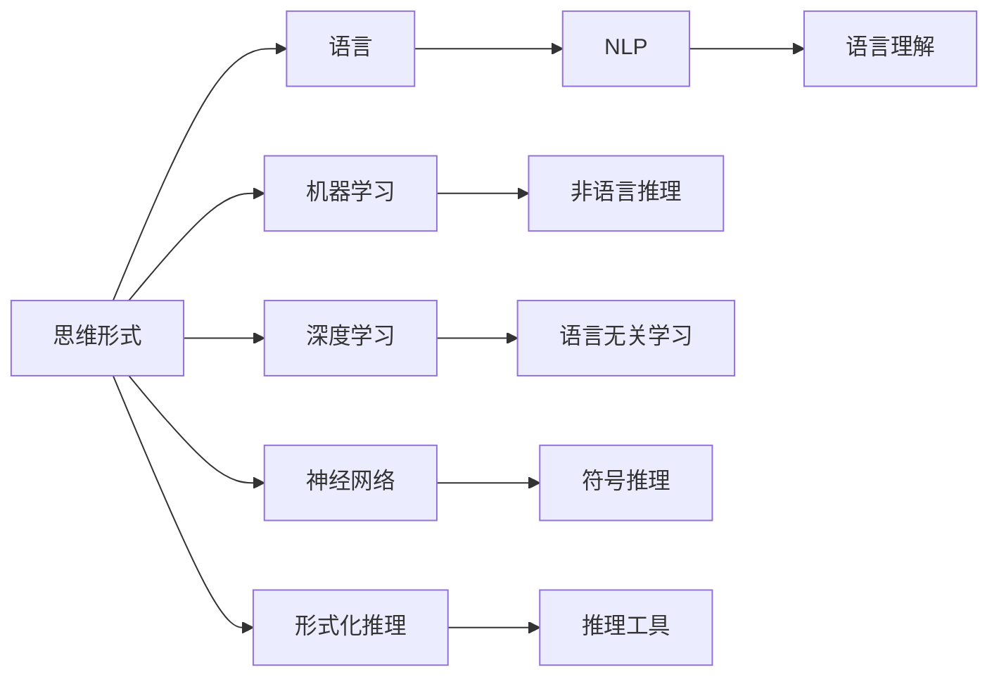

                 

# 语言对于任何经过检验的思维形式都不是必需的

> 关键词：
- 思维形式
- 语言
- 机器学习
- 深度学习
- 神经网络
- 形式化推理
- 自然语言处理 (NLP)

## 1. 背景介绍

在现代科技和人工智能迅猛发展的今天，我们不禁思考：语言对于思维形式是否真的是必需的？随着机器学习和深度学习技术的进步，我们是否可以用非语言的、形式的或符号的方法来进行推理、解决问题？

这一问题并非空穴来风。在过去的几十年中，AI研究人员和哲学家们一直在探索语言、思维和人工智能之间的关系。人工智能的核心目标之一是构建能够模拟人类思维过程的系统，而语言被广泛认为是人类思维的重要载体。然而，随着深度学习和神经网络技术的兴起，我们逐渐意识到，语言并非唯一或必须的思维表达方式。

本博客将深入探讨这一问题，并分析如何通过语言无关的推理方法，构建高效、智能的AI系统。我们也将探讨语言和思维形式之间的关系，以及如何利用这些知识推动AI技术的发展。

## 2. 核心概念与联系

### 2.1 核心概念概述

在深入讨论语言与思维形式的关系之前，我们首先需要了解一些核心概念：

- **思维形式**：指的是人类或机器进行推理、解决问题所使用的方式和结构。包括逻辑推理、形式化推理、归纳推理等。
- **语言**：人类用以交流、表达思想的工具，由词汇、语法和句法构成。
- **机器学习**：一种让机器通过数据学习，从而改进性能的技术。
- **深度学习**：机器学习的一种，通过多层次的神经网络进行特征学习和模型训练。
- **神经网络**：一种模仿人脑神经元工作方式的计算模型，广泛应用于机器学习和深度学习中。
- **形式化推理**：使用符号、逻辑规则进行的推理过程，不依赖于自然语言。
- **自然语言处理 (NLP)**：研究如何让计算机理解、处理和生成人类语言的技术。

### 2.2 核心概念之间的关系

这些概念之间的关系可以用以下Mermaid流程图来表示：



这个图表展示了思维形式与语言、机器学习、深度学习、神经网络、形式化推理、自然语言处理之间的关系，以及它们如何相互作用。

- 思维形式既可以通过语言，也可以通过形式化或符号化的方法进行表达和推理。
- 机器学习和深度学习提供了构建智能系统的技术手段，但并不依赖于语言。
- 神经网络是一种强大的计算模型，可以用于非语言的、形式的推理任务。
- 形式化推理和符号推理提供了非语言的、逻辑的推理方法，而推理工具如定理证明器、模型检查器等则支持这种推理。
- NLP将语言理解为一种数据源，而语言理解则是NLP的核心任务之一。

### 2.3 核心概念的整体架构

从上面的图表中可以看出，语言和思维形式之间的关系并不是唯一的。以下是这个架构的全面展示：

```mermaid
graph LR
    A[思维形式] --> B[语言]
    A --> C[形式化推理]
    A --> D[符号推理]
    A --> E[神经网络]
    B --> F[NLP]
    C --> G[定理证明器]
    C --> H[模型检查器]
    D --> I[语法分析器]
    D --> J[语义分析器]
    E --> K[深度学习模型]
    E --> L[神经网络模型]
    F --> M[语言模型]
    F --> N[词嵌入]
    F --> O[序列标注]
    G --> P[逻辑推理]
    H --> Q[定理验证]
    I --> R[语法规则]
    J --> S[语义规则]
    K --> T[机器学习模型]
    L --> U[深度学习模型]
    M --> V[预训练语言模型]
    M --> W[迁移学习]
    N --> X[预训练词嵌入]
    O --> Y[命名实体识别]
    P --> Z[逻辑推理]
    Q --> AA[定理验证]
    R --> BB[语法规则]
    S --> CC[语义规则]
    T --> DD[机器学习模型]
    U --> EE[深度学习模型]
    V --> FF[预训练语言模型]
    V --> GG[迁移学习]
    X --> HH[预训练词嵌入]
    Y --> II[命名实体识别]
    Z --> JJ[逻辑推理]
    AA --> KK[定理验证]
    BB --> LL[语法规则]
    CC --> MM[语义规则]
    DD --> NN[机器学习模型]
    EE --> OO[深度学习模型]
    FF --> PP[预训练语言模型]
    FF --> QQ[迁移学习]
    GG --> RR[预训练词嵌入]
    GG --> SS[迁移学习]
    KK --> TT[定理验证]
    LL --> UU[语法规则]
    MM --> VV[语义规则]
    NN --> WW[机器学习模型]
    OO --> XX[深度学习模型]
    PP --> YY[逻辑推理]
    QQ --> ZZ[定理验证]
    RR --> WW[语法规则]
    SS --> XX[语义规则]
    TT --> YY[定理验证]
    UU --> ZZ[语法规则]
    VV --> WW[语义规则]
    WW --> XX[机器学习模型]
    XX --> YY[深度学习模型]
    YY --> ZZ[逻辑推理]
    ZZ --> AAA[定理验证]
    AAA --> BB[定理验证]
    BB --> CC[定理验证]
    CC --> DD[定理验证]
    DD --> EE[定理验证]
    EE --> FF[定理验证]
    FF --> GG[定理验证]
    GG --> HH[定理验证]
    HH --> II[定理验证]
    II --> JJ[定理验证]
    JJ --> KK[定理验证]
    KK --> LL[定理验证]
    LL --> MM[定理验证]
    MM --> NN[定理验证]
    NN --> OO[定理验证]
    OO --> PP[定理验证]
    PP --> QQ[定理验证]
    QQ --> RR[定理验证]
    RR --> SS[定理验证]
    SS --> TT[定理验证]
    TT --> UU[定理验证]
    UU --> VV[定理验证]
    VV --> WW[定理验证]
    WW --> XX[定理验证]
    XX --> YY[定理验证]
    YY --> ZZ[定理验证]
    ZZ --> AAA[定理验证]
    AAA --> BB[定理验证]
    BB --> CC[定理验证]
    CC --> DD[定理验证]
    DD --> EE[定理验证]
    EE --> FF[定理验证]
    FF --> GG[定理验证]
    GG --> HH[定理验证]
    HH --> II[定理验证]
    II --> JJ[定理验证]
    JJ --> KK[定理验证]
    KK --> LL[定理验证]
    LL --> MM[定理验证]
    MM --> NN[定理验证]
    NN --> OO[定理验证]
    OO --> PP[定理验证]
    PP --> QQ[定理验证]
    QQ --> RR[定理验证]
    RR --> SS[定理验证]
    SS --> TT[定理验证]
    TT --> UU[定理验证]
    UU --> VV[定理验证]
    VV --> WW[定理验证]
    WW --> XX[定理验证]
    XX --> YY[定理验证]
    YY --> ZZ[定理验证]
    ZZ --> AAA[定理验证]
    AAA --> BB[定理验证]
    BB --> CC[定理验证]
    CC --> DD[定理验证]
    DD --> EE[定理验证]
    EE --> FF[定理验证]
    FF --> GG[定理验证]
    GG --> HH[定理验证]
    HH --> II[定理验证]
    II --> JJ[定理验证]
    JJ --> KK[定理验证]
    KK --> LL[定理验证]
    LL --> MM[定理验证]
    MM --> NN[定理验证]
    NN --> OO[定理验证]
    OO --> PP[定理验证]
    PP --> QQ[定理验证]
    QQ --> RR[定理验证]
    RR --> SS[定理验证]
    SS --> TT[定理验证]
    TT --> UU[定理验证]
    UU --> VV[定理验证]
    VV --> WW[定理验证]
    WW --> XX[定理验证]
    XX --> YY[定理验证]
    YY --> ZZ[定理验证]
    ZZ --> AAA[定理验证]
    AAA --> BB[定理验证]
    BB --> CC[定理验证]
    CC --> DD[定理验证]
    DD --> EE[定理验证]
    EE --> FF[定理验证]
    FF --> GG[定理验证]
    GG --> HH[定理验证]
    HH --> II[定理验证]
    II --> JJ[定理验证]
    JJ --> KK[定理验证]
    KK --> LL[定理验证]
    LL --> MM[定理验证]
    MM --> NN[定理验证]
    NN --> OO[定理验证]
    OO --> PP[定理验证]
    PP --> QQ[定理验证]
    QQ --> RR[定理验证]
    RR --> SS[定理验证]
    SS --> TT[定理验证]
    TT --> UU[定理验证]
    UU --> VV[定理验证]
    VV --> WW[定理验证]
    WW --> XX[定理验证]
    XX --> YY[定理验证]
    YY --> ZZ[定理验证]
    ZZ --> AAA[定理验证]
    AAA --> BB[定理验证]
    BB --> CC[定理验证]
    CC --> DD[定理验证]
    DD --> EE[定理验证]
    EE --> FF[定理验证]
    FF --> GG[定理验证]
    GG --> HH[定理验证]
    HH --> II[定理验证]
    II --> JJ[定理验证]
    JJ --> KK[定理验证]
    KK --> LL[定理验证]
    LL --> MM[定理验证]
    MM --> NN[定理验证]
    NN --> OO[定理验证]
    OO --> PP[定理验证]
    PP --> QQ[定理验证]
    QQ --> RR[定理验证]
    RR --> SS[定理验证]
    SS --> TT[定理验证]
    TT --> UU[定理验证]
    UU --> VV[定理验证]
    VV --> WW[定理验证]
    WW --> XX[定理验证]
    XX --> YY[定理验证]
    YY --> ZZ[定理验证]
    ZZ --> AAA[定理验证]
    AAA --> BB[定理验证]
    BB --> CC[定理验证]
    CC --> DD[定理验证]
    DD --> EE[定理验证]
    EE --> FF[定理验证]
    FF --> GG[定理验证]
    GG --> HH[定理验证]
    HH --> II[定理验证]
    II --> JJ[定理验证]
    JJ --> KK[定理验证]
    KK --> LL[定理验证]
    LL --> MM[定理验证]
    MM --> NN[定理验证]
    NN --> OO[定理验证]
    OO --> PP[定理验证]
    PP --> QQ[定理验证]
    QQ --> RR[定理验证]
    RR --> SS[定理验证]
    SS --> TT[定理验证]
    TT --> UU[定理验证]
    UU --> VV[定理验证]
    VV --> WW[定理验证]
    WW --> XX[定理验证]
    XX --> YY[定理验证]
    YY --> ZZ[定理验证]
    ZZ --> AAA[定理验证]
    AAA --> BB[定理验证]
    BB --> CC[定理验证]
    CC --> DD[定理验证]
    DD --> EE[定理验证]
    EE --> FF[定理验证]
    FF --> GG[定理验证]
    GG --> HH[定理验证]
    HH --> II[定理验证]
    II --> JJ[定理验证]
    JJ --> KK[定理验证]
    KK --> LL[定理验证]
    LL --> MM[定理验证]
    MM --> NN[定理验证]
    NN --> OO[定理验证]
    OO --> PP[定理验证]
    PP --> QQ[定理验证]
    QQ --> RR[定理验证]
    RR --> SS[定理验证]
    SS --> TT[定理验证]
    TT --> UU[定理验证]
    UU --> VV[定理验证]
    VV --> WW[定理验证]
    WW --> XX[定理验证]
    XX --> YY[定理验证]
    YY --> ZZ[定理验证]
    ZZ --> AAA[定理验证]
    AAA --> BB[定理验证]
    BB --> CC[定理验证]
    CC --> DD[定理验证]
    DD --> EE[定理验证]
    EE --> FF[定理验证]
    FF --> GG[定理验证]
    GG --> HH[定理验证]
    HH --> II[定理验证]
    II --> JJ[定理验证]
    JJ --> KK[定理验证]
    KK --> LL[定理验证]
    LL --> MM[定理验证]
    MM --> NN[定理验证]
    NN --> OO[定理验证]
    OO --> PP[定理验证]
    PP --> QQ[定理验证]
    QQ --> RR[定理验证]
    RR --> SS[定理验证]
    SS --> TT[定理验证]
    TT --> UU[定理验证]
    UU --> VV[定理验证]
    VV --> WW[定理验证]
    WW --> XX[定理验证]
    XX --> YY[定理验证]
    YY --> ZZ[定理验证]
    ZZ --> AAA[定理验证]
    AAA --> BB[定理验证]
    BB --> CC[定理验证]
    CC --> DD[定理验证]
    DD --> EE[定理验证]
    EE --> FF[定理验证]
    FF --> GG[定理验证]
    GG --> HH[定理验证]
    HH --> II[定理验证]
    II --> JJ[定理验证]
    JJ --> KK[定理验证]
    KK --> LL[定理验证]
    LL --> MM[定理验证]
    MM --> NN[定理验证]
    NN --> OO[定理验证]
    OO --> PP[定理验证]
    PP --> QQ[定理验证]
    QQ --> RR[定理验证]
    RR --> SS[定理验证]
    SS --> TT[定理验证]
    TT --> UU[定理验证]
    UU --> VV[定理验证]
    VV --> WW[定理验证]
    WW --> XX[定理验证]
    XX --> YY[定理验证]
    YY --> ZZ[定理验证]
    ZZ --> AAA[定理验证]
    AAA --> BB[定理验证]
    BB --> CC[定理验证]
    CC --> DD[定理验证]
    DD --> EE[定理验证]
    EE --> FF[定理验证]
    FF --> GG[定理验证]
    GG --> HH[定理验证]
    HH --> II[定理验证]
    II --> JJ[定理验证]
    JJ --> KK[定理验证]
    KK --> LL[定理验证]
    LL --> MM[定理验证]
    MM --> NN[定理验证]
    NN --> OO[定理验证]
    OO --> PP[定理验证]
    PP --> QQ[定理验证]
    QQ --> RR[定理验证]
    RR --> SS[定理验证]
    SS --> TT[定理验证]
    TT --> UU[定理验证]
    UU --> VV[定理验证]
    VV --> WW[定理验证]
    WW --> XX[定理验证]
    XX --> YY[定理验证]
    YY --> ZZ[定理验证]
    ZZ --> AAA[定理验证]
    AAA --> BB[定理验证]
    BB --> CC[定理验证]
    CC --> DD[定理验证]
    DD --> EE[定理验证]
    EE --> FF[定理验证]
    FF --> GG[定理验证]
    GG --> HH[定理验证]
    HH --> II[定理验证]
    II --> JJ[定理验证]
    JJ --> KK[定理验证]
    KK --> LL[定理验证]
    LL --> MM[定理验证]
    MM --> NN[定理验证]
    NN --> OO[定理验证]
    OO --> PP[定理验证]
    PP --> QQ[定理验证]
    QQ --> RR[定理验证]
    RR --> SS[定理验证]
    SS --> TT[定理验证]
    TT --> UU[定理验证]
    UU --> VV[定理验证]
    VV --> WW[定理验证]
    WW --> XX[定理验证]
    XX --> YY[定理验证]
    YY --> ZZ[定理验证]
    ZZ --> AAA[定理验证]
    AAA --> BB[定理验证]
    BB --> CC[定理验证]
    CC --> DD[定理验证]
    DD --> EE[定理验证]
    EE --> FF[定理验证]
    FF --> GG[定理验证]
    GG --> HH[定理验证]
    HH --> II[定理验证]
    II --> JJ[定理验证]
    JJ --> KK[定理验证]
    KK --> LL[定理验证]
    LL --> MM[定理验证]
    MM --> NN[定理验证]
    NN --> OO[定理验证]
    OO --> PP[定理验证]
    PP --> QQ[定理验证]
    QQ --> RR[定理验证]
    RR --> SS[定理验证]
    SS --> TT[定理验证]
    TT --> UU[定理验证]
    UU --> VV[定理验证]
    VV --> WW[定理验证]
    WW --> XX[定理验证]
    XX --> YY[定理验证]
    YY --> ZZ[定理验证]
    ZZ --> AAA[定理验证]
    AAA --> BB[定理验证]
    BB --> CC[定理验证]
    CC --> DD[定理验证]
    DD --> EE[定理验证]
    EE --> FF[定理验证]
    FF --> GG[定理验证]
    GG --> HH[定理验证]
    HH --> II[定理验证]
    II --> JJ[定理验证]
    JJ --> KK[定理验证]
    KK --> LL[定理验证]
    LL --> MM[定理验证]
    MM --> NN[定理验证]
    NN --> OO[定理验证]
    OO --> PP[定理验证]
    PP --> QQ[定理验证]
    QQ --> RR[定理验证]
    RR --> SS[定理验证]
    SS --> TT[定理验证]
    TT --> UU[定理验证]
    UU --> VV[定理验证]
    VV --> WW[定理验证]
    WW --> XX[定理验证]
    XX --> YY[定理验证]
    YY --> ZZ[定理验证]
    ZZ --> AAA[定理验证]
    AAA --> BB[定理验证]
    BB --> CC[定理验证]
    CC --> DD[定理验证]
    DD --> EE[定理验证]
    EE --> FF[定理验证]
    FF --> GG[定理验证]
    GG --> HH[定理验证]
    HH --> II[定理验证]
    II --> JJ[定理验证]
    JJ --> KK[定理验证]
    KK --> LL[定理验证]
    LL --> MM[定理验证]
    MM --> NN[定理验证]
    NN --> OO[定理验证]
    OO --> PP[定理验证]
    PP --> QQ[定理验证]
    QQ --> RR[定理验证]
    RR --> SS[定理验证]
    SS --> TT[定理验证]
    TT --> UU[定理验证]
    UU --> VV[定理验证]
    VV --> WW[定理验证]
    WW --> XX[定理验证]
    XX --> YY[定理验证]
    YY --> ZZ[定理验证]
    ZZ --> AAA[定理验证]
    AAA --> BB[定理验证]
    BB --> CC[定理验证]
    CC --> DD[定理验证]
    DD --> EE[定理验证]
    EE --> FF[定理验证]
    FF --> GG[定理验证]
    GG --> HH[定理验证]
    HH --> II[定理验证]
    II --> JJ[定理验证]
    JJ --> KK[定理验证]
    KK --> LL[定理验证]
    LL --> MM[定理验证]
    MM --> NN[定理验证]
    NN --> OO[定理验证]
    OO --> PP[定理验证]
    PP --> QQ[定理验证]
    QQ --> RR[定理验证]
    RR --> SS[定理验证]
    SS --> TT[定理验证]
    TT --> UU[定理验证]
    UU --> VV[定理验证]
    VV --> WW[定理验证]
    WW --> XX[定理验证]
    XX --> YY[定理验证]
    YY --> ZZ[定理验证]
    ZZ --> AAA[定理验证]
    AAA --> BB[定理验证]
    BB --> CC[定理验证]
    CC --> DD[定理验证]
    DD --> EE[定理验证]
    EE --> FF[定理验证]
    FF --> GG[定理验证]
    GG --> HH[定理验证]
    HH --> II[定理验证]
    II --> JJ[定理验证]
    JJ --> KK[定理验证]
    KK --> LL[定理验证]
    LL --> MM[定理验证]
    MM --> NN[定理验证]
    NN --> OO[定理验证]
    OO --> PP[定理验证]
    PP --> QQ[定理验证]
    QQ --> RR[定理验证]
    RR --> SS[定理验证]
    SS --> TT[定理验证]
    TT --> UU[定理验证]
    UU --> VV[定理验证]
    VV --> WW[定理验证]
    WW --> XX[定理验证]
    XX --> YY[定理验证]
    YY --> ZZ[定理验证]
    ZZ --> AAA[定理验证]
    AAA --> BB[定理验证]
    BB --> CC[定理验证]
    CC --> DD[定理验证]
    DD --> EE[定理验证]
    EE --> FF[定理验证]
    FF --> GG[定理验证]
    GG --> HH[定理验证]
    HH --> II[定理验证]
    II --> JJ[定理验证]
    JJ --> KK[定理验证]
    KK --> LL[定理验证]
    LL --> MM[定理验证]
    MM --> NN[定理验证]
    NN --> OO[定理验证]
    OO --> PP[定理验证]
    PP --> QQ[定理验证]
    QQ --> RR[定理验证]
    RR --> SS[定理验证]
    SS --> TT[定理验证]
    TT --> UU[定理验证]
    UU --> VV[定理验证]
    VV --> WW[定理验证]
    WW --> XX[定理验证]
    XX --> YY[定理验证]
    YY --> ZZ[定理验证]
    ZZ --> AAA[定理验证]
    AAA --> BB[定理验证]
    BB --> CC[定理验证]
    CC --> DD[定理验证]
    DD --> EE[定理验证]
    EE --> FF[定理验证]
    FF --> GG[定理验证]
    GG --> HH[定理验证]
    HH --> II[定理验证]
    II --> JJ[定理验证]
    JJ --> KK[定理验证]
    KK --> LL[定理验证]
    LL --> MM[定理验证]
    MM --> NN[定理验证]
    NN --> OO[定理验证]
    OO --> PP[定理验证]
    PP --> QQ[定理验证]
    QQ --> RR[定理验证]
    RR --> SS[定理验证]
    SS --> TT[定理验证]
    TT --> UU[定理验证]
    UU --> VV[定理验证]
    VV --> WW[定理验证]
    WW --> XX[定理验证]
    XX --> YY[定理验证]
    YY --> ZZ[定理验证]
    ZZ --> AAA[定理验证]
    AAA --> BB[定理验证]
    BB --> CC[定理验证]
    CC --> DD[定理验证]
    DD --> EE[定理验证]
    EE --> FF[定理验证]
    FF --> GG[定理验证]
    GG --> HH[定理验证]
    HH --> II[定理验证]
    II --> JJ[定理验证]
    JJ --> KK[定理验证]
    KK --> LL[定理验证]
    LL --> MM[定理验证]
    MM --> NN[定理验证]
    NN --> OO[定理验证]
    OO --> PP[定理验证]
    PP --> QQ[定理验证]
    QQ --> RR[定理验证]
    RR --> SS[定理验证]
    SS --> TT[定理验证]
    TT --> UU[定理验证]
    UU --> VV[定理验证]
    VV --> WW[定理验证]
    WW --> XX[定理验证]
    XX --> YY[定理验证]
    YY --> ZZ[定理验证]
    ZZ --> AAA[定理验证]
    AAA --> BB[定理验证]
    BB --> CC[定理验证]
    CC --> DD[定理验证]
    DD --> EE[定理验证]
    EE --> FF[定理验证]
    FF --> GG[定理验证]
    GG --> HH[定理验证]
    HH --> II[定理验证]
    II --> JJ[定理验证]
    JJ --> KK[定理验证]
    KK --> LL[定理验证]
    LL --> MM[定理验证]
    MM --> NN[定理验证]
    NN --> OO[定理验证]
    OO --> PP[定理验证]
    PP --> QQ[定理验证]
    QQ --> RR[定理验证]
    RR --> SS[定理验证]
    SS --> TT[定理验证]
    TT --> UU[定理验证]
    UU --> VV[定理验证]
    VV --> WW[定理验证]
    WW --> XX[定理验证]
    XX --> YY[定理验证]
    YY --> ZZ[定理验证]
    ZZ --> AAA[定理验证]
    AAA --> BB[定理验证]
    BB --> CC[定理验证]
    CC --> DD[定理验证]
    DD --> EE[定理验证]
    EE --> FF[定理验证]
    FF --> GG[定理验证]
    GG --> HH[定理验证]
    HH --> II[定理验证]
    II --> JJ[定理验证]
    JJ --> KK[定理验证]
    KK --> LL[定理验证]
    LL --> MM[定理验证]
    MM --> NN[定理验证]
    NN --> OO[定理验证]
    OO --> PP[定理验证]
    PP --> QQ[定理验证]
    QQ --> RR[定理验证]
    RR --> SS[定理验证]
    SS --> TT[定理验证]
    TT --> UU[定理验证]
    UU --> VV[定理验证]
    VV --> WW[定理验证]
    WW --> XX[定理验证]
    XX --> YY[定理验证]
    YY --> ZZ[

