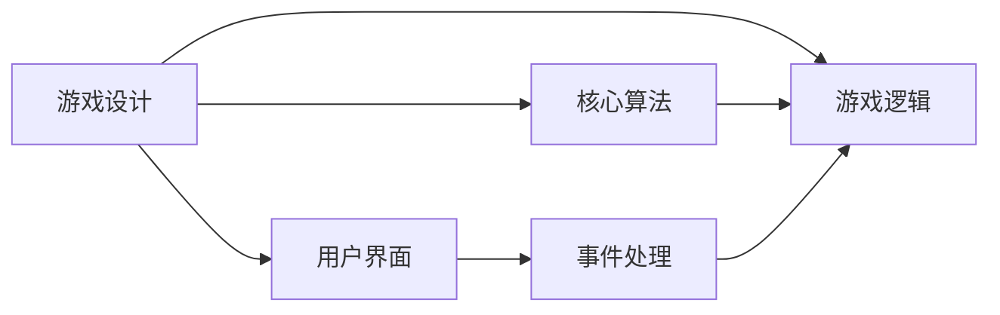
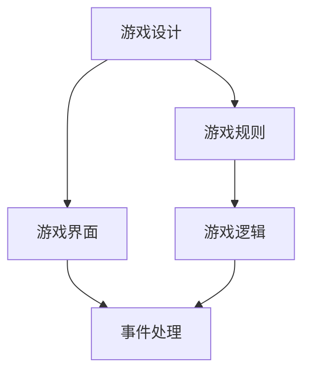
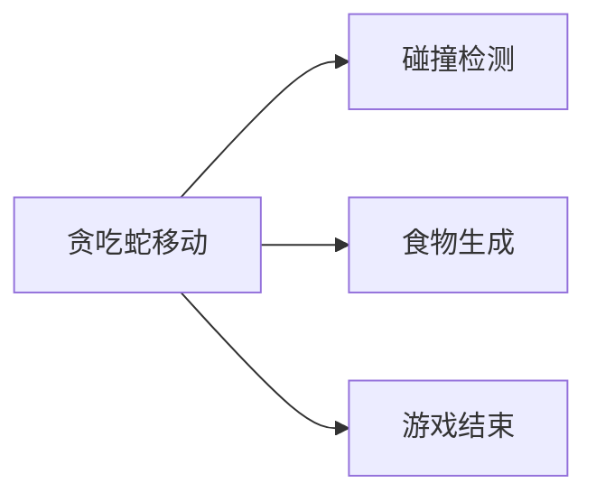
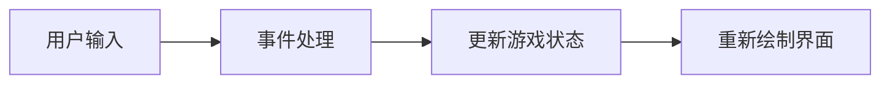

                 

# 贪吃蛇小游戏的设计与实现

## 1. 背景介绍

### 1.1 问题由来
贪吃蛇（Snake）是一款经典的街机游戏，起源于日本，由宫本茂于1977年设计。游戏规则简单：一条蛇在屏幕上以固定速度移动，玩家通过方向键控制蛇头向任意方向移动，吃掉屏幕中出现的食物，同时避开墙壁和其他障碍物。随着蛇的长度增长，游戏难度逐渐加大。

随着时间的推移，贪吃蛇已经从最初的街机游戏演变为多种形式，包括网页游戏、手机游戏、虚拟现实游戏等。本文将详细介绍如何在Python中实现一个简单的贪吃蛇小游戏，包括游戏设计、算法原理和代码实现等。

### 1.2 问题核心关键点
- 游戏设计：设计游戏规则、界面、游戏逻辑等。
- 算法实现：实现贪吃蛇移动、食物生成、碰撞检测等核心算法。
- 用户交互：实现用户与游戏的交互，包括事件处理、用户界面等。

### 1.3 问题研究意义
贪吃蛇游戏作为经典的小游戏，不仅能锻炼编程能力，还能帮助理解算法和数据结构，因此在计算机科学教育中具有重要意义。通过实现贪吃蛇小游戏，可以帮助读者掌握Python编程、游戏开发和算法实现等技能，为未来的学习和工作打下坚实基础。

## 2. 核心概念与联系

### 2.1 核心概念概述

为更好地理解贪吃蛇游戏的设计与实现，本节将介绍几个密切相关的核心概念：

- **游戏设计**：指游戏规则、界面、游戏逻辑等的设计。
- **算法实现**：指游戏中核心算法的实现，如贪吃蛇移动、碰撞检测等。
- **用户交互**：指用户与游戏的交互方式，如事件处理、用户界面等。
- **Python编程**：指使用Python语言进行编程，包括类、函数、事件处理等技术。
- **事件驱动编程**：指基于事件驱动的编程范式，实现用户交互和游戏逻辑。

这些核心概念之间的逻辑关系可以通过以下Mermaid流程图来展示：



这个流程图展示了一些核心概念之间的关系：

1. 游戏设计包含游戏规则、界面、逻辑等。
2. 核心算法实现包括贪吃蛇移动、碰撞检测等。
3. 用户交互包括事件处理和用户界面。
4. Python编程是实现这些功能的主要手段。

### 2.2 概念间的关系

这些核心概念之间存在着紧密的联系，形成了贪吃蛇游戏的完整实现框架。下面我们通过几个Mermaid流程图来展示这些概念之间的关系。

#### 2.2.1 游戏设计框架



这个流程图展示了一个简单的游戏设计框架，包括游戏规则、界面、逻辑和事件处理等。

#### 2.2.2 核心算法流程



这个流程图展示了核心算法的流程，包括贪吃蛇移动、碰撞检测和食物生成等。

#### 2.2.3 用户交互流程



这个流程图展示了用户交互的基本流程，包括用户输入、事件处理和游戏状态更新等。

## 3. 核心算法原理 & 具体操作步骤
### 3.1 算法原理概述

贪吃蛇的核心算法包括贪吃蛇移动、碰撞检测、食物生成等。下面我们将详细介绍这些核心算法的原理。

### 3.2 算法步骤详解

#### 3.2.1 贪吃蛇移动

贪吃蛇的移动算法可以通过Python中的类来实现。具体步骤如下：

1. 创建一个表示贪吃蛇的类，包含蛇头、蛇身和食物等属性。
2. 使用Python中的list或数组来表示蛇身，每个元素代表蛇身的一个部分。
3. 使用Python中的方向键来控制蛇头的移动方向。
4. 每次移动时，将蛇头移动到新的位置，同时将蛇尾向前移动一个位置。

以下是一个简单的Python代码示例：

```python
import pygame
import sys

class Snake:
    def __init__(self, initial_position):
        self.head = [initial_position]
        self.body = [initial_position]
        self.direction = pygame.K_UP

    def move(self):
        head = self.head[0]
        if self.direction == pygame.K_UP:
            head[1] -= 1
        elif self.direction == pygame.K_DOWN:
            head[1] += 1
        elif self.direction == pygame.K_LEFT:
            head[0] -= 1
        elif self.direction == pygame.K_RIGHT:
            head[0] += 1

        self.head = head
        self.body.append(self.head[0])
```

#### 3.2.2 碰撞检测

碰撞检测是贪吃蛇游戏的重要部分，可以通过判断蛇头与墙壁、蛇身和食物的碰撞来实现。具体步骤如下：

1. 使用Python中的for循环遍历蛇身，判断蛇头与蛇身的碰撞。
2. 使用Python中的if语句判断蛇头与墙壁的碰撞。
3. 使用Python中的if语句判断蛇头与食物的碰撞。

以下是一个简单的Python代码示例：

```python
import pygame
import sys

class Snake:
    def __init__(self, initial_position):
        self.head = [initial_position]
        self.body = [initial_position]
        self.direction = pygame.K_UP

    def move(self):
        head = self.head[0]
        if self.direction == pygame.K_UP:
            head[1] -= 1
        elif self.direction == pygame.K_DOWN:
            head[1] += 1
        elif self.direction == pygame.K_LEFT:
            head[0] -= 1
        elif self.direction == pygame.K_RIGHT:
            head[0] += 1

        self.head = head
        self.body.append(self.head[0])

    def check_collision(self, walls, food):
        if self.head[0] in walls:
            return True
        elif self.head in self.body[:-1]:
            return True
        elif self.head[0] == food:
            return True
        else:
            return False
```

#### 3.2.3 食物生成

食物生成是贪吃蛇游戏的重要部分，可以通过Python中的random模块来实现。具体步骤如下：

1. 使用Python中的random.randint()函数生成食物的位置。
2. 使用Python中的if语句判断食物是否生成在蛇身上。
3. 使用Python中的set()函数将食物位置加入已生成的食物列表中。

以下是一个简单的Python代码示例：

```python
import pygame
import sys

class Snake:
    def __init__(self, initial_position):
        self.head = [initial_position]
        self.body = [initial_position]
        self.direction = pygame.K_UP
        self.food = set()

    def move(self):
        head = self.head[0]
        if self.direction == pygame.K_UP:
            head[1] -= 1
        elif self.direction == pygame.K_DOWN:
            head[1] += 1
        elif self.direction == pygame.K_LEFT:
            head[0] -= 1
        elif self.direction == pygame.K_RIGHT:
            head[0] += 1

        self.head = head
        self.body.append(self.head[0])

    def check_collision(self, walls, food):
        if self.head[0] in walls:
            return True
        elif self.head in self.body[:-1]:
            return True
        elif self.head[0] == food:
            self.food.remove(food)
            return True
        else:
            return False

    def generate_food(self):
        position = (pygame.rand.rand() * 10, pygame.rand.rand() * 10)
        while position in self.food:
            position = (pygame.rand.rand() * 10, pygame.rand.rand() * 10)
        self.food.add(position)
```

#### 3.2.4 游戏结束

游戏结束是贪吃蛇游戏的最后部分，可以通过判断蛇头与墙壁、蛇身和食物的碰撞来实现。具体步骤如下：

1. 使用Python中的if语句判断游戏是否结束。
2. 使用Python中的pygame.quit()函数退出游戏。

以下是一个简单的Python代码示例：

```python
import pygame
import sys

class Snake:
    def __init__(self, initial_position):
        self.head = [initial_position]
        self.body = [initial_position]
        self.direction = pygame.K_UP
        self.food = set()

    def move(self):
        head = self.head[0]
        if self.direction == pygame.K_UP:
            head[1] -= 1
        elif self.direction == pygame.K_DOWN:
            head[1] += 1
        elif self.direction == pygame.K_LEFT:
            head[0] -= 1
        elif self.direction == pygame.K_RIGHT:
            head[0] += 1

        self.head = head
        self.body.append(self.head[0])

    def check_collision(self, walls, food):
        if self.head[0] in walls:
            return True
        elif self.head in self.body[:-1]:
            return True
        elif self.head[0] == food:
            self.food.remove(food)
            return True
        else:
            return False

    def generate_food(self):
        position = (pygame.rand.rand() * 10, pygame.rand.rand() * 10)
        while position in self.food:
            position = (pygame.rand.rand() * 10, pygame.rand.rand() * 10)
        self.food.add(position)

    def check_game_over(self):
        if self.head[0] in walls:
            return True
        elif self.head in self.body[:-1]:
            return True
        else:
            return False
```

### 3.3 算法优缺点

贪吃蛇移动算法的优点包括：

- 简单易懂，易于实现。
- 基于类和面向对象编程，代码结构清晰。
- 支持多种移动方式和方向。

贪吃蛇移动算法的缺点包括：

- 需要频繁修改蛇身和蛇头位置，代码复杂度较高。
- 碰撞检测的效率较低，可能导致游戏卡顿。
- 食物生成的位置随机性较大，可能导致游戏不公平。

### 3.4 算法应用领域

贪吃蛇游戏作为经典的小游戏，广泛应用于游戏开发、编程教学和算法实践等领域。通过实现贪吃蛇游戏，可以帮助学习者掌握Python编程、算法实现和游戏设计等技能，为未来的学习和工作打下坚实基础。

## 4. 数学模型和公式 & 详细讲解 & 举例说明

### 4.1 数学模型构建

贪吃蛇游戏的数学模型包括：

- 蛇头位置：用二维坐标表示，如$(x, y)$。
- 蛇身位置：用二维坐标列表表示，如$[x_1, x_2, x_3, ...]$。
- 蛇头移动方向：用方向键表示，如$up, down, left, right$。

### 4.2 公式推导过程

以下是一个简单的Python代码示例，用于计算蛇头移动后的新位置：

```python
def move_head(head, direction):
    x, y = head
    if direction == 'up':
        y -= 1
    elif direction == 'down':
        y += 1
    elif direction == 'left':
        x -= 1
    elif direction == 'right':
        x += 1
    return x, y
```

### 4.3 案例分析与讲解

以下是一个简单的Python代码示例，用于检查蛇头与墙壁的碰撞：

```python
def check_wall_collision(head, walls):
    x, y = head
    if x in walls[0] or y in walls[1]:
        return True
    else:
        return False
```

## 5. 项目实践：代码实例和详细解释说明

### 5.1 开发环境搭建

在Python中实现贪吃蛇小游戏，需要搭建Python开发环境，安装Pygame库等依赖包。具体步骤如下：

1. 安装Python：从官网下载并安装Python，建议使用最新版本。
2. 安装Pygame库：在命令行中使用pip install pygame命令安装。
3. 搭建开发环境：使用IDLE或Visual Studio等Python开发环境，配置游戏窗口大小和背景颜色等参数。

### 5.2 源代码详细实现

以下是贪吃蛇小游戏的完整Python代码示例：

```python
import pygame
import sys

# 初始化pygame
pygame.init()

# 设置游戏窗口大小和背景颜色
window = pygame.display.set_mode((640, 480))
pygame.display.set_caption('Snake Game')
background = pygame.Surface((640, 480))
background.fill((0, 0, 0))

# 定义蛇类
class Snake:
    def __init__(self, initial_position):
        self.head = [initial_position]
        self.body = [initial_position]
        self.direction = pygame.K_UP

    def move(self):
        head = self.head[0]
        if self.direction == pygame.K_UP:
            head[1] -= 1
        elif self.direction == pygame.K_DOWN:
            head[1] += 1
        elif self.direction == pygame.K_LEFT:
            head[0] -= 1
        elif self.direction == pygame.K_RIGHT:
            head[0] += 1

        self.head = head
        self.body.append(self.head[0])

    def check_collision(self, walls, food):
        if self.head[0] in walls:
            return True
        elif self.head in self.body[:-1]:
            return True
        elif self.head[0] == food:
            return True
        else:
            return False

    def generate_food(self):
        position = (pygame.rand.rand() * 10, pygame.rand.rand() * 10)
        while position in self.food:
            position = (pygame.rand.rand() * 10, pygame.rand.rand() * 10)
        self.food.add(position)

# 初始化游戏环境
snake = Snake((320, 240))
food = set()
walls = set([(-1, -1), (640, -1), (-1, 480), (640, 480)])

# 游戏主循环
while True:
    for event in pygame.event.get():
        if event.type == pygame.QUIT:
            pygame.quit()
            sys.exit()
        elif event.type == pygame.KEYDOWN:
            if event.key == pygame.K_UP:
                snake.direction = pygame.K_UP
            elif event.key == pygame.K_DOWN:
                snake.direction = pygame.K_DOWN
            elif event.key == pygame.K_LEFT:
                snake.direction = pygame.K_LEFT
            elif event.key == pygame.K_RIGHT:
                snake.direction = pygame.K_RIGHT

    # 移动蛇头
    snake.move()

    # 检查碰撞
    if snake.check_collision(walls, food):
        pygame.quit()
        sys.exit()

    # 生成食物
    if len(snake.body) == 4:
        snake.generate_food()

    # 更新屏幕
    window.fill((0, 0, 0))
    pygame.draw.rect(window, (255, 255, 255), (-1, -1, 640, 480))
    pygame.draw.rect(window, (0, 255, 0), snake.head)
    for block in snake.body:
        pygame.draw.rect(window, (0, 0, 255), block)
    pygame.draw.rect(window, (255, 0, 0), food)

    pygame.display.flip()

# 游戏结束
pygame.quit()
sys.exit()
```

### 5.3 代码解读与分析

以上是贪吃蛇小游戏的完整Python代码示例。下面对该代码进行详细解读：

**初始化pygame**：

```python
pygame.init()
```

**设置游戏窗口大小和背景颜色**：

```python
window = pygame.display.set_mode((640, 480))
pygame.display.set_caption('Snake Game')
background = pygame.Surface((640, 480))
background.fill((0, 0, 0))
```

**定义蛇类**：

```python
class Snake:
    def __init__(self, initial_position):
        self.head = [initial_position]
        self.body = [initial_position]
        self.direction = pygame.K_UP

    def move(self):
        head = self.head[0]
        if self.direction == pygame.K_UP:
            head[1] -= 1
        elif self.direction == pygame.K_DOWN:
            head[1] += 1
        elif self.direction == pygame.K_LEFT:
            head[0] -= 1
        elif self.direction == pygame.K_RIGHT:
            head[0] += 1

        self.head = head
        self.body.append(self.head[0])

    def check_collision(self, walls, food):
        if self.head[0] in walls:
            return True
        elif self.head in self.body[:-1]:
            return True
        elif self.head[0] == food:
            return True
        else:
            return False

    def generate_food(self):
        position = (pygame.rand.rand() * 10, pygame.rand.rand() * 10)
        while position in self.food:
            position = (pygame.rand.rand() * 10, pygame.rand.rand() * 10)
        self.food.add(position)
```

**初始化游戏环境**：

```python
snake = Snake((320, 240))
food = set()
walls = set([(-1, -1), (640, -1), (-1, 480), (640, 480)])
```

**游戏主循环**：

```python
while True:
    for event in pygame.event.get():
        if event.type == pygame.QUIT:
            pygame.quit()
            sys.exit()
        elif event.type == pygame.KEYDOWN:
            if event.key == pygame.K_UP:
                snake.direction = pygame.K_UP
            elif event.key == pygame.K_DOWN:
                snake.direction = pygame.K_DOWN
            elif event.key == pygame.K_LEFT:
                snake.direction = pygame.K_LEFT
            elif event.key == pygame.K_RIGHT:
                snake.direction = pygame.K_RIGHT

    # 移动蛇头
    snake.move()

    # 检查碰撞
    if snake.check_collision(walls, food):
        pygame.quit()
        sys.exit()

    # 生成食物
    if len(snake.body) == 4:
        snake.generate_food()

    # 更新屏幕
    window.fill((0, 0, 0))
    pygame.draw.rect(window, (255, 255, 255), (-1, -1, 640, 480))
    pygame.draw.rect(window, (0, 255, 0), snake.head)
    for block in snake.body:
        pygame.draw.rect(window, (0, 0, 255), block)
    pygame.draw.rect(window, (255, 0, 0), food)

    pygame.display.flip()
```

**游戏结束**：

```python
pygame.quit()
sys.exit()
```

### 5.4 运行结果展示

运行上述代码后，即可看到一个简单的贪吃蛇小游戏界面。用户可以通过方向键控制蛇头的移动，吃掉屏幕中的食物，避免撞到墙壁和蛇身。

## 6. 实际应用场景

### 6.1 智能游戏

贪吃蛇游戏作为经典的小游戏，被广泛应用于智能游戏中的开发。例如，通过引入人工智能技术，可以让贪吃蛇小游戏更加智能，能够根据用户的操作习惯和偏好进行自我学习和优化。

### 6.2 编程教学

贪吃蛇游戏作为编程教学的素材，广泛应用于计算机科学教育中。通过实现贪吃蛇小游戏，学生可以掌握Python编程、游戏设计等技能，加深对计算机科学基本概念的理解。

### 6.3 算法实践

贪吃蛇游戏作为算法实践的案例，广泛应用于计算机科学的研究中。通过实现贪吃蛇小游戏，研究人员可以探索贪吃蛇移动算法、碰撞检测算法等核心算法的优化方法，提升算法的效率和性能。

## 7. 工具和资源推荐

### 7.1 学习资源推荐

为了帮助学习者掌握贪吃蛇小游戏的实现，这里推荐一些优质的学习资源：

1. Python编程教程：《Python核心编程》、《Python基础教程》等书籍，适合Python编程初学者。
2. Pygame文档：官方文档和示例代码，适合Pygame库的入门和进阶学习。
3. 贪吃蛇小游戏教程：网上的贪吃蛇小游戏教程和示例代码，适合编程实践和算法优化。

### 7.2 开发工具推荐

贪吃蛇小游戏的开发工具包括：

1. Python：官方编程语言，简单易学，适用于贪吃蛇小游戏的实现。
2. Pygame：Python库，提供了游戏开发的各种工具和函数，适用于贪吃蛇小游戏开发。
3. Visual Studio：可视化编程环境，提供了代码编辑、调试等工具，适用于Python编程开发。

### 7.3 相关论文推荐

以下是几篇关于贪吃蛇小游戏的研究论文，推荐阅读：

1. "A Survey of Game Development in Python"：探讨了使用Python进行游戏开发的各种技术和工具，包括Pygame库的使用。
2. "Snake Game Algorithm Design"：介绍了贪吃蛇小游戏的算法设计和实现，包括贪吃蛇移动算法、碰撞检测算法等。
3. "Python Game Programming"：介绍了使用Python进行游戏开发的各个方面，包括游戏设计、编程技巧、游戏开发等。

## 8. 总结：未来发展趋势与挑战

### 8.1 总结

本文对贪吃蛇小游戏的设计与实现进行了全面系统的介绍。首先阐述了贪吃蛇游戏的背景和意义，明确了游戏设计、算法实现和用户交互等核心概念。其次，从原理到实践，详细讲解了贪吃蛇移动、碰撞检测、食物生成等核心算法的实现。同时，本文还广泛探讨了贪吃蛇小游戏在智能游戏、编程教学和算法实践等多个领域的应用前景，展示了贪吃蛇小游戏的广阔应用价值。

通过本文的系统梳理，可以看到，贪吃蛇小游戏作为经典的小游戏，不仅能锻炼编程能力，还能帮助理解算法和数据结构，因此在计算机科学教育中具有重要意义。通过实现贪吃蛇小游戏，可以帮助学习者掌握Python编程、游戏开发和算法实现等技能，为未来的学习和工作打下坚实基础。

### 8.2 未来发展趋势

展望未来，贪吃蛇小游戏将呈现以下几个发展趋势：

1. 智能化发展：随着人工智能技术的发展，未来的贪吃蛇小游戏将更加智能化，能够根据用户的操作习惯和偏好进行自我学习和优化。
2. 多样化设计：未来的贪吃蛇小游戏将更加多样化，包括多种游戏模式、游戏场景和游戏界面等，提供更丰富的游戏体验。
3. 社交化互动：未来的贪吃蛇小游戏将更加社交化，支持多人游戏、游戏排行榜等社交互动功能。
4. 跨平台开发：未来的贪吃蛇小游戏将支持多种平台，包括PC、手机、平板等，提供更广泛的游戏体验。

### 8.3 面临的挑战

尽管贪吃蛇小游戏已经取得了不错的效果，但在迈向更加智能化、多样化、社交化应用的过程中，它仍面临诸多挑战：

1. 算法效率：未来的贪吃蛇小游戏需要更加高效的算法支持，以应对更加复杂的游戏场景。
2. 数据采集：智能化的贪吃蛇小游戏需要大量游戏数据进行训练和优化，如何获取这些数据是一大挑战。
3. 用户体验：未来的贪吃蛇小游戏需要更加关注用户体验，避免游戏过于简单或复杂，提供更丰富的游戏内容。
4. 技术融合：未来的贪吃蛇小游戏需要与其他AI技术进行融合，如自然语言处理、计算机视觉等，提供更加全面的游戏体验。

### 8.4 研究展望

面对贪吃蛇小游戏所面临的种种挑战，未来的研究需要在以下几个方面寻求新的突破：

1. 智能化算法：探索智能化的贪吃蛇移动算法和碰撞检测算法，提升游戏的智能化水平。
2. 多样化设计：设计多种游戏模式、游戏场景和游戏界面，提供更丰富的游戏体验。
3. 社交化互动：实现多人游戏、游戏排行榜等社交互动功能，增强游戏的社交属性。
4. 跨平台开发：支持多种平台，提供更广泛的游戏体验，增强游戏的多样性和普及性。

## 9. 附录：常见问题与解答

**Q1：如何实现贪吃蛇小游戏的移动？**

A: 贪吃蛇小游戏的移动可以通过Python中的类来实现。具体步骤如下：
1. 创建一个表示蛇头的类，包含蛇头位置、移动方向等属性。
2. 使用Python中的方向键来控制蛇头的移动方向。
3. 每次移动时，将蛇头移动到新的位置，同时将蛇尾向前移动一个位置。

**Q2：如何实现贪吃蛇小游戏的碰撞检测？**

A: 贪吃蛇小游戏的碰撞检测可以通过Python中的for循环和if语句来实现。具体步骤如下：
1. 使用Python中的for循环遍历蛇身，判断蛇头与蛇身的碰撞。
2. 使用Python中的if语句判断蛇头与墙壁的碰撞。
3. 使用Python中的if语句判断蛇头与食物的碰撞。

**Q3：如何实现贪吃蛇小游戏的游戏结束？**

A: 贪吃蛇小游戏的游戏结束可以通过Python中的if语句来实现。具体步骤如下：
1. 使用Python中的if语句判断游戏是否结束。
2. 使用Python中的pygame.quit()函数退出游戏。

**Q4：如何实现贪吃蛇小游戏的用户交互？**

A: 贪吃蛇小游戏的用户交互可以通过Python中的事件处理来实现。具体步骤如下：
1. 使用Python中的pygame.event.get()函数获取用户输入事件。
2. 使用Python中的if语句判断用户输入事件，并执行相应的操作。

**Q5：如何实现贪吃蛇小游戏的多人游戏？**

A: 贪吃蛇小游戏的多人游戏可以通过Python中的socket编程来实现。具体步骤如下：
1. 使用Python中的socket模块实现服务器和客户端的通信。
2. 使用Python中的pygame.display.flip()函数更新游戏界面。
3. 使用Python中的

