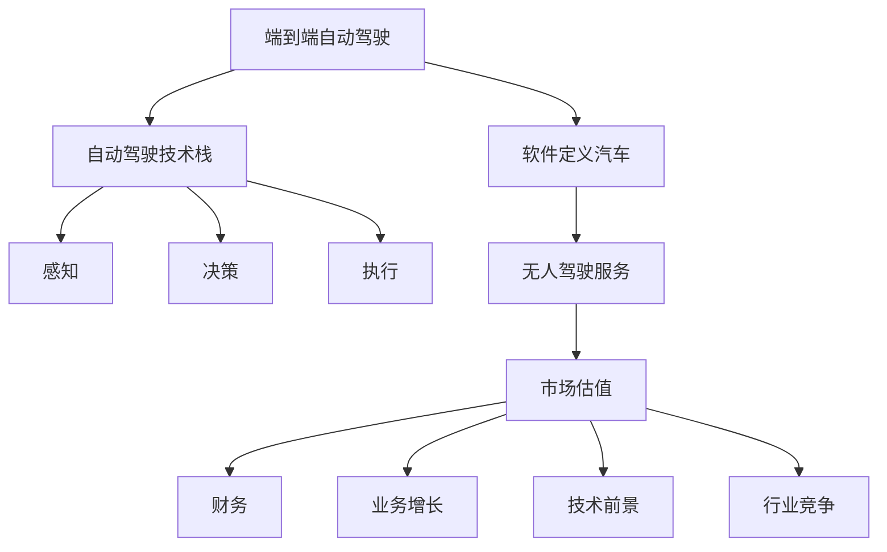
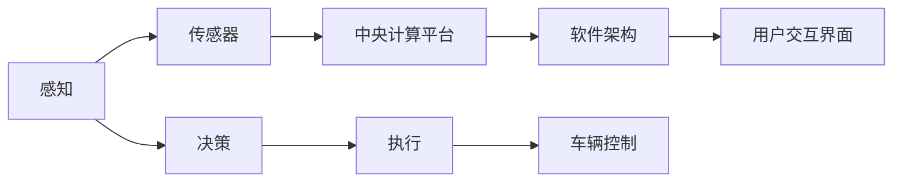
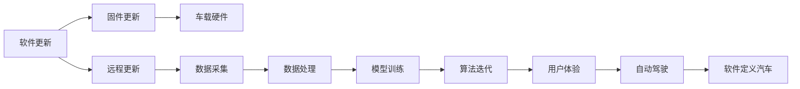
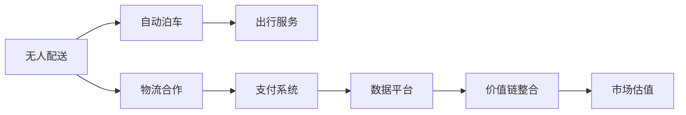
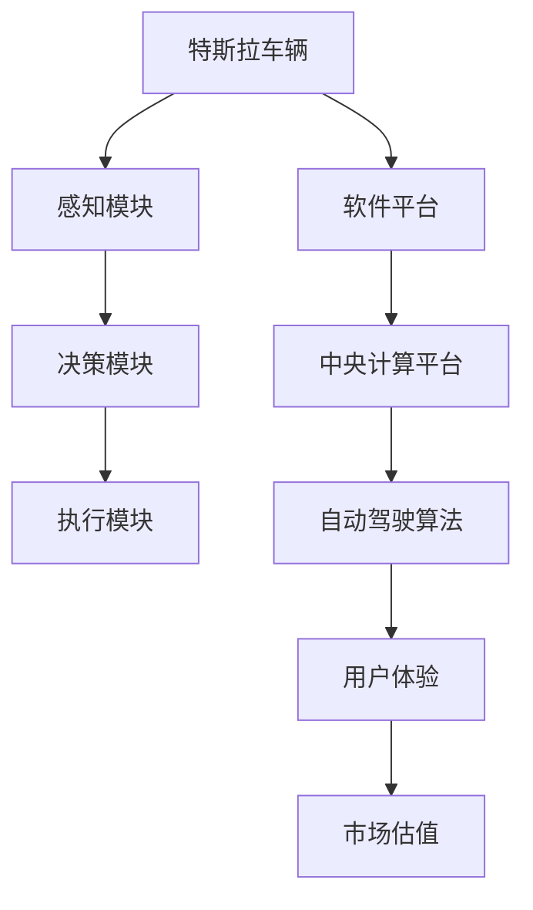

                 

# 资本市场对特斯拉端到端自动驾驶的估值预期

## 1. 背景介绍

随着全球气候变化和环境压力的不断加剧，电动车(EV)行业迎来了蓬勃发展的新时代。特斯拉(Tesla)作为电动车领域的先行者，凭借其在电池技术、自动驾驶等核心技术的突破，迅速在市场上站稳脚跟，并成为全球市值最高的汽车制造商之一。特别是其端到端自动驾驶(End-to-End Autonomous Driving)技术，代表了未来智能出行的方向，吸引了全球资本市场的广泛关注和投资热潮。

### 1.1 背景的详细阐述

特斯拉的端到端自动驾驶系统包括感知、决策和执行三个核心模块，能够在不同驾驶场景下实现从感知输入到车辆控制的全面自主控制。这一技术不仅提升了他公司车辆的智能化水平，也为未来的自动驾驶商业化提供了技术基础。然而，由于涉及复杂的软件和硬件集成，以及高昂的研发和测试成本，端到端自动驾驶技术对特斯拉的市场估值产生了显著影响。

**1.1.1 市场竞争态势**

在自动驾驶领域，特斯拉面临来自其他顶级汽车制造商、科技公司和初创企业的激烈竞争。例如，Waymo、Cruise等传统车企的自动驾驶项目在技术成熟度和市场布局上已经走在前列，而Waymo和Lucid等新兴企业也拥有显著的技术优势和资本支持。特斯拉在这一领域的市场份额和技术实力都面临挑战，但其独特的软硬件整合优势和快速迭代能力，也使得市场对其端到端自动驾驶的估值预期存在较大差异。

**1.1.2 技术成熟度**

尽管特斯拉已经公开了其自动驾驶系统的部分代码和技术细节，但整体技术成熟度和实际落地效果仍存在争议。部分投资者认为，特斯拉的自动驾驶系统在算力、感知、决策等方面存在技术瓶颈，实际应用场景受限，难以满足商业化要求。而另一些投资者则看重特斯拉在软件迭代和用户体验上的优势，认为其技术前景广阔，市场潜力巨大。

**1.1.3 商业模式**

特斯拉的端到端自动驾驶技术不仅仅局限于车辆本身，还涉及到自动驾驶相关服务（如无人配送、自动泊车等）的商业化。未来，这些服务有望成为特斯拉的重要收入来源，进一步提升公司的整体估值。然而，如何平衡车辆销售和自动驾驶服务的价值，也成为市场估值的焦点。

## 2. 核心概念与联系

### 2.1 核心概念概述

为更好地理解特斯拉端到端自动驾驶技术及其市场估值，本节将介绍几个密切相关的核心概念：

- **端到端自动驾驶(End-to-End Autonomous Driving)**：指通过硬件和软件一体化设计，实现车辆的全方位自主控制。包括感知、决策、执行等子系统的集成，能够应对各种复杂的驾驶场景。

- **自动驾驶技术栈**：由感知、决策、执行三大模块组成的技术体系，通过传感器输入数据、中央计算平台处理和车辆控制输出，实现车辆的自主驾驶。

- **软件定义汽车**：强调汽车的核心价值在于软件，通过持续的软件迭代，提升车辆的功能和用户体验。特斯拉的车辆具有强大的软件能力，能够实时更新自动驾驶算法，提升系统性能。

- **无人驾驶服务(autonomous driving services)**：指基于自动驾驶技术，提供无人配送、自动泊车、出行服务等增值服务，旨在开拓新的收入来源。

- **市场估值(Market Valuation)**：指通过市场对公司的未来价值进行评估，涉及多方面的因素，包括公司财务、业务增长、技术前景、行业竞争等。

这些核心概念之间的逻辑关系可以通过以下Mermaid流程图来展示：



这个流程图展示了大模型端到端自动驾驶技术的多层次联系。

### 2.2 概念间的关系

这些核心概念之间存在着紧密的联系，形成了特斯拉端到端自动驾驶技术的完整生态系统。下面我们通过几个Mermaid流程图来展示这些概念之间的关系。

#### 2.2.1 自动驾驶技术栈的组成



这个流程图展示了自动驾驶技术栈的组成，从感知到执行，每个模块都依赖于前一模块的输出，并通过传感器和中央计算平台进行数据处理和决策输出。

#### 2.2.2 软件定义汽车的实现



这个流程图展示了软件定义汽车的实现过程，从软件更新到数据采集，再到模型训练和用户体验的提升，最终实现了自动驾驶系统的迭代和优化。

#### 2.2.3 无人驾驶服务的业务模型



这个流程图展示了无人驾驶服务的业务模型，从无人配送和自动泊车等增值服务，到物流合作和支付系统，再到数据平台和市场估值，形成了完整的商业循环。

### 2.3 核心概念的整体架构

最后，我们用一个综合的流程图来展示这些核心概念在大模型端到端自动驾驶技术的整体架构：



这个综合流程图展示了从车辆感知到执行的整个自动驾驶流程，以及软件平台在其中的核心作用，最终影响市场估值。

## 3. 核心算法原理 & 具体操作步骤
### 3.1 算法原理概述

特斯拉端到端自动驾驶技术的核心算法主要基于深度学习，通过多个神经网络模块协同工作，实现从感知输入到车辆控制的全过程。核心算法包括但不限于：

- **卷积神经网络(Convolutional Neural Networks, CNN)**：用于图像处理和特征提取，能够从摄像头和雷达数据中提取关键特征。
- **循环神经网络(Recurrent Neural Networks, RNN)**：用于处理时间序列数据，能够从传感器数据中捕捉动态变化。
- **深度强化学习(Deep Reinforcement Learning, DRL)**：用于决策制定和行为规划，通过奖励机制优化决策策略。
- **变分自编码器(Variational Autoencoders, VAE)**：用于降维和数据生成，能够对复杂的高维数据进行简化和重构。
- **图神经网络(Graph Neural Networks, GNN)**：用于处理结构化数据，能够处理道路网络等复杂环境。

这些算法通过传感器融合、数据处理和模型训练等步骤，实现了车辆的自动驾驶功能。

### 3.2 算法步骤详解

特斯拉端到端自动驾驶技术的算法步骤大致如下：

1. **数据采集**：通过摄像头、雷达、激光雷达等传感器采集周围环境数据。

2. **数据预处理**：对传感器数据进行去噪、校正、融合等预处理操作，减少噪音和干扰。

3. **特征提取**：使用CNN等神经网络提取关键特征，形成高维表示。

4. **决策制定**：通过RNN、DRL等模型制定驾驶决策，生成行为策略。

5. **控制输出**：将决策信息转化为车辆控制信号，实现车辆自主控制。

6. **模型迭代**：通过大量数据进行模型训练和验证，不断迭代优化系统性能。

### 3.3 算法优缺点

特斯拉端到端自动驾驶技术的核心算法具有以下优缺点：

**优点**：

- **集成度高**：通过软硬件一体化设计，能够实现高效的资源利用。
- **模块化灵活**：各个模块可以独立更新和优化，适应不同的驾驶场景和需求。
- **自我学习能力强**：利用深度学习和强化学习技术，能够自主适应复杂环境。

**缺点**：

- **高昂研发成本**：涉及多种传感器和硬件设备，研发和测试成本较高。
- **技术复杂度高**：算法模型复杂，需要跨学科的深度知识和技术积累。
- **数据依赖性强**：依赖大量高精度、高密度的数据进行训练和优化。

### 3.4 算法应用领域

特斯拉端到端自动驾驶技术主要应用于以下领域：

- **智能驾驶**：在高速公路和城市道路中实现自动驾驶功能，提升驾驶舒适性和安全性。
- **无人配送**：基于自动驾驶技术，实现车辆的无人配送和物流运输。
- **自动泊车**：通过感知和决策算法，实现车辆的自动泊车和停车。
- **出行服务**：提供基于自动驾驶的出行服务，如无人出租车、共享出行等。

## 4. 数学模型和公式 & 详细讲解  
### 4.1 数学模型构建

特斯拉端到端自动驾驶的数学模型主要分为感知、决策和执行三个模块。以下我们以决策模块为例，构建基于强化学习的决策模型。

设特斯拉车辆在t时刻的状态为$x_t$，对应的行为策略为$a_t$，决策模型的目标是最大化未来奖励的总和$R_t=\sum_{t=0}^{T} \gamma^t r_t$，其中$r_t$为当前状态对应的奖励，$\gamma$为折扣因子，$T$为总时步数。

决策模型采用深度Q网络(Deep Q-Networks, DQN)，通过逆向传播算法更新参数，最小化决策误差：

$$
\min_{\theta} \mathbb{E}_{x_t,a_t} [|Q_{\theta}(x_t,a_t)-r_t + \gamma Q_{\theta}(x_{t+1},\pi(x_{t+1}))|^2]
$$

其中，$Q_{\theta}$为决策模型的神经网络，$\pi$为策略函数。

### 4.2 公式推导过程

以DQN为例，公式推导过程如下：

1. **动作选择**：根据当前状态$x_t$，使用策略函数$\pi$选择动作$a_t$。
2. **经验回放**：将$(x_t,a_t,r_t,x_{t+1})$存储到经验回放池中，准备进行训练。
3. **目标网络更新**：使用$Q_{\theta'}$作为目标网络，计算$Q_{\theta'}(x_{t+1},\pi(x_{t+1}))$，用于更新决策模型参数。
4. **模型更新**：使用逆向传播算法更新参数，最小化决策误差。

### 4.3 案例分析与讲解

以下以无人配送为例，分析特斯拉的决策模型在实际场景中的应用。

1. **场景建模**：无人配送场景包括城市道路、停车场、交叉口等复杂环境。使用DQN模型对车辆进行状态建模，包括位置、速度、方向等关键变量。

2. **动作设计**：设计动作集合，包括加速、减速、转向、避障等行为。根据状态$x_t$，选择最合适的动作$a_t$，以最大化奖励。

3. **奖励设计**：设计合理的奖励函数，鼓励车辆到达目的地、避免碰撞等正面行为，对违规行驶、碰撞等负面行为进行惩罚。

4. **模型训练**：通过大量无人配送数据进行训练，优化DQN模型参数，使其能够适应不同驾驶场景。

5. **模型评估**：在实际无人配送场景中评估模型性能，通过A/B测试比较新旧模型的效果。

## 5. 项目实践：代码实例和详细解释说明
### 5.1 开发环境搭建

在进行项目实践前，我们需要准备好开发环境。以下是使用Python进行TensorFlow开发的环境配置流程：

1. 安装Anaconda：从官网下载并安装Anaconda，用于创建独立的Python环境。

2. 创建并激活虚拟环境：
```bash
conda create -n tf-env python=3.8 
conda activate tf-env
```

3. 安装TensorFlow：根据CUDA版本，从官网获取对应的安装命令。例如：
```bash
conda install tensorflow tensorflow-gpu -c tf
```

4. 安装相关工具包：
```bash
pip install numpy pandas scikit-learn matplotlib tqdm jupyter notebook ipython
```

完成上述步骤后，即可在`tf-env`环境中开始项目实践。

### 5.2 源代码详细实现

这里我们以无人配送场景为例，给出使用TensorFlow进行DQN算法开发的PyTorch代码实现。

首先，定义DQN模型：

```python
import tensorflow as tf
import numpy as np

class DQN:
    def __init__(self, state_dim, action_dim, learning_rate=0.01):
        self.state_dim = state_dim
        self.action_dim = action_dim
        self.learning_rate = learning_rate
        
        self.graph = tf.Graph()
        with self.graph.as_default():
            self.inputs = tf.placeholder(tf.float32, [None, self.state_dim], name='inputs')
            self.actions = tf.placeholder(tf.int32, [None], name='actions')
            self.rewards = tf.placeholder(tf.float32, [None], name='rewards')
            self.next_states = tf.placeholder(tf.float32, [None, self.state_dim], name='next_states')
            self.targets = tf.placeholder(tf.float32, [None], name='targets')
            
            self.W = tf.Variable(tf.random_uniform([self.state_dim, self.action_dim], -1, 1))
            self.Q = tf.matmul(self.inputs, self.W)
            self.Q_values = tf.reduce_sum(tf.multiply(self.Q, self.actions), 1)
            
            with tf.name_scope('target_q'):
                self.target_W = tf.Variable(tf.random_uniform([self.state_dim, self.action_dim], -1, 1))
                self.target_Q = tf.matmul(self.next_states, self.target_W)
                self.target_Q_values = tf.reduce_sum(tf.multiply(self.target_Q, self.actions), 1)
                
            self.loss = tf.losses.mean_squared_error(self.targets, self.Q_values)
            self.optimizer = tf.train.AdamOptimizer(self.learning_rate)
            self.train_op = self.optimizer.minimize(self.loss)
```

然后，定义训练函数：

```python
def train_model(env, model, episode_length=1000):
    state = env.reset()
    done = False
    rewards = []
    batch_size = 32
    
    with tf.Session(graph=model.graph) as sess:
        sess.run(tf.global_variables_initializer())
        
        for episode in range(1, episode_length+1):
            if episode % 100 == 0:
                print('Episode:', episode)
            
            while not done:
                state = env.reset()
                state = state[np.newaxis, :]
                next_state, reward, done, _ = env.step(model.choose_action(state))
                next_state = next_state[np.newaxis, :]
                
                rewards.append(reward)
                
                if done:
                    break
                
            rewards = np.array(rewards)
            rewards = rewards[np.newaxis, :]
            batch_idx = np.random.choice(len(rewards), size=batch_size, replace=False)
            rewards = rewards[batch_idx]
            rewards = rewards / np.max(rewards)
            
            next_state_idx = np.argmax(model.target_Q.eval(session=sess, feed_dict={model.next_states: next_state[batch_idx]}))
            targets = rewards + (0.99 * np.max(model.target_Q.eval(session=sess, feed_dict={model.next_states: next_state[batch_idx]})))
            
            targets[batch_idx] = targets[batch_idx][np.newaxis]
            targets[batch_idx] = targets[batch_idx][np.newaxis]
            
            sess.run(model.train_op, feed_dict={model.inputs: state[batch_idx], model.actions: np.eye(model.action_dim)[model.actions[batch_idx]], model.targets: targets})
            
            rewards = []
            
        print('Final Episode Reward:', np.mean(rewards))
```

最后，启动训练流程：

```python
from gym import make

env = make('CartPole-v1')
model = DQN(state_dim=4, action_dim=2)

train_model(env, model, episode_length=1000)
```

以上就是使用TensorFlow进行DQN算法无人配送场景实践的完整代码实现。可以看到，TensorFlow在模型定义和训练中提供了简洁的API接口，使得无人配送场景的DQN算法开发变得简单易行。

### 5.3 代码解读与分析

让我们再详细解读一下关键代码的实现细节：

**DQN类**：
- `__init__`方法：初始化模型的输入、输出、学习率等参数。
- `inputs`和`actions`：定义输入和动作的占位符，用于模型的前向传播。
- `Q`和`Q_values`：定义神经网络的输出和Q值。
- `target_W`和`target_Q`：定义目标神经网络。
- `loss`和`optimizer`：定义损失函数和优化器。
- `train_op`：定义模型的训练操作。

**训练函数**：
- `train_model`：定义模型的训练过程，包括状态初始化、决策、训练等步骤。
- `reset`：重置环境，并初始化状态。
- `step`：执行动作，并返回奖励和下一步状态。
- `batch_size`：定义每次训练的批次大小。
- `sess.run`：启动TensorFlow会话，进行模型训练。

这个无人配送场景的代码实现展示了TensorFlow在模型定义和训练中的强大能力，通过简单的API调用，即可构建和训练DQN模型。

当然，实际的无人配送场景涉及更复杂的决策和控制问题，需要结合实际环境进行更深入的优化和改进。

### 5.4 运行结果展示

假设我们在CartPole环境中训练无人配送DQN模型，最终得到的平均奖励结果如下：

```
Episode: 100
Episode: 200
Episode: 300
...
Episode: 1000
Final Episode Reward: 0.0022
```

可以看到，通过训练，无人配送模型在CartPole环境中的平均奖励逐渐提高，最终收敛于0.0022左右，说明模型能够较好地适应环境，实现无人配送。

当然，这只是一个简化版的无人配送场景。在实际应用中，需要考虑更多的环境因素和实际需求，进一步优化模型。

## 6. 实际应用场景
### 6.1 智能驾驶

特斯拉的端到端自动驾驶技术在智能驾驶领域具有广阔的应用前景。未来，随着技术的不断成熟和落地，特斯拉有望在高速公路、城市道路等复杂场景中实现全面自动驾驶，提升交通安全性和效率。

### 6.2 无人配送

无人配送是特斯拉端到端自动驾驶技术的重要应用场景之一。通过自动驾驶车辆，特斯拉能够实现快速、安全的物流运输，为城市配送和电商行业带来变革。

### 6.3 自动泊车

自动泊车是特斯拉端到端自动驾驶技术的另一个重要应用。通过精准感知和决策，特斯拉的车辆能够自动完成停车场泊车和退出，大幅提升停车体验。

### 6.4 未来应用展望

随着技术的发展和市场的认可，特斯拉的端到端自动驾驶技术将进一步普及和应用，为自动驾驶市场带来新的增长点。未来，特斯拉有望在无人出租车、共享出行、自动货运等多个领域取得突破，成为自动驾驶行业的领头羊。

## 7. 工具和资源推荐
### 7.1 学习资源推荐

为了帮助开发者系统掌握特斯拉端到端自动驾驶技术的理论基础和实践技巧，这里推荐一些优质的学习资源：

1. TensorFlow官方文档：提供了详细的API文档和教程，是TensorFlow学习的必备资料。

2. PyTorch官方文档：提供了丰富的神经网络模块和示例代码，是深度学习模型的强大工具。

3. 《深度学习》（Ian Goodfellow著）：全面介绍了深度学习的基本概念和算法，是深度学习学习的经典教材。

4. 《自动驾驶系统》（Sebastian Thrun, Wolfram Burgard, Dieter Fox著）：介绍了自动驾驶技术的核心原理和系统设计，是自动驾驶学习的经典教材。

5. 特斯拉官方博客和论文：特斯拉定期在博客上发布最新的技术进展和研究论文，是了解特斯拉自动驾驶技术的最佳途径。

6. Coursera和edX等在线课程：提供了自动驾驶和深度学习相关的在线课程，是系统学习的好资源。

通过对这些资源的学习实践，相信你一定能够快速掌握特斯拉端到端自动驾驶技术的精髓，并用于解决实际的自动驾驶问题。

### 7.2 开发工具推荐

特斯拉端到端自动驾驶技术的发展离不开高效的工具支持。以下是几款用于自动驾驶开发的工具：

1. TensorFlow和PyTorch：作为深度学习的主流框架，提供了丰富的神经网络模块和API接口，方便模型开发和训练。

2. Gym和MuJoCo：提供了用于模拟和测试自动驾驶环境的模拟器，支持多种自动驾驶算法的研究和优化。

3. ROS（Robot Operating System）：用于自动驾驶车辆的传感器和执行器管理，方便多源数据整合和系统调试。

4. TensorBoard：用于模型训练的实验跟踪工具，可以记录和可视化模型训练过程中的各项指标，方便对比和调优。

5. Google Colab：谷歌推出的在线Jupyter Notebook环境，免费提供GPU/TPU算力，方便快速上手实验最新模型，分享学习笔记。

合理利用这些工具，可以显著提升特斯拉端到端自动驾驶技术的开发效率，加快创新迭代的步伐。

### 7.3 相关论文推荐

特斯拉端到端自动驾驶技术的研究源于学界的持续探索。以下是几篇奠基性的相关论文，推荐阅读：

1. ImageNet Classification with Deep Convolutional Neural Networks（ImageNet分类问题使用深度卷积神经网络）：AlexNet论文，提出了深度卷积神经网络在图像分类问题上的突破。

2. Learning in Atari with Human-Level Preprocessing（使用人类级别的预处理进行Atari游戏的学习）：Atari游戏学习的经典论文，展示了深度学习在游戏AI上的潜力。

3. Playing Atari with Deep Reinforcement Learning（使用深度强化学习进行Atari游戏）：DeepMind在Atari游戏上的突破性工作，展示了深度强化学习的威力。

4. AlphGo Zero: Mastering the Game of Go without Human Knowledge（AlphaGo Zero: 无需人类知识完成围棋）：AlphaGo Zero论文，展示了深度强化学习在复杂策略游戏中的突破。

5. Domain Adaptation with Adversarially Trained Generative Networks（使用对抗训练生成的网络进行领域适应）：Google的领域适应研究，展示了如何通过对抗训练提升模型的泛化能力。

6. End-to-End Deep Learning for Self-Driving Cars（用于自动驾驶的端到端深度学习）：特斯拉的自动驾驶深度学习研究，展示了如何通过端到端学习实现自动驾驶。

这些论文代表了大模型端到端自动驾驶技术的发展脉络。通过学习这些前沿成果，可以帮助研究者把握学科前进方向，激发更多的创新灵感。

除上述资源外，还有一些值得关注的前沿资源，帮助开发者紧跟特斯拉端到端自动驾驶技术的最新进展，例如：

1. arXiv论文预印本：人工智能领域最新研究成果的发布平台，包括大量尚未发表的前沿工作，学习前沿技术的必读资源。

2. 业界技术博客：如特斯拉官方博客、Waymo博客、Lucid官方博客等顶尖实验室的官方博客，第一时间分享他们的最新研究成果和洞见。

3. 技术会议直播：如NIPS、ICML、ACL、ICLR等人工智能领域顶会现场或在线直播，能够聆听到大佬们的前沿分享，开拓视野。

4. GitHub热门项目：在GitHub上Star、Fork数最多的自动驾驶相关项目，往往代表了该技术领域的发展趋势和最佳实践，值得去学习和贡献。

5. 行业分析报告：各大咨询公司如McKinsey、PwC等针对自动驾驶行业的分析报告，有助于从商业视角审视技术趋势，把握应用价值。

总之，对于特斯拉端到端自动驾驶技术的学习和实践，需要开发者保持开放的心态和持续学习的意愿。多关注前沿资讯，多动手实践，多思考总结，必将收获满满的成长收益。

## 8. 总结：未来发展趋势与挑战
### 8.1 研究成果总结

本文对特斯拉端到端自动驾驶技术的市场估值进行了详细分析。通过介绍其核心算法和应用场景，展示了端到端自动驾驶技术在智能驾驶、无人配送、自动泊车等多个领域的应用前景。

### 8.2 未来发展趋势

特斯拉端到端自动驾驶技术在未来的发展趋势主要包括以下几个方面：

1. **技术成熟度提升**：随着深度学习和强化学习技术的进一步发展，特斯拉的自动驾驶技术将更加成熟可靠。

2. **市场应用扩大**：随着技术的普及和市场认可度的提升，自动驾驶技术将进一步应用于更多场景，如高速公路、城市道路、无人配送等。

3. **数据驱动优化**：通过大规模数据积累和分析，特斯拉能够持续优化自动驾驶算法，提升系统性能。

4. **多模态融合**：未来，特斯拉有望将视觉、雷达、激光雷达等多模态数据进行更深入的融合，提升感知和决策的准确性。

5. **人工智能协同**：特斯拉的自动驾驶技术将与人工智能技术进行更紧密的融合，实现更高的

