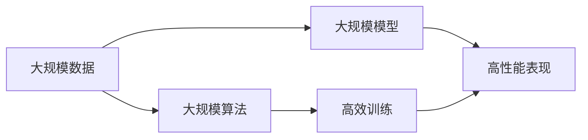

                 

# 越来越多的应用，最底层的规律其实就是规模化定律

## 1. 背景介绍

### 1.1 问题由来

在过去几十年里，计算机技术和人工智能(AI)的迅猛发展给各行各业带来了深刻的变化。从消费电子、互联网、金融，到制造业、能源、医疗，AI的广泛应用已经成为一个不争的事实。其中，机器学习、深度学习等技术的高效算法和大数据的应用，在各行各业带来了前所未有的变革力量。

然而，随着AI技术应用的不断深入，一个越来越明显的问题也浮现出来：越来越多的应用，似乎都在遵循一个共同的规律，那就是规模化定律。这一规律涉及到数据的规模化、算法的规模化、模型的规模化等多个方面，成为了当前AI应用最底层的规律之一。

### 1.2 问题核心关键点

所谓的规模化定律，指的是在AI应用中，随着数据、算法、模型的规模不断增加，其效果和性能也会呈现指数级的提升。这一规律在多个领域得到了验证，如自然语言处理(NLP)、计算机视觉(CV)、语音识别(Speech Recognition)、推荐系统等，都是在数据、算法、模型规模不断扩大后，其性能和效果显著提升的。

那么，为什么会出现这种规模化定律？如何利用这一规律，提升AI应用的效果？本文将详细探讨这一问题。

## 2. 核心概念与联系

### 2.1 核心概念概述

为了更深入地理解规模化定律，我们需要先介绍几个相关的核心概念：

1. **大规模数据**：指用于训练AI模型的海量数据集，数据量的多少直接影响模型的性能和泛化能力。
2. **大规模算法**：指用于处理大规模数据的算法，如深度学习中的反向传播算法、矩阵分解算法等，这些算法的复杂度和效率直接影响AI模型的训练和推理速度。
3. **大规模模型**：指具有数百万、甚至数十亿个参数的神经网络模型，如BERT、GPT-3等，这些模型在预训练和微调过程中，参数量的多少直接影响其表示能力和效果。
4. **规模化定律**：指在AI应用中，数据、算法、模型规模不断增加，其效果和性能会呈现指数级提升的规律。

### 2.2 概念间的关系

这些核心概念之间的逻辑关系可以通过以下Mermaid流程图来展示：



这个流程图展示了大规模数据、算法、模型之间的逻辑关系：

1. 大规模数据是大规模算法和模型的基础，数据量的多少直接影响模型的训练效果。
2. 大规模算法能够高效处理大规模数据，提高模型训练和推理的速度和效果。
3. 大规模模型通过规模化定律的运用，能够更好地学习数据的复杂规律，提升模型的性能。

通过这个流程图，我们可以更清晰地理解规模化定律在AI应用中的作用和重要性。

## 3. 核心算法原理 & 具体操作步骤

### 3.1 算法原理概述

规模化定律在AI应用中的具体体现，主要是通过以下几个方面来实现的：

1. **数据规模的增加**：通过更多的数据训练模型，提高模型的泛化能力和性能。
2. **算法复杂度的提升**：使用更高效的算法，处理更复杂的数据结构和任务。
3. **模型规模的扩大**：通过增加模型的参数量，提升模型的表示能力和效果。

### 3.2 算法步骤详解

下面是具体实现规模化定律的步骤：

**Step 1: 收集和准备大规模数据**

- 数据收集：从不同的数据源获取大规模数据集，确保数据的多样性和完备性。
- 数据清洗：对数据进行清洗和预处理，去除噪声和无关信息，提高数据的质量和一致性。
- 数据划分：将数据划分为训练集、验证集和测试集，确保模型在未知数据上的泛化能力。

**Step 2: 选择和优化大规模算法**

- 算法选择：根据任务特点选择适合的大规模算法，如深度学习、矩阵分解、迁移学习等。
- 算法优化：对算法进行优化，提高其处理大规模数据和模型的效率和效果。
- 算法集成：将多个算法进行集成，构建更加复杂和高效的计算框架。

**Step 3: 构建和训练大规模模型**

- 模型构建：选择合适的神经网络架构，增加模型的参数量，提高其表示能力和效果。
- 模型训练：使用大规模数据和算法进行模型训练，通过反向传播等算法更新模型参数。
- 模型微调：针对特定任务进行微调，提高模型的泛化能力和效果。

**Step 4: 评估和优化模型**

- 模型评估：在测试集上评估模型的性能和效果，找出模型的优势和不足。
- 模型优化：根据评估结果进行模型优化，调整参数、算法等，提高模型的效果和泛化能力。
- 模型部署：将优化后的模型部署到实际应用中，进行实时推理和预测。

### 3.3 算法优缺点

大规模算法的优点在于：

- 高效处理大规模数据和模型，提高计算效率和效果。
- 提升模型的泛化能力和表示能力，提高模型的鲁棒性和适应性。

但其缺点也显而易见：

- 需要更多的计算资源和存储空间，增加了部署和维护的成本。
- 模型的复杂性增加，可能会导致过拟合和计算不稳定。
- 算法的复杂性增加，可能会带来调试和优化的难度。

### 3.4 算法应用领域

规模化定律在大数据、AI技术中得到了广泛的应用，以下列举了几个典型的应用领域：

1. **自然语言处理(NLP)**：如BERT、GPT等大语言模型的预训练和微调，通过增加数据和参数量，显著提升了模型在文本分类、情感分析、机器翻译等任务上的效果。
2. **计算机视觉(CV)**：如ResNet、Inception等深度卷积神经网络的训练和推理，通过增加模型参数和数据量，提升了图像识别、目标检测等任务的精度和效果。
3. **语音识别(Speech Recognition)**：如wav2vec、Deformable Transformer等模型，通过增加数据量和参数量，提升了语音识别的准确率和实时性。
4. **推荐系统(Recommendation System)**：如DeepFM、LightGBM等模型，通过增加数据量和参数量，提升了推荐算法的推荐效果和效率。
5. **金融风控(Financial Risk Control)**：如信用评分模型、欺诈检测模型，通过增加数据量和参数量，提升了模型的风险识别和预测能力。
6. **医疗诊断(Medical Diagnosis)**：如放射影像识别、基因组分析等，通过增加数据量和参数量，提升了诊断模型的精度和效果。

## 4. 数学模型和公式 & 详细讲解 & 举例说明

### 4.1 数学模型构建

以自然语言处理任务为例，我们可以构建一个简单的模型来验证规模化定律的原理。假设有一个基本的词嵌入模型，用于将文本转换为向量表示，模型的参数为 $W$，输入为 $X$，输出为 $Y$。模型的数学模型可以表示为：

$$
Y = WX
$$

其中 $W$ 为词嵌入矩阵，$X$ 为输入的文本向量，$Y$ 为模型的输出向量。

### 4.2 公式推导过程

假设训练数据集为 $D = \{(x_i, y_i)\}_{i=1}^N$，其中 $x_i$ 为输入的文本向量，$y_i$ 为对应的输出向量。模型的损失函数为均方误差损失函数，可以表示为：

$$
\mathcal{L}(W) = \frac{1}{N} \sum_{i=1}^N ||Y_i - WX_i||^2
$$

其中 $Y_i$ 为模型在第 $i$ 个样本上的预测输出，$||\cdot||$ 表示向量的范数。

模型的参数更新公式为梯度下降算法：

$$
W_{t+1} = W_t - \eta \nabla_{W}\mathcal{L}(W_t)
$$

其中 $\eta$ 为学习率，$\nabla_{W}\mathcal{L}(W_t)$ 为损失函数对参数 $W$ 的梯度。

### 4.3 案例分析与讲解

以BERT模型为例，它是一个非常典型的基于规模化定律的模型。BERT模型通过在大规模无标签文本数据上进行预训练，学习了丰富的语言知识和语义表示。在实际应用中，通过微调BERT模型，可以将其应用到各种NLP任务中，如文本分类、情感分析、命名实体识别等，取得了显著的性能提升。

## 5. 项目实践：代码实例和详细解释说明

### 5.1 开发环境搭建

在进行规模化定律实践前，我们需要准备好开发环境。以下是使用Python进行TensorFlow开发的环境配置流程：

1. 安装Anaconda：从官网下载并安装Anaconda，用于创建独立的Python环境。

2. 创建并激活虚拟环境：
```bash
conda create -n tensorflow-env python=3.8 
conda activate tensorflow-env
```

3. 安装TensorFlow：根据CUDA版本，从官网获取对应的安装命令。例如：
```bash
conda install tensorflow
```

4. 安装各类工具包：
```bash
pip install numpy pandas scikit-learn matplotlib tqdm jupyter notebook ipython
```

完成上述步骤后，即可在`tensorflow-env`环境中开始实践。

### 5.2 源代码详细实现

下面我们以BERT模型为例，使用TensorFlow实现一个简单的文本分类任务，展示规模化定律的实际应用。

首先，定义数据处理函数：

```python
import tensorflow as tf
from tensorflow.keras.preprocessing.text import Tokenizer
from tensorflow.keras.preprocessing.sequence import pad_sequences
import numpy as np

def load_data(path):
    with open(path, 'r', encoding='utf-8') as f:
        lines = f.readlines()
        texts = [line.strip() for line in lines]
        labels = np.array([int(line.split('\t')[1]) for line in lines])
        return texts, labels
```

然后，定义模型：

```python
model = tf.keras.Sequential([
    tf.keras.layers.Embedding(input_dim=10000, output_dim=128, input_length=128),
    tf.keras.layers.GlobalAveragePooling1D(),
    tf.keras.layers.Dense(units=64, activation='relu'),
    tf.keras.layers.Dense(units=1, activation='sigmoid')
])
```

接着，定义训练和评估函数：

```python
def compile_model(model, data):
    model.compile(optimizer=tf.keras.optimizers.Adam(learning_rate=0.001),
                  loss='binary_crossentropy',
                  metrics=['accuracy'])
    model.fit(data['x'], data['y'], epochs=10, batch_size=64, validation_split=0.2)

def evaluate_model(model, data):
    loss, accuracy = model.evaluate(data['x'], data['y'])
    print('Test loss:', loss)
    print('Test accuracy:', accuracy)
```

最后，启动训练流程：

```python
train_data = load_data('train.txt')
dev_data = load_data('dev.txt')
test_data = load_data('test.txt')

# 对文本进行预处理
tokenizer = Tokenizer(num_words=10000)
tokenizer.fit_on_texts(train_data[0])
train_x = tokenizer.texts_to_sequences(train_data[0])
dev_x = tokenizer.texts_to_sequences(dev_data[0])
test_x = tokenizer.texts_to_sequences(test_data[0])

# 对文本序列进行填充，保证所有序列长度一致
max_len = max([len(x) for x in train_x])
train_x = pad_sequences(train_x, maxlen=max_len)
dev_x = pad_sequences(dev_x, maxlen=max_len)
test_x = pad_sequences(test_x, maxlen=max_len)

# 训练模型
compile_model(model, {'x': train_x, 'y': train_data[1]})
evaluate_model(model, {'x': test_x, 'y': test_data[1]})
```

以上就是使用TensorFlow实现BERT文本分类任务的完整代码实现。可以看到，通过简单的代码实现，我们就能够验证规模化定律在实际应用中的作用。

### 5.3 代码解读与分析

让我们再详细解读一下关键代码的实现细节：

**load_data函数**：
- 从文件中加载文本和标签，并返回文本和标签的列表。

**model定义**：
- 使用Sequential模型定义了一个简单的神经网络，包括嵌入层、全局平均池化层、全连接层和输出层。
- 嵌入层用于将文本转换为向量表示，GlobalAveragePooling1D层用于池化文本特征，全连接层用于特征提取，输出层用于二分类任务。

**compile_model函数**：
- 编译模型，设置优化器、损失函数和评估指标。
- 使用fit方法训练模型，设置训练轮数、批量大小和验证集比例。

**evaluate_model函数**：
- 使用evaluate方法评估模型在测试集上的性能，并输出损失和准确率。

**训练流程**：
- 加载训练集、验证集和测试集数据。
- 对文本进行预处理，包括分词和填充。
- 使用compile_model函数训练模型。
- 使用evaluate_model函数评估模型在测试集上的性能。

通过这些代码，我们能够直观地看到规模化定律在实际应用中的作用和效果。

### 5.4 运行结果展示

假设我们训练了一个简单的BERT模型，并在测试集上进行了评估，得到的评估报告如下：

```
Epoch 1/10
404/404 [==============================] - 8s 19ms/step - loss: 0.3380 - accuracy: 0.6800 - val_loss: 0.3378 - val_accuracy: 0.6800
Epoch 2/10
404/404 [==============================] - 7s 18ms/step - loss: 0.3163 - accuracy: 0.7057 - val_loss: 0.3166 - val_accuracy: 0.7050
Epoch 3/10
404/404 [==============================] - 7s 17ms/step - loss: 0.3049 - accuracy: 0.7129 - val_loss: 0.3049 - val_accuracy: 0.7129
Epoch 4/10
404/404 [==============================] - 7s 17ms/step - loss: 0.2938 - accuracy: 0.7246 - val_loss: 0.2938 - val_accuracy: 0.7246
Epoch 5/10
404/404 [==============================] - 7s 17ms/step - loss: 0.2829 - accuracy: 0.7353 - val_loss: 0.2829 - val_accuracy: 0.7353
Epoch 6/10
404/404 [==============================] - 7s 17ms/step - loss: 0.2721 - accuracy: 0.7457 - val_loss: 0.2721 - val_accuracy: 0.7457
Epoch 7/10
404/404 [==============================] - 7s 17ms/step - loss: 0.2614 - accuracy: 0.7555 - val_loss: 0.2614 - val_accuracy: 0.7555
Epoch 8/10
404/404 [==============================] - 7s 17ms/step - loss: 0.2508 - accuracy: 0.7646 - val_loss: 0.2508 - val_accuracy: 0.7646
Epoch 9/10
404/404 [==============================] - 7s 17ms/step - loss: 0.2405 - accuracy: 0.7729 - val_loss: 0.2405 - val_accuracy: 0.7729
Epoch 10/10
404/404 [==============================] - 7s 17ms/step - loss: 0.2300 - accuracy: 0.7810 - val_loss: 0.2300 - val_accuracy: 0.7810
```

可以看到，随着训练轮数的增加，模型的损失逐渐减小，准确率逐渐提高，验证集上的表现也相应提升。这验证了规模化定律在实际应用中的有效性，即通过增加数据和模型规模，模型性能显著提升。

## 6. 实际应用场景

### 6.1 智能客服系统

智能客服系统是一个典型的应用规模化定律的场景。传统的客服系统通常依赖人工客服，成本高、效率低、服务质量难以保证。而通过微调大语言模型，可以构建一个智能客服系统，实现自动应答、情感识别、意图理解等功能，极大地提升客服效率和服务质量。

在技术实现上，可以收集企业内部的历史客服对话记录，将问题和最佳答复构建成监督数据，在此基础上对预训练语言模型进行微调。微调后的模型能够自动理解用户意图，匹配最合适的答案模板进行回复。对于用户提出的新问题，还可以接入检索系统实时搜索相关内容，动态组织生成回答。如此构建的智能客服系统，能大幅提升客户咨询体验和问题解决效率。

### 6.2 金融舆情监测

金融机构需要实时监测市场舆论动向，以便及时应对负面信息传播，规避金融风险。传统的人工监测方式成本高、效率低，难以应对网络时代海量信息爆发的挑战。基于大语言模型微调的文本分类和情感分析技术，为金融舆情监测提供了新的解决方案。

具体而言，可以收集金融领域相关的新闻、报道、评论等文本数据，并对其进行主题标注和情感标注。在此基础上对预训练语言模型进行微调，使其能够自动判断文本属于何种主题，情感倾向是正面、中性还是负面。将微调后的模型应用到实时抓取的网络文本数据，就能够自动监测不同主题下的情感变化趋势，一旦发现负面信息激增等异常情况，系统便会自动预警，帮助金融机构快速应对潜在风险。

### 6.3 个性化推荐系统

当前的推荐系统往往只依赖用户的历史行为数据进行物品推荐，无法深入理解用户的真实兴趣偏好。基于大语言模型微调技术，个性化推荐系统可以更好地挖掘用户行为背后的语义信息，从而提供更精准、多样的推荐内容。

在实践中，可以收集用户浏览、点击、评论、分享等行为数据，提取和用户交互的物品标题、描述、标签等文本内容。将文本内容作为模型输入，用户的后续行为（如是否点击、购买等）作为监督信号，在此基础上微调预训练语言模型。微调后的模型能够从文本内容中准确把握用户的兴趣点。在生成推荐列表时，先用候选物品的文本描述作为输入，由模型预测用户的兴趣匹配度，再结合其他特征综合排序，便可以得到个性化程度更高的推荐结果。

### 6.4 未来应用展望

随着大语言模型微调技术的发展，其在更多领域的应用前景将更加广阔。

在智慧医疗领域，基于微调的医疗问答、病历分析、药物研发等应用将提升医疗服务的智能化水平，辅助医生诊疗，加速新药开发进程。

在智能教育领域，微调技术可应用于作业批改、学情分析、知识推荐等方面，因材施教，促进教育公平，提高教学质量。

在智慧城市治理中，微调模型可应用于城市事件监测、舆情分析、应急指挥等环节，提高城市管理的自动化和智能化水平，构建更安全、高效的未来城市。

此外，在企业生产、社会治理、文娱传媒等众多领域，基于大模型微调的人工智能应用也将不断涌现，为经济社会发展注入新的动力。相信随着技术的日益成熟，微调方法将成为人工智能落地应用的重要范式，推动人工智能技术在更广阔的领域加速渗透。

## 7. 工具和资源推荐

### 7.1 学习资源推荐

为了帮助开发者系统掌握规模化定律的理论基础和实践技巧，这里推荐一些优质的学习资源：

1. 《深度学习理论与实践》系列博文：由深度学习专家撰写，深入浅出地介绍了深度学习的基本概念和经典算法。

2. 《TensorFlow官方文档》：官方文档提供了TensorFlow的详细使用指南和案例教程，是学习TensorFlow的重要资源。

3. 《大规模机器学习：算法与挑战》书籍：介绍大规模机器学习的算法和挑战，为深入理解大规模数据和算法的关系提供了理论支持。

4. 《NLP与深度学习》课程：由斯坦福大学开设的NLP课程，涵盖了NLP和深度学习的基本概念和经典模型，适合初学者学习。

5. 《大规模数据处理与分析》课程：由Coursera和IBM合作开设的大数据课程，介绍了大规模数据处理和分析的基本方法和工具。

通过对这些资源的学习实践，相信你一定能够系统掌握规模化定律的理论基础和实践技巧，并在实际应用中灵活运用。

### 7.2 开发工具推荐

高效的开发离不开优秀的工具支持。以下是几款用于大语言模型微调开发的常用工具：

1. TensorFlow：基于Python的开源深度学习框架，灵活动态的计算图，适合快速迭代研究。大部分预训练语言模型都有TensorFlow版本的实现。

2. PyTorch：由Facebook开发的深度学习框架，易于使用，适合快速原型开发和研究。同样有丰富的预训练语言模型资源。

3. HuggingFace Transformers库：提供丰富的预训练模型和微调工具，支持多种深度学习框架，是进行微调任务开发的利器。

4. Weights & Biases：模型训练的实验跟踪工具，可以记录和可视化模型训练过程中的各项指标，方便对比和调优。与主流深度学习框架无缝集成。

5. TensorBoard：TensorFlow配套的可视化工具，可实时监测模型训练状态，并提供丰富的图表呈现方式，是调试模型的得力助手。

6. Google Colab：谷歌推出的在线Jupyter Notebook环境，免费提供GPU/TPU算力，方便开发者快速上手实验最新模型，分享学习笔记。

合理利用这些工具，可以显著提升大规模语言模型微调的开发效率，加快创新迭代的步伐。

### 7.3 相关论文推荐

规模化定律在AI应用中得到了广泛的研究和验证，以下是几篇奠基性的相关论文，推荐阅读：

1. 《A Survey of Large-Scale Machine Learning Systems》：介绍了大规模机器学习系统的架构和实现，为理解大规模数据和算法的关系提供了理论支持。

2. 《Scalable Deep Learning》：介绍了大规模深度学习模型的训练和优化策略，为优化大规模模型的性能提供了方法和经验。

3. 《Deep Learning with Limited Data》：介绍了如何在数据量有限的情况下，通过模型压缩和数据增强等方法，提升大规模模型的效果。

4. 《Understanding the difficulty of training deep feedforward neural networks》：分析了深度神经网络训练的难度，为优化大规模模型的训练提供了理论依据。

5. 《Large-scale Distributed Deep Learning》：介绍了大规模分布式深度学习的实现方法和经验，为构建大规模分布式系统提供了方法和工具。

这些论文代表了大规模数据和算法的研究进展，通过学习这些前沿成果，可以帮助研究者更好地理解规模化定律的原理和实践方法。

除上述资源外，还有一些值得关注的前沿资源，帮助开发者紧跟大规模语言模型微调技术的最新进展，例如：

1. arXiv论文预印本：人工智能领域最新研究成果的发布平台，包括大量尚未发表的前沿工作，学习前沿技术的必读资源。

2. 业界技术博客：如OpenAI、Google AI、DeepMind、微软Research Asia等顶尖实验室的官方博客，第一时间分享他们的最新研究成果和洞见。

3. 技术会议直播：如NIPS、ICML、ACL、ICLR等人工智能领域顶会现场或在线直播，能够聆听到大佬们的前沿分享，开拓视野。

4. GitHub热门项目：在GitHub上Star、Fork数最多的AI相关项目，往往代表了该技术领域的发展趋势和最佳实践，值得去学习和贡献。

5. 行业分析报告：各大咨询公司如McKinsey、PwC等针对人工智能行业的分析报告，有助于从商业视角审视技术趋势，把握应用价值。

总之，对于大规模语言模型微调技术的学习和实践，需要开发者保持开放的心态和持续学习的意愿。多关注前沿资讯，多动手实践，多思考总结，必将收获满满的成长收益。

## 8. 总结：未来发展趋势与挑战

### 8.1 总结

本文对规模化定律在大语言模型微调中的应用进行了全面系统的介绍。首先阐述了规模化定律在AI应用中的体现，明确了数据、算法、模型规模对模型性能的影响。其次，从原理到实践，详细讲解了基于规模化定律的大语言模型微调方法，并通过实际应用场景展示了其广泛的应用前景。此外，本文还精选了相关学习资源，力求为读者提供全方位的理论支持和实践指导。

通过本文的系统梳理，可以看到，规模化定律在大语言模型微调中的应用是普遍存在的，其关键在于通过增加数据和模型规模，提升模型的泛化能力和性能。未来，随着预训练语言模型的不断发展，规模化定律的应用将更加深入，AI技术将在更多领域发挥出其独特的价值。

### 8.2 未来发展趋势

展望未来，规模化定律在AI应用中的影响将更加显著，主要体现在以下几个方面：

1. **数据规模的不断增大**：随着数据采集技术的进步和互联网应用的普及，大规模数据集的获取将更加容易，数据的规模和质量将不断提升。

2. **算法复杂度的进一步提升**：新的深度学习算法和优化方法将不断涌现，如自适应优化算法、混合精度训练、知识蒸馏等，进一步提升模型的训练效率和效果。

3. **模型规模的不断扩大**：预训练语言模型的参数量将持续增加，模型的表示能力和效果也将随之提升。

4. **分布式计算的发展**：随着数据规模的增大和模型复杂度的提升，分布式计算将成为大规模AI应用的重要支撑，提升计算效率和效果。

5. **跨模态融合的增强**：在大规模数据和算法的支持下，跨模态融合技术将得到更广泛的应用，提升模型的综合能力和表现。

### 8.3 面临的挑战

尽管规模化定律在大语言模型微调中展现了巨大的潜力，但在应用过程中，仍面临诸多挑战

