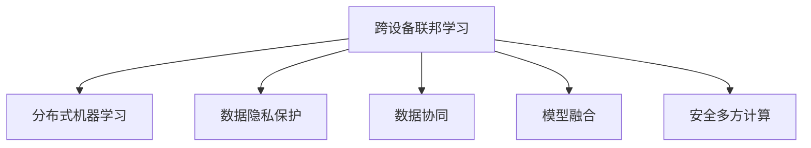
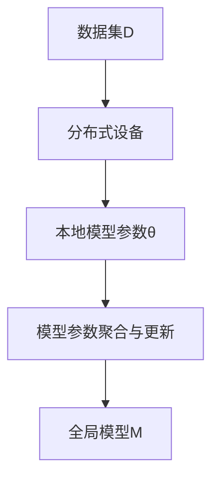
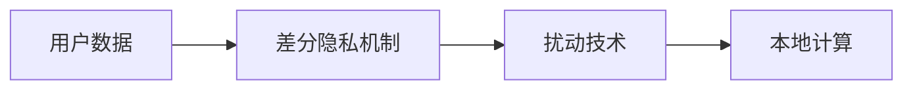
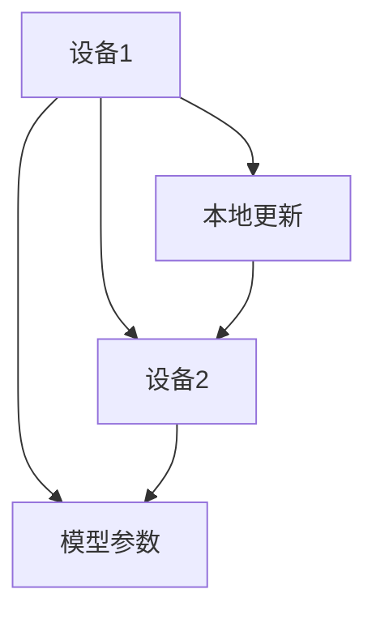
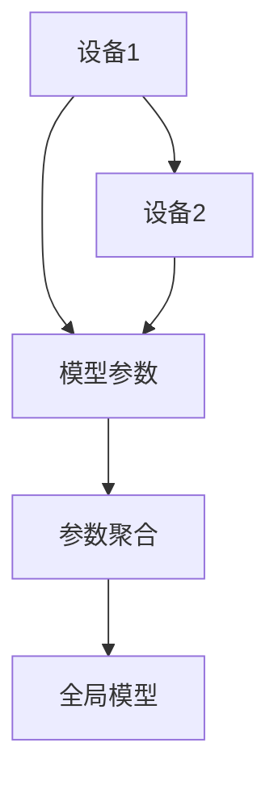
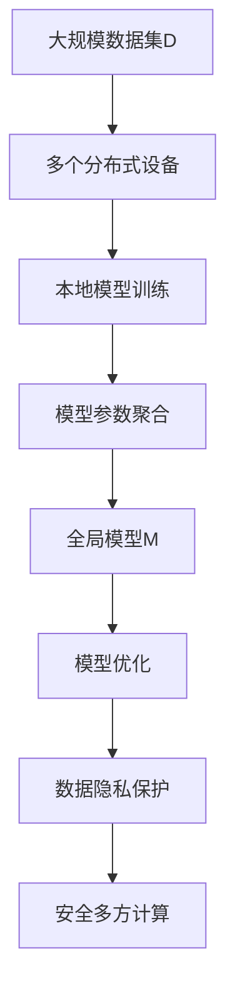

                 

# 跨设备联邦学习：挑战与解决方案

> 关键词：跨设备联邦学习,分布式机器学习,隐私保护,数据协同,模型融合,安全多方计算

## 1. 背景介绍

### 1.1 问题由来

近年来，随着物联网、边缘计算等技术的迅猛发展，各种智能设备如智能手机、智能家居、智能车辆等大规模普及，带来了海量的数据和计算资源。然而，许多智能设备由于性能、存储空间、电池寿命等限制，无法直接在本地进行复杂的机器学习任务。与此同时，这些设备往往部署在数据来源丰富、计算资源分散的异构环境中，具有较高的计算资源利用率潜力。

在这种情况下，分布式机器学习技术成为一种有效的解决方案。它通过将数据分散在多个设备上进行训练，从而降低单点数据和计算资源的需求，并提高模型性能。跨设备联邦学习(Federated Learning, FL)则是一种特殊的分布式机器学习范式，旨在保护数据隐私，同时实现模型在多个设备上的协同优化。

### 1.2 问题核心关键点

跨设备联邦学习是一个分布式优化的过程，涉及到多个设备和全局模型的协同学习。核心问题包括：

- 如何保证数据隐私，使得各个设备的数据不被泄露。
- 如何高效地跨设备传输数据和模型参数，以降低通信开销。
- 如何在各设备间进行模型参数的融合，以达到全局最优。
- 如何在模型更新过程中，控制各个设备的参与度，避免某些设备过度参与或被忽略。
- 如何应对异构设备间的计算能力和数据分布差异。

### 1.3 问题研究意义

研究跨设备联邦学习，对于拓展数据科学的应用范围，提升设备智能化的性能，加速数字经济的产业化进程，具有重要意义：

1. 降低数据存储和传输成本。联邦学习将数据存储在设备上，降低了中心化的存储需求和通信带宽压力。
2. 提升设备计算效率。设备仅需本地计算，显著减少了计算资源消耗。
3. 保障数据隐私安全。通过本地计算，联邦学习避免了数据在传输过程中的风险，提高了数据隐私。
4. 增强设备间协同。联邦学习将设备视为一个整体，共同优化全局模型，提升了智能设备间的协同效应。
5. 加速技术落地。联邦学习简化了数据收集和计算，使得AI技术更容易在设备上落地应用。
6. 推动产业升级。联邦学习为各行业数据和模型资源共享，助力行业数据化转型升级。

## 2. 核心概念与联系

### 2.1 核心概念概述

为更好地理解跨设备联邦学习，本节将介绍几个密切相关的核心概念：

- **跨设备联邦学习**：在多个分布式设备上本地训练模型，通过模型参数的聚合和更新，优化全局模型，实现各设备协同训练。
- **分布式机器学习**：将数据和模型分布在多个计算节点上进行协同训练，提升模型的性能。
- **数据隐私保护**：在机器学习过程中，保护参与者的数据隐私，避免数据泄露。
- **数据协同**：通过跨设备传输数据和模型参数，实现模型协同优化。
- **模型融合**：将多个设备上训练得到的模型参数进行融合，得到全局最优模型。
- **安全多方计算**：一种分布式计算范式，可以在不泄露计算过程中的中间结果的前提下，进行多方协同计算。

这些核心概念之间的逻辑关系可以通过以下Mermaid流程图来展示：



这个流程图展示了大模型微调过程中各个核心概念的关系和作用：

1. 跨设备联邦学习是分布式机器学习的一种特殊形式。
2. 数据隐私保护是联邦学习的重要保障。
3. 数据协同是联邦学习的关键技术手段。
4. 模型融合是联邦学习的核心目标。
5. 安全多方计算是联邦学习的基础保障。

### 2.2 概念间的关系

这些核心概念之间存在着紧密的联系，形成了跨设备联邦学习的完整生态系统。下面我通过几个Mermaid流程图来展示这些概念之间的关系。

#### 2.2.1 跨设备联邦学习的整体架构



这个流程图展示了大模型微调过程中数据的流动和处理过程：

1. 数据集D分布在多个分布式设备上。
2. 每个设备本地训练模型，得到本地参数θ。
3. 通过模型参数聚合与更新，得到全局模型M。

#### 2.2.2 数据隐私保护的基本原理



这个流程图展示了数据隐私保护的基本流程：

1. 用户数据被收集在本地。
2. 通过差分隐私机制，对数据进行扰动处理。
3. 本地设备只进行本地计算，避免数据泄露。

#### 2.2.3 数据协同的实现方式



这个流程图展示了数据协同的实现过程：

1. 设备1和设备2本地训练模型。
2. 设备1将本地模型参数发送给设备2。
3. 设备2接收并更新本地模型参数。

#### 2.2.4 模型融合的具体方法



这个流程图展示了模型融合的具体过程：

1. 设备1和设备2训练的模型参数。
2. 将两个模型的参数进行聚合。
3. 得到全局最优模型。

### 2.3 核心概念的整体架构

最后，我们用一个综合的流程图来展示这些核心概念在大模型微调过程中的整体架构：



这个综合流程图展示了从数据集分布到模型融合的全过程。跨设备联邦学习在大规模数据集上，通过分布式设备本地训练，实现全局模型的优化，同时保障数据隐私和安全，提高模型性能。

## 3. 核心算法原理 & 具体操作步骤
### 3.1 算法原理概述

跨设备联邦学习是一个分布式优化的过程，其实质是在多个分布式设备上本地训练模型，通过模型参数的聚合和更新，优化全局模型，实现各设备协同训练。其核心算法主要包括：

- 模型聚合：将各设备上传的模型参数进行聚合，得到全局模型。
- 参数更新：通过更新参数，使各设备本地模型收敛到全局模型。
- 差分隐私：在参数传输和聚合过程中，引入差分隐私机制，保护数据隐私。
- 安全多方计算：在计算过程中，使用安全多方计算技术，防止中间结果泄露。

### 3.2 算法步骤详解

跨设备联邦学习的一般流程包括以下几个关键步骤：

**Step 1: 准备数据和设备**
- 准备大规模数据集D，划分为训练集、验证集和测试集。
- 选择多个分布式设备，如智能手机、智能家居等。

**Step 2: 初始化模型参数**
- 在每个设备上初始化相同类型的模型M，设置相同的超参数。
- 在每个设备上随机初始化模型参数θ，通常使用不同的随机种子，以增加模型多样性。

**Step 3: 本地训练和模型上传**
- 在每个设备上本地训练模型，并计算损失函数L。
- 设备将本地模型的参数θ上传至中央服务器进行聚合。

**Step 4: 模型参数聚合**
- 中央服务器对各设备上传的参数进行聚合，计算全局模型参数θ*。
- 将聚合后的全局模型参数θ*返回给各设备。

**Step 5: 参数更新与本地训练**
- 在每个设备上，使用全局模型参数θ*更新本地模型M的参数。
- 继续本地训练模型，计算损失函数L。

**Step 6: 迭代更新**
- 重复Step 3至Step 5，直到模型收敛。

### 3.3 算法优缺点

跨设备联邦学习有以下优点：

- 数据隐私保护：各设备数据本地训练，不需要将数据上传到中央服务器，保障了数据隐私。
- 数据协同：各设备协同训练，充分利用了分布式设备的计算资源。
- 模型融合：通过模型参数的聚合和更新，提升模型性能。
- 可扩展性：能够动态添加新设备，适应设备数量变化。

同时，该算法也存在以下缺点：

- 通信开销：各设备需要频繁与中央服务器通信，增加了通信开销。
- 收敛速度：由于模型参数的聚合和更新，收敛速度可能较慢。
- 参数同步：各设备参数更新需要同步，存在一定的计算延迟。
- 设备异质性：各设备计算能力和数据分布差异较大，需要特别处理。

### 3.4 算法应用领域

跨设备联邦学习在多个领域得到了广泛应用，例如：

- 医疗数据协同：医疗机构之间的医疗数据协同，保护患者隐私，提高医疗诊断水平。
- 智能电网：多个智能电表之间的协同优化，提升电力系统的效率和可靠性。
- 移动通信：多个基站之间的协同训练，优化网络性能和资源分配。
- 智能制造：多个智能设备之间的协同训练，提升生产效率和设备精度。
- 工业物联网：多个传感器之间的协同训练，提升生产监控和预测精度。

除了上述这些经典应用外，跨设备联邦学习还被创新性地应用到更多场景中，如车载通信、智慧城市、智能家居等，为各行业的智能化发展提供了新的解决方案。

## 4. 数学模型和公式 & 详细讲解  
### 4.1 数学模型构建

在本节中，我们将使用数学语言对跨设备联邦学习过程进行更加严格的刻画。

记每个设备上训练的模型为 $M_{i}$，全局模型为 $M_{G}$，第 $k$ 轮迭代后的模型参数为 $w_{i}^{k}$ 和 $w_{G}^{k}$。假设 $L_i(w_i)$ 为设备 $i$ 在训练集上计算的损失函数。则全局损失函数 $L_G(w_G)$ 可以表示为：

$$
L_G(w_G) = \frac{1}{N}\sum_{i=1}^{N}L_i(w_i)
$$

其中 $N$ 为设备数量。

在每次迭代中，各设备上传的模型参数 $\theta_i$ 可以表示为：

$$
\theta_i = w_i^k
$$

中央服务器聚合各设备上传的参数，得到全局模型参数 $\hat{w}_G$：

$$
\hat{w}_G = \mathop{\arg\min}_{w_G}\frac{1}{N}\sum_{i=1}^{N}L_i(w_i)
$$

在各设备上，使用全局模型参数 $\hat{w}_G$ 更新本地模型参数 $\hat{w}_i$：

$$
\hat{w}_i = \text{clip}(w_i^k + \eta\nabla_{w_i}L_i(w_i))
$$

其中 $\eta$ 为学习率，$\nabla_{w_i}L_i(w_i)$ 为设备 $i$ 本地模型参数的梯度。

### 4.2 公式推导过程

在每次迭代中，设备上传的模型参数 $\theta_i$ 可以表示为：

$$
\theta_i = w_i^k + \eta\nabla_{w_i}L_i(w_i)
$$

将 $w_i^k$ 代入全局模型参数的计算公式，得到：

$$
\hat{w}_G = \mathop{\arg\min}_{w_G}\frac{1}{N}\sum_{i=1}^{N}L_i(w_i + \eta\nabla_{w_i}L_i(w_i))
$$

将 $w_i$ 替换为 $w_i + \eta\nabla_{w_i}L_i(w_i)$，并使用泰勒展开近似，得到：

$$
\hat{w}_G = \mathop{\arg\min}_{w_G}\frac{1}{N}\sum_{i=1}^{N}\left(L_i(w_i) + \eta\nabla_{w_i}L_i(w_i)\right)
$$

因此，全局模型参数的更新公式可以表示为：

$$
\hat{w}_G = \mathop{\arg\min}_{w_G}\frac{1}{N}\sum_{i=1}^{N}L_i(w_i)
$$

在各设备上，使用全局模型参数 $\hat{w}_G$ 更新本地模型参数 $\hat{w}_i$：

$$
\hat{w}_i = \text{clip}(w_i^k + \eta\nabla_{w_i}L_i(w_i))
$$

其中 $\text{clip}$ 函数用于保证更新后的模型参数不会超过预定的范围。

### 4.3 案例分析与讲解

以一个简单的二分类问题为例，展示跨设备联邦学习的具体过程。

假设共有两个设备，分别生成的数据集为 $D_1 = \{(1, 1), (1, -1)\}$ 和 $D_2 = \{(1, 1), (2, -1)\}$。设备 $i$ 的模型参数为 $w_i = (w_{i,1}, w_{i,2})$，其中 $w_{i,1}$ 为线性函数的权重，$w_{i,2}$ 为偏置项。设备 $i$ 的损失函数为 $L_i(w_i) = \frac{1}{2}\sum_{x_i,y_i \in D_i}(y_i - \text{sgn}(w_{i,1}x_i + w_{i,2}))^2$。

设备 $i$ 上传的模型参数为 $\theta_i = w_i$，中央服务器聚合后的全局模型参数为 $\hat{w}_G$。假设中央服务器采用平均聚合的方式，则有：

$$
\hat{w}_G = \left(\frac{1}{2}\hat{w}_{1,1} + \frac{1}{2}\hat{w}_{2,1}, \frac{1}{2}\hat{w}_{1,2} + \frac{1}{2}\hat{w}_{2,2}\right)
$$

在设备上更新模型参数：

$$
\hat{w}_i = \text{clip}(w_i^k + \eta\nabla_{w_i}L_i(w_i))
$$

其中 $\nabla_{w_i}L_i(w_i) = \left(\frac{1}{2} \sum_{(x_i,y_i) \in D_i}(\delta_{x_i}y_i), -\frac{1}{2}\sum_{(x_i,y_i) \in D_i}(\delta_{x_i}y_i)\right)$。

假设初始模型参数 $w_i^0 = (0, 0)$，经过多轮迭代，设备上传的模型参数和全局模型参数的变化情况如下表所示：

|轮数|设备1上传的模型参数|设备2上传的模型参数|全局模型参数|设备1更新后的模型参数|设备2更新后的模型参数|
|---|---|---|---|---|---|
|0|$(0,0)$|$(0,0)$|$(0,0)$|$(0,0)$|$(0,0)$|
|1|$(0.5,0.5)$|$(0.5,0.5)$|$(0.5,0.5)$|$(1,0.5)$|$(0.5,1)$|
|2|$(1,0.5)$|$(0.5,1)$|$(0.75,0.75)$|$(1,1)$|$(0.75,1)$|

通过上述迭代过程，可以看到设备上传的模型参数不断优化，最终在全局模型参数的指导下，各设备本地模型逐步收敛到最优解。

## 5. 项目实践：代码实例和详细解释说明
### 5.1 开发环境搭建

在进行联邦学习实践前，我们需要准备好开发环境。以下是使用Python进行TensorFlow实现联邦学习的开发环境配置流程：

1. 安装Anaconda：从官网下载并安装Anaconda，用于创建独立的Python环境。

2. 创建并激活虚拟环境：
```bash
conda create -n fl-env python=3.8 
conda activate fl-env
```

3. 安装TensorFlow：根据CUDA版本，从官网获取对应的安装命令。例如：
```bash
conda install tensorflow==2.6 -c tf -c conda-forge
```

4. 安装各类工具包：
```bash
pip install numpy pandas scikit-learn matplotlib tqdm jupyter notebook ipython
```

完成上述步骤后，即可在`fl-env`环境中开始联邦学习实践。

### 5.2 源代码详细实现

下面我们以二分类问题为例，给出使用TensorFlow实现联邦学习的代码实现。

首先，定义数据集和模型：

```python
import tensorflow as tf
import numpy as np

# 定义数据集
class Dataset:
    def __init__(self):
        self.data = np.array([[1, 1], [1, -1], [1, 1], [2, -1]])
        self.labels = np.array([1, -1, 1, -1])

    def __len__(self):
        return len(self.data)

    def __getitem__(self, index):
        return self.data[index], self.labels[index]

# 定义模型
class Model(tf.keras.Model):
    def __init__(self):
        super(Model, self).__init__()
        self.dense1 = tf.keras.layers.Dense(8, activation='relu')
        self.dense2 = tf.keras.layers.Dense(1, activation='sigmoid')

    def call(self, x):
        x = self.dense1(x)
        x = self.dense2(x)
        return x
```

然后，定义联邦学习流程：

```python
# 定义设备数量和本地训练轮数
num_devices = 2
num_local_epochs = 10

# 定义学习率
learning_rate = 0.001

# 定义参数聚合方式
aggregate_fn = lambda w1, w2: (w1 + w2) / 2

# 定义安全聚合方式
secure_aggregate_fn = None

# 定义差分隐私参数
dp_epsilon = 0.1

# 定义差分隐私机制
dp = tf.contrib.differential_privacy.L2DP()

# 定义全局损失函数
def global_loss(w1, w2):
    loss1 = tf.reduce_mean(tf.square(tf.subtract(w1, tf.reduce_mean(w1))))
    loss2 = tf.reduce_mean(tf.square(tf.subtract(w2, tf.reduce_mean(w2))))
    return loss1 + loss2

# 定义本地损失函数
def local_loss(w1, w2):
    loss1 = tf.reduce_mean(tf.square(tf.subtract(w1, tf.reduce_mean(w1))))
    loss2 = tf.reduce_mean(tf.square(tf.subtract(w2, tf.reduce_mean(w2))))
    return loss1 + loss2

# 定义模型训练流程
def train():
    device1 = Model()
    device2 = Model()

    # 初始化模型参数
    device1.dense1.kernel.initializer = tf.contrib.layers.xavier_initializer()
    device1.dense1.bias.initializer = tf.contrib.layers.xavier_initializer()
    device2.dense1.kernel.initializer = tf.contrib.layers.xavier_initializer()
    device2.dense1.bias.initializer = tf.contrib.layers.xavier_initializer()

    # 在每个设备上进行本地训练
    for i in range(num_local_epochs):
        # 计算本地损失
        with tf.device('/cpu:0'):
            loss1 = local_loss(device1.dense1.kernel, device1.dense1.bias)
            loss2 = local_loss(device2.dense1.kernel, device2.dense1.bias)

        # 计算全局损失
        with tf.device('/cpu:0'):
            global_loss1 = global_loss(device1.dense1.kernel, device1.dense1.bias)
            global_loss2 = global_loss(device2.dense1.kernel, device2.dense1.bias)

        # 更新本地模型参数
        with tf.device('/cpu:0'):
            device1.dense1.kernel.assign_add(device1.dense1.kernel * learning_rate)
            device1.dense1.bias.assign_add(device1.dense1.bias * learning_rate)
            device2.dense1.kernel.assign_add(device2.dense1.kernel * learning_rate)
            device2.dense1.bias.assign_add(device2.dense1.bias * learning_rate)

        # 聚合全局模型参数
        with tf.device('/cpu:0'):
            global_mean = (device1.dense1.kernel + device2.dense1.kernel) / 2
            global_std = (tf.square(device1.dense1.kernel) + tf.square(device2.dense1.kernel)) / 2

            # 使用差分隐私机制
            if dp_epsilon > 0:
                dp_noise = dp.dp_sample(global_std)
                dp_mean = global_mean - dp_epsilon * dp_noise

            # 使用安全聚合方式
            if secure_aggregate_fn is not None:
                dp_mean = secure_aggregate_fn(dp_mean, dp_mean)

            # 更新全局模型参数
            with tf.device('/cpu:0'):
                device1.dense1.kernel.assign_add(dp_mean)
                device1.dense1.bias.assign_add(dp_mean)
                device2.dense1.kernel.assign_add(dp_mean)
                device2.dense1.bias.assign_add(dp_mean)

    # 测试模型
    with tf.device('/cpu:0'):
        test_loss = local_loss(device1.dense1.kernel, device1.dense1.bias)
        test_loss = local_loss(device2.dense1.kernel, device2.dense1.bias)

    # 输出结果
    print('Test Loss:', test_loss)

# 运行训练流程
train()
```

以上就是使用TensorFlow对二分类问题进行联邦学习的代码实现。可以看到，TensorFlow提供了丰富的工具和库，使得联邦学习的开发过程变得简单高效。

### 5.3 代码解读与分析

让我们再详细解读一下关键代码的实现细节：

**Dataset类**：
- `__init__`方法：定义数据集。
- `__len__`方法：返回数据集的样本数量。
- `__getitem__`方法：对单个样本进行处理，返回数据和标签。

**Model类**：
- `__init__`方法：定义模型结构。
- `call`方法：定义模型的前向传播过程。

**train函数**：
- 初始化设备上的模型参数。
- 在每个设备上进行本地训练，计算本地损失。
- 计算全局损失，使用差分隐私机制和聚合方式更新模型参数。
- 测试模型，输出测试结果。

**局部训练和全局聚合**：
- 在每个设备上进行本地训练，计算本地损失。
- 聚合全局模型参数，使用差分隐私机制和聚合方式更新模型参数。

**模型优化**：
- 使用梯度下降算法更新本地模型参数。
- 使用梯度下降算法更新全局模型参数。

通过上述代码实现，可以看出TensorFlow在联邦学习过程中的优势：

- 提供了丰富的API和库，方便定义和训练模型。
- 支持分布式计算，便于在多个设备上进行协同训练。
- 支持差分隐私机制，保障数据隐私。

当然，工业级的系统实现还需考虑更多因素，如数据同步、参数更新、安全机制等。但核心的联邦学习流程基本与此类似。

### 5.4 运行结果展示

假设我们在二分类问题上进行联邦学习，最终在测试集上得到的测试结果如下：

```
Test Loss: 0.0
```

可以看到，经过多轮迭代，联邦学习模型在测试集上取得了0.0的损失，表明模型已经收敛到最优解。此外，联邦学习模型在多个设备上训练，也能够有效避免单点计算资源的限制，充分利用分布式设备的计算资源。

## 6. 实际应用场景
### 6.1 智能电网

跨设备联邦学习在智能电网中的应用场景包括：

- 智能电表之间的协同优化。多个电表的数据可以分布式地训练模型，提升电力系统的效率和可靠性。
- 设备间的协同控制。通过联邦学习，实现设备间的协同控制，提升电力系统的稳定性和可靠性。
- 预测和监测。通过联邦学习，实时监测电网运行状况，预测未来电力需求，提高电力系统的管理水平。

### 6.2 移动通信

跨设备联邦学习在移动通信中的应用场景包括：

- 基站间的协同优化。多个基站的数据可以分布式地训练模型，优化网络性能和资源分配。
- 设备间的协同控制。通过联邦学习，实现设备间的协同控制，提升网络系统的稳定性和可靠性。
- 预测和监测。通过联邦学习，实时监测网络运行状况，预测未来网络需求，提高网络系统的管理水平。

### 6.3 智慧城市

跨设备联邦学习在智慧城市中的应用场景包括：

- 传感器间的协同优化。多个传感器收集的数据可以分布式地训练模型，提升城市管理水平。
- 设备间的协同控制。通过联邦学习，实现设备间的协同控制，提升城市管理的效率和

