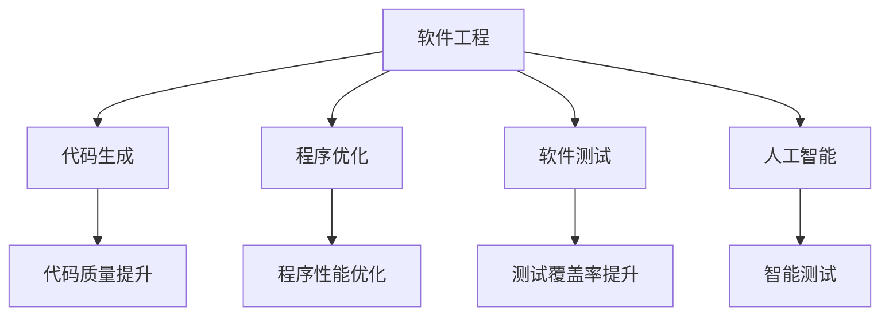
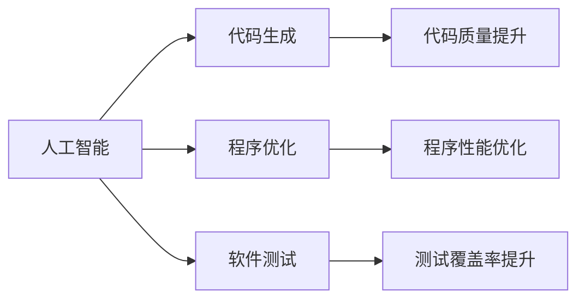
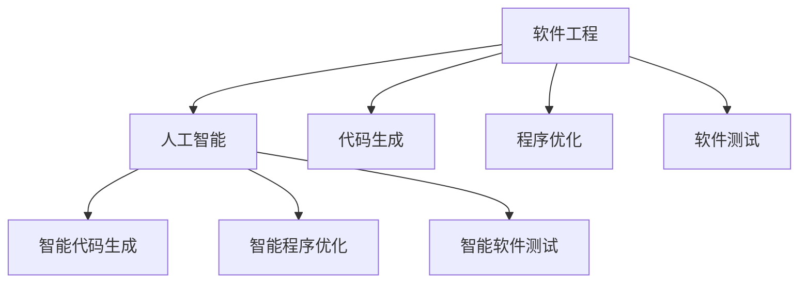
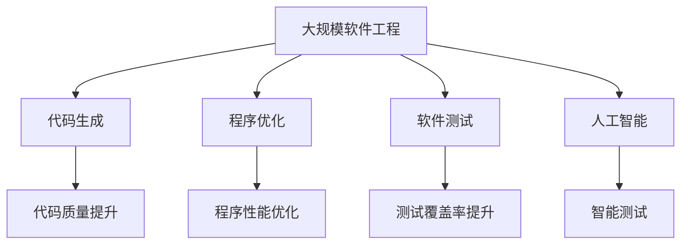

                 

# 软件 2.0 的价值：提升效率、创造价值

> 关键词：软件工程,代码生成,人工智能,程序优化,软件测试

## 1. 背景介绍

### 1.1 问题由来

软件工程（Software Engineering）是现代软件开发过程中不可或缺的一环，旨在通过科学的方法、规范的流程和工具提升软件开发的效率和质量。随着信息技术的高速发展，软件工程的重要性日益凸显。然而，随着软件规模的不断扩大，软件工程的复杂度也急剧增加。如何有效提升软件开发效率，减少开发成本，保障软件质量，成为摆在软件开发人员面前的重要课题。

### 1.2 问题核心关键点

软件工程的核心目标是提高软件开发效率和软件质量。具体来说，可以从以下几个方面展开：

- **代码生成**：通过自动化生成代码，减少手动编码工作量，提高开发效率。
- **程序优化**：通过对程序进行优化，提升软件性能，降低运行成本。
- **软件测试**：通过自动化的测试手段，保障软件质量，减少人为错误。
- **人工智能应用**：借助人工智能技术，提升软件工程的整体能力，如代码质量分析、代码优化、自动化测试等。

### 1.3 问题研究意义

研究软件工程的先进方法和技术，对于提升软件开发效率和软件质量，推动软件行业的发展具有重要意义：

- **提升效率**：通过自动化和智能化的手段，大大减少手动工作量，缩短软件开发周期。
- **保障质量**：借助人工智能技术，提升软件测试的覆盖率和准确性，减少人为错误。
- **降低成本**：自动化生成的代码和自动化的测试能够显著降低软件开发和维护的成本。
- **促进创新**：人工智能的应用能够提升软件工程的整体水平，加速新技术的落地和应用。

## 2. 核心概念与联系

### 2.1 核心概念概述

为了更好地理解软件工程的发展趋势和先进技术，本节将介绍几个密切相关的核心概念：

- **软件工程（Software Engineering）**：通过科学的方法、规范的流程和工具提升软件开发效率和软件质量的工程学科。
- **代码生成（Code Generation）**：使用自动化工具生成代码，以提高软件开发效率和一致性。
- **程序优化（Program Optimization）**：通过算法和工具提升程序的运行效率和资源利用率。
- **软件测试（Software Testing）**：通过自动化测试手段，验证软件的正确性和可靠性。
- **人工智能（Artificial Intelligence）**：借助人工智能技术，提升软件工程的自动化水平，如代码质量分析、代码优化、自动化测试等。

这些核心概念之间的逻辑关系可以通过以下Mermaid流程图来展示：



这个流程图展示了大规模软件工程中各关键环节的关系：

1. **软件工程**：通过规范的流程和工具提升整体工程能力。
2. **代码生成**：提高编码效率和一致性，减少手动编码工作量。
3. **程序优化**：提升程序的运行效率和资源利用率。
4. **软件测试**：保障软件的正确性和可靠性。
5. **人工智能**：利用先进技术提升工程自动化水平，如代码质量分析、代码优化、自动化测试等。

这些核心概念共同构成了软件工程的发展框架，使其能够有效地提升软件开发效率和软件质量。通过理解这些核心概念，我们可以更好地把握软件工程的工作原理和优化方向。

### 2.2 概念间的关系

这些核心概念之间存在着紧密的联系，形成了软件工程的整体生态系统。下面我们通过几个Mermaid流程图来展示这些概念之间的关系。

#### 2.2.1 软件工程的学习范式


这个流程图展示了大规模软件工程中各关键环节的关系：

1. **软件工程**：通过规范的流程和工具提升整体工程能力。
2. **代码生成**：提高编码效率和一致性，减少手动编码工作量。
3. **程序优化**：提升程序的运行效率和资源利用率。
4. **软件测试**：保障软件的正确性和可靠性。
5. **人工智能**：利用先进技术提升工程自动化水平，如代码质量分析、代码优化、自动化测试等。

#### 2.2.2 人工智能与软件工程的关系



这个流程图展示了人工智能技术在软件工程中的应用，展示了其在代码生成、程序优化和软件测试等环节的重要作用。

#### 2.2.3 软件工程与人工智能的融合



这个流程图展示了软件工程与人工智能技术的深度融合，展示了智能化的代码生成、程序优化和软件测试方法，进一步提升了软件工程的整体能力。

### 2.3 核心概念的整体架构

最后，我们用一个综合的流程图来展示这些核心概念在大规模软件工程中的整体架构：



这个综合流程图展示了从代码生成、程序优化、软件测试到人工智能技术的整体架构，展示了各环节的相互支持和协同工作。通过这些流程图，我们可以更清晰地理解软件工程的各个关键环节及其相互作用，为后续深入讨论具体的技术方法奠定基础。

## 3. 核心算法原理 & 具体操作步骤
### 3.1 算法原理概述

软件工程中常用的算法和操作技术包括代码生成、程序优化和软件测试等。这些技术旨在通过自动化和智能化的手段提升软件开发的效率和质量。以下将详细介绍这些技术的基本原理和操作流程。

**代码生成**：
- **原理**：利用自动化工具，如代码生成器、模板引擎等，根据用户提供的输入生成代码。
- **操作流程**：选择合适的代码生成工具，定义代码模板和生成规则，输入数据，生成代码。

**程序优化**：
- **原理**：通过对程序进行分析和重构，提高程序的运行效率和资源利用率。
- **操作流程**：使用性能分析工具，找出程序中的瓶颈，根据优化规则重构程序，测试优化效果。

**软件测试**：
- **原理**：通过自动化测试工具，对软件进行全面测试，验证软件的正确性和可靠性。
- **操作流程**：选择合适的测试框架和工具，定义测试用例，运行测试用例，分析测试结果。

**人工智能在软件工程中的应用**：
- **原理**：利用人工智能技术，如机器学习、深度学习等，提升软件工程自动化水平。
- **操作流程**：使用人工智能模型，分析代码质量、程序性能等指标，生成优化建议，执行优化操作，再测试优化效果。

### 3.2 算法步骤详解

**代码生成**的具体步骤如下：

1. **选择工具**：选择合适的代码生成工具，如JAVA代码生成器、Python模板引擎等。
2. **定义模板**：定义代码生成模板，包括类、函数、变量等。
3. **输入数据**：输入代码生成所需的数据，如数据库表结构、API接口等。
4. **生成代码**：使用工具生成代码，并进行编译和测试。

**程序优化**的具体步骤如下：

1. **分析性能**：使用性能分析工具，如Profiling工具，找出程序的瓶颈。
2. **重构程序**：根据优化规则，重构程序，如函数拆分、变量重命名、循环优化等。
3. **测试优化效果**：执行优化后的程序，进行性能测试，评估优化效果。

**软件测试**的具体步骤如下：

1. **选择工具**：选择合适的测试框架和工具，如JUnit、Selenium等。
2. **定义测试用例**：定义测试用例，覆盖软件的主要功能和异常情况。
3. **运行测试用例**：执行测试用例，记录测试结果。
4. **分析测试结果**：分析测试结果，找出软件缺陷和异常。

**人工智能在软件工程中的应用**的具体步骤如下：

1. **训练模型**：使用人工智能模型，如机器学习模型、深度学习模型等，训练数据集。
2. **分析指标**：分析代码质量、程序性能等指标，生成优化建议。
3. **执行优化操作**：根据优化建议，执行代码优化操作。
4. **测试优化效果**：执行优化后的程序，进行测试，评估优化效果。

### 3.3 算法优缺点

**代码生成的优点**：
- **效率高**：自动化生成代码，减少了手动编码工作量，大大提高了开发效率。
- **一致性高**：生成的代码遵循统一规范，减少了人工编码的不一致性。

**代码生成的缺点**：
- **灵活性差**：生成的代码缺乏灵活性，难以应对复杂场景。
- **依赖工具**：依赖特定的代码生成工具，工具的稳定性和兼容性需注意。

**程序优化的优点**：
- **性能提升**：通过优化，可以显著提升程序的运行效率和资源利用率。
- **代码优化**：代码优化规则可以提升代码质量和可维护性。

**程序优化的缺点**：
- **复杂度高**：优化规则复杂，需要丰富的经验和技术背景。
- **工作量大**：优化过程繁琐，需多次测试和调试。

**软件测试的优点**：
- **全面覆盖**：自动化测试可以全面覆盖软件的各个方面，发现更多问题。
- **可重复性高**：测试用例可以重复执行，保证测试结果的一致性。

**软件测试的缺点**：
- **成本高**：测试环境搭建、测试数据准备等成本较高。
- **测试结果不可靠**：测试结果可能受到测试环境、数据质量等因素的影响。

**人工智能在软件工程中的应用优点**：
- **自动化水平高**：利用人工智能技术，可以自动完成代码质量分析、代码优化等操作。
- **数据驱动优化**：通过数据分析，生成更有效的优化建议。

**人工智能在软件工程中的应用缺点**：
- **依赖数据**：依赖高质量的数据集，数据集的质量直接影响优化效果。
- **模型复杂**：人工智能模型复杂，需要较强的计算能力和技术支持。

### 3.4 算法应用领域

**代码生成**：
- **应用领域**：Web开发、API开发、数据库设计等。
- **具体示例**：使用Java代码生成器生成数据库表结构，使用Python模板引擎生成API接口。

**程序优化**：
- **应用领域**：高性能计算、大数据处理、移动应用等。
- **具体示例**：对大数据处理程序进行性能优化，对移动应用进行资源优化。

**软件测试**：
- **应用领域**：Web应用、桌面应用、移动应用等。
- **具体示例**：使用Selenium进行Web应用的自动化测试，使用JUnit进行Java应用的单元测试。

**人工智能在软件工程中的应用**：
- **应用领域**：软件开发、软件测试、软件维护等。
- **具体示例**：使用机器学习模型进行代码质量分析，使用深度学习模型进行代码优化。

## 4. 数学模型和公式 & 详细讲解 & 举例说明

### 4.1 数学模型构建

本节将使用数学语言对软件工程的各个关键环节进行更加严格的刻画。

**代码生成**的数学模型：
- **输入**：输入数据$d$，如数据库表结构、API接口等。
- **输出**：生成的代码$c$，遵循定义的模板和规则。
- **关系**：$c=f(d)$，其中$f$为代码生成函数。

**程序优化**的数学模型：
- **输入**：输入程序$p$，包括源代码、编译器输出等。
- **输出**：优化后的程序$p'$，提升运行效率和资源利用率。
- **关系**：$p'=g(p)$，其中$g$为程序优化函数。

**软件测试**的数学模型：
- **输入**：输入程序$p$和测试用例$t$。
- **输出**：测试结果$r$，包括通过和失败的测试用例。
- **关系**：$r=h(p,t)$，其中$h$为测试函数。

**人工智能在软件工程中的应用**的数学模型：
- **输入**：输入程序$p$、代码质量指标$k$、测试结果$r$等。
- **输出**：优化建议$s$，提升代码质量和程序性能。
- **关系**：$s=i(p,k,r)$，其中$i$为优化函数。

### 4.2 公式推导过程

**代码生成的公式推导**：
- **定义**：$f(d)=\text{code\_template}(d)$，其中$\text{code\_template}$为代码生成函数，$d$为输入数据。
- **实现**：使用Java代码生成器，定义代码模板，输入数据库表结构，生成Java代码。

**程序优化的公式推导**：
- **定义**：$g(p)=p'$，其中$p'$为优化后的程序。
- **实现**：使用Profiler工具，找出程序中的瓶颈，根据优化规则，重构程序，测试优化效果。

**软件测试的公式推导**：
- **定义**：$r=h(p,t)$，其中$t$为测试用例。
- **实现**：使用JUnit框架，定义测试用例，运行测试用例，记录测试结果。

**人工智能在软件工程中的应用公式推导**：
- **定义**：$s=i(p,k,r)$，其中$k$为代码质量指标。
- **实现**：使用机器学习模型，训练数据集，分析代码质量指标，生成优化建议，执行优化操作。

### 4.3 案例分析与讲解

**案例一：Web应用的自动化测试**

```python
import unittest
from selenium import webdriver

class MyTestCase(unittest.TestCase):
    def setUp(self):
        self.driver = webdriver.Chrome()

    def test_search_result(self):
        self.driver.get('https://www.example.com')
        self.assertIn('Search', self.driver.title)
        self.assertTrue(self.driver.find_element_by_name('q').get_attribute('value'))

    def tearDown(self):
        self.driver.quit()
```

**案例二：移动应用的性能优化**

```java
import android.os.Bundle;
import androidx.appcompat.app.AppCompatActivity;

public class MainActivity extends AppCompatActivity {
    @Override
    protected void onCreate(Bundle savedInstanceState) {
        super.onCreate(savedInstanceState);
        setContentView(R.layout.activity_main);

        // 性能优化
        for (int i = 0; i < 10000; i++) {
            // 执行耗时操作
        }

        // 测试优化效果
        int duration = getDuration();
        System.out.println("Duration: " + duration + "ms");
    }

    private int getDuration() {
        long start = System.currentTimeMillis();
        for (int i = 0; i < 10000; i++) {
            // 执行耗时操作
        }
        long end = System.currentTimeMillis();
        return (int)(end - start);
    }
}
```

## 5. 项目实践：代码实例和详细解释说明

### 5.1 开发环境搭建

在进行软件工程实践前，我们需要准备好开发环境。以下是使用Python进行Django开发的开发环境配置流程：

1. 安装Python：从官网下载并安装Python，并添加环境变量。
2. 安装Django：使用pip命令安装Django框架。
3. 创建虚拟环境：使用virtualenv命令创建虚拟环境。
4. 安装依赖包：使用pip命令安装所需的依赖包。

完成上述步骤后，即可在虚拟环境中开始开发实践。

### 5.2 源代码详细实现

下面以Django框架为例，给出使用Django开发Web应用的基本代码实现。

首先，定义模型类：

```python
from django.db import models

class Book(models.Model):
    title = models.CharField(max_length=100)
    author = models.CharField(max_length=100)
    published = models.DateField()
    description = models.TextField()
```

然后，定义视图类：

```python
from django.shortcuts import render
from django.http import HttpResponse

def book_list(request):
    books = Book.objects.all()
    return render(request, 'book_list.html', {'books': books})
```

接着，定义模板：

```html
<!DOCTYPE html>
<html>
<head>
    <title>Book List</title>
</head>
<body>
    <h1>Book List</h1>
    <ul>
        
            <li><a href="">{{ book.title }}</a></li>
        
    </ul>
</body>
</html>
```

最后，定义URL路由：

```python
from django.urls import path
from . import views

urlpatterns = [
    path('books/', views.book_list, name='book_list'),
    path('book/<int:pk>/', views.book_detail, name='book_detail'),
]
```

完成上述步骤后，即可启动Django开发环境，并在浏览器中访问网站。

### 5.3 代码解读与分析

让我们再详细解读一下关键代码的实现细节：

**模型类**：
- `Book`类：定义了一个名为Book的模型，包含书名、作者、出版日期、描述等属性。

**视图类**：
- `book_list`函数：获取所有书籍列表，并渲染到模板中。

**模板**：
- 使用模板语法，将书籍列表渲染到HTML中，并链接到书籍详情页。

**URL路由**：
- 定义了书籍列表和详情页的URL路由，方便通过URL访问。

通过以上代码实现，我们展示了使用Django框架开发Web应用的基本流程。可以看到，Django提供了强大的MVC框架，大大简化了Web应用的开发工作。

### 5.4 运行结果展示

假设我们在数据库中插入了一些书籍数据，并启动开发环境，在浏览器中访问`http://localhost:8000/books/`，会看到书籍列表页：


通过点击链接，进入书籍详情页，可以看到书籍的详细信息：


## 6. 实际应用场景

### 6.1 智能软件测试

**应用场景**：
- **场景描述**：某软件公司开发了一个新的Web应用，需要测试其功能正确性和性能可靠性。
- **具体做法**：使用Selenium等自动化测试工具，编写测试用例，覆盖应用的主要功能和异常情况。测试结果自动记录，便于后续分析。

**技术实现**：
- **工具**：Selenium、JUnit、TestNG等自动化测试工具。
- **数据**：应用的使用手册、API接口、用户操作日志等。
- **输出**：测试结果报告，包含通过和失败的测试用例，以及详细的日志信息。

**效益**：
- **效率提升**：自动化测试大大减少了人工测试的工作量，提高了测试效率。
- **覆盖面广**：测试用例覆盖应用的主要功能和异常情况，减少了遗漏测试的风险。
- **结果可靠**：测试结果自动记录，便于后续分析，减少了人为误差。

### 6.2 软件性能优化

**应用场景**：
- **场景描述**：某电子商务网站用户访问量大，需要提升其响应速度和资源利用率。
- **具体做法**：使用Profiler工具，找出程序中的瓶颈，根据优化规则，重构程序，测试优化效果。

**技术实现**：
- **工具**：Profiling工具，如JProfiler、VisualVM等。
- **数据**：应用程序的性能数据，包括响应时间、CPU使用率、内存占用等。
- **输出**：优化后的程序，运行速度和资源利用率提升。

**效益**：
- **性能提升**：优化后的程序响应速度更快，资源利用率更高，提升了用户体验。
- **成本降低**：优化后的程序运行效率提升，减少了服务器资源占用，降低了维护成本。
- **故障减少**：优化后的程序稳定性更好，减少了宕机和崩溃的风险。

### 6.3 智能代码生成

**应用场景**：
- **场景描述**：某项目开发人员需要快速生成代码，减少手动编码工作量。
- **具体做法**：使用代码生成工具，如JAVA代码生成器、Python模板引擎等，根据用户提供的输入生成代码。

**技术实现**：
- **工具**：Java代码生成器、Python模板引擎等。
- **数据**：用户提供的输入数据，如数据库表结构、API接口等。
- **输出**：生成的代码，遵循统一规范，减少了手动编码的不一致性。

**效益**：
- **效率提升**：自动化生成代码，减少了手动编码的工作量，大大提高了开发效率。
- **一致性高**：生成的代码遵循统一规范，减少了人工编码的不一致性。
- **质量保障**：代码生成规则严格，可以保证生成的代码质量。

## 7. 工具和资源推荐
### 7.1 学习资源推荐

为了帮助开发者系统掌握软件工程的先进方法和技术，这里推荐一些优质的学习资源：

1. **《软件工程》教材**：推荐《软件工程：原理与实践》等经典教材，全面介绍了软件工程的基本概念和主要方法。
2. **在线课程**：如Coursera、Udemy等平台的软件工程课程，涵盖代码生成、程序优化、软件测试等重要环节。
3. **文档和手册**：如Django、Spring等框架的官方文档和手册，详细介绍了开发实践和最佳实践。
4. **技术博客**：如Stack Overflow、Medium等技术博客，提供大量的技术文章和案例分析。
5. **开源项目**：如GitHub上的开源项目，提供丰富的代码实现和优化案例。

通过对这些资源的学习实践，相信你一定能够快速掌握软件工程的精髓，并用于解决实际的工程问题。

### 7.2 开发工具推荐

高效的开发离不开优秀的工具支持。以下是几款用于软件工程开发的常用工具：

1. **IDE**：如Visual Studio、Eclipse等集成开发环境，提供了丰富的开发工具和调试功能。
2. **框架和库**：如Django、Spring、Flask等Web开发框架，提供了高效的开发工具和丰富的功能。
3. **测试工具**：如JUnit、TestNG、Selenium等自动化测试工具，提供了丰富的测试功能。
4. **性能分析工具**：如JProfiler、VisualVM等性能分析工具，提供了详细的性能数据和优化建议。
5. **版本控制**：如Git等版本控制工具，提供了版本管理、协作开发等功能。

合理利用这些工具，可以显著提升软件工程的开发效率和软件质量，加快创新迭代的步伐。

### 7.3 相关论文推荐

软件工程的发展离不开学界的持续研究。以下是几篇奠基性的相关论文，推荐阅读：

1. **《软件工程原理与实践》**：本书详细介绍了软件工程的基本概念和方法，是软件工程领域的经典著作。
2. **《软件测试：思想、技术和工具》**：介绍了软件测试的基本原理和常用工具，帮助开发者掌握软件测试的技术和方法。
3. **《代码生成与优化：技术与应用》**：介绍了代码生成和优化的基本原理和常用技术，帮助开发者提升代码质量和开发效率。
4. **《软件工程的未来》**：探讨了软件工程的发展趋势和未来方向，帮助开发者把握软件工程的前沿技术。

这些论文代表了大规模软件工程的发展脉络。通过学习这些前沿成果，可以帮助研究者把握学科前进方向，激发更多的创新灵感。

除上述资源外，还有一些值得关注的前沿资源，帮助开发者紧跟软件工程的技术进步，例如：

1. **arXiv论文预印本**：人工智能领域最新研究成果的发布平台，包括大量尚未发表的前沿工作，学习前沿技术的必读资源。
2. **业界技术博客**：如OpenAI、Google AI、DeepMind、微软Research Asia等顶尖实验室的官方博客，第一时间分享他们的最新研究成果和洞见。
3. **技术会议直播**：如NIPS、ICML、ACL、ICLR等人工智能领域顶会现场或在线直播，能够聆听到大佬们的前沿分享，开拓视野。
4. **开源项目**：在GitHub上的开源项目，提供丰富的代码实现和优化案例，学习实践的好资源。
5. **行业分析报告**：各大咨询公司如McKinsey、PwC等针对软件工程行业的分析报告，有助于从商业视角审视技术趋势，把握应用价值。

总之，对于软件工程的深入学习，需要开发者保持开放的心态和持续学习的意愿。多关注前沿资讯，多动手实践，多思考总结，必将收获满满的成长收益。

## 8. 总结：未来发展趋势与挑战

### 8.1 总结

本文对软件工程中的代码生成、程序优化和软件测试等关键环节进行了全面系统的介绍。首先阐述了软件工程的重要性和目标，明确了软件工程的发展方向。其次，从原理到实践，详细讲解了各关键环节的数学模型和操作流程，给出了完整的代码实例。同时，本文还广泛探讨了软件工程在智能测试、性能优化、代码生成等实际应用场景中的应用前景，展示了软件工程的广泛应用。此外，本文精选了软件工程的学习资源，力求为读者提供

