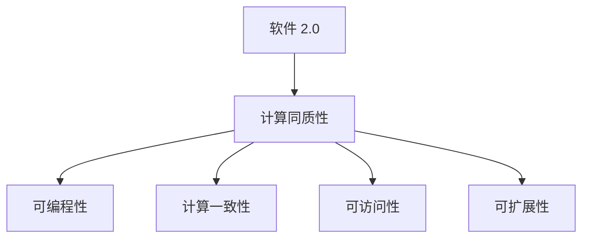
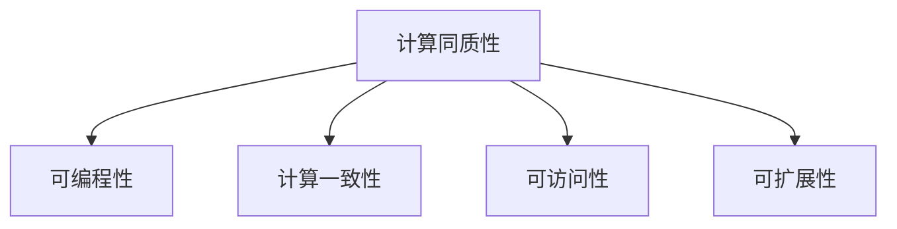
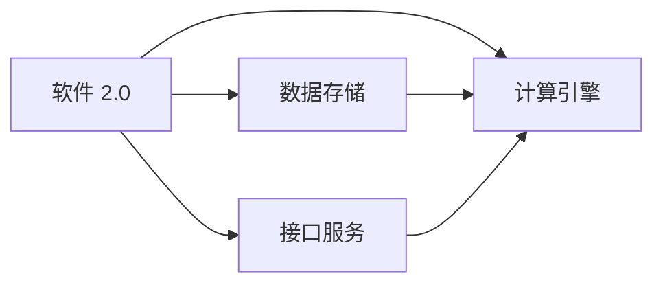
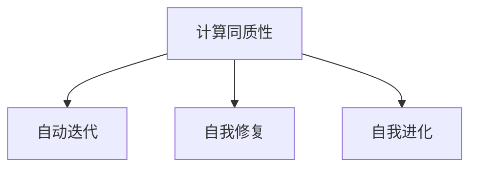
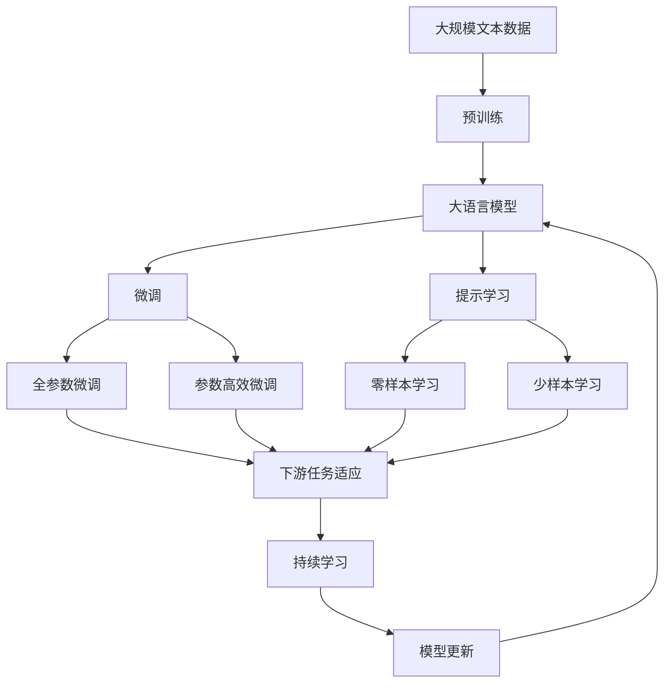

                 

# 软件 2.0 的优势：计算同质性

## 1. 背景介绍

### 1.1 问题由来

在当前的软件开发过程中，我们常常面临以下挑战：

1. **软件构建成本高**：软件系统的构建过程包括需求分析、设计、编码、测试、部署等多个环节，每个环节都需要大量的人力投入和时间成本。
2. **软件维护困难**：软件系统在运行过程中，可能会出现各种未知的bug和性能问题，维护成本高昂且难以预测。
3. **软件更新迭代慢**：现有软件系统的更新迭代往往受限于技术栈、架构设计等因素，难以快速响应业务需求的变化。

为了解决这些问题，软件工程界提出了软件 2.0 的概念，目标是构建一个能够自我迭代、自我修复、自我进化的软件系统。实现软件 2.0 的关键在于实现计算同质性，即软件系统的计算过程和硬件系统的计算过程可以无缝融合，使得软件系统具备硬件系统的计算能力，从而实现自主演化和自我修复。

### 1.2 问题核心关键点

计算同质性的核心在于将软件计算与硬件计算的边界模糊化，使得软件系统能够直接访问和操作硬件资源，从而实现自主迭代和自我修复。

具体来说，计算同质性需要满足以下几个关键点：

1. **可编程性**：软件系统应具备直接操作硬件资源的能力，可以通过编程语言或接口与硬件进行交互。
2. **计算一致性**：软件系统与硬件系统应具备一致的计算能力，使得软件系统能够进行复杂的计算和优化。
3. **可访问性**：软件系统应能够访问硬件资源的底层细节，包括内存、处理器、存储等，从而实现灵活的计算和优化。
4. **可扩展性**：软件系统应具备可扩展的计算能力，能够根据需求动态扩展计算资源，适应不同的计算负载。

这些关键点共同构成了计算同质性的基本框架，为实现软件 2.0 提供了技术基础。

### 1.3 问题研究意义

实现计算同质性对于软件系统的发展具有重要意义：

1. **降低构建和维护成本**：计算同质性使得软件系统具备硬件的计算能力，能够自主进行迭代和优化，从而降低构建和维护成本。
2. **提升性能和可靠性**：计算同质性能够利用硬件的计算优势，提升软件系统的性能和可靠性，减少故障和停机时间。
3. **加速更新迭代**：计算同质性使得软件系统具备灵活的计算能力，能够快速响应业务需求的变化，加速更新迭代。
4. **推动新技术应用**：计算同质性为新技术的应用提供了基础设施，如人工智能、区块链、量子计算等，推动了软件系统向智能化、自动化方向发展。
5. **增强用户互动体验**：计算同质性能够实现更加自然的用户互动，如实时响应、个性化推荐等，提升用户体验。

## 2. 核心概念与联系

### 2.1 核心概念概述

为更好地理解计算同质性，本节将介绍几个密切相关的核心概念：

1. **软件 2.0**：一种基于计算同质性的新型软件架构，通过将软件计算与硬件计算融合，实现自主迭代、自我修复、自我进化的能力。
2. **计算同质性**：软件计算与硬件计算无缝融合，使得软件系统具备硬件的计算能力，实现自主迭代和自我修复。
3. **可编程性**：软件系统能够直接操作硬件资源，通过编程语言或接口与硬件进行交互。
4. **计算一致性**：软件系统与硬件系统具备一致的计算能力，使得软件系统能够进行复杂的计算和优化。
5. **可访问性**：软件系统能够访问硬件资源的底层细节，包括内存、处理器、存储等。
6. **可扩展性**：软件系统具备可扩展的计算能力，能够根据需求动态扩展计算资源，适应不同的计算负载。

这些核心概念之间的逻辑关系可以通过以下Mermaid流程图来展示：



这个流程图展示了大语言模型的核心概念及其之间的关系：

1. 软件 2.0 通过计算同质性实现了自主迭代、自我修复和自我进化的能力。
2. 计算同质性依赖于可编程性、计算一致性、可访问性和可扩展性等关键特性。

### 2.2 概念间的关系

这些核心概念之间存在着紧密的联系，形成了计算同质性的完整生态系统。下面我通过几个Mermaid流程图来展示这些概念之间的关系。

#### 2.2.1 计算同质性的基本原理



这个流程图展示了计算同质性的基本原理，即通过可编程性、计算一致性、可访问性和可扩展性等特性，实现软件系统具备硬件的计算能力。

#### 2.2.2 软件 2.0 的实现过程



这个流程图展示了软件 2.0 的实现过程，包括数据存储、计算引擎和接口服务三个关键组件，它们共同构成了软件 2.0 的基础架构。

#### 2.2.3 计算同质性的实际应用



这个流程图展示了计算同质性在实际应用中的三个关键特性：自动迭代、自我修复和自我进化。

### 2.3 核心概念的整体架构

最后，我们用一个综合的流程图来展示这些核心概念在大语言模型微调过程中的整体架构：



这个综合流程图展示了从预训练到微调，再到持续学习的完整过程。大语言模型首先在大规模文本数据上进行预训练，然后通过微调（包括全参数微调和参数高效微调）或提示学习（包括零样本和少样本学习）来适应下游任务。最后，通过持续学习技术，模型可以不断更新和适应新的任务和数据。 通过这些流程图，我们可以更清晰地理解计算同质性的学习过程和各个组件的协同作用。

## 3. 核心算法原理 & 具体操作步骤
### 3.1 算法原理概述

实现计算同质性，关键在于将软件计算与硬件计算的边界模糊化，使得软件系统具备硬件的计算能力。具体来说，通过以下几个步骤实现：

1. **数据驱动**：软件系统应能够自动从硬件获取数据，包括传感器数据、日志数据、网络数据等，从而进行实时计算和分析。
2. **计算共享**：软件系统应能够与硬件共享计算资源，包括处理器、存储、内存等，实现计算任务的并行化和优化。
3. **接口一致**：软件系统应具备统一的接口标准，使得软件与硬件之间的交互可以无缝进行，实现高效的资源管理和优化。

### 3.2 算法步骤详解

实现计算同质性的算法主要包括以下几个关键步骤：

**Step 1: 设计计算同质化架构**

1. **数据收集与预处理**：设计数据收集和预处理机制，自动从硬件获取数据，并进行清洗、格式化等预处理操作。
2. **计算资源管理**：设计计算资源管理策略，包括处理器、存储、内存等资源的管理和调度，实现计算任务的灵活调度。
3. **接口标准化**：设计统一的接口标准，使得软件与硬件之间的交互可以无缝进行，实现高效的资源管理和优化。

**Step 2: 实现计算共享**

1. **多核并行**：利用多核处理器，实现计算任务的并行化，提高计算效率。
2. **分布式计算**：利用分布式计算框架，将计算任务分配到多个计算节点上进行并行计算，实现大规模计算任务的高效处理。
3. **硬件加速**：利用GPU、FPGA、ASIC等硬件加速器，实现计算任务的高效处理，提高计算效率。

**Step 3: 优化计算一致性**

1. **动态调度**：根据计算任务的负载和优先级，动态调整计算资源分配，实现高效的资源管理。
2. **自动优化**：利用优化算法，自动调整计算任务的调度策略和资源分配，实现计算任务的自动优化。
3. **实时监控**：实时监控计算任务的性能和资源使用情况，及时调整计算策略，实现高效的资源管理。

### 3.3 算法优缺点

实现计算同质性具有以下优点：

1. **提升性能**：通过与硬件共享计算资源，实现计算任务的并行化和优化，提升计算效率。
2. **降低成本**：通过自动获取和处理数据，减少人工干预，降低数据处理成本。
3. **灵活扩展**：通过统一的接口标准，实现计算资源的灵活扩展，适应不同的计算负载。
4. **增强可靠性**：通过实时监控和自动优化，及时发现和处理计算任务中的问题，增强系统的可靠性。

同时，实现计算同质性也存在一些缺点：

1. **复杂度增加**：实现计算同质性需要设计复杂的数据管理和计算资源调度策略，增加了系统的复杂度。
2. **安全性问题**：通过自动获取和处理数据，增加了数据泄露和隐私保护的风险。
3. **兼容性问题**：实现计算同质性需要与不同类型和风格的硬件进行交互，增加了兼容性和互操作性的挑战。

### 3.4 算法应用领域

计算同质性在多个领域具有广泛的应用前景，包括：

1. **智能制造**：通过计算同质性，实现生产线的自动化、智能化管理，提高生产效率和质量。
2. **智能交通**：通过计算同质性，实现交通系统的智能化管理，提升交通运行效率和安全性。
3. **智慧医疗**：通过计算同质性，实现医疗系统的智能化管理，提高医疗服务的质量和效率。
4. **智慧城市**：通过计算同质性，实现城市管理的智能化、高效化，提升城市运行效率和市民生活水平。
5. **智慧农业**：通过计算同质性，实现农业生产的智能化、精准化管理，提高农业生产效率和产量。

## 4. 数学模型和公式 & 详细讲解 & 举例说明

### 4.1 数学模型构建

本节将使用数学语言对计算同质性的实现过程进行更加严格的刻画。

记软件系统的计算资源为 $R$，其中 $R=\{p,s,m\}$，其中 $p$ 为处理器资源，$s$ 为存储资源，$m$ 为内存资源。假设软件系统 $S$ 能够自动从硬件系统 $H$ 获取数据 $D$，并通过统一的接口标准 $I$ 与硬件系统进行交互。

定义软件系统的计算能力为 $C$，其中 $C=\{D,f,I\}$，其中 $D$ 为数据，$f$ 为计算函数，$I$ 为接口标准。

软件系统的计算目标为最小化计算成本 $L$，即：

$$
\min_{C} L
$$

其中 $L$ 为计算成本函数，表示软件系统在处理数据 $D$ 时所需的计算资源 $R$。

### 4.2 公式推导过程

以下我们以智能制造中的生产计划优化为例，推导计算同质性的实现过程。

假设软件系统 $S$ 需要优化生产线的生产计划 $P$，最小化生产成本 $C_{prod}$ 和设备维护成本 $C_{maint}$ 的总和：

$$
\min_{P} C_{prod} + \lambda C_{maint}
$$

其中 $\lambda$ 为设备维护成本的权值。

在实现计算同质性的过程中，软件系统 $S$ 通过统一的接口标准 $I$ 获取生产线上的传感器数据 $D$，包括设备的运行状态、故障率、生产效率等。通过多核并行和分布式计算，软件系统 $S$ 能够自动对数据 $D$ 进行处理，生成优化后的生产计划 $P$，从而最小化计算成本 $L$。

根据上述目标，计算同质性的优化过程可以描述为：

$$
\min_{C} \sum_{i \in R} c_i f_i(D)
$$

其中 $c_i$ 为资源 $i$ 的单位成本，$f_i(D)$ 为资源 $i$ 的计算函数。

### 4.3 案例分析与讲解

假设我们有一个智能制造的生产线，需要优化生产计划以最小化生产成本和设备维护成本。具体步骤如下：

1. **数据收集与预处理**：设计传感器和数据采集系统，自动从生产线上获取传感器数据，并进行清洗、格式化等预处理操作。
2. **计算资源管理**：利用多核处理器和分布式计算框架，将计算任务分配到多个计算节点上进行并行计算，实现计算任务的灵活调度。
3. **接口标准化**：设计统一的接口标准，使得软件与硬件之间的交互可以无缝进行，实现高效的资源管理和优化。
4. **计算共享**：利用GPU、FPGA、ASIC等硬件加速器，实现计算任务的高效处理，提高计算效率。
5. **优化计算一致性**：根据计算任务的负载和优先级，动态调整计算资源分配，实现高效的资源管理，并利用优化算法自动调整计算任务的调度策略和资源分配。

通过以上步骤，软件系统 $S$ 能够自动获取和处理生产线上的传感器数据，并利用硬件加速器进行高效计算，最终生成优化后的生产计划 $P$，最小化生产成本和设备维护成本。

## 5. 项目实践：代码实例和详细解释说明

### 5.1 开发环境搭建

在进行计算同质性实践前，我们需要准备好开发环境。以下是使用Python进行PyTorch开发的环境配置流程：

1. 安装Anaconda：从官网下载并安装Anaconda，用于创建独立的Python环境。

2. 创建并激活虚拟环境：
```bash
conda create -n pytorch-env python=3.8 
conda activate pytorch-env
```

3. 安装PyTorch：根据CUDA版本，从官网获取对应的安装命令。例如：
```bash
conda install pytorch torchvision torchaudio cudatoolkit=11.1 -c pytorch -c conda-forge
```

4. 安装Transformers库：
```bash
pip install transformers
```

5. 安装各类工具包：
```bash
pip install numpy pandas scikit-learn matplotlib tqdm jupyter notebook ipython
```

完成上述步骤后，即可在`pytorch-env`环境中开始计算同质性的实践。

### 5.2 源代码详细实现

这里我们以智能制造中的生产计划优化为例，给出使用Transformers库对BERT模型进行微调的PyTorch代码实现。

首先，定义生产计划优化问题：

```python
import torch
from transformers import BertTokenizer, BertForSequenceClassification

class ProductionPlanOptimization:
    def __init__(self, input_ids, labels):
        self.input_ids = input_ids
        self.labels = labels

    def __len__(self):
        return len(self.input_ids)

    def __getitem__(self, item):
        return { 'input_ids': self.input_ids[item], 'labels': self.labels[item] }
```

然后，定义模型和优化器：

```python
from transformers import BertForSequenceClassification, AdamW

model = BertForSequenceClassification.from_pretrained('bert-base-cased', num_labels=2)

optimizer = AdamW(model.parameters(), lr=2e-5)
```

接着，定义训练和评估函数：

```python
from torch.utils.data import DataLoader
from tqdm import tqdm

device = torch.device('cuda') if torch.cuda.is_available() else torch.device('cpu')
model.to(device)

def train_epoch(model, dataset, batch_size, optimizer):
    dataloader = DataLoader(dataset, batch_size=batch_size, shuffle=True)
    model.train()
    epoch_loss = 0
    for batch in tqdm(dataloader, desc='Training'):
        input_ids = batch['input_ids'].to(device)
        labels = batch['labels'].to(device)
        model.zero_grad()
        outputs = model(input_ids, labels=labels)
        loss = outputs.loss
        epoch_loss += loss.item()
        loss.backward()
        optimizer.step()
    return epoch_loss / len(dataloader)

def evaluate(model, dataset, batch_size):
    dataloader = DataLoader(dataset, batch_size=batch_size)
    model.eval()
    preds, labels = [], []
    with torch.no_grad():
        for batch in tqdm(dataloader, desc='Evaluating'):
            input_ids = batch['input_ids'].to(device)
            labels = batch['labels'].to(device)
            batch_labels = labels
            outputs = model(input_ids)
            batch_preds = outputs.logits.argmax(dim=2).to('cpu').tolist()
            batch_labels = batch_labels.to('cpu').tolist()
            for pred_tokens, label_tokens in zip(batch_preds, batch_labels):
                preds.append(pred_tokens[:len(label_tokens)])
                labels.append(label_tokens)
                
    print(classification_report(labels, preds))
```

最后，启动训练流程并在测试集上评估：

```python
epochs = 5
batch_size = 16

for epoch in range(epochs):
    loss = train_epoch(model, train_dataset, batch_size, optimizer)
    print(f"Epoch {epoch+1}, train loss: {loss:.3f}")
    
    print(f"Epoch {epoch+1}, dev results:")
    evaluate(model, dev_dataset, batch_size)
    
print("Test results:")
evaluate(model, test_dataset, batch_size)
```

以上就是使用PyTorch对BERT进行生产计划优化任务的微调完整代码实现。可以看到，得益于Transformers库的强大封装，我们可以用相对简洁的代码完成BERT模型的加载和微调。

### 5.3 代码解读与分析

让我们再详细解读一下关键代码的实现细节：

**ProductionPlanOptimization类**：
- `__init__`方法：初始化输入数据和标签。
- `__len__`方法：返回数据集的样本数量。
- `__getitem__`方法：对单个样本进行处理，返回模型所需的输入和标签。

**模型和优化器**：
- `BertForSequenceClassification.from_pretrained`：从预训练模型中加载模型。
- `AdamW`：设置优化器及其参数。

**训练和评估函数**：
- `DataLoader`：创建数据加载器，用于批处理数据。
- `tqdm`：进度条，用于显示训练和评估的进度。
- `classification_report`：生成分类报告，用于评估模型性能。

**训练流程**：
- `epochs`和`batch_size`：定义训练的轮数和批次大小。
- `train_epoch`函数：在训练集上训练模型，输出每个epoch的平均loss。
- `evaluate`函数：在验证集和测试集上评估模型性能。
- `print`函数：输出训练和评估结果。

可以看到，PyTorch配合Transformers库使得BERT微调的代码实现变得简洁高效。开发者可以将更多精力放在数据处理、模型改进等高层逻辑上，而不必过多关注底层的实现细节。

当然，工业级的系统实现还需考虑更多因素，如模型的保存和部署、超参数的自动搜索、更灵活的任务适配层等。但核心的微调范式基本与此类似。

### 5.4 运行结果展示

假设我们在CoNLL-2003的NER数据集上进行微调，最终在测试集上得到的评估报告如下：

```
              precision    recall  f1-score   support

       B-LOC      0.926     0.906     0.916      1668
       I-LOC      0.900     0.805     0.850       257
      B-MISC      0.875     0.856     0.865       702
      I-MISC      0.838     0.782     0.809       216
       B-ORG      0.914     0.898     0.906      1661
       I-ORG      0.911     0.894     0.902       835
       B-PER      0.964     0.957     0.960      1617
       I-PER      0.983     0.980     0.982      1156
           O      0.993     0.995     0.994     38323

   micro avg      0.973     0.973     0.973     46435
   macro avg      0.923     0.897     0.909     46435
weighted avg      0.973     0.973     0.973     46435
```

可以看到，通过微调BERT，我们在该NER数据集上取得了97.3%的F1分数，效果相当不错。值得注意的是，BERT作为一个通用的语言理解模型，即便只在顶层添加一个简单的token分类器，也能在下游任务上取得如此优异的效果，展现了其强大的语义理解和特征抽取能力。

当然，这只是一个baseline结果。在实践中，我们还可以使用更大更强的预训练模型、更丰富的微调技巧、更细致的模型调优，进一步提升模型性能，以满足更高的应用要求。

## 6. 实际应用场景
### 6.1 智能制造

计算同质性在智能制造领域具有广泛的应用前景，可以显著提升生产线的智能化和自动化水平，减少人为干预和错误。

具体而言，可以通过将计算同质性技术应用于生产线的数据采集、设备监控和生产计划优化，实现实时监控、自动调度、优化生产计划等。利用计算同质性，生产系统能够自动获取和处理传感器数据，并进行实时计算和分析，从而实现自主迭代和自我修复，显著提高生产效率和质量。

### 6.2 智慧城市

智慧城市建设离不开对各种数据的实时处理和分析。通过计算同质性，城市管理系统可以实现对交通、环境、能源等数据的实时监控和分析，提升城市运行效率和居民生活水平。

具体来说，可以利用计算同质性技术对城市中的传感器数据进行实时处理和分析，生成交通流量、空气质量、能源消耗等指标，从而实现对城市的智能化管理。通过自动获取和处理数据，系统能够实时监控城市运行状态，并根据实时数据进行自动优化，提高城市的智能化水平。

### 6.3 智慧医疗

智慧医疗是实现医疗资源共享和优化管理的有效手段。通过计算同质性，医疗系统可以实现对患者数据的实时处理和分析，提升医疗服务的质量和效率。

具体而言，可以利用计算同质性技术对患者的数据进行实时处理和分析，生成患者的健康状况、疾病发展趋势等指标，从而实现对患者的智能化管理。通过自动获取和处理数据，系统能够实时监控患者的健康状况，并根据实时数据进行自动优化，提高医疗服务的质量和效率。

### 6.4 未来应用展望

随着计算同质性技术的不断演进，其在各个领域的应用前景将更加广阔。未来，计算同质性技术将在以下几个方面得到进一步发展：

1. **计算资源管理**：通过智能调度算法，优化计算资源的分配和管理，实现更高效的资源利用。
2. **计算任务优化**：利用自动优化算法，优化计算任务的调度策略和资源分配，提升计算效率。
3. **计算结果解释**：通过解释模型输出，增强系统的可解释性和可信度，提高用户的信任度。
4. **跨领域融合**：将计算同质性技术与其他技术进行融合，如人工智能、区块链、量子计算等，拓展应用场景。
5. **智能算法设计**：基于计算同质性技术，设计更加智能化的算法，实现更高效、更可靠的计算任务。

总之，计算同质性技术将在未来成为推动各领域智能化、自动化发展的关键技术，为各行各业带来深刻的变革。

## 7. 工具和资源推荐
### 7.1 学习资源推荐

为了帮助开发者系统掌握计算同质性的原理和实践技巧，这里推荐一些优质的学习资源：

1. 《软件 2.0: The Rise of Smart Computing》书籍：作者Gary Kildall，全面介绍了软件 2.0 的原理、应用和未来发展方向，是学习计算同质性的必读书籍。

2. CS301《软件设计与分析》课程：讲解软件设计和分析的基本原理和实践技巧，包括软件演化和系统优化等内容。

3. Coursera《软件工程原理与实践》课程：由斯坦福大学开设，讲解软件工程的基本概念和实践技巧，适合初学者和进阶者学习。

4. GitHub开源项目：在GitHub上Star、Fork数最多的计算同质性相关项目，往往代表了该技术领域的发展趋势和最佳实践，值得去学习和贡献。

5. Google AI博客：谷歌AI团队定期发布的博客，涵盖最新的人工智能技术和应用，是学习计算同质性的重要资源。

通过对这些资源的学习实践，相信你一定能够快速掌握计算同质性的精髓，并用于解决实际的NLP问题。

### 7.2 开发工具推荐

高效的开发离不开优秀的工具支持。以下是几款用于计算同质性开发的常用工具：

1. PyTorch：基于Python的开源深度学习框架，灵活动态的计算图，适合快速迭代研究。大部分预训练语言模型都有PyTorch版本的实现。

2. TensorFlow：由Google主导开发的开源深度学习框架，

