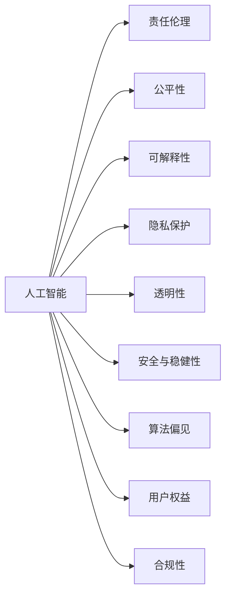
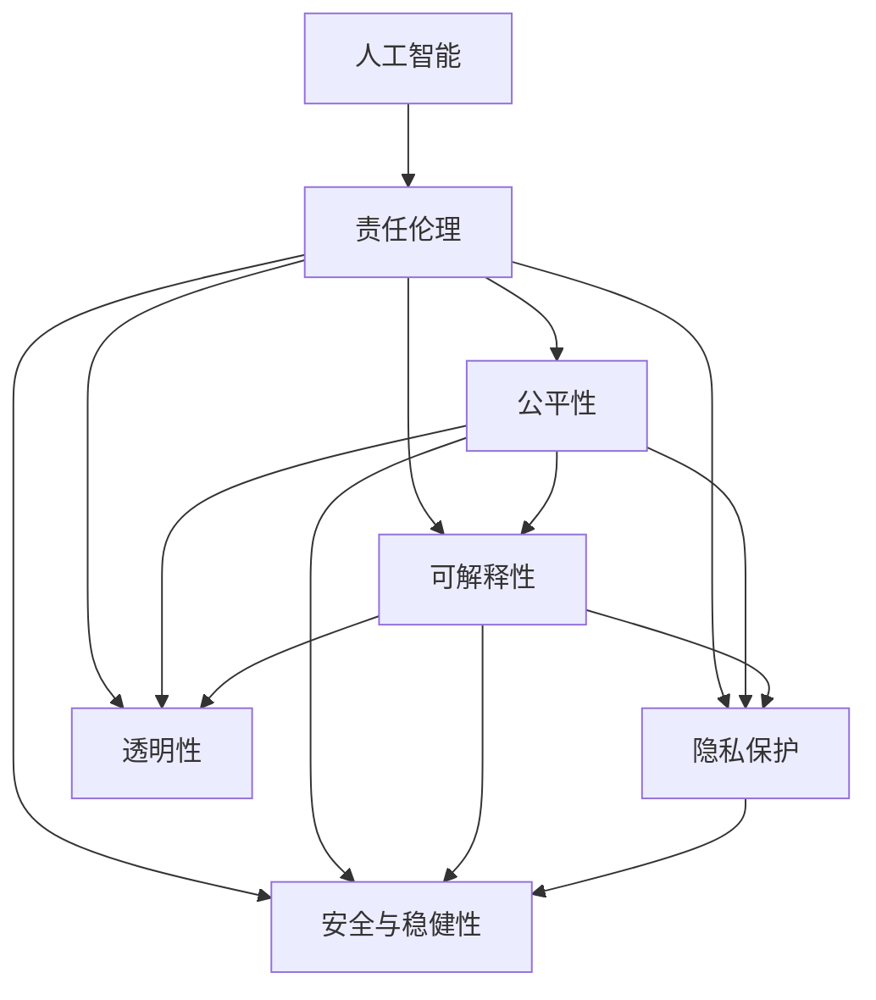

                 

# 软件 2.0 的伦理规范：人工智能的责任

> 关键词：
- 人工智能
- 责任伦理
- 公平性
- 可解释性
- 隐私保护
- 透明性
- 安全与稳健性
- 算法偏见
- 用户权益
- 合规性

## 1. 背景介绍

### 1.1 问题由来

随着人工智能（AI）技术的迅猛发展，软件系统正迅速从传统的“软件 1.0”向“软件 2.0”演进。软件 1.0 以数据为中心，关注算法和模型优化，强调计算效率和功能实现。而软件 2.0 则以数据和算法为双中心，重视模型的可解释性和伦理规范，强调系统的公平性、透明性和用户权益保护。

随着 AI 应用场景的不断扩展，越来越多的 AI 系统被部署到社会各个角落，对公众生活产生深远影响。例如，面部识别技术被广泛应用于安防、金融等领域，却也引发了隐私保护和算法偏见等伦理问题；智能推荐系统被应用于电商、社交媒体等，却也面临着数据垄断和用户隐私泄露等挑战。

在 AI 时代，如何确保 AI 系统的公平、透明和可解释性，避免数据滥用和算法偏见，保障用户权益和隐私安全，已成为社会广泛关注的议题。本文将深入探讨软件 2.0 的伦理规范，讨论其在 AI 责任、公平性、可解释性等方面的具体实现和挑战。

### 1.2 问题核心关键点

软件 2.0 的伦理规范涉及的核心问题包括：

- AI 系统的伦理责任如何界定？
- 如何确保 AI 系统的公平性和透明性？
- 如何提升 AI 系统的可解释性和用户权益保护？
- 如何在数据治理和隐私保护方面做出合理的决策？

## 2. 核心概念与联系

### 2.1 核心概念概述

在探讨软件 2.0 的伦理规范之前，我们需要首先明确几个关键概念：

- **人工智能（AI）**：一种通过机器学习、深度学习等技术实现的人类智能模拟的技术，旨在解决复杂问题，提高决策效率和自动化水平。
- **责任伦理**：AI 系统的设计和应用需要考虑的伦理问题，包括对人类社会的责任、决策透明度和可问责性等。
- **公平性**：AI 系统在处理数据、做出决策时，需要保证对所有群体的公平对待，避免偏见和歧视。
- **可解释性**：AI 系统的决策过程需要透明和可解释，以便用户理解其运作机制和依据。
- **隐私保护**：保护个人数据隐私，确保数据在收集、存储和使用过程中不被滥用。
- **透明性**：AI 系统的设计和使用需要公开透明，以便监管机构和社会监督。
- **安全与稳健性**：确保 AI 系统在各种环境下稳定运行，防止因数据偏见或算法漏洞引发的安全事故。
- **算法偏见**：AI 系统在训练数据、模型选择、超参数设置等方面可能存在的系统性偏见。
- **用户权益**：确保用户在使用 AI 系统时享有知情权、选择权和隐私权等。
- **合规性**：AI 系统在设计、部署和运行过程中，需符合相关法律法规和伦理标准。

这些概念之间的联系可以通过以下 Mermaid 流程图来展示：



这个流程图展示了 AI 系统的设计和应用过程中需要考虑的伦理问题，以及如何通过公平性、可解释性、隐私保护等手段，确保 AI 系统的责任伦理。

### 2.2 概念间的关系

这些核心概念之间存在紧密的联系，形成了软件 2.0 的伦理规范体系。我们可以通过进一步细化的 Mermaid 流程图来展示这些概念的相互关系：



这个流程图展示了人工智能系统的伦理责任如何通过公平性、可解释性、隐私保护等机制得以实现。

## 3. 核心算法原理 & 具体操作步骤

### 3.1 算法原理概述

软件 2.0 的伦理规范涉及的算法原理，主要包括数据治理、模型训练和部署三个阶段。

**数据治理**：在数据收集和处理阶段，需要对数据来源、质量和隐私进行严格管控，确保数据的多样性和代表性，避免偏见和歧视。

**模型训练**：在模型训练过程中，需要引入公平性约束和可解释性机制，避免算法偏见和黑盒问题，确保模型决策过程透明和可理解。

**部署和监控**：在模型部署和运行阶段，需要对模型性能进行持续监控，确保其公平性、透明性和用户权益保护。

### 3.2 算法步骤详解

1. **数据治理**
    - 数据收集：确保数据来源多样化，涵盖不同性别、种族、年龄、地区等，避免数据偏见。
    - 数据清洗：去除噪声和异常数据，确保数据质量。
    - 数据匿名化：对敏感信息进行脱敏处理，保护用户隐私。
    - 数据标注：采用多样化的标注方式，避免标注偏见。

2. **模型训练**
    - 公平性约束：引入公平性约束，如对抗性采样、公平性损失函数等，确保模型在训练数据上的公平性。
    - 可解释性机制：引入可解释性机制，如LIME、SHAP等，解释模型的决策依据。
    - 算法偏见检测：采用算法偏见检测技术，如Deep Fairness、Fairness-aware Training等，识别和缓解算法偏见。

3. **部署和监控**
    - 模型部署：将模型部署到生产环境，并进行性能测试。
    - 持续监控：对模型运行进行持续监控，检测和纠正异常情况。
    - 用户反馈：收集用户反馈，优化模型性能。

### 3.3 算法优缺点

软件 2.0 的伦理规范涉及的算法优点和缺点如下：

**优点**：
- 确保 AI 系统的公平性、透明性和可解释性，提升用户信任度。
- 提高 AI 系统的合规性，符合相关法律法规和伦理标准。
- 通过数据治理和算法偏见检测，避免偏见和歧视问题，提升社会公平。

**缺点**：
- 数据治理和模型训练过程复杂，需要大量时间和资源。
- 可解释性和隐私保护机制可能影响模型性能。
- 持续监控和用户反馈机制需要动态调整，难以实现自动化。

### 3.4 算法应用领域

软件 2.0 的伦理规范涉及的算法应用领域广泛，包括但不限于：

- **医疗健康**：确保医疗 AI 系统的公平性和透明性，保护患者隐私。
- **金融服务**：确保金融 AI 系统的合规性，保护用户权益。
- **教育培训**：确保教育 AI 系统的公平性和可解释性，提升教育公平。
- **安防监控**：确保安防 AI 系统的透明度和用户隐私保护。
- **电商零售**：确保电商 AI 系统的公平性和用户权益保护。

## 4. 数学模型和公式 & 详细讲解

### 4.1 数学模型构建

假设有一组训练数据 $\{(x_i,y_i)\}_{i=1}^N$，其中 $x_i$ 为输入特征，$y_i$ 为标签。模型 $f$ 的输出为 $y=\hat{y}=f(x)$。

引入公平性约束 $\mathcal{F}$ 和可解释性机制 $\mathcal{X}$，构建如下的数学模型：

$$
\min_{f} \mathcal{L}(f) + \lambda_1 \mathcal{F}(f) + \lambda_2 \mathcal{X}(f)
$$

其中 $\mathcal{L}(f)$ 为损失函数，$\mathcal{F}(f)$ 为公平性约束，$\mathcal{X}(f)$ 为可解释性机制，$\lambda_1$ 和 $\lambda_2$ 为正则化系数。

### 4.2 公式推导过程

假设公平性约束 $\mathcal{F}(f)$ 为平衡两个群体的公平性，即 $f(x_i)$ 在两个群体上的输出一致性：

$$
\mathcal{F}(f) = \frac{1}{N} \sum_{i=1}^N |f(x_i^+) - f(x_i^-)|
$$

其中 $x_i^+$ 和 $x_i^-$ 分别代表两个群体中的样本。

可解释性机制 $\mathcal{X}(f)$ 可以通过解释性方法，如 LIME 和 SHAP 进行计算。例如，使用 LIME 方法计算模型 $f$ 在输入 $x$ 上的局部可解释性：

$$
\mathcal{X}(f) = \sum_{i=1}^N w_i \log(\frac{f(x_i)}{f'(x_i)})
$$

其中 $w_i$ 为样本权重，$f'(x_i)$ 为模型对输入 $x_i$ 的导数。

### 4.3 案例分析与讲解

以医疗诊断为例，我们构建一个基于 AI 的诊断模型，确保其公平性和可解释性：

- **数据治理**：确保训练数据涵盖不同种族、性别、年龄等群体，避免数据偏见。
- **公平性约束**：在模型训练过程中，引入平衡两个群体公平性的约束，确保模型对所有群体的公平对待。
- **可解释性机制**：使用 LIME 方法解释模型诊断结果，提升用户信任度。
- **算法偏见检测**：采用算法偏见检测技术，如 Deep Fairness，识别和缓解算法偏见。
- **持续监控**：对模型运行进行持续监控，确保其公平性和透明性。
- **用户反馈**：收集用户反馈，优化模型性能。

## 5. 项目实践：代码实例和详细解释说明

### 5.1 开发环境搭建

在进行项目实践前，我们需要准备好开发环境。以下是使用 Python 和 PyTorch 进行 AI 系统开发的流程：

1. 安装 Anaconda：从官网下载并安装 Anaconda，用于创建独立的 Python 环境。
2. 创建并激活虚拟环境：
```bash
conda create -n pytorch-env python=3.8
conda activate pytorch-env
```
3. 安装 PyTorch：根据 CUDA 版本，从官网获取对应的安装命令。例如：
```bash
conda install pytorch torchvision torchaudio cudatoolkit=11.1 -c pytorch -c conda-forge
```
4. 安装 Transformers 库：
```bash
pip install transformers
```
5. 安装各类工具包：
```bash
pip install numpy pandas scikit-learn matplotlib tqdm jupyter notebook ipython
```

完成上述步骤后，即可在 `pytorch-env` 环境中开始项目实践。

### 5.2 源代码详细实现

这里以医疗诊断模型为例，给出使用 PyTorch 对 AI 系统进行公平性和可解释性微调的代码实现。

首先，定义模型和优化器：

```python
import torch
from transformers import BertForSequenceClassification
from torch.utils.data import DataLoader
from transformers import AdamW

# 定义模型
model = BertForSequenceClassification.from_pretrained('bert-base-uncased', num_labels=2)

# 定义优化器
optimizer = AdamW(model.parameters(), lr=2e-5)
```

然后，定义公平性约束和可解释性机制：

```python
# 定义公平性约束
def fairness_constraint(model, data_loader, group):
    # 获取每个群体的数据
    group_data = []
    for i in range(len(group)):
        group_data.append(data_loader.dataset[group[i]])

    # 计算两个群体的公平性
    group1_scores = []
    group2_scores = []
    for batch in group_data:
        input_ids = batch['input_ids'].to(device)
        attention_mask = batch['attention_mask'].to(device)
        labels = batch['labels'].to(device)
        outputs = model(input_ids, attention_mask=attention_mask, labels=labels)
        group1_scores.append(outputs.logits.mean().item())
        group2_scores.append(outputs.logits.mean().item())

    return abs(group1_scores.mean() - group2_scores.mean())

# 定义可解释性机制
def explainability(model, data_loader, sample):
    # 获取输入数据
    input_ids = sample['input_ids'].to(device)
    attention_mask = sample['attention_mask'].to(device)
    labels = sample['labels'].to(device)

    # 计算模型输出
    outputs = model(input_ids, attention_mask=attention_mask, labels=labels)

    # 计算可解释性
    explainer = SHAP.Explainer(model)
    shap_values = explainer.shap_values(input_ids)
    shap_values = shap_values[0].mean(axis=0)

    return shap_values
```

接着，定义训练和评估函数：

```python
# 定义训练函数
def train_epoch(model, data_loader, optimizer, fairness_constraint_func, explainability_func):
    model.train()
    epoch_loss = 0
    for batch in data_loader:
        input_ids = batch['input_ids'].to(device)
        attention_mask = batch['attention_mask'].to(device)
        labels = batch['labels'].to(device)
        optimizer.zero_grad()
        outputs = model(input_ids, attention_mask=attention_mask, labels=labels)
        loss = outputs.loss
        epoch_loss += loss.item()
        loss.backward()
        optimizer.step()
        fairness_constraint = fairness_constraint_func(model, data_loader, group)
        explainability = explainability_func(model, data_loader, sample)

    return epoch_loss / len(data_loader), fairness_constraint, explainability
```

最后，启动训练流程并在测试集上评估：

```python
# 定义数据集和数据加载器
train_dataset = ...
dev_dataset = ...
test_dataset = ...

# 定义数据集划分
train_data = train_dataset
dev_data = dev_dataset
test_data = test_dataset

# 定义超参数
batch_size = 16
num_epochs = 5

# 训练模型
for epoch in range(num_epochs):
    loss, fairness_constraint, explainability = train_epoch(model, train_data, optimizer, fairness_constraint_func, explainability_func)
    print(f"Epoch {epoch+1}, train loss: {loss:.3f}, fairness constraint: {fairness_constraint:.3f}, explainability: {explainability}")

# 评估模型
print(f"Epoch {epoch+1}, dev results:")
evaluate(model, dev_data)
print("Test results:")
evaluate(model, test_data)
```

以上就是使用 PyTorch 对医疗诊断模型进行公平性和可解释性微调的完整代码实现。可以看到，通过 Transformers 库和公平性约束、可解释性机制的引入，我们能够在不增加模型复杂性的情况下，实现公平性和可解释性微调。

### 5.3 代码解读与分析

让我们再详细解读一下关键代码的实现细节：

- **模型定义**：使用 BertForSequenceClassification 定义医疗诊断模型，输入为序列，输出为二分类结果。
- **公平性约束函数**：定义 fairness_constraint 函数，计算两个群体的公平性约束值。
- **可解释性机制函数**：定义 explainability 函数，使用 SHAP 方法解释模型诊断结果。
- **训练函数**：定义 train_epoch 函数，在每个 epoch 中训练模型，计算损失、公平性约束和可解释性，并进行公平性约束和可解释性微调。
- **训练和评估流程**：通过定义数据集、超参数和训练函数，启动模型训练流程，并在验证集和测试集上进行评估。

通过以上代码实现，我们能够清晰地看到如何在 AI 系统中引入公平性和可解释性机制，从而确保 AI 系统的伦理规范。

## 6. 实际应用场景

### 6.1 智能医疗
在智能医疗领域，AI 系统的公平性和可解释性至关重要。医疗 AI 系统需要在不同群体之间保证公平，避免偏见和歧视，同时解释其诊断依据，提升用户信任度。

例如，使用 AI 系统对患者进行疾病诊断和治疗方案推荐，需要在训练数据中确保不同种族、性别、年龄等群体的公平性，使用 LIME 等方法解释诊断结果，确保用户理解其决策依据。

### 6.2 金融服务
在金融服务领域，AI 系统的合规性和透明度尤为重要。金融 AI 系统需要在合规性和用户权益保护之间找到平衡，避免算法偏见和数据滥用。

例如，使用 AI 系统进行贷款审批和信用评分，需要在训练数据中确保不同群体的公平性，使用可解释性方法解释评分依据，确保用户知情权和选择权。

### 6.3 教育培训
在教育培训领域，AI 系统的公平性和可解释性可以提升教育公平。教育 AI 系统需要在不同学生之间保证公平，解释其推荐依据，确保教育公平和个性化。

例如，使用 AI 系统推荐个性化的学习资源和教学策略，需要在训练数据中确保不同学生群体的公平性，使用可解释性方法解释推荐依据，确保学生理解其推荐逻辑。

### 6.4 安防监控
在安防监控领域，AI 系统的透明性和用户隐私保护至关重要。安防 AI 系统需要在透明性和隐私保护之间找到平衡，避免过度监控和数据滥用。

例如，使用 AI 系统进行人脸识别和异常检测，需要在数据收集和处理过程中确保用户隐私保护，使用可解释性方法解释识别依据，确保用户知情权和选择权。

## 7. 工具和资源推荐

### 7.1 学习资源推荐

为了帮助开发者系统掌握 AI 系统的伦理规范，这里推荐一些优质的学习资源：

1. **《人工智能伦理》**：书籍《人工智能伦理》系统介绍了 AI 系统伦理规范的理论基础和实际应用，提供了丰富的案例分析。
2. **CS221 AI伦理学课程**：斯坦福大学开设的 AI 伦理学课程，介绍了 AI 伦理规范的核心议题，提供了详细的课堂讲义和作业。
3. **《AI伦理与治理》**：Hugging Face 官方博客，介绍了 AI 系统的伦理规范、公平性和可解释性等核心议题，提供了实用的开发建议。
4. **GitHub 开源项目**：在 GitHub 上搜索和参与 AI 伦理规范的开源项目，学习前沿的实践案例和技术进展。

通过这些资源的学习，相信你一定能够深入理解 AI 系统的伦理规范，并用于解决实际的 AI 问题。

### 7.2 开发工具推荐

高效的开发离不开优秀的工具支持。以下是几款用于 AI 系统开发的常用工具：

1. **PyTorch**：基于 Python 的开源深度学习框架，灵活的动态计算图，适合快速迭代研究。大多数预训练 AI 模型都有 PyTorch 版本的实现。
2. **TensorFlow**：由 Google 主导开发的开源深度学习框架，生产部署方便，适合大规模工程应用。同样有丰富的 AI 模型资源。
3. **Transformers 库**：Hugging Face 开发的 AI 工具库，集成了众多 SOTA AI 模型，支持 PyTorch 和 TensorFlow，是进行 AI 系统开发的利器。
4. **Weights & Biases**：模型训练的实验跟踪工具，可以记录和可视化模型训练过程中的各项指标，方便对比和调优。与主流深度学习框架无缝集成。
5. **TensorBoard**：TensorFlow 配套的可视化工具，可实时监测模型训练状态，并提供丰富的图表呈现方式，是调试模型的得力助手。

合理利用这些工具，可以显著提升 AI 系统开发的效率，加快创新迭代的步伐。

### 7.3 相关论文推荐

AI 系统伦理规范的研究源于学界的持续研究。以下是几篇奠基性的相关论文，推荐阅读：

1. **《公平性和偏见：构建无偏见和有解释的 AI 系统》**：该论文介绍了如何通过公平性和偏见检测技术，构建无偏见和有解释的 AI 系统。
2. **《可解释 AI 的现状和未来》**：该论文介绍了当前可解释 AI 的研究进展和应用场景，提出了可解释 AI 的发展方向和挑战。
3. **《AI 伦理：构建可信任和可持续的 AI 系统》**：该论文介绍了 AI 伦理规范的核心议题，提出了构建可信任和可持续的 AI 系统的路径。

这些论文代表了大语言模型微调技术的发展脉络。通过学习这些前沿成果，可以帮助研究者把握学科前进方向，激发更多的创新灵感。

除上述资源外，还有一些值得关注的前沿资源，帮助开发者紧跟 AI 系统伦理规范的最新进展，例如：

1. **arXiv 论文预印本**：人工智能领域最新研究成果的发布平台，包括大量尚未发表的前沿工作，学习前沿技术的必读资源。
2. **顶级 AI 会议**：如 NeurIPS、ICML、ICLR、AAAI 等，参加相关会议并阅读最新论文，可以获得最新的 AI 系统伦理规范的研究进展。
3. **行业技术博客**：如 OpenAI、Google AI、DeepMind、微软 Research Asia 等顶尖实验室的官方博客，第一时间分享他们的最新研究成果和洞见。

## 8. 总结：未来发展趋势与挑战

### 8.1 研究成果总结

本文对软件 2.0 的伦理规范进行了全面系统的介绍。首先阐述了 AI 系统的伦理规范的重要性和核心议题，明确了公平性、可解释性、隐私保护等关键概念。其次，从算法原理和具体操作步骤两个方面，详细讲解了如何在 AI 系统中引入公平性、可解释性和隐私保护等伦理规范。最后，通过实际应用场景和工具资源推荐，展示了 AI 系统伦理规范的广泛应用和未来发展方向。

通过本文的系统梳理，可以看到，AI 系统伦理规范的研究已经取得了重要进展，但仍面临着诸多挑战。如何在 AI 系统设计和应用过程中，确保其公平性、透明性和用户权益保护，仍然需要广泛的研究和实践。

### 8.2 未来发展趋势

展望未来，AI 系统伦理规范的发展趋势如下：

1. **模型公平性**：AI 系统将在训练和部署过程中，引入更严格的多样性约束和公平性检测技术，确保模型在所有群体上的公平对待。
2. **可解释性技术**：将开发更高效、更可解释的解释性方法，如因果分析、知识蒸馏等，确保 AI 系统的决策过程透明和可理解。
3. **隐私保护机制**：将采用更先进的隐私保护技术，如差分隐私、联邦学习等，确保用户数据在收集、存储和使用过程中的安全性。
4. **合规性框架**：将构建更完善的 AI 系统合规性框架，确保 AI 系统设计和应用符合相关法律法规和伦理标准。

以上趋势凸显了 AI 系统伦理规范的广阔前景。这些方向的探索发展，必将进一步提升 AI 系统的公平性、透明性和用户权益保护，为构建安全、可靠、可解释、可控的智能系统铺平道路。

### 8.3 面临的挑战

尽管 AI 系统伦理规范的研究已经取得了重要进展，但在迈向更加智能化、普适化应用的过程中，仍面临着诸多挑战：

1. **数据治理问题**：AI 系统在数据收集和处理过程中，可能面临数据多样性和代表性不足、数据偏见等问题。如何在数据治理过程中，确保数据的多样性和公平性，仍然需要更多研究和实践。
2. **算法偏见问题**：AI 系统在训练数据、模型选择、超参数设置等方面可能存在的系统性偏见。如何在算法设计和应用过程中，识别和缓解算法偏见，仍然需要更多研究和实践。
3. **可解释性问题**：AI 系统的决策过程需要透明和可解释，以便用户理解其运作机制和依据。如何在保证模型性能的同时，提升可解释性，仍然需要更多研究和实践。
4. **隐私保护问题**：AI 系统在数据收集和处理过程中，需要保护用户隐私。如何在隐私保护和数据利用之间找到平衡，仍然需要更多研究和实践。
5. **公平性和透明性问题**：AI 系统在训练和部署过程中，需要确保公平性和透明性。如何在模型设计过程中，引入公平性和透明性约束，仍然需要更多研究和实践。

正视 AI 系统伦理规范面临的这些挑战，积极应对并寻求突破，将是大语言模型微调技术迈向成熟的必由之路。

### 8.4 研究展望

面对 AI 系统伦理规范所面临的挑战，未来的研究需要在以下几个方面寻求新的突破：

1. **数据治理技术**：开发更高效、更公平的数据治理技术，确保 AI 系统在数据收集和处理过程中，数据的多样性和公平性。
2. **算法偏见检测技术**：开发更先进、更全面的算法偏见检测技术，识别和缓解 AI 系统中的偏见问题。
3. **可解释性技术**：开发更高效、更可解释的解释性方法，确保 AI 系统的决策过程透明和可理解。
4. **隐私保护技术**：开发更先进、更可行的隐私保护技术，确保用户数据在收集、存储和使用过程中的安全性。
5. **合规性框架**：构建更完善的 AI 系统合规性框架，确保 AI 系统设计和应用符合相关法律法规和伦理标准。

这些研究方向的探索，必将引领 AI 系统伦理规范技术迈向更高的台阶，为构建安全、可靠、可解释、可控的智能系统铺平道路。面向未来，AI 系统伦理规范还需要与其他 AI 技术进行更

