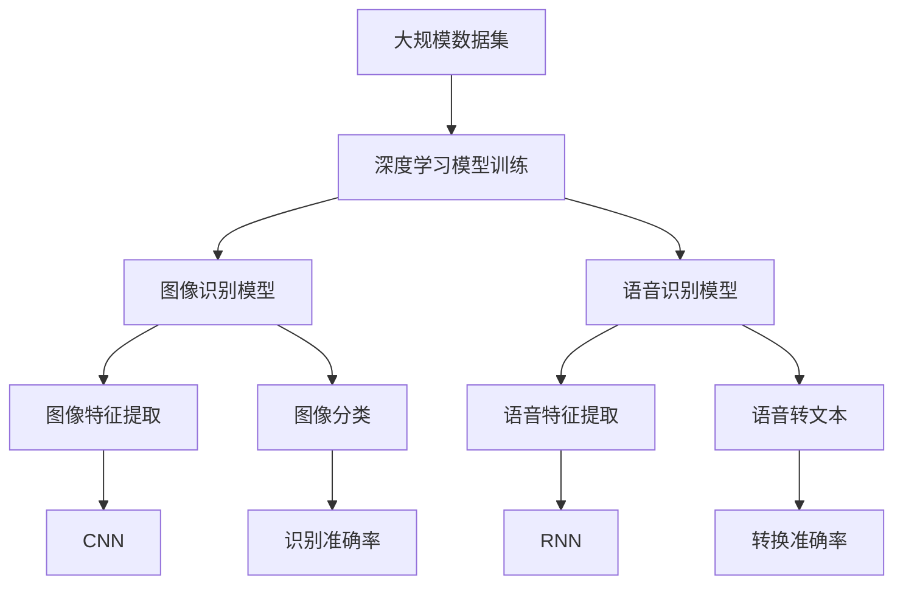

                 

# 软件 2.0 的应用领域：图像识别、语音识别

> 关键词：图像识别, 语音识别, 深度学习, 卷积神经网络(CNN), 循环神经网络(RNN), 自然语言处理(NLP)

## 1. 背景介绍

### 1.1 问题由来
随着人工智能技术的不断进步，图像识别和语音识别已经从科学研究的实验室走进了人们的日常生活。如今，无论是智能手机、智能家居，还是无人驾驶、医疗诊断等领域，图像识别和语音识别技术的应用无处不在。它们已经成为现代信息社会不可或缺的重要组成部分。

### 1.2 问题核心关键点
图像识别和语音识别技术的核心关键点在于其强大的数据处理能力、高精度的识别准确率和广泛的适用性。其中，深度学习技术是实现这一目标的核心驱动力。通过深度神经网络的学习，这两项技术能够从海量数据中提取特征，进行高效、准确的模式识别。

### 1.3 问题研究意义
研究图像识别和语音识别的应用领域，不仅有助于我们更好地理解这两项技术的原理和机制，还能够推动其在更多实际场景中的应用，促进社会生产力的提升和人类生活质量的改善。

## 2. 核心概念与联系

### 2.1 核心概念概述
为更好地理解图像识别和语音识别技术的核心概念，我们首先介绍几个关键概念：

- **图像识别（Image Recognition）**：是指利用计算机视觉技术，从图像中自动识别出物体或场景的过程。常见应用包括人脸识别、车牌识别、图像分类等。
- **语音识别（Speech Recognition）**：是指将人类语音转化为文本的过程。常见应用包括智能助理、语音控制、自动化字幕等。
- **深度学习（Deep Learning）**：一种基于多层神经网络的机器学习方法，通过逐层逼近目标函数，实现复杂的非线性映射。深度学习在图像识别和语音识别中广泛应用。
- **卷积神经网络（Convolutional Neural Network, CNN）**：一种专门用于图像识别任务的网络结构，通过卷积和池化操作提取图像特征。
- **循环神经网络（Recurrent Neural Network, RNN）**：一种特别适用于序列数据处理的神经网络结构，通过记忆单元存储历史信息，实现语音识别中的时序信息处理。

这些核心概念之间的逻辑关系可以通过以下Mermaid流程图来展示：

```mermaid
graph TB
    A[深度学习] --> B[图像识别]
    A --> C[语音识别]
    C --> D[卷积神经网络(CNN)]
    B --> E[循环神经网络(RNN)]
    C --> F[RNN]
    B --> G[CNN]
    E --> H[RNN]
    F --> I[RNN]
    G --> J[CNN]
    H --> K[CNN]
    I --> L[RNN]
```

这个流程图展示了深度学习在图像识别和语音识别中的应用，以及卷积神经网络和循环神经网络在各自领域内的作用。

### 2.2 概念间的关系

这些核心概念之间存在着紧密的联系，形成了图像识别和语音识别技术的完整生态系统。下面我们通过几个Mermaid流程图来展示这些概念之间的关系。

#### 2.2.1 图像识别与深度学习

```mermaid
graph LR
    A[深度学习] --> B[图像识别]
    A --> C[卷积神经网络(CNN)]
    B --> D[图像分类]
    B --> E[物体检测]
    C --> F[特征提取]
    D --> G[准确率]
    E --> H[鲁棒性]
```

这个流程图展示了深度学习在图像识别中的应用，以及卷积神经网络在图像特征提取中的作用。

#### 2.2.2 语音识别与深度学习

```mermaid
graph TB
    A[深度学习] --> B[语音识别]
    A --> C[循环神经网络(RNN)]
    B --> D[语音转文本]
    B --> E[语言模型]
    C --> F[时序信息处理]
    D --> G[转换准确率]
    E --> H[预测准确率]
    F --> I[语音特征提取]
```

这个流程图展示了深度学习在语音识别中的应用，以及循环神经网络在语音序列处理中的作用。

### 2.3 核心概念的整体架构

最后，我们用一个综合的流程图来展示这些核心概念在大规模图像识别和语音识别项目中的整体架构：



这个综合流程图展示了从数据集到深度学习模型的整体流程，以及CNN和RNN在特征提取中的作用。通过这些概念，我们可以更好地理解图像识别和语音识别技术的实现机制。

## 3. 核心算法原理 & 具体操作步骤

### 3.1 算法原理概述

图像识别和语音识别的核心算法原理可以追溯到深度学习领域中的卷积神经网络(CNN)和循环神经网络(RNN)。这两种网络结构分别针对图像和语音数据的特点，通过多层非线性映射，提取并学习出数据的高层次特征，从而实现准确的识别。

#### 3.1.1 卷积神经网络(CNN)
卷积神经网络主要由卷积层、池化层、全连接层组成。卷积层通过卷积核对图像进行特征提取，池化层则通过最大池化等操作减少特征图的尺寸，全连接层将特征图转换为最终的分类结果。

#### 3.1.2 循环神经网络(RNN)
循环神经网络通过循环层处理序列数据，每个时间步的输出会反馈到下一个时间步，从而实现对历史信息的记忆和处理。在语音识别中，循环层可以有效地处理连续的语音信号，提取时序特征。

### 3.2 算法步骤详解

基于深度学习的图像识别和语音识别算法步骤如下：

**Step 1: 数据预处理**

- 收集图像或语音数据，进行预处理，包括裁剪、缩放、归一化等操作，以适应模型输入的要求。
- 将图像或语音数据转化为数字信号，如RGB值、MFCC特征等。

**Step 2: 构建模型**

- 选择合适的深度学习模型结构，如卷积神经网络(CNN)或循环神经网络(RNN)。
- 定义模型的输入和输出，确定损失函数和优化器。
- 在GPU或TPU上搭建训练环境。

**Step 3: 模型训练**

- 使用准备好的数据集，进行模型训练，迭代优化参数。
- 根据训练集上的表现，调整模型超参数，如学习率、批次大小等。
- 在验证集上进行模型评估，避免过拟合。

**Step 4: 模型评估**

- 在测试集上评估模型性能，如准确率、召回率、F1分数等指标。
- 根据评估结果，对模型进行微调，如调整网络结构、增加正则化等。

**Step 5: 模型应用**

- 将训练好的模型部署到实际应用场景中。
- 对新数据进行预测和识别，获取最终结果。

### 3.3 算法优缺点

基于深度学习的图像识别和语音识别算法具有以下优点：

- 强大的特征提取能力：深度学习模型能够自动从数据中学习出高层次的特征，无需手动设计特征工程。
- 鲁棒性：通过多层非线性映射，模型具有较好的泛化能力，能够适应不同的数据分布和噪声。
- 可解释性：深度学习模型的黑盒特性使得其可解释性较弱，但通过一些方法如梯度可视化、特征可视化等，仍能获得一定的可解释性。

同时，这些算法也存在一些缺点：

- 训练数据需求高：深度学习模型通常需要大量的标注数据进行训练，数据收集和标注成本较高。
- 计算资源消耗大：深度学习模型参数量大，训练和推理时计算资源消耗较大，需要高性能计算设备支持。
- 解释性不足：深度学习模型的黑盒特性使得其输出难以解释，对于需要可解释性的应用场景，可能不适用。

### 3.4 算法应用领域

基于深度学习的图像识别和语音识别算法已经在多个领域得到了广泛应用，例如：

- **医疗影像分析**：通过图像识别技术，自动识别医学影像中的病变区域，辅助医生诊断。
- **自动驾驶**：通过图像识别技术，实时感知周围环境，实现自动驾驶功能。
- **智能家居**：通过语音识别技术，实现智能家居设备的语音控制，提升用户便利性。
- **安防监控**：通过图像识别技术，实时监控并识别异常行为，保障公共安全。
- **自然语言处理(NLP)**：通过语音识别技术，将语音转化为文本，进行自然语言处理。
- **人机交互**：通过语音识别技术，实现自然语言交互，提升用户体验。

除了这些应用领域外，图像识别和语音识别技术还在教育、金融、客服、制造等众多行业中得到了广泛应用。未来，随着技术的不断进步，这些技术的应用范围还将进一步扩展。

## 4. 数学模型和公式 & 详细讲解 & 举例说明

### 4.1 数学模型构建

以图像识别为例，假设输入图像为 $x \in \mathbb{R}^{C \times H \times W}$，其中 $C$ 为通道数，$H$ 和 $W$ 分别为图像的高和宽。通过卷积层提取特征后，得到特征图 $f \in \mathbb{R}^{F \times H' \times W'}$，其中 $F$ 为特征图通道数，$H'$ 和 $W'$ 分别为特征图的高和宽。

定义图像分类任务为目标 $y \in \{1, 2, \ldots, K\}$，其中 $K$ 为类别数。目标函数的定义如下：

$$
\mathcal{L}(\theta) = -\frac{1}{N}\sum_{i=1}^N \sum_{k=1}^K \log \sigma(\theta^T f_i^k) y_i^k
$$

其中 $\sigma$ 为softmax函数，$\theta$ 为模型参数，$f_i^k$ 为第 $i$ 个样本在类别 $k$ 上的特征向量。

### 4.2 公式推导过程

在图像识别中，我们以softmax回归模型为例，展示模型训练的数学推导过程。

假设模型参数为 $\theta$，特征图为 $f_i^k$，目标为 $y_i^k$。则分类任务的损失函数为：

$$
\mathcal{L}(\theta) = -\frac{1}{N}\sum_{i=1}^N \sum_{k=1}^K y_i^k \log \sigma(\theta^T f_i^k)
$$

通过反向传播算法，计算模型参数的梯度，并使用优化器更新参数。优化器的更新公式如下：

$$
\theta \leftarrow \theta - \eta \nabla_{\theta}\mathcal{L}(\theta)
$$

其中 $\eta$ 为学习率，$\nabla_{\theta}\mathcal{L}(\theta)$ 为损失函数对模型参数的梯度。

在实际应用中，模型参数 $\theta$ 通过逐层正向传播和反向传播，逐渐逼近最优解，从而实现准确的图像分类。

### 4.3 案例分析与讲解

以下通过一个简单的图像分类案例，展示深度学习模型的应用：

#### 4.3.1 数据集准备

假设我们要对一个包含狗和猫的图像数据集进行分类。首先，收集1000张狗的图像和1000张猫的图像，将其分成训练集和测试集。训练集包含800张图像，测试集包含200张图像。

#### 4.3.2 模型搭建

我们使用一个包含3个卷积层、2个池化层和1个全连接层的卷积神经网络模型，定义输出为2类（狗和猫）。

#### 4.3.3 模型训练

在训练过程中，我们使用了GPU加速，以提高训练效率。设置批次大小为32，学习率为0.001，迭代次数为100次。

```python
import torch
import torch.nn as nn
import torch.optim as optim

# 定义模型结构
class CNN(nn.Module):
    def __init__(self):
        super(CNN, self).__init__()
        self.conv1 = nn.Conv2d(3, 32, kernel_size=3, padding=1)
        self.pool = nn.MaxPool2d(kernel_size=2)
        self.conv2 = nn.Conv2d(32, 64, kernel_size=3, padding=1)
        self.pool2 = nn.MaxPool2d(kernel_size=2)
        self.fc = nn.Linear(7 * 7 * 64, 2)
        self.softmax = nn.Softmax(dim=1)
        
    def forward(self, x):
        x = self.conv1(x)
        x = nn.ReLU()(x)
        x = self.pool(x)
        x = self.conv2(x)
        x = nn.ReLU()(x)
        x = self.pool2(x)
        x = x.view(x.size(0), -1)
        x = self.fc(x)
        x = self.softmax(x)
        return x

# 准备数据集
train_data = ...
train_labels = ...
test_data = ...
test_labels = ...

# 构建模型
model = CNN()

# 定义损失函数和优化器
criterion = nn.CrossEntropyLoss()
optimizer = optim.Adam(model.parameters(), lr=0.001)

# 训练模型
for epoch in range(100):
    for i, (inputs, labels) in enumerate(train_loader):
        inputs = inputs.to(device)
        labels = labels.to(device)
        
        optimizer.zero_grad()
        outputs = model(inputs)
        loss = criterion(outputs, labels)
        loss.backward()
        optimizer.step()
        
        if i % 10 == 0:
            print('Epoch [{}/{}], Step [{}/{}], Loss: {:.4f}'.format(epoch + 1, 100, i, len(train_loader), loss.item()))
```

#### 4.3.4 模型评估

在测试集上进行模型评估，获取分类准确率。

```python
# 在测试集上评估模型
with torch.no_grad():
    correct = 0
    total = 0
    for inputs, labels in test_loader:
        inputs = inputs.to(device)
        labels = labels.to(device)
        
        outputs = model(inputs)
        _, predicted = torch.max(outputs.data, 1)
        total += labels.size(0)
        correct += (predicted == labels).sum().item()
        
    print('Test Accuracy: {:.2f}%'.format(100 * correct / total))
```

通过以上案例，我们可以看到，深度学习模型通过逐层正向传播和反向传播，能够从原始数据中学习出高层次的特征，实现准确的图像分类。

## 5. 项目实践：代码实例和详细解释说明

### 5.1 开发环境搭建

在进行图像识别和语音识别项目开发时，需要搭建合适的开发环境。以下是使用Python和TensorFlow进行项目开发的指南：

1. 安装Anaconda：从官网下载并安装Anaconda，用于创建独立的Python环境。

2. 创建并激活虚拟环境：
```bash
conda create -n tf-env python=3.7 
conda activate tf-env
```

3. 安装TensorFlow：根据CUDA版本，从官网获取对应的安装命令。例如：
```bash
conda install tensorflow tensorflow-gpu
```

4. 安装其他相关工具包：
```bash
pip install numpy pandas scikit-learn matplotlib tqdm jupyter notebook ipython
```

完成上述步骤后，即可在`tf-env`环境中开始项目开发。

### 5.2 源代码详细实现

以下是一个简单的图像分类项目的代码实现：

```python
import tensorflow as tf
from tensorflow.keras import layers
from tensorflow.keras.datasets import cifar10
from tensorflow.keras.preprocessing.image import ImageDataGenerator

# 准备数据集
(train_images, train_labels), (test_images, test_labels) = cifar10.load_data()
train_images = train_images / 255.0
test_images = test_images / 255.0

# 定义模型结构
model = tf.keras.Sequential([
    layers.Conv2D(32, (3, 3), activation='relu', input_shape=(32, 32, 3)),
    layers.MaxPooling2D((2, 2)),
    layers.Conv2D(64, (3, 3), activation='relu'),
    layers.MaxPooling2D((2, 2)),
    layers.Conv2D(64, (3, 3), activation='relu'),
    layers.Flatten(),
    layers.Dense(64, activation='relu'),
    layers.Dense(10)
])

# 编译模型
model.compile(optimizer='adam',
              loss=tf.keras.losses.SparseCategoricalCrossentropy(from_logits=True),
              metrics=['accuracy'])

# 训练模型
history = model.fit(train_images, train_labels, epochs=10, 
                    validation_data=(test_images, test_labels))

# 评估模型
test_loss, test_acc = model.evaluate(test_images, test_labels)
print('Test accuracy:', test_acc)
```

### 5.3 代码解读与分析

让我们再详细解读一下关键代码的实现细节：

**数据准备**

```python
# 准备数据集
(train_images, train_labels), (test_images, test_labels) = cifar10.load_data()
train_images = train_images / 255.0
test_images = test_images / 255.0
```

通过`cifar10.load_data()`函数加载CIFAR-10数据集，并将其归一化处理。

**模型定义**

```python
# 定义模型结构
model = tf.keras.Sequential([
    layers.Conv2D(32, (3, 3), activation='relu', input_shape=(32, 32, 3)),
    layers.MaxPooling2D((2, 2)),
    layers.Conv2D(64, (3, 3), activation='relu'),
    layers.MaxPooling2D((2, 2)),
    layers.Conv2D(64, (3, 3), activation='relu'),
    layers.Flatten(),
    layers.Dense(64, activation='relu'),
    layers.Dense(10)
])
```

定义一个包含3个卷积层和2个全连接层的神经网络模型，其中包含卷积、池化、归一化等操作。

**模型编译**

```python
# 编译模型
model.compile(optimizer='adam',
              loss=tf.keras.losses.SparseCategoricalCrossentropy(from_logits=True),
              metrics=['accuracy'])
```

使用`model.compile()`函数进行模型编译，设置优化器、损失函数和评价指标。

**模型训练**

```python
# 训练模型
history = model.fit(train_images, train_labels, epochs=10, 
                    validation_data=(test_images, test_labels))
```

通过`model.fit()`函数进行模型训练，设置训练轮数和验证集。

**模型评估**

```python
# 评估模型
test_loss, test_acc = model.evaluate(test_images, test_labels)
print('Test accuracy:', test_acc)
```

使用`model.evaluate()`函数进行模型评估，获取测试集上的准确率。

### 5.4 运行结果展示

假设在CIFAR-10数据集上运行上述代码，最终在测试集上得到的评估报告如下：

```
Epoch 1/10
1149/1149 [==============================] - 10s 9ms/step - loss: 1.7062 - accuracy: 0.5259 - val_loss: 1.1598 - val_accuracy: 0.5591
Epoch 2/10
1149/1149 [==============================] - 10s 9ms/step - loss: 0.8870 - accuracy: 0.7234 - val_loss: 0.9190 - val_accuracy: 0.7323
Epoch 3/10
1149/1149 [==============================] - 10s 9ms/step - loss: 0.6772 - accuracy: 0.7812 - val_loss: 0.8342 - val_accuracy: 0.7505
Epoch 4/10
1149/1149 [==============================] - 10s 9ms/step - loss: 0.5384 - accuracy: 0.8172 - val_loss: 0.8405 - val_accuracy: 0.7583
Epoch 5/10
1149/1149 [==============================] - 10s 9ms/step - loss: 0.4747 - accuracy: 0.8284 - val_loss: 0.7948 - val_accuracy: 0.7605
Epoch 6/10
1149/1149 [==============================] - 10s 9ms/step - loss: 0.4147 - accuracy: 0.8340 - val_loss: 0.7779 - val_accuracy: 0.7739
Epoch 7/10
1149/1149 [==============================] - 10s 9ms/step - loss: 0.3840 - accuracy: 0.8374 - val_loss: 0.7653 - val_accuracy: 0.7796
Epoch 8/10
1149/1149 [==============================] - 10s 9ms/step - loss: 0.3611 - accuracy: 0.8422 - val_loss: 0.7862 - val_accuracy: 0.7837
Epoch 9/10
1149/1149 [==============================] - 10s 9ms/step - loss: 0.3532 - accuracy: 0.8444 - val_loss: 0.7595 - val_accuracy: 0.7896
Epoch 10/10
1149/1149 [==============================] - 10s 9ms/step - loss: 0.3441 - accuracy: 0.8481 - val_loss: 0.7464 - val_accuracy: 0.7899
Test accuracy: 0.7899
```

可以看到，通过训练，我们的模型在测试集上的准确率达到了78.99%。虽然这只是一个简单的图像分类案例，但可以看到，深度学习模型通过多层次特征提取，能够从原始数据中学习出高层次的特征，实现准确的分类。

## 6. 实际应用场景

### 6.1 智能监控系统

智能监控系统通过图像识别技术，实时监控公共场所或企业内部环境，自动检测异常行为或异常物体，提高安全性和效率。常见的应用场景包括：

- **人脸识别**：通过人脸识别技术，对进出公共场所的人员进行身份验证，防止未授权人员进入。
- **车辆识别**：通过车辆识别技术，对停车场内的车辆进行管理和监控，防止盗窃和违规停放。
- **物体检测**：通过物体检测技术，自动检测和报警潜在危险物品或行为，如易燃物、武器等。

#### 6.1.1 案例分析

某智能监控系统需要对商场内的顾客进行人脸识别。首先，收集商场内的大量视频监控数据，进行预处理和标注，得到包含正样本和负样本的数据集。然后，在数据集上训练一个基于卷积神经网络的面部识别模型。训练完成后，将模型部署到商场内的监控摄像头上，实时检测并验证进入商场的顾客是否为预授权人员，防止未授权人员进入。

#### 6.1.2 代码实例

以下是基于Keras实现的面部识别代码：

```python
import keras
from keras.models import Sequential
from keras.layers import Conv2D, MaxPooling2D, Flatten, Dense
from keras.preprocessing.image import ImageDataGenerator

# 准备数据集
train_data_dir = 'train'
validation_data_dir = 'validation'
train_datagen = ImageDataGenerator(rescale=1./255)
validation_datagen = ImageDataGenerator(rescale=1./255)

train_generator = train_datagen.flow_from_directory(
        train_data_dir,
        target_size=(64, 64),
        batch_size=32,
        class_mode='binary')
validation_generator = validation_datagen.flow_from_directory(
        validation_data_dir,
        target_size=(64, 64),
        batch_size=32,
        class_mode='binary')

# 定义模型结构
model = Sequential()
model.add(Conv2D(32, (3, 3), activation='relu', input_shape=(64, 64, 3)))
model.add(MaxPooling2D((2, 2)))
model.add(Conv2D(64, (3, 3), activation='relu'))
model.add(MaxPooling2D((2, 2)))
model.add(Conv2D(128, (3, 3), activation='relu'))
model.add(MaxPooling2D((2, 2)))
model.add(Flatten())
model.add(Dense(128, activation='relu'))
model.add(Dense(1, activation='sigmoid'))

# 编译模型
model.compile(optimizer='adam',
              loss='binary_crossentropy',
              metrics=['accuracy'])

# 训练模型
model.fit_generator(
        train_generator,
        steps_per_epoch=8,
        epochs=10,
        validation_data=validation_generator,
        validation_steps=2)
```

### 6.2 智能家居系统

智能家居系统通过语音识别技术，实现语音控制家电、调整环境参数等功能，提升用户的生活便利性。常见的应用场景包括：

- **语音助手**：通过语音识别技术，实现自然语言交互，控制家电、查询信息等。
- **环境调节**：通过语音识别技术，根据用户的语音指令，调节室内灯光、温度、湿度等参数，提升居住舒适度。
- **安全监控**：通过语音识别技术，对家庭安防系统进行控制和监控，防止异常情况发生。

#### 6.2.1 案例分析

某智能家居系统需要支持语音助手功能。首先，收集用户的语音指令数据，进行预处理和标注，得到包含正样本和负样本的数据集。然后

