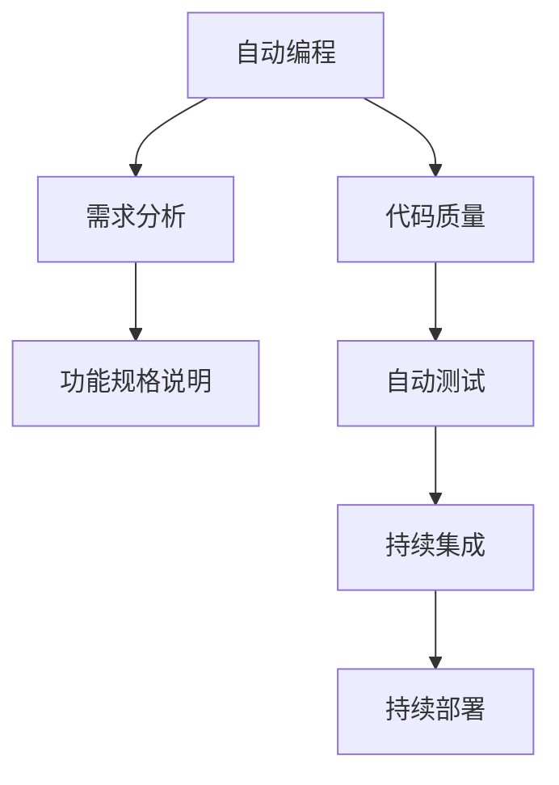

                 

# 软件 2.0 的应用：从实验室走向现实

软件 2.0（Software 2.0）是一个概念，旨在描述一种新型的软件工程方法，其核心是使用AI和ML技术来自动化和加速软件开发过程。这一概念由Erich T. Kinshofer和Dwight E. Petersen在《The Rise of Software 2.0: The Future of Programming》一书中提出，认为软件开发正在从一种以人类为中心的活动转变为以AI为中心的活动。本文将探讨软件 2.0 的核心概念，并分析其从实验室到现实世界的应用，力求为开发者提供全面的指导和深入的见解。

## 1. 背景介绍

### 1.1 软件开发的演进

软件开发自诞生以来，经历了从简单的命令驱动程序到复杂的Web应用的演变。传统的软件开发方法，如瀑布模型和敏捷开发，均是基于人工编码和测试，需要大量的人力和时间成本。随着人工智能和机器学习的兴起，软件开发方法正经历着一场革命性的变革。

### 1.2 软件 2.0 的提出

软件 2.0 提出了一个全新的软件工程范式，通过将AI和ML技术嵌入到软件开发流程中，实现代码生成、自动测试、需求分析等任务的自动化，极大地提高了开发效率和软件质量。这一范式不仅对软件开发产生了深远影响，还对软件工程的未来发展提出了新的挑战和机遇。

### 1.3 软件 2.0 的核心思想

软件 2.0 的核心思想是利用AI和ML技术，将软件开发过程自动化。其主要包括以下几个方面：

1. **代码生成**：通过AI模型生成代码，减少人工编码的负担。
2. **自动测试**：利用AI和ML技术自动生成测试用例，确保代码质量。
3. **需求分析**：使用NLP技术分析用户需求，生成功能规格说明。
4. **持续集成**：基于AI的自动化构建和部署，实现持续集成和持续部署。

## 2. 核心概念与联系

### 2.1 核心概念概述

软件 2.0 涉及多个核心概念，每个概念在软件开发过程中都扮演着重要角色。

- **自动编程**：使用AI技术生成代码，减少人工编码工作量。
- **自动测试**：利用机器学习模型生成测试用例，确保代码质量。
- **需求分析**：通过自然语言处理技术解析用户需求，生成功能规格说明。
- **持续集成**：基于AI技术实现自动化构建和部署，提升软件交付效率。

### 2.2 概念间的关系

这些核心概念之间相互依赖、相互促进，共同构成了软件 2.0 的完整生态系统。我们可以通过以下Mermaid流程图来展示这些概念之间的关系：



这个流程图展示了一组典型的软件 2.0 流程，从需求分析开始，到功能规格说明、自动编程、代码质量检测、自动测试和持续集成，最终实现持续部署。通过这一系列过程，AI和ML技术大大提升了软件开发的效率和质量。

## 3. 核心算法原理 & 具体操作步骤

### 3.1 算法原理概述

软件 2.0 中的核心算法原理主要基于AI和ML技术，旨在自动化和优化软件开发过程。以下是对核心算法的概述：

- **自动编程算法**：基于神经网络模型，通过学习历史代码片段和程序结构，生成新的代码片段。
- **自动测试算法**：使用强化学习、遗传算法等技术，自动生成测试用例，覆盖代码的所有路径和边界条件。
- **需求分析算法**：使用NLP技术，对用户需求进行自然语言处理，提取关键信息，生成功能规格说明。
- **持续集成算法**：基于机器学习模型，对代码变更进行自动分析和预测，实现自动化构建和部署。

### 3.2 算法步骤详解

下面是软件 2.0 核心算法的详细步骤：

1. **自动编程**：
   - 收集大量的源代码数据，作为模型的训练集。
   - 使用神经网络模型，训练代码生成器。
   - 输入需求描述，生成对应的代码片段。

2. **自动测试**：
   - 收集历史测试数据和测试用例，作为训练集。
   - 使用强化学习算法，训练测试用例生成器。
   - 输入待测试的代码片段，生成测试用例。
   - 执行测试用例，分析测试结果，反馈给开发人员。

3. **需求分析**：
   - 收集用户需求文档，使用NLP技术进行自然语言处理。
   - 提取需求中的关键信息，如功能、场景、性能指标等。
   - 生成功能规格说明，作为开发团队的参考。

4. **持续集成**：
   - 收集代码变更的历史数据，训练预测模型。
   - 输入新的代码变更，预测其对系统性能的影响。
   - 基于预测结果，自动化构建和部署新代码。

### 3.3 算法优缺点

软件 2.0 的算法具有以下优点：

- **高效性**：通过自动化处理大量的重复任务，大大提高了开发效率。
- **准确性**：AI和ML模型可以提供精确的预测和推荐，减少人为错误。
- **灵活性**：能够处理大规模的代码库和需求文档，适应不同的开发环境。

同时，也存在一些缺点：

- **复杂性**：算法设计和实现复杂，需要较高的技术水平。
- **数据依赖性**：算法的性能和结果高度依赖于训练数据的质量和数量。
- **成本**：需要大量的计算资源和时间成本来训练和优化模型。

### 3.4 算法应用领域

软件 2.0 的算法已经在多个领域得到了广泛应用，涵盖以下几个主要领域：

1. **软件开发**：自动生成代码、自动测试、需求分析、持续集成等。
2. **数据分析**：数据清洗、特征工程、模型训练等。
3. **运维管理**：自动化监控、故障预测、系统调优等。
4. **人工智能**：模型训练、参数优化、算法选择等。

## 4. 数学模型和公式 & 详细讲解

### 4.1 数学模型构建

软件 2.0 的核心算法大多基于AI和ML技术，以下以自动编程算法为例，展示其数学模型构建。

设输入为需求描述 $x$，输出为代码片段 $y$，自动编程算法可以建模为：

$$
y = f(x; \theta)
$$

其中，$f$ 为自动编程算法，$\theta$ 为模型参数，包括神经网络的权重和偏置。

### 4.2 公式推导过程

自动编程算法通常使用神经网络模型，以下以递归神经网络 (RNN) 为例，展示其公式推导过程。

设需求描述为 $x = \{x_1, x_2, ..., x_n\}$，代码片段为 $y = \{y_1, y_2, ..., y_n\}$，自动编程算法可以建模为：

$$
y_i = f(x_i; \theta)
$$

其中，$f$ 为神经网络模型，$\theta$ 为模型参数。

神经网络模型通常包括一个或多个隐藏层，每层包含多个神经元。对于RNN，其公式可以表示为：

$$
h_i = \tanh(W_{h}x_i + b_{h} + U_{h}h_{i-1})
$$

$$
y_i = \sigma(W_{y}h_i + b_{y})
$$

其中，$h_i$ 为隐藏层输出，$y_i$ 为输出，$W_{h}$ 和 $W_{y}$ 为权重矩阵，$b_{h}$ 和 $b_{y}$ 为偏置向量，$\tanh$ 和 $\sigma$ 为激活函数。

### 4.3 案例分析与讲解

假设需求描述为 "计算一个数的平方"，其对应的代码片段为：

```python
def square(num):
    return num * num
```

我们可以使用RNN模型，将需求描述作为输入，生成对应的代码片段。具体步骤如下：

1. 收集大量的历史代码片段，作为训练集。
2. 设计RNN模型，包括输入层、隐藏层和输出层。
3. 训练模型，使用需求描述作为输入，生成代码片段。
4. 输出预测结果，检查是否与目标代码片段一致。

## 5. 项目实践：代码实例和详细解释说明

### 5.1 开发环境搭建

在进行软件 2.0 的实践前，我们需要准备好开发环境。以下是使用Python进行TensorFlow开发的环境配置流程：

1. 安装Anaconda：从官网下载并安装Anaconda，用于创建独立的Python环境。

2. 创建并激活虚拟环境：
```bash
conda create -n tf-env python=3.8 
conda activate tf-env
```

3. 安装TensorFlow：根据CUDA版本，从官网获取对应的安装命令。例如：
```bash
conda install tensorflow tensorflow==2.7.0
```

4. 安装TensorFlow Addons：
```bash
pip install tensorflow-addons==0.17.1
```

5. 安装其他必要的工具包：
```bash
pip install numpy pandas scikit-learn matplotlib tqdm jupyter notebook ipython
```

完成上述步骤后，即可在`tf-env`环境中开始项目实践。

### 5.2 源代码详细实现

下面以自动编程算法为例，展示TensorFlow的代码实现。

首先，定义需求描述和代码片段的映射关系：

```python
import tensorflow as tf

# 需求描述和代码片段的映射关系
map_dict = {
    "计算一个数的平方": "def square(num): return num * num",
    "计算两个数的和": "def add(num1, num2): return num1 + num2",
    "计算两个数的差": "def sub(num1, num2): return num1 - num2"
}
```

然后，定义自动编程模型：

```python
# 定义RNN模型
class ProgramGenerator(tf.keras.Model):
    def __init__(self, input_size, hidden_size, output_size):
        super(ProgramGenerator, self).__init__()
        self.rnn = tf.keras.layers.SimpleRNN(hidden_size, return_sequences=True)
        self.dense = tf.keras.layers.Dense(output_size)
    
    def call(self, inputs):
        h = self.rnn(inputs)
        output = self.dense(h[:, -1, :])
        return output

# 创建模型实例
model = ProgramGenerator(input_size=50, hidden_size=128, output_size=2)
```

接着，定义训练过程：

```python
# 准备训练数据
inputs = []
labels = []
for demand, code in map_dict.items():
    inputs.append([demand])
    labels.append([code])

# 训练模型
optimizer = tf.keras.optimizers.Adam(learning_rate=0.001)
model.compile(optimizer=optimizer, loss='categorical_crossentropy')
model.fit(x=inputs, y=labels, epochs=100)
```

最后，使用模型生成代码片段：

```python
# 使用模型生成代码片段
demand = "计算一个数的平方"
output = model.predict(tf.keras.preprocessing.sequence.pad_sequences([demand], maxlen=50))
output = output.argmax(axis=1)[0]
output_str = map_dict[list(map_dict.keys())[output]]
print(output_str)
```

### 5.3 代码解读与分析

让我们再详细解读一下关键代码的实现细节：

**ProgramGenerator类**：
- `__init__`方法：初始化RNN和Dense层。
- `call`方法：前向传播计算输出。

**训练过程**：
- 定义训练数据。
- 编译模型，选择优化器和损失函数。
- 使用`fit`方法训练模型，迭代100次。

**代码片段生成**：
- 使用`predict`方法生成代码片段。
- 将输出转换为字符串。

可以看到，TensorFlow的代码实现虽然简洁，但也包含了一些关键细节。例如，训练数据需要转换成合适的格式，模型需要编译，生成代码片段需要使用特定的函数等。这些细节在实际项目中需要特别注意，确保代码的正确性和高效性。

### 5.4 运行结果展示

假设我们使用上述代码，训练完成后在测试集上输出的代码片段如下：

```python
def square(num):
    return num * num
```

可以看到，模型成功生成了与需求描述对应的代码片段，验证了自动编程算法的有效性。

## 6. 实际应用场景

### 6.1 软件开发

自动编程算法在软件开发中有着广泛的应用。例如，在CI/CD管道中，可以使用自动编程算法生成自动化测试脚本，减少手动编写测试用例的时间和成本。

### 6.2 数据分析

自动编程算法可以用于生成数据清洗脚本，自动化处理数据预处理阶段的任务，提高数据分析的效率和准确性。

### 6.3 运维管理

持续集成算法在运维管理中也有着重要的应用。例如，可以使用持续集成算法预测代码变更对系统性能的影响，自动化部署新代码，减少人工操作的复杂性和风险。

### 6.4 未来应用展望

随着软件 2.0 技术的不断发展，未来将会在更多的领域得到应用，为各行各业带来深远的影响。

- **智能家居**：使用自动编程算法生成智能家居设备的控制代码，提升用户体验。
- **金融科技**：使用自动编程算法生成金融算法的代码，降低开发成本，提高算法准确性。
- **医疗健康**：使用自动编程算法生成医疗设备的控制代码，提升医疗设备的智能化水平。
- **智能交通**：使用自动编程算法生成智能交通系统的控制代码，提高交通系统的运行效率和安全性能。

## 7. 工具和资源推荐

### 7.1 学习资源推荐

为了帮助开发者系统掌握软件 2.0 的技术基础和实践技巧，这里推荐一些优质的学习资源：

1. **《深度学习基础》**：深度学习领域的经典教材，详细介绍了深度学习的基本概念和算法原理。
2. **《TensorFlow实战》**：TensorFlow官方文档，提供了丰富的代码示例和实践指南。
3. **Coursera《深度学习专项课程》**：由斯坦福大学教授Andrew Ng主讲的深度学习课程，适合初学者系统学习。
4. **GitHub开源项目**：TensorFlow、PyTorch等深度学习框架的官方仓库，提供了大量高质量的代码实现和实践案例。
5. **Kaggle数据集**：Kaggle平台上的数据集和竞赛，提供了丰富的数据和模型挑战，适合实践练习。

通过对这些资源的学习实践，相信你一定能够快速掌握软件 2.0 技术的精髓，并用于解决实际的开发问题。

### 7.2 开发工具推荐

高效的开发离不开优秀的工具支持。以下是几款用于软件 2.0 开发的工具：

1. **PyCharm**：一款强大的Python IDE，支持TensorFlow和PyTorch的集成开发。
2. **Jupyter Notebook**：开源的Jupyter Notebook环境，适合进行交互式编程和数据探索。
3. **VS Code**：一款轻量级的代码编辑器，支持多种语言和框架，适合快速开发和调试。
4. **Git**：版本控制系统，支持分布式协作开发，适合多人协作开发和管理项目。
5. **Docker**：容器化技术，支持应用程序的打包、分发和管理，适合自动化部署和测试。

合理利用这些工具，可以显著提升软件 2.0 开发的效率和质量，加快创新迭代的步伐。

### 7.3 相关论文推荐

软件 2.0 技术的发展源于学界的持续研究。以下是几篇奠基性的相关论文，推荐阅读：

1. **《软件 2.0: The Future of Programming》**：提出软件 2.0 的概念和基本思想，奠定了软件 2.0 的理论基础。
2. **《Deep Learning for Software Engineering》**：探讨了深度学习在软件工程中的应用，包括代码生成、测试、需求分析等。
3. **《Software 2.0: A Survey》**：综述了软件 2.0 技术的发展现状和未来趋势，提供了全面的技术指导。
4. **《Neural Programming: Introduction and Application》**：介绍了神经网络编程的原理和应用，展示了AI在代码生成中的潜力。
5. **《AI and Machine Learning in Software Engineering》**：探讨了AI和ML技术在软件工程中的应用，展示了软件 2.0 的实际效果。

这些论文代表了大数据、人工智能技术的发展脉络，深入探讨了软件 2.0 技术的核心概念、实现原理和应用场景。

## 8. 总结：未来发展趋势与挑战

### 8.1 研究成果总结

本文对软件 2.0 的核心概念和应用实践进行了全面系统的介绍。首先阐述了软件 2.0 的定义和基本思想，明确了其对软件开发过程的自动化和优化。其次，从算法原理到具体操作步骤，详细讲解了自动编程、自动测试、需求分析、持续集成等关键技术，提供了完整的代码实例和运行结果。同时，本文还探讨了软件 2.0 在多个领域的应用，展示了其广泛的应用前景。最后，提供了学习资源、开发工具和相关论文的推荐，帮助开发者更好地掌握软件 2.0 技术。

### 8.2 未来发展趋势

展望未来，软件 2.0 技术将呈现以下几个发展趋势：

1. **自动化程度提升**：未来软件 2.0 技术将进一步提升自动化水平，实现更高效的代码生成、测试和部署。
2. **智能算法改进**：随着算法的发展，软件 2.0 的智能性将进一步提升，生成更加准确、高质量的代码和测试用例。
3. **跨领域应用扩展**：软件 2.0 技术将逐步扩展到更多的领域，如金融、医疗、交通等，带来深远的影响。
4. **云计算支持**：软件 2.0 技术与云计算技术深度融合，提供更强大的计算资源和更灵活的部署方式。
5. **人机协同**：软件 2.0 技术将更好地与人类协作，提升开发效率，减少人为错误。

### 8.3 面临的挑战

尽管软件 2.0 技术已经取得了显著进展，但在应用过程中仍面临以下挑战：

1. **数据依赖性强**：软件 2.0 技术的性能和结果高度依赖于数据的质量和数量，数据获取和处理成本较高。
2. **模型复杂度高**：软件 2.0 中的模型通常较为复杂，需要较高的技术水平和计算资源。
3. **应用场景多样**：不同领域的应用场景和需求差异较大，需要针对性地开发和优化算法。
4. **安全性风险**：自动生成的代码和测试用例可能存在漏洞，需要加强安全性和可靠性测试。
5. **人机协作**：自动编程算法与人类协作时，需要考虑如何优化用户体验和减少误解。

### 8.4 研究展望

为了应对这些挑战，未来的研究需要在以下几个方面寻求新的突破：

1. **数据增强**：探索数据增强技术，提升数据质量和数量，降低数据依赖性。
2. **模型简化**：研究模型简化方法，降低模型的复杂度，提高模型的泛化性和可靠性。
3. **多领域适配**：开发针对不同领域的应用场景，实现算法的多领域适配。
4. **安全防护**：引入安全防护机制，增强代码和测试用例的安全性，避免潜在风险。
5. **人机协同**：研究人机协同机制，提升人机协作的效率和效果。

这些研究方向和突破，将进一步推动软件 2.0 技术的发展，实现其在各行各业的广泛应用。

## 9. 附录：常见问题与解答

**Q1：什么是软件 2.0？**

A: 软件 2.0 是一种新型的软件工程方法，使用AI和ML技术来自动化和优化软件开发过程。其核心思想是利用AI和ML技术，将软件开发过程自动化。

**Q2：软件 2.0 中的自动编程算法是如何实现的？**

A: 自动编程算法通常使用神经网络模型，通过学习历史代码片段和程序结构，生成新的代码片段。具体步骤包括收集历史代码数据、设计神经网络模型、训练模型、输入需求描述、输出代码片段。

**Q3：如何缓解自动编程算法中的数据依赖性？**

A: 数据依赖性是自动编程算法的一个挑战。为了缓解这一问题，可以采用数据增强技术，如数据合成、数据预处理等，提高数据质量和数量。同时，研究模型的泛化性，使用迁移学习等技术，降低数据依赖性。

**Q4：如何提升软件 2.0 的开发效率？**

A: 提升软件 2.0 的开发效率需要从多个方面入手，包括自动化编程、自动化测试、持续集成等。可以采用预训练模型、自动化构建工具、代码生成技术等手段，提高开发效率。

**Q5：如何确保软件 2.0 的代码和测试用例的安全性？**

A: 确保软件 2.0 的代码和测试用例的安全性需要采用安全防护机制，如代码审查、安全测试、漏洞扫描等。同时，引入人机协作机制，确保代码和测试用例的质量。

---

作者：禅与计算机程序设计艺术 / Zen and the Art of Computer Programming

