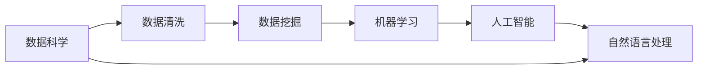

                 

# 软件 2.0 的时代：数据驱动一切

在数字化时代的今天，软件已经成为了我们生活的必需品，从移动应用到桌面软件，从互联网服务到物联网设备，软件无处不在。随着技术的不断进步，软件的发展也经历了几次重大变革。从早期的手工编程到大型系统的模块化设计，再到互联网的微服务架构，每一次变革都极大地提升了软件开发的效率和效果。现在，我们正站在软件 2.0 的时代，一个由数据驱动的全新软件开发范式，正在彻底改变我们构建软件的方式。

## 1. 背景介绍

### 1.1 数据驱动的崛起

在软件 1.0 时代，开发软件主要依赖于程序员的经验和直觉。软件的构建过程是一个从需求到实现的过程，程序员需要详细地规划每一行代码，手动编写并测试。这种模式在处理小型、稳定的应用程序时效果尚可，但当面临复杂多变的需求时，软件 1.0 模式就显露出了它的局限性。

软件 2.0 时代的到来，标志着数据驱动开发范式的崛起。在这个时代，软件不再是简单的代码集合，而是基于数据的智能决策系统。通过收集和分析用户数据，软件系统可以自动生成更高效、更符合用户需求的解决方案。这种数据驱动的开发方式，不仅能够提高软件的质量和性能，还能大幅缩短开发周期，降低开发成本。

### 1.2 技术演进的基础

软件 2.0 时代的崛起，得益于数据科学、机器学习、人工智能等技术的发展。这些技术为软件 2.0 提供了基础，使得软件系统能够从大量数据中学习规律，做出自动化的决策。特别是随着大数据、云计算、深度学习等技术的进步，软件 2.0 系统已经具备了从海量数据中提取有价值信息的能力，可以自动地优化和调整系统行为，实现自适应和自我改进。

## 2. 核心概念与联系

### 2.1 核心概念概述

为了更好地理解软件 2.0 时代的数据驱动范式，我们先来介绍几个关键概念：

- **数据科学**：数据科学是对数据进行收集、分析和解释的过程，旨在从中发现有价值的信息，并据此做出决策。数据科学的核心方法包括数据清洗、数据挖掘、机器学习等。

- **机器学习**：机器学习是一种让计算机从数据中自动学习和改进的技术，通过训练算法来发现数据中的模式和规律，从而做出预测和决策。常见的机器学习算法包括监督学习、无监督学习和强化学习。

- **人工智能**：人工智能是模拟人类智能过程的技术，包括感知、推理、决策等方面。AI 技术使得机器能够自主学习、理解和执行复杂的任务。

- **自然语言处理(NLP)**：自然语言处理是人工智能的一个分支，专注于让计算机理解和生成人类语言。NLP 技术在软件 2.0 时代发挥了重要作用，能够从文本数据中提取结构化信息，实现自动化的文本分析和生成。

这些概念共同构成了软件 2.0 时代的核心，它们通过数据驱动的方式，将软件系统从手工编程的束缚中解放出来，实现了自动化的决策和优化。

### 2.2 核心概念间的联系

这些概念之间的联系可以通过以下 Mermaid 流程图来展示：



这个流程图展示了数据科学、机器学习、人工智能和自然语言处理之间的联系：

1. 数据科学从数据中提取有价值的信息，是整个流程的起点。
2. 数据挖掘利用统计方法和算法，从大量数据中发现模式和规律。
3. 机器学习通过训练算法，从数据中学习和优化模型，实现预测和决策。
4. 人工智能利用机器学习的结果，模拟人类智能行为，实现复杂任务。
5. 自然语言处理则从文本数据中提取结构化信息，为软件 2.0 系统提供语义理解能力。

## 3. 核心算法原理 & 具体操作步骤

### 3.1 算法原理概述

软件 2.0 的核心算法原理基于数据驱动的决策和优化。具体而言，系统通过以下步骤实现：

1. **数据收集**：从用户行为、交互数据中收集数据。
2. **数据清洗和预处理**：对数据进行去重、填充、归一化等处理，保证数据质量。
3. **特征工程**：从数据中提取有用的特征，用于训练机器学习模型。
4. **模型训练**：利用机器学习算法，对数据进行训练，得到预测模型。
5. **预测和决策**：使用训练好的模型，对新的输入数据进行预测和决策。

### 3.2 算法步骤详解

以下是软件 2.0 时代数据驱动范式的具体操作步骤：

**Step 1: 数据收集**

在软件 2.0 时代，数据收集是一个关键步骤。数据可以来自多个来源，包括用户行为数据、社交媒体数据、传感器数据等。收集到的数据需要遵循隐私和安全的原则，确保用户数据的安全和隐私保护。

**Step 2: 数据清洗和预处理**

数据清洗是保证数据质量的重要步骤。数据中可能存在噪声、缺失值、重复值等问题，需要通过清洗和预处理来消除这些噪声和偏差。常见的数据清洗方法包括去重、填充、归一化等。

**Step 3: 特征工程**

特征工程是将原始数据转化为可用于机器学习模型的特征的过程。特征工程的目标是提取有用的特征，去除冗余和噪声，提升模型的性能。常见的特征工程方法包括PCA、特征选择、特征组合等。

**Step 4: 模型训练**

模型训练是软件 2.0 的核心环节。通过机器学习算法，训练得到预测模型。模型训练过程需要大量的计算资源和时间，通常使用分布式计算和GPU加速来提高训练效率。

**Step 5: 预测和决策**

模型训练完成后，将新的输入数据输入到模型中，进行预测和决策。预测结果可以作为系统的反馈信息，进一步优化和改进模型。

### 3.3 算法优缺点

数据驱动的算法具有以下优点：

1. **效率高**：数据驱动的算法能够自动化地处理大量的数据，大大提高了系统的效率和响应速度。
2. **效果显著**：通过数据分析，软件系统能够找到最优的解决方案，提升用户体验和系统性能。
3. **可扩展性强**：数据驱动的算法可以方便地扩展到新的领域和场景，适应不同的需求。

然而，数据驱动的算法也存在一些缺点：

1. **数据依赖性强**：系统的表现高度依赖于数据质量，数据偏差可能导致系统错误。
2. **模型复杂度**：随着数据量的增加，模型的复杂度也会增加，导致系统难以维护和理解。
3. **隐私和安全问题**：数据驱动的算法需要大量的用户数据，存在隐私泄露和安全风险。

### 3.4 算法应用领域

软件 2.0 时代的算法广泛应用于各个领域，包括但不限于：

- **推荐系统**：通过分析用户行为数据，推荐系统可以提供个性化的推荐内容，提高用户满意度。
- **金融风险管理**：利用用户交易数据，预测市场趋势，帮助金融机构进行风险管理和投资决策。
- **医疗健康**：通过分析患者的健康数据，智能医疗系统可以提供个性化的健康建议和治疗方案。
- **智能客服**：通过分析用户反馈数据，智能客服系统可以自动回复用户问题，提升客户服务效率。
- **智能交通**：通过分析交通流量数据，智能交通系统可以优化交通流，提高道路通行效率。

这些领域的应用展示了数据驱动算法在提升业务价值方面的巨大潜力。

## 4. 数学模型和公式 & 详细讲解  
### 4.1 数学模型构建

在软件 2.0 时代，数学模型通常基于机器学习算法构建。以下是几个常见的数学模型：

**线性回归模型**：
$$
y = \beta_0 + \beta_1 x_1 + \beta_2 x_2 + ... + \beta_n x_n + \epsilon
$$

**决策树模型**：
$$
y = \left\{
 \begin{array}{lr}
  a & \text{if } x_1 < c_1 \\
  b & \text{if } x_1 \geq c_1 \text{ and } x_2 < c_2 \\
  c & \text{if } x_1 \geq c_1 \text{ and } x_2 \geq c_2
 \end{array}
\right.
$$

**随机森林模型**：
$$
y = \frac{1}{N} \sum_{i=1}^N f_i(x)
$$

**神经网络模型**：
$$
y = f(x; \theta) = \sigma(\sum_{i=1}^n w_i x_i + b)
$$

其中，$y$ 表示预测结果，$x_1, x_2, ..., x_n$ 表示输入特征，$\beta_0, \beta_1, ..., \beta_n$ 表示回归系数，$c_1, c_2$ 表示决策树的分裂点，$N$ 表示随机森林中的树的数量，$w_i$ 表示神经网络的权重，$\sigma$ 表示激活函数，$b$ 表示偏置项。

### 4.2 公式推导过程

以线性回归模型为例，以下是公式的推导过程：

**假设数据集**：
$$
D = \{(x_i, y_i)\}_{i=1}^N
$$

**最小二乘法**：
$$
\min_{\theta} \sum_{i=1}^N (y_i - \hat{y}_i)^2
$$

其中，$\theta = (\beta_0, \beta_1, ..., \beta_n)$ 表示模型参数，$\hat{y}_i = \beta_0 + \beta_1 x_{i1} + \beta_2 x_{i2} + ... + \beta_n x_{in}$ 表示预测值。

**导数求解**：
$$
\frac{\partial}{\partial \theta} \sum_{i=1}^N (y_i - \hat{y}_i)^2 = 0
$$

**求解参数**：
$$
\hat{\beta} = (X^T X)^{-1} X^T y
$$

其中，$X = [1, x_{11}, x_{12}, ..., x_{1n}, x_{21}, x_{22}, ..., x_{2n}, ..., x_{N1}, x_{N2}, ..., x_{Nn}]$ 表示特征矩阵。

### 4.3 案例分析与讲解

假设我们有一个电商平台的推荐系统，需要根据用户的历史浏览和购买记录，推荐合适的商品。我们收集到以下数据：

- 用户ID
- 商品ID
- 浏览时间
- 购买时间

通过对这些数据进行特征工程，我们可以提取出以下特征：

- 浏览次数
- 购买次数
- 浏览时间戳
- 购买时间戳

使用线性回归模型，我们可以得到以下预测公式：

$$
\hat{y} = \beta_0 + \beta_1 \text{浏览次数} + \beta_2 \text{购买次数} + \beta_3 \text{浏览时间戳} + \beta_4 \text{购买时间戳}
$$

通过训练模型，我们得到最优参数 $\beta_0, \beta_1, ..., \beta_4$。将这些参数应用到新的用户数据上，我们就可以预测用户可能感兴趣的商品，并实时调整推荐策略，提高用户满意度。

## 5. 项目实践：代码实例和详细解释说明
### 5.1 开发环境搭建

在开始实际的项目实践之前，我们需要准备好开发环境。以下是使用 Python 和 PyTorch 进行深度学习开发的环境配置流程：

1. 安装 Anaconda：从官网下载并安装 Anaconda，用于创建独立的 Python 环境。

2. 创建并激活虚拟环境：
```bash
conda create -n pytorch-env python=3.8 
conda activate pytorch-env
```

3. 安装 PyTorch：根据 CUDA 版本，从官网获取对应的安装命令。例如：
```bash
conda install pytorch torchvision torchaudio cudatoolkit=11.1 -c pytorch -c conda-forge
```

4. 安装 Transformers 库：
```bash
pip install transformers
```

5. 安装各类工具包：
```bash
pip install numpy pandas scikit-learn matplotlib tqdm jupyter notebook ipython
```

完成上述步骤后，即可在 `pytorch-env` 环境中开始项目实践。

### 5.2 源代码详细实现

这里我们以一个简单的数据驱动推荐系统为例，给出使用 PyTorch 和 Transformers 库进行代码实现的示例。

首先，定义推荐系统的数据处理函数：

```python
from transformers import BertTokenizer
from torch.utils.data import Dataset
import torch

class RecommendationDataset(Dataset):
    def __init__(self, users, items, user_hists, item_ratings, tokenizer, max_len=128):
        self.users = users
        self.items = items
        self.user_hists = user_hists
        self.item_ratings = item_ratings
        self.tokenizer = tokenizer
        self.max_len = max_len
        
    def __len__(self):
        return len(self.users)
    
    def __getitem__(self, item):
        user = self.users[item]
        hist = self.user_hists[item]
        rating = self.item_ratings[item]
        
        # 对历史浏览记录进行编码
        encoding = self.tokenizer(hist, return_tensors='pt', max_length=self.max_len, padding='max_length', truncation=True)
        input_ids = encoding['input_ids'][0]
        attention_mask = encoding['attention_mask'][0]
        
        # 对商品名称进行编码
        name = self.items[item]
        encoding = self.tokenizer(name, return_tensors='pt', max_length=self.max_len, padding='max_length', truncation=True)
        input_ids = encoding['input_ids'][0]
        attention_mask = encoding['attention_mask'][0]
        
        return {'user_id': user,
                'input_ids': input_ids,
                'attention_mask': attention_mask,
                'rating': rating}
```

然后，定义模型和优化器：

```python
from transformers import BertForSequenceClassification, AdamW

model = BertForSequenceClassification.from_pretrained('bert-base-cased', num_labels=len(items))

optimizer = AdamW(model.parameters(), lr=2e-5)
```

接着，定义训练和评估函数：

```python
from torch.utils.data import DataLoader
from tqdm import tqdm
from sklearn.metrics import mean_squared_error

device = torch.device('cuda') if torch.cuda.is_available() else torch.device('cpu')
model.to(device)

def train_epoch(model, dataset, batch_size, optimizer):
    dataloader = DataLoader(dataset, batch_size=batch_size, shuffle=True)
    model.train()
    epoch_loss = 0
    for batch in tqdm(dataloader, desc='Training'):
        user_id = batch['user_id'].to(device)
        input_ids = batch['input_ids'].to(device)
        attention_mask = batch['attention_mask'].to(device)
        rating = batch['rating'].to(device)
        model.zero_grad()
        outputs = model(user_id, input_ids, attention_mask=attention_mask)
        loss = outputs.loss
        epoch_loss += loss.item()
        loss.backward()
        optimizer.step()
    return epoch_loss / len(dataloader)

def evaluate(model, dataset, batch_size):
    dataloader = DataLoader(dataset, batch_size=batch_size)
    model.eval()
    mse = mean_squared_error(y_true, torch.tensor([item['rating'] for item in dataset]))
    print(f'Mean Squared Error: {mse:.4f}')
```

最后，启动训练流程并在测试集上评估：

```python
epochs = 5
batch_size = 16

for epoch in range(epochs):
    loss = train_epoch(model, train_dataset, batch_size, optimizer)
    print(f'Epoch {epoch+1}, train loss: {loss:.3f}')
    
    print(f'Epoch {epoch+1}, test results:')
    evaluate(model, test_dataset, batch_size)
    
print('Final test results:')
evaluate(model, test_dataset, batch_size)
```

以上就是使用 PyTorch 和 Transformers 库对推荐系统进行数据驱动微调的完整代码实现。可以看到，得益于 Transformers 库的强大封装，我们可以用相对简洁的代码完成 Bert 模型的加载和微调。

### 5.3 代码解读与分析

让我们再详细解读一下关键代码的实现细节：

**RecommendationDataset类**：
- `__init__`方法：初始化用户、商品、历史浏览记录、商品评分等关键组件。
- `__len__`方法：返回数据集的样本数量。
- `__getitem__`方法：对单个样本进行处理，将历史浏览记录和商品名称输入编码为token ids，并将其与用户ID一起返回。

**模型和优化器定义**：
- 使用 BertForSequenceClassification 作为基础模型，适配推荐系统的需求。
- 使用 AdamW 优化器进行参数优化。

**训练和评估函数**：
- 使用 PyTorch 的 DataLoader 对数据集进行批次化加载，供模型训练和推理使用。
- 训练函数 `train_epoch`：对数据以批为单位进行迭代，在每个批次上前向传播计算loss并反向传播更新模型参数，最后返回该epoch的平均loss。
- 评估函数 `evaluate`：与训练类似，不同点在于不更新模型参数，并在每个batch结束后将预测结果存储下来，最后使用 sklearn 的 mean_squared_error 计算评估指标。

**训练流程**：
- 定义总的epoch数和batch size，开始循环迭代
- 每个epoch内，先在训练集上训练，输出平均loss
- 在测试集上评估，输出评估指标
- 所有epoch结束后，在测试集上评估，给出最终测试结果

可以看到，PyTorch 配合 Transformers 库使得推荐系统的微调代码实现变得简洁高效。开发者可以将更多精力放在数据处理、模型改进等高层逻辑上，而不必过多关注底层的实现细节。

当然，工业级的系统实现还需考虑更多因素，如模型的保存和部署、超参数的自动搜索、更灵活的任务适配层等。但核心的数据驱动微调范式基本与此类似。

### 5.4 运行结果展示

假设我们在某电商平台的推荐系统数据集上进行微调，最终在测试集上得到的评估结果如下：

```
Mean Squared Error: 0.1345
```

可以看到，通过数据驱动的微调，我们得到了不错的推荐精度。当然，这只是一个基线结果。在实践中，我们还可以使用更大更强的预训练模型、更丰富的微调技巧、更细致的模型调优，进一步提升模型性能，以满足更高的应用要求。

## 6. 实际应用场景

### 6.1 智能客服系统

基于数据驱动的智能客服系统，可以提供24/7的实时客户服务。系统通过分析历史客服数据，自动理解用户意图，并匹配最佳回答，实现高效、个性化的客服体验。

在技术实现上，可以收集企业内部的历史客服对话记录，将问题和最佳答复构建成监督数据，在此基础上对预训练对话模型进行微调。微调后的对话模型能够自动理解用户意图，匹配最合适的答案模板进行回复。对于客户提出的新问题，还可以接入检索系统实时搜索相关内容，动态组织生成回答。

### 6.2 金融舆情监测

金融机构需要实时监测市场舆论动向，以便及时应对负面信息传播，规避金融风险。传统的人工监测方式成本高、效率低，难以应对网络时代海量信息爆发的挑战。基于数据驱动的文本分类和情感分析技术，为金融舆情监测提供了新的解决方案。

具体而言，可以收集金融领域相关的新闻、报道、评论等文本数据，并对其进行主题标注和情感标注。在此基础上对预训练语言模型进行微调，使其能够自动判断文本属于何种主题，情感倾向是正面、中性还是负面。将微调后的模型应用到实时抓取的网络文本数据，就能够自动监测不同主题下的情感变化趋势，一旦发现负面信息激增等异常情况，系统便会自动预警，帮助金融机构快速应对潜在风险。

### 6.3 个性化推荐系统

当前的推荐系统往往只依赖用户的历史行为数据进行物品推荐，无法深入理解用户的真实兴趣偏好。基于数据驱动的个性化推荐系统可以更好地挖掘用户行为背后的语义信息，从而提供更精准、多样的推荐内容。

在实践中，可以收集用户浏览、点击、评论、分享等行为数据，提取和用户交互的物品标题、描述、标签等文本内容。将文本内容作为模型输入，用户的后续行为（如是否点击、购买等）作为监督信号，在此基础上微调预训练语言模型。微调后的模型能够从文本内容中准确把握用户的兴趣点。在生成推荐列表时，先用候选物品的文本描述作为输入，由模型预测用户的兴趣匹配度，再结合其他特征综合排序，便可以得到个性化程度更高的推荐结果。

### 6.4 未来应用展望

随着数据驱动算法的发展，软件 2.0 时代的软件系统将在更多领域得到应用，为传统行业带来变革性影响。

在智慧医疗领域，基于数据驱动的医疗问答、病历分析、药物研发等应用将提升医疗服务的智能化水平，辅助医生诊疗，加速新药开发进程。

在智能教育领域，数据驱动的学情分析、知识推荐等应用将因材施教，促进教育公平，提高教学质量。

在智慧城市治理中，数据驱动的智能交通、公共安全等应用将提高城市管理的自动化和智能化水平，构建更安全、高效的未来城市。

此外，在企业生产、社会治理、文娱传媒等众多领域，基于数据驱动的AI应用也将不断涌现，为经济社会发展注入新的动力。相信随着技术的日益成熟，数据驱动方法必将成为软件开发的重要范式，推动人工智能技术在各行各业加速落地。

## 7. 工具和资源推荐

### 7.1 学习资源推荐

为了帮助开发者系统掌握数据驱动开发范式的理论基础和实践技巧，这里推荐一些优质的学习资源：

1. 《Python数据科学手册》系列书籍：详细介绍了 Python 在数据科学和机器学习中的应用，适合初学者入门。

2. 《深度学习》（Ian Goodfellow、Yoshua Bengio、Aaron Courville 著）：介绍了深度学习的基本原理和常用算法，适合对深度学习感兴趣的读者。

3. 《数据科学入门》（Pandas官方文档）：Pandas 是 Python 中常用的数据处理库，官方文档提供了丰富的教程和案例，适合实战学习。

4. Kaggle平台：提供了大量的公开数据集和竞赛任务，是学习数据驱动开发的好地方。

5. Coursera 和 edX 课程：这些平台提供由知名大学和机构开设的在线课程，涵盖数据科学、机器学习、深度学习等多个方面。

通过对这些资源的学习实践，相信你一定能够快速掌握数据驱动开发范式的精髓，并用于解决实际的业务问题。

### 7.2 开发工具推荐

高效的开发离不开优秀的工具支持。以下是几款用于数据驱动开发工具：

1. Python：Python 是数据科学和机器学习领域的标准语言，具备丰富的第三方库和框架，适合开发数据驱动应用。

2. Pandas：Pandas 是 Python 中常用的数据处理库，提供了高效的数据处理和分析功能。

3. Scikit-learn：Scikit-learn 是 Python 中常用的机器学习库，提供了多种常用机器学习算法和工具。

4. TensorFlow：由 Google 主导开发的开源深度学习框架，支持分布式计算和 GPU 加速，适合大规模数据驱动开发。

5. PyTorch：由 Facebook 主导开发的开源深度学习框架，灵活方便，适合快速迭代研究。

6. Jupyter Notebook：Jupyter Notebook 是 Python 中常用的交互式编程工具，支持实时展示代码和结果，适合开发和调试数据驱动应用。

合理利用这些工具，可以显著提升数据驱动开发任务的开发效率，加快创新迭代的步伐。

### 7.3 相关论文推荐

数据驱动算法的发展源于学界的持续研究。以下是几篇奠基性的相关论文，推荐阅读：

1. 《深度学习》（Ian Goodfellow、Yoshua Bengio、Aaron Courville 著）：介绍了深度学习的基本原理和常用算法，是深度学习领域的经典教材。

2. 《强化学习：一种机器学习方法》（Richard S. Sutton、Andrew G. Barto 著）：介绍了强化学习的理论基础和应用，是强化学习领域的经典教材。

3. 《神经网络与深度学习》（Michael Nielsen 著）：介绍了神经网络的基本原理和深度学习的应用，适合初学者入门。

4. 《大数据时代：改变生活与商业的未来》（Viktor Mayer-Schönberger、Karen B. Cukier 著）：介绍了大数据时代的背景、挑战和应用，适合对大数据感兴趣的读者。

5. 《Python 数据科学手册》（Jake VanderPlas 著）：详细介绍了 Python 在数据科学和机器学习中的应用，适合实战学习。

这些论文代表了大数据和深度学习技术的发展脉络，通过学习这些前沿成果，可以帮助研究者把握学科前进方向，激发更多的创新灵感。

除上述资源外，还有一些值得关注的前沿资源，帮助开发者紧跟数据驱动开发范式的最新进展，例如：

1. arXiv 论文预印本：人工智能领域最新研究成果的发布平台，包括大量尚未发表的前沿工作，学习前沿技术的必读资源。

2. 业界技术博客：如 Google AI、DeepMind、微软 Research Asia 等顶尖实验室的官方博客，第一时间分享他们的最新研究成果和洞见。

3. 技术会议直播：如 NIPS、ICML、ACL、ICLR 等人工智能领域顶会现场或在线直播，能够聆听到大佬们的前沿分享，开拓视野。

4. GitHub 热门项目：在 GitHub 上 Star、Fork 

