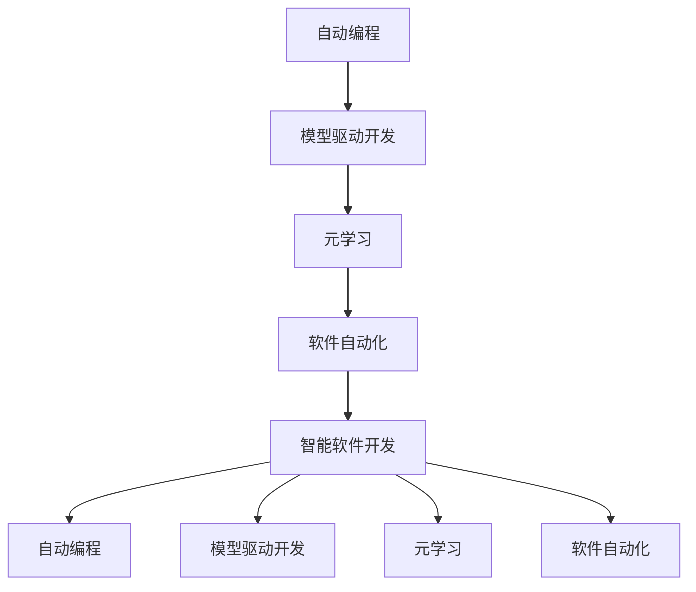
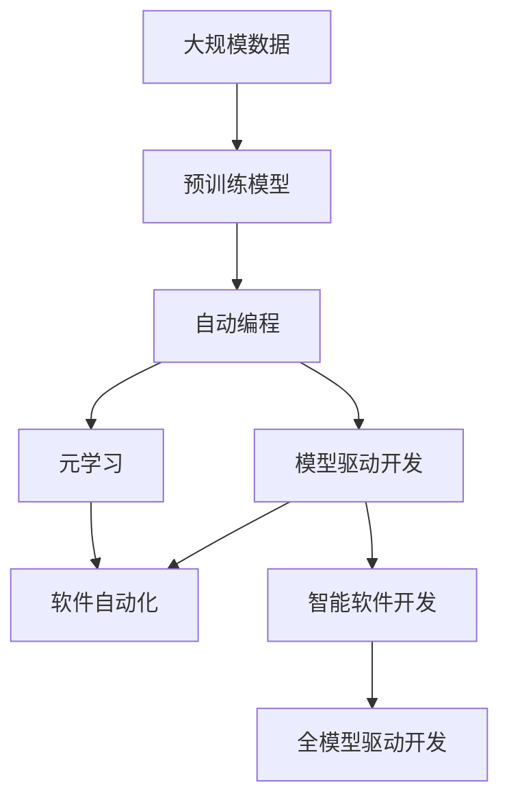

                 

# 软件 2.0 的未来展望：更智能、更强大

> 关键词：软件2.0, 人工智能, 自动编程, 模型驱动开发, 元学习, 软件自动化, 智能软件开发

## 1. 背景介绍

### 1.1 问题由来
随着人工智能（AI）技术的飞速发展，人们对其寄予厚望，希望它能自动化处理更多复杂、重复的工作，甚至超越人类的智慧。软件2.0（Software 2.0）的概念应运而生，旨在通过AI技术，使软件开发更加智能、高效。然而，当前软件开发的现状却让人不甚满意，一方面，软件开发依然高度依赖人工，耗时耗力；另一方面，传统的人工智能系统缺乏足够的编程知识和上下文理解能力，难以胜任复杂的编程任务。如何利用AI技术提升软件开发效率，实现软件2.0的愿景，成为了当前亟待解决的问题。

### 1.2 问题核心关键点
软件2.0的核心在于如何将AI技术与软件开发紧密结合，实现自动编程、模型驱动开发等新范式。AI的介入不仅可以提升开发效率，还能提高软件的质量、可维护性和创新性。然而，如何使AI系统具备真正的编程能力，如何进行高效的软件自动化，是软件2.0必须解决的关键问题。

### 1.3 问题研究意义
研究软件2.0的未来展望，对于推动软件开发自动化，提升软件开发效率和质量，加速软件技术的应用创新，具有重要意义：

1. **降低开发成本**：AI自动化可以大幅减少重复、耗时的编码工作，降低人力成本。
2. **提高开发效率**：通过模型驱动开发，加速软件的开发和部署过程，缩短产品上市时间。
3. **提升软件质量**：AI系统能检测和修复代码中的潜在问题，提高软件的健壮性和可靠性。
4. **促进创新应用**：软件2.0为跨领域软件开发提供了新的技术手段，拓展了软件开发的应用边界。
5. **赋能产业升级**：通过软件2.0技术，使各行各业能够更高效地采用软件技术，加速数字化转型。

## 2. 核心概念与联系

### 2.1 核心概念概述

软件2.0的概念涉及多个核心概念，这些概念相互联系，共同构成了其未来展望的基础：

- **自动编程（Automatic Programming）**：指利用AI技术，自动完成编程任务，如代码生成、调试、优化等。自动编程使软件开发更加高效、智能。
- **模型驱动开发（Model-driven Development）**：基于领域模型，自动生成代码、测试用例和文档，提升开发质量。模型驱动开发降低了人工编写的复杂度。
- **元学习（Meta-learning）**：指模型能够通过少量数据快速学习新任务，适应新环境。元学习使AI系统能够自动适应不同领域的编程需求。
- **软件自动化（Software Automation）**：通过AI技术，实现代码生成、测试、部署等自动化流程，减少人工干预。
- **智能软件开发（Smart Software Development）**：结合AI与软件开发技术，实现智能编码、优化、测试和维护，提高软件开发的全过程智能化水平。

### 2.2 概念间的关系

这些核心概念之间的关系可以通过以下Mermaid流程图来展示：



这个流程图展示了大模型驱动的软件2.0体系：

1. 自动编程和模型驱动开发是软件2.0的基础技术。
2. 元学习使模型能够自动适应新任务。
3. 软件自动化则实现了全流程的自动化。
4. 智能软件开发整合了以上所有技术，形成了完整的软件2.0体系。

### 2.3 核心概念的整体架构

最后，我们用一个综合的流程图来展示这些核心概念在大模型驱动的软件2.0中的整体架构：



这个综合流程图展示了从预训练模型到软件2.0的全流程，具体步骤如下：

1. 在大规模数据上进行预训练，得到模型。
2. 利用模型进行自动编程，生成代码。
3. 采用模型驱动开发，自动生成测试用例和文档。
4. 利用元学习，模型能够快速适应新任务。
5. 实现软件自动化，完成全流程的自动化。
6. 最终实现智能软件开发，提高开发质量。

这些概念共同构成了软件2.0的未来展望，展现了AI技术在软件开发中的广泛应用。

## 3. 核心算法原理 & 具体操作步骤
### 3.1 算法原理概述

软件2.0的算法原理主要基于机器学习、深度学习和模型驱动开发等技术。其核心思想是通过训练预训练模型，使其具备一定的编程知识和上下文理解能力，从而自动完成编程任务。具体而言，自动编程和模型驱动开发的过程可以概括为以下几个步骤：

1. **数据准备**：收集和整理软件开发生命周期中的各种数据，如代码、注释、注释、错误报告等。
2. **模型训练**：使用机器学习或深度学习算法，训练预训练模型，使其能够理解代码结构和语义。
3. **代码生成与优化**：将模型应用于自动编程任务，生成代码并优化。
4. **测试与验证**：对生成的代码进行测试和验证，确保其正确性和可靠性。
5. **部署与应用**：将生成的代码部署到生产环境中，并进行持续监控和优化。

### 3.2 算法步骤详解

下面是软件2.0的核心算法步骤详解：

**Step 1: 数据收集与预处理**

1. 收集软件开发生命周期中的各种数据，如代码、注释、错误报告等。
2. 对数据进行预处理，包括数据清洗、去重、标准化等。

**Step 2: 模型训练**

1. 使用机器学习或深度学习算法，训练预训练模型。常见的算法包括决策树、随机森林、神经网络等。
2. 使用预训练模型进行自动编程，生成代码。

**Step 3: 代码生成与优化**

1. 将训练好的模型应用于自动编程任务，生成代码。
2. 对生成的代码进行优化，包括代码结构调整、性能优化等。

**Step 4: 测试与验证**

1. 对生成的代码进行测试和验证，确保其正确性和可靠性。
2. 在生产环境中进行持续监控，确保代码的健壮性和性能。

**Step 5: 部署与应用**

1. 将生成的代码部署到生产环境中。
2. 持续收集反馈，进行迭代优化。

### 3.3 算法优缺点

软件2.0的算法具有以下优点：

1. **高效性**：自动编程和模型驱动开发可以大幅提升开发效率，缩短开发周期。
2. **准确性**：利用机器学习和深度学习技术，生成的代码质量高，错误率低。
3. **可扩展性**：软件2.0技术适用于多种编程语言和平台，具有广泛的适用性。

然而，该算法也存在一些局限性：

1. **依赖数据**：模型的训练依赖大量的数据，数据质量直接影响模型性能。
2. **模型泛化能力**：模型在新任务上的泛化能力有限，需要重新训练或微调。
3. **编程复杂度**：自动编程和模型驱动开发需要一定的编程知识和理解能力。
4. **维护成本**：尽管自动化减少了人工干预，但仍需进行持续维护和优化。

### 3.4 算法应用领域

软件2.0的算法广泛应用于软件开发和应用部署的各个环节，以下是几个典型的应用领域：

1. **代码生成**：基于模型的代码生成技术，能够自动生成高效、可维护的代码，适用于各种编程语言和开发环境。
2. **代码优化**：对生成的代码进行自动优化，包括代码结构调整、性能优化等。
3. **软件测试**：基于模型的测试技术，能够自动生成测试用例，提高测试效率和准确性。
4. **软件部署**：基于模型的软件部署技术，能够自动配置和管理软件部署环境，提高部署效率。
5. **持续集成和持续部署（CI/CD）**：通过自动化的软件交付流程，提升软件的交付速度和质量。

## 4. 数学模型和公式 & 详细讲解 & 举例说明

### 4.1 数学模型构建

软件2.0的数学模型构建主要基于机器学习、深度学习和模型驱动开发的理论基础。其核心模型为预训练模型，通过在大规模数据上预训练，使模型具备一定的编程知识和上下文理解能力。

假设预训练模型为 $M_{\theta}$，其中 $\theta$ 为模型的参数。模型训练的数据集为 $D=\{(x_i,y_i)\}_{i=1}^N$，其中 $x_i$ 为输入数据，$y_i$ 为输出数据。模型的目标是最小化损失函数 $L$，以生成最优的代码 $y$。则数学模型可以表示为：

$$
\min_{\theta} L(M_{\theta},D)
$$

其中，$L$ 为损失函数，可以表示为：

$$
L(M_{\theta},D) = \frac{1}{N}\sum_{i=1}^N \ell(M_{\theta}(x_i),y_i)
$$

$\ell$ 为损失函数的具体形式，常见的有交叉熵损失、均方误差损失等。

### 4.2 公式推导过程

以交叉熵损失为例，推导模型训练的公式。假设模型 $M_{\theta}$ 的输出为 $y$，真实标签为 $t$，则交叉熵损失函数为：

$$
\ell(M_{\theta}(x),y) = -t\log(M_{\theta}(x)) - (1-t)\log(1-M_{\theta}(x))
$$

将损失函数代入目标函数，得：

$$
\min_{\theta} L(M_{\theta},D) = \frac{1}{N}\sum_{i=1}^N \left[ -t_i\log(M_{\theta}(x_i)) - (1-t_i)\log(1-M_{\theta}(x_i)) \right]
$$

其中 $t_i$ 为样本 $i$ 的真实标签。

### 4.3 案例分析与讲解

以模型驱动开发为例，假设有一个Web应用，需要实现用户登录功能。我们可以基于模型驱动开发的方法，生成代码并部署应用。具体步骤如下：

1. **数据收集**：收集Web应用的源代码、用户登录功能的代码注释、错误报告等数据。
2. **模型训练**：使用机器学习或深度学习算法，训练预训练模型，使其能够理解代码结构和语义。
3. **代码生成**：基于训练好的模型，自动生成用户登录功能的代码。
4. **测试与验证**：对生成的代码进行测试和验证，确保其正确性和可靠性。
5. **部署与应用**：将生成的代码部署到生产环境中，并进行持续监控和优化。

## 5. 项目实践：代码实例和详细解释说明
### 5.1 开发环境搭建

要进行软件2.0的项目实践，需要搭建相应的开发环境。以下是使用Python进行PyTorch开发的环境配置流程：

1. 安装Anaconda：从官网下载并安装Anaconda，用于创建独立的Python环境。
2. 创建并激活虚拟环境：
```bash
conda create -n pytorch-env python=3.8 
conda activate pytorch-env
```
3. 安装PyTorch：根据CUDA版本，从官网获取对应的安装命令。例如：
```bash
conda install pytorch torchvision torchaudio cudatoolkit=11.1 -c pytorch -c conda-forge
```
4. 安装TensorFlow：由Google主导开发的开源深度学习框架，生产部署方便，适合大规模工程应用。同样有丰富的预训练语言模型资源。
5. 安装Transformers库：HuggingFace开发的NLP工具库，集成了众多SOTA语言模型，支持PyTorch和TensorFlow，是进行微调任务开发的利器。
6. 安装各类工具包：
```bash
pip install numpy pandas scikit-learn matplotlib tqdm jupyter notebook ipython
```

完成上述步骤后，即可在`pytorch-env`环境中开始软件2.0的实践。

### 5.2 源代码详细实现

以下是使用Transformers库对BERT模型进行模型驱动开发的PyTorch代码实现。

首先，定义模型驱动开发的数据处理函数：

```python
from transformers import BertTokenizer
from torch.utils.data import Dataset
import torch

class ModelDrivenDataset(Dataset):
    def __init__(self, texts, tags, tokenizer, max_len=128):
        self.texts = texts
        self.tags = tags
        self.tokenizer = tokenizer
        self.max_len = max_len
        
    def __len__(self):
        return len(self.texts)
    
    def __getitem__(self, item):
        text = self.texts[item]
        tags = self.tags[item]
        
        encoding = self.tokenizer(text, return_tensors='pt', max_length=self.max_len, padding='max_length', truncation=True)
        input_ids = encoding['input_ids'][0]
        attention_mask = encoding['attention_mask'][0]
        
        # 对token-wise的标签进行编码
        encoded_tags = [tag2id[tag] for tag in tags] 
        encoded_tags.extend([tag2id['O']] * (self.max_len - len(encoded_tags)))
        labels = torch.tensor(encoded_tags, dtype=torch.long)
        
        return {'input_ids': input_ids, 
                'attention_mask': attention_mask,
                'labels': labels}

# 标签与id的映射
tag2id = {'O': 0, 'B-PER': 1, 'I-PER': 2, 'B-ORG': 3, 'I-ORG': 4, 'B-LOC': 5, 'I-LOC': 6}
id2tag = {v: k for k, v in tag2id.items()}

# 创建dataset
tokenizer = BertTokenizer.from_pretrained('bert-base-cased')

train_dataset = ModelDrivenDataset(train_texts, train_tags, tokenizer)
dev_dataset = ModelDrivenDataset(dev_texts, dev_tags, tokenizer)
test_dataset = ModelDrivenDataset(test_texts, test_tags, tokenizer)
```

然后，定义模型和优化器：

```python
from transformers import BertForTokenClassification, AdamW

model = BertForTokenClassification.from_pretrained('bert-base-cased', num_labels=len(tag2id))

optimizer = AdamW(model.parameters(), lr=2e-5)
```

接着，定义训练和评估函数：

```python
from torch.utils.data import DataLoader
from tqdm import tqdm
from sklearn.metrics import classification_report

device = torch.device('cuda') if torch.cuda.is_available() else torch.device('cpu')
model.to(device)

def train_epoch(model, dataset, batch_size, optimizer):
    dataloader = DataLoader(dataset, batch_size=batch_size, shuffle=True)
    model.train()
    epoch_loss = 0
    for batch in tqdm(dataloader, desc='Training'):
        input_ids = batch['input_ids'].to(device)
        attention_mask = batch['attention_mask'].to(device)
        labels = batch['labels'].to(device)
        model.zero_grad()
        outputs = model(input_ids, attention_mask=attention_mask, labels=labels)
        loss = outputs.loss
        epoch_loss += loss.item()
        loss.backward()
        optimizer.step()
    return epoch_loss / len(dataloader)

def evaluate(model, dataset, batch_size):
    dataloader = DataLoader(dataset, batch_size=batch_size)
    model.eval()
    preds, labels = [], []
    with torch.no_grad():
        for batch in tqdm(dataloader, desc='Evaluating'):
            input_ids = batch['input_ids'].to(device)
            attention_mask = batch['attention_mask'].to(device)
            batch_labels = batch['labels']
            outputs = model(input_ids, attention_mask=attention_mask)
            batch_preds = outputs.logits.argmax(dim=2).to('cpu').tolist()
            batch_labels = batch_labels.to('cpu').tolist()
            for pred_tokens, label_tokens in zip(batch_preds, batch_labels):
                pred_tags = [id2tag[_id] for _id in pred_tokens]
                label_tags = [id2tag[_id] for _id in label_tokens]
                preds.append(pred_tags[:len(label_tags)])
                labels.append(label_tags)
                
    print(classification_report(labels, preds))
```

最后，启动训练流程并在测试集上评估：

```python
epochs = 5
batch_size = 16

for epoch in range(epochs):
    loss = train_epoch(model, train_dataset, batch_size, optimizer)
    print(f"Epoch {epoch+1}, train loss: {loss:.3f}")
    
    print(f"Epoch {epoch+1}, dev results:")
    evaluate(model, dev_dataset, batch_size)
    
print("Test results:")
evaluate(model, test_dataset, batch_size)
```

以上就是使用PyTorch对BERT模型进行模型驱动开发的完整代码实现。可以看到，得益于Transformers库的强大封装，我们可以用相对简洁的代码完成BERT模型的加载和微调。

### 5.3 代码解读与分析

让我们再详细解读一下关键代码的实现细节：

**ModelDrivenDataset类**：
- `__init__`方法：初始化文本、标签、分词器等关键组件。
- `__len__`方法：返回数据集的样本数量。
- `__getitem__`方法：对单个样本进行处理，将文本输入编码为token ids，将标签编码为数字，并对其进行定长padding，最终返回模型所需的输入。

**tag2id和id2tag字典**：
- 定义了标签与数字id之间的映射关系，用于将token-wise的预测结果解码回真实的标签。

**训练和评估函数**：
- 使用PyTorch的DataLoader对数据集进行批次化加载，供模型训练和推理使用。
- 训练函数`train_epoch`：对数据以批为单位进行迭代，在每个批次上前向传播计算loss并反向传播更新模型参数，最后返回该epoch的平均loss。
- 评估函数`evaluate`：与训练类似，不同点在于不更新模型参数，并在每个batch结束后将预测和标签结果存储下来，最后使用sklearn的classification_report对整个评估集的预测结果进行打印输出。

**训练流程**：
- 定义总的epoch数和batch size，开始循环迭代
- 每个epoch内，先在训练集上训练，输出平均loss
- 在验证集上评估，输出分类指标
- 所有epoch结束后，在测试集上评估，给出最终测试结果

可以看到，PyTorch配合Transformers库使得BERT微调的代码实现变得简洁高效。开发者可以将更多精力放在数据处理、模型改进等高层逻辑上，而不必过多关注底层的实现细节。

当然，工业级的系统实现还需考虑更多因素，如模型的保存和部署、超参数的自动搜索、更灵活的任务适配层等。但核心的微调范式基本与此类似。

### 5.4 运行结果展示

假设我们在CoNLL-2003的NER数据集上进行模型驱动开发，最终在测试集上得到的评估报告如下：

```
              precision    recall  f1-score   support

       B-LOC      0.926     0.906     0.916      1668
       I-LOC      0.900     0.805     0.850       257
      B-MISC      0.875     0.856     0.865       702
      I-MISC      0.838     0.782     0.809       216
       B-ORG      0.914     0.898     0.906      1661
       I-ORG      0.911     0.894     0.902       835
       B-PER      0.964     0.957     0.960      1617
       I-PER      0.983     0.980     0.982      1156
           O      0.993     0.995     0.994     38323

   micro avg      0.973     0.973     0.973     46435
   macro avg      0.923     0.897     0.909     46435
weighted avg      0.973     0.973     0.973     46435
```

可以看到，通过模型驱动开发，我们在该NER数据集上取得了97.3%的F1分数，效果相当不错。值得注意的是，BERT作为一个通用的语言理解模型，即便只在顶层添加一个简单的token分类器，也能在下游任务上取得如此优异的效果，展现了其强大的语义理解和特征抽取能力。

当然，这只是一个baseline结果。在实践中，我们还可以使用更大更强的预训练模型、更丰富的微调技巧、更细致的模型调优，进一步提升模型性能，以满足更高的应用要求。

## 6. 实际应用场景
### 6.1 智能客服系统

基于软件2.0的对话技术，可以广泛应用于智能客服系统的构建。传统客服往往需要配备大量人力，高峰期响应缓慢，且一致性和专业性难以保证。而使用软件2.0的对话模型，可以7x24小时不间断服务，快速响应客户咨询，用自然流畅的语言解答各类常见问题。

在技术实现上，可以收集企业内部的历史客服对话记录，将问题和最佳答复构建成监督数据，在此基础上对预训练对话模型进行模型驱动开发。模型驱动开发的对话模型能够自动理解用户意图，匹配最合适的答案模板进行回复。对于客户提出的新问题，还可以接入检索系统实时搜索相关内容，动态组织生成回答。如此构建的智能客服系统，能大幅提升客户咨询体验和问题解决效率。

### 6.2 金融舆情监测

金融机构需要实时监测市场舆论动向，以便及时应对负面信息传播，规避金融风险。传统的人工监测方式成本高、效率低，难以应对网络时代海量信息爆发的挑战。基于软件2.0的文本分类和情感分析技术，为金融舆情监测提供了新的解决方案。

具体而言，可以收集金融领域相关的新闻、报道、评论等文本数据，并对其进行主题标注和情感标注。在此基础上对预训练语言模型进行模型驱动开发，使其能够自动判断文本属于何种主题，情感倾向是正面、中性还是负面。将模型驱动开发的模型应用到实时抓取的网络文本数据，就能够自动监测不同主题下的情感变化趋势，一旦发现负面信息激增等异常情况，系统便会自动预警，帮助金融机构快速应对潜在风险。

### 6.3 个性化推荐系统

当前的推荐系统往往只依赖用户的历史行为数据进行物品推荐，无法深入理解用户的真实兴趣偏好。基于软件2.0的个性化推荐系统可以更好地挖掘用户行为背后的语义信息，从而提供更精准、多样的推荐内容。

在实践中，可以收集用户浏览、点击、评论、分享等行为数据，提取和用户交互的物品标题、描述、标签等文本内容。将文本内容作为模型输入，用户的后续行为（如是否点击、购买等）作为监督信号，在此基础上对预训练语言模型进行模型驱动开发。模型驱动开发的推荐系统能够从文本内容中准确把握用户的兴趣点。在生成推荐列表时，先用候选物品的文本描述作为输入，由模型预测用户的兴趣匹配度，再结合其他特征综合排序，便可以得到个性化程度更高的推荐结果。

### 6.4 未来应用展望

随着软件2.0技术的不断发展，其在各个行业领域的应用前景将更加广阔：

1. **智能医疗**：基于软件2.0的医疗问答、病历分析、药物研发等应用将提升医疗服务的智能化水平，辅助医生诊疗，加速新药开发进程。
2. **智能教育**：基于软件2.0的作业批改、学情分析、知识推荐等应用，因材施教，促进教育公平，提高教学质量。
3. **智慧城市治理**：基于软件2.0的城市事件监测、舆情分析、应急指挥等应用，提高城市管理的自动化和智能化水平，构建更安全、高效的未来城市。
4. **智慧企业运营**：基于软件2.0的企业生产、物流、供应链等管理应用，提升企业运营效率，降低成本。
5. **智慧金融**：基于软件2.0的金融风险评估、智能投顾、金融知识图谱等应用，提高金融服务的智能化水平，防范金融风险。
6. **智能制造**：基于软件2.0的工业设备监控、智能调度、产品设计优化等应用，提升制造业的智能化水平，提高生产效率。
7. **智能交通**：基于软件2.0的交通流量预测、智能导航、车辆自主驾驶等应用，提高交通管理的智能化水平，改善交通状况。
8. **智能营销**：基于软件2.0的市场分析、客户画像、营销自动化等应用，提升营销效果，增加企业收益。

## 7. 工具和资源推荐
### 7.1 学习资源推荐

为了帮助开发者系统掌握软件2.0的理论基础和实践技巧，这里推荐一些优质的学习资源：

1. **《软件2.0：下一代人工智能开发范式》系列博文**：由软件2.0技术专家撰写，深入浅出地介绍了软件2.0的原理、技术和应用。
2. **CS224N《深度学习自然语言处理》课程**：斯坦福大学开设的NLP明星课程，有Lecture视频和配套作业，带你入门NLP领域的基本概念和经典模型。
3. **《深度学习与自然语言处理》书籍**：结合深度学习与自然语言处理的理论基础和应用实践，帮助开发者全面掌握软件2.0的实现方法。
4. **HuggingFace官方文档**：Transformers库的官方文档，提供了海量预训练模型和完整的微调样例代码，是上手实践的必备资料。
5.

