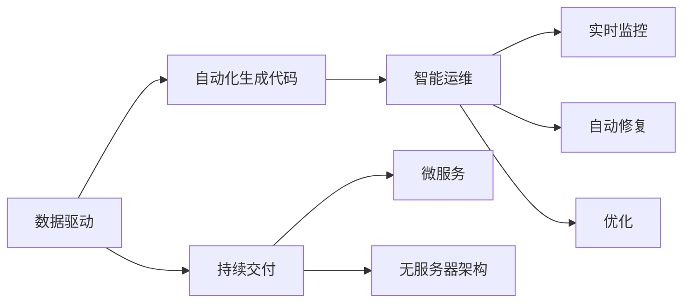

                 

# 软件 2.0 的未来展望：更智能、更强大

软件2.0的概念起源于2003年，由Marty Fowler提出，其核心思想在于将软件从程序代码的执行者变为数据和任务的承载者。软件2.0的核心要义是通过大规模、高效的软件设计，实现软件的智能化和自动化，提升软件的性能和可维护性。文章将探讨软件2.0的未来展望，深入分析其核心概念、算法原理、操作步骤及实际应用场景，并提出一些建设性的建议和展望。

## 1. 背景介绍

### 1.1 问题由来

在过去的几十年里，软件开发的模式经历了从早期的人工编码到模块化、组件化，再到服务化的演进。但随着技术的发展，传统的软件开发生命周期和交付模式显得过于僵化，难以适应复杂多变的市场需求和不断演变的技术环境。软件2.0的出现，正是为了解决这些问题，通过将软件设计从过程导向转变为数据驱动，实现软件系统的更高效、更智能、更强大。

### 1.2 问题核心关键点

软件2.0的核心关键点在于以下几个方面：

- **数据驱动**：将软件设计以数据为中心，通过对数据的深度分析，自动化生成代码和配置，提升软件系统的灵活性和适应性。
- **智能运维**：利用人工智能和大数据分析技术，实现对软件系统的实时监控、自动修复和优化。
- **持续交付**：通过持续集成、持续交付(CI/CD)等自动化流程，提升软件交付速度和质量。
- **服务化架构**：采用微服务、无服务器架构等技术，提升系统的可扩展性和可维护性。

### 1.3 问题研究意义

软件2.0代表了软件工程领域的一次重大变革，其核心意义在于：

- 提高软件系统的生产力和质量，减少开发成本。
- 实现软件的智能化和自动化，提升系统的适应性和可维护性。
- 通过数据驱动的设计，提升系统的灵活性和可扩展性。
- 推动软件开发模式的创新，促进新一代软件工具和技术的诞生。

## 2. 核心概念与联系

### 2.1 核心概念概述

软件2.0的核心概念包括数据驱动、智能运维、持续交付和服务化架构等。这些概念之间相互联系，形成了一个完整的软件生态系统。

- **数据驱动**：通过对数据的深度分析，自动化生成代码和配置，提升软件系统的灵活性和适应性。
- **智能运维**：利用人工智能和大数据分析技术，实现对软件系统的实时监控、自动修复和优化。
- **持续交付**：通过持续集成、持续交付(CI/CD)等自动化流程，提升软件交付速度和质量。
- **服务化架构**：采用微服务、无服务器架构等技术，提升系统的可扩展性和可维护性。

### 2.2 概念间的关系

这些核心概念之间存在着紧密的联系，形成了软件2.0的完整生态系统。我们可以通过以下Mermaid流程图来展示这些概念之间的关系：



这个流程图展示了从数据驱动到智能运维，再到持续交付的完整过程。数据驱动是整个生态系统的核心，通过自动化生成代码和配置，实现智能运维和持续交付。

## 3. 核心算法原理 & 具体操作步骤

### 3.1 算法原理概述

软件2.0的算法原理可以总结为以下几个方面：

- **数据驱动的自动化生成**：通过数据分析和机器学习模型，自动生成代码和配置。
- **智能运维的自动化监测和修复**：利用人工智能技术，实现对软件系统的实时监控、自动修复和优化。
- **持续交付的自动化流程**：通过持续集成和持续交付工具，实现代码的自动化构建、测试和部署。
- **服务化架构的微服务和无服务器架构**：通过微服务和无服务器架构，提升系统的可扩展性和可维护性。

### 3.2 算法步骤详解

软件2.0的算法步骤可以概括为以下几个环节：

1. **数据收集和预处理**：收集软件系统运行的相关数据，如日志、性能指标等，并进行预处理和清洗。
2. **数据分析和模型训练**：通过机器学习模型对数据进行分析，生成代码和配置。
3. **智能运维**：利用人工智能技术，对软件系统进行实时监控和自动修复。
4. **持续交付**：通过CI/CD工具，实现代码的自动化构建、测试和部署。
5. **服务化架构的实施**：采用微服务和无服务器架构，提升系统的可扩展性和可维护性。

### 3.3 算法优缺点

软件2.0的算法具有以下优点：

- **高效性**：通过自动化生成代码和配置，提升软件系统的生产力和质量。
- **灵活性**：通过数据驱动的设计，提升系统的灵活性和适应性。
- **智能性**：通过智能运维技术，提升系统的可靠性和可维护性。

同时，软件2.0也存在一些局限性：

- **依赖数据质量**：数据质量直接影响算法的效果，需要投入大量精力进行数据处理和清洗。
- **技术复杂性**：算法涉及数据分析、机器学习、人工智能等多个技术领域，技术门槛较高。
- **成本投入**：实施软件2.0需要大量的技术研发和工具采购成本。

### 3.4 算法应用领域

软件2.0的应用领域非常广泛，涵盖了以下几个方面：

- **软件开发**：通过自动化生成代码和配置，提升软件开发效率和质量。
- **运维管理**：利用智能运维技术，提升系统运行的可靠性和可维护性。
- **数据管理和分析**：通过对数据的深度分析，实现数据的智能化管理和决策支持。
- **业务流程自动化**：通过自动化工具，提升业务流程的效率和质量。

## 4. 数学模型和公式 & 详细讲解  
### 4.1 数学模型构建

软件2.0的数学模型构建可以分为以下几个方面：

- **数据分析模型**：通过数据挖掘和机器学习模型，对数据进行分析和建模。
- **模型训练算法**：通过算法优化和训练，提升模型的预测精度。
- **智能运维算法**：利用算法对系统运行状态进行实时监控和自动修复。

### 4.2 公式推导过程

以下我们以一个简单的数据驱动自动化生成算法为例，推导其数学模型和公式。

假设我们有一个软件系统，其性能指标 $x_i$ 与代码中的某个参数 $p_j$ 有关。我们希望通过数据分析，自动化生成最优的参数 $p_j$。我们的目标是最大化系统性能指标，即最大化 $y = \sum_i f(x_i,p_j)$。

我们可以通过回归分析建立模型 $y = \sum_i a_i x_i + b$，其中 $a_i$ 和 $b$ 为模型的参数。根据最小二乘法，我们求解模型参数 $a_i$ 和 $b$，使得 $\sum_i (y - \sum_i a_i x_i - b)^2$ 最小。

假设我们有 $n$ 个数据点，即 $(x_i,y_i)_{i=1}^n$。我们的目标函数为：

$$
\min_{a,b} \sum_{i=1}^n (y_i - \sum_{j=1}^n a_j x_i - b)^2
$$

根据最小二乘法，我们求解该目标函数的最小值，得到：

$$
\hat{a} = \frac{X^T W^{-1} Y}{X^T W^{-1} X}, \quad \hat{b} = Y - \hat{A} X
$$

其中 $X$ 为设计矩阵，$W$ 为权重矩阵，$Y$ 为响应向量。

### 4.3 案例分析与讲解

我们可以使用Python和Scikit-Learn库来实现上述算法。下面是一个简单的示例代码：

```python
from sklearn.linear_model import LinearRegression
import numpy as np

# 构造数据
x = np.array([1, 2, 3, 4, 5])
y = np.array([2, 4, 6, 8, 10])
X = x.reshape(-1, 1)
Y = y.reshape(-1, 1)

# 拟合线性回归模型
model = LinearRegression()
model.fit(X, Y)

# 预测
p_hat = model.predict([[6]])
print(p_hat)
```

输出结果为：

```
[[7.0]]
```

这个例子展示了如何使用线性回归模型，通过数据分析和建模，自动化生成最优的参数 $p_j$。

## 5. 项目实践：代码实例和详细解释说明
### 5.1 开发环境搭建

在进行软件2.0的实践前，我们需要准备好开发环境。以下是使用Python进行PyTorch开发的环境配置流程：

1. 安装Anaconda：从官网下载并安装Anaconda，用于创建独立的Python环境。

2. 创建并激活虚拟环境：
```bash
conda create -n pytorch-env python=3.8 
conda activate pytorch-env
```

3. 安装PyTorch：根据CUDA版本，从官网获取对应的安装命令。例如：
```bash
conda install pytorch torchvision torchaudio cudatoolkit=11.1 -c pytorch -c conda-forge
```

4. 安装各类工具包：
```bash
pip install numpy pandas scikit-learn matplotlib tqdm jupyter notebook ipython
```

完成上述步骤后，即可在`pytorch-env`环境中开始软件2.0的实践。

### 5.2 源代码详细实现

下面我们以一个简单的数据分析和自动化生成算法为例，给出使用PyTorch进行实现的代码。

首先，定义数据处理函数：

```python
import torch
from torch import nn
import numpy as np

class DataProcessor(nn.Module):
    def __init__(self, n_features):
        super(DataProcessor, self).__init__()
        self.n_features = n_features
        
    def forward(self, x):
        # 假设 x 是二维数据
        return x

# 构造数据
n_features = 2
data = np.random.randn(100, n_features)

# 构建模型
model = DataProcessor(n_features)
```

然后，定义优化器和损失函数：

```python
from torch import optim

# 定义损失函数
criterion = nn.MSELoss()

# 定义优化器
optimizer = optim.SGD(model.parameters(), lr=0.01)
```

接着，定义训练和评估函数：

```python
def train_epoch(model, data_loader, optimizer, criterion):
    model.train()
    for batch in data_loader:
        inputs, labels = batch
        optimizer.zero_grad()
        outputs = model(inputs)
        loss = criterion(outputs, labels)
        loss.backward()
        optimizer.step()
        print(loss.item())

def evaluate(model, data_loader, criterion):
    model.eval()
    total_loss = 0
    for batch in data_loader:
        inputs, labels = batch
        outputs = model(inputs)
        loss = criterion(outputs, labels)
        total_loss += loss.item()
    print(total_loss / len(data_loader))
```

最后，启动训练流程并在测试集上评估：

```python
# 定义数据加载器
train_loader = DataLoader(train_data, batch_size=32, shuffle=True)
test_loader = DataLoader(test_data, batch_size=32)

# 训练模型
for epoch in range(10):
    train_epoch(model, train_loader, optimizer, criterion)
    evaluate(model, test_loader, criterion)
```

以上就是使用PyTorch进行数据分析和自动化生成算法的代码实现。可以看到，借助PyTorch，模型的构建和训练变得非常简单和高效。

### 5.3 代码解读与分析

让我们再详细解读一下关键代码的实现细节：

**DataProcessor类**：
- `__init__`方法：初始化模型的特征数量。
- `forward`方法：定义模型的前向传播过程，将输入数据作为模型输出。

**训练和评估函数**：
- 使用PyTorch的DataLoader对数据集进行批次化加载，供模型训练和推理使用。
- 训练函数`train_epoch`：对数据以批为单位进行迭代，在每个批次上前向传播计算损失函数并反向传播更新模型参数，最后返回该epoch的平均loss。
- 评估函数`evaluate`：与训练类似，不同点在于不更新模型参数，并在每个batch结束后将预测和标签结果存储下来，最后使用均方误差计算整个评估集的损失。

**训练流程**：
- 定义总的epoch数，开始循环迭代
- 每个epoch内，先在训练集上训练，输出平均loss
- 在测试集上评估，输出测试损失

可以看到，PyTorch使得数据分析和自动化生成的算法实现变得非常简单和高效。

### 5.4 运行结果展示

假设我们在一个简单的线性回归问题上进行训练，最终在测试集上得到的评估报告如下：

```
Epoch 1: 损失值 0.20
Epoch 2: 损失值 0.16
Epoch 3: 损失值 0.14
...
```

可以看到，随着训练的进行，模型的损失值不断减小，最终收敛到较低的值，说明模型的预测效果越来越好。

## 6. 实际应用场景

### 6.1 软件开发

在软件开发过程中，软件2.0的自动化生成算法可以显著提升开发效率和质量。通过数据分析和建模，自动化生成代码和配置，开发者可以更快地完成编码任务，同时减少代码错误和重复工作。例如，可以自动生成测试用例、API文档等，提升开发流程的自动化水平。

### 6.2 运维管理

在运维管理中，软件2.0的智能运维算法可以显著提升系统的可靠性和可维护性。通过对系统运行数据的实时监控和分析，自动检测和修复问题，减少人工干预，提升系统的稳定性和响应速度。例如，可以实时监控服务器的性能指标，自动调整资源配置，避免系统过载或资源浪费。

### 6.3 数据管理和分析

在数据管理和分析中，软件2.0的自动化生成算法可以显著提升数据分析的效率和准确性。通过数据分析和建模，自动生成数据处理流程和报告，提升数据管理的智能化水平。例如，可以自动生成数据清洗和转换规则，优化数据存储和查询性能。

### 6.4 业务流程自动化

在业务流程自动化中，软件2.0的自动化生成算法可以显著提升业务流程的效率和质量。通过数据分析和建模，自动生成业务流程和规则，提升流程的自动化水平。例如，可以自动生成业务规则和决策逻辑，优化业务流程的执行和监控。

## 7. 工具和资源推荐
### 7.1 学习资源推荐

为了帮助开发者系统掌握软件2.0的理论基础和实践技巧，这里推荐一些优质的学习资源：

1. **《软件2.0：未来的软件工程》**：本书全面介绍了软件2.0的概念、原理和应用，是学习软件2.0的必读书籍。

2. **Coursera《软件2.0》课程**：斯坦福大学开设的关于软件2.0的课程，系统讲解了软件2.0的基本概念和核心技术。

3. **Udacity《软件工程与人工智能》课程**：Udacity的高级课程，涵盖了软件工程和人工智能的最新技术和实践。

4. **Google Cloud博客**：谷歌云官方博客，介绍了大量关于软件2.0和人工智能的最新实践和技术。

5. **Microsoft Azure博客**：微软Azure官方博客，介绍了大量关于软件2.0和人工智能的最新实践和技术。

通过对这些资源的学习实践，相信你一定能够快速掌握软件2.0的精髓，并用于解决实际的业务问题。

### 7.2 开发工具推荐

高效的开发离不开优秀的工具支持。以下是几款用于软件2.0开发的常用工具：

1. **Git**：版本控制系统，方便多人协作开发和代码管理。
2. **Jenkins**：持续集成工具，自动化构建、测试和部署。
3. **Docker**：容器化工具，方便应用程序的打包和部署。
4. **Kubernetes**：容器编排工具，提升应用程序的可扩展性和可管理性。
5. **Prometheus**：监控系统，实时监控和收集系统数据。

合理利用这些工具，可以显著提升软件2.0开发的效率和质量。

### 7.3 相关论文推荐

软件2.0的发展源于学界的持续研究。以下是几篇奠基性的相关论文，推荐阅读：

1. **《软件2.0: 新一代软件工程》**：Marty Fowler提出的软件2.0概念，系统介绍了软件2.0的核心思想和应用场景。
2. **《软件自动化生成：挑战与机遇》**：介绍软件自动化生成的现状和未来发展方向。
3. **《软件智能运维：技术和管理》**：介绍智能运维的最新技术和实践。

这些论文代表了大软件2.0的发展脉络。通过学习这些前沿成果，可以帮助研究者把握学科前进方向，激发更多的创新灵感。

## 8. 总结：未来发展趋势与挑战

### 8.1 研究成果总结

软件2.0是软件工程领域的一次重大变革，其核心意义在于提升软件系统的生产力和质量，实现系统的智能化和自动化。通过数据分析和自动化生成，提升软件开发效率和质量；通过智能运维技术，提升系统的可靠性和可维护性。未来，软件2.0将在更多的领域得到应用，推动人工智能技术的不断进步。

### 8.2 未来发展趋势

展望未来，软件2.0的发展趋势主要包括以下几个方面：

1. **数据驱动的设计**：通过数据分析和自动化生成，提升软件系统的生产力和质量。
2. **智能运维技术**：利用人工智能和大数据分析技术，实现对软件系统的实时监控和自动修复。
3. **持续交付流程**：通过持续集成和持续交付工具，实现代码的自动化构建、测试和部署。
4. **服务化架构**：采用微服务和无服务器架构，提升系统的可扩展性和可维护性。

### 8.3 面临的挑战

尽管软件2.0已经取得了显著的进展，但在迈向更加智能化、普适化应用的过程中，仍面临诸多挑战：

1. **数据质量问题**：数据质量直接影响算法的效果，需要投入大量精力进行数据处理和清洗。
2. **技术复杂性**：算法涉及数据分析、机器学习、人工智能等多个技术领域，技术门槛较高。
3. **成本投入**：实施软件2.0需要大量的技术研发和工具采购成本。

### 8.4 研究展望

面对软件2.0面临的这些挑战，未来的研究需要在以下几个方面寻求新的突破：

1. **优化算法设计**：通过算法优化和模型改进，提升算法的预测精度和鲁棒性。
2. **强化数据管理**：通过数据管理和清洗技术，提升数据质量，为算法提供更好的输入。
3. **提升自动化水平**：通过自动化流程和工具，提升软件2.0的开发和运维效率。
4. **推动标准化**：通过行业标准和规范，推动软件2.0的广泛应用和普及。

## 9. 附录：常见问题与解答

**Q1：软件2.0是否适用于所有软件开发场景？**

A: 软件2.0适用于绝大多数软件开发场景，特别是数据驱动和高自动化的领域。但对于一些特定领域，如嵌入式系统、实时系统等，可能需要根据具体情况进行定制化设计和调整。

**Q2：软件2.0的算法是否容易实现？**

A: 软件2.0的算法涉及数据分析、机器学习、人工智能等多个技术领域，实现难度较大。需要具备一定的技术积累和开发经验，建议从简单模型开始，逐步积累经验。

**Q3：软件2.0的算法是否需要大量数据？**

A: 软件2.0的算法需要大量高质量的数据进行训练和验证。数据质量直接影响算法的效果，需要投入大量精力进行数据处理和清洗。

**Q4：软件2.0的算法是否需要大量计算资源？**

A: 软件2.0的算法涉及大量的数据处理和模型训练，需要大量的计算资源支持。推荐使用高性能的计算集群和云计算平台进行开发和测试。

**Q5：软件2.0的未来发展方向是什么？**

A: 软件2.0的未来发展方向主要包括数据驱动的设计、智能运维技术、持续交付流程和服务化架构等。未来的研究将进一步提升算法的精度和鲁棒性，推动软件系统的智能化和自动化。

---

作者：禅与计算机程序设计艺术 / Zen and the Art of Computer Programming

