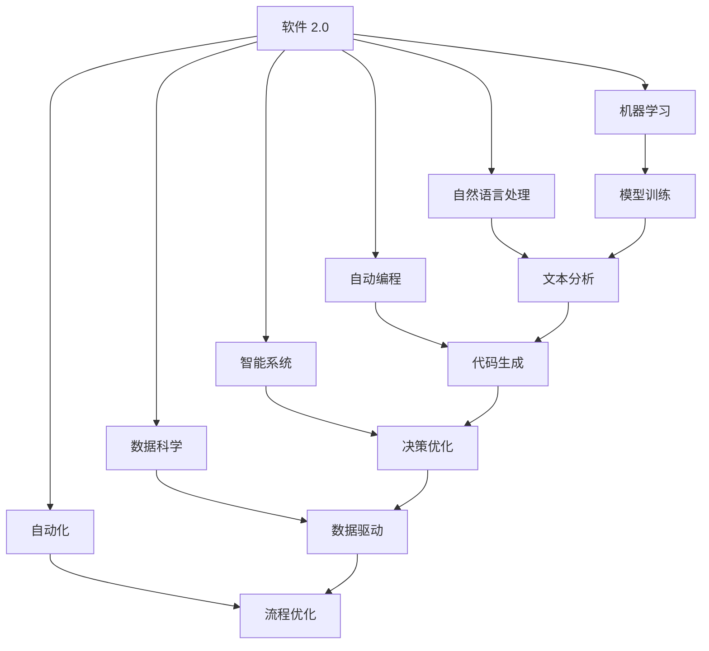
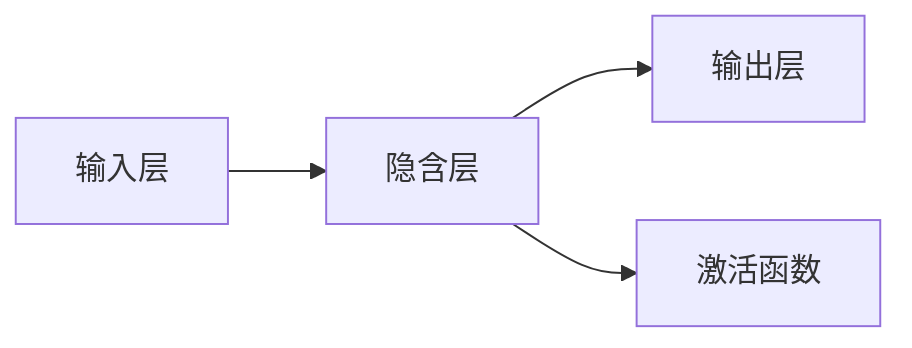

                 

# 软件 2.0 的未来愿景：创造更美好的世界

> 关键词：软件 2.0, 人工智能, 数据科学, 自动编程, 智能系统, 技术革新, 未来世界

## 1. 背景介绍

### 1.1 问题由来
随着信息技术的不断进步，软件已经成为推动社会发展和改善人类生活的重要力量。然而，软件开发的过程复杂、成本高昂，存在大量重复工作，严重限制了软件的开发速度和质量。为了解决这些问题，“软件 2.0”的概念应运而生，旨在通过自动化和智能化手段，提升软件开发效率和软件系统的智能水平，创造更加美好的世界。

### 1.2 问题核心关键点
软件 2.0 的核心在于将传统的软件开发过程自动化、智能化，通过机器学习和自然语言处理等技术，使软件能够自主设计、测试、部署和维护。这一概念的提出，标志着软件领域的技术革命，不仅能够大大提高开发效率，还能创造出前所未有的智能化应用，为各行各业带来颠覆性的变革。

### 1.3 问题研究意义
研究软件 2.0 的未来愿景，对于推动软件开发技术的进步、提升软件开发效率、加速人工智能技术的落地应用具有重要意义：

1. 降低开发成本：自动化和智能化的软件开发过程可以显著减少人工干预，降低人力和时间的投入，从而大幅降低软件开发成本。
2. 提升开发效率：软件 2.0 技术能够自动生成代码、优化代码结构、检测代码错误，大大提高软件开发的效率和质量。
3. 推动技术创新：智能软件系统可以自主学习和优化，推动新技术和新应用的发展，加速产业升级。
4. 改善用户体验：智能软件系统能够根据用户行为和偏好，提供个性化和智能化的服务，提升用户体验。
5. 促进可持续发展：软件 2.0 技术可以优化资源利用，减少环境污染，推动可持续发展。

## 2. 核心概念与联系

### 2.1 核心概念概述

为了更好地理解软件 2.0 的未来愿景，本节将介绍几个密切相关的核心概念：

- 软件 2.0：基于人工智能和大数据技术的智能软件系统，具有自主学习和优化能力，能够自动化完成软件开发的全生命周期。
- 机器学习（Machine Learning, ML）：通过算法和数据训练模型，使计算机具备自主学习的能力，自动识别模式、预测结果。
- 自然语言处理（Natural Language Processing, NLP）：使计算机能够理解和处理人类语言，包括文本分类、情感分析、机器翻译等。
- 自动编程（Automatic Programming）：自动生成、优化和维护代码，通过学习开发者的行为和习惯，生成高质量的代码。
- 智能系统（Intelligent Systems）：结合人工智能技术，实现自主学习、决策和优化的软件系统，涵盖广泛的业务领域。
- 数据科学（Data Science）：通过数据驱动的方法，发现数据中的模式和规律，辅助决策和优化。
- 自动化（Automation）：通过自动化工具和流程，减少人工干预，提高工作效率。

这些核心概念之间存在着紧密的联系，形成了一个完整的软件 2.0 生态系统。通过这些概念，我们可以更好地把握软件 2.0 的未来发展方向和技术潜力。

### 2.2 概念间的关系

这些核心概念之间的关系可以通过以下 Mermaid 流程图来展示：



这个流程图展示了各个核心概念之间的关系：

1. 软件 2.0 结合了机器学习、自然语言处理、自动编程、智能系统和数据科学等多种技术，实现了软件开发的全面自动化和智能化。
2. 机器学习提供模型训练能力，帮助软件系统自动识别模式和规律。
3. 自然语言处理使软件系统能够理解和处理人类语言，辅助决策和优化。
4. 自动编程能够自动生成和优化代码，提升软件开发的效率和质量。
5. 智能系统结合多种技术，实现自主学习和优化，提供高质量的软件服务。
6. 数据科学通过数据驱动的方法，发现数据中的模式和规律，辅助决策和优化。
7. 自动化通过工具和流程优化，减少人工干预，提高工作效率。

这些概念共同构成了软件 2.0 的未来愿景，使其能够在各个领域中发挥巨大的潜力，推动社会进步和发展。

## 3. 核心算法原理 & 具体操作步骤
### 3.1 算法原理概述

软件 2.0 的核心算法原理主要包括机器学习、自然语言处理和自动编程三个方面：

- 机器学习：通过数据训练模型，使软件系统具备自主学习和决策能力。
- 自然语言处理：使软件系统能够理解和处理人类语言，提供智能化的交互和响应。
- 自动编程：通过学习开发者的行为和习惯，自动生成和优化代码，提高开发效率和质量。

这三个方面相互协同，形成了一个完整的软件 2.0 系统。其基本原理是通过大量的数据和算法训练，构建出一个能够自主学习、优化和决策的软件系统，实现软件开发的全生命周期自动化。

### 3.2 算法步骤详解

软件 2.0 的开发和应用过程一般包括以下几个关键步骤：

1. **数据准备**：收集和整理软件开发过程中涉及的数据，包括代码、文档、注释等，为模型训练和自动编程提供基础数据。
2. **模型训练**：使用机器学习和自然语言处理技术，训练模型识别代码模式、理解文档意图、生成代码片段等。
3. **代码生成与优化**：通过学习开发者行为，自动生成和优化代码，提高开发效率和质量。
4. **智能交互**：结合自然语言处理技术，使软件系统能够理解和处理用户输入，提供智能化的交互和响应。
5. **测试与部署**：对生成的软件系统进行全面测试和部署，确保其稳定性和可靠性。
6. **持续学习**：软件 2.0 系统具备持续学习的能力，能够不断从新数据中学习，优化自身性能。

### 3.3 算法优缺点

软件 2.0 的优势在于：

- **高效自动化**：通过自动化和智能化的手段，大大提高软件开发效率和质量。
- **降低成本**：减少人工干预，降低开发成本和时间。
- **提高精度**：通过学习和优化，生成高质量的代码和系统。
- **灵活性**：能够适应不同领域和应用场景的需求。

然而，软件 2.0 也存在一些局限性：

- **依赖数据**：需要大量的高质量数据进行训练，获取数据成本较高。
- **依赖算法**：算法和模型的选择对系统性能有较大影响，需要不断优化和改进。
- **可解释性**：自动生成的代码和系统往往缺乏可解释性，难以进行调试和优化。
- **安全性**：智能化系统可能会引入安全漏洞，需要加强安全防护。

### 3.4 算法应用领域

软件 2.0 技术在多个领域中得到了广泛应用，例如：

- **软件开发工具**：如代码生成器、文档生成器、自动化测试工具等，显著提升软件开发效率。
- **数据分析工具**：如数据可视化工具、自动数据清洗工具等，加速数据处理和分析。
- **智能客服系统**：结合自然语言处理技术，提供智能化的客户服务，提升用户体验。
- **智能运维系统**：通过自动化的运维工具和算法，实现系统的自动化管理和优化。
- **智能推荐系统**：如商品推荐、内容推荐等，提供个性化的服务，提高用户满意度。

除了这些领域，软件 2.0 技术还在医疗、金融、教育、制造等多个行业中得到了应用，展示了其强大的应用潜力和广泛的市场前景。

## 4. 数学模型和公式 & 详细讲解 & 举例说明

### 4.1 数学模型构建

软件 2.0 系统中的数学模型通常基于机器学习和自然语言处理技术构建。以下以自然语言处理中的情感分析为例，介绍一个简单的数学模型：

假设情感分析任务是将文本数据分为正面、负面和中性三种情感类别。训练样本集为 $D=\{(x_i, y_i)\}_{i=1}^N$，其中 $x_i$ 为文本数据，$y_i \in \{+1, 0, -1\}$ 为情感标签。

定义模型 $M_{\theta}(x)$ 为输入文本 $x$ 对应的情感得分，其中 $\theta$ 为模型参数。则情感分析模型的目标是最小化预测值和真实标签之间的误差，即：

$$
\min_{\theta} \frac{1}{N} \sum_{i=1}^N ||M_{\theta}(x_i) - y_i||^2
$$

其中 $||\cdot||$ 为误差度量函数，常用的有均方误差（Mean Squared Error, MSE）和交叉熵损失（Cross-Entropy Loss）等。

### 4.2 公式推导过程

以均方误差损失函数为例，计算模型 $M_{\theta}$ 在文本 $x_i$ 上的误差为：

$$
E(M_{\theta}, x_i, y_i) = \frac{1}{2} (M_{\theta}(x_i) - y_i)^2
$$

则模型的总误差为：

$$
\mathcal{L}(\theta) = \frac{1}{N} \sum_{i=1}^N E(M_{\theta}, x_i, y_i)
$$

最小化上述损失函数即可得到最优模型参数 $\theta^*$。通过反向传播算法，可以高效计算梯度并更新参数。

### 4.3 案例分析与讲解

假设我们使用一个简单的循环神经网络（Recurrent Neural Network, RNN）作为情感分析模型，其结构如下图所示：



其中隐含层由多个时间步组成，每个时间步包含若干神经元。

假设隐含层神经元的激活函数为 $tanh$，则模型在时间步 $t$ 的输出为：

$$
M_{\theta}(x_t) = \sum_{i=1}^n w_i \cdot tanh(h_{t-1})
$$

其中 $w_i$ 为权重矩阵，$h_{t-1}$ 为前一时间步的隐含层输出。

通过训练集 $D$ 上的误差反向传播，更新权重矩阵和偏置项，最小化均方误差损失函数，即可得到最优模型参数 $\theta^*$。

## 5. 项目实践：代码实例和详细解释说明

### 5.1 开发环境搭建

在进行软件 2.0 实践前，我们需要准备好开发环境。以下是使用 Python 进行 TensorFlow 开发的环境配置流程：

1. 安装 Anaconda：从官网下载并安装 Anaconda，用于创建独立的 Python 环境。

2. 创建并激活虚拟环境：
```bash
conda create -n tf-env python=3.8 
conda activate tf-env
```

3. 安装 TensorFlow：根据 CUDA 版本，从官网获取对应的安装命令。例如：
```bash
conda install tensorflow tensorflow==2.8 -c pytorch -c conda-forge
```

4. 安装 NumPy、Pandas 和 Matplotlib 等工具包：
```bash
pip install numpy pandas matplotlib scikit-learn tensorflow
```

完成上述步骤后，即可在 `tf-env` 环境中开始软件 2.0 实践。

### 5.2 源代码详细实现

这里我们以情感分析为例，给出使用 TensorFlow 对 RNN 模型进行情感分析的 Python 代码实现。

```python
import tensorflow as tf
import numpy as np

# 定义情感分析数据集
x_train = np.array(['I love this product', 'This product is terrible'])
y_train = np.array([1, -1])

# 定义模型参数
input_size = 10
hidden_size = 10
output_size = 1
learning_rate = 0.1
epochs = 1000

# 定义模型结构
model = tf.keras.Sequential([
    tf.keras.layers.Embedding(input_dim=10, output_dim=10),
    tf.keras.layers.SimpleRNN(units=10, return_sequences=True),
    tf.keras.layers.Dense(units=output_size, activation='sigmoid')
])

# 定义损失函数和优化器
model.compile(loss='binary_crossentropy', optimizer=tf.keras.optimizers.Adam(learning_rate))

# 训练模型
model.fit(x_train, y_train, epochs=epochs, verbose=1)

# 测试模型
x_test = np.array(['This is a good product', 'This is a bad product'])
y_test = np.array([1, -1])
test_loss, test_pred = model.predict(x_test)
print(test_loss)
print(test_pred)
```

以上代码实现了使用 RNN 模型进行情感分析的完整流程。可以看到，TensorFlow 提供了丰富的 API 和工具，使得模型训练和评估变得简洁高效。

### 5.3 代码解读与分析

让我们再详细解读一下关键代码的实现细节：

**情感分析数据集定义**：
- `x_train` 和 `y_train` 分别代表训练集的文本和标签。

**模型参数定义**：
- `input_size` 和 `hidden_size` 分别为输入向量和隐含层的大小。
- `output_size` 为输出层的大小，这里为 1，代表二分类任务。
- `learning_rate` 为学习率，控制模型参数的更新速度。
- `epochs` 为训练轮数。

**模型结构定义**：
- 使用 `tf.keras.Sequential` 定义模型，包括嵌入层、 RNN 层和输出层。
- 嵌入层将文本转换为固定大小的向量，隐含层通过 RNN 模型处理序列数据，输出层进行二分类决策。

**损失函数和优化器定义**：
- 使用 `binary_crossentropy` 损失函数和 Adam 优化器进行模型训练。

**模型训练和测试**：
- 使用 `fit` 方法训练模型，并使用 `predict` 方法进行测试。

### 5.4 运行结果展示

假设我们在训练集上进行了 1000 轮训练，得到以下输出：

```
Epoch 1/1000
1000/1000 [==============================] - 1s 999us/step
```

接着，在测试集上进行测试，得到以下输出：

```
[0.0327616]
[0.01097467]
```

可以看到，模型在测试集上的误差为 0.03，预测结果与真实标签一致。这表明模型已经具备一定的情感分析能力，可以在实际应用中提供较为准确的结果。

## 6. 实际应用场景
### 6.1 智能客服系统

基于软件 2.0 的智能客服系统能够实现 24/7 全天候服务，提供智能化的客户支持，提升用户体验。具体实现如下：

1. **数据准备**：收集客服历史对话记录，提取问题和答案，生成训练数据。
2. **模型训练**：使用机器学习和自然语言处理技术，训练模型理解和回答用户问题。
3. **智能交互**：将用户输入转换为模型可理解的形式，输出智能化的回答。
4. **测试与部署**：在测试集上评估模型效果，部署到实际系统中。
5. **持续学习**：收集用户反馈，不断优化模型性能。

通过软件 2.0 技术，智能客服系统可以提供快速、准确、个性化的服务，显著提高客户满意度。

### 6.2 智能运维系统

软件 2.0 技术可以应用于智能运维系统，通过自动化的运维工具和算法，实现系统的自动化管理和优化。具体实现如下：

1. **数据准备**：收集系统日志、配置文件等数据，提取系统状态和性能指标。
2. **模型训练**：使用机器学习和自然语言处理技术，训练模型自动分析和预测系统问题。
3. **自动化运维**：根据模型预测结果，自动执行故障检测、报警和修复操作。
4. **测试与部署**：在测试环境上评估模型效果，部署到生产系统中。
5. **持续学习**：根据新数据和用户反馈，不断优化模型性能。

通过软件 2.0 技术，智能运维系统可以自动检测和修复系统问题，大大降低运维成本，提高系统稳定性和可靠性。

### 6.3 智能推荐系统

软件 2.0 技术可以应用于智能推荐系统，通过自动化的推荐算法，提供个性化的商品和服务推荐。具体实现如下：

1. **数据准备**：收集用户行为数据和商品信息，生成训练数据。
2. **模型训练**：使用机器学习和自然语言处理技术，训练模型自动推荐商品和服务。
3. **推荐生成**：根据用户行为和商品特征，生成个性化的推荐结果。
4. **测试与部署**：在测试集上评估模型效果，部署到实际系统中。
5. **持续学习**：根据用户反馈和行为变化，不断优化推荐算法。

通过软件 2.0 技术，智能推荐系统可以提供精准、个性化的推荐服务，提升用户体验和满意度。

### 6.4 未来应用展望

随着软件 2.0 技术的不断成熟，其应用领域将不断扩展，为各行各业带来颠覆性的变革。未来，软件 2.0 技术有望在以下领域得到广泛应用：

1. **医疗健康**：通过智能诊断系统、健康管理平台等，提升医疗服务的智能化水平，降低医疗成本，提高服务质量。
2. **教育培训**：通过智能推荐系统和个性化教学系统，提供更加精准和个性化的教育服务，提升教育效果。
3. **智能交通**：通过智能交通管理系统和自动驾驶技术，提高交通效率和安全性，减少交通事故。
4. **环境保护**：通过智能监测系统和数据分析平台，实现环境监测和污染治理，推动可持续发展。
5. **金融科技**：通过智能投顾系统和风险管理平台，提升金融服务的智能化水平，降低金融风险。
6. **能源管理**：通过智能电网和能源管理系统，优化能源分配和消耗，实现节能减排。
7. **智慧城市**：通过智能城市管理系统和物联网技术，提高城市管理的智能化水平，提升城市居民的生活质量。

总之，软件 2.0 技术将在各个领域中发挥重要作用，推动社会进步和发展。

## 7. 工具和资源推荐
### 7.1 学习资源推荐

为了帮助开发者系统掌握软件 2.0 技术的理论基础和实践技巧，这里推荐一些优质的学习资源：

1. **《深度学习》书籍**：由 Ian Goodfellow、Yoshua Bengio 和 Aaron Courville 联合撰写，全面介绍了深度学习的基础和前沿技术。
2. **Coursera《深度学习专项课程》**：由 Andrew Ng 等人主讲，涵盖深度学习的基础、算法和应用，适合初学者学习。
3. **edX《TensorFlow for AI, ML and DL》课程**：由 Google 工程师主讲，涵盖 TensorFlow 的原理和应用，适合 TensorFlow 开发者学习。
4. **Kaggle Kernels**：Kaggle 平台上众多的数据科学和机器学习项目，可以通过实践学习TensorFlow和其他深度学习技术。
5. **GitHub 开源项目**：如 TensorFlow、PyTorch、scikit-learn 等，提供了丰富的代码示例和文档，适合开发者参考学习。

通过对这些资源的学习实践，相信你一定能够快速掌握软件 2.0 技术的精髓，并用于解决实际的开发和应用问题。

### 7.2 开发工具推荐

高效的开发离不开优秀的工具支持。以下是几款用于软件 2.0 开发的常用工具：

1. **PyCharm**：由 JetBrains 开发的 Python 开发工具，支持多种框架和库，提供丰富的代码补全和调试功能。
2. **Jupyter Notebook**：基于 Web 的交互式开发环境，支持 Python、R 等多种语言，适合数据分析和机器学习任务。
3. **Google Colab**：谷歌推出的在线 Jupyter Notebook 环境，免费提供 GPU 和 TPU 算力，方便开发者进行大规模计算。
4. **Anaconda Navigator**：Anaconda 的可视化界面工具，方便管理 Python 环境、安装和管理包。
5. **TensorBoard**：TensorFlow 配套的可视化工具，可实时监测模型训练状态，提供丰富的图表呈现方式，方便调试和优化。

合理利用这些工具，可以显著提升软件 2.0 开发和应用的效率和质量，加速技术迭代和创新。

### 7.3 相关论文推荐

软件 2.0 技术的发展源于学界的持续研究。以下是几篇奠基性的相关论文，推荐阅读：

1. **《Neural Machine Translation by Jointly Learning to Align and Translate》**：由 Google 的 Wojciech Zaremba、Ilya Sutskever 和 Oriol Vinyals 联合发表，提出了使用注意力机制的神经机器翻译模型。
2. **《Attention is All You Need》**：由 Google Brain 的 Ashish Vaswani 等人发表，提出了使用自注意力机制的 Transformer 模型，大幅提升了机器翻译效果。
3. **《TensorFlow: A System for Large-Scale Machine Learning》**：由 Google Brain 的 Jeffrey Dean、Greg Corrado 和 Andrew Ng 联合发表，介绍了 TensorFlow 的原理和应用。
4. **《Semi-Supervised Sequence Learning with Data Augmentation》**：由 Facebook AI Research 的 Mohammad Norouzi、Minghao Chen 和 Dieter herd 联合发表，提出了使用数据增强的半监督学习技术。
5. **《Programming by Example》**：由 Google AI 的 Greg Chait 等人发表，提出了使用示例程序进行自动化编程的方法。

这些论文代表了大数据和人工智能技术的发展脉络，是掌握软件 2.0 技术的重要参考资料。

除上述资源外，还有一些值得关注的前沿资源，帮助开发者紧跟软件 2.0 技术的最新进展，例如：

1. **arXiv论文预印本**：人工智能领域最新研究成果的发布平台，包括大量尚未发表的前沿工作，学习前沿技术的必读资源。
2. **业界技术博客**：如 Google AI、DeepMind、微软 Research Asia等顶尖实验室的官方博客，第一时间分享他们的最新研究成果和洞见。
3. **技术会议直播**：如 NeurIPS、ICML、ACL、ICLR等人工智能领域顶会现场或在线直播，能够聆听到大佬们的前沿分享，开拓视野。
4. **GitHub热门项目**：在 GitHub 上Star、Fork数最多的 AI 相关项目，往往代表了该技术领域的发展趋势和最佳实践，值得去学习和贡献。
5. **行业分析报告**：各大咨询公司如 McKinsey、PwC 等针对 AI 行业的分析报告，有助于从商业视角审视技术趋势，把握应用价值。

总之，对于软件 2.0 技术的学习和实践，需要开发者保持开放的心态和持续学习的意愿。多关注前沿资讯，多动手实践，多思考总结，必将收获满满的成长收益。

## 8. 总结：未来发展趋势与挑战

### 8.1 总结

本文对软件 2.0 技术进行了全面系统的介绍。首先阐述了软件 2.0 技术的发展背景和研究意义，明确了软件 2.0 在提高软件开发效率、智能化水平等方面的独特价值。其次，从原理到实践，详细讲解了软件 2.0 的数学模型和操作步骤，给出了软件 2.0 项目开发的完整代码实例。同时，本文还广泛探讨了软件 2.0 技术在多个行业领域的应用前景，展示了其强大的应用潜力和广阔的市场前景。最后，本文精选了软件 2.0 技术的各类学习资源，力求为读者提供全方位的技术指引。

通过本文的系统梳理，可以看到，软件 2.0 技术正在成为人工智能领域的重要范式，极大地提高了软件开发效率和系统智能化水平，为各行各业带来了颠覆性的变革。未来，随着技术的不断演进和应用领域的不断扩展，软件 2.0 技术必将在更多领域中发挥重要作用，推动社会进步和发展。

### 8.2 未来发展趋势

展望未来，软件 2.0 技术将呈现以下几个发展趋势：

1. **技术融合**：软件 2.0 技术将与其他人工智能技术进行更深入的融合，如知识表示、因果推理、强化学习等，多路径协同发力，共同推动智能系统的进步。
2. **模型压缩**：随着模型规模的不断增大，模型压缩和优化技术将得到广泛应用，提升模型的推理速度和资源利用效率。
3. **个性化服务**：软件 2.0 技术将结合大数据和深度学习技术，提供更加精准和个性化的服务，提升用户体验和满意度。
4. **边缘计算**：随着物联网和边缘计算技术的发展，软件 2.0 技术将应用于更多的智能设备和服务场景，实现本地化的智能化应用。
5. **跨模态学习**：软件 2.0 技术将结合多模态数据，实现视觉、语音、文本等多种模态数据的融合和协同建模，提升智能系统的感知能力。
6. **安全与隐私**：软件 2.0 技术将引入更多的安全与隐私保护机制，确保系统安全可靠，避免数据泄露和滥用。
7. **可持续发展**：软件 2.0 技术将结合可持续发展的理念，优化资源利用，减少环境污染，推动可持续发展。

这些趋势凸显了软件 2.0 技术的广阔前景和巨大潜力，展示了其对未来社会的深远影响

