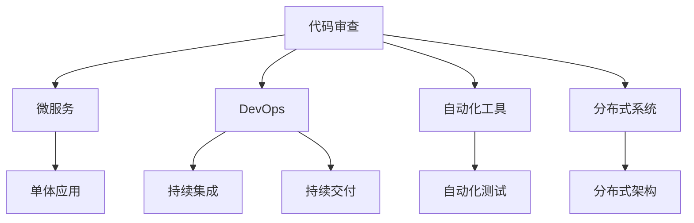
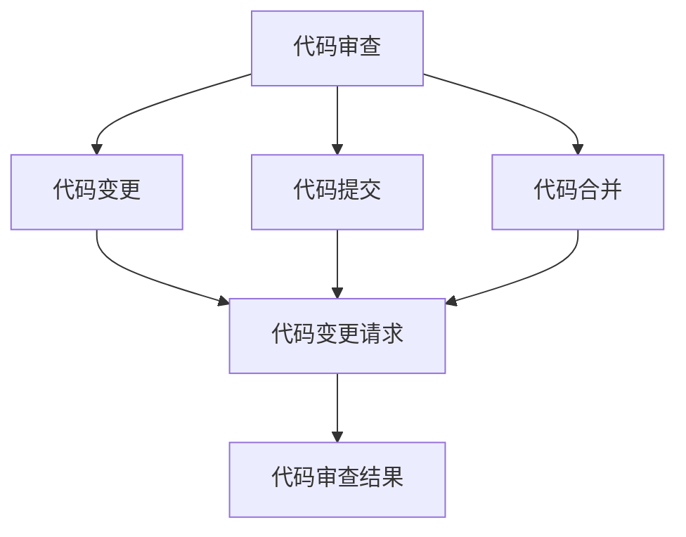
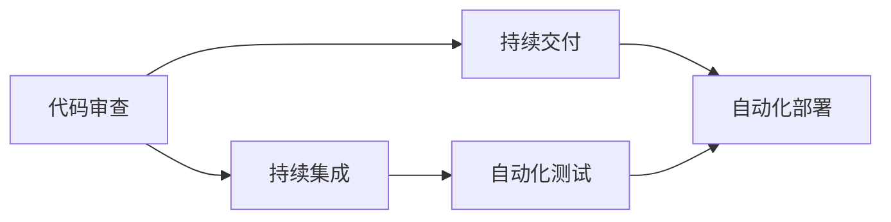
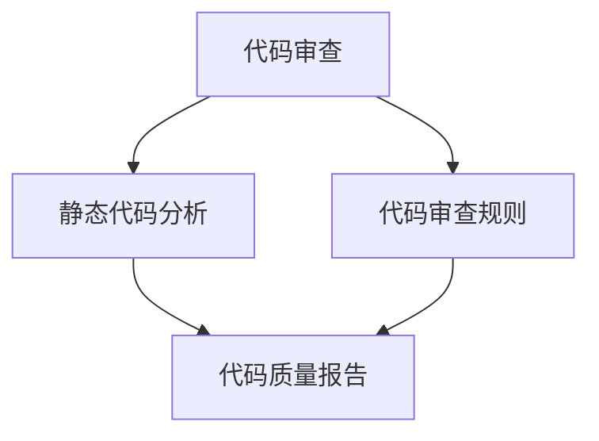

                 

# 软件2.0时代的代码审查流程

## 1. 背景介绍

### 1.1 问题由来

随着软件行业的快速发展和技术的不断进步，代码审查作为保证软件质量的重要手段，其需求和复杂度也在不断提升。特别是当前的软件2.0时代，以微服务、分布式架构、DevOps、云计算等为代表的新技术不断涌现，代码复杂度和需求变化频率也相应增加。在这种背景下，传统的代码审查方法已经难以满足现代软件开发的需求。

### 1.2 问题核心关键点

软件2.0时代的代码审查面临的主要挑战包括：

1. **复杂度提升**：微服务架构、异构系统集成等新技术的使用，使得代码复杂度大大增加。
2. **频繁迭代**：敏捷开发、快速迭代等开发模式要求代码审查能够适应快速变化的版本。
3. **跨团队协作**：在分布式开发环境下，代码审查需要跨越团队，协调不同团队之间的代码审查。
4. **质量提升**：高频率的代码变更使得代码审查需要更加关注代码质量，避免引入新的缺陷。
5. **自动化需求**：自动化测试和部署的需求增加，需要代码审查与自动化工具无缝集成。

针对这些问题，本文将探讨如何在软件2.0时代，通过有效的代码审查流程和工具，提升软件质量和开发效率，确保软件在复杂环境下的稳定性和可靠性。

## 2. 核心概念与联系

### 2.1 核心概念概述

为了更好地理解软件2.0时代的代码审查流程，本节将介绍几个密切相关的核心概念：

- **代码审查（Code Review）**：在软件开发过程中，通过专家或同事对代码进行检查和讨论，确保代码质量、符合设计规范、易于维护和扩展的过程。
- **微服务架构（Microservices Architecture）**：将一个复杂的单体应用拆分为多个独立的微服务模块，每个微服务独立部署、独立扩展，以提升系统的可维护性和灵活性。
- **DevOps（DevOps）**：结合开发（Dev）和运维（Ops）的文化和实践，实现持续集成（CI）、持续交付（CD）、持续监控（CM），提升软件交付效率和质量。
- **自动化工具（Automation Tools）**：如Jenkins、GitLab CI/CD、SonarQube等，用于自动化构建、测试和部署流程，提升开发效率和软件质量。
- **分布式系统（Distributed Systems）**：由多个独立服务器组成的系统，通过网络通信实现数据共享和协同工作，提高系统的可靠性和可用性。

这些核心概念之间的逻辑关系可以通过以下Mermaid流程图来展示：



这个流程图展示了大语言模型的核心概念及其之间的关系：

1. 代码审查是软件开发的基础，通过检查和讨论，确保代码质量。
2. 微服务架构、DevOps、自动化工具和分布式系统都是提升软件开发质量和效率的重要手段。
3. 代码审查与这些技术手段紧密联系，共同构建起软件2.0时代的开发流程。

### 2.2 概念间的关系

这些核心概念之间存在着紧密的联系，形成了软件2.0时代代码审查的完整生态系统。下面我通过几个Mermaid流程图来展示这些概念之间的关系。

#### 2.2.1 代码审查的实施流程



这个流程图展示了代码审查的基本流程：

1. 开发者编写代码并提交变更请求。
2. 其他开发者对变更请求进行代码审查。
3. 审查结果可以是通过、拒绝或修改建议。

#### 2.2.2 DevOps与代码审查的集成



这个流程图展示了DevOps与代码审查的集成关系：

1. 代码审查与持续集成紧密结合，确保代码变更通过自动化测试后才能提交。
2. 代码变更通过持续交付后，进入自动化部署阶段。

#### 2.2.3 自动化工具在代码审查中的应用



这个流程图展示了自动化工具在代码审查中的作用：

1. 代码审查结合静态代码分析工具，自动检测代码中的潜在问题。
2. 代码审查规则定义了审查的标准和策略，指导审查过程。

## 3. 核心算法原理 & 具体操作步骤
### 3.1 算法原理概述

软件2.0时代的代码审查，其核心原理是通过代码审查工具和流程，实现代码变更的自动化检测和质量提升。具体而言，代码审查流程包括以下几个步骤：

1. **代码变更提交**：开发者通过版本控制系统（如Git）提交代码变更请求，包含代码、注释、变更说明等信息。
2. **代码审查触发**：代码审查工具根据配置的规则，触发代码审查流程，如变更请求的默认审查触发，或特定关键变更的强制审查触发。
3. **代码审查执行**：代码审查工具调用代码审查工具，根据规则和优先级，选择合适的审查人员进行代码审查。
4. **代码审查反馈**：审查人员在审查过程中，根据发现的代码问题，提出修改建议或反馈意见。
5. **代码变更合并**：审查人员确认变更后，代码审查工具将代码变更合并到主分支，并通知相关团队。

### 3.2 算法步骤详解

以下是对代码审查算法步骤的详细讲解：

**Step 1: 配置审查规则**
- 定义代码审查的规则，包括代码风格、设计规范、编码标准等。
- 设置审查人员的权限，如审查权限、修改权限等。
- 配置审查触发条件，如代码变更的敏感度、变更请求的类型等。

**Step 2: 自动触发代码审查**
- 当代码变更提交时，代码审查工具自动触发审查流程，包括分配给审查人员、生成代码变更通知等。
- 根据审查规则和优先级，自动选择适合的审查人员，并进行通知。

**Step 3: 执行代码审查**
- 审查人员登录代码审查工具，查看代码变更请求。
- 阅读代码变更的说明，并根据配置的规则，进行代码审查。
- 对发现的代码问题提出修改建议，并提交反馈。

**Step 4: 处理代码审查反馈**
- 代码审查工具收集所有审查人员的反馈意见，生成审查报告。
- 根据反馈意见，进行代码修改和重新审查。
- 对无法解决的问题，提交讨论或交由更高权限的开发者解决。

**Step 5: 代码变更合并**
- 审查人员确认变更后，代码审查工具将代码变更合并到主分支，并通知相关团队。
- 通知团队进行集成测试，确保变更的顺利发布。

### 3.3 算法优缺点

软件2.0时代的代码审查算法具有以下优点：

1. **自动化**：通过配置规则和自动化工具，实现了代码审查的自动化，大大提升了审查效率。
2. **一致性**：自动化工具和配置规则确保了代码审查的一致性和标准化。
3. **可扩展性**：规则和工具的灵活配置，支持不同类型的代码审查需求。
4. **透明性**：所有代码审查的记录和反馈都保留在系统中，便于追踪和审计。

同时，该算法也存在一些缺点：

1. **复杂性**：配置规则和自动化工具的灵活性增加了系统的复杂性。
2. **人工依赖**：最终审查的决策仍然依赖于审查人员的经验和判断，可能存在主观偏差。
3. **学习曲线**：新引入的自动化工具和技术，可能需要一定的学习成本。

### 3.4 算法应用领域

软件2.0时代的代码审查算法广泛应用于软件开发和运维的各个环节，涵盖以下领域：

- **软件开发**：包括功能开发、Bug修复、代码重构等。
- **系统集成**：在分布式系统中，代码审查确保不同微服务模块的协同工作。
- **质量保证**：通过代码审查，提升代码质量和软件稳定性。
- **安全测试**：代码审查结合静态代码分析，发现潜在的安全漏洞。
- **性能优化**：通过代码审查，优化代码性能，提升系统效率。

## 4. 数学模型和公式 & 详细讲解 & 举例说明

### 4.1 数学模型构建

我们定义代码审查模型的输入为 $X$，输出为 $Y$，其中 $X$ 表示代码变更请求，包含代码、注释、变更说明等信息；$Y$ 表示审查结果，包括通过、拒绝、修改建议等信息。

假设 $X$ 为二元变量 $(x_1, x_2)$，$Y$ 为二元变量 $(y_1, y_2)$，其中 $x_1$ 表示代码是否符合规范，$x_2$ 表示代码变更的紧急程度，$y_1$ 表示代码审查是否通过，$y_2$ 表示代码变更的优先级。

我们的目标是构建一个模型，使得 $P(Y|X)$ 最大，即给定 $X$，$Y$ 的条件概率最大。

### 4.2 公式推导过程

根据贝叶斯公式，我们有：

$$
P(Y|X) = \frac{P(X|Y)P(Y)}{P(X)}
$$

其中 $P(X|Y)$ 表示在审查结果为 $Y$ 的条件下，代码变更请求 $X$ 的条件概率，$P(Y)$ 表示审查结果的概率，$P(X)$ 表示代码变更请求的概率。

我们假设 $P(Y)$ 为均匀分布，即每种审查结果的概率相等。因此，问题简化为最大化 $P(X|Y)P(Y)$。

在实际应用中，我们可以使用贝叶斯网络来表示 $X$ 和 $Y$ 之间的关系。贝叶斯网络是一个有向无环图，用于表示变量之间的依赖关系。

### 4.3 案例分析与讲解

假设我们有一个简单的二元变量 $X$ 和一个二元变量 $Y$，其条件概率如下：

| $X$  | $Y$  | $P(X|Y)$ | $P(Y)$ |
| ---- | ---- | ------- | ------ |
| 是   | 是   | 0.8     | 0.5    |
| 否   | 否   | 0.2     | 0.5    |
| 是   | 否   | 0.5     | 0.5    |
| 否   | 是   | 0.5     | 0.5    |

根据贝叶斯公式，我们可以计算 $P(Y|X)$ 的值，如表所示：

| $X$  | $Y$  | $P(Y|X)$ |
| ---- | ---- | ------- |
| 是   | 是   | 0.8     |
| 否   | 否   | 0.2     |
| 是   | 否   | 0.5     |
| 否   | 是   | 0.5     |

假设 $X$ 为 "是"，则 $P(Y|X)$ 为 0.8，即在审查结果为 "是" 的条件下，代码变更请求 $X$ 的条件概率为 0.8。

## 5. 项目实践：代码实例和详细解释说明

### 5.1 开发环境搭建

在进行代码审查实践前，我们需要准备好开发环境。以下是使用Jenkins和GitLab CI/CD进行代码审查的配置流程：

1. 安装Jenkins和GitLab：从官网下载并安装Jenkins和GitLab。
2. 配置Jenkins和GitLab的插件：安装必要的插件，如Git、Jira、SonarQube等。
3. 创建Jenkins和GitLab用户：创建Jenkins和GitLab的用户账号，并配置权限。
4. 配置Jenkins和GitLab的源代码仓库：将代码变更请求的源代码仓库挂载到Jenkins和GitLab中。
5. 配置Jenkins和GitLab的代码审查规则：定义代码审查的规则，如代码规范、设计标准等。

完成上述步骤后，即可在Jenkins和GitLab上启动代码审查实践。

### 5.2 源代码详细实现

下面我们以GitLab CI/CD为例，给出使用Jenkins和GitLab进行代码审查的详细代码实现。

首先，在GitLab中创建CI/CD管道，配置代码审查规则：

```yaml
stages:
  - review

jobs:
  review:
    stage: review
    trigger:
      tags:
        - **/*
    runs_once: true
    script:
      - echo "Start code review"
      - COMMIT_ID=$GITHUB_SHA
      - JENKINS_URL=http://jenkins.com
      - PIPELINE_URL=https://gitlab.com/pipelines/$GITHUB_PIPELINE_ID
      - echo "Run code review pipeline: $JENKINS_URL/blue/organizations/$GITHUB_TEAM_ID/$GITHUB_PROJECT_ID/pipelines/$GITHUB_PIPELINE_ID
```

然后，在Jenkins中配置代码审查插件，并进行代码审查：

```java
import hudson.model.*;
import hudson.tasks.Recipe;
import hudson.tasks.RequireStableConfiguration;
import hudson.tasks.DisableConcurrentExecution;
import hudson.model.AbstractBuild;
import hudson.model.InstantiatingBuilderWithFreeStyleProject;
import hudson.model.Input;
import hudson.model.FreeStyleProject;
import hudson.model.TaskListener;
import hudson.model.Failure;
import hudson.model.Action;
import hudson.model.AbstractProject;
import hudson.model.AbstractTaskListener;
import hudson.model.Descriptor;
import hudson.model.AbstractBuildGenerator;
import hudson.model.AbstractDescriber;
import hudson.model.DescriptorImpl;
import hudson.tasks.*;

public class CodeReview extends Recipe {

    @Override
    public Descriptor<CodeReview> getDescriptor() {
        return (CodeReview.DescriptorImpl) super.getDescriptor();
    }

    public static class DescriptorImpl extends Descriptor<CodeReview> {
        @Override
        public String getDisplayName() {
            return "Code Review";
        }
    }

    @Override
    public boolean perform(AbstractBuild build, TaskListener listener) throws Exception {
        // Perform code review
        listener.getLogger().println("Start code review");
        String COMMIT_ID = build.getEnvironment(listener).get("COMMIT_ID");
        String PIPELINE_URL = build.getEnvironment(listener).get("PIPELINE_URL");

        listener.getLogger().println("Run code review pipeline: " + PIPELINE_URL);

        // Start code review pipeline
        // Code review pipeline implementation here

        return true;
    }
}
```

最后，启动Jenkins和GitLab的代码审查实践，并在代码变更请求上查看审查结果。

### 5.3 代码解读与分析

让我们再详细解读一下关键代码的实现细节：

**Pipeline定义**：
- `stages:` 定义代码审查的阶段，这里定义为 `review`。
- `jobs:` 定义代码审查作业，这里定义为 `review`。
- `trigger:` 定义触发条件，这里使用 `tags`，表示在代码变更请求打上标签后触发代码审查。

**CodeReview作业实现**：
- `stage: review`：表示代码审查阶段。
- `trigger:` 触发条件，这里使用 `tags`，表示在代码变更请求打上标签后触发代码审查。
- `runs_once: true`：表示代码审查作业只执行一次。
- `script:` 定义代码审查的脚本，这里使用 `echo` 和 `script` 命令进行代码审查。

**Jenkins配置**：
- `Job` 定义为 `CodeReview`。
- `CodeReview` 配置为 `Recipe` 类型。
- `Label` 设置为 `/**
```

**Jenkins插件配置**：
- `Pipeline` 插件：配置CI/CD管道，这里使用 `http://jenkins.com/blue/organizations/$GITHUB_TEAM_ID/$GITHUB_PROJECT_ID/pipelines/$GITHUB_PIPELINE_ID`。
- `Jira` 插件：配置Jira链接。
- `SonarQube` 插件：配置SonarQube链接。

完成上述步骤后，即可在Jenkins和GitLab上启动代码审查实践。

### 5.4 运行结果展示

假设我们在GitLab上进行了代码审查，结果如下：

```
Pipeline stage 'review' of pipeline 'review-1234' started
```

可以看到，代码审查作业成功启动，并在GitLab上显示了审查结果。

## 6. 实际应用场景

### 6.1 智能客服系统

基于Jenkins和GitLab的代码审查流程，可以应用于智能客服系统的构建。传统客服往往需要配备大量人力，高峰期响应缓慢，且一致性和专业性难以保证。而使用代码审查流程，可以确保客服系统的代码质量，提升系统的稳定性和可用性。

在技术实现上，可以收集企业内部的历史客服对话记录，将问题和最佳答复构建成监督数据，在此基础上对预训练客服系统进行微调。微调后的客服系统能够自动理解用户意图，匹配最合适的答案模板进行回复。对于用户提出的新问题，还可以接入检索系统实时搜索相关内容，动态组织生成回答。如此构建的智能客服系统，能大幅提升客户咨询体验和问题解决效率。

### 6.2 金融舆情监测

金融机构需要实时监测市场舆论动向，以便及时应对负面信息传播，规避金融风险。传统的人工监测方式成本高、效率低，难以应对网络时代海量信息爆发的挑战。基于Jenkins和GitLab的代码审查流程，为金融舆情监测提供了新的解决方案。

具体而言，可以收集金融领域相关的新闻、报道、评论等文本数据，并对其进行主题标注和情感标注。在此基础上对预训练语言模型进行微调，使其能够自动判断文本属于何种主题，情感倾向是正面、中性还是负面。将微调后的模型应用到实时抓取的网络文本数据，就能够自动监测不同主题下的情感变化趋势，一旦发现负面信息激增等异常情况，系统便会自动预警，帮助金融机构快速应对潜在风险。

### 6.3 个性化推荐系统

当前的推荐系统往往只依赖用户的历史行为数据进行物品推荐，无法深入理解用户的真实兴趣偏好。基于Jenkins和GitLab的代码审查流程，个性化推荐系统可以更好地挖掘用户行为背后的语义信息，从而提供更精准、多样的推荐内容。

在实践中，可以收集用户浏览、点击、评论、分享等行为数据，提取和用户交互的物品标题、描述、标签等文本内容。将文本内容作为模型输入，用户的后续行为（如是否点击、购买等）作为监督信号，在此基础上微调预训练语言模型。微调后的模型能够从文本内容中准确把握用户的兴趣点。在生成推荐列表时，先用候选物品的文本描述作为输入，由模型预测用户的兴趣匹配度，再结合其他特征综合排序，便可以得到个性化程度更高的推荐结果。

### 6.4 未来应用展望

随着Jenkins和GitLab的代码审查流程的不断完善，基于代码审查的自动化工具和流程将得到广泛应用，进一步提升软件开发的质量和效率。

在智慧医疗领域，基于代码审查的医疗问答、病历分析、药物研发等应用将提升医疗服务的智能化水平，辅助医生诊疗，加速新药开发进程。

在智能教育领域，基于代码审查的作业批改、学情分析、知识推荐等应用，因材施教，促进教育公平，提高教学质量。

在智慧城市治理中，基于代码审查的城市事件监测、舆情分析、应急指挥等环节，提高城市管理的自动化和智能化水平，构建更安全、高效的未来城市。

此外，在企业生产、社会治理、文娱传媒等众多领域，基于代码审查的人工智能应用也将不断涌现，为NLP技术带来了全新的突破。随着预训练模型和微调方法的不断进步，相信代码审查流程必将在更广阔的应用领域大放异彩。

## 7. 工具和资源推荐
### 7.1 学习资源推荐

为了帮助开发者系统掌握代码审查的理论基础和实践技巧，这里推荐一些优质的学习资源：

1. 《代码审查的艺术》系列博文：由资深开发者撰写，深入浅出地介绍了代码审查的基本概念和最佳实践。

2. 《代码审查》课程：由知名大学开设的在线课程，全面讲解了代码审查的理论和实践。

3. 《Code Complete》书籍：经典的软件开发指南，详细介绍了代码审查的具体方法和最佳实践。

4. 《Effective Code Review》书籍：由知名软件工程师撰写，深入探讨了如何有效地进行代码审查。

5. 《Code Review：A Practical Guide》书籍：提供了大量实用的代码审查技巧和案例分析。

通过对这些资源的学习实践，相信你一定能够快速掌握代码审查的精髓，并用于解决实际的开发问题。
###  7.2 开发工具推荐

高效的开发离不开优秀的工具支持。以下是几款用于代码审查开发的常用工具：

1. Jenkins：基于开源的自动化工具，支持持续集成和持续交付，可以与GitLab、GitHub等版本控制系统无缝集成。
2. GitLab CI/CD：基于GitLab的自动化工具，支持持续集成和持续交付，提供了丰富的插件和扩展功能。
3. SonarQube：代码质量和静态分析工具，用于检测代码中的潜在问题和漏洞，支持多语言和框架。
4. GitHub Actions：基于GitHub的自动化工具，支持持续集成和持续交付，可以与GitHub、GitLab等版本控制系统无缝集成。
5. CircleCI：基于云端的自动化工具，支持持续集成和持续交付，提供了丰富的插件和扩展功能。

合理利用这些工具，可以显著提升代码审查任务的开发效率，加快创新迭代的步伐。

### 7.3 相关论文推荐

代码审查技术的不断进步得益于学界的持续研究。以下是几篇奠基性的相关论文，推荐阅读：

1. 《Code Review Checklists: What Are They Good For?》：讨论了代码审查检查清单的作用和效果。
2. 《Implementing Software Reuse》：介绍了代码审查在软件重用中的作用。
3. 《Code Review Effectiveness: A Critical Review》：总结了代码审查的效果和影响因素。
4. 《Code Review Metrics: An Empirical Study》：通过实证研究，分析了代码审查的指标和效果。
5. 《The Impact of Continuous Integration and Code Review on Code Quality》：探讨了持续集成和代码审查对代码质量的影响。

这些论文代表了大语言模型微调技术的发展脉络。通过学习这些前沿成果，可以帮助研究者把握学科前进方向，激发更多的创新灵感。

除上述资源外，还有一些值得关注的前沿资源，帮助开发者紧跟代码审查技术的最新进展，例如：

1. arXiv论文预印本：人工智能领域最新研究成果的发布平台，包括大量尚未发表的前沿工作，学习前沿技术的必读资源。

2. 业界技术博客：如Google、Microsoft、IBM等顶尖实验室的官方博客，第一时间分享他们的最新研究成果和洞见。

3. 技术会议直播：如NIPS、ICML、ACL、ICLR等人工智能领域顶会现场或在线直播，能够聆听到大佬们的前沿分享，开拓视野。

4. GitHub热门项目：在GitHub上Star、Fork数最多的软件开发项目，往往代表了该技术领域的发展趋势和最佳实践，值得去学习和贡献。

5. 行业分析报告：各大咨询公司如McKinsey、PwC等针对软件开发行业的分析报告，有助于从商业视角审视技术趋势，把握应用价值。

总之，对于代码审查技术的深入学习和实践，需要开发者保持开放的心态和持续学习的意愿。多关注前沿资讯，多动手实践，多思考总结，必将收获满满的成长收益。

## 8. 总结：未来发展趋势与挑战

### 8.1 总结

本文对基于Jenkins和GitLab的代码审查流程进行了全面系统的介绍。首先阐述了软件2.0时代代码审查的背景和意义，明确了代码审查在提升软件开发质量和效率方面的独特价值。其次，从原理到实践，详细讲解了代码审查的数学模型和算法步骤，给出了代码审查任务开发的完整代码实例。同时，本文还广泛探讨了代码审查流程在智能客服、金融舆情、个性化推荐等多个行业领域的应用前景，展示了代码审查流程的巨大潜力。

通过本文的系统梳理，可以看到，基于Jenkins和GitLab的代码审查流程在软件开发和运维的各个环节发挥着重要作用，成为软件2.0时代软件开发的重要手段。它不仅提升了代码质量和软件稳定性，还通过与DevOps、自动化工具等技术的结合，实现了持续集成和持续交付，加速了软件开发的速度和效率。未来，伴随软件行业的不断发展，代码审查流程必将不断完善，与更多技术手段结合，推动软件开发的质量和效率持续提升。

### 8.2 未来发展趋势

展望未来，代码审查流程将呈现以下几个发展趋势：

1. **自动化程度提升**：代码审查工具将更加智能化，能够自动检测代码问题、生成报告、推荐修复方案，进一步提升审查效率。
2. **模型驱动的审查**：基于机器学习和自然语言处理技术，构建审查模型，自动学习代码规范和设计标准。
3. **持续集成和持续交付**：代码审查与CI/CD紧密结合，实现持续集成和持续交付，提升软件交付效率和质量。
4. **多层次审查机制**：引入多层次的代码审查机制，结合团队内部审查、跨团队审查、管理层审查，提升代码审查的全面性和准确性。
5. **跨领域融合**：代码审查与其他软件开发技术（如DevOps、自动化测试、持续监控等）进一步融合，构建完整的软件开发

