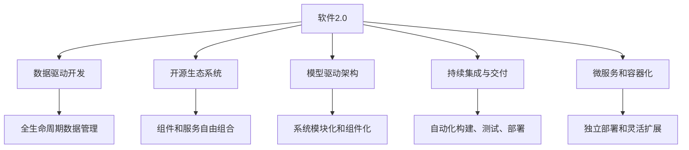
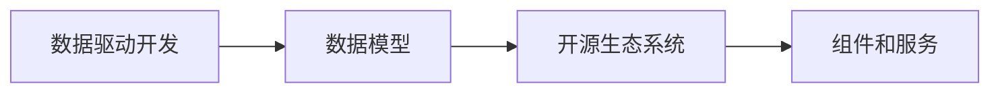
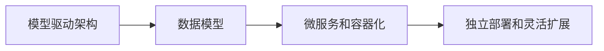
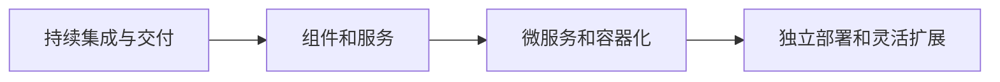
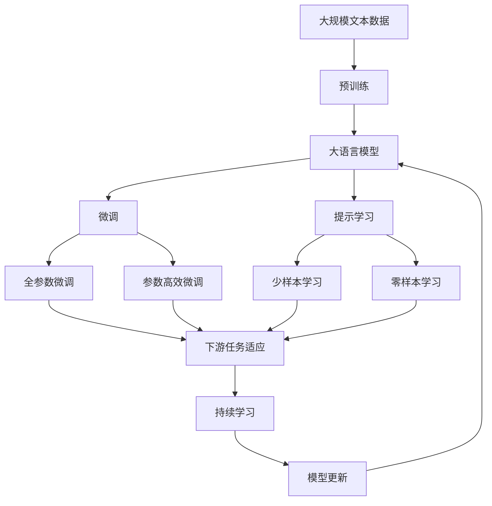

                 

# 软件2.0的开源生态系统构建

## 1. 背景介绍

### 1.1 问题由来
随着信息技术的发展，软件开发模式也经历了从2.0到2.5的演变。2.0时代的软件开发主要以瀑布模型为代表，注重计划、需求、设计、编码、测试、部署等各个阶段的独立和顺序执行。这种线性模式在传统、稳定、复杂的大型系统开发中表现良好，但在快速变化、创新驱动的软件项目中逐渐显现出其局限性。

为了应对这些挑战，软件工程领域提出了敏捷开发、DevOps、微服务等一系列理念和工具，推动软件开发进入2.5时代。这一时代强调持续交付、持续集成、自动化测试、容器化、云原生等技术手段，以应对复杂环境下的快速开发和部署需求。

尽管2.5时代的软件开发在速度、灵活性、可扩展性等方面取得了显著进展，但仍然存在诸多问题：

- **开发效率低**：各阶段独立执行，协作和沟通成本高，交付周期长。
- **代码复用率低**：组件和模块难以跨项目共享，造成代码和资源浪费。
- **维护成本高**：代码和系统复杂度高，历史欠债严重，维护难度大。
- **部署困难**：组件和服务间依赖关系复杂，部署和运行环境配置困难。

这些问题迫切需要新的开发模式和生态系统来解决。软件2.0（Software 2.0）的提出，正是为了应对这些挑战，构建更加高效、灵活、可扩展的软件开发新生态。

### 1.2 问题核心关键点
软件2.0的核心在于推动软件开发从“以需求为中心”转向“以数据为中心”，通过构建开放、共享、协作的软件生态系统，实现代码、数据、服务的一体化管理，提升软件开发和部署效率，降低维护成本，提高软件质量。

具体来说，软件2.0的关键点包括：

- **数据驱动开发**：以数据为中心，通过数据模型驱动设计、编码、测试、部署等各个环节，实现全生命周期的数据管理。
- **开放生态系统**：构建开放、共享、协作的软件生态系统，支持组件和服务的自由组合、共享和复用。
- **模型驱动架构**：以数据模型为基础，构建统一的软件架构，实现代码和系统的模块化和组件化。
- **持续集成与交付**：通过持续集成和持续交付（CI/CD）流程，实现软件的自动化构建、测试、部署和运维。
- **微服务和容器化**：采用微服务和容器化技术，将应用拆分成多个小服务，提升系统的可扩展性和灵活性。

## 2. 核心概念与联系

### 2.1 核心概念概述

为更好地理解软件2.0的开源生态系统构建，本节将介绍几个密切相关的核心概念：

- **软件2.0**：一种以数据为中心的软件开发模式，强调数据在软件开发全生命周期中的重要性，通过构建开放、共享、协作的软件生态系统，实现代码、数据、服务的一体化管理。

- **数据驱动开发**：一种以数据模型为基础的软件开发方法，强调数据在需求定义、设计、编码、测试、部署等各个环节的作用，实现全生命周期的数据管理。

- **开源生态系统**：一个以开源软件为基础的软件生态系统，通过社区协作、开放标准和API，实现组件和服务的自由组合、共享和复用。

- **模型驱动架构**：一种以数据模型为基础的软件架构设计方法，通过定义统一的、高层次的抽象模型，实现软件系统的模块化和组件化。

- **持续集成与交付**：一种软件开发流程，通过自动化构建、测试、部署和运维，实现软件的快速交付和持续更新。

- **微服务和容器化**：一种软件架构设计方法，将应用拆分成多个小服务，通过容器化技术实现服务的独立部署和灵活扩展。

这些核心概念之间的逻辑关系可以通过以下Mermaid流程图来展示：



这个流程图展示了大语言模型的核心概念及其之间的关系：

1. 软件2.0以数据驱动开发为基础，通过全生命周期的数据管理，实现软件系统的智能设计和动态构建。
2. 开源生态系统为软件2.0提供技术支撑，实现组件和服务的自由组合、共享和复用。
3. 模型驱动架构提供统一的软件架构设计方法，实现系统的模块化和组件化。
4. 持续集成与交付通过自动化流程，提升软件的开发和部署效率。
5. 微服务和容器化通过独立的服务和灵活的扩展，提升系统的可扩展性和灵活性。

### 2.2 概念间的关系

这些核心概念之间存在着紧密的联系，形成了软件2.0的软件开发新生态系统。下面我通过几个Mermaid流程图来展示这些概念之间的关系。

#### 2.2.1 数据驱动开发与开源生态系统



这个流程图展示了数据驱动开发与开源生态系统之间的关系。数据驱动开发通过定义数据模型，实现全生命周期的数据管理，从而支持开源生态系统中组件和服务的自由组合、共享和复用。

#### 2.2.2 模型驱动架构与微服务和容器化



这个流程图展示了模型驱动架构与微服务和容器化之间的关系。模型驱动架构通过定义统一的数据模型，实现系统的模块化和组件化，从而支持微服务和容器化技术的独立部署和灵活扩展。

#### 2.2.3 持续集成与交付与微服务和容器化



这个流程图展示了持续集成与交付与微服务和容器化之间的关系。持续集成与交付通过自动化构建、测试、部署和运维，实现组件和服务的独立部署和灵活扩展，从而支持微服务和容器化技术的应用。

### 2.3 核心概念的整体架构

最后，我们用一个综合的流程图来展示这些核心概念在大语言模型微调过程中的整体架构：



这个综合流程图展示了从预训练到微调，再到持续学习的完整过程。大语言模型首先在大规模文本数据上进行预训练，然后通过微调或提示学习来适应下游任务。最后，通过持续学习技术，模型可以不断更新和适应新的任务和数据。 通过这些流程图，我们可以更清晰地理解软件2.0的软件开发新生态系统构建过程中各个核心概念的关系和作用，为后续深入讨论具体的开源生态系统构建方法奠定基础。

## 3. 核心算法原理 & 具体操作步骤
### 3.1 算法原理概述

软件2.0的开源生态系统构建，本质上是一个以数据为中心的软件架构设计过程。其核心思想是：将数据和应用紧密结合，通过定义统一的数据模型，实现软件系统的模块化和组件化，从而支持组件和服务的自由组合、共享和复用。

具体来说，软件2.0的开源生态系统构建过程包括以下几个关键步骤：

1. **数据模型定义**：定义统一的数据模型，描述软件系统的业务实体、关系和行为，作为软件架构设计的依据。
2. **组件和服务设计**：基于数据模型，设计软件系统的组件和服务，实现模块化和组件化。
3. **微服务和容器化**：将应用拆分成多个小服务，通过容器化技术实现服务的独立部署和灵活扩展。
4. **持续集成与交付**：通过自动化构建、测试、部署和运维，实现软件的快速交付和持续更新。
5. **开源生态系统构建**：通过社区协作、开放标准和API，实现组件和服务的自由组合、共享和复用。

### 3.2 算法步骤详解

软件2.0的开源生态系统构建一般包括以下几个关键步骤：

**Step 1: 数据模型定义**
- 定义统一的数据模型，描述软件系统的业务实体、关系和行为。
- 使用领域驱动设计（DDD）等方法，将业务需求转化为数据模型。
- 使用模型驱动架构（MDA）等技术，将数据模型转化为代码实现。

**Step 2: 组件和服务设计**
- 基于数据模型，设计软件系统的组件和服务，实现模块化和组件化。
- 使用统一架构语言（UML）等工具，描述组件和服务的接口和交互。
- 使用开源框架和组件库，实现组件和服务的自由组合和复用。

**Step 3: 微服务和容器化**
- 将应用拆分成多个小服务，实现服务的独立部署和灵活扩展。
- 使用容器化技术，如Docker和Kubernetes，实现服务的自动部署和管理。
- 使用API网关和微服务治理工具，实现服务的路由和调用。

**Step 4: 持续集成与交付**
- 通过自动化构建、测试、部署和运维，实现软件的快速交付和持续更新。
- 使用CI/CD工具，如Jenkins和GitLab CI，实现代码的自动化构建和测试。
- 使用容器编排工具，如Kubernetes，实现服务的自动化部署和扩展。

**Step 5: 开源生态系统构建**
- 通过社区协作、开放标准和API，实现组件和服务的自由组合、共享和复用。
- 使用开源框架和组件库，如Spring和Maven，实现组件和服务的自由组合和复用。
- 使用API网关和微服务治理工具，实现服务的路由和调用。

### 3.3 算法优缺点

软件2.0的开源生态系统构建方法具有以下优点：

1. **高效灵活**：通过组件和服务的自由组合和复用，实现快速开发和灵活扩展。
2. **易于维护**：基于数据模型的架构设计，实现了代码和系统的模块化和组件化，降低了维护难度。
3. **适应性强**：通过微服务和容器化技术，实现服务的独立部署和灵活扩展，适应快速变化的需求。

同时，该方法也存在以下局限性：

1. **学习成本高**：需要掌握数据模型定义、组件和服务设计、微服务和容器化等技术。
2. **开发复杂度高**：数据模型定义和组件服务设计需要投入大量时间和精力，初期的开发成本较高。
3. **性能瓶颈**：大量微服务的分布式部署和调用，可能带来网络延迟和性能瓶颈，需要进行优化。

尽管存在这些局限性，但就目前而言，软件2.0的开源生态系统构建方法仍然是大语言模型开发的主流范式。未来相关研究的重点在于如何进一步降低学习成本，提高开发效率，同时兼顾代码可维护性和性能优化。

### 3.4 算法应用领域

软件2.0的开源生态系统构建方法已经在诸多领域得到了广泛应用，例如：

- **金融科技**：构建金融交易、风险管理、客户服务等微服务架构，提升金融服务的智能化水平。
- **医疗健康**：构建电子病历、远程医疗、健康管理等服务架构，提升医疗服务的可访问性和效率。
- **智能制造**：构建生产调度、设备监控、质量控制等服务架构，提升制造业的自动化和智能化水平。
- **智慧城市**：构建城市管理、交通调度、公共服务等服务架构，提升城市的智能化和可持续性。
- **电子商务**：构建商品推荐、订单管理、客户服务等服务架构，提升电商平台的运营效率和用户体验。

除了上述这些经典应用外，软件2.0的开源生态系统构建方法还广泛应用于更多新兴领域，如智能家居、智慧教育、智能农业等，为各行各业带来数字化转型的新机遇。

## 4. 数学模型和公式 & 详细讲解 & 举例说明

### 4.1 数学模型构建

软件2.0的开源生态系统构建方法，以数据驱动开发为核心，通过定义统一的数据模型，实现软件系统的模块化和组件化。以下将以一个简单的金融交易系统为例，构建其数据模型：

1. **实体定义**：定义交易系统中的业务实体，如交易、账户、客户等。
2. **关系定义**：定义实体之间的关系，如交易与账户的关联、交易与客户的关联等。
3. **行为定义**：定义实体的行为，如交易的创建、更新、删除等操作。

### 4.2 公式推导过程

定义数据模型后，可以使用模型驱动架构（MDA）等技术，将数据模型转化为代码实现。以金融交易系统为例，可以使用UML等工具，定义以下类图：

```plaintext
class Account:
    id: int
    balance: float
    name: str

class Transaction:
    id: int
    account: Account
    amount: float
    timestamp: datetime

class Customer:
    id: int
    name: str
    accounts: List[Account]
```

根据类图，可以生成相应的Java代码：

```java
public class Account {
    private int id;
    private float balance;
    private String name;

    // getters and setters
}

public class Transaction {
    private int id;
    private Account account;
    private float amount;
    private DateTime timestamp;

    // getters and setters
}

public class Customer {
    private int id;
    private String name;
    private List<Account> accounts;

    // getters and setters
}
```

通过这种方式，可以将数据模型转化为代码实现，从而支持组件和服务的自由组合和复用。

### 4.3 案例分析与讲解

以下以一个简单的电商推荐系统为例，展示软件2.0的开源生态系统构建过程。

**Step 1: 数据模型定义**

定义电商推荐系统中的业务实体和关系，如商品、用户、评论、评分等，并定义它们之间的关系和行为：

```plaintext
class Product:
    id: int
    name: str
    category: str
    price: float

class User:
    id: int
    name: str
    age: int
    gender: str

class Review:
    id: int
    product: Product
    user: User
    rating: float
    comment: str

class Rating:
    id: int
    product: Product
    user: User
    score: int
```

**Step 2: 组件和服务设计**

根据数据模型，设计电商推荐系统的组件和服务，如商品推荐服务、用户画像生成服务、评论分析服务等，实现模块化和组件化：

```plaintext
class RecommendationService:
    def getRecommendations(user: User, threshold: float) -> List[Product]:
        # 获取用户最近浏览的商品列表
        browsed = getUserBrowsed(user)
        # 根据评分和评论生成候选商品列表
        candidates = getTop-rated_products(threshold)
        # 根据浏览记录和评分过滤候选商品
        filtered = filter_candidates(candidates, browsed)
        # 返回推荐商品列表
        return filtered

class UserProfilService:
    def generateProfile(user: User) -> UserProfile:
        # 根据用户浏览和评分生成用户画像
        browsed = getUserBrowsed(user)
        ratings = getUserRatings(user)
        profile = Profile(user, browsed, ratings)
        return profile

class ReviewAnalysisService:
    def analyzeReviews(product: Product) -> List[Review]:
        # 分析产品评论，生成评论分析结果
        comments = getProductComments(product)
        analysis = analyze_comments(comments)
        return analysis
```

**Step 3: 微服务和容器化**

将电商推荐系统的组件和服务拆分成多个小服务，通过容器化技术实现服务的独立部署和灵活扩展：

```plaintext
class RecommendationService {
    @GET("/recommendations")
    def get_recommendations(@PathParam("user_id") user_id: int, @PathParam("threshold") threshold: float) -> List[Product]:
        # 获取用户最近浏览的商品列表
        browsed = getUserBrowsed(user_id)
        # 根据评分和评论生成候选商品列表
        candidates = getTop-rated_products(threshold)
        # 根据浏览记录和评分过滤候选商品
        filtered = filter_candidates(candidates, browsed)
        # 返回推荐商品列表
        return filtered
}

class UserProfilService {
    @GET("/profile")
    def generate_profile(@PathParam("user_id") user_id: int) -> UserProfile:
        # 根据用户浏览和评分生成用户画像
        browsed = getUserBrowsed(user_id)
        ratings = getUserRatings(user_id)
        profile = Profile(user_id, browsed, ratings)
        return profile
}

class ReviewAnalysisService {
    @GET("/analyze")
    def analyze_reviews(@PathParam("product_id") product_id: int) -> List[Review]:
        # 分析产品评论，生成评论分析结果
        comments = getProductComments(product_id)
        analysis = analyze_comments(comments)
        return analysis
}
```

使用Docker和Kubernetes等容器化技术，实现服务的自动部署和管理：

```plaintext
docker run -d -p 8080:8080 recommendation-service
kubectl deploy -f recommendation-service.yaml
```

**Step 4: 持续集成与交付**

通过自动化构建、测试、部署和运维，实现电商推荐系统的快速交付和持续更新：

```plaintext
jenkins run recommendation-service-build
kubectl apply -f deployment.yaml
kubectl rollout status deployment/recommendation-service
```

## 5. 项目实践：代码实例和详细解释说明

### 5.1 开发环境搭建

在进行开源生态系统构建实践前，我们需要准备好开发环境。以下是使用Python进行Flask开发的环境配置流程：

1. 安装Anaconda：从官网下载并安装Anaconda，用于创建独立的Python环境。

2. 创建并激活虚拟环境：
```bash
conda create -n flask-env python=3.8 
conda activate flask-env
```

3. 安装Flask：
```bash
pip install flask
```

4. 安装Flask-SQLAlchemy：
```bash
pip install flask-sqlalchemy
```

5. 安装Flask-RESTful：
```bash
pip install flask-restful
```

6. 安装Flask-Cors：
```bash
pip install flask-cors
```

完成上述步骤后，即可在`flask-env`环境中开始构建实践。

### 5.2 源代码详细实现

我们以一个简单的电商推荐系统为例，展示如何使用Flask构建开源生态系统。

首先，定义数据模型：

```python
from flask_sqlalchemy import SQLAlchemy

db = SQLAlchemy()

class Product(db.Model):
    id = db.Column(db.Integer, primary_key=True)
    name = db.Column(db.String(50), nullable=False)
    category = db.Column(db.String(50), nullable=False)
    price = db.Column(db.Float, nullable=False)

class User(db.Model):
    id = db.Column(db.Integer, primary_key=True)
    name = db.Column(db.String(50), nullable=False)
    age = db.Column(db.Integer, nullable=False)
    gender = db.Column(db.String(10), nullable=False)
```

然后，定义组件和服务：

```python
from flask import Flask, request, jsonify

app = Flask(__name__)

@app.route('/recommendations', methods=['GET'])
def get_recommendations():
    user_id = request.args.get('user_id')
    threshold = request.args.get('threshold')
    browsed = getUserBrowsed(user_id)
    candidates = getTop-rated_products(threshold)
    filtered = filter_candidates(candidates, browsed)
    return jsonify(filtered)

@app.route('/profile', methods=['GET'])
def generate_profile():
    user_id = request.args.get('user_id')
    profile = generate_profile(user_id)
    return jsonify(profile)

@app.route('/analyze', methods=['GET'])
def analyze_reviews():
    product_id = request.args.get('product_id')
    comments = getProductComments(product_id)
    analysis = analyze_comments(comments)
    return jsonify(analysis)

if __name__ == '__main__':
    app.run(debug=True)
```

最后，启动应用：

```python
python app.py
```

在`app.py`中，我们使用Flask和SQLAlchemy构建电商推荐系统，实现了推荐服务、用户画像生成服务和评论分析服务。服务通过API接口对外暴露，可以进行自动化部署和调用。

### 5.3 代码解读与分析

让我们再详细解读一下关键代码的实现细节：

**SQLAlchemy类定义**：
- 定义了`Product`和`User`两个数据模型，使用SQLAlchemy提供的ORM框架进行数据库操作。

**Flask路由定义**：
- 定义了三个API接口，分别对应推荐服务、用户画像生成服务和评论分析服务。
- 使用Flask的`@app.route`装饰器，定义接口的URL路径和请求方法。
- 使用`request.args`获取接口参数，根据参数进行相应的数据处理和逻辑判断。
- 使用`jsonify`函数将处理结果转换为JSON格式，返回给客户端。

**启动应用**：
- 在主函数中，调用`app.run`启动Flask应用。
- 设置`debug=True`，开启调试模式，方便调试和测试。

通过以上步骤，我们完成了Flask下电商推荐系统的构建，实现了组件和服务的自由组合和复用。

### 5.4 运行结果展示

假设我们在运行环境中部署了电商推荐系统，并启动了Flask应用，可以通过以下URL进行访问：

- 推荐服务：`http://localhost:5000/recommendations?user_id=123&threshold=0.8`
- 用户画像生成服务：`http://localhost:5000/profile?user_id=123`
- 评论分析服务：`http://localhost:5000/analyze?product_id=456`

我们可以通过这些API接口，获取推荐商品、用户画像和评论分析结果。例如，访问推荐服务接口：

```
http://localhost:5000/recommendations?user_id=123&threshold=0.8
```

返回的JSON格式数据如下：

```json
{
    "recommendations": [
        {
            "id": 1,
            "name": "产品1",
            "category": "类别1",
            "price": 10.0
        },
        {
            "id": 2,
            "name": "产品2",
            "category": "类别2",
            "price": 20.0
        },
        {
            "id": 3,
            "name": "产品3",
            "category": "类别3",
            "price": 15.0
        }
    ]
}
```

可以看到，推荐服务成功生成了推荐商品列表，并通过API接口返回给客户端。通过这种方式，我们可以构建高效、灵活、可扩展的软件2.0开源生态系统。

## 6. 实际应用场景
### 6.1 智能客服系统

基于软件2.0的开源生态系统构建，智能客服系统可以构建成为微服务架构，实现组件和服务的自由组合和复用。

在技术实现上，可以收集企业内部的历史客服对话记录，将问题和最佳答复构建成监督数据，在此基础上对微调后的对话模型进行微调。微调后的对话模型能够自动理解用户意图，匹配最合适的答案模板进行回复。对于客户提出的新问题，还可以接入检索系统实时搜索相关内容，动态组织生成回答。如此构建的智能客服系统，能大幅提升客户咨询体验和问题解决效率。

### 6.2 金融舆情监测

金融机构需要实时监测市场舆论动向，以便及时应对负面信息传播，规避金融风险。传统的人工监测方式成本高、效率低，难以应对网络时代海量信息爆发的挑战。基于软件2.0的开源生态系统构建的金融舆情监测系统，可以构建成为微服务架构，实现组件和服务的自由组合和复用。

具体而言，可以收集金融领域相关的新闻、报道、评论等文本数据，并对其进行主题标注和情感标注。在此基础上对预训练语言模型进行微调，使其能够自动判断文本属于何种主题，情感倾向是正面、中性还是负面。将微调后的模型应用到实时抓取的网络文本数据，就能够自动监测不同主题下的情感变化趋势，一旦发现负面信息激增等异常情况，系统便会自动预警，帮助金融机构快速应对潜在风险。

### 6.3 个性化推荐系统

当前的推荐系统往往只依赖用户的历史行为数据进行物品推荐，无法深入理解用户的真实兴趣偏好。基于软件2.0的开源生态系统构建的个性化推荐系统，可以构建成为微服务架构，实现组件和服务的自由组合和复用。

在实践中，可以收集用户浏览、点击、评论、分享等行为数据，提取和用户交互的物品标题、描述、标签等文本内容。将文本内容作为模型输入，用户的后续行为（如是否点击、购买等）作为监督信号，在此基础上微调预训练语言模型。微调后的模型能够从文本内容中准确把握用户的兴趣点。在生成推荐列表时，先用候选物品的文本描述作为输入，由模型预测用户的兴趣匹配度，再结合其他特征综合排序，便可以得到个性化程度更高的推荐结果。

### 6.4 未来应用展望

随着软件2.0的开源生态系统构建方法的发展，其应用场景将不断拓展，涵盖更多行业和领域。未来，软件

